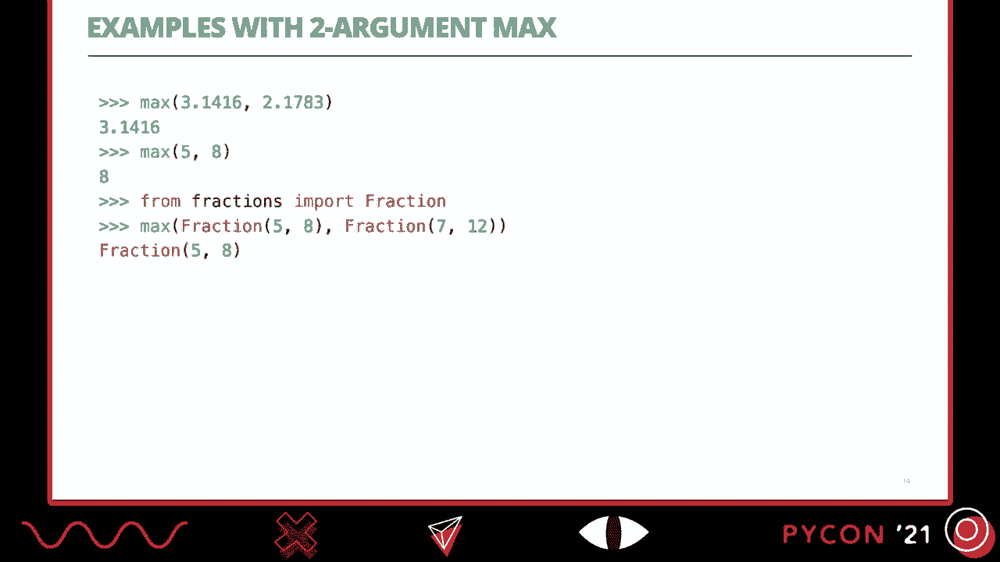
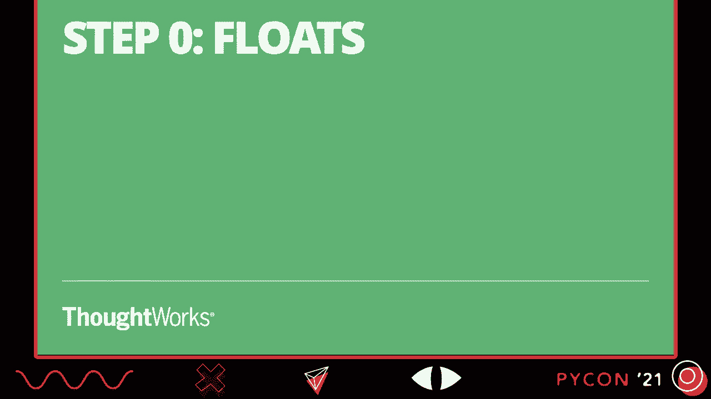
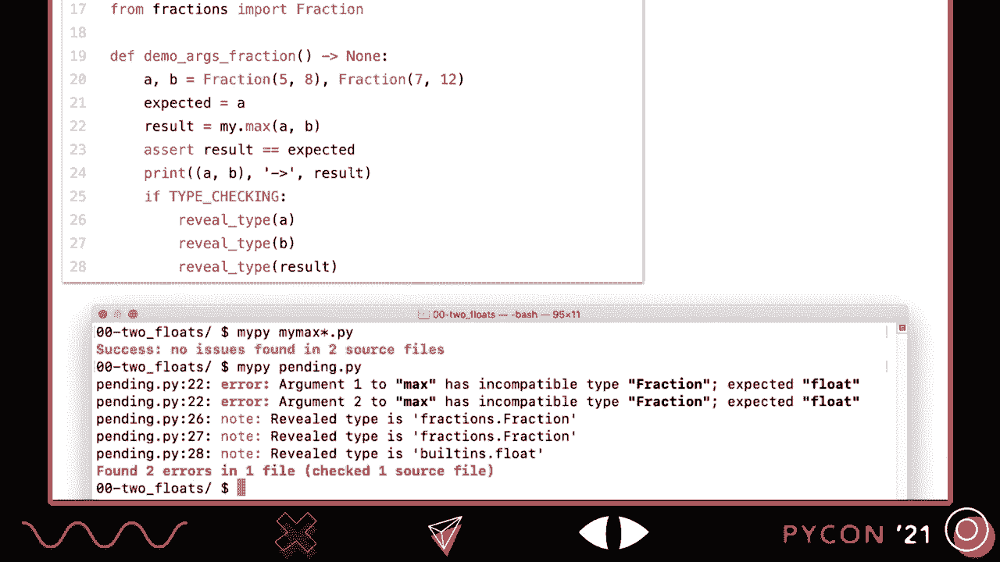
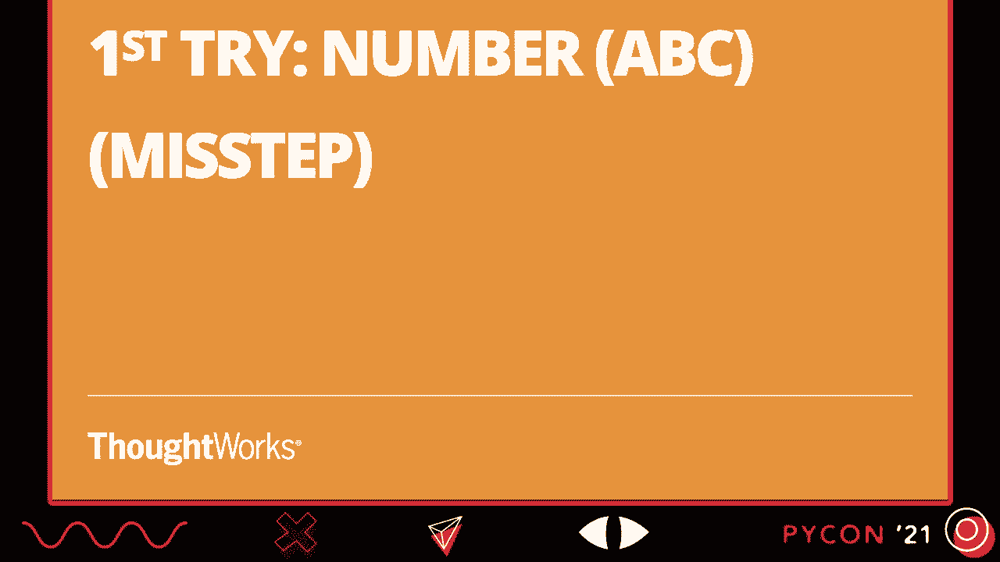
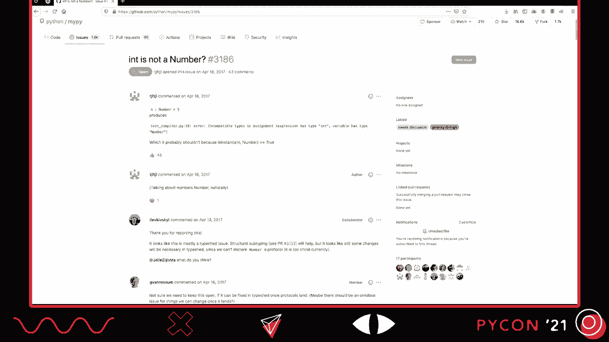
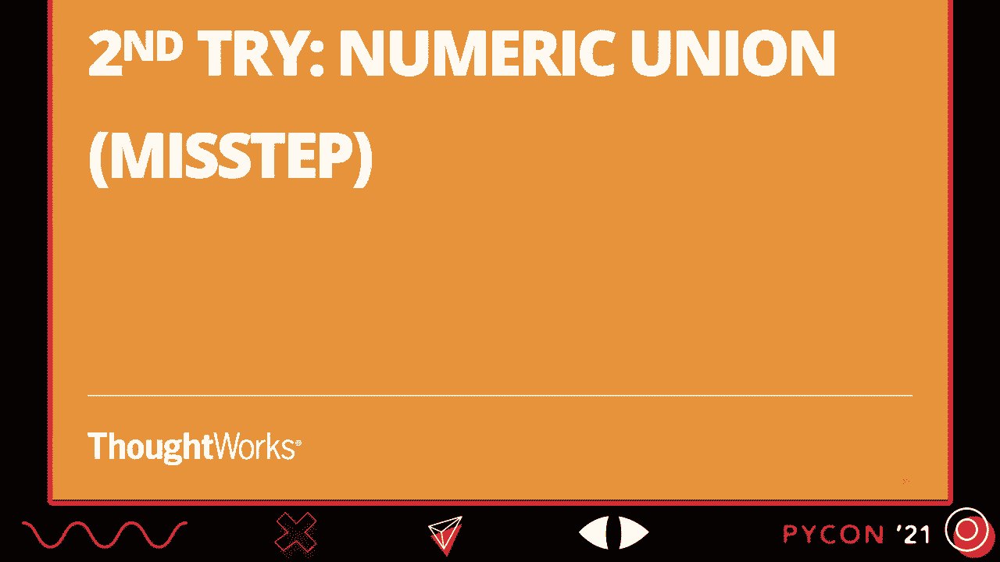
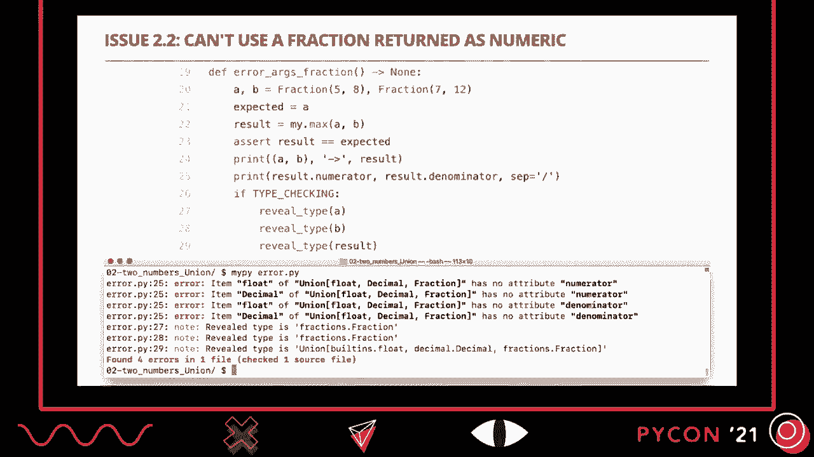
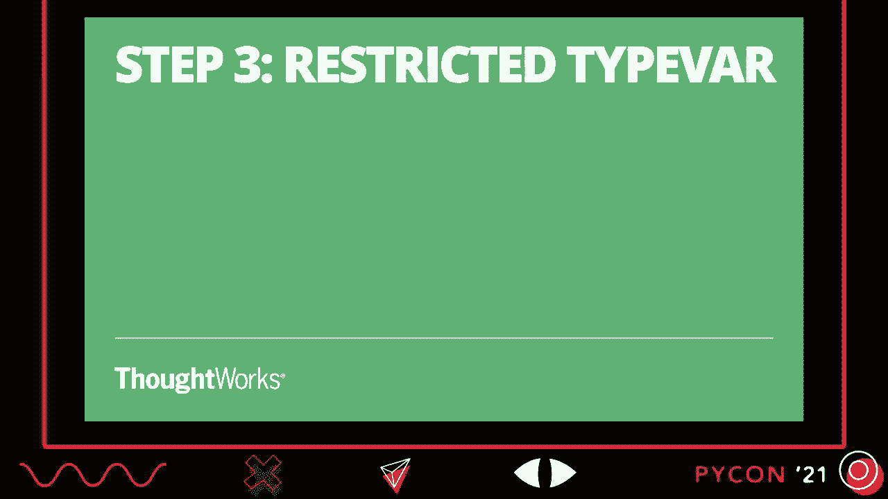
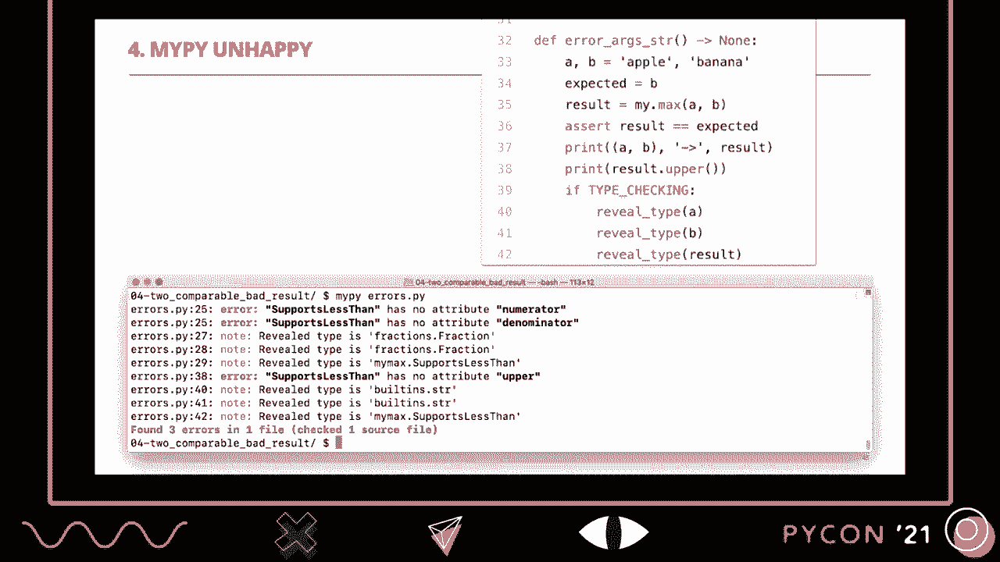

# Python类型系统：P9：协议——类型提示的基石 🧱


在本节课中，我们将学习Python类型系统中的**协议**，并理解其在静态类型检查中的核心作用。我们将通过分析内置函数`max`的类型注解难题，逐步探索如何利用协议和类型变量来精确描述函数的行为，从而掌握这一强大的类型工具。

---

## 概述

Python的类型提示系统旨在为动态语言提供静态检查的能力。然而，像`max`这样灵活的内置函数，其参数可以是数字、字符串、列表等多种类型，如何为其编写精确的类型提示曾是一个挑战。本节课将带你了解解决这一挑战的关键——**协议**，并展示如何结合**类型变量**来构建强大且准确的类型注解。

---

## 静态类型与动态类型

理解协议之前，我们需要区分两个核心概念。

*   **静态类型**：类型检查发生在程序运行之前（例如，通过编译器、代码检查器或`mypy`等工具）。这有助于在早期发现类型错误。
*   **动态类型**：类型检查发生在程序运行时。这提供了更大的灵活性，但也意味着错误可能在后期才被发现。

另一个重要的维度是**鸭子类型**。其核心理念是：“不要检查它是不是一只鸭子，而是检查它是否会像鸭子一样叫或走。”这意味着我们只关心对象是否具备我们所需的方法或行为，而不关心其具体的类名或继承关系。

---

## 结构类型与名义类型

根据类型检查的依据，我们可以将类型系统分为两类：

*   **结构类型**：类型的兼容性由对象实际提供的**结构**（即拥有的方法和属性）决定。类名和继承关系不重要。
*   **名义类型**：类型的兼容性由显式声明的**类型名称**（如类名、接口名）决定。这是Java等语言采用的方式。

Python的**协议**特性，正是支持**静态鸭子类型**（即对结构类型进行静态检查）的关键。

---

## 挑战：为 `max` 函数添加类型提示

让我们从一个具体的例子开始。Python内置的`max`函数功能强大，但其灵活性给类型提示带来了困难。考虑以下简化场景：一个只接受两个参数的`max`函数。

```python
# 我们希望能为这个函数添加准确的类型提示
def my_max(a, b):
    if a >= b:
        return a
    else:
        return b
```

我们希望`my_max`能正确处理`float`、`int`、`Fraction`（分数）等不同类型。最初的尝试可能是将参数和返回值都标注为`float`。

```python
def my_max(a: float, b: float) -> float:
    if a >= b:
        return a
    else:
        return b
```



**问题**：当我们传入两个`Fraction`对象时，`mypy`会报错，因为`Fraction`与`float`类型不兼容。我们需要一个更通用的解决方案。



---

## 尝试与失败：数字ABC与联合类型

以下是两种不成功的尝试，但它们能帮助我们理解问题所在。

### 尝试一：使用 `numbers.Number` ABC

Python标准库的`numbers`模块提供了抽象基类（ABC），如`Number`。

```python
from numbers import Number



def my_max(a: Number, b: Number) -> Number:
    if a >= b:  # mypy 会在这里报错！
        return a
    else:
        return b
```



**失败原因**：`Number` ABC没有定义具体的比较方法（如`__ge__`）。静态类型检查器`mypy`无法知道`Number`类型的对象支持`>=`操作，因此会报错。`numbers` ABC主要用于运行时检查，对静态类型检查帮助有限。

### 尝试二：使用联合类型

我们可以定义一个包含所有可能数值类型的联合类型。

```python
from typing import Union
from fractions import Fraction
from decimal import Decimal

Numeric = Union[float, Decimal, Fraction]



def my_max(a: Numeric, b: Numeric) -> Numeric:
    if a >= b:
        return a
    else:
        return b
```



**问题**：
1.  **返回类型过于宽泛**：如果我传入两个`float`，我知道返回值是`float`，但类型提示说它可能是`float`、`Decimal`或`Fraction`中的任何一个。这不够精确。
2.  **无法访问特定方法**：如果我传入两个`Fraction`，结果是一个`Fraction`，我想访问其`.numerator`属性。但`mypy`会阻止我，因为`Numeric`联合类型并不保证一定有`.numerator`属性。

---

## 解决方案一：受限类型变量

对于数值类型，一个有效的解决方案是使用**受限类型变量**。

```python
from typing import TypeVar
from fractions import Fraction
from decimal import Decimal

# 定义一个类型变量T，但它只能是float, Decimal, Fraction中的一种
T = TypeVar('T', float, Decimal, Fraction)

def my_max(a: T, b: T) -> T:
    if a >= b:
        return a
    else:
        return b
```

**工作原理**：当`mypy`分析一个具体的函数调用时（例如`my_max(Fraction(1,2), Fraction(1,3))`），它会将`T`绑定到`Fraction`类型。因此，它知道参数`a`、`b`和返回值都是`Fraction`类型，从而实现了精确的类型推断。



**局限性**：这个方法将类型限制在了一个明确的列表里。但`max`函数还能处理字符串、列表、元组等。我们需要一个更通用的机制来描述“任何可比较的对象”。



---

## 关键概念：协议

**协议**定义了一个对象必须实现的方法集合。它是一种描述结构类型的工具。以下是定义一个简单协议的语法：

```python
from typing import Protocol

# 定义一个协议，要求实现 __lt__ (小于) 方法
class SupportsLessThan(Protocol):
    def __lt__(self, other) -> bool:
        ...  # 省略号表示我们只关心方法签名，不关心实现
```

任何实现了`__lt__`方法的类，都自动被视为`SupportsLessThan`协议的**子类型**。在Python中，大多数排序和比较操作（如`max`, `sorted`）在内部都依赖于`<`运算符，因此这个协议非常有用。

---

## 尝试与失败：仅使用协议

我们尝试仅用协议来注解`my_max`。

```python
from typing import Protocol

class SupportsLessThan(Protocol):
    def __lt__(self, other) -> bool: ...

def my_max(a: SupportsLessThan, b: SupportsLessThan) -> SupportsLessThan:
    if b < a:  # 注意：这里我们改用 < 运算符
        return a
    else:
        return b
```

**问题**：类型丢失了。如果我传入两个字符串，结果应该是一个字符串。但根据类型提示，返回值只是`SupportsLessThan`类型。`mypy`不会允许我对结果调用字符串特有的方法，例如`.upper()`。

---

## 最终解决方案：协议 + 有界类型变量



将**协议**与**有界类型变量**结合，我们得到了完美的解决方案。

```python
from typing import Protocol, TypeVar

# 1. 定义协议
class SupportsLessThan(Protocol):
    def __lt__(self, other) -> bool: ...

# 2. 定义有界类型变量，其边界是协议
T = TypeVar('T', bound=SupportsLessThan)

# 3. 使用有界类型变量进行注解
def my_max(a: T, b: T) -> T:
    if b < a:
        return a
    else:
        return b
```

**工作原理**：
1.  `T`是一个类型变量，但它不是被限制在几个具体类型里，而是被**绑定**到`SupportsLessThan`协议。
2.  这意味着`T`可以是`SupportsLessThan`的**任何子类型**。
3.  当`mypy`分析`my_max('hello', 'world')`时：
    *   它看到第一个参数是`str`。
    *   它检查`str`是否实现了`__lt__`方法（是的，字符串可以比较）。
    *   因此，`str`是`SupportsLessThan`的子类型，符合`T`的边界。
    *   `mypy`将本次调用中的`T`推断为`str`。
    *   于是，它知道`a`、`b`和返回值都是`str`类型。

这样，我们既保证了参数是可比较的（通过协议），又保留了参数的具体类型信息（通过有界类型变量），实现了精确而灵活的类型提示。

在实际的Python标准库类型存根中，`max`函数的注解正是使用了`SupportsLessThan`协议，并通过多个重载来处理不同的参数组合情况。

---

## 总结

本节课我们一起学习了Python类型系统的基石之一——**协议**。


1.  **协议**允许我们基于对象的结构（即拥有的方法）来定义类型，这是实现**静态鸭子类型**的关键。
2.  通过分析为`max`函数添加类型提示的挑战，我们看到了从简单注解、联合类型到最终使用**协议+有界类型变量**的演进过程。
3.  单独的协议会丢失具体类型信息，而**有界类型变量**（`TypeVar(..., bound=Protocol)`）能将协议与具体类型关联起来，提供既安全又精确的类型推断。


Python的类型系统是一种**渐进式类型**系统。我们不必强制所有代码都通过100%的类型检查，而是可以根据需要，在合适的地方使用类型提示来提升代码的可靠性和可维护性。协议这一特性，使得我们能够为Python中大量基于鸭子类型的灵活代码编写出优雅而准确的类型注解，是平衡动态语言灵活性与静态类型安全性的强大工具。