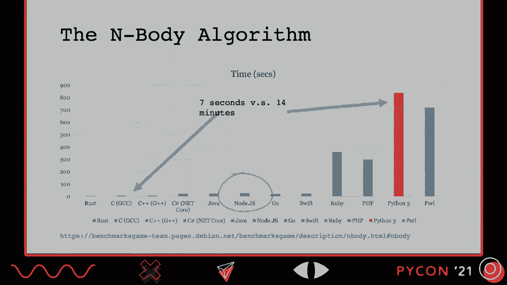
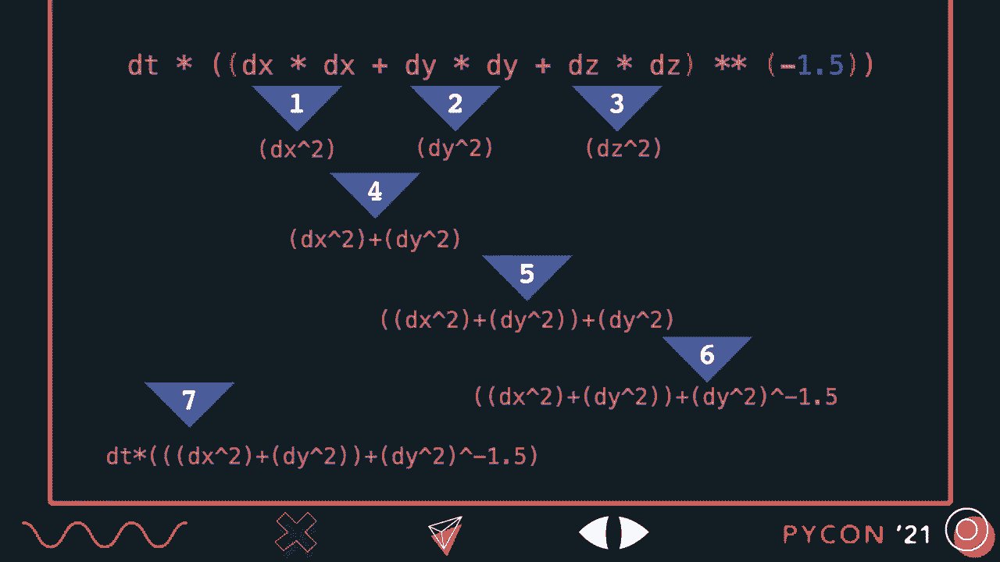
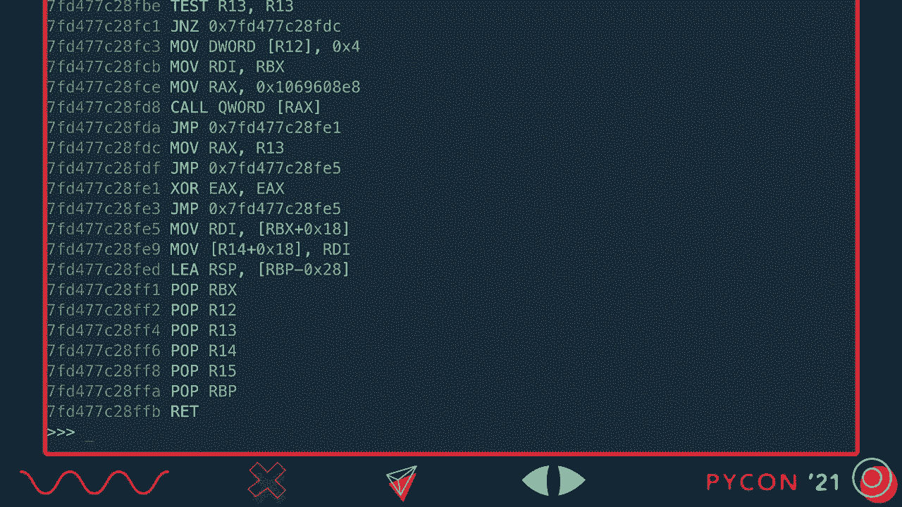
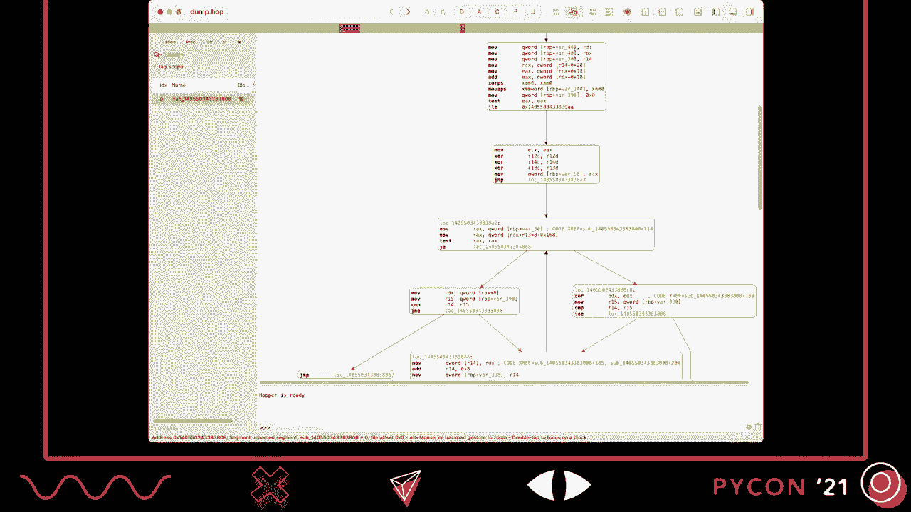
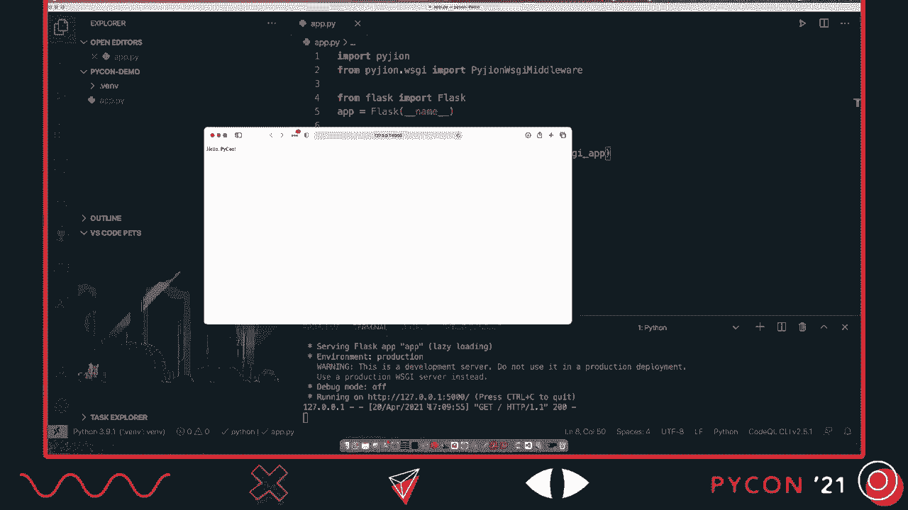
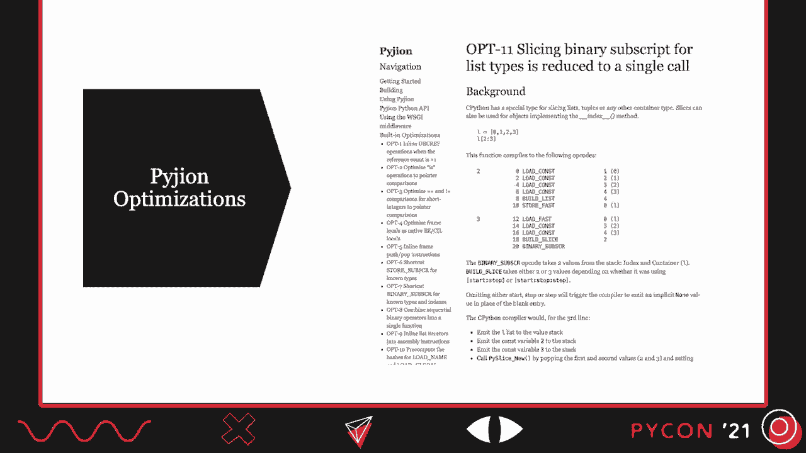
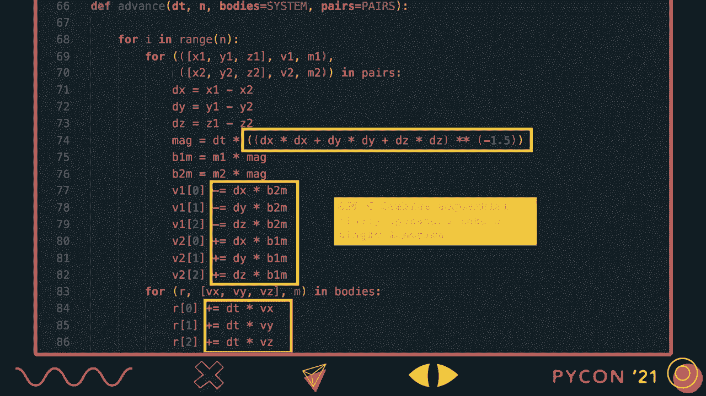
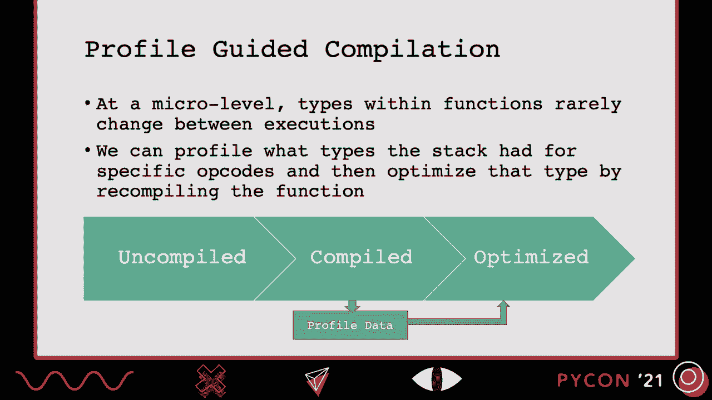
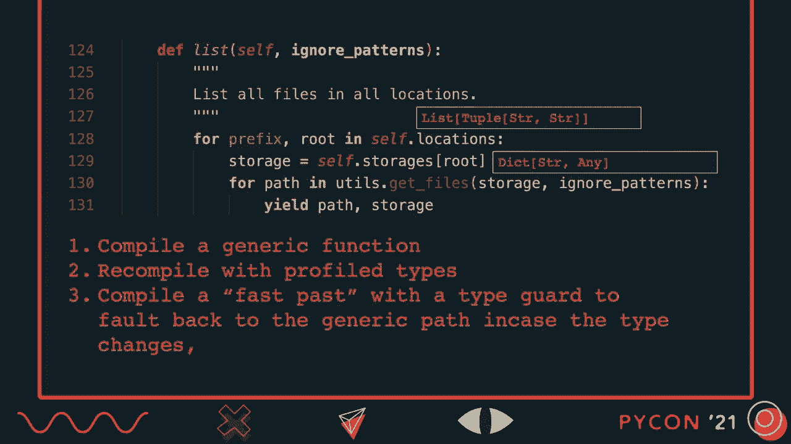
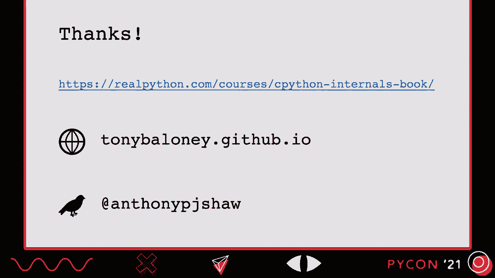

# 002：重启 Pyjion，一个通用的 Python JIT 编译器


## 概述
在本教程中，我们将学习 Pyjion 项目。这是一个为 CPython 设计的即时（JIT）编译器，旨在提升 Python 代码的执行速度，同时保持与标准 CPython 的完全兼容性。我们将探讨 Python 性能的常见瓶颈、JIT 编译的基本原理，并了解 Pyjion 如何通过优化字节码执行来工作。

---

## Python 性能挑战与 JIT 的潜力

上一节我们概述了 Pyjion 的目标。现在，让我们深入了解 Python 在性能上面临的一些具体挑战，以及为何 JIT 编译可能是一个解决方案。

在 2020 年的 PyCon US 演讲中，我探讨了“为什么 Python 这么慢？”的问题。其中一个关键基准测试是 N-Body 算法，它用于计算行星轨道。Python 在这个算法上的表现远不如 C、Ruby、PHP、Perl，甚至 JavaScript（Node.js）。尽管 JavaScript 同样是动态语言、拥有垃圾回收（GC）和全局解释器锁（GIL），但其执行速度却快得多。



以下是 Python N-Body 实现的核心代码段：
```python
# 假设这是计算的一部分
result = (x * y) + (a * b) - (c ** d)
```
Python 会严格按照操作顺序执行字节码。但问题在于，每次乘法、加法或幂运算的结果都会产生一个新的浮点数对象。这个对象被创建后，几乎立即在下一个操作中被引用，然后因引用计数归零而被释放。在密集循环中，这种临时对象的频繁分配和释放会消耗大量时间。

如果使用 Cython 将变量注解为 `double` 类型，执行速度可以提升约 8 倍。这是因为浮点数可以保留在 CPU 寄存器中，避免了堆内存操作。其他 JIT（如 PyPy）也有机制来消除这些临时对象的开销。

总结 Python 慢速的几个原因：
*   **临时对象问题**：在紧密循环中频繁创建和销毁对象。
*   **CPython 评估循环开销**：解释执行字节码本身有成本。
*   **兼容性代价**：许多性能优化方案会牺牲兼容性或平台支持。
*   **垃圾回收器**：CPython 使用的是“停止一切（Stop-The-World）”的垃圾回收器。

理论上，一个专门的 JIT 编译器可以在某些情况下提供帮助。



---

## 现有的 Python JIT 方案

上一节我们分析了 Python 的性能瓶颈。本节中，我们来看看目前社区中已有的一些 JIT 解决方案及其特点。

目前存在多个为 Python 代码添加 JIT 编译的项目：
*   **Numba**：主要针对数据科学领域。它是一个装饰器，可以对带有类型注解的特定函数进行 JIT 编译，以优化 NumPy 调用。对于纯 Python 代码可能没有帮助，甚至可能变慢。
*   **Pyston**：CPython 的一个分支，集成了使用 LLVM 的 JIT 引擎。它声称能带来 10% 到 20% 的性能提升。缺点是它是闭源项目，并且是一个需要单独部署的运行时。
*   **PyPy**：一个用 Python 编写的 Python 解释器，拥有成熟的 JIT，在许多场景下能带来巨大性能提升。缺点是某些情况下可能比 CPython 慢，且与部分 C 扩展的兼容性不佳。

我认为，目前仍然缺少一个**专注于兼容性**、并能弥补 CPython 评估循环不足的**通用 JIT**。这就是 Pyjion 项目的目标。

---

## Pyjion 项目介绍

上一节我们回顾了现有的 JIT 方案。本节我们将聚焦于 Pyjion 本身，了解它的定位、设计目标和兼容性承诺。

Pyjion 是一个用于 CPython 字节码的 JIT 编译器。你可以通过 pip 安装，它与 CPython 3.9 兼容，支持 Linux、macOS 和 Windows 的 64 位 Intel CPU 架构。

需要明确几点：
*   Pyjion **不是**另一个 Python 解释器，它在 CPython 3.9 **内部**运行。
*   Pyjion **不是**全新项目，它最初在 2016 年 PyCon 上提出。我在过去九个月里基本上重写了它，但设计理念相似。

Pyjion 的设计目标：
1.  **专注于兼容性**：在 CPython 中能运行的代码，在启用 Pyjion 后也应该能运行。
2.  **最小化 JIT 启动开销**：不能像 Java 虚拟机那样有漫长的启动时间。
3.  **无需代码更改**：除了启用 JIT，不应要求添加类型注解或装饰器。
4.  **易于部署**：应能通过 `pip install` 安装并导入，适用于各种环境。

---

## Pyjion 的工作原理

上一节我们介绍了 Pyjion 的目标。本节中，我们来看看 Pyjion 是如何集成到 CPython 的执行流程中并发挥作用的。

要理解 Pyjion，首先需要了解 CPython 的编译和执行过程：
1.  **解析**：Python 代码被解析器转换为抽象语法树（AST）。
2.  **编译**：编译器将 AST 转换为字节码（`.pyc` 文件）。
3.  **评估**：CPython 虚拟机遍历并执行这些字节码。

Pyjion 将自身插入到**编译**和**评估**阶段之间。它在运行时将 Python 字节码重新编译为本地机器码。具体过程是：当一个函数运行一定次数后，Pyjion 会将其字节码编译成一种称为 **ECMA CIL** 的中间语言，然后利用 .NET 5 的 JIT 编译器将其最终编译为机器码（汇编指令）。编译后的代码被缓存到内存中供后续执行。

选择 .NET 5 JIT 是一个实现细节，它提供了成熟的、跨平台的编译后端，但用户代码与 .NET 本身无关。

---

## 使用 Pyjion：一个简单示例


上一节我们从理论上解释了 Pyjion 的工作原理。本节我们通过一个具体的代码示例，看看如何安装和使用它。

以下是使用 Pyjion 的步骤：

首先，在 Python 3.9 环境中安装 Pyjion：
```bash
pip install pyjion
```

然后，在 Python REPL 或脚本中启用并使用它：
```python
import pyjion
pyjion.enable()  # 启用 JIT 编译器

def half(x):
    return x / 2

# 第一次调用会触发 JIT 编译
result = half(10)
print(result)  # 输出 5.0
```



启用 Pyjion 后，当 `half` 函数被调用时，JIT 编译器会启动，并将该函数的字节码编译为机器码。你可以使用 `pyjion.info(function)` 来查看函数的 JIT 编译状态，或者使用 `pyjion.dis.dis(function)` 来反汇编生成的中间语言（CIL）代码。



---

## Pyjion 的实际应用与优化

上一节我们运行了一个简单的示例。本节我们看看如何将 Pyjion 集成到更复杂的实际项目中，并了解它目前所做的优化。



Pyjion 可以轻松集成到 Web 框架中，例如 Flask。以下是一个简单的 Flask 应用示例，它通过 Pyjion 提供的 WSGI 中间件启用 JIT：
```python
from flask import Flask
from pyjion.middleware import PyjionMiddleware

app = Flask(__name__)
app.wsgi_app = PyjionMiddleware(app.wsgi_app)  # 启用 JIT 中间件

@app.route('/')
def hello():
    return 'Hello, World!'

if __name__ == '__main__':
    app.run()
```
添加中间件后，Flask 应用的所有路由函数都将被 JIT 编译，而无需对现有代码做任何修改。

然而，仅仅将字节码编译为机器码并调用相同的 CPython C API，并不会自动带来性能提升。性能提升来自于 **JIT 优化**。Pyjion 会在编译时识别代码模式，并生成更高效的机器码。目前已经实现了一些优化，例如：
*   **常量索引访问优化**：对于 `list[0]` 这样的操作，直接使用 C API 的快速路径。
*   **临时对象消除**：对于连续的浮点数运算，将中间结果保留在 CPU 寄存器中，避免创建临时 Python 对象。



这些优化虽然看起来不大，但它们是许多 Python 代码中的常见模式，因此能带来广泛的性能收益。

---

## 未来方向：配置文件引导编译（PGC）



上一节我们看到了 Pyjion 当前的优化。本节我们探讨一个正在开发中的关键特性，它旨在解决 Python JIT 编译的最大挑战之一——类型推断。

Python 是动态类型语言，变量的类型在运行时才能确定。这对优化构成了巨大挑战。Pyjion 正在开发的 **配置文件引导编译（PGC）** 功能就是为了解决这个问题。

PGC 的工作流程：
1.  **分析阶段**：当一个函数首次被 JIT 编译后，Pyjion 会在生成的代码中插入“探针”，记录执行过程中关键位置的操作数类型。
2.  **优化再编译**：当函数再次被执行，并且积累了足够的分析数据后，Pyjion 会利用这些类型信息重新编译该函数。例如，如果发现某个变量总是字符串，就可以针对字符串操作进行优化。
3.  **类型保护**：为了应对类型可能变化的情况，优化后的代码会包含运行时类型检查。如果类型不符，则回退到通用的、未优化的执行路径。



你可以通过 `pyjion.info(function)` 查看函数的 PGC 状态（如 `未编译`、`已分析`、`已优化`）。

---



## 性能现状与总结

上一节我们展望了 Pyjion 的未来特性。在本节最后，我们来看看它目前的性能表现，并对整个教程进行总结。

目前，在 N-Body 基准测试上，Pyjion 相比 CPython 3.9 取得了约 **30%** 的执行时间减少。在其他基准测试（如 `fannkuch` 和 `float`）中，也有约 **20%** 的性能提升。我们的理念是，任何低于 20% 的优化努力可能都不够经济，因此目标是实现更大的性能飞跃。

**总结**
在本教程中，我们一起学习了：
1.  Python 性能的常见瓶颈，特别是临时对象和评估循环开销。
2.  现有 Python JIT 方案（如 Numba、Pyston、PyPy）的特点与局限。
3.  **Pyjion 项目**：一个专注于兼容性、无需代码更改、易于部署的通用 CPython JIT 编译器。
4.  Pyjion 的工作原理，即运行时将字节码编译为机器码。
5.  如何安装、启用 Pyjion，并将其集成到实际应用（如 Flask）中。
6.  Pyjion 当前实现的优化策略。
7.  未来的发展方向——配置文件引导编译（PGC），用于动态类型推断和优化。



Pyjion 是一个有趣且充满潜力的项目，它试图以可插拔模块的形式为 CPython 带来透明的性能优化。如果你对编译器或 Python 性能优化感兴趣，欢迎参与贡献。同时，也请务必评估 **PyPy**，它已经是一个极其成熟且强大的 JIT 实现，可能非常适合你的项目。


**资源链接**
*   项目文档：[pyjion.readthedocs.io](https://pyjion.readthedocs.io)
*   源代码：[github.com/tonybaloney/pyjion](https://github.com/tonybaloney/pyjion)
*   《CPython 内部》书籍（作者博客）：了解更多关于 CPython 编译器、评估循环和内存管理的知识。