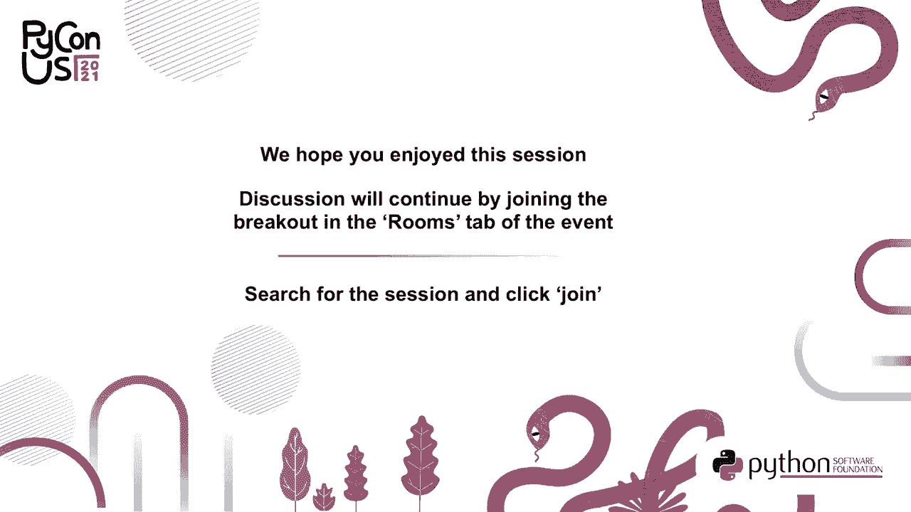

# 004：高性能、高精度的CPU+GPU+内存分析器 🚀


在本节课中，我们将学习一个名为Scalene的全新Python性能分析器。它与其他分析器截然不同，能够以极低的运行时开销，提供前所未有的详细性能分析，包括CPU、GPU和内存使用情况。我们将了解它的核心功能、使用方法以及背后的技术原理。

## 概述 📋

我是Emery Berger，马萨诸塞大学的计算机科学教授。今天讨论的Scalene分析器，旨在解决现有Python分析器在性能开销、分析粒度、多线程支持以及综合性能洞察方面的不足。它不仅能告诉你代码哪里慢，还能告诉你为什么慢。


## 现有分析器的性能开销 ⚖️

分析器的一个关键特性是运行时开销要小。如果程序本身已经运行缓慢，分析器不应使其变得更慢。

为了衡量这一点，我们使用Pi Performance套件的基准测试。Y轴表示标准化执行时间，即运行分析器的时间除以原始程序运行时间。理想情况是1.0倍，表示没有开销。

以下是测试结果分类：
*   **低开销（绿色）**：三个分析器的开销最高不超过1.5倍，表现良好。
*   **中等开销（黄色）**：包括内置的cProfile，减速范围从2倍到近7倍。
*   **高开销（红色）**：一些分析器的开销高达近40倍。想象一下，分析一个原本只需1分钟的程序现在需要40分钟，这是不可接受的。
*   **极高开销**：一个名为`memory_profiler`的内存分析器，开销高达近300倍。

虽然内存分析可能更耗费资源，但Scalene证明，高效的内存分析是可能的。

## Scalene的定位与核心优势 ✨

Scalene在性能开销方面表现优异。在上述基准测试中，其完整模式（分析CPU、内存和GPU）仅比原始程序慢20%。它还有一些选项可以进一步降低开销。

### 分析粒度：函数级 vs. 行级

分析器通常分为两类：
*   **函数级分析**：信息在整个函数上汇总。这对于有许多小函数的代码有效，但对于长函数或与NumPy等库交互的代码帮助有限。
*   **行级分析**：为每一行代码报告信息，在分析大型函数时非常有用，但在大型程序中可能过于精细。

Scalene采用了两者兼顾的方法，**同时进行函数级和行级分析**。

### 易用性与兼容性

*   **无需修改代码**：与许多分析器一样，Scalene可以直接分析未修改的代码。它也支持`@profile`装饰器，用于在定位问题后聚焦于特定函数。
*   **多线程与多进程支持**：许多分析器对Python线程支持有限。Scalene是**唯一**能够正确分析使用`multiprocessing`库代码的分析器。

### 超越其他分析器的独特功能

除了一个内存分析器外，其他分析器都无法执行以下操作，而Scalene可以：
*   将Python时间与C/本地时间分开。
*   识别系统调用（I/O）时间。
*   进行高效的内存分析。
*   进行GPU分析。
*   展示内存使用趋势。
*   报告**复制量**（一个揭示不必要数据拷贝的新指标）。
*   自动检测内存泄漏。

最重要的是，Scalene在提供这些功能的同时，保持了极低的开销。

## 使用Scalene 🛠️

使用Scalene非常简单。基本命令是将`python3`替换为`scalene`。

```bash
scalene your_script.py
```

以下是一些有用的选项：
*   `--reduced-profile`：只报告执行时间或内存分配占总量的比例超过1%的代码行。
*   `--outfile <file>`：将输出写入文件。
*   `--html`：生成包含分析结果的HTML网页。
*   `--cpu-only`：禁用内存分析（GPU分析仍会进行，如果可用）。此模式开销极低。

Scalene的输出分为两部分：
1.  **行级分析**：顶部显示每行代码的详细性能数据。
2.  **函数级分析**：底部汇总每个函数的性能信息，并按内存消耗降序排列。

## Scalene实战：识别不必要的数据拷贝 🎯

上一节我们介绍了Scalene的基本功能，本节我们通过一个具体例子来看看它如何帮助我们发现隐藏的性能问题。

考虑以下使用NumPy的代码：

```python
import numpy as np
def main():
    n = 10000
    X = np.array(np.random.uniform(0, 1, (n, n))) # 问题行
    Y = X * X
    return Y.sum()
```

使用传统分析器（如cProfile或line_profiler）可能只会告诉我们`main`函数或某一行很慢，但无法解释原因。

Scalene的分析报告则提供了更深入的洞察（此处省略函数汇总和部分列）：
*   **CPU时间分解**：显示大部分时间花在“本地”代码（如NumPy的C库）上，这通常看起来是好事。
*   **内存分析**：显示该行在“本地”代码中分配了大量内存。
*   **内存趋势图（Sparkline）**：显示锯齿形模式（分配后释放），暗示了临时内存分配。
*   **复制量**：报告了很高的数值。

**问题诊断**：`np.random.uniform`已经返回一个NumPy数组，而`np.array`默认会复制其输入。因此，这里的`np.array`调用是**完全多余且昂贵的拷贝**。

**优化方案**：移除多余的`np.array`调用。

```python
def main():
    n = 10000
    X = np.random.uniform(0, 1, (n, n)) # 优化后
    Y = X * X
    return Y.sum()
```

**优化效果**：Scalene报告显示：
*   CPU时间下降。
*   内存趋势图中的锯齿形模式消失。
*   复制量降为零。
实际测试验证，峰值内存使用从约1.6GB降至约900MB，总执行时间减少了15%。

## Scalene的技术原理 🔬

上一节我们看到了Scalene的强大之处，本节我们来了解一下它实现高精度、低开销分析背后的关键技术挑战和解决方案。

### 精确的时间归因：处理C代码中的信号

Scalene使用信号进行采样分析。定时器中断时，它会检查正在执行的代码行。然而，Python在运行C扩展代码（如NumPy）时，会延迟信号的传递，直到控制权返回给Python解释器。这会导致采样分析器严重低估在C代码中花费的时间。

**Scalene的解决方案**：使用一种算法来推断在C代码中花费的时间。
1.  它使用一个“虚拟时钟”（进程实际在CPU上执行的时间）。
2.  比较连续信号之间的虚拟时钟时间和真实墙钟时间。
3.  通过公式计算各部分时间：

    `总时间 = Python时间 + C时间 + 系统时间`

    `C时间 ≈ (墙钟时间间隔 - 虚拟时钟时间间隔)`

    `系统时间 ≈ 墙钟时间间隔 - (Python时间 + C时间)`

通过这种方法，Scalene能准确地将时间分解为Python、本地(C)和系统(I/O)时间，即使在C代码长时间运行时也是如此。

### GPU分析

如果系统有NVIDIA GPU，Scalene会自动进行GPU分析。它采用与CPU分析类似的基于定时器的采样方法，定期检查GPU的利用率，并将其归因于当前正在执行的Python代码行。这在分析使用PyTorch、TensorFlow等框架的代码时非常有用。

在Jupyter Notebook中使用Scalene：
```python
%load_ext scalene
%scrun your_code_cell
```

### 自动内存泄漏检测

跟踪每一个内存分配和释放开销巨大。Scalene通过**采样**来实现高效的泄漏检测。

**概念模型**：将每次内存分配视为抛硬币得到“正面”，每次释放视为“反面”。没有泄漏的代码行，“正面”和“反面”的数量最终应平衡。

**实现方法**：
1.  Scalene随机采样一部分内存分配，记录分配地址和对应的代码行。
2.  当发生内存释放时，检查被释放的对象是否在采样记录中。
3.  随着程序运行，统计每条代码行“未匹配的分配”（即分配后未被释放的采样对象）数量。
4.  如果某行代码的未匹配分配数量持续显著偏高，Scalene就以高概率报告该行存在内存泄漏，并估算泄漏速率（MB/s）。

这种方法让开发者能够快速聚焦于真正严重的内存泄漏问题。

## 总结 🎉

在本节课中，我们一起学习了Scalene这个高性能的Python分析器。它远非“又一个Python分析器”，而是提供了独特的价值：

*   **全面分析**：以低开销（~20%）同时提供**CPU**（分解为Python、本地、系统时间）、**GPU**和**内存**（含趋势和复制量）分析。
*   **高精度**：通过创新算法，即使在C扩展代码中也能准确归因时间。
*   **智能检测**：自动识别内存泄漏和不必要的数据拷贝。
*   **强大兼容**：支持多线程、多进程代码的分析。
*   **易于使用**：简单的命令行接口，支持输出到HTML，兼容Jupyter Notebook。

希望你能使用Scalene来更有效地识别和修复代码中的性能瓶颈。我们期待您的反馈和成功案例！



