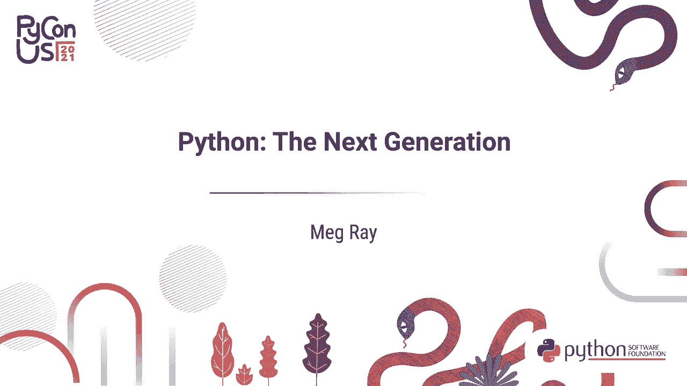
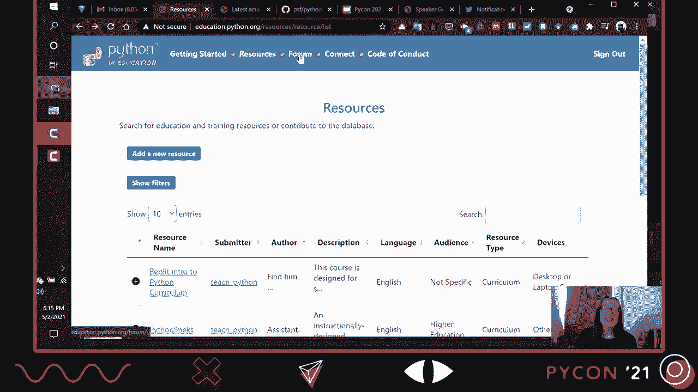
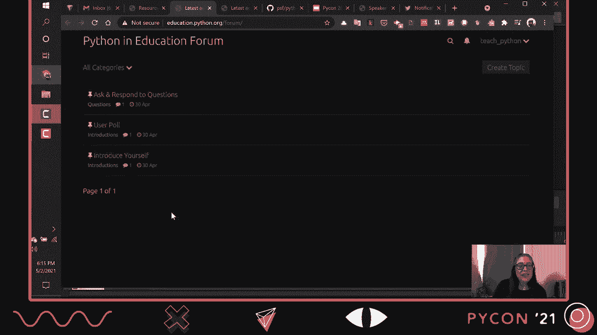
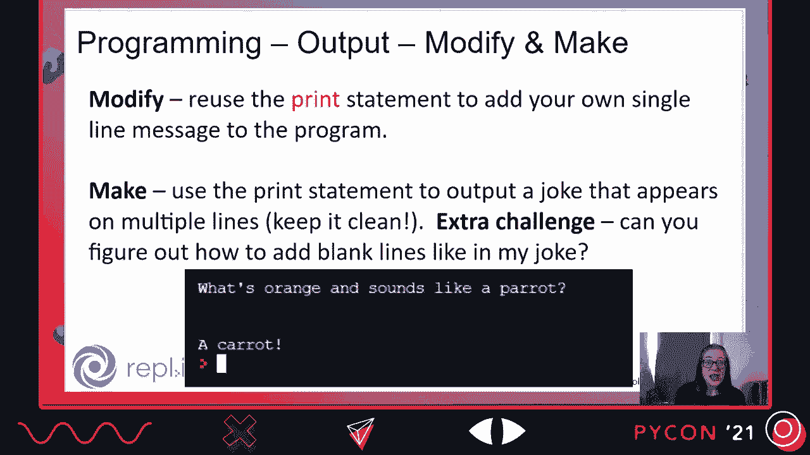
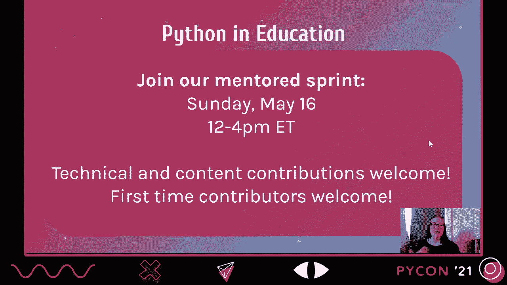
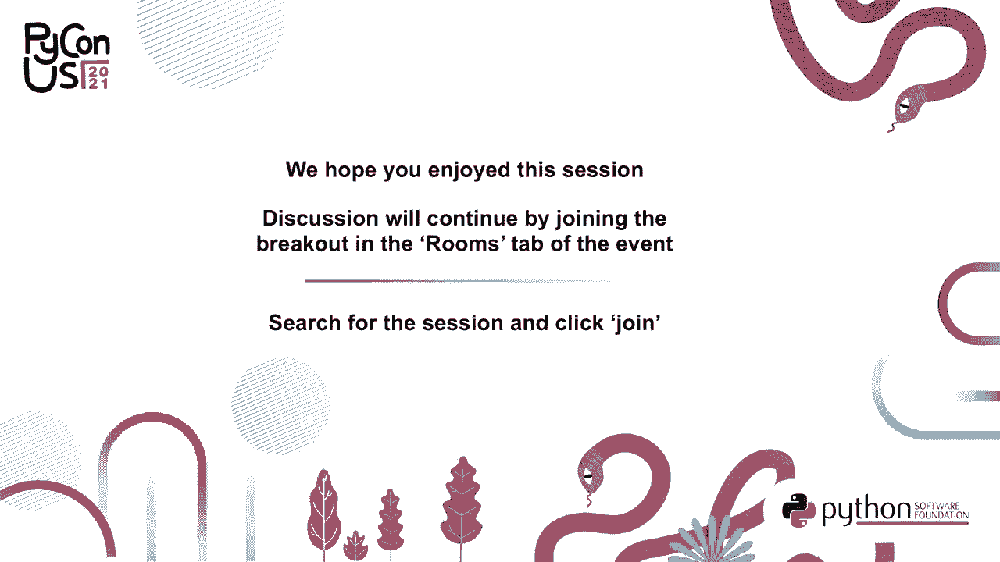

# 011：下一代Python学习者与教育趋势 🐍




在本节课中，我们将探讨Python教育领域的当前趋势，了解新一代Python学习者的特点，并介绍一个全新的Python教育资源平台。我们将重点关注如何以公平、包容的方式教授Python，并探索社区可以如何支持这一代学习者。

---

## 教育中的Python：趋势与驱动力 📈

上一节我们概述了课程内容，本节中我们来看看影响Python在教育中应用的一些宏观趋势。

第一个趋势是“全民计算机科学”倡议的增加。这些倡议要求每个学生，无论其背景或兴趣如何，都必须在常规上学时间内接受计算机科学教育。这确保了计算机科学不再仅仅是一门选修课，而是所有学生都能获得的基础接触和理解。

第二个趋势是大学层面“计算机科学导论”课程的变化。非计算机专业的计算机科学课程在增加，一些大学甚至将其设为毕业要求。同时，许多院校也在重新设计计算机科学专业的入门课程。在这两种情况下，Python常被选作教学语言，作为一种促进教育公平的工具。

选择Python作为入门语言，是一个支持所有学习者的明确决定。Python的语法清晰，常被比作“伪代码”，这一特性降低了初学者的认知负荷，是其教育普及的重要驱动力。

以下是Python在教育中流行的几个关键原因：

*   **可读性强**：Python代码对学生和教师而言都非常易读，便于理解和追踪程序逻辑。
*   **资源丰富**：互联网上有大量高质量的教育资源可供教师使用。
*   **灵活通用**：学生可以用Python在不同领域（如Web开发、数据分析、人工智能）创建项目，教师也可以采用多种编程范式进行教学。
*   **行业相关**：Python在业界，尤其是数据科学领域的广泛应用，激发了学生的学习兴趣，也让教师感到他们在传授有价值的实用技能。
*   **促进数据素养**：Python与当前教育中推动“数据素养”的趋势高度契合，教师可以同时教授编程和数据分析。
*   **活跃社区**：围绕Python有一个强大且活跃的社区，这为教育资源的持续产生和共享提供了支持。

---

## 新一代Python学习者：特点与机遇 👥

上一节我们讨论了Python流行的原因，本节中我们来看看这些趋势所吸引的新一代Python用户是谁。

这一代用户比以往更加多样化，来源广泛：

1.  **中学生**：由于“全民计算机科学”倡议，大量6-12年级的学生正在学校首次接触Python。
2.  **跨学科教师**：不仅仅是计算机科学教师，许多数学、科学等学科的教师也在学习Python，以便将其融入自己的教学。
3.  **课外活动参与者**：课后项目、编程夏令营等活动越来越受欢迎，吸引了更多年轻学习者。
4.  **大学生**：各个专业的学生都可能通过必修或选修的计算机课程学习Python。
5.  **独立学习者**：丰富的在线教育资源使得更多人能够自学Python。

作为一个社区，我们面临着巨大的机遇：如何将这些“曾经写过Python”的人，转变为Python社区的活跃成员和贡献者？这需要我们思考如何扩大圈子，如何欢迎并吸引这一代人。

这需要社区进行讨论，审视我们的文化：哪些部分对帮助新成员融入至关重要？哪些部分可以调整以更好地接纳新一代？这是一项需要持续思考和协作的工作。

---

## Python社区的教育支持与资源 🛠️

上一节我们认识了新一代学习者，本节中我们来看看Python社区为支持教育做了哪些努力。

Python社区长期以来一直支持教育工作：

*   **会议活动**：例如PyCon US设有教育峰会，PyCon UK有专门的教育专题。
*   **PSF支持**：Python软件基金会通过教育拨款支持项目，例如2019年的教育拨款以及将Python纳入“隐秘天才”项目教学大纲。
*   **开源项目**：存在大量与教育相关的开源项目，例如：
    *   `Brython`：允许在浏览器中运行Python。
    *   `EduBlocks`：帮助学习者从图形化积木编程过渡到Python文本编程。
    *   `Pygame`：一个用于教学的游戏开发引擎。
*   **社区内容**：例如“Teaching Python”播客等。

现在，我们重点介绍一个由社区努力构建的新平台：**Python教育门户**。

该网站由PSF资助，旨在为Python教育者、学习者和倡导者提供一个中心枢纽。你可以在 `education.python.org` 找到它。

该网站主要提供以下功能：

*   **寻找资源**：为教授Python寻找课程计划、工具和指南。
*   **贡献资源**：分享你创建或知道的优秀教育资源。
*   **学习教学法**：获取关于包容性教学策略等主题的知识。
*   **连接社区**：与对Python教育感兴趣的其他人士联系。
*   **参与贡献**：作为一个开源项目，欢迎所有人参与改进。

网站结构清晰，顶部菜单栏提供了不同入口：

*   **工具包**：针对特定实践问题提供指南，例如基于证据的教学策略、倡导计算机科学教育的行动指南、包容性实践指南等。
*   **资源**：一个可搜索的资源库，可以按关键词或主题筛选，查找课程大纲、项目想法等。
*   **论坛**：一个供社区提问、讨论和联系的平台。
*   **参与**：提供通过社交媒体和其他方式参与社区活动的信息。
*   **贡献**：说明如何为这个开源项目做出贡献。
*   **行为准则**：明确遵循PSF行为准则，确保环境友好。



---



## 深入探索：教学策略与社区行动指南 🧭

上一节我们介绍了新的教育资源门户，本节中我们深入看看其中的两个实用工具包。

**1. 基于证据的教学策略工具包**
这个工具包回答了“如何有效地教授Python？”这一问题。它介绍了一些经过研究验证的教学方法。

以下是其中一个名为 **“PRIM”** 的策略，它代表 **预测、运行、调查、修改、制作**。这是一种适用于不同水平学习者的编程教学框架。

我们通过一个来自Replit平台上的Python入门课程的例子来理解：

```python
# 任务：预测下面这行代码会做什么？
print("Hello, World!")
# 学生在此写下预测：这行代码会在屏幕上显示文字“Hello, World!”。

# 然后，学生运行代码，验证预测。



# 调查阶段：学生被引导测试代码的不同部分。
# 例如：如果将字符串改为“你好，Python！”，输出会是什么？
print("你好，Python！")

# 修改阶段：学生重用代码，但改变内容，使其个性化。
print("你好，[学生的名字]！")

# 制作阶段：学生运用这个概念，创建自己程序的一部分。
print("欢迎来到我的第一个Python程序！")
print("我今天学习了print语句。")
```

**2. 倡导行动工具包**
这个工具包主要为科技公司和专业人士设计，指导他们如何支持中学计算机科学教育。它包含三个方面的资源：

以下是个人可以采取的行动建议：

*   **倡导支持**：使用工具包中的模板和指南，向本地学校或政策制定者倡导计算机科学教育的重要性。
*   **增加可见性**：如果你属于在科技领域代表性不足的群体，请考虑在学生面前展示自己。年轻学生需要看到像他们一样的人也能从事这个行业，这能极大地影响他们的职业想象和学习选择。
*   **成为导师**：在工作中指导新同事或实习生。招聘人才很重要，但保留人才同样关键，而导师制对此大有裨益。你也可以指导对编程感兴趣的年轻人。

---

## 总结与行动号召 ✨

本节课中，我们一起学习了Python教育的最新趋势，认识了更加多样化的新一代学习者，并探索了全新的`education.python.org`资源门户。



全球范围内，我们正在共同塑造中学计算机教育的未来。这是一个既令人敬畏又充满责任的机会，我们必须以公平和包容为核心来构建它。

**现在就是把握和影响这一进程的时刻。**

**你可以立即采取的行动：**
1.  访问 `education.python.org`，探索资源。
2.  考虑为网站贡献内容或代码（项目地址：`github.com/psf/python-in-edu`）。
3.  参与社区活动，例如即将举办的导师冲刺活动。
4.  思考如何在你所在的社区或工作中，支持下一代Python学习者的成长。



感谢你的学习。欢迎你加入Python教育社区，共同为所有学习者创造一个更包容、更有效的学习环境。