# 012：演讲 _ Meredydd Luff _ 为开发者撰写良好文档 - VikingDen7 - BV19Q4y197HM

在本节课中，我们将学习如何为开发者撰写高质量的文档。我们将探讨文档的重要性、不同类型的文档及其作用，以及如何通过与用户互动来持续改进文档。无论你是开发工具的作者、API提供者还是开源项目维护者，这些知识都将帮助你更好地服务开发者用户。

## 为什么文档至关重要？🤔

上一节我们介绍了课程概述，本节中我们来看看为什么我们需要关心文档质量。

我关心这个问题，因为我是Anvil的联合创始人之一。Anvil是一个完全使用Python构建全栈Web应用的框架。我们是一家开发工具公司，提供在线IDE和托管平台，让只懂Python的开发者也能构建和部署交互式应用。因此，我非常希望开发者在我们构建的项目中拥有良好且高效的体验。

你也应该关心文档，因为无论我们构建开发工具、为商业产品提供API，还是在GitHub和PyPI上发布开源项目，我们都希望它被使用。我们希望开发者能够：
1.  发现我们的项目。
2.  判断它是否能解决实际问题。
3.  学习如何使用它。
4.  解决使用过程中遇到的问题。

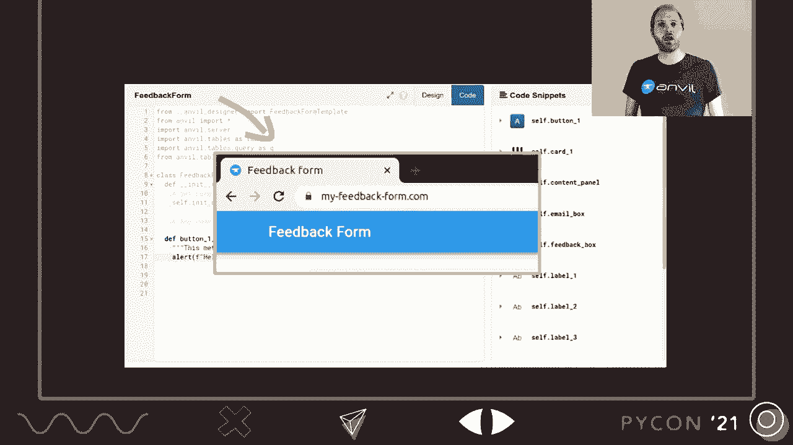

传统上，文档被视为最后两个方面的工具。但实际上，开发者文档对整个流程都至关重要。因为你的文档不仅仅是学习材料，它还是内容营销。当人们遇到实际问题时，他们会打开搜索引擎提问“我该如何做？”。你的文档就是这个问题的答案。因此，他们必须能够找到它。

无论开发者如何发现你的项目，他们的下一个任务都是判断它是否有用。这意味着他们需要理解你的项目究竟是什么。

## 文档是新用户的第一印象 👀

上一节我们讨论了文档作为内容营销的角色，本节中我们来看看文档如何帮助新用户理解你的项目。

新用户需要了解你的项目能做什么、有什么优势、包含哪些功能以及存在哪些限制。通常，发现这些信息的最佳途径就是查看文档。

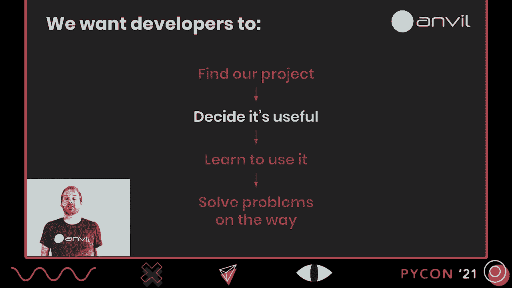

这意味着对于新用户，你的文档描述了你的项目是什么。因此，当新用户点击你的文档并浏览目录时，如果他们能看到关于项目功能及其优势的清晰总结，将有助于他们做出更好的决策。这远比只看到一段简介、一个常见代码示例以及几页关于边缘案例的讨论要好。

以下是《Anvil手册》的目录结构示例，它涵盖了编辑器、用户界面、客户端代码、服务器代码、数据存储和部署。这是一个不错的总结。

我们第一次编写文档时犯了一个错误：按照代码库结构来组织文档。在Anvil中，数据存储、邮件发送、用户认证以及第三方服务集成都是同一类型的插件对象，因此所有相关文档都被放在了一起。这对新用户非常不友好，因为数据存储的重要性远高于了解集成了哪些第三方服务。吸取教训后，我们重新组织了文档，使目录能准确总结项目是什么以及能做什么。

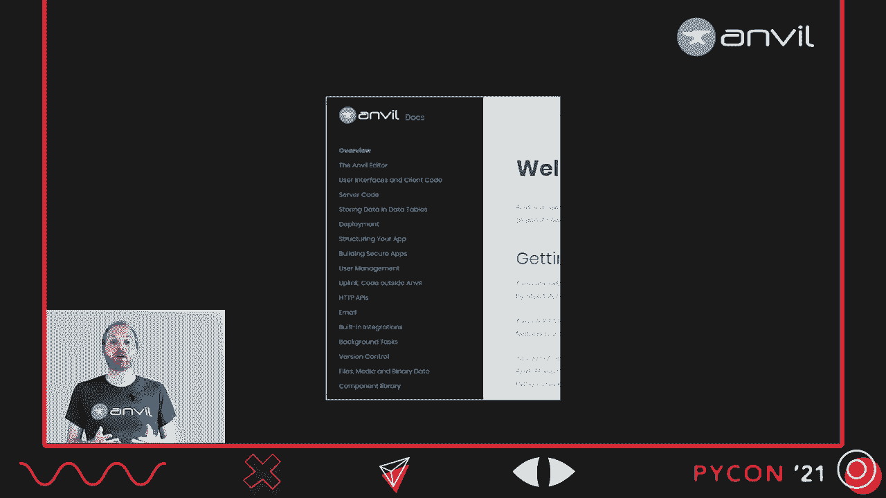

## 文档是开发者的用户界面 🖥️

上一节我们了解了文档如何帮助用户入门，本节中我们来看看文档在用户深入学习时的核心作用。

现在，开发者已经发现了你的项目，认为它有用，并决定开始使用。他们将开始学习并解决问题。此时，你的文档将被充分利用。开发者软件与大多数软件不同，因为对于开发者来说，**你的文档就是用户界面**。

大多数软件像汽车，用户大部分时间盯着仪表盘，手册则被遗忘在手套箱里。但对于开发者工具，情况不同。如果某人在你的API上编写代码，他们将花时间盯着自己的代码和你的文档。因此，如果你的技能或资源允许，让文档看起来美观是值得的。

以Twilio（一个用于电话通讯的API）的文档索引为例。它看起来像第二个主页，因为他们想清晰地展示它是什么以及能做什么。这就是他们的用户界面。

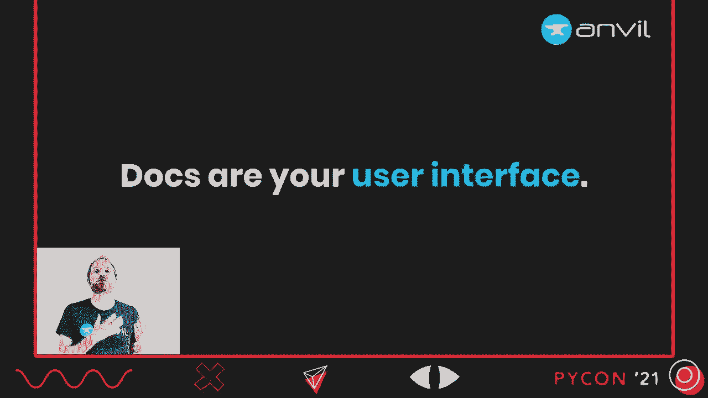

## 我们应该撰写哪些类型的文档？📚

上一节我们明确了文档作为用户界面的重要性，本节中我们来探讨文档的不同类型及其用途。

好的，我们已经讨论了文档的一些角色。接下来谈谈我们应该写些什么，因为并非所有文档都是一样的。

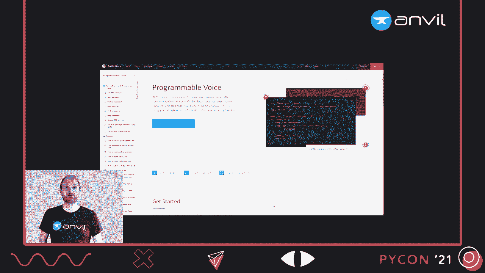

教程和参考文档不是一回事。一位名叫Danielle Pritchard的聪明人提出了一个文档分类框架。他将文档分为四类：
*   **教程**：提供逐步指导。
*   **解释**：说明其工作原理。
*   **操作指南**：完成特定现实任务的逐步指南。
*   **参考文档**：对其所有功能的枯燥但全面的描述。

Danielle甚至有一个2x2矩阵：教程和解释用于学习项目，操作指南和参考用于完成特定任务；教程和操作指南是逐步的，而解释和参考更偏理论。这是一个方便的框架，你可以在`diataxis.fr`上阅读更多内容。

但我天生对过于整齐的2x2矩阵持怀疑态度。

## API文档与参考文档的区别 🔄

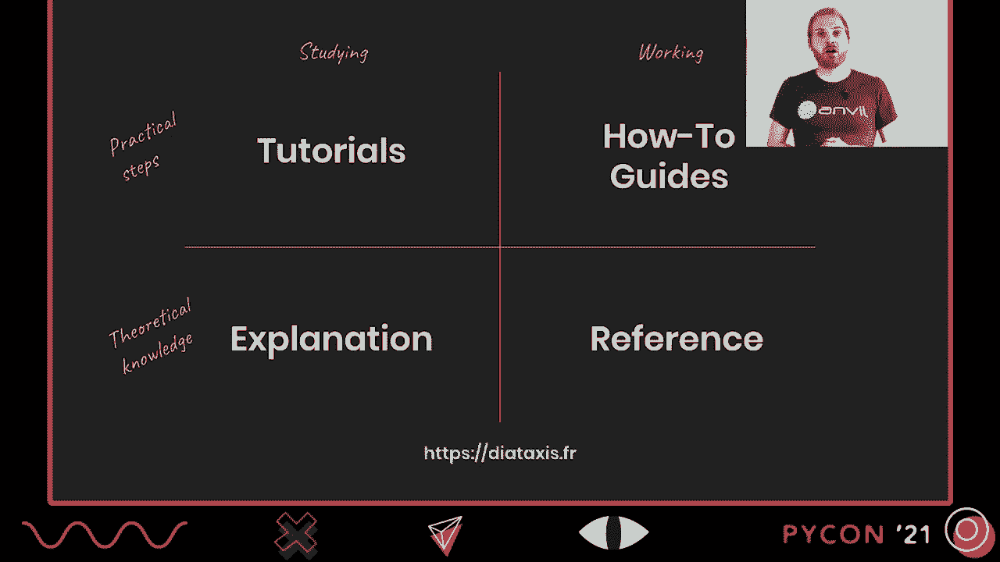

上一节我们介绍了文档分类框架，本节中我们来看看该框架的一个潜在问题，并区分两种关键文档类型。

在这种情况下，我认为参考文档类别存在的最大问题是，该框架试图将太多不同的东西塞入其中。

根据该框架，参考指南是对机械结构及其操作方法的技术描述。这听起来不错，我们确实需要这些。但它也说参考指南描述软件本身，包括API、类、函数等以及如何使用它们。我们显然也希望有这个，但一份文档真的能同时满足这两种需求吗？

我不这么认为。我将前者称为**参考文档**，后者称为**API文档**，它们不是一回事。为了说明原因，我们用一个例子。假设我编写了一个单元测试库并想要记录它。

像大多数单元测试库一样，它有一个**夹具**的概念，即在测试前运行代码设置环境，然后运行测试，最后运行清理代码。如果要描述这个机制以及如何操作，我们需要描述这个顺序，讲述这些组件如何协同工作。

相比之下，API文档描述的是代码对象。它描述类、函数、命令等。因此，你在API文档中写的每一件事都是关于一个代码对象的。这没有留出多少讲故事的空间。

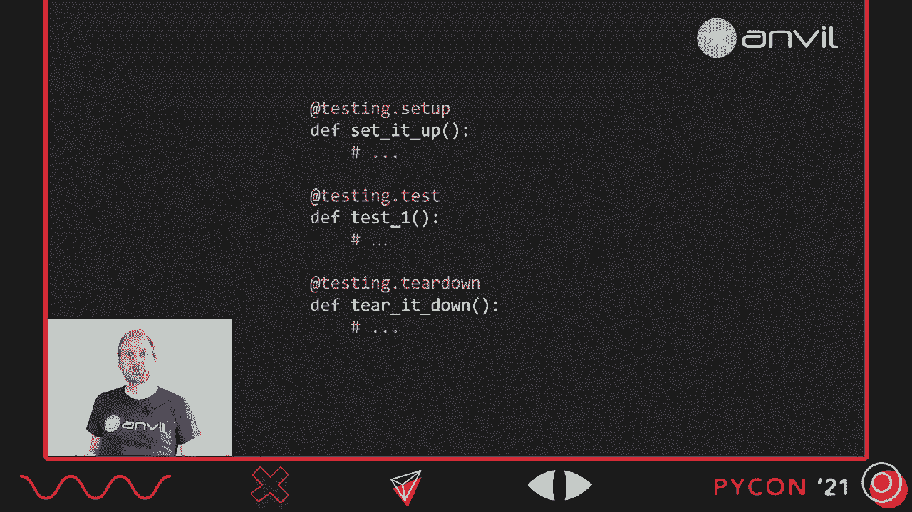

如果我们要记录单元测试库，而我们只有API文档，我们将在哪里描述“设置-测试-拆解”这个序列？我们会把它放在`@setup`装饰器的API文档中吗？放在`test`函数里？还是`@teardown`函数里？我们会尝试把它复制粘贴到所有这些地方吗？

在API文档中没有合适的地方来讲述这个故事。如果我们尝试把这些参考文档塞进API文档的框架里，最终会得到我称之为“JavaDoc病”的东西。

## 警惕“JavaDoc病” ⚠️

上一节我们指出了API文档在讲述系统故事时的局限性，本节中我们来看看一个历史成功案例带来的副作用。

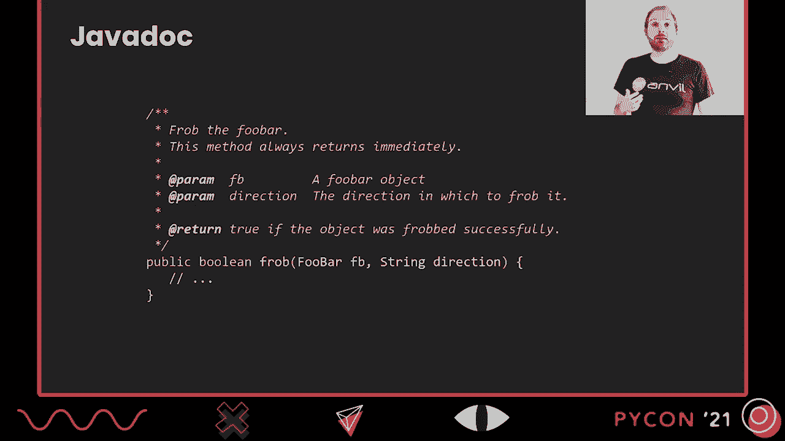

现在这有点不公平，因为JavaDoc非常棒。它是每一个现代API文档工具的鼻祖。JavaDoc于1995年推出，自那时起世界就改变了。它允许你这样编写文档：在函数定义前写一个块注释，其中包含一些文本和机器可读的标签（如`@param`、`@return`）。一个名为JavaDoc的程序会遍历你的代码库，提取这些注释和函数定义，生成干净、一致、易于导航的HTML API文档。这真的很棒。

这使得编写文档更容易，因为你只需以稍微结构化的方式注释代码。这也使得保持文档更新更容易，因为你可以在代码旁边更改这些注释。长期以来，由于JavaDoc的存在，平均Java库的文档质量远超几乎所有其他语言。因此，这是一个巨大的成功。

但这个成功的问题在于，它挤出了其他形式的文档。即使在今天，如果你查看一个Java库，很可能所有或几乎所有的文档都是JavaDoc生成的。因此，你最终会得到像这样的东西：这是一个解析命令行参数的库的JavaDoc。

这是完全合格的API文档。它列出了这个包中的15个类，你可以点击其中任何一个，找到它的功能、参数和返回值。但这些类是如何协同工作的？哪些类调用哪些类？我们不知道。这是API文档，没有地方可以讲述那个故事。实际上，这个库设计得相当好，有一个类（`ArgumentParser`）几乎能满足你所有需求。你发现它了吗？当然没有。因为这是API文档，没有好的地方来呈现那个重要信息。

所以，API文档和参考文档是不同的东西，当你考虑文档时，它们应属于不同的顶级类别。

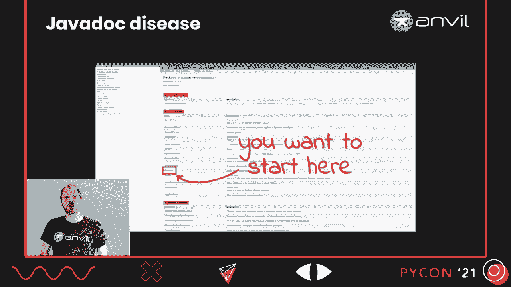

## 总结：文档类型对比 📊

上一节我们通过实例分析了“JavaDoc病”，本节中我们来系统总结API文档与参考文档的核心区别。

*   **参考文档描述系统**。它描述机制。
*   **API文档描述代码对象**。它描述类、函数和命令。
*   **参考文档讲述一个故事**。例如，“设置-测试-拆解”序列。
*   **API文档单独描述一个代码对象**。例如，`@setup`装饰器如何调用及其独立操作。
*   **参考文档应根据项目功能逻辑结构化**。
*   **API文档是自动结构化的**，因为它应该从你的代码中生成。

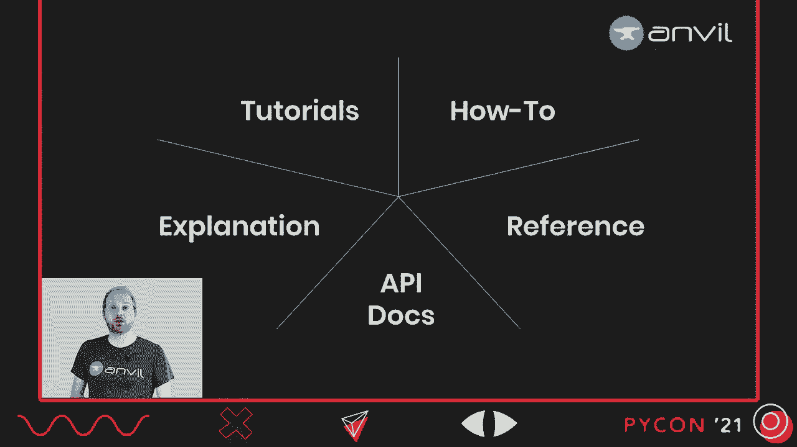

因此，我将它们视为文档中两个独立的顶级类别。现在，我们有很多类别，也有很多文档需要编写。

## 如何组织不同类型的文档？ 🗺️

上一节我们明确了不同文档类型的区别，本节中我们来看看如何让它们协同工作，以支持用户的不同学习路径。

让我们思考一下它们如何协同工作。用户从头到尾阅读你所有API文档的可能性非常小。实际上，用户从头到尾阅读你所有教程的可能性也很小。

你的用户正在进行一段旅程，这段旅程将引导他们接触几种不同类型的文档。大概率如此。

以下是一个用户旅程的例子：
1.  用户想知道该使用什么，看到一篇博客文章推荐你的项目。
2.  他们访问你的项目，尝试了解如何将其用于某个任务。为此，他们需要一份操作指南。
3.  他们开始深入，想修改一个函数调用，需要知道参数。这显然是API文档的工作。

你可以看到，他们正逐渐深入到更细致具体的文档中。但这是另一个旅程：
1.  用户想知道如何完成某个任务，在谷歌上搜索并找到一份操作指南（记住，文档是内容营销）。
2.  下一个问题是：“那是如何工作的？”这就是你的参考文档所讲述的故事。
3.  他们读了一些内容，决定认真学习，于是进行了一步一步的整体教程。

同样，这是一个完全合理的旅程。但你可以看到，他们不仅在放大（深入细节），同时也在缩小（获取概览）。

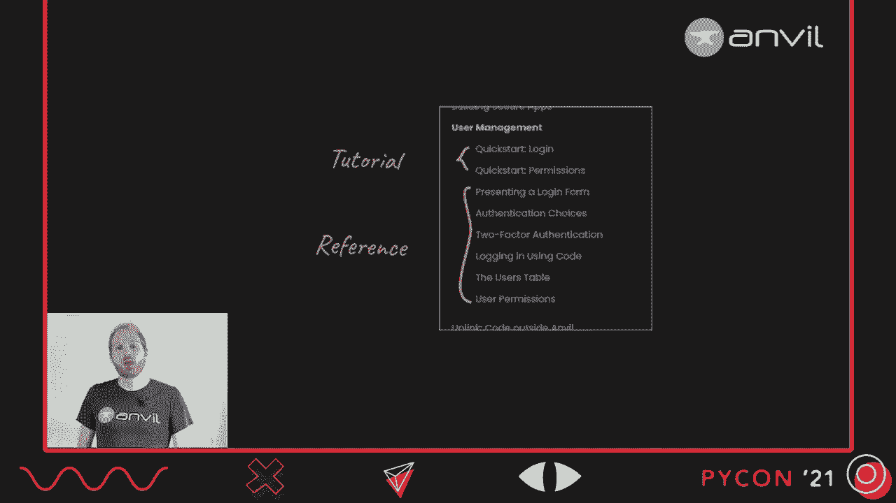

我们希望让用户能够通过我们的文档进行任何他们需要的旅程。最简单的方法是**超链接**。从任何类型的文档链接到任何其他涵盖相同主题的文档。例如，在操作指南中提到一个主题时，链接到参考文档；在参考文档中讨论某个功能时，链接到相关教程。

链接不是唯一的解决方案。将某些类型的文档放在一起也很方便。例如，Anvil有一个用于用户认证的内置库。手册中关于该功能的部分，前两页是迷你教程，其余部分是关于其工作原理的参考。明确地说，这些页面并不试图同时充当教程和参考，因为那行不通。但将它们放在一起，我们可以方便地放大和缩小，以跟随用户需要采取的任何旅程。

## 如何改进文档？与用户交谈！ 💬

上一节我们探讨了如何组织文档以支持用户旅程，本节中我们来看看持续改进文档的最佳方法：与用户交流。

所以，我们有几种不同形式的文档。显然还有很多事情要做。弄清楚接下来应该做什么可能很困难。因此，我想通过谈论解决这个问题的最佳方法来结束：**与你的用户交谈**。

因为如果你倾听用户的声音，你会听到你的文档最需要改进的地方。他们可能不会用太多的言辞来表达，但如果你和他们进行对话，你就会知道。最简单的方法就是面对面交流。这是我的同事Bridget上次帮助用户时的场景。我非常想念这个。

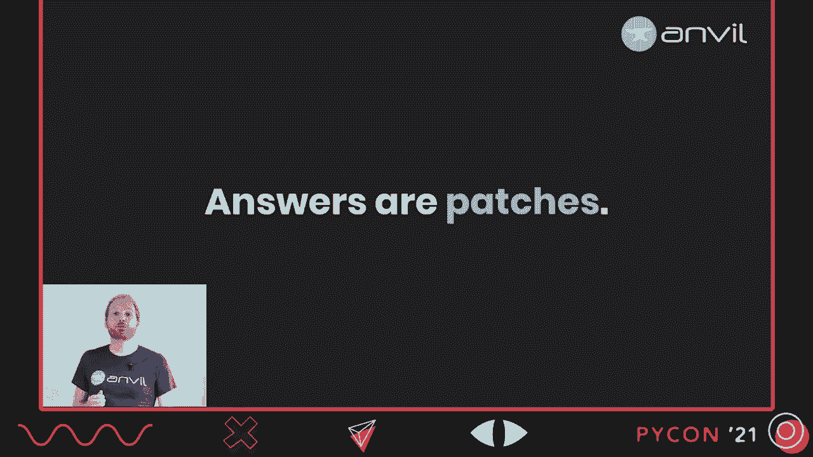

但即使会议是面对面进行的，这也并不是很可扩展。所以你还需要在线进行一些工作。我们有一个论坛。Discourse是免费的、开源的，而且实际上很容易设置和自托管。我会推荐它。如果你不想麻烦，Stack Overflow也能工作。或者你可以设置一个Slack或Discord实例。实际上，请不要使用Slack。社区是封闭的，对话是短暂的，这是个问题。

因为每当开发者询问如何使用你的项目时，那就是你的文档中的一个错误报告。每当这个问题在一个公共的、可搜索的地方被回答时，这就是一种补丁。一个答案可以帮助任何在同一个问题上遇到困难的用户。更好的是，因为这个过程是由用户的问题驱动的，这些补丁自然会向你现有文档中的漏洞靠拢。

如果你使用的平台有投票功能（如Discourse的点赞或Stack Overflow的赞成票），那么你甚至可以获得一些数据，了解哪些补丁确实非常急需整合到你的主文档中。当然，并非每个问题都需要整合。有些问题太晦涩，或者与项目主题关系不大。但这没关系。因为如果你的问答是公开且可搜索的，那么它就构成了你文档的另一个支柱。

你的文档几乎变得自我修复，补丁会自然吸引到正确的地方。那些冷门问题会自我解决。

## 总结与要点 🎯

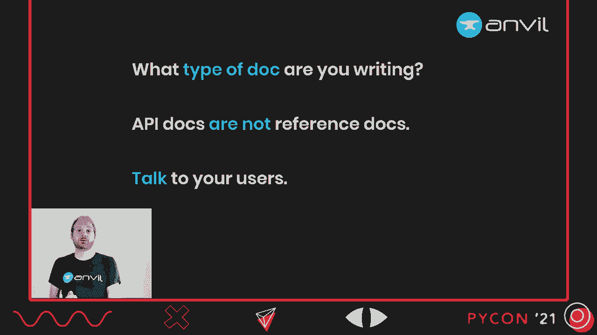

本节课中，我们一起学习了为开发者撰写良好文档的核心要点：

1.  **你的文档就是你的用户界面**。它是你的营销材料，也是新用户对你产品的定义。请像对待重要资产一样对待它。
2.  **开发者文档在用户决策漏斗的顶部比你想象的更重要**。它帮助用户发现并理解你的项目。
3.  **区分你正在撰写的文档类型**。记住，**API文档**（描述代码对象）和**参考文档**（描述系统机制和故事）不是一回事，它们服务于不同的目的。
4.  **与用户交流**。在公开、可搜索的平台上与他们交谈，因为他们将帮助你发现并填补文档中的空白。

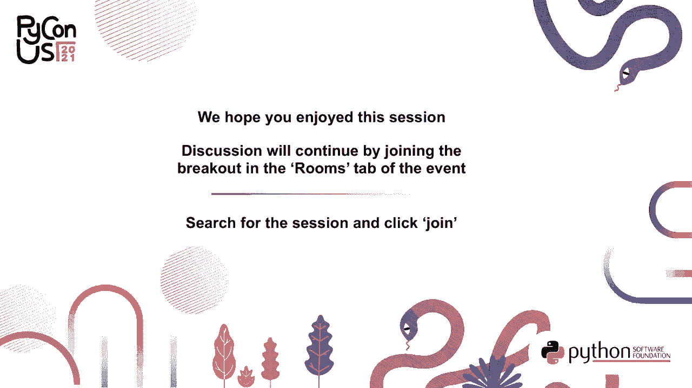

通过应用这些原则，你可以创建出不仅信息丰富，而且真正对开发者友好、能有效支持他们从发现到精通整个旅程的文档。