# 013：从NumPy到PyTorch，API兼容的故事 🧠


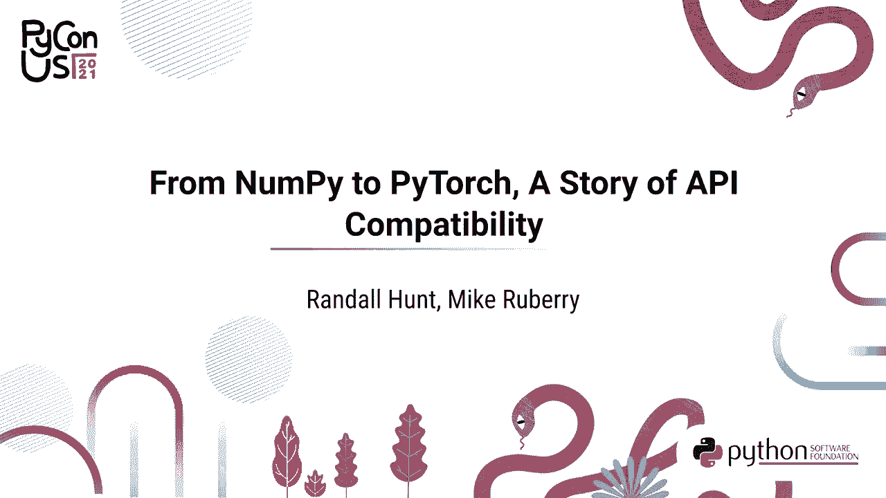

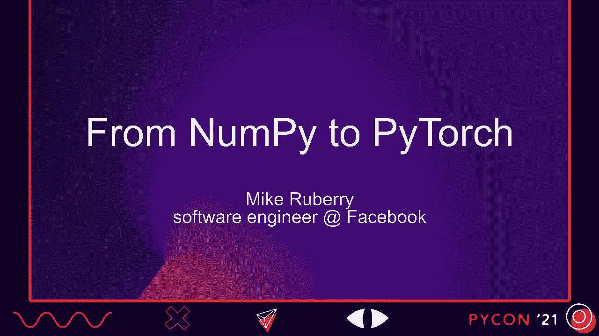

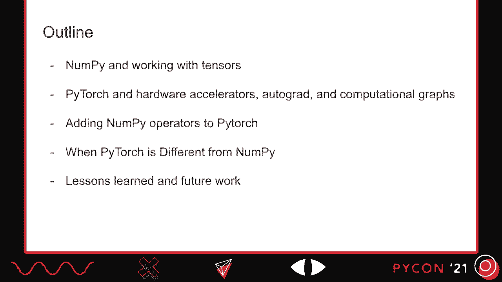

在本节课中，我们将学习PyTorch如何借鉴并扩展NumPy的API。我们将探讨NumPy和PyTorch的核心概念、它们之间的异同，以及PyTorch为实现NumPy操作符所构建的支持架构。课程旨在让初学者理解这两个库的关系以及PyTorch的独特价值。

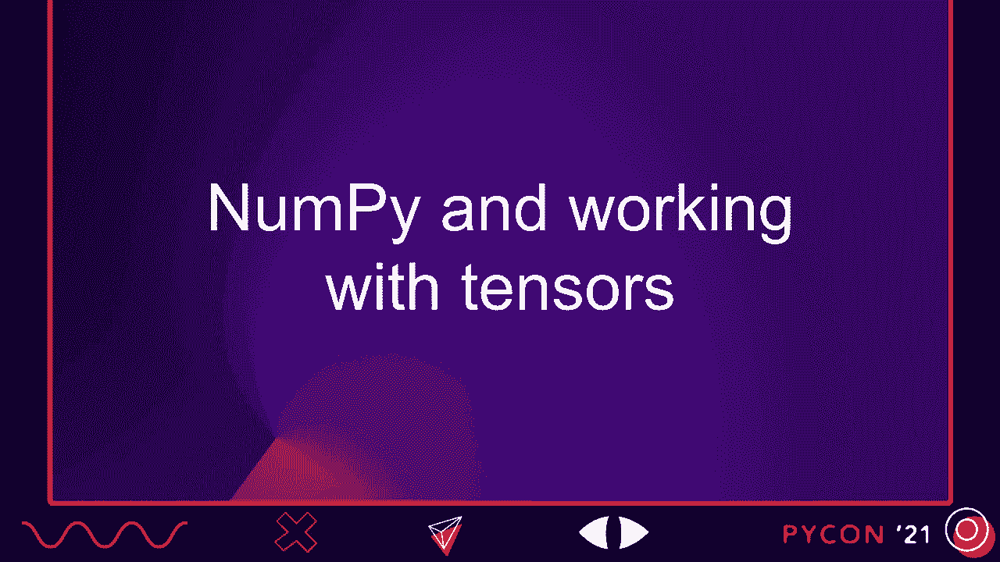

## 1：NumPy与张量操作简介 📊

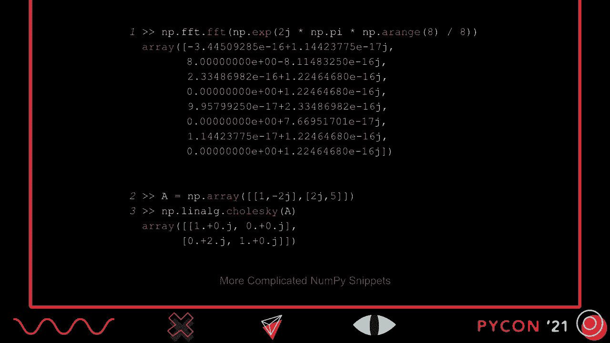

上一节我们介绍了课程概述，本节中我们来看看NumPy的基础。NumPy是一个用于科学计算的Python库，其核心是多维数组对象，称为`ndarray`。在深度学习中，我们通常称其为张量（Tensor）。

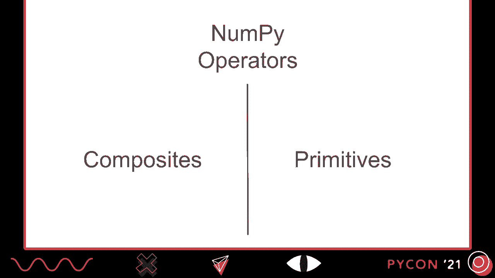

一个简单的NumPy程序示例如下：
```python
import numpy as np
# 创建矩阵（二维张量）
a = np.array([[1, 2], [3, 4]])
b = np.array([[5, 6], [7, 8]])
# 逐元素相加
c = a + b
# 矩阵乘法
d = np.matmul(a, b)
```
张量可以高效表示图像、文本等数据，是现代深度学习的基石。NumPy提供了超过一千个函数来操作张量。

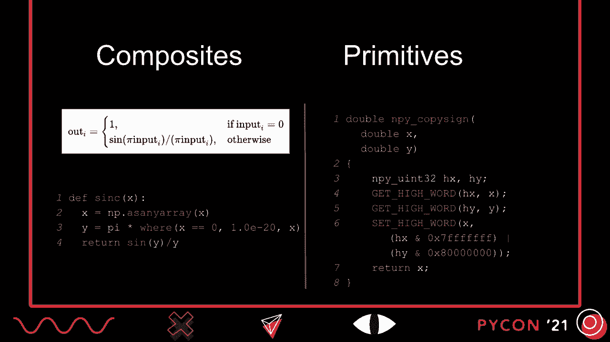

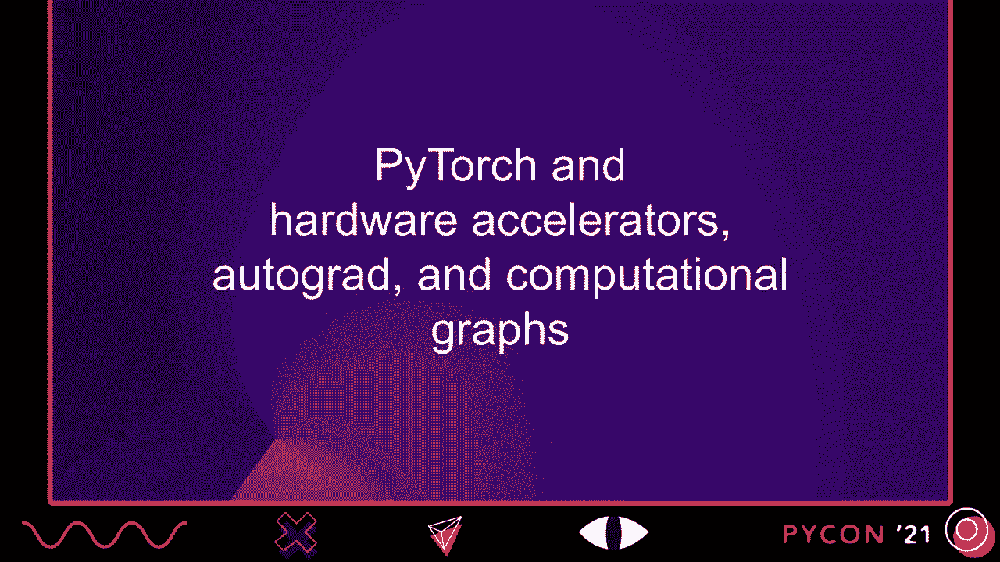

从实现角度看，NumPy操作符分为两类：
*   **复合操作**：由其他NumPy操作组合而成，通常在Python层实现。
*   **原始操作**：拥有自己的内核（直接操作张量数据的底层函数），通常用C++实现。

例如，`np.sinc`函数是一个复合操作，其Python实现基于其他基本操作。而`np.copysign`则是一个用C++实现的原始操作。

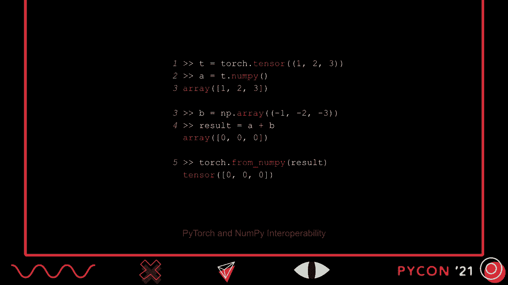

## 2：PyTorch的扩展功能 ⚡

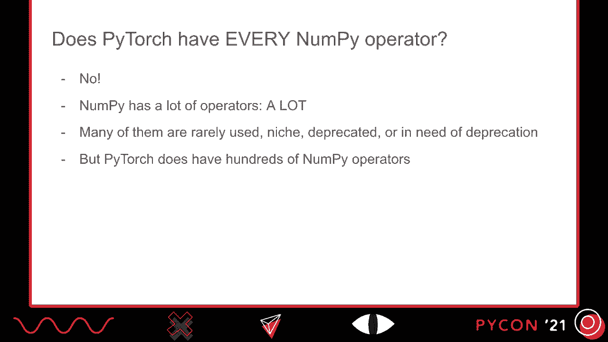

现在我们已经了解了NumPy，本节中我们来看看PyTorch。PyTorch也是一个用于张量操作的流行Python库，其用户界面与NumPy高度相似。

将之前的NumPy程序转换为PyTorch非常简单：
```python
import torch
# 创建矩阵（二维张量）
a = torch.tensor([[1, 2], [3, 4]])
b = torch.tensor([[5, 6], [7, 8]])
# 逐元素相加
c = a + b
# 矩阵乘法
d = torch.matmul(a, b)
```
对于更复杂的操作（如FFT、矩阵分解），PyTorch也提供了相应的函数，且语法与NumPy几乎一致。PyTorch和NumPy张量之间可以轻松转换。

然而，PyTorch并非简单复制NumPy。它专注于实现社区常用的数百个操作符，并在此基础上增加了关键特性：

1.  **硬件加速器支持**：PyTorch张量可以在CPU、CUDA（GPU）、TPU等设备上运行，语义保持一致。
    ```python
    # 在CUDA设备上执行计算
    device = torch.device(“cuda”)
    a_gpu = torch.tensor([[1, 2], [3, 4]], dtype=torch.float32, device=device)
    b_gpu = torch.tensor([[5, 6], [7, 8]], dtype=torch.float32, device=device)
    c_gpu = torch.matmul(a_gpu, b_gpu)
    ```
2.  **自动求导**：这是训练神经网络的核心功能。
    ```python
    x = torch.tensor([1.0, 2.0], requires_grad=True)
    y = x * 2
    z = y.sum()
    z.backward() # 自动计算梯度
    print(x.grad) # 输出梯度值
    ```
3.  **计算图与优化**：PyTorch支持将操作序列编译成计算图（通过TorchScript、FX等），从而实现跨操作优化并减少Python与底层C++之间的调用开销。

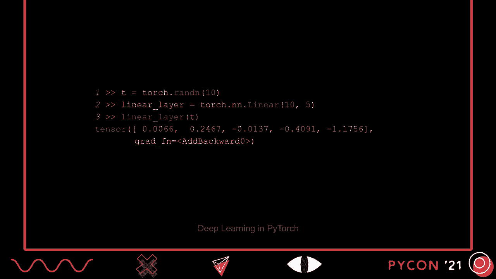

这些特性使PyTorch成为一个强大的深度学习框架。在幕后，PyTorch操作符主要用C++实现，并为可微操作提供了自动求导公式。

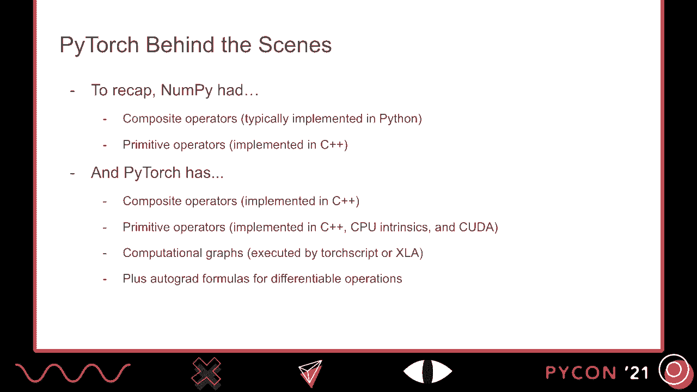

## 3：将NumPy操作移植到PyTorch 🔧

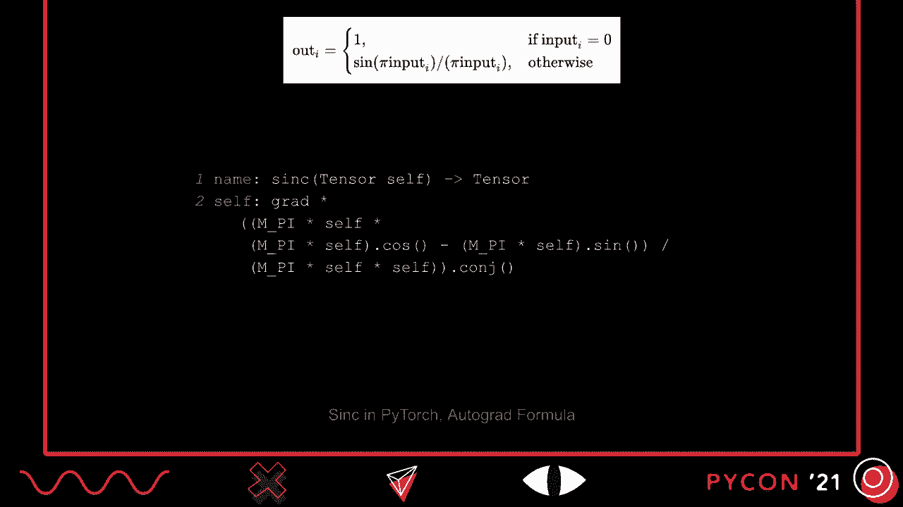

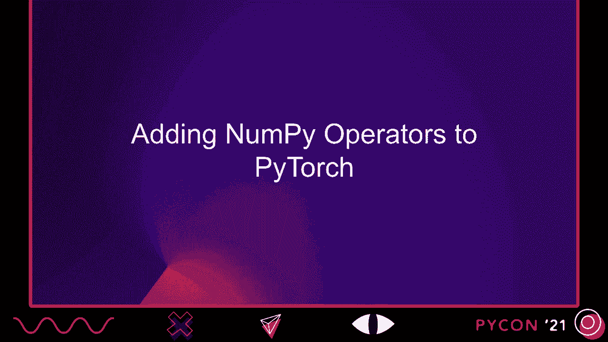

上一节我们介绍了PyTorch的独特功能，本节中我们来看看将NumPy操作符添加到PyTorch的具体过程。这通常需要三个步骤：

1.  **编写C++实现**：为原始操作编写CPU和CUDA内核。
2.  **编写自动求导公式**：如果操作可微，需定义其反向传播规则。
3.  **编写全面测试**：确保操作符在各种条件下正确工作。

这项工作至关重要，因为PyTorch社区强烈期望能使用熟悉的NumPy功能，并且希望实现与NumPy保持一致。社区成员也积极参与了数十个操作符的移植工作。

为了高效完成测试，PyTorch开发了**OpInfo测试框架**。其核心是`OpInfo`类，它用Python描述一个操作符的元数据（如支持的数据类型）和生成测试输入的函数。

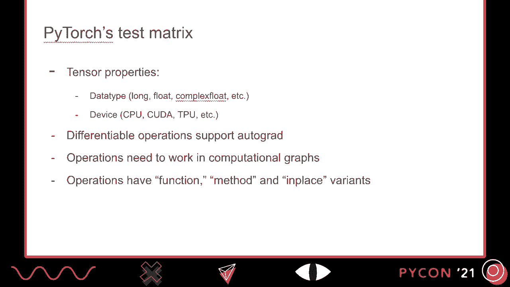

以下是该框架的关键优势：
*   **自动生成测试**：基于OpInfo，可以自动为每个操作符生成针对不同设备、数据类型的测试用例，无需手动编写数百行代码。
*   **统一信息源**：OpInfo是所有操作符功能的单一真实来源。
*   **易于扩展**：支持新设备类型（如XLA）和新数据类型，测试会自动覆盖。

这个框架极大地提升了开发效率，确保了代码质量。

## 4：PyTorch与NumPy的差异 🤔

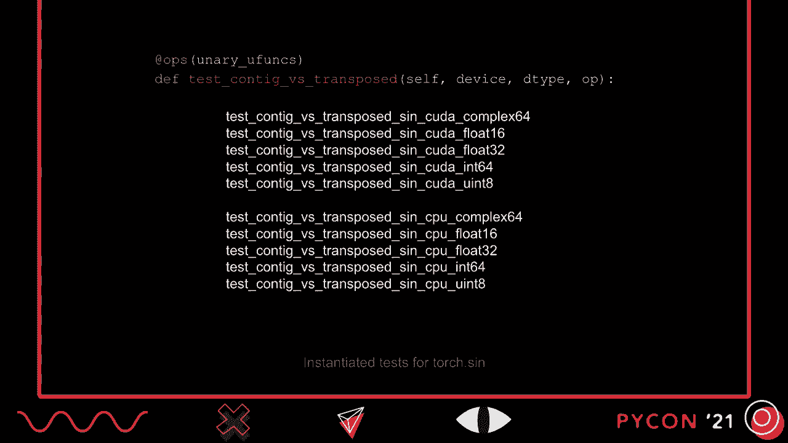

尽管追求兼容，但PyTorch在一些地方有意与NumPy保持差异，以维护自身的一致性和原则。以下是几个例子：

以下是PyTorch与NumPy在一些细节上的不同处理方式：

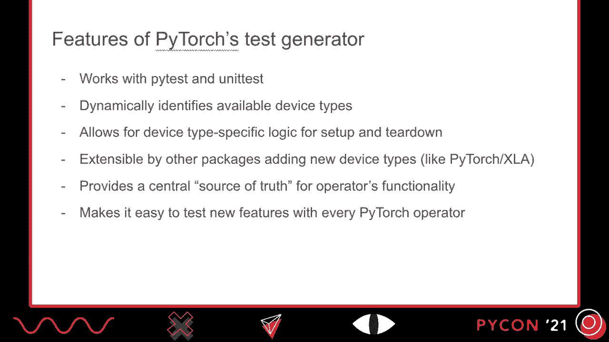

*   **`reciprocal`（倒数）函数**：对于整数输入，NumPy使用整数除法（如`1/2=0`），而PyTorch返回浮点数结果（`1/2=0.5`），以保持与Python和PyTorch除法行为的一致性。
*   **`eig`（特征值）函数**：对于实值矩阵，NumPy仅在特征值为复数时才返回复数张量。PyTorch为了一致性（便于计算图进行输出类型推断），总是返回复数张量。
*   **复数排序**：NumPy允许对复数进行排序（先比较实部，再比较虚部）。PyTorch认为这在数学上不直观，因此直接抛出运行时错误，不支持此操作。

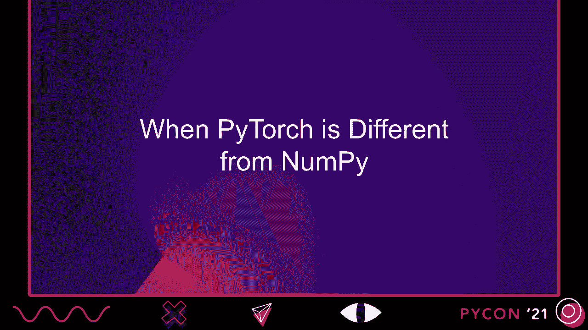

此外，还存在一些系统性差异，但社区反馈较少：
*   **类型提升规则**：PyTorch更倾向于提升到浮点类型，而NumPy更倾向于双精度。
*   **返回值**：NumPy的某些操作可能返回Python标量，而PyTorch始终返回张量。

这些差异都是有原则的，旨在维护PyTorch内部体验的一致性。

## 5：经验总结与未来展望 🚀

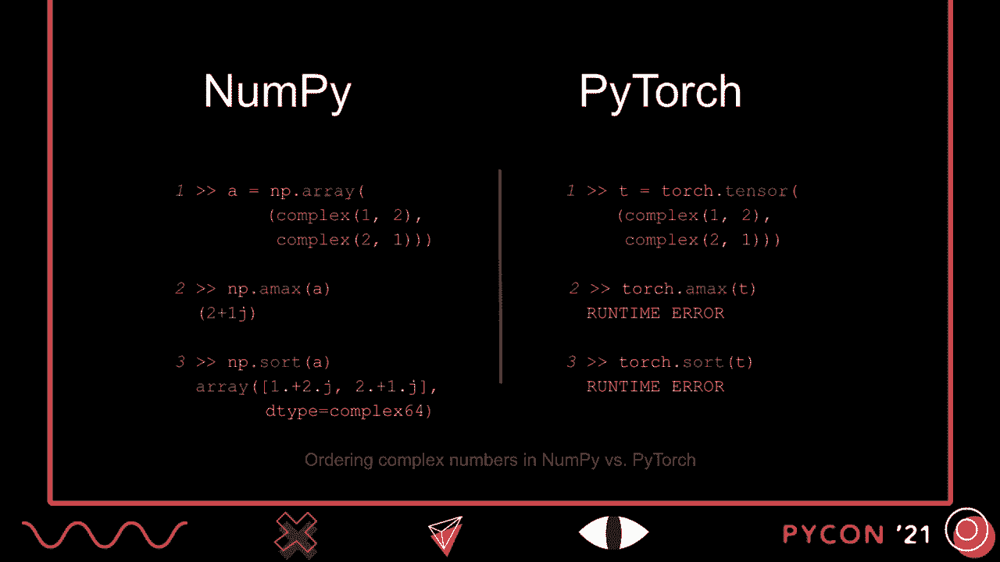

在本节课中，我们一起学习了NumPy和PyTorch的关系。让我们总结一下从移植NumPy操作中学到的经验教训：

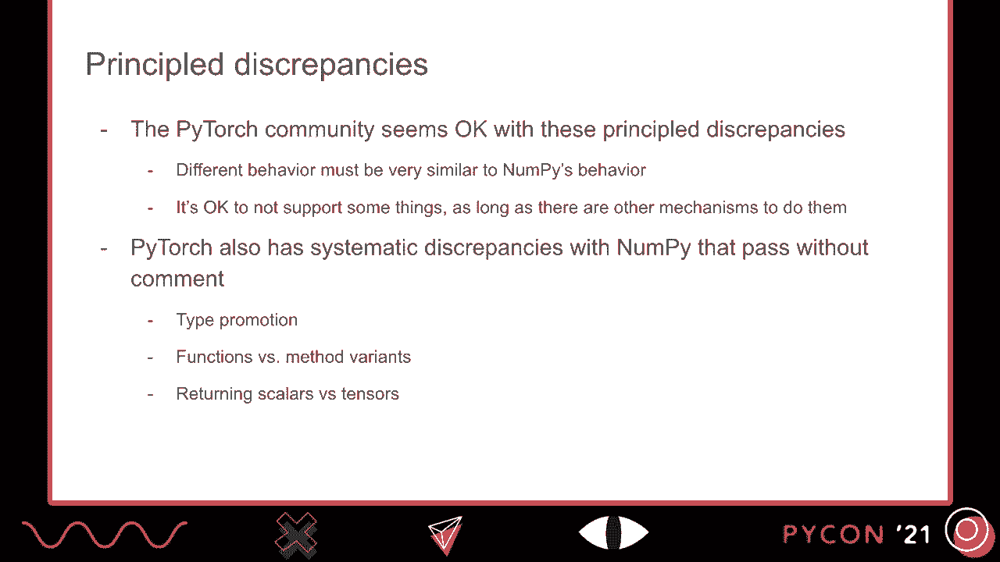


以下是核心的三点经验：

*   **倾听社区**：社区的反馈明确了既需要NumPy的功能，也需要实现与PyTorch整体体验保持一致。
*   **提升开发效率**：像OpInfo这样的支持架构能节省大量开发和测试时间。
*   **坚持原则**：在借鉴其他API时，必须清楚自己的设计原则，不能盲目复制，以免造成自身生态系统的不一致。

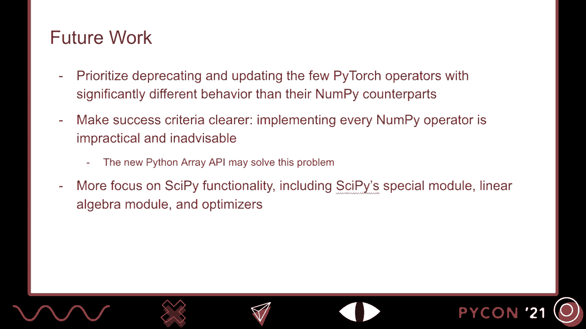

展望未来，PyTorch团队计划：
1.  更多地**修复与NumPy的不一致之处**，而非一味添加新操作。
2.  增加更多来自**SciPy**库的操作符。


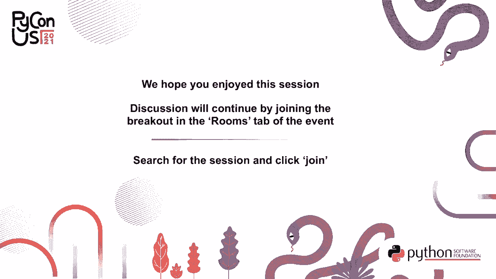

**总结**
本节课中，我们一起学习了NumPy作为科学计算基础库的角色，以及PyTorch如何在其之上构建，通过支持硬件加速、自动求导和计算图，成为一个强大的深度学习框架。我们了解了PyTorch实现NumPy API的策略、其背后的技术支持，以及有原则地与NumPy保持差异的原因。理解这些将帮助你更有效地在两个库之间切换，并充分利用PyTorch进行深度学习开发。