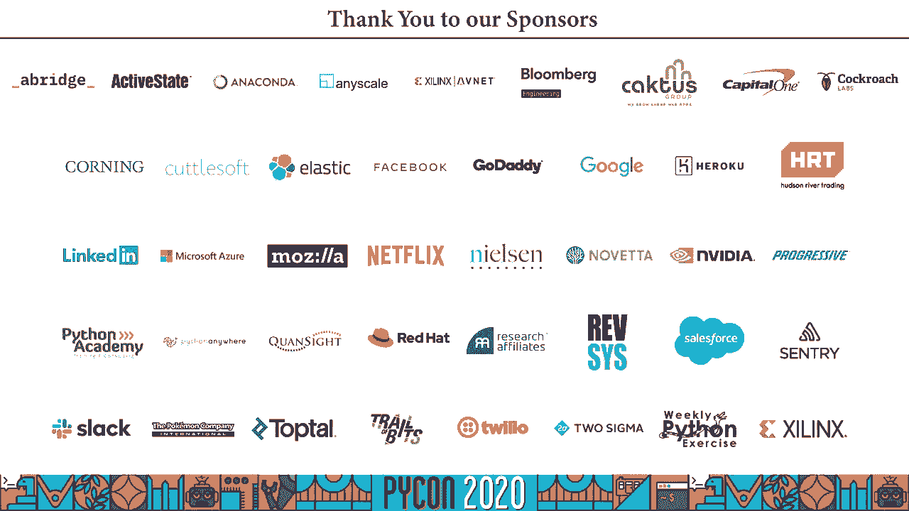

# 016：打包 Python 应用以进行分发

## 概述
在本节课中，我们将学习如何使用 Briefcase 工具来打包 Python 应用程序，以便将其分发给没有 Python 经验的最终用户。我们将了解 Briefcase 如何将代码、依赖项和解释器捆绑成一个独立的单元，从而支持跨平台分发。

---

## 打包 Python 应用以进行分发

大家好，我叫拉塞尔·基思·麦吉恩。今天我在这里与你们谈谈分发。

你的蛇装进公文包中以便于运输。今天我在瓦朱克农戈·普查尔（即西澳大利亚珀斯）向你们讲话，我想认可瓦朱克农戈作为我录制的土地的传统所有者，以认可他们与土地、水域和文化的持续联系，并向他们致以敬意。

构建者的过去、现在和未来。所以去年在克利夫兰的 PyCon US 上，我非常荣幸地成为开幕主题演讲者。在那次演讲中，我谈到了 Python 作为一门语言所面临的挑战以及我们社区工具中的空白。其中一个空白与某种东西有关。

这似乎应该有一个明显的解决方案。如果你是某些 Python 代码的作者，当是时候将这些代码交给其他人以便他们可以运行时，你该如何做到呢？

对于这个问题，没有一个简单的答案，部分原因是分发对不同的人有不同的含义。如果你是一个库的作者，这个库是一个有良好定义 API 的 Python 代码集合，你希望其他人将其嵌入到自己的项目中，Python 确实为你提供了一个相当不错的答案。

这内置的功能。例如，像 Requests 这样的项目有一个明确的分发故事。该项目配置了一个 `setup.py` 和一个 `setup.cfg` 文件，当维护者想要发布新版本时，他们会为该新版本构建一个 wheel 并上传到 PyPI。作为最终用户，你可以通过 pip 安装 Requests，然后导入 Requests。

在你的代码中，然后开始发出请求。好的，Python 的打包生态系统偶尔会有一些小问题，但在大多数情况下，得益于 Python 打包机构的出色努力，像 PyPI、pip 和 twine 这样的工具工作得相当可靠。另一个分发的用例是 Python 项目。一个项目可能具有版本控制。

这可能是一个代码库，或者只是某个目录中的代码集合，但不会被上传到 PyPI。你从代码库获取代码，或者获取目录的副本，并有效地运行这个代码库或目录。像 PyCon US 网站这样的网站就是经典例子，但这并不是特定于网站的现象。其他软件也可以被分发。

作为一个项目。很多 Jupyter 笔记本在这个意义上是项目。它们是代码的集合，并不是为了商品化重用而设计。它们服务于一个单一的目的。这些项目是通过复制分发的，然后以某种方式部署。这个项目在任何传统意义上都没有被安装。

他们也没有单一的 Python 强制配置。他们可能在 requirements 文件中有一些配置，但即使那个名称也只是一个约定。而如何设置执行环境的问题则留作文档问题，通常假设用户对 Python 开发生态系统有一定的了解。

Python 生态系统中的另一个开发工具用例也是在 PyPI，就像一个库。你可以在开发环境中 `pip install PyTest`，然后可以导入 PyTest，以便为你的代码库添加参数化测试用例的固定装置，但由于 PyTest wheel 中的元数据，pip 还会安装一个入口点，让你从。

命令行。然而，这并不总是那么简单。如果你使用过 GitHub Pages，可能会遇到一个名为 Jekyll 的静态网站生成器。Jekyll 是用 Ruby 编写的，Jekyll 主页上的快速启动说明说你应该运行 `gem install bundler jekyll`。现在，我不是 Ruby 开发者，这意味着什么呢？当我发现另一个 Ruby 工具时，它会告诉我。

我是否已经安装了 bundle，以便将其他工具打包？

我拥有的版本是否兼容？如果这个新工具告诉我需要更新我的 Ruby 解释器，Jekyll 会继续工作吗？Jekyll 是用 Ruby 写的，但这并不是关于 Ruby 的问题。Python 工具也有完全相同的问题。这是一个分发问题。实现语言对最终用户几乎没有意义。

PyTest 的作者可以合理地认为你对 Python 生态系统有一定了解，因为 PyTest 用户几乎都是 Python 开发者，但如果你的用户不是 Python 开发者，比如说，哦，创建一个虚拟环境并运行 `pip install my tool`？这对任何不是已经有经验的 Python 开发者的人来说毫无意义，而对刚开始接触 Python 的人来说，这更是一个。

一直以来的混淆来源。坦白说，即使你的用户是 Python 开发者，这也不是一个好的用户体验。以 Black 这样的工具为例，除了少数例外，你可能只需要在计算机上保留一份。当更新发布时，你可能希望在所有地方使用该更新。但如果你将它安装到你的。

如果你激活了虚拟环境，系统 Python 将不可用或不可靠？

那么图形应用程序呢？随便选择你笔记本上的一个用户空间应用程序，比如 Slack。它们是用什么语言写的？谁在乎？

我并不想将 Slack 作为库来使用，我只想用它。我想以熟悉的方式安装它，点击一个图标，让应用每次都可靠启动。如果我更新另一个应用，比如 Firefox，我不想因为 Firefox 更新了共享库而导致我的 Slack 安装出现问题。

解释器。这些应用程序的最终用户真正关心的是安装的便利性，安装的便利性。让应用出现在启动菜单中的启动板上，并且有可能让该应用通过应用商店可下载，并定期更新。

渠道。每种类型的工具都有不同的分发需求，它们都需要在运行时使用 Python。但这些用例中只有第一个真正对 Python 生态系统有好的解决方案。即便如此，那种开发故事本质上假定你是一个有 Python 开发环境的 Python 开发者，并且你对操作它感到舒适。问题是如何。

当你将 Python 代码提供给最终用户时，如果最终用户对 Python 不感兴趣或不擅长设置和配置 Python 环境，那就是一个开放的问题。但这是一个非常重要的问题。它影响着用户对我们代码的体验。很高兴我们为第一个用例有了解决方案，但我们需要其他三个用例的可靠解决方案。

就我个人而言，我特别感兴趣的是最后一个，其次是第三个。我是 B-Web 项目的创始人，该项目旨在确保 Python 在一个日益移动化的计算世界中保持相关性。如果你正在为 iPhone 和 Android 构建应用程序，唯一的分发单位就是应用。

你无法在 iPhone 上使用 pip 安装。你无法在 Android 设备上安装系统版的 Python 并告诉用户创建一个虚拟环境。如果 Python 想在移动世界中保持相关性，我们需要一个涵盖应用分发的故事。并且，尽管我主要关注移动平台，但同样的故事实际上也适用于桌面平台。MacOS 和 Windows 一直。

过去有应用程序，但这些平台越来越鼓励通过应用商店以独立沙箱捆绑的方式分发应用。今天我将向你介绍 B-Web 项目对此问题的解决方案，而这个解决方案就是 Briefcase。Briefcase 是一个用于打包 Python 应用程序的工具。它将你的 Python 代码。

它将应用打包成一个独立单元，可以提供给没有 Python 经验的最终用户，以便他们可以在自己选择的平台上安装，而无需知道他们正在运行 Python 代码。Briefcase 是一个符合 PEP 518 的构建工具。如果你不知道这意味着什么，我建议查看 Brick Cannon 的这篇博客文章，但简而言之，它是一个。

这意味着它是一个使用 PyProject 进行配置的构建工具。它为 Windows 生成 MSI 安装程序，为 MacOS 生成 DMG 或原始应用包，为 Linux 生成 App Images，并生成可以上传到 Apple App Store 或 Google Play Store 的 iOS 和 Android 项目。它也具有高度的可扩展性。如果你想为其添加 flat pack 或 snap back。

Linux，你可以。或者如果你想支持一个全新的平台，比如机顶盒或手表，你也可以做到。现在，虽然它与 B-Wears 的 GUI 框架 toga 配合得很好，但并不需要它。你可以用 Briefcase 封装 Pyside 或 TK 交互应用。这个声明的警告是，Briefcase 的能力仅与框架本身一样好。Briefcase。

是一个打包工具。它无法让你的 TK 交互应用在移动设备上运行，因为 TK 尚未移植到移动设备。Briefcase 对命令行工具也不是很合适，至少目前还不是。它可能会被改编为命令行使用，我个人非常希望看到这一用例的支持，但目前对我来说，确切的支持形式并不明显。

这主要是 Briefcase 在内部工作方式的一个功能。Briefcase 使用的方法本质上是可能解决应用程序分发问题的最简单方法。Briefcase 应用是你的 Python 代码的完整副本、所有代码依赖项的完整副本，以及完整的 Python 解释器捆绑，以一种对你有意义的方式。

就是这样。Briefcase 大多是一个模板工具，结合了 PIP 的封装来安装你的 Python 依赖项，以及构建 DMG 或 MSI 文件或为分发签署应用程序所需的本地平台工具的封装。现在，Briefcase 并不是 Python 中唯一存在的应用程序打包工具，所以。

为什么你应该使用 Briefcase 而不是其他选项呢？首先，它并不试图聪明。一些替代 Briefcase 的工具，如 Pyoxidizer 或 Py installer 及其某些操作模式，将获取一个工作应用与创建可执行文件相卷积。为了支持创建可执行文件的目标，它们对你的代码做各种花招，把它打包成一个 zip 归档。

它嵌入到数据块中，并在运行时解压到内存时执行。当这能正常工作时，那是很棒的。但它并不总是有效，因为从根本上说，Python 代码是设计为通过解析解释器在代码目录上运行的。好吧，如果你对 Python 的导入系统有足够的了解，或者你知道这并不完全正确。

但是如果你在现实世界中拥有足够的 Python 实践经验，你会知道这在实践中是足够接近真实的，并且没有区别。如果你不相信我，我只需说一句 zip save X。另一方面，Briefcase 以 Python 设计的方式运行 Python，即在源代码目录上运行的解释器。Briefcase 唯一的事情就是你所支持的平台。

它的作用是自动化将工作解释器提供给最终用户的过程，以一种不需要他们了解任何 Python 的方式。Briefcase 也是跨平台的，这意味着你有一个单一的配置文件，可以生成适用于 MacOS、Windows、Linux、iOS 和 Android 的商店。这意味着你不需要为分发重复配置。

你的应用程序或消除潜在的错误源。好吧，够了，给我看代码。今天我将要做的是带你了解使用 Briefcase 打包项目的生命周期。如果你想要更详细的讲解，docs.bwe.org 上的 be where 教程有一个完整的演示，提供了比我能给你的更多解释。

在 25 分钟内。让我们开始一个新项目。我们创建了一个新的虚拟环境并安装了 Briefcase。我在这里提供的是 UNIX 规范的指令，但 Briefcase 也在 Windows 上运行。如果你想要了解如何转换，be where 教程为两者提供了命令。如果你想要开始一个全新的项目，Briefcase 有一个向导帮助你运行 Briefcase new。

你将会看到一系列问题，伴随一些解释性文本。你会被提示提供一系列细节。你将被提示填写一个在线表单。那是你展示给用户的应用名称，以及一个 Python 化的名称，是你将会 pip 安装的名称。

你将被问到一个用于命名空间的捆绑包，以将我的 hello world 与你的 hello world 区分开来。捆绑 ID 是应用商店使用的常见格式。它通常是你控制的域名的反向顺序。然后将该捆绑与应用名称结合，形成你应用的完整捆绑 ID。例如 org.bwe.hello world。

你将被询问项目名称。Briefcase 项目可以包含多个分发应用，因此你可以从一个代码库构建多个应用捆绑。但是如果你只打算有一个应用，你可以将表单名称用作项目名称。你将被要求提供项目的一行描述。你将被询问作者的姓名和在帮助文本中使用的电子邮件。

以及版权标签。项目的 URL，许可因为他的分发代码，你需要一个许可证。最后，还有一个 GUI 框架。Briefcase 为 toga 提供了一个模板，bewears 自己的 GUI 框架，但也有一个 pie side 模板以及一个空应用，你可以根据需要填充任何你想使用的框架。

你最终得到的，将是一个完整的停止项目，包括足够的代码来启动一个应用程序图标和多种格式以及一些项目元数据。你还会注意到，应用程序名称中的 DAP 破折号已经被规范化为下划线。所以应用名称 Hello Dash World 已被转换。

当它成为源代码源目录时，变为 Hello Underscore World。无论你选择哪个 GUI 框架，你都会得到相同的文件。应用的内容唯一不同的是 app.py、main.py 和 pie project.toml 中的一些值。这里特别关注的元数据在 pie project.toml 中。该文件包含有关应用本身的所有细节。

你的应用。此文件的内容将与您在向导中提供的答案相匹配。还有一个 built system 部分，这是 PEP518 的要求，声明这是一个 briefcase 项目。所有的 briefcase 选项随后在 tool.briefcase 部分中定义。项目级别的选项在该根级 tool.briefcase 中定义。各个应用则。

他们有自己的部分。因此，此配置文件将 Hello Dash World 定义为一个应用。这是应用名称，正式名称为 Hello World，等等。Hello World 应用的配置由项目设置和应用设置覆盖组成。因此，Hello World 应用将继承项目级别的版本定义。如果你想要有一个。

如果你想为此应用指定不同的作者名称，可以通过在应用的配置块中添加作者名称来实现。需要明确的是，这是一种 briefcase 特定的行为，并不是你会在其他 PEP518 工具中看到的。有两个例外情况适用于这种覆盖行为，即 sources 和 requires。

Sources 定义了你想包含在应用中的源代码目录列表。因此，这里我们表示源 Hello World 目录是此应用的一部分。整个文件夹将被递归复制到我们的打包应用中。对此的唯一要求是，你的源目录之一需要与。

Requires 定义了应用的 Python 依赖项。同样，这只是一个列表，采用你在 pip install 时使用的相同格式。Sources 和 requires 是一个累积设置。因此，如果你在项目级别指定了 sources 定义，任何应用级别的 sources 将被附加到该在项目级别定义的列表中。

图标也值得特别提及。你会注意到图标设置不包括文件格式扩展名。这是因为 briefcase 使用提供的值作为基础名称，并根据平台附加格式。因此，.ico 用于 Windows，.png 用于 Linux，等等。在某些平台上，你必须提供多个分辨率的多个图标，这些尺寸。

修饰符将附加到文件名以及扩展名。你还可以通过为该平台添加配置部分来指定特定于平台的选项。生成的 pipe project.toml 将包括所有支持的平台的部分：MacOS、Linux、Windows、iOS 和 Android。因此，这里我们指定了一个 pytool.briefcase.app。

helloworld。macos，部分。这些选项只会应用于该应用程序的 MacOS 构建。再次强调，sources 和 requires 等累积或其他设置将覆盖应用级或项目级的值。这里的内容是如果你在向导中选择 toga 时获得的内容，但如果你选择 PySide 或不使用框架，你将获得不同的内容。实际上，你甚至可以深入探讨。

如果你定义了一个工具。briefcase。app。helloworld。macos。dmg，这些设置只会应用于 MacOS 上的 dng 构建。例如，你可能这样做是为了指定 dng 安装程序的图标。如果你想在项目定义中添加第二个应用程序，你可以定义一个工具。briefcase。app。second，app 部分，然后继续为平台和打包格式等进行定义。

现在这个 stub py 项目.tom 文件是由 briefcase new 为你生成的，但你不必使用那个向导。如果你有一个现有项目，你可以从头开始自己创建 py 项目.tom 文件。不管你是如何创建的，你现在有了一个 briefcase 配置文件。我们如何使用它？

好吧，你可能首先想做的就是看看你的应用程序是否能运行。Briefcase 包含一个开发者模式，让你快速迭代配置。如果你运行 briefcase dev，Briefcase 将使用你的 py 项目.tom 文件来确定如何运行你的项目，然后在本地虚拟环境中运行它。第一次这样做时，它将查看你的配置。

文件，将安装你声明的所有要求，然后它将安装你的应用程序。现在请记住，briefcase 的设计动机是，最简单的事情也能成功。Briefcase dev 只是你当前平台要求列表的 pip install 的简写，接着是 Python minus M helloworld 运行你的应用程序。在后续运行中，依赖项。

步骤默认不会执行。Briefcase 只会自行启动项目。如果你添加或修改依赖项，你需要添加-D 标志以强制更新依赖项。如果你使用了向导，你将得到一个可工作的应用程序。它会是一个空窗口，但它将是一个可工作的应用程序，你可以现在在应用程序代码中进行迭代，添加功能。

修复 bug，无论你需要做什么。然而，最终时机会到来，当你准备好打包你的应用程序以进行分发时。第一步将是创建你的应用程序。为此，你需要调用 briefcase create。这将做一堆事情。首先，它将查看你当前的平台，并获取该平台的应用程序模板。

所以我在 MacOS 上运行，因此它将使用 MacOS DNG 模板。其次，它将获取一个支持包。支持包是一个可以嵌入到你的应用程序中的 Python 版本。对于 Windows，我们使用官方发布的 Python 嵌入包，其他平台则小心维护支持包。

不论你的平台是什么，briefcase 将下载支持包，解压到刚刚创建的应用程序模板中。briefcase 然后下载并安装你应用的依赖项，但它不会安装到你本地的虚拟环境中，而是安装到应用程序模板中。briefcase 接着安装特定于应用程序的部分或源代码。

你的应用和所有应用程序资源，如图标。然后就完成了。你现在拥有一个完整的应用程序模板。你的项目目录现在将包含一个平台文件夹，在这种情况下是一个名为 Macos 的文件夹。在这个文件夹里会有你项目中每个应用的文件夹。下一步是构建那个应用。我相信你会震惊地听到执行此操作的命令。

是 briefcase build。现在在 Macos 上，这实际上什么也不做，因为生成的应用程序或应用程序模板实际上是可执行的。Macos 应用只不过是一个特定格式的目录，里面有一些已知位置的元数据。在其他平台上，可能需要进行一些编译，而 briefcase 管理器负责调用那个编译器。

在这个时候，你的项目中会有一个与平台匹配的文件夹，该文件夹将是一个应用程序，以及作为构建过程一部分创建的任何文件。在这种情况下，它是一个 Macos 应用。如果你点击那个图标，一个应用程序会启动。或者你也可以保持控制台模式，使用 briefcase。你可以运行你的应用，你错过了它。

briefcase run。你应该看到一个正在运行的应用程序。现在这不是一个非常有趣的应用程序，但它是一个正在运行的应用程序。不论在你所选的平台上这意味着什么。在 Macos 上，这意味着任务栏中的一个图标，以及与应用程序名称匹配的应用程序菜单。

最后一步是使用 briefcase package 打包你的应用。这是分发之前需要完成的任何最终打包工作。因此，创建安装程序、进行代码签名等等。代码签名支持目前处于早期开发阶段。目前只有 Macos 应用被签名，并且目前仅被签名而未经过公证，如果你知道这是什么意思的话。

这是一个需要更多工作的领域，但所有的组件都已到位。但在打包之后，项目中的平台文件夹将包含一个可以上传进行分发的工件。一个 dmg 文件，一个 MSI，或任何适合所选平台的文件。因此，我们打包了我们的应用，发现了一个问题。我们需要更新我们的代码。我们需要吗？

重新经历这个整个过程吗？不需要。为此有 briefcase update。默认情况下，这将重新安装应用程序的代码。如果你也想更新依赖项，可以指定-d。如果你想更新应用程序资源，比如图标，可以指定-r。briefcase 还有一些其他值得注意的功能。briefcase create 是一个简写。

你的平台是从你当前运行代码的平台隐含得出的。输出格式是该平台的默认输出格式。如果你想要 Mac，Briefcase create 是 Briefcase create Macos DMG 的简写。如果你想创建不同的输出格式，比如你想要一个原始应用而不是 DMG 文件，你可以调用 Briefcase create Macos app。

如果你想针对完全不同的平台，Briefcase 创建平台。实际上，这并不是特别有用，因为你不能在 Mac 上创建 Macos DMG 或 Windows MSI，因为所需的工具是平台特定的。但这有一个重要的用例，我们稍后会提到。Briefcase 还将暗示早期步骤如果。

它们是必要的。如果你有一个全新的项目，刚从 Briefcase 新建并运行 Briefcase run，Briefcase 会检测到有一个尝试延迟并创建它，然后构建并运行它。Briefcase run 还允许使用 -U 选项，在执行之前更新应用。因此，你的开发周期可以短到不断重复 Briefcase run -U。

Briefcase 还会检查你是否具备编译所需的工具，并尽可能为你管理下载这些工具，接受任何许可等等。如果你无法为自己安装工具，比如在 Mac 上无法安装，你必须通过 App Store 获取 Xcode，至少它会明确告诉你需要获取哪些工具以及去哪里获取。

获取它们。如果你不确定自己的选项，可以添加 --help 来获取详细信息。现在，Briefcase 还做的一件事情是部署到移动平台。这是指定平台有效且必要的唯一地方。如果你想创建 iOS 应用，步骤与创建任何其他应用完全相同，你只需添加。

iOS 的所有命令都指定不同的平台。Briefcase create iOS，Briefcase build iOS，等等。对于 Android 也是一样，Briefcase create Android。iOS 构建仅在 Mac 上工作，因为底层工具的要求，但 Android 构建将在 MacOS、Linux 和 Windows 上工作。构建和运行步骤也稍有不同。

编译应用程序时，你需要针对特定设备。如果运行 Briefcase run iOS，Briefcase 会检查你的系统，找出可用的设备，并询问你想要针对哪个设备。如果你想简化这个问题，可以指定 -d 来提供设备 ID 或设备描述。

iPhone 11 或 iPhone 11 运行 iOS 11.3。如果有任何模糊之处，请说明是否有多个 iPhone 11 模拟器在运行，否则会要求你解决差异。Android 也是如此，创建 Android 模拟器或任何这些，从模拟器开始是必要的。一旦你的应用运行，它就像正常的 Python 代码一样以正常的方式运行。

但在运行时访问一些打包元数据可能会很有用，并提供支持。这个 Briefcase 生成符合 pep566 的打包元数据。如果你有一个 hello world 应用，你可以使用 `importlib.metadata` 访问你的 Briefcase 元数据。`importlib.metadata` 是在 Python 3.8 中添加的，但可以为旧版本的 Python 使用向后兼容的补丁。

这些键并不完全相同，它们符合 Briefcase 规范。例如，应用名称是用大写字母 N 命名的，但这是为了符合 pep566 的兼容性。好的，Briefcase 听起来很棒。那么有什么问题呢？

好吧，确实有很多方面可以改进各个独立平台。Linux 应用镜像目前不支持桌面条目。Windows 应用目前没有代码签名，且当前报告的系统检查器为 Python.exe。iOS 目前无法部署到物理设备。Android 支持不进行代码。

模拟器的签名。MacOS 不需要公证。这些都是可解决的问题。不过，它们需要时间、关注，在某些情况下需要一点专业知识或至少一些研究，以确定我们需要在编译命令中传递什么额外选项。最大的缺点，双关语，支持包的大小。

默认的 Briefcase 支持包包括完整的 Python 安装，这意味着 MacOS 上的 Briefcase 应用大约是 200 兆字节。在应用程序领域，这并不是不寻常的。Slack 是 174 兆字节，但他们的做法并不能算是一个好借口。不过，好消息是这也可以得到解决。这个 Hello World 应用包含了整个 Python 标准库。它包括 bzip2 和。

h2dplib 以及所有这些，由于许多应用从未使用过，因此这里有很多可以优化的地方。立即的解决方案是，Briefcase 允许你指定自己的支持包。因此，一旦你知道你的应用只需要标准库的特定子集，你可以构建一个手动调优的支持包并使用。

这样一来，Hello World 的大小轻松减少到约 30 兆字节，努力的话可以低至 15 兆字节。不过，这确实需要手动调优，而目前手动调优的过程并不是很用户友好。还有很多事情可以做来改善用户体验。Python 核心团队还间歇性讨论了一个内核 Python。这个想法。

一个官方的 Python 发行版，即最低可行的 Python，其余标准库根据需要导入。这对于 Briefcase 来说是绝对的黄金。Briefcase 在功能上并不是完全的。它工作得很好，但有很多方面可以改进。在 HAST 期间，我已经标记了一些现有平台明显的潜在改进。

但我们也可以为新平台添加支持，比如机顶盒和智能手表，或者为其他打包格式添加支持，比如在 Linux 上使用 flatpack 或 snap。实际上，添加这些后端并不是太复杂。它主要需要一些专业知识或研究，了解如何驱动这些平台的打包工具。我也希望能为命令行应用提供一个解决方案。

目前这更多是一个设计问题，而不是技术限制。Briefcase 的应用分发模型对命令行应用意味着什么？

我的大部分测试也基于 TOGA，但潜在的最大改进领域之一是测试支持是否适用于其他 GUI 框架。就我个人而言，我特别感兴趣的是测试游戏库，如 Pi Game 或 Pursued Pi Bear，因为我认为 Python 游戏是 Briefcase 最有潜力的领域之一，使游戏能够轻松分发给玩家，而不是开发者，甚至可能分发到移动应用商店。

最后，应用发布。Briefcase 目前的流程止于打包你的应用。然而，所有应用商店都有支持自动发布的 API，因此 Briefcase 也可能管理这一过程。是否存在一个一键发布流程，推送到 Steam？

听起来有趣吗？不过，添加所有这些功能依赖于有人有时间去改进。我希望能够花更多时间来开发 Briefcase 和 Beware 项目，但目前这主要是我在业余时间做的。如果你愿意，支持我在 Briefcase 和 Beware 项目上的工作，你可以作为财务成员加入该项目。

你也可以在 GitHub 赞助我。这个收入目前足以覆盖贴纸、托管等费用，但远不足以让我将其作为全职工作。如果你有想法或经验，可以帮助开源项目的开发资金，或者你想了解更多关于该项目的信息或参与其中，请随时联系我。

非常感谢大家，希望明年能在线上见到你们，再希望能亲自见面。[BLANK_AUDIO]

---

## 总结
在本节课中，我们一起学习了如何使用 Briefcase 工具来打包 Python 应用程序。我们了解了 Briefcase 如何通过捆绑代码、依赖项和 Python 解释器来创建独立的应用程序包，从而简化了向非 Python 开发者分发应用的过程。我们还探讨了 Briefcase 的配置、开发流程以及它在不同平台上的应用，并讨论了其当前的优势和未来的改进方向。