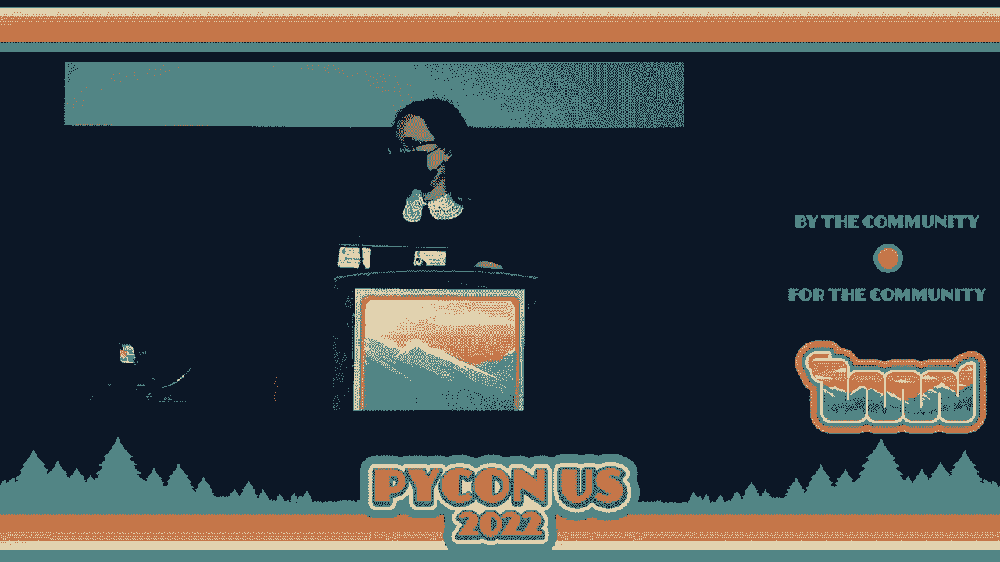
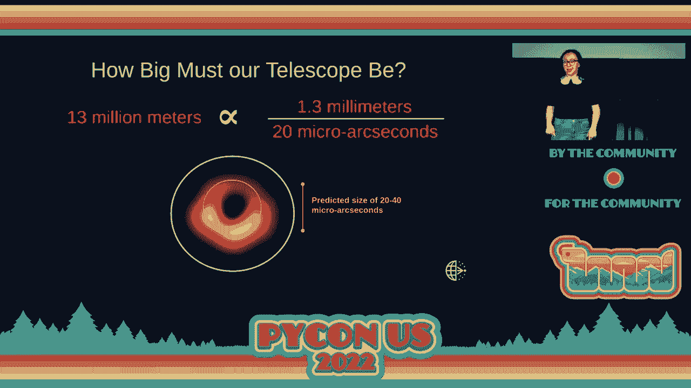
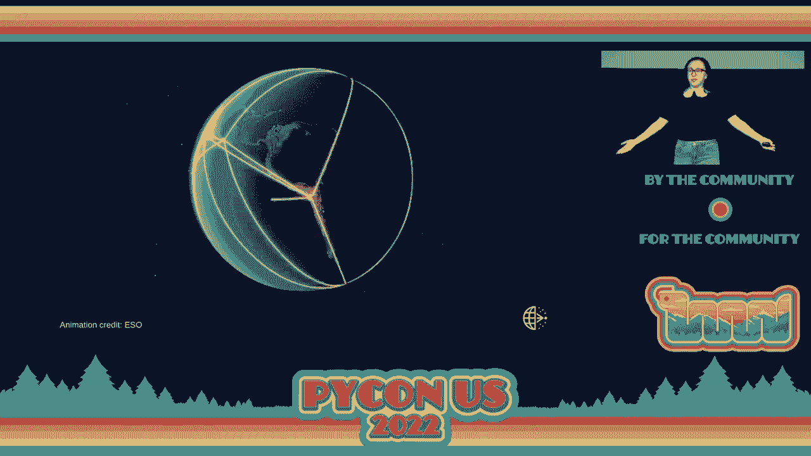
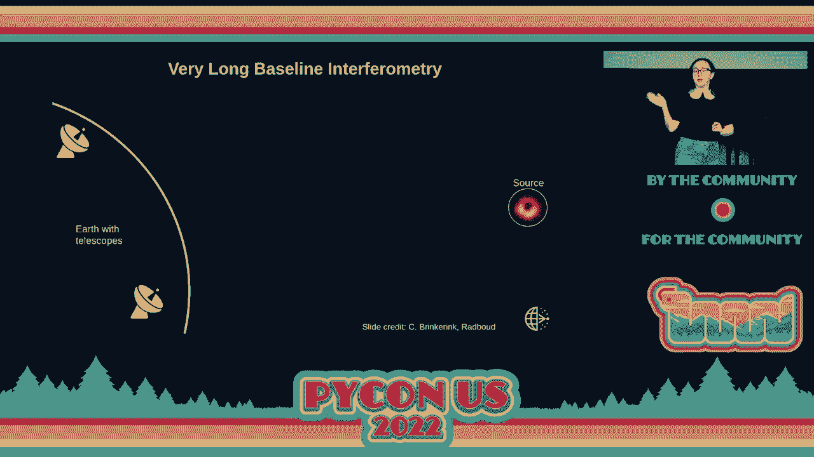
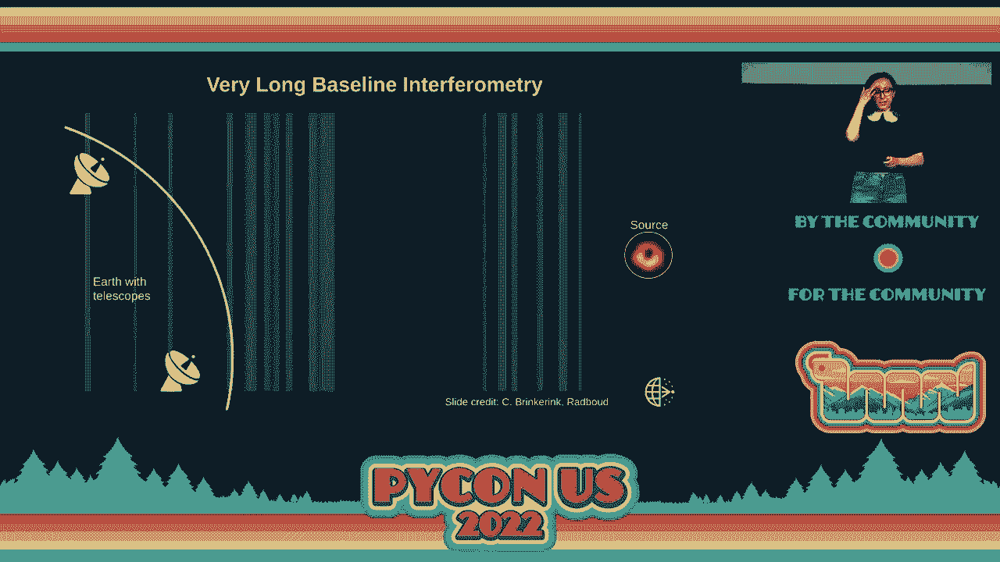
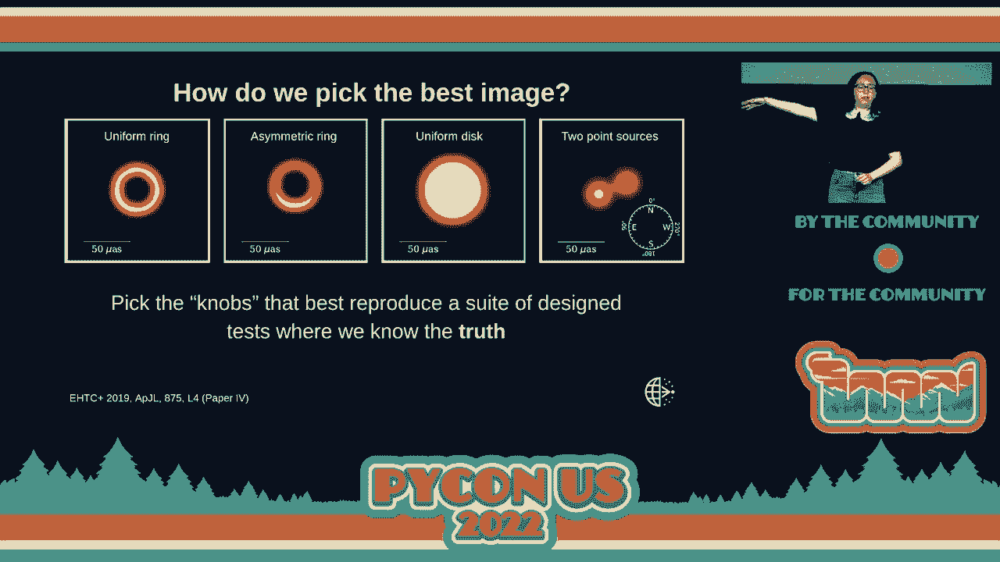
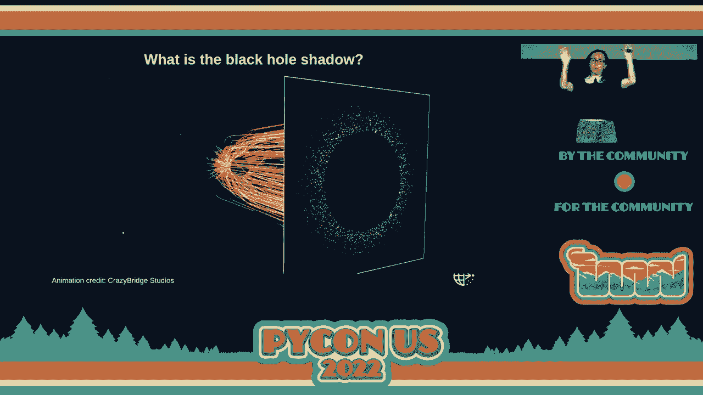
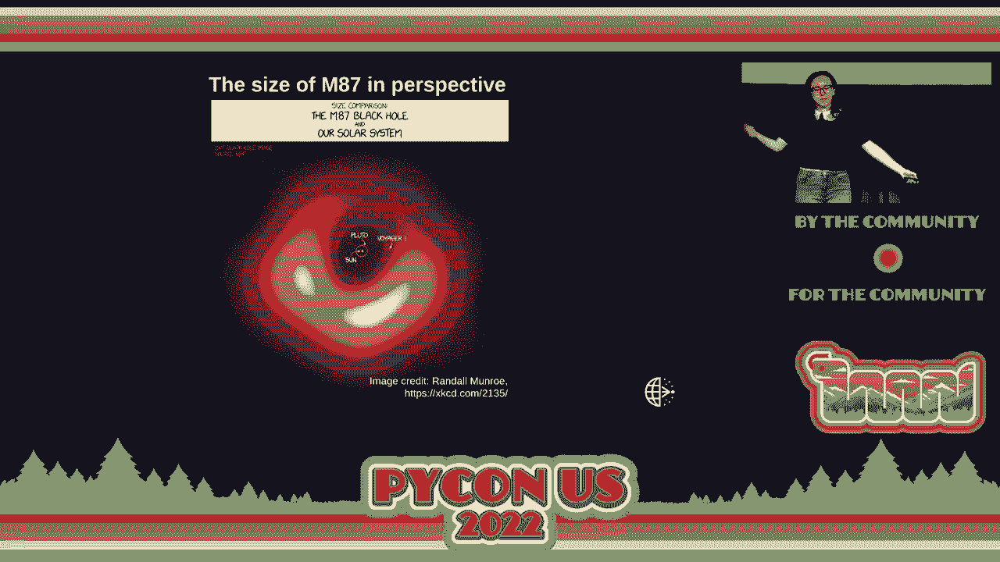
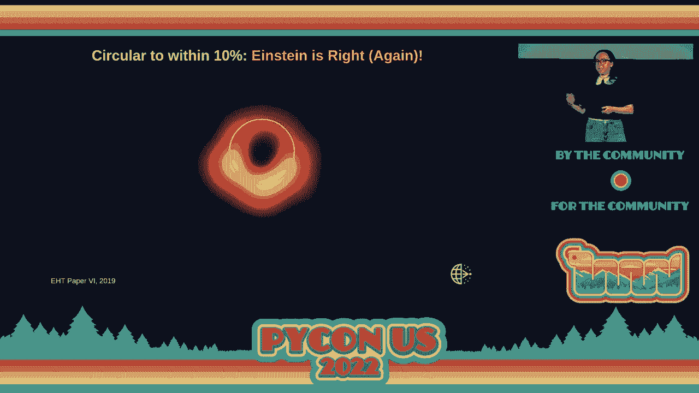
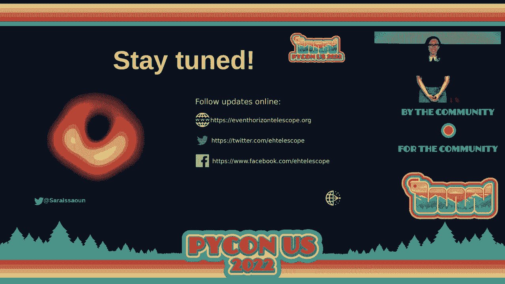

# P10：主题演讲 - Sara Issaoun - VikingDen7 - BV1f8411Y7cP

现在，我很高兴地介绍 Sarah Yisayoon，事件视界望远镜的成员。

合作与爱因斯坦奖学金。谢谢你们。

你好。我真的很紧张，这是我疫情前以来的第一次面对面演讲，所以请多包涵。我叫 Sarah，是事件视界望远镜合作团队的一员。我在这里告诉你我们是如何成功拍摄黑洞的。你可能熟悉我们 2019 年的著名图像。就是这张图。

这是银河系 M87 中的黑洞图像。距离我们 5500 万光年。我想告诉你一些我们获取这张图像的旅程，以及我们自那时以来对这个黑洞所学到的东西，因为我们去年也有关于这个黑洞的新结果。同时，我也想谈谈软件开发在我们这样的大科学项目中所扮演的角色。

所以，当我们发布图像时，真正让人震惊的是，它竟然登上了全球报纸的头条。这不是科学成果常有的事情。人们真的不喜欢谈论这些。我是说。

这就像是报纸上第 12 页的新闻，如果它引起了关注。但第二天看到我们的成果登上头条，真的让我们意识到，我们正在向世界提供一些特别的东西，一些可能是科学的一部分的东西。这表明科学不仅仅是一个人的事，而是关于合作。

这是团队合作。是克服文化、国家、职业阶段、性别、年龄等差异，团结起来朝着一个目标前进，并能够成为这个时刻的一部分。这次事件，看到它登上头条，真的是让我们震惊。我们知道有些人会对这张图感兴趣，但我们并不知道真正的。

公众的反应。我们也不知道公众会产生很多迷因。这真的很有趣，因为我们在推特上登顶了第一名。这在科学成果中并不常见。因此，我们作为一个合作团队，意识到我们的责任是确保大家都成为我们故事的一部分，理解你们也是科学的一部分，也是进步的一部分。

你是这个大家庭的一部分，让世界变得更美好、更有趣、更快乐。希望一切都是如此。我只是这个合作团队的一员，我只发挥了小小的作用。我们在这个大故事中都是小小的角色。事件视界望远镜合作团队有 300 多名成员，来自 60 多个机构。

欧洲、亚洲、非洲、北美和南美的 18 个国家和地区。我们是一群真正多样化的人。我们并不是所有人都是天文学家。他们是软件开发人员。他们是计算机科学家。他们是工程师。他们是望远镜操作员，管理人员。所有人都是这个故事的一部分。每个人都在为这个项目的成功发挥着重要作用。

我只扮演了一个非常小的角色，我得以代表我今天能够与之合作的所有这些了不起的人。因此，希望这能发挥作用。如果你去——这有点慢。如果你抬头看天空，有一个星座叫处女座。在这个星座中，有一个明亮的点，那就是星系 M87。

这个星系距离我们 5500 万光年。这非常遥远。如果你用像哈勃望远镜这样的光学望远镜观察它，你会看到从它那里发出的物质气体流。那是什么？如果你真的追踪这条气体流，你需要在射电波中观察，因为射电波允许你穿透整个星系。

你通过越来越好的望远镜一直追踪到其核心。你发现了我们用事件视界望远镜找到的超大质量黑洞。这颗黑洞释放出一条气体流。与星系的大小相比，这个黑洞小得不可思议。然而，它却创造了一股穿透整个星系甚至其星系的等离子体喷流。

这一邻域。这种巨大的力量令人难以置信，这也是我们尚未完全理解的。这个过程是宇宙中最强大的过程，黑洞是如何为其喷流提供能量的。我们尚不清楚这些现象是如何发生的。用事件视界望远镜近距离观察黑洞使我们能够连接黑洞附近发生的事情与整个星系中发生的事情。

所以这是我们与事件视界望远镜的目标。理解黑洞的外观，它们是如何进食的。它们如何喷射出这些强大的物质喷流，以及这些喷流如何影响附近的星系。因此，我们想看到 M87 黑洞。它非常遥远。它在天空中的预测大小约为 20 到 40 微秒。

这大约是从这里看去月球表面上一个甜甜圈的大小。因此，望远镜的大小与观测波长成正比，望远镜观测时的波长和望远镜的角分辨率，因此望远镜的大小。因此，我们需要看到 M87 的角分辨率是 20 微秒，基于预测的大小。

我们需要的观测波长是穿透我们与星系之间所有气体的 1 毫米波长。这就是我们称之为“金发姑娘波长”的波长，能够穿透所有气体，同时又能通过地球望远镜进行观测。而且它还在射电波段，射电波不受我们与黑洞之间任何东西的干扰。因此，如果我们进行这个计算，我们所需的望远镜大小是多少，才能观察到 M87？

它的实际长度是 1300 万米。不幸的是，我们尝试过，但没有科学机构愿意资助建造这样大的望远镜。所以我们最终得到了下一个最好的选择，那就是我们脚下的地球。地球的直径是 1300 万米，我们可以把地球作为我们的望远镜。

那我们是如何做到的呢？我们使用一种叫做非常长基线干涉测量的技术。我们找到地球周围的望远镜，形成我们望远镜镜面的片段，然后我们合成一个大小为地球的虚拟望远镜。

这就是我们所做的。为了实现这一点，这实际上是一项颇具挑战性的技术，获得了 70 年代诺贝尔物理奖。我将简要解释我们是如何做到的。我们有黑洞，它发出非常遥远的无线电波。

它发出的波在地球上以平面波的形式到达，因此它们是平坦的。现在地球是弯曲的。我希望你们都知道这一点。正因为如此，远离彼此的望远镜实际上在不同的时间看到信号。如果你看看这张图，底部的望远镜实际上看到的是一条直线。

在望远镜上方的几行。现在，地球的曲率实际上造成了一个问题，因为我们需要在每个望远镜中同时看到来自黑洞的信号，以便重建图像。每个望远镜都必须看到相同的信号，这样我们才能关联信号并制作图像。那么我们如何解决这个问题呢？我们在不同地点有不同的望远镜。

每个望远镜之间的距离称为基线距离。每对望远镜给我们提供图像的一部分。因此，靠得近的望远镜告诉我们图像中的大规模结构，因为它们看到的共同信号更多。那些距离更远的望远镜看到的共同信号较少，它们告诉我们关于小规模结构的信息。

因此，我们需要在地球上不同距离和不同方向的多个望远镜，以重建图像上的所有信息。然后我们有这个时间差需要处理，这个时间差需要被考虑。因此，我们使用极其精确的时钟。

它们被称为梅索时钟，精确到每亿年只损失约一秒。这就是这些时钟的准确性。这些时钟在每个望远镜中，大小大约相当于一个变种冰箱，价格昂贵，但它们能正常工作。因此，这些时钟帮助我们标记信号在每个望远镜到达的时间，然后我们。

将信号记录到硬盘上。因此，基本上，每一束到达望远镜的光都被时间标记，然后存储到硬盘中。然后我们在之后的某个时间播放它，当我们将来自所有望远镜、所有硬盘的信号结合在一起时。这就是非常长基线干涉测量的工作原理，这也是 EHT 的运作方式。获取事件视界望远镜的过程非常漫长。

EHT 的第一个碟形天线始于 2007 年，随着年份的推移，我们有越来越多的天线。不幸的是，一些望远镜被损失了，它们被退役，其他望远镜加入，直到我们在 2017 年达到了足够的望远镜、不同基线的组合，使我们能够重建图像。

我们有六个不同的位置，六个单碟望远镜和两个相位阵列。相位阵列基本上是位于一个地方的望远镜，可以以与 EHT 相同的方式组合成一个更大的虚拟望远镜，从而在该地点提供更高的灵敏度。因此，我们有八个望远镜用于观测。南极望远镜没有参与 M87 的结果，因为它位于南半球。

半球和 M87 实际上是北半球的源。因此，南极无法看到它。现在你会注意到这些望远镜看起来完全不同。原因是我们没有自己建造它们。我们借用了它们。我们恰好找到了能够在我们需要的波长进行观察的望远镜。

需要位于足够高且干燥的地点，以使大气和大气中的水蒸气不会对我们的信号造成干扰和破坏。因此，这些望远镜都位于地球上最极端的地方。最干燥的沙漠、最高的山脉，它们的建造是为了完全不同的科学目的。

它们是为了独立科学而建造的。这就是它们都有不同设计、不同外观的原因。但它们有一个共同点，实际上是两个共同点。时钟，迷你冰箱，以及这个。等等，还有一件事。我忘了加这个幻灯片。还有一点是，我们并不是单独与 EHT 观测。

我们讲述了这个故事，说明我们有所有这些望远镜在地球上进行组合。我们还与其他在不同波长观察的望远镜一起观测。因此，有很多与我们合作的望远镜能够教会我们更多关于黑洞的知识。我们不仅有黑洞图像，还知道黑洞正在做什么。

在电磁波谱上同时进行观察。这是令人难以置信的事情，超出了我们的合作，因为它还涉及到与其他望远镜和多波长合作伙伴的协作，一起在这个确切的时刻观察同一事物。这真是令人难以置信。

去年产生的一个重要结果就是这个。这是 M87 在电磁波谱中的样子。所以你知道我们著名的图像就在下面。黄色部分展示了在无线电波段的样子，我们可以看到这个等离子体喷流，然后我们在 X 射线和光学上也有它的观测。在光学上，你可以看到漂亮的哈勃图像，这就是 HST。

或者是中间行的底部那一项。同时我们还观察高能和 X 射线的情况。在 2017 年的观测中对 M87 的这一视角对于理解黑洞的物理非常重要。它如何排放静态物质，以及这种排放如何随时间变化。正如我提到的，我们的所有望远镜都是完全不同的，但它们有两个共同点。

这是我们的迷你冰箱，右侧的这个就是我们称之为 EHT 后端的设备。这是一种记录设备。这一大块设备用于记录我们的数据。因此我们有一个安装了接收器的望远镜。接收器接收信号，通过一些电缆传输。然后信号会被转换为较低频率，以便我们可以测量。

我们对其进行数字化处理，因为我们测量的是模拟信号。它需要被数字化为双比特采样信号。然后我们将其记录到我们的硬盘上。这里的每一个小盒子被称为模块。每个模块大约有八个堆叠的硬盘。在整个项目中，我们共记录了 736 个硬盘。

我们在整个项目中记录了大约三千五百 TB 的数据。其中约有一 PB 是关于 M87 的。在我们的观测中，我们是在三月和四月进行观测。这是因为天气是我们观测的重要因素。正如我提到的，水蒸气和大气湍流会破坏我们的信号。因此我们需要非常好的天气。

那么我们是如何做到的呢？我们试图找到最佳的时间窗口，以便在整个半球中获得最稳定、良好的天气，这非常困难。在我们的观测中，我们有一组特定的观察日窗口，大约是 12 天。我们非常关注天气和技术操作，并通过我们的 VLBI 监控进行管理。

以确保我们做出正确的决策。在每一天，我们都会做出是否观测的决定。因此，在观测前的几个小时，我们会决定是否上天。我们的操作和望远镜团队必须时刻保持警觉，随时准备观测，若我们触发了观测计划。而且有很多原因决定了我们在特定日子触发观测。

部分数据也来自我们的多波长合作伙伴。例如，如果 X 射线天文台在同一时间进行观测，比如钱德拉天文台，那么那几天我们更可能进行观测。当然，天气和望远镜操作也是一个重要因素。

在我们 2017 年的活动中，跨越了 12 天，其中有 5 天是观察。而这 5 天中有 4 天是观察 M87。所以这是 2017 年观察的好照片。在活动期间，所有不同望远镜的工作人员和观察者。你会看到大家都面带笑容。通常他们并不会那么开心。

这里海拔很高，我们睡得不多，他们也在退休。但我们很高兴能拍照。所以在右上角的照片中，你会注意到有一个女人，那是我。在观察期间，我在亚利桑那州的 7 毫米望远镜。这是其中一个核心望远镜。所以我有时会连续 30 到 35 个小时不睡觉。

所以这很有趣。但看起来这一切都是值得的。我想我们没问题。在观察结束后，我们打包模块、硬盘，然后把它们寄给这个人。这个人是唐·索萨。他是我们 EHT 的运输专家。每一个 EHT 的数据、设备包裹都通过他。之前他曾是马萨诸塞州的警察。

现在他负责我们所有的运输。自从他开始这份工作以来，他从未丢失过一个包裹。我们有一次小失误，以为我们有南极望远镜和硬盘，但最后却是一堆丝绸。不过一切都解决了，我们拿回了硬盘，丝绸也回到了它该去的地方。幸运的是，左边是填充模块。你会注意到它们有绿色标签。

我给你展示的大盒子里的那些有红色标签，而大盒子里的那些有绿色标签。绿色标签表示模块是空的，红色标签表示模块是满的。所以所有这些模块都存储着我们珍贵的数据。它们会发生什么呢？

它们一半运送到一个地方，一半运送到另一个地方。接下来我想谈谈 EHT 的数据处理过程。我们在望远镜处测量 PB 级的信号。这部分信号是望远镜可以共同看到的。因此在相关阶段。

我们在望远镜之间关联信号，最终得到了数 TB 的数据。所以我们只保留望远镜共同看到的信号。然后我们进行校准阶段，通过解决一系列过程和大气效应来减少数据，这些效应会干扰我们的数据，经过解扰后，我们就可以进行平均。

就像建设性或破坏性干涉一样。如果你有破坏性干涉，你就会将信号平均，破坏你的信号。如果你有建设性干涉，你就能增强信号。所以我们的目标是实现建设性干涉，增强信号，提升我们数据的敏感性。

这就是校准阶段发生的事情，然后我们留下了数兆字节的数据文件。这些数据文件用于成像。我们的最终图像实际上只有几千字节。你可以在手机上发送它。我总是觉得这真是不可思议，从我们测量信号的那一刻到你可以在手机上发送的千字节数据，我们经历了 12 个数量级的数据压缩。

这真是令人惊叹。这是 EHT 中发生的过程，而没有多少实验经历如此数量级的数据处理。现在，一半的数据送往马萨诸塞州的 Westford，即麻省理工学院 Haystack 天文台，另一半则送往德国波恩的 Moxpunk 无线电天文学研究所。

这些是我们的相关中心，它们会在这些巨大的超级计算机上运行，考虑地球的曲率，重新对齐信号，并确保捕捉到每对望远镜之间的所有常见信号组合。因此，本质上，相关器创建了我们的虚拟望远镜。

然后有一个漫长的过程来理解数据。因此，在相关性之后，数据会被送到一个专门的团队，构建管道。这些管道会纠正相关性错误，修正大气效应，并帮助构建信号，例如这种建设性。

平均化。有三个管道被建立。一个叫做 hops，一个叫做 casa，一个叫做 apes。这些管道都得到了许多 Python 包的支持。而且，这一步是整个过程最重要的步骤之一，因为它真的需要理解数据，区分来源。

我们的仪器与大气以及真正的黑洞信号之间的关系。所有的迹象，所有后续分析实际上都依赖于这一步骤。而这一步是由 Python 支持的。接下来，我们通过一个专门的团队进行数据验证，比较所有这些独立的管道及其输出，确保我们理解我们所看到的。

真正的黑洞信号。这一数据验证还涉及到一系列的数据测试，这些测试同样得到了许多 Python 包的支持。整个过程大约循环了四到五次，我们从相关性开始。

一直到数据验证。这花费了一年半的时间。因此，如果人们问，为什么黑洞图片需要这么长时间？我们在 2017 年观察，花费了一年半的时间在这上面。大约半年后，我们发布了图像。因此，这是一个两年的过程。这部分是非常重要的。

理解数据是一回事。下一步是理解望远镜。因此，我们需要以惊人的细节理解我们的望远镜，例如大气层、我们的望远镜如何移动以及它们的表现。正如我提到的，我们的所有望远镜彼此之间都是不同的，所以这不是一件琐事。

这真的需要仔细关注和理解我们每个部分的仪器。而且我们并没有真正的部分是重复的。因此，这工作量相当大。我们还需要做的另一件事是，为了制作极化图像，我稍后会解释，我们还必须解耦泄漏。因此，我们观察两种极化信号，有时信号会泄漏到另一种极化中。

不幸的是，地球的旋转再次帮助我们。因为地球在旋转，地面的望远镜并没有移动，但天空中的源在移动。因此，通过解耦天空中变化的信号与保持不变的信号，我们实际上可以分辨出什么是仪器，什么是源信号。

然后 M87 最终准备好进行分析。这是我们的数据的样子。作为一名射电天文学家，对我而言，这是我见过的最美丽的图形。老实说，我更喜欢它而不是图像。这并不是因为它是哑光的。那么，为什么对我来说这如此美丽？如果你查看数据。

所有不同的颜色代表不同的望远镜对。x 轴告诉我们基线长度。因此，短基线看到更多的共同信号，长基线看到较少的共同信号。所以请注意，我们有这个虚线曲线，它代表一个均匀的环。如果这在天空中，我们会看到这个虚线曲线。对我来说，这真是美得令人难以置信。

因为均匀环是一个美丽的数学概念。它有一个解析解。它是一个正弦函数。看起来就像这个美丽的弹跳。要在数据中看到这一点，看到数据也呈现出这种美丽的弹跳，实际上告诉我们，我们看到的可能是宇宙中最美丽和简单的物体之一。

只是一个环。另一个有趣的方面是，在这个基线长度下，有两个望远镜对看到不同的东西。通过观察这两个望远镜对，这告诉我们存在一个亮度分布在变化。所以环的一个部分比另一个部分更亮。这些数据告诉我们，底部更亮。因此，即使不制作图像。

我已经知道它是什么样子了。难道这不是很惊人？仅仅看这个图表，我们已经知道这是一个底部更亮的环。但当然，我们有很多问题，关于我们是否真正看到了我们所看到的。而我们的数据是公开可用的。所以你实际上可以去下载它，下载我们的成像管道，制作你的图像。

拥有 M87 图像。下一步是什么是成像？所以我们再次使用地球作为我们的望远镜。因此，孔径合成是一个过程，地球的旋转帮助我们填充一个虚拟的镜子。在中间那里。我们在时间和空间尺度上结合数据。因此，随着地球的旋转，越来越多的望远镜观察到 M87。我们有越来越多的望远镜对。

所以数据在我们的虚拟镜子中形成。然后我们在时间上堆叠数据。然后我们看到随着我们添加越来越多的数据，图像是如何改进的。现在，我们如何决定我们在看什么？所以如果我们在查看数据，好吧。我们认为里面有一个戒指。我们认为它看起来某种方式，但真的如此吗？

天空中还有其他图像组合可以给我们相同的结果吗？

所以我们在想，也许我们应该使用机器学习，或者只是让计算机决定我们在看什么，而不让人类参与，因为我们有这样的期望去看到我们想要看到的东西，这样可能会导致我们的偏见。因此，事实证明，人们已经测试过计算机试图决定他们在看什么。

例如，这是炸鸡还是贵宾犬？或者这是蓝莓松饼还是吉娃娃？

或者它是树懒还是巧克力可颂？结果发现计算机无法分辨二者。这很令人惊讶，因为作为人类，起初你可能会感到震惊，并且可以看到相似的图像。但如果你仔细观察，你会开始思考，你知道的，批判性思维以及实际区分它们之间的差异。

所以如果你花一点时间，你可以分辨出差异。而计算机做不到。因此我们就说，哦，计算机有困难。那么就让人类试试看。但我们以一种方式构建了成像过程，试图最小化人类偏见。这就是我们的成像过程。所以我们有一个数据校准阶段，我已经经历过。

然后它经历了第一步，即独立团队的盲成像。接着我们在这个过程中收到了关于数据质量的大量反馈。然后它进入了第二步，即每个独立软件的管道构建。再次强调，我们的许多管道是通过 Python 包支持的，我们在其中构建合成数据。

模型中，我们有一个真实图像，然后根据它们与我们观察到的其他来源的一致性和结构的稳健性来验证我们的图像。所以在第一步中，我们将成像组分成四个独立的团队。团队一和团队二专注于更新的前向建模技术。

团队三和四专注于更传统的反向建模技术。每个团队都被要求广泛重建图像，这是为了评估人类偏见。所以我们花了七周的时间，各个团队之间不进行交流。我在团队二，在这个过程中我们有点担心，因为在团队二我们看到了。

一个戒指很容易就能识别，我们在想，如果我们是唯一一个看到戒指的团队呢？

如果只有更新的技术看到一个戒指，因为我们的团队专注于新的技术。那么如果我们和团队一都看到了戒指，但团队三和四没有呢？

我们如何调和这些差异？如果我们对看到的事物有对立的看法，我们如何最终合作？

所以在看到黑洞第一张图像的兴奋中，我们也充满了怀疑和对未来科学道路的担忧。在经历了七周的煎熬后，我们在马萨诸塞州的剑桥召开了研讨会，被要求每个团队展示一张图像。我们都静静地坐在这个房间里，Katie Bauman 负责进行比较。

她在屏幕上展示了四幅图像，它们就是我们在合作中第一次集体看到的“87”的图像。来自四个团队的这四幅图像，如你所见，边缘有些粗糙。它们是第一次尝试，但却有着巨大的相似性。

每幅图像都有一个相同大小的环，且每幅图像的底部都更亮。这让人感到无比兴奋，导致了在 EHT 中最激动人心的日子之一，也许是我最喜欢的一天。我们拍了一张照片，把所有图像都平均在一起，显示在屏幕上，我们还拍了一张集体照。

这是参加研讨会的所有人，还有许多人也通过远程方式加入了成像团队，你可以看到每个人都在微笑。我们非常兴奋，因为我们终于捕捉到了黑洞的图像，这发生在 2018 年 7 月，大约是在我们向世界揭示之前的一年。

那个晚上，当然我们去喝酒了。超级有趣。我们去了一个酒吧，和 San Carioke 一起喝了一些饮料。你可以在左下角看到他。在中间的是我和 Katie Bauman，以及成像团队的其他成员，一起高声唱着经典的《波希米亚狂想曲》，真的非常好玩。

这是我作为这个项目一部分的最难忘的日子之一，真是不可思议。所以下一步是如何说服世界其他人我们看到的东西是正确的。因此我们有了我们的成像软件。所有这些成像软件都有旋钮可调，以制作最终图像。其中两个为 EHT 而建的的软件在 GitHub 上，并由 Python 包支持。

所以我们决定创建合成数据，也就是我们已知真实情况的假数据，潜在的真实图像。因此我们想选择最能重现这四幅图像的旋钮。它们的设计是这样的，使得它们拥有类似于我们的反弹环模式的数据，但潜在的图像可能并不是一个环。

所以其中两个是环，但另外两个则不是。

我们系统地测试了成千上万的成像参数，以决定哪些是环，或者它们是如何重现这四组数据的，然后选择了重现最佳图像的最佳参数用于 midi7。这些是由三种软件生成的最终图像。你会注意到通过差异是无法判断的。

这就是我们能够重建它们的程度。事实上，你看到的著名图像，即黑洞的第一张图像，其实只是这三张的平均。但正如我提到的，我们观察了 midi7 四天，这幅图像仅仅是 4 月 11 日的结果。这里是另外三张。这些都是黑洞的独立观察结果，全部给我们一个环形的。

相同大小的环在底部更亮。没有观察到显著变化。而 midi7 是超大质量黑洞，这幅图像在这个时间段应该变化得非常非常缓慢，这正是我们所看到的。我们还有极化图像。这些是在去年发布的，几乎正好一年前。

这些极化图像上有一些条纹，显示了极化模式。因此，黑洞周围的光来自于环绕磁场的电子。因此，有磁场穿过黑洞进食的盘面，而这些磁场中有电子在旋转，然后这些电子。

产生偏振光，这意味着它在某个方向上振荡。而这些振荡告诉我们，它们实际上可以为我们提供关于磁场的形状的信息。磁场的形状告诉我们黑洞如何喷射这个喷流。那么黑洞是什么呢？你们都知道火箭的逃逸速度，地球上的物体逃逸速度是独立的。

火箭的逃逸速度与气球相同，可以离开地球。1784 年，约翰·米切尔牧师问了这个问题：一个物体需要多小，才能有比光速更快的逃逸速度？

那么一个物体需要多紧凑，火箭才需要光速或更高的速度才能离开其表面？一旦逃逸速度超过光速，甚至光子，甚至光都会被困住，恒星变得黑暗。所以这最初被称为暗星，这个概念演变成了黑洞。因此在 1915 年，阿尔伯特·爱因斯坦发表了他的广义相对论。

在这个理论中，他预测光受到引力的影响。因此，光会在巨大物体周围弯曲。然后在 1916 年，科尔施-韦希尔德在第一次世界大战的战壕中，他推导出了这个方程的第一个非平凡解，即施瓦兹希尔德黑洞。它预测了一个依赖于特定半径的奇点，而这个半径创造了它的。

事件视界，光无法逃脱。现在，几十年的工作被投入到理解如果黑洞存在，它们会是什么样子？从观察者的角度看，它会是什么样子？从地球上看又会是什么样子？

然后在 1979 年，Schampiel 的名字创造了第一张黑洞的模拟图像。 他的模拟图像看起来像这样，顺便说一下，非常像星际图像。因此，自 1979 年以来进展不大。 他的模拟是使用打孔卡运行的。 你还记得打孔卡计算机吗？他手动绘制了图像的点并花费了。

负面。 对我来说，这是一个不可思议的故事。 制作第一张黑洞模拟图像的努力是什么？

自那时以来，黑洞的模拟变得复杂得多。 我们在，你知道的。 这是黑洞模拟的所有组成部分。 我们有位于中心的黑洞，以及它周围的气体。 我们还有穿过它们的磁场，这些磁场发出光。

喷射出这股物质。 黑洞的阴影是由气体照亮这一光无法逃脱的黑暗区域而形成的。 因此，黑洞实际上位于这个黑暗区域内部。 根据倾斜度。 我们观察黑洞和气体的视角，环上的亮度分布会变化。 所以某些部分比其他部分更亮，具体取决于我们看它的方式。

这是因为如果我们倾斜，朝向我们的光看起来会增强。 它看起来比远离我们的光亮。 这是多普勒效应。因此，来自气体的光在黑洞的引力下被偏转。 如果你有很多光线被黑洞偏转，然后你看。

从远处的摄像机看，你会看到黑洞偏转了光线。 事件视界外部的光线被偏转，形成这种阴影。 你可以看到黑洞的阴影，以及它周围的亮环。

这是 M87 的图像。 这是我们所看到的。 然后，我们的 EHT 理论团队在模拟黑洞图像方面进行了大量工作。 因此，我们根据可能存在于黑洞周围的不同参数构建了我们的模拟库。 这些参数改变了黑洞旋转的速度。

气体的性质，气体的温度，磁场等。 所有这些过程都与天体物理学有关。 但你会注意到，这些看起来都相似。 中间有黑暗斑块，周围有亮环。 这是因为我们在图像中看到的纯粹是引力的效果。

无论你给它加上多么复杂的天体物理学，你总能在黑洞的边缘看到我们看到的。 中间是黑暗的斑块，周围是明亮的环。 因为根本上使这一切发生的，主导图像的是引力。 极化库也研究了气体的天体物理学。

在这里，实际上偏振帮助我们更详细地理解天体物理学。因为虽然我们的第一幅图像主要依赖于引力，但偏振与引力无关。它与磁场有关。因此，我们去年的图像让我们对 M87 及其周围的气体有了更多的了解。下一步是测量黑洞的质量。

因此我们从其他实验中对黑洞有两个测量结果。它们相差两个数量级。这就是我们不知道黑洞有多大的原因。我们用三种不同的技术进行了测量。我时间不够了，所以我将快速介绍一下。我们直接从图像中测量。

我们还使用简单的形状进行了测量。只需制作一个圆盘，在其中打个孔，移动它，然后通过各种不同的组合调整这些圆盘和模糊效果。然后通过这些找到黑洞的大小，你可以看到它是如何收敛到解决方案的。接着我们还拟合了我们模拟的每一帧，以查看哪些帧实际上。

教会了我们关于黑洞的知识。在 EHD 建模软件中，我们使用了三种不同的软件库来建模质量和大小。所有这些都由 Python 包支持。其中一个是 MCMC 采样框架。一个是遗传算法，还有一个是嵌套采样。

然后我们测量了黑洞的质量。所以关于生命、宇宙以及一切的终极问题是什么？M87 黑洞的阴影有多大？

你知道这个问题的答案吗？是 42。是 42 微弧秒。这就是 M87 黑洞阴影的大小。由于黑洞的大小与其质量成正比，我们可以测量黑洞的质量，约为太阳质量的 65 亿倍。这是我们宇宙中最庞大的超大质量黑洞之一。

我们从 M87 黑洞中还学到了什么？这是偏振图像。偏振模式是形成螺旋状的这些条纹。这种螺旋偏振告诉我们，黑洞周围的磁场也是螺旋形的。它们告诉我们，磁场实际上强度足够并且有序。

能够发射喷流。它们还告诉我们这个过程使用了黑洞的自转。黑洞正在旋转。这个黑洞的旋转驱动了磁场并驱动了喷流。这是我们去年了解到的。M87 的大小与视角，这里是中心的太阳，冥王星的轨道，旅行者 1 号，它是人类制造的最远物体。

刚好到达阴影的边缘。这就是 M87 的大小。

爱因斯坦是对的吗？这是我们总是会问的一个问题。爱因斯坦预测黑洞的阴影是相当圆形的。还有其他引力理论预测会出现圆形偏离。因此，我们发现圆形度在 10% 之内，这意味着爱因斯坦又一次是对的。

那么事件视界望远镜的下一步是什么？我想简要概述一下我们的去向。我们观察的另一个黑洞是人马座 A*。它是我们银河系中心的超大质量黑洞。人马座 A* 有这些星星在其周围公转，这个黑暗区域。

这些星星在红外线中非常明亮。事实上，这些星星的轨道非常准确地测量了人马座 A* 的质量。因此我们确切知道爱因斯坦理论预测的这个黑洞阴影的大小。因为这一令人惊叹的研究，实际上在 2020 年获得了诺贝尔物理学奖。

然后我们观察到了，您知道，我们在无线电波中观察到了这一点。不幸的是，由于它在我们的星系中，我们有一个巨大的物质气体云模糊了我们的图像。因此在其他频率下，我们无法看到阴影。但 EHT 能看到。实际上在 5 月 12 日，事件视界望远镜将揭示关于银河系的突破性新结果。

所以这让人期待。我们也在与 EHT 一起成长。多年来，我们在不同地点增加了新的望远镜。更多的望远镜意味着我们填满了我们的镜子。我们希望能增加更多的望远镜，以改善并制作出越来越清晰的图像。另一个更大的项目是下一代 EHT，我们希望在地球的不同地点放置许多小型望远镜，以增强我们的成像能力。

我们最终希望能进入太空，因为我们不想受到地球大气层的限制。我们可以去更高的观察频率，那里大气不会阻碍我们。

我们可以通过一个围绕地球快速运行的轨道卫星来更快地填充我们的镜子。我们还可以获得更高的分辨率，因为我们获得了地球和太空之间的距离。这是一个更长的时间尺度。最后，我想结束时说，真的，Python 社区、软件开发者社区、开源社区一直是现代科学的支柱。

不仅仅是对于事件视界望远镜，而是对于大型科学项目的一般情况。您为我们节省了大量的时间。因为我们所有的分析包，今天我所展示的所有内容，我们不同的流程，都是科学方法的关键过程。我们需要互相交叉验证。

为了实现这一点，我们需要寻找新颖的想法来做同样的事情。我们需要多样性和包容性，多样性和技术。而我们与您一起发现了这种多样性。因此，巨大的科学成就离不开开源软件。所以这就是我结束的地方。请继续关注即将发布的有趣 EHT 结果。非常感谢大家。（掌声）

