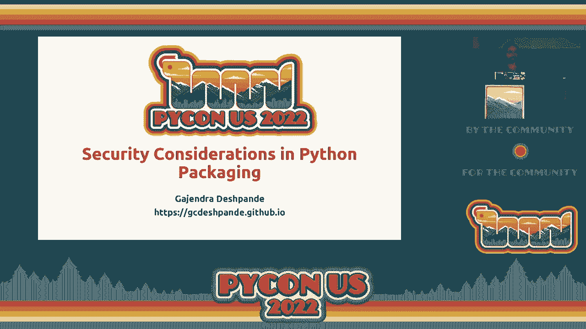
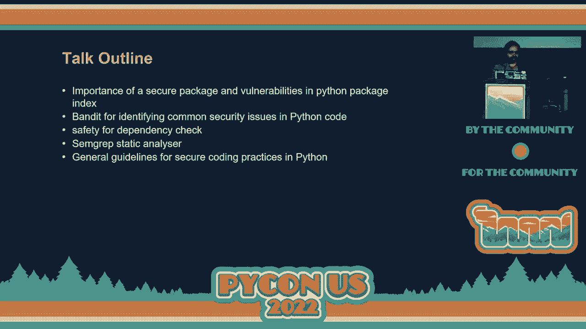
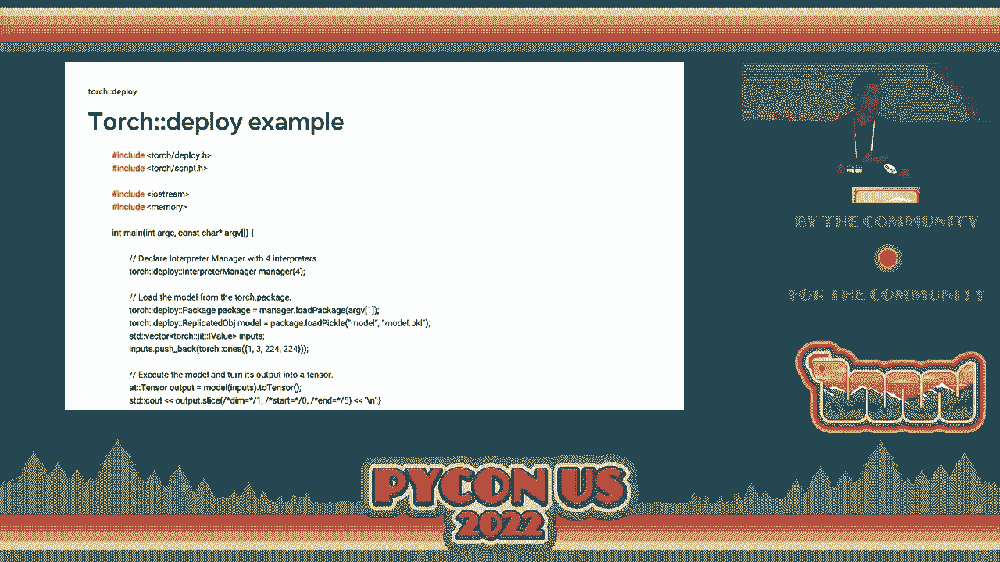
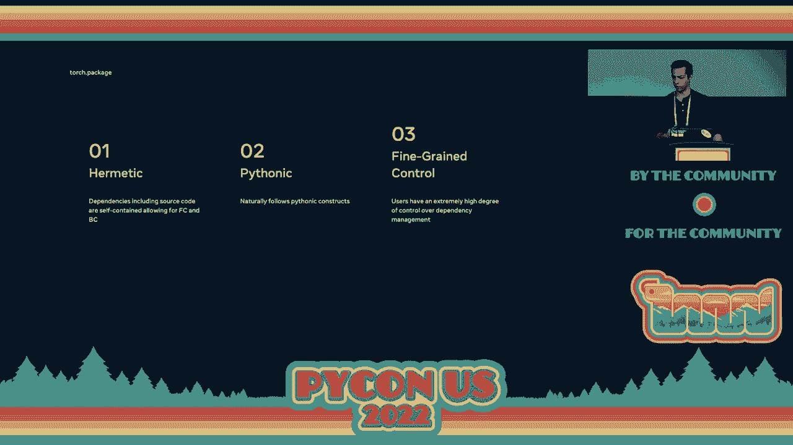
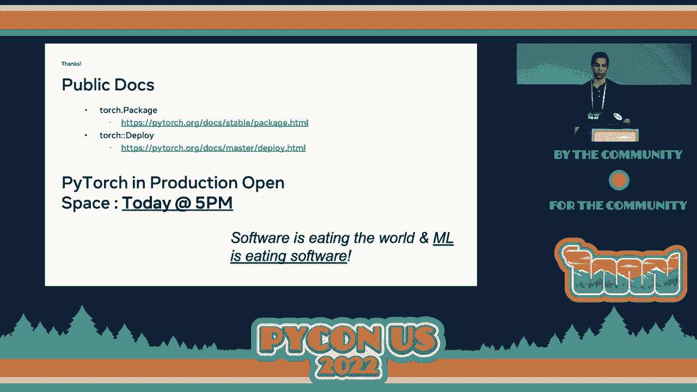
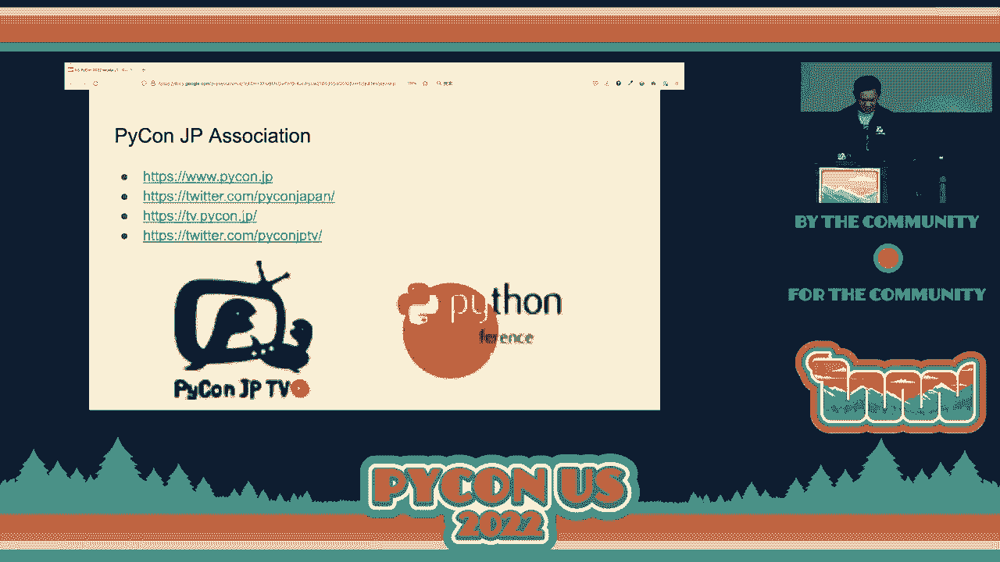
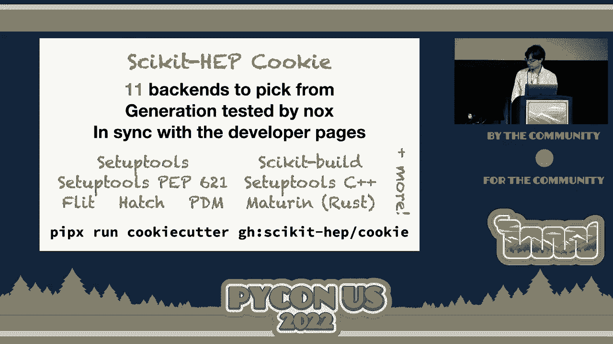
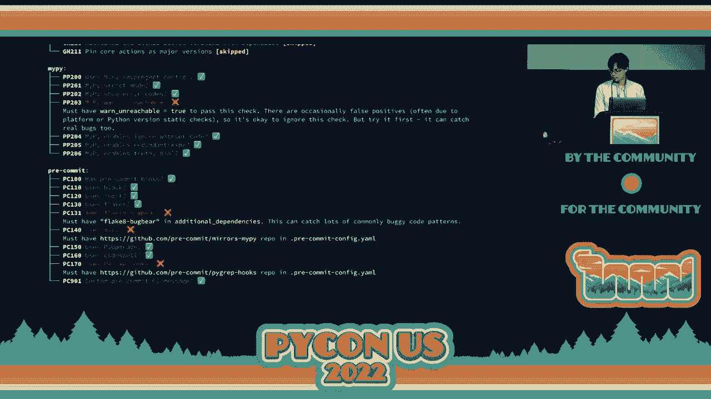
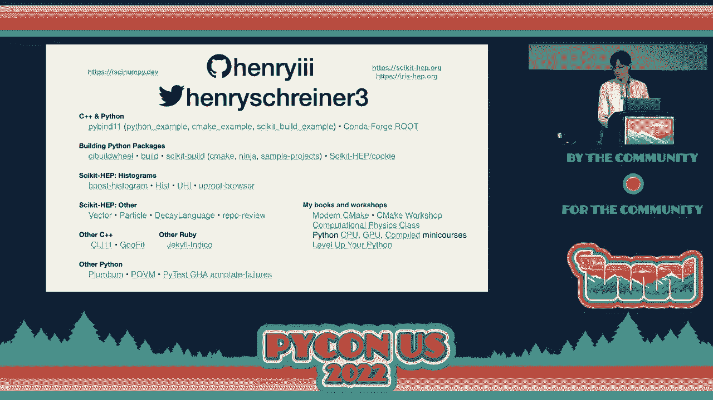
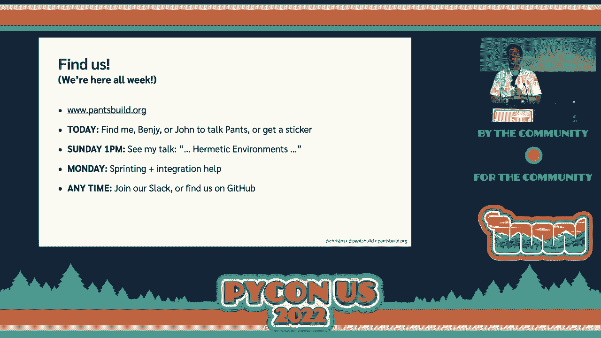

# P13：闪电演讲 - 第二天上午 - VikingDen7 - BV1f8411Y7cP

早上好，大家。

早上好。感谢每一位决定这么早来参加**闪电演讲**的人。我们非常感激。在艾米莉回来的之前，我们还有几位演讲者，我们会迎接**主题演讲**的回归。让我们欢迎他们上台，准备开始。没错，确实如此。

每个人都在等待咖啡的提神。第一位是杰夫。他将为我们讲授**Python**教学和社区外展。让我们给他热烈的掌声。我们在这里的人不多。[掌声]，嗨，大家好。感谢你们这么早来。我是杰夫。

我是**匹兹堡大学**康复神经工程实验室的生物工程师。我将讨论教学**Python**和社区外展。这是我几年前实验室的照片。我们已经发展成了这个大团队。我在这里展示了我们的实验室使命，但我不会详细谈论。

关于这一点，如果这些词让你有些困惑。如果你之后找到我，我很乐意与您讨论。我想展示的是，在过去的几年中，尤其是我的实验室正式制定了一系列科学和社区**价值观**。我们真的强调这不仅仅是关于做事情。

我们强调技术工作和科学的重要性，但同时也强调尊严和尊重的重要性。**多样性、平等和包容性**。实际上要反对种族主义，而不仅仅是不种族主义。这是有区别的。尤其在教育方面，一直以来都有很大的关注。关于指导和培训。我认为这些理想与开源软件也是相重叠的。

我们希望分享知识并为所有人提供机会，借助这款软件。这些是需要牢记的重要事项。我还想谈谈我所在大学在**匹兹堡**这座城市中的背景。如果你从未去过匹兹堡，那是一个相当酷的城市。我推荐你去看看。你被这三条河环绕着。

大部分城市形成了这个三角形。在西侧，这里是市中心。那是一个真正的**商业区域**。我在这个叫**奥克兰**的社区中用红色标出了大学。我们有**卡内基·梅隆大学**，它在我们的西侧。这是一个非常大的第二市中心，是教育和技术的中心。

在主市中心和这个邻里之间是**山丘区**。它实际上是一座很大的山。当然这些是我们在城市中的**邻居**。这是一个有趣的社区，尤其在 20 世纪早期。它实际上被称为“小哈莱姆”。那是一个非常繁荣的**非裔美国人文化中心**。

特别喜欢爵士乐和匹兹堡。但像美国许多城市一样，不幸的是在 20 世纪后期面临许多衰退和问题。我在这里强调，他们建造了这些高速公路，还建起了一些体育场馆。他们实际上为了这样拆除了房屋，并把它与市中心隔开了。

现在这个社区被视为一个非常不利的邻里。之后，这真的很不幸。但这些是我们的邻居，我们希望与他们互动。你知道，这将会改善情况。因此，我实验室的一些研究生计划了这个，并展示了 Python 课程。大学实际上在这个社区设有一个社区参与中心。

我想强调的是，参与这个活动的学生并不是专家程序员。他们主要是生物工程博士生。但他们计划了一些简短的讲座来讲解编程的基本知识，比如变量、控制流、循环和函数。但实际上，大部分课程时间都用于编程实践。

我们非常强调志愿者的一对一帮助。因此我们从实验室获得了一大群志愿者。你知道，我们每周都有不同的人来。但我们的志愿者人数通常与学生人数差不多。这意味着我们能够在整个课程中提供一对一的时间。你知道。

我们有很多不同年龄的有趣学生。我们主要针对成年人，但他们的年龄范围从高中生到老年人。职业背景各异。你知道，有些人有一点编程经验，而大多数人没有。你知道，这里有一位女士。

她实际上带着她的儿子来，这真的很酷。尽管他年纪很小，但她也很感兴趣。由于我们有各种不同的年龄和职业水平，一对一的辅导真的很有帮助。课程结束时，他们有两个星期的时间与我们合作完成一些最终项目。

他们做了一些非常有创意和令人印象深刻的事情，考虑到他们学习的时间是多么短。比如创建密码生成器、实际制作 Python 教程和备忘单、音乐播放列表以及像 Hangman 这样的游戏。我们以一个小毕业典礼结束，他们展示了自己的最终项目。

你知道，这门课程的反馈真的很好。他们写了这些便条。我们试图教他们如何在未来学习更多并保持这个活动的持续进行。所以这真是一次很棒的体验，我希望这能鼓励更多人去做类似的事情。你不需要成为编程或教学的专家，就可以做这样的事情，并回馈你的社区。

所以我没时间了。谢谢大家。[掌声]，谢谢。我意识到我忘了解释我手上在做什么。如果你之前没见过这个演讲，我是做一个小小的鼓掌，这是我们作为演讲者在接近五分钟时给他们的一个信号，提醒他们该结束了。

洛雷娜？是的。作为来自芝加哥的人，我能与酷炫的 Python 教学联系起来。所以非常感谢你的演讲。接下来是杰西卡，我对我们将听到的内容非常好奇。大家早上好，下午好，晚上好，女士们，先生们和非二元的朋友们。我的名字是杰西卡，我是 Elastic 的一名数据工程师。

我喜欢称自己为职业数据推动者，但我在目前的角色中也做很多自动化工程和脚本工作。而且最重要的是，我是一位热衷的猫妈妈，虽然这在这个演讲中可能不太相关，但一般来说是相当相关的，所以你应该知道这一点。

接下来的几分钟里，当你们在 Python 大厅享用咖啡时，我将改变你们的生活。我将告诉你，如何移除你词汇中的一个词，不仅会让你成为更好的开发者，也会让你成为更好的团队成员和导师。

这是我个人的哲学，我认为这可能对你有用，虽然不一定完全适用，但我希望你能从中获益。所以一点背景信息。我的前一份工作是在一家咨询公司，在那里我大部分时间都是以某种形式做数据开发者，从 2014 年作为数据仓库开发者的谦卑角色开始。

作为数据开发者，如果在场有数据工程师，你可能也会感受到这一点。你会收到很多类似“为什么数字是这样的？”的问题。我会尽力解释数据管道是如何工作的，但我不是数据的业务拥有者，所以如果源数据有问题，那并不在我的职责范围内。我只能解释数据是如何从 A 到 B，C 是如何转化为 D，但不能解释源值 N 是正确还是错误。

有一天，在我第二个数据仓库客户的工作中，我和一位业务分析师聊一个仪表板，她对一些数字感到困惑。对她来说，这些数字毫无意义。我像往常一样解释我能做的事情的局限性，比如为什么源数据不能适应她期望的报告，但她只是看着我说：“你为什么不能就这样处理数据呢？”

还有，如何让数字更好，这里“更好”到底意味着什么呢？几个月后，我在交接这个客户的工作时，正在向另一位顾问解释一个相当复杂的数据管道，需要很多麻烦的处理才能让源数据变成接近输出的数字。

他看着我说：“但你为什么不直接插入显然有效的技术解决方案呢？”因为我根本不知道你所谈论的任何上下文，显然你应该这样做。我希望你们都能看到这件事的进展。自从这两次事件后，我一直在对抗在与同事提问时使用“只是”这个词。

在我看来，“只是”暗示着你提问的人错过了某些明显的、不可思议的东西，以至于他们应该一开始就想到它。在第一个故事中，业务分析师出于沮丧说出这个问题，因为有一个数字她不理解，希望我能修正它；但第二个故事则绝对带着一丝傲慢的气息，这种想法是我不知道足够的信息来给出正确的解决方案。

所以，通过提问的方式来促进讨论，而不是指责或无知，我认为这能让你走得更远，甚至在这个过程中学到一些东西。那么，以下是我最喜欢的一些重述方式：你能不能像这样，假如我们尝试一下，假如你做了一些事情，你考虑过吗，下一次你遇到这个问题时，你能解释一下为什么吗？

而对我而言，花时间重述这个问题甚至可能让你思考为什么这个问题会出现在你脑海中，是否有我遗漏的东西，或者是有什么我没有考虑到的。因此，我认为以这种方式提问能为理解更多铺平道路，让团队和同事愿意相互学习。如果你发现自己也在使用这个词，不用担心，我在这个演讲中也发现自己使用过它。

所以，基本上要对自己温柔，知道你们都在学习。作为一个曾经的混蛋程序员，我每天都在思考如何去掉这个词，对特别是身边的初级开发者更加友善。我们并不什么都知道，所以如果你们可能都知道那幅 XKCD 漫画，每天都会有一个人第一次学习到你认为非常显而易见的东西。

所以我想给你留下这个非常相关的激励海报：如果你的问题以“你能不能只……”开头，那么答案就是“不”。感谢你听我讲的内容，来找我在弹性展位，我大约 11 点会在那里，如果你想和我分享猫咪照片，所有这些照片都来自加拿大互联网注册局，他们有互联网上最好的文档照片。

你应该使用这些，感谢你。

我想洛琳现在正在拿出手机给你们看猫咪照片。对不起，我非常抱歉。我喜欢那次演讲。另一个我从词汇中去掉的词是“简单”，实际上没有什么是简单的，停止说“简单”吧。好了，下一个是罗伊，讲述生物识别攻击，给罗伊一点掌声。

嗨，我叫 Roy，我是一名安全软件工程师，今天我们要谈谈生物识别攻击。所以现场有人像我一样使用面部识别吗？其他技术人员呢？酷，你有没有停下来想过，这个魔法是如何发生的？你如何能将你的脸展示给手机，手机就能识别你并解锁自己，更重要的是，你有没有想过它的安全性如何？那么让我们直接深入其中，当你的手机看到你自己或其他人的照片时，它首先检测照片中面部的位置，并使用深度学习算法提供我们脸的特征向量。

这些特征可以是鼻子的长度，或者奇怪的眼睛长度与嘴巴的比例。我们并不知道这些浮点数的含义，因为它们是由深度学习算法生成的，但我们知道这个大小为 128 的特征向量通常能很好地代表你。

所以你所有的手机要做的就是将这个特征向量保存在里面，并将每张新照片与这个特征向量进行比较。所以我们简化一下。我会将这个 128 维特征向量转换为一个 3D 向量，以便我们的猴子大脑能理解这里发生了什么。

A 点是我们购买新 iPhone 时的第一次扫描，我们并不真正尝试匹配那个确切的点，因为今天我看起来与昨天有些不同，头发稍微长了一点。我没有刮胡子，所以我们尝试围绕那个点做一些圆圈和球体，里面的一切像 C 点这样的大不同点，A 点代表我。

B 点很远，这意味着不是我，而是你们中的某个人试图黑我的手机。所以现在我了解了这个过程，我们得到了图片，深度学习算法从中提供了一个特征向量。那么我们得到了一个特征向量集合，这是我们脸的表现，但这个表现真的好吗？

让我给你展示一些东西。所以我们尝试将许多许多人的许多许多图像放入许多许多的 iPhone 中，大多数人只得到了一个匹配。他们能够解锁自己的手机，但这个索引号为 27 的人身上有些奇怪的情况。

他能够用自己的脸解锁超过 50 部手机。那么我们来理解一下这是怎么回事。如果我们以鼻子的长度为例，大多数鼻子的长度是两英寸或五厘米，对于非美国的朋友们来说。而尽管你可能有稍微大一点或小一点的鼻子，大多数鼻子都在五厘米的范围内。而且我们发现这些特征通常也是正态分布的。

现在让我给你展示我们是如何破解一部手机的。这是第三次，这意味着你的手机就像五位数字密码那样安全。那么让我展示一下这个攻击是如何进行的。我们在这里生成了很多面孔。我们作为人类可以看出这些面孔根本不真实，但因为我们能够为每个特征生成分布图，我们可以从最通用到最不通用创建最通用的面孔。

在此次攻击中，找到一张与你的 iPhone 足够接近的面孔来解锁你的手机。因此，没有人是安全的。非常感谢。这是我的邮箱，请随时向我提问。

非常感谢你的发言。接下来我们有 Gajandra，继续讨论一个与安全相关的主题。

大家早上好。我叫 Gajinder Deshpande，是 KLS 的一名学生教授，担任印度科技协调员。所以我将简要讲解 Python 打包中的安全考虑事项。

简而言之，我们将讨论三个工具。一个是 Bandit，第二个是 Safety，第三个是 Samhgre。

Haka 开始针对 Python 的原因是，我们知道 Python 正在获得越来越多的关注，尤其是在 Tobi 指数中，它已经达到了第一的位置。

即使在 Stack Overflow 上，它也排名第三。在非 GitHub 统计数据中，你也可以看到，在活跃仓库数量方面，Python 排名第三。关于开源软件安全性有一个普遍的误解。有些人认为主要原因是代码是开源的。

代码对所有人开放。但一般来说，开源软件的设计是安全的。安全问题通常是由于对安全编码原则缺乏理解。Python 是安全的，但它可能在某些 Python 包中存在漏洞。因此，安全包的重要性在于，不安全的包会使你的应用程序容易受到外部威胁。

信息的妥协和未经授权的披露可能会对个人和公司的声誉及财产造成影响。因此，不安全的代码可能会损害用户的系统，有时还可能导致实际损害。现在，这里有一些文章你可以稍后查看。这些文章是最近发布的，突出了几个安全问题，例如由 pipy 仓库发起的依赖混淆攻击。

然后 JFrog 检测恶意 pipy 包，窃取信用卡和注入代码，以及在 pipy 中发现的潜在远程代码执行和供应链漏洞。让我们看看 bandit 工具。它是一个旨在发现 Python 代码中常见安全问题的工具。为此，bandit 处理每个文件，从中构建抽象语法树，并在 AST 节点上运行适当的插件。

一旦 bandit 完成对所有文件的扫描，它会生成报告。这是你可以使用它的方式。你可以独立运行它。你可以针对代码库运行它。你还可以指定配置文件。在这一幻灯片中提到了 shell 注入配置文件。你还可以使用 bandit 编写自己的自定义测试。

这里有一些插件，这些是你可以执行的各种类型的测试，还有各种测试。这些是分类。这些是特定类别下的测试。接下来是安全检查。安全检查你安装的依赖项是否存在非安全漏洞。默认使用 Python 漏洞数据库安全数据库，但可以应用于使用 piup。

使用密钥选项的 IO 安全 API。它支持 Python 3.5 及以上版本。现在测试它的方法是安装一个不安全的包。这些是一些你可以使用的命令。这是你可以找到的屏幕截图。这是安装不安全包前的屏幕截图。

这是安装不安全包后的屏幕截图，你可以看到它已经出现在这里。但这些是在我的机器上安装的不安全包。现在你可以使用安全数据库。这是一个关于 Python 包中非安全漏洞的数据库。数据由 piup.io 提供，每月与仓库同步一次。

你可以访问这里提到的第一个 URL，查看不安全 Python 包的列表。并不是说只要出现在列表中就不安全。所以有一些你可以使用的安全数据库工具。安全条，pip 和检查等。下一个是 Samgrep，它是一个开源静态分析器。

它主要支持 17 种以上的语言。它也支持 Python。它不是供应商控制的，已经编写了一千多个社区规则。你可以编写自己的规则。它解决了 OASP 前十个问题。并通过轻量级查询和反弹工作流探索代码库来发现漏洞。

这里提到了一个游乐场的链接。你可以访问该链接，看看它是如何工作的并进行探索。然后一般指导方针是，如果你是包的维护者，请确保你维护的包是安全的，并遵循安全编码原则。

所以作为一个应用开发者，通过编写代码遵循安全编码原则。然后使用工具检查漏洞。之后定期扫描你的环境。使用 pgp 密钥对你的包进行签名。使用工具以提高安全性。升级前扫描包。确保从可信来源安装代码。

谢谢。

很棒的演讲。接下来我们请 diamond 给我们讲讲 PyTorch 的扩展和欺诈。

让我们为 diamond 欢呼。大家好，早上好。我是 diamond，我在 meta 担任工程经理。我负责 PyTorch，这是你们最喜欢的 Python 机器学习框架。如果有来自 TensorFlow 的朋友在场，我为此道歉。它是一个很棒的框架。我将谈论一个我非常关心的事情，那就是如何为生产使用扩展这个框架。

当人们使用 PyTorch 来学习机器学习、进行研究等时，真的很棒。对我来说，其中一个重要的事情是确保它在生产中也能很好地运行。我们将在这个快速演讲中讨论一个特定的方面。关于“鳃”问题的解决方案。这里用引号括起来是因为我们并不是在真正解决“鳃”问题。

比我聪明得多的人正在做这件事。相反，我关注的是这个问题的一小部分：如果你在运行生产规模的机器学习框架或机器学习系统，大多数时候你其实并不想只用 Python 来编写所有内容。

这有很多不同的原因。我知道在 Python 大会上说这样的话有点困难。通常你最终会用 C++ 或其他性能较高的语言编写你的服务，因为你想要非常高的吞吐量。你想要的是在 Python 中训练的模型，并在这个可能的 C++ 或其他更快的框架服务中高效使用。

这真的很难做到，除非你将模型转化为其他语言。翻译过程极其痛苦。相反，你希望能够使用 Python，将其与 C++ 结合运行并获得收益。你怎么做呢？我们有两个不同的库，两个不同的功能，实际上我们最近才引入。

一个叫 Torch Package，另一个叫 Torch Deploy。Torch Package 让你能够序列化和反序列化你的 Python 代码。将你的模型保持在 Python 中，这样你的科学家和机器学习工程师都能开心。他们不必进行所有这些麻烦的翻译，因为这样你会失去 Python 中非常想要的功能，而我们确实希望将模型保持在 Python 中。

在 Python 中运行模型，训练模型。但是你可以将其部署并在你的 C++系统中使用。幕后运作的方式是，我们实际上有一个解释器管理器，以便你有多个 Python 解释器。所以你并不仅仅是在运行一个，因为如果你只运行一个。

你会遇到全局解释器锁的问题，这使得你只能在一个线程中运行。相反，如果你有一个 EC2 实例或其他具有大量核心的东西，你可以实际使用每个核心。每个核心能够运行你模型的一个副本，我们通过为每个核心提供单独的 Python 解释器来实现。这是一个相当简单的例子。你有你的 C++程序。

一旦你打包好模型，你可以直接调用它。我们在这里是从你的包中加载模型。然后在最底部，你可以看到我们实际上将进行推理。使用你传递的张量执行模型。

这个张量表示你在现实世界交互中拥有的数据。

那么你如何将模型放入那个状态呢？你使用 Torch Package，这是第二部分。它将依赖项与源代码密封在一起。你的源模型。它是 Python 风格的，因此你可以对所覆盖的依赖项进行更改。

你对此有精细的控制。Torch Package 的示例在这里。这是在 Python 中，而不是 C++中，所以看起来不那么丑陋。这是你可以看到的。我们正在打包模型。在我们的情况下，我们说“extern”实际上是当你说“我们将依赖外部依赖。我们对此没有问题”。

它不需要完全密封。“Intern”是指我们实际上将其作为我们包的一部分拉入。所以这是一个内部包依赖。你在这里有几种不同的选项。这些图表很难解析，所以很抱歉。很快说一下，主要重要的事情是，有很多不同的方法，例如 TorchScript。

这意味着将其转换为另一种语言，从而可以更快地使用它。然而，我们展示的是，你可以自然地，在不进行任何性能优化的情况下，对于某些类型的模型，获得比单线程更高的性能，尤其是中小型模型。这些模型稍微复杂一些。我们取得了一些改进。

但不如我们所希望的那样多。是的，这是公共文档。我将在下午 5 点举办一个开放空间，欢迎任何想谈论 PyTorch 或生产中的机器学习的人。你可以来和我聊聊。我特别想听听你的痛点。

我有一个专注于如何让 PyTorch 对你更好的团队，更适合生产的团队。因此，如果你在生产中使用它或者使用机器学习，如果你需要我们的帮助，请过来。我一直在努力寻找其他方法，让一切变得更简单更好。你知道，软件正在吞噬世界，而机器学习正在吞噬软件。

所以请帮助我们实现这一目标。非常感谢。

我可能会在那个开放空间。接下来我们有 Manabu，他将讨论。我觉得这是一个非常相关的话题，所以我现在就把话题转给你。

你好，早上好。我将讨论 COVID-19 对日本 Split Pyzone 社区的影响。我是来自日本东京的寺田学。不过我曾在海外生活，但我很高兴回到这里。我带来了 PyConJP，PyCon 日本协会的照片，以及 PSA 论坛的成员。我们在 2011 年启动了 PyConJP，PyCon 日本，至今已有约 10 年。

那时，日本的 PyCon 社区非常小，因此是一个平等的标志，一个 e-ansan。我接管了这个地方。作为一个 PyCon 用户，在东京是非常活跃的，作为日本的一个部分，从 PyConJP 开始。最初只有 150 人参加了 PyConJP。现在我们能够帮助 1,000 人，1,000 人，PyConJP。非常感谢你们。所以当然。

今年我们将在十月举行一次线下活动。如果你能来日本，请加入我们。该活动正在向日本各地的 PyCon 推广，旨在创造更多多样化的社区。虽然这些是教程活动，PyCon Bootcamp，但这可以在美国 PyCon 2019 的后续中介绍。

我们支持了东京的 PyRE，和塔利班的 PyRE。它正在建立当地女性社区，连接日本各地。然而，大家都知道 2020 年春天世界发生了变化。但我们认为不应停止我们的活动。我们开展了一些活动。

首先，我们在日本举办了 PyCon 慈善讲座。它被捐赠给 PSA 的 PyCon 软件基金会。第一次我们捐赠了 10,000 美元。总计达到 25,000 美元。我们举办了三次。还有其他活动。因此我们每个月都有 YouTube 直播，分享一些新闻。

关于 Python 和社区的新闻以及介绍一些活动。同时也展望了 PyCon 3.10 及更多。最后，我们正在进行下一届 PyCon JB TV 的采访。这是我的 PyCon JB TV 的内容。因此，我们在 250F 有一个开放空间的环节。我们开始了 30，30，30。如果你有消息要传达给日本的 Python 社区，请来房间。

谢谢你，Beatty Matz。谢谢你。我想重申，那$25,000 的捐款真的很棒。对 PSF 和 PyCon JB 协会的朋友们帮助很大，给许多人提供了社区服务。谢谢你。所以谢谢。接下来我们有 Jay，他将和我们谈论 DevRel 分享你公司的技能。

来吧，给 Jay 一点掌声。好的，我要坦诚。做这个闪电演讲有两个原因。第一，很多人问我 DevRel 是什么，我就说。然后第二个原因是，当我和所有 DevRel 的朋友谈话时，他们都说，嘿。你认识对 DevRel 工作感兴趣的人吗？

这正在增长，我谈过的每家公司。我们正在招聘倡导者。我们正在招聘内容创作者。所以如果你曾经想过站上舞台做一个闪电演讲，或者去 PyCon，四处走走和朋友聊天，并因此得到报酬。这是你可能感兴趣的事情。嘿，让我们搞定它。所以是的，正如我所说。

DevRel。我不知道。这是个好事。别担心。每个告诉你 DevRel 是什么的公司，他们都在告诉你他们自己版本的 DevRel。每次都会不同。可能会随季节变化，也可能随天气变化。而且，再次强调，这是个好事，因为静态网站很酷。

静态团队和公司，不太行。我们必须灵活。我们必须能够适应这个领域正在发生的事情。所以你的工作就是沟通。你的工作是与服务的社区沟通。但你也要向你的公司传达你社区的需求。

如果你不同时做这两件事，抱歉，你错了。就像那样。我声音嘶哑。我不能。我没时间争论这个观点。如果你不能为社区和你的公司提供价值，那么你对这两者之一都在造成损害。那么你如何进入 DevRel？

这将是一个快速的三分钟版本。选择至少这三种事物中的一种。如果短期内容是重复出现的，并且是长期的持续承诺。如果你做不止一种，太好了，你会得分加倍。这也会给你一个关于你想在 DevRel 中承担什么角色的想法。所以我们将从第一个开始。短期内容。这是 Twitter 空间。那是新的热门。我喜欢 Twitter 空间。它们很棒。我第一次参加时，我在开车，然后我想说话，但我也不想撞车。

就像那样，好的，靠边停下。告诉大家为什么这很棒。好的，然后继续上路。我们在这里做安全的事情。YouTube 直播。Twitch。如果你一直想告诉人们“点赞，关注，点击铃铛”，做所有这些事情。就像，嘿，也许这是一种方法，你可以这样做，而不必 A，抗衡算法或 B。

不用担心订阅者、点击量和下载量。或者 TikTok。我不会做 TikTok 裤子。你不能让我这样做。对不起。IG 直播，YouTube 短片，所有这些东西，所有这些内容都是短暂的，然后就消失了。如果你喜欢这样做，或许做开发者倡导者适合你。这是一个持续的存在。

参加聚会，参加会议，加入在线社区和 Discord Slack 频道，出现在其他人的播客上，做客座文章等等。这些都是让社区的人看到你，或者至少听到你的名字的事情。而且你不必担心自己是否做得好。

因为你会回来的，你会做得更好。你会随着时间不断迭代。就像当你学习编程时，你的第一段代码，你的第一次闪电演讲。你紧张，你害怕。你想按下那个按钮，而你的朋友 Seth 说：“别担心，你能做到。”那是真实的故事，那是我第一次提交请求的故事。但你越多出现在这里。

你越是变得熟练，别人越能注意到你在进步。然后会有更多人想和你交谈，因为你从一个学习者变成了一个教导者。最后。

更长期的可持续承诺。这是你的博客。这是你的播客。这是你个人的 YouTube 频道。这是你的时事通讯。这是你在 Twitter 上发布的猫咪照片。对不起。我一直在试图说服一些人最近进入开发角色。所以任何能让人们看到你，知道你是谁，并感觉可以与你建立联系的事情。

他们知道在哪里可以找到你。这是你需要关注的事情。正如我所说的，这不仅仅是做倡导者。你可以成为内容创作者，可以成为作家，可以加入视频团队，可以做所有这些事情。但我知道你会告诉我，我很内向。我也是。

我打算回家睡几天。你可能有多动症。你如何专注于所有这些事情？我也是。专注于许多不同的事情实际上让工作变得有趣且简单。你可以从一个想法跳到另一个，当你对那个想法感到厌倦时，就放下它，然后再去做另一个，然后继续工作。

而且你并不是最懂技术的人。没关系。你的工作是学习，并向人们展示你所学到的。在博览会大厅里有很多人。如果你有兴趣，可以找到我或在摊位上找人问问他们。你最喜欢的部分，最不喜欢的部分。谢谢。

[掌声]，所以我有两个我非常非常自豪的主要伙伴。其中一个叫 Percart，灵感来自 John Lechbecard。还有其他这些东西。是的，我确实把他们放在 Twitch 上。我对这次演讲感到非常兴奋，我们还有 Jack。

[掌声]，是的，嗨。我是 Jack。你可能会从这个演讲的标题中看出，内容会与其他演讲有所不同。但我会谈论我认为是二分查找的一个有趣用法。我发誓这比 Lechbecard 更有趣。好的，作为快速回顾，我假设你们大多数人都熟悉什么是二分查找。

我们将讨论一个简单的问题。你有一个正数量的零，后面跟着一个正数量的一。你的任务是用二分查找找到列表中第一个一的索引。我们可以这样做：我们有两个指针 low 和 high 来指示当前的搜索范围。在每一步中，我们试图将搜索范围减少一半，直到最终得到我们的答案。

好的，这很简单。现在我们来看看如何应用这个方法来解决一个更难的问题。这是问题的陈述。将给定的 n 个正整数的列表分为 k 个连续段，使得最大段和最小化。

这需要消化很多信息。我认为用一个例子来解释会更好。我们有这个包含十个元素的列表，我们想将其分为四部分。因此，我们可以这样做。这样一来，和分别是十、十八、六和八。因此，最大段和是十八。这里的红色数字是我们想要最小化的。

事实证明，我们实际上可以做得比十八更好。如果我们将列表分区为这样，其中和为十、十、十二和八。最大段和是十二，事实证明这是最佳的。因此，要解决这个问题并不简单。我们首先需要做一些观察。

第一个观察是，如果我们固定数字 m，很容易构造一个没有段和超过 m 的分区。所以我有一个叫做构造分区的函数。我们输入一个列表 k 和 m，然后要么生成满足这些约束的分区，要么为了方便返回 none。

我没有分区存在。所以我们的想法是逐个构建每个段。一旦我们的段和即将超过 m，我们就将该段添加到分区。我们会一直这样做，直到整个列表，明白这个思路。因此，最终我们得到了前一张幻灯片中的分区。好的。

现在有了这个函数构造分区，我们可以决定是否可以对列表进行分区，使得最大段和不超过 m。而且我们也可以提供一个构造。但我们想要的是对列表进行分区，使得最大段和最小化。

因此，为了做到这一点，我们需要做另一个观察。我们将查看这个奇怪的列表推导。在这里，我们将为可能对我们有趣的每一个 m 值构造一个划分。从零到整个列表的总和。这个列表具有一些特殊属性。

首先，最后一个元素不为 None。这是因为任何划分都有一个属性，即最大段和至多等于整个列表的总和。此外，这个列表中的元素是划分，也是列表的主题。所以，如果你从结构上思考这个列表推导。

这是一些零后面跟着一些划分，你可以构造出来。然后如果你查看第一个划分，它也具有恰好 J 的最大段和。如果我们说这个划分在索引 J。然后使用同样的反证法逻辑，我们还可以证明这个第一个划分实际上是答案。

这是最小化最大段和的划分。好的，但如果我们把所有的零视为零，把所有的划分视为一。寻找第一个划分的问题基本上与之前讨论的在这个零和一列表中寻找第一个的那个问题相同。好的。

这是代码。代码非常短。你会注意到它实际上与我描述的第一个问题相似。现在我想花点时间回顾一下标题幻灯片。实际上，在这次讲座的一个小时前，我在准备时意识到，这实际上是一个 LeetCode 问题。是的。

尽管如此，我还是觉得这个问题很有趣。这是代码问题 410，如果你想在午餐时尝试一下，我认为这会很有趣。就这些。谢谢。 [掌声]。

非常感谢。好吧，接下来我们有亨利，他将为我们讲解 Scikit HEP 开发者页面。让我们为亨利鼓掌。 [掌声]。

好的，谢谢你。那么我想谈谈 Scikit HEP 开发者页面。Scikit HEP 是一个围绕提供能量物理包而建立的 GitHub 组织。在过去的几年里，我们建立了一些特定于能量物理的包。你可以在这里看到一些列出的包。但我们也开发了一些通用包。

我们有一些包，比如用于向量操作的 Vector、用于类似 JSON 数据结构但 NumPy 访问和直方图的 Awkward Array。但从中产生的一个产品是 Scikit HEP 开发者页面。我认为这是所有这些中最通用的，这也是我今天想跟你们谈的内容。

所以如果你想找到这些，可以直接去 Scikit HEP.org。我的博客也链接到这里。我通过 Dev 注册，你将进入一个看起来像这样的页面。你可以点击这两个地方之一，进入开发者页面。当你进入开发者页面时，会看到这样的界面。

你那里有多种不同的页面，它将引导你逐步浏览这些页面。这些页面可以分为这些区域。有一些类似教程的页面，告诉你如何设置开发环境，使用 pytest、静态类型等。清理一个非常好的 GitHub Actions 教程，包括如何进行二进制包的操作。

常规 Python 包和如何使用任务运行器（如 Knox）的讨论。然后有一些规范。打包分为两种不同的类别，经典打包和简单或 621 风格的打包。还有风格指南以及几个额外的工具，我会给你展示 cookie 和 repo review 来支持这个。因此，这是简单的 Python 打包页面。以前称为纯 Python 打包，但希望这将逐步发展以包括一些二进制打包。

所以你有这个小切换按钮，可以实际将这个切换从 flip 切换到 hatched。PDM 设置工具。整个页面是相同的。页面的所有部分都是相同的。真正变化的只是那个工具。仅这两行，这是 PEP 621 的一个很好的特点。因此，这可以作为任何一个工具的指南。对于风格，有很多不同的内容。

它基本上告诉你如何为所有这些不同的工具设置预提交钩子，并推荐你如何配置这些工具，并描述每个工具的作用。现在，这一切都聚合在 second-hep cookie 中，这是一个 cookie cutter 包。

它提供了十一种不同的后端供你选择。因此，如果你想要一套工具，传统包，或者想要一套 621、flit、hatch、PDM 或其他几个工具的工具。它甚至有一些二进制打包，这在一般的模板中并不常见。支持第二个构建或纯粹的 C++工具，甚至是 rest。

所以要做到这一点，你可以直接运行 PEP X cookie cutter，或者按你喜欢的方式运行 cookie cutter。这是你可以放入的路径。这一切都基于 Psycadep 开发者指南，所以你不会被抛到一堆不同的风格和东西中。

你实际上可以去查看为什么做出每个选择以及每个包的存在原因。

然后是 Psycadep repo review。这是我为自己编写的一个应用程序。这是一个丰富的应用程序。你可以运行它，它会检查一个代码库遵循这些指南的程度。因此，它会逐项检查这些不同的指南。这些指南种类繁多。并告诉你是否匹配。

这确实很好，但这仍然是你必须手动运行的东西。因此，我最近写了 Psycadep repo review PiDye 应用程序。

所以这个 PiDye 应用程序就坐落在 Psycadep 开发者页面中。这只是该列表中的一个页面。你只需输入你的代码库，选择一个分支，然后点击一个按钮，在你的浏览器中，Python。这是一个使用模式匹配等技术的 Python 3.10 应用程序。

但它能够直接在你的浏览器中运行，无需安装任何东西，并给你提供一个看起来像这样的报告，这样你就不必再离开 Psycadep 开发者页面了。一天后，另一个 HEP 用户采用了这个技术。我对这个技术以及实现这一点的能力也感到非常兴奋。

一天后，我们的另一个 Psycadep 开发者采用了这个并将其调整到其他包中。这正是我希望从中实现的。我真的很高兴看到其他应用程序。好的，Fett，非常感谢你。

[掌声]，非常感谢你，Henry。我想做一个快速宣传。PiLadies 的拍卖会今晚举行。这是一个非常好的组织。这也是我穿着这件衬衫的原因。它帮助我们为人们筹集资金，以便他们能来参加 PyCon 并做出非常棒的事情。说完这些，如果还有票的话，你应该赶快买一张。

不再赘述，Chris。

谢谢你，Lorena。在我开始之前，我想告诉你们这些话的来源。要感谢一位名叫 Diane 的人，她是真实的人类。她坐在互联网的另一边，正在将我所说的内容逐字输入到这个屏幕上，供你们受益。我看到了这一切，七十多岁，幻想，反对国教主义。谢谢。

Diane 和我们的其他字幕员。好的，嗨。我的名字是 Chris。请在你的屏幕上关注我的推特。我在这里告诉你们停止运行测试。

但，Chris，我听到你说测试是我对代码有效性的信心所在。这是对的。良好的测试覆盖率是确保实现正确的绝佳方式，并确保在开发过程中不破坏任何东西。但是另一方面，测试有很多问题。它们很慢。当你运行完整的测试套件时。

你运行的大多数测试与你所做的更改无关。但只有在你运行整个测试套件时，才是正确的。但你不会在 CI 之外运行整个测试套件，因为那样太慢。因此，简而言之，你有测试，但你不运行你的测试。你没有测试。

更好的情况是，如果你能够减少运行测试的频率，但仍然知道你的测试哪些是正确的。这样的世界实际上是存在的。我是一个名为 PantsBuild 的开源项目的维护者，这是一个协调你与代码交互所使用的所有其他工具的工具。

从代码检查、格式化到测试和打包，这一切都是我们的目标。我们的目标是使你已经使用的 Python 工具比默认配置更高效，即使在拥有复杂相互依赖关系的大型代码库中。我们通过识别可以并行运行的工作或冗余、重复的工作来实现这一点。

这将节省你完全不需要运行的时间。看这个。你可以运行一个完整的测试套件，这并不奇怪。你可以看到我们在后台运行 PiTest，并且它会并行运行这五个测试套件，但运行这个 60 秒的测试套件只需 20 秒的时钟时间。这很棒。

但并不是完全令人惊讶。很多测试运行器都这样做。我们还可以做些什么呢？好吧，如果我们更改了一个测试文件并重新运行整个测试套件，它看起来像这样。看起来它运行了所有内容，但实际上并没有。之前运行的所有测试中，我们没有更改的部分会被重用。

只有我们更改的测试会被重新运行。这是因为 Pants 会将每次运行缓存到进程级别。这就是这个 mean-alise 的意思。我们 60 秒的测试套件现在只需 10 秒就能运行。这仍然不令人惊讶。很多测试运行器都是这样的。让我们重置那个更改，再次运行这些测试。Pants 会缓存每次测试的运行结果。

而不仅仅是最近的一次。如果我们运行一个与之前运行的命令相同的命令，Pants 将从缓存中提取所有这些测试结果并重用它们。我们的 60 秒测试套件现在将瞬间运行。那么，如果我们更改的是一个正在测试的实现文件而不是测试文件呢？我们可以重新运行整个测试套件。

这次我们重新运行的唯一测试是我们修改并正在测试的实现文件的测试。通过这样，你可以对你的实现文件进行任何想要的更改，并且可以重新运行整个测试套件，而 Pants 只会重新运行那些你更改了代码的测试。这是因为 Pants 会自动推断依赖关系。

它会对你的代码库进行静态分析，并自动找出所有 Python 代码的依赖关系。这个 Pants 依赖命令会为你显示依赖分析，而且，它是自动完成的。我们不需要进行任何配置。这就是我们需要做的所有配置。我们只是说有一些源文件。

说有一些测试文件。如果你之前写过构建文件，你会知道这有多简短。你不需要自己映射任何依赖关系。我们的静态分析，如果漏掉了一个依赖，你可以手动添加，但通常你不需要。你甚至不需要自己写这个文件。我们有脚本会自动生成你所有的构建文件。

如果你对此感兴趣，并且想要更多演示，或者想谈谈 Pants 如何在你的代码库中提供帮助，你可以找到我，或 Benji，或 John。他们身上穿着有 Pants 标志的衬衫。我在星期天一点钟有一个关于 Pants 如何在后台实现精细缓存的演讲。

并且在星期一我们会进行冲刺，我们将帮助你在自己的代码库上运行 Pants。

所以在整个会议期间来找我们。这就是你如何使用 Pants 来避免不必要地运行测试。我叫 Christopher Neuigabauer。非常感谢。

[掌声]，Cantalope！
