# PyCon 闪电演讲：P14：第二天下午精彩回顾 🎤


在本节课中，我们将回顾PyCon第二天下午的闪电演讲环节。多位演讲者在五分钟内分享了他们在Python社区、技术实践、工具开发等方面的独特见解和项目。我们将逐一梳理这些演讲的核心内容，并将其整理成一篇结构清晰、易于理解的教程。

## 演讲 1：Python 与西班牙语 🌍

上一节我们介绍了本环节的概况，本节中我们来看看第一位演讲者克里斯蒂安关于语言与编程的思考。

克里斯蒂安探讨了非英语母语者学习编程的额外挑战。他通过一个有趣的实验，展示了将Python关键字临时替换为西班牙语的效果，以此说明语言可能成为学习的障碍。

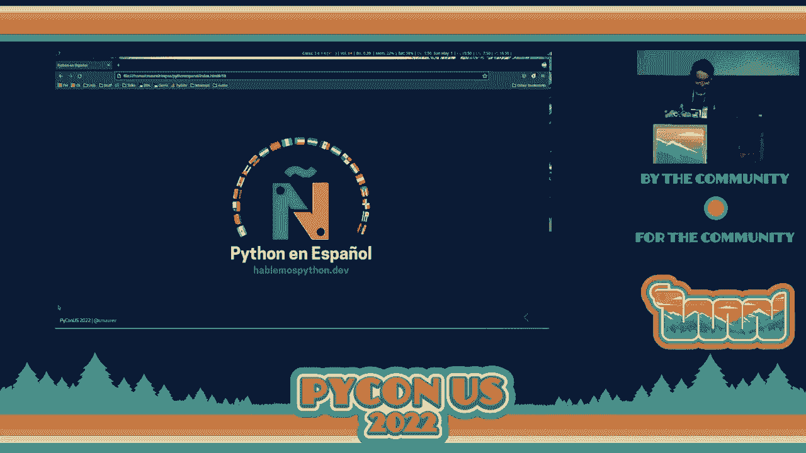


以下是演示中的部分“西班牙语化”代码示例：
```python
# 原Python代码
mi_lista = []
for contador in range(10):
    mi_lista.append(contador)

# 实验性“西班牙语”代码（非真实功能）
lista = []
meantras contador < 10:
    lista.agregar(contador)
    contador += 1
```

他强调了本地化社区的重要性，并分享了阿根廷Python社区翻译官方文档的成功案例。他的核心观点是：建立和使用母语社区能带来归属感，并帮助更多人成为开发者。


## 演讲 2：我的首次PyCon之旅 ✈️

接下来，马里奥分享了他第一次参加PyCon的个人经历，这是一次充满挑战与收获的冒险。

他的旅程始于响应提案征集，到获得旅行资助，最后与家人长途驾车抵达会场。他主持了教程和会议，并意外地进行了这次闪电演讲。他的故事鼓励新人勇敢参与社区活动。

## 演讲 3：开源如公园 🏞️


乔治用一个生动的比喻阐述了开源生态的本质。

她将开源项目比作一个**社区公园**：人人可免费进入并使用（使用软件），但需要大家共同维护（贡献代码、修复问题、撰写文档）。公司和贡献者的捐赠与帮助，就像为公园添置长椅或游乐场，能让整个社区变得更美好、更可持续。

## 演讲 4：为万物编写 Linter 🔍

本茨介绍了 `Semgrep` 工具，并展示了他如何脑洞大开地将其用于检查“现实世界”。

`Semgrep` 是一个用于多种语言的代码模式搜索与检查工具。本茨创建了 `Super Semgrep`，它能将现实世界的事物（如GitHub项目、Spotify播放列表、照片）转化为JSON数据，然后应用自定义规则进行检查。

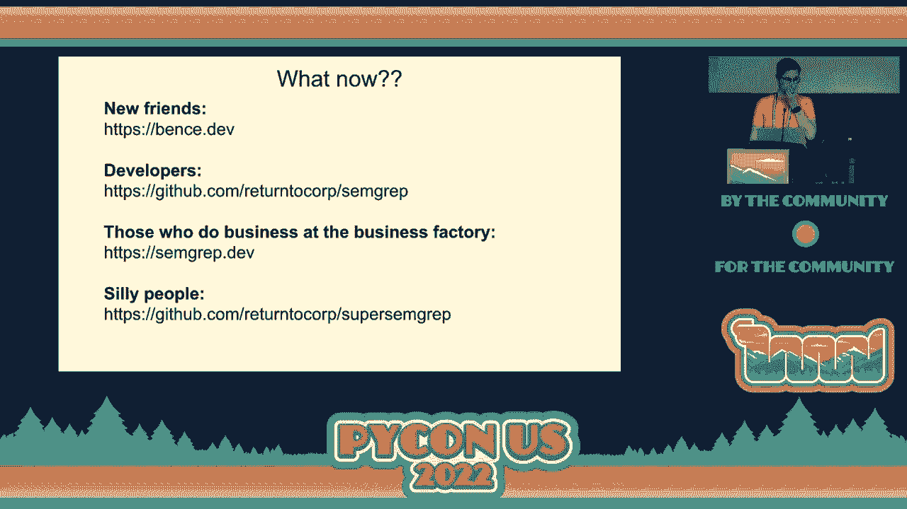

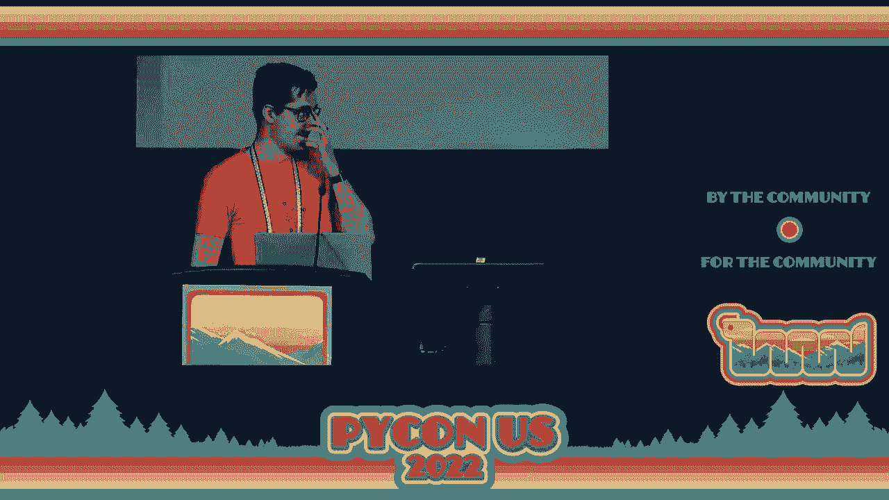

例如，一个检查GitHub项目是否缺少行为准则的规则可能如下：
```yaml
rules:
  - id: missing-code-of-conduct
    pattern: |
      {
        “stargazers_count”: $STARS,
        “has_code_of_conduct”: false
      }
    message: “Popular project ($STARS stars) is missing a code of conduct!”
    severity: WARNING
```
他演示了如何检查播放列表中歌曲节奏是否变化过大，甚至如何“判定”一张在希腊拍摄的照片中的人物穿着不符合“地中海时尚”。这个演讲生动地展示了代码思维的有趣应用。

## 演讲 5：助力CPython加速 🚀

马克代表“更快的CPython”团队发出了呼吁。

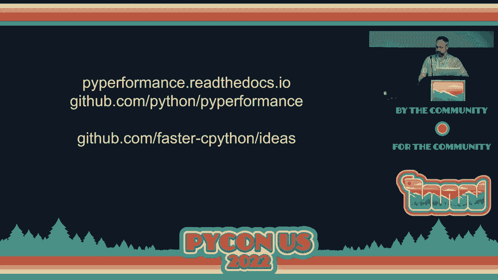

团队想知道他们的优化工作对用户的实际程序有多大提升。现有的标准基准测试集（如PyPerformance）覆盖场景有限。他请求社区帮助：**运行你自己的基准测试**。即使无法公开代码，也可以本地运行PyPerformance框架测试自己的应用，并将结果反馈给团队，这能帮助开发者更有针对性地进行优化。


## 演讲 6：使用 Correlate 关联数据 🔗

拉里解决了一个实际问题：如何自动匹配混乱的文件名与干净的元数据。

他编写了 `correlate` 库来解决“数据关联”问题。例如，将一堆命名混乱的广播剧MP3文件（如“bos1945-01-06.mp3”）与维基百科上规范的剧集列表进行匹配。

核心用法示例如下：
```python
import correlate

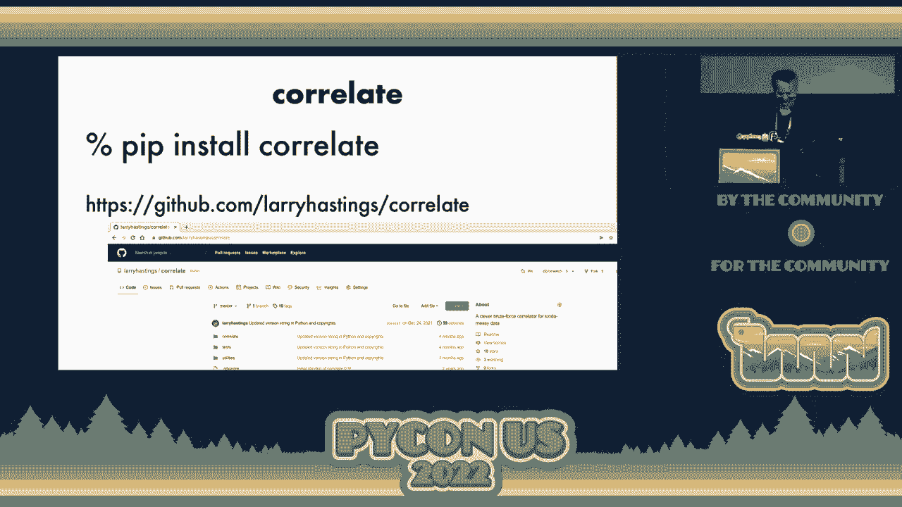

# 创建关联器
correlator = correlate.Correlator()


# 添加数据集A（MP3文件信息）
correlator.add_data(‘mp3s’， mp3_data_list， keys=[‘date’， ‘title_words’])

# 添加数据集B（剧集元数据）
correlator.add_data(‘episodes’， episode_data_list， keys=[‘date’， ‘title_words’， ‘stars’])

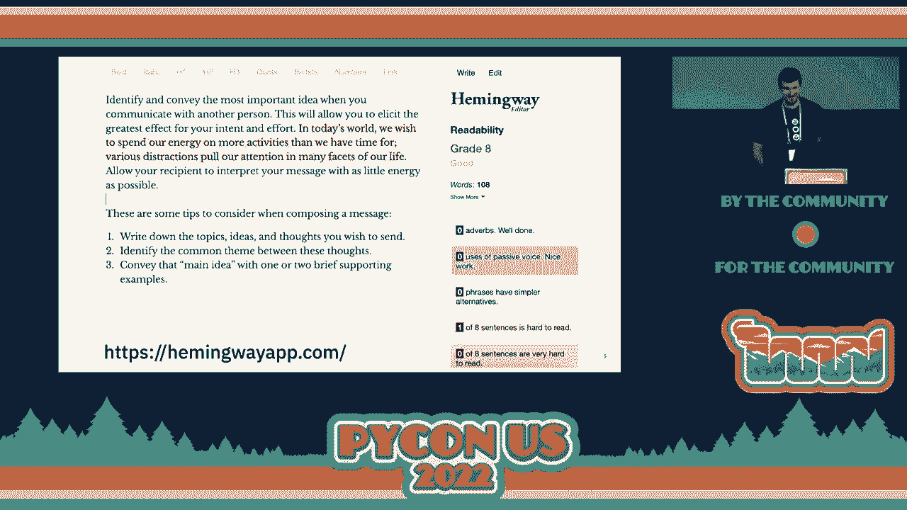


# 执行关联并获取结果
matches = correlator.correlate(‘mp3s’， ‘episodes’)
```
该库支持多键匹配、权重设置、模糊匹配和排名，能有效处理现实世界中不完美数据的关联任务。

## 演讲 7：简洁沟通的艺术 ✍️

里奇分享了他对有效沟通的见解。

在信息过载的时代，确保信息被快速理解至关重要。他提出了一个简单的写作流程：
1.  **写下想法**：列出所有需要传达的点。
2.  **寻找主题**：找出这些想法之间的共同主线。
3.  **精炼表达**：用一两句话概括核心思想，并辅以一两个简短例子。

他推荐使用“海明威编辑器”等工具来练习让文字更清晰、有力。

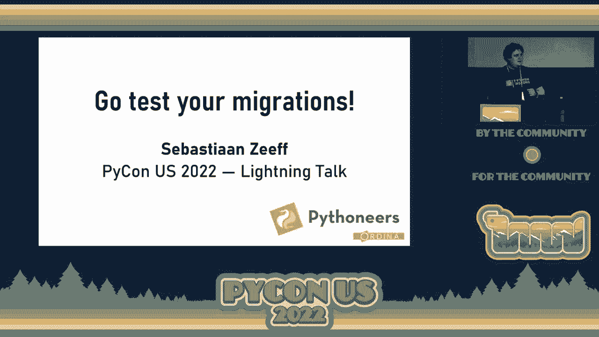


## 演讲 8：测试你的数据迁移 🧪

塞巴斯蒂安强调了测试数据库迁移（尤其是数据迁移）的极端重要性。

直接在生产数据库上运行未经测试的数据迁移脚本风险极高，可能导致数据损坏，且这种损坏可能很久后才被发现。他建议将迁移代码视作生产代码进行测试。

对于Django项目，可以使用 `django-test-migrations` 包。测试模式基本如下：
```python
# 1. 将数据库迁移到迁移前的状态
# 2. 插入与生产环境类似的真实测试数据
# 3. 运行待测试的数据迁移
# 4. 断言数据库状态符合预期
```
他提醒，这类测试可能较慢，应将其与单元测试套件分开。

## 演讲 9：保护你的 PyPI 账户 🔒

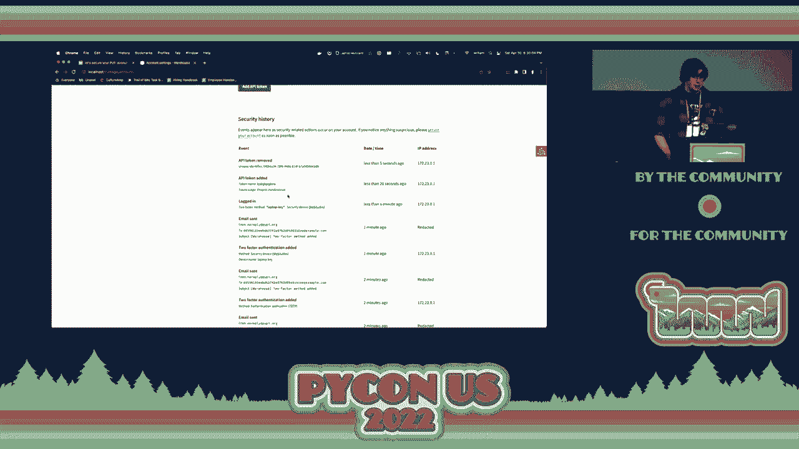


威廉演示了如何强化PyPI账户安全。

他现场演示了为PyPI账户启用双因素认证（2FA）的步骤：
1.  **生成恢复代码**并妥善保存。
2.  启用**验证器应用（TOTP）** 或**安全密钥**两种2FA方式。
3.  创建**项目作用域的API令牌**，而非使用密码上传包。


这些措施能极大降低账户被盗用的风险，并且所有安全事件都会在账户日志中可见。

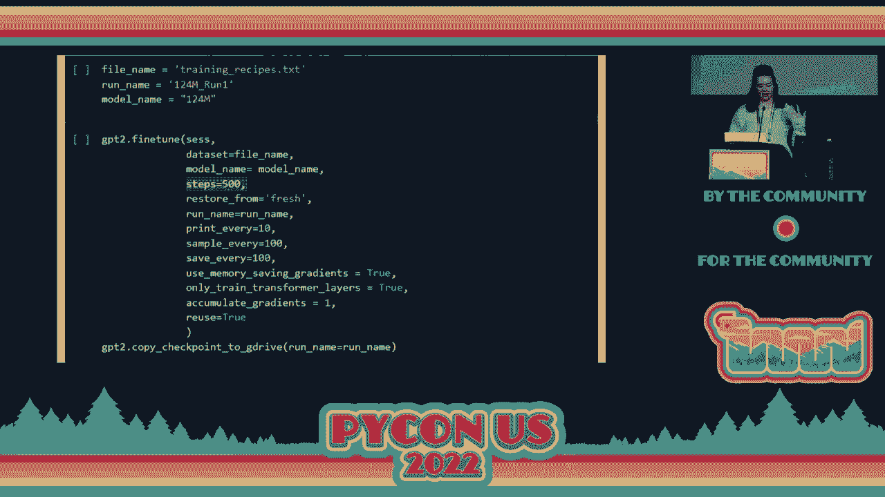

## 演讲 10：使用 GPT-2 生成食谱 👩🍳


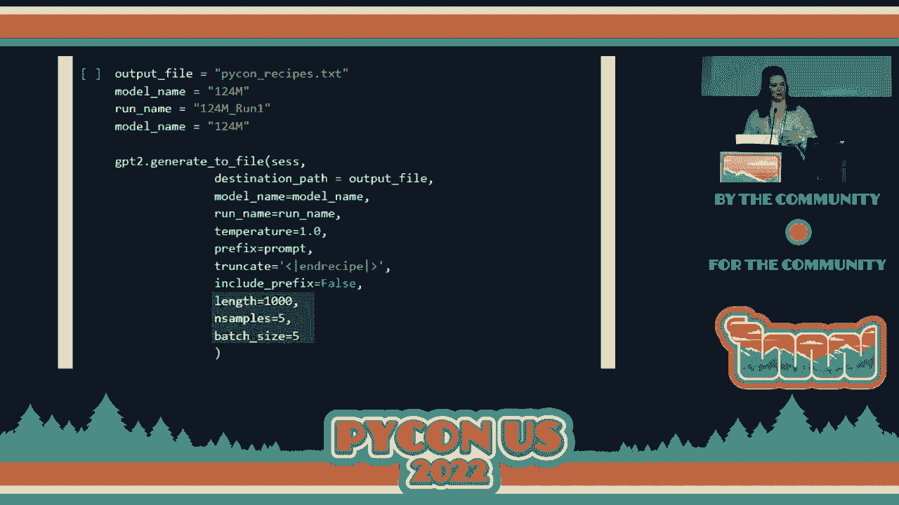

亚历克莎展示了如何使用深度学习模型生成食谱，并强调入门并不难。

她使用 `gpt2-simple` 包微调GPT-2模型来生成食谱，过程分为五步：
1.  **获取模型**：使用预训练的GPT-2。
2.  **准备数据**：将食谱数据集处理成文本格式，添加特殊标记（如 `<|startofrecipe|>`）。
3.  **微调模型**：在食谱数据上继续训练模型。
    ```python
    import gpt2_simple as gpt2
    gpt2.finetune(sess， dataset=‘recipes.txt’， steps=1000)
    ```
4.  **设计提示**：使用“少样本学习”，在提示中给出几个完整食谱示例，引导模型生成符合格式的内容。
5.  **生成文本**：调整“温度”等参数控制生成结果的创造性。

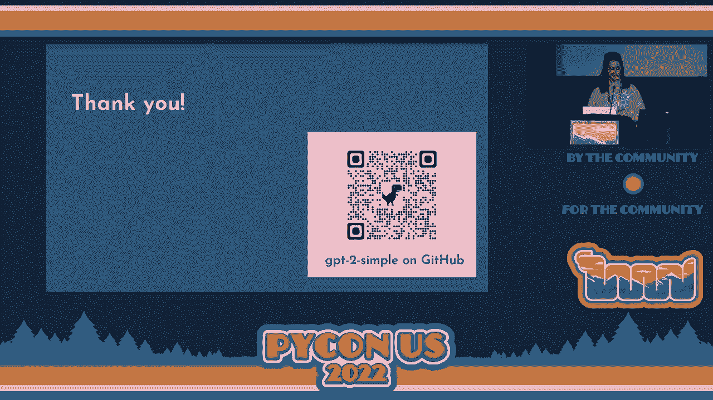


她指出，生成的食谱可能存在问题（如“使用空调搅拌”），需要通过更多数据、更长时间训练和优化提示来改进。

## 演讲 11：Django 升级实践 📈

斯里尼瓦斯分享了将大型单体应用从Django 1.11升级到新版本的经验。

升级的主要动力是安全更新和性能提升。他们的关键实践包括：
*   **管理依赖**：明确固定或放开依赖版本，利用 `pip-compile` 生成带哈希的依赖文件，清晰管理传递依赖。
*   **利用工具**：使用 `django-upgrade` 等开源工具自动修复弃用警告。
*   **仔细阅读发布说明**：这是了解破坏性变更和升级路径的最重要文档。

## 演讲 12：何时用 Rust 重写 Python 模块 ⚙️

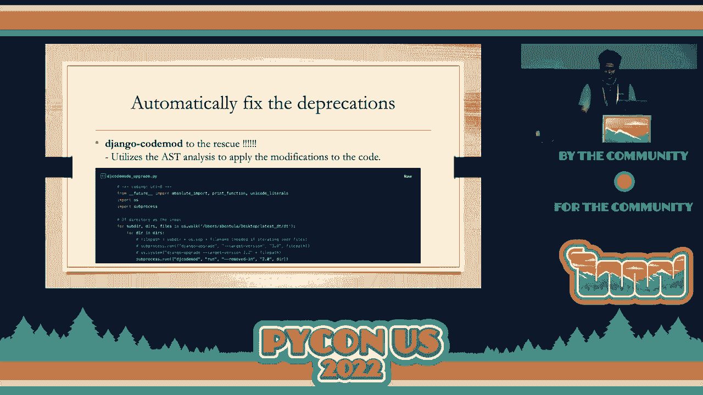


最后，阿德里安分享了将Python标准库 `graphlib` 模块用Rust重写的经验。

他总结了何时考虑重写：
*   **模块是CPU密集型**的。
*   **模块相对独立**，接口清晰。
*   **已有完善的测试**。

在重写过程中，他遇到了几个关键挑战及解决方案：
1.  **哈希的“可抛异常性”**：Python对象的 `__hash__` 可能抛出异常，而Rust的哈希函数不能。解决方案是在Rust中调用Python哈希并提前处理异常。
2.  **跨越语言边界的开销**：频繁在Python和Rust之间切换调用成本很高。他通过**在Rust侧进行引用比较**等优化，减少了回调Python的次数。
3.  **可变性设计**：Rust的所有权规则要求更明确的数据结构设计。他将节点数据拆分为可变和不可变两部分来满足借用检查器。

他的建议是：先用Python设计和优化API，定位热点，再考虑用Rust重写关键部分，同时精心设计以减少跨语言调用。

---

**本节课总结** 🎉

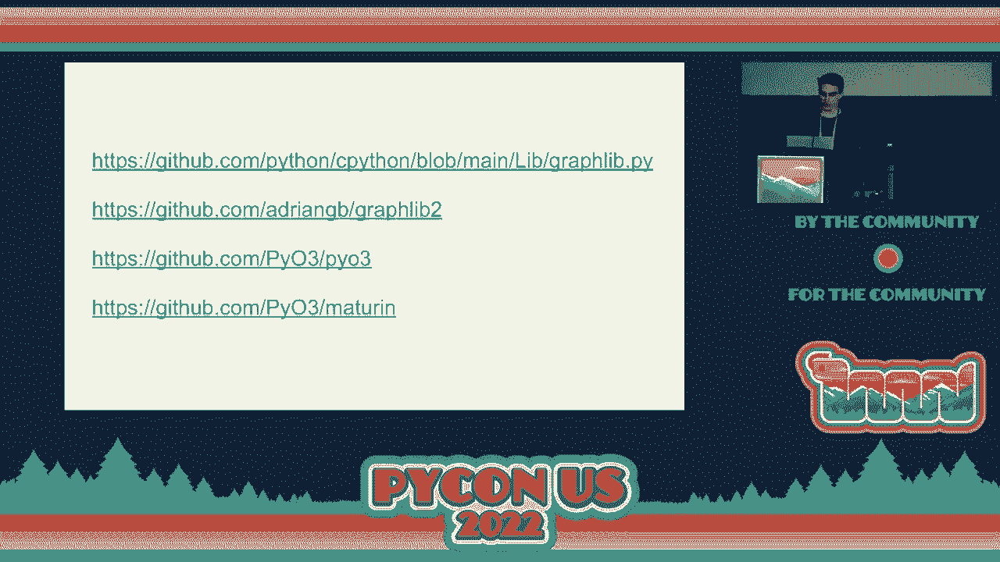


我们一起学习了PyCon第二天下午一系列精彩的闪电演讲。内容涵盖了从**社区与文化**（多语言支持、首次参会体验、开源比喻），到**实用工具与技巧**（代码检查、数据关联、沟通、安全、迁移测试），再到**前沿技术实践**（性能基准测试、AI生成内容、框架升级、Rust重写）的广阔主题。这些短小精悍的分享体现了Python社区的活力、创造力和务实精神，为初学者和资深开发者都提供了宝贵的灵感和知识。