# 软件工程与Python实践：P15：闪电演讲 - 第三天


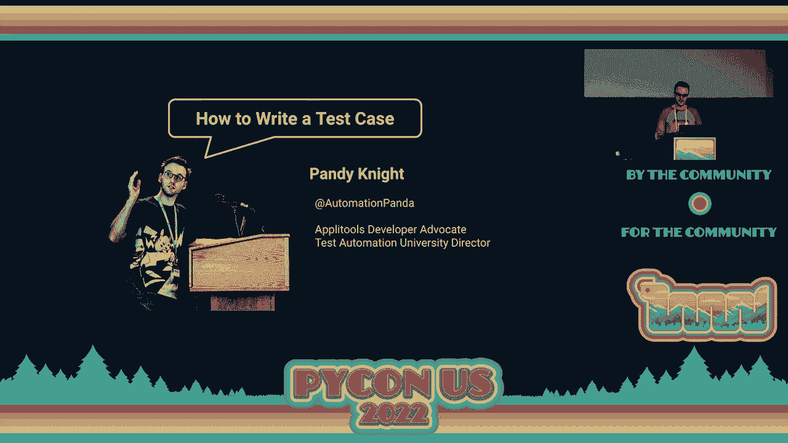

在本节课中，我们将学习来自PyCon闪电演讲第三天的多个精彩主题。内容涵盖如何编写专业的测试用例、计算思维的核心概念、实用的开发者工具、机器学习的数据处理策略、Python官方文档的阅读技巧，以及社区活动的组织经验。每个主题都旨在提供简单直白的知识，帮助初学者快速理解核心思想。

## 1：如何编写专业的测试用例 🧪

测试是软件开发中确保代码质量与安全性的关键环节。上一节我们概述了本课程的内容，本节中我们来看看如何结构化地编写测试用例。

测试的本质是**交互**加上**验证**。测试用例则是执行这些交互与验证的具体步骤。无论是单元测试、集成测试还是端到端测试，其核心都是尝试某种操作并报告通过或失败的结果。

编写优秀测试用例的一个有效模式是 **“安排-行为-断言”** 模式。这个模式为测试提供了清晰的结构。

以下是该模式的具体步骤：

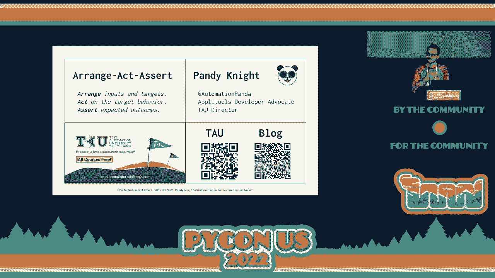

1.  **安排**：设置测试的初始状态和输入数据。例如，创建对象、准备数据库或登录应用程序。
2.  **行为**：执行需要测试的核心操作。例如，调用一个函数、访问API或与用户界面交互。
3.  **断言**：验证操作的结果是否符合预期。例如，检查返回值、系统状态或输出内容。


这个模式也常被称为 **“Given-When-Then”** 格式，它们本质上是相同的。

让我们通过一个Python单元测试的例子来具体说明。以下是一个测试绝对值函数 `abs()` 的简单用例：

```python
def test_abs_of_negative_number():
    # 安排：创建一个负数作为输入
    negative_number = -5

    # 行为：调用abs函数
    answer = abs(negative_number)

    # 断言：验证结果是正数
    assert answer > 0
```

我们也可以将这个模式应用于更复杂的场景，例如测试一个网络API。以下示例使用 `requests` 库测试DuckDuckGo即时答案API：

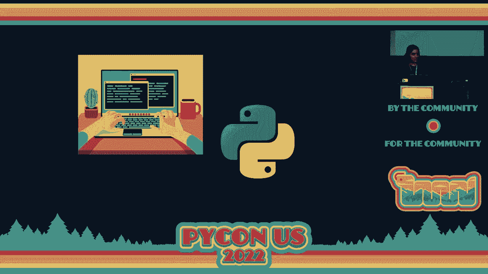

```python
import requests

def test_duckduckgo_instant_answer_api():
    # 安排：构造请求URL
    url = “https://api.duckduckgo.com/”
    params = {“q”: “Python programming”, “format”: “json”}

    # 行为：发送HTTP GET请求并解析JSON响应
    response = requests.get(url, params=params)
    response_body = response.json()

    # 断言：验证状态码和响应内容
    assert response.status_code == 200
    assert “Python” in response_body[“AbstractText”]
```

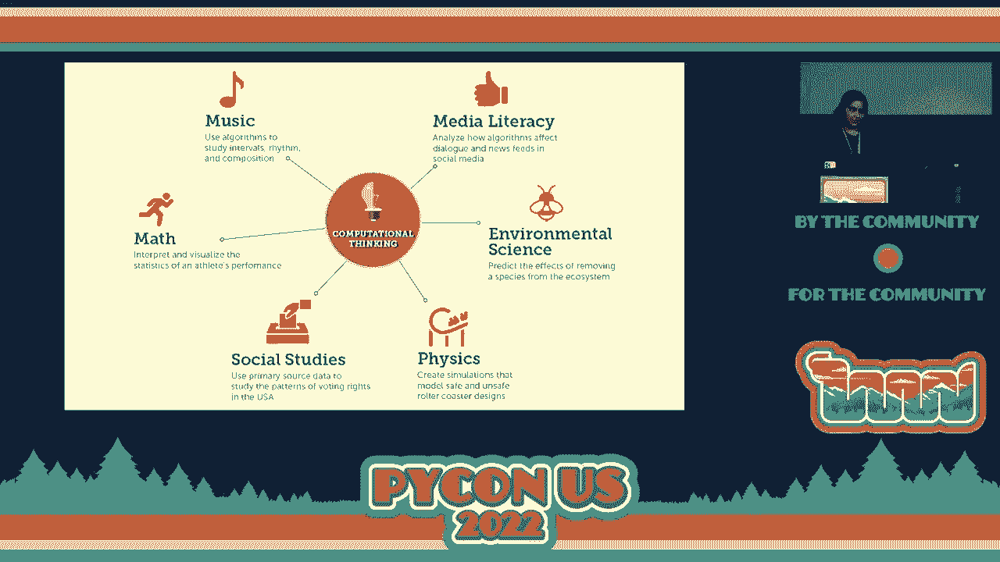

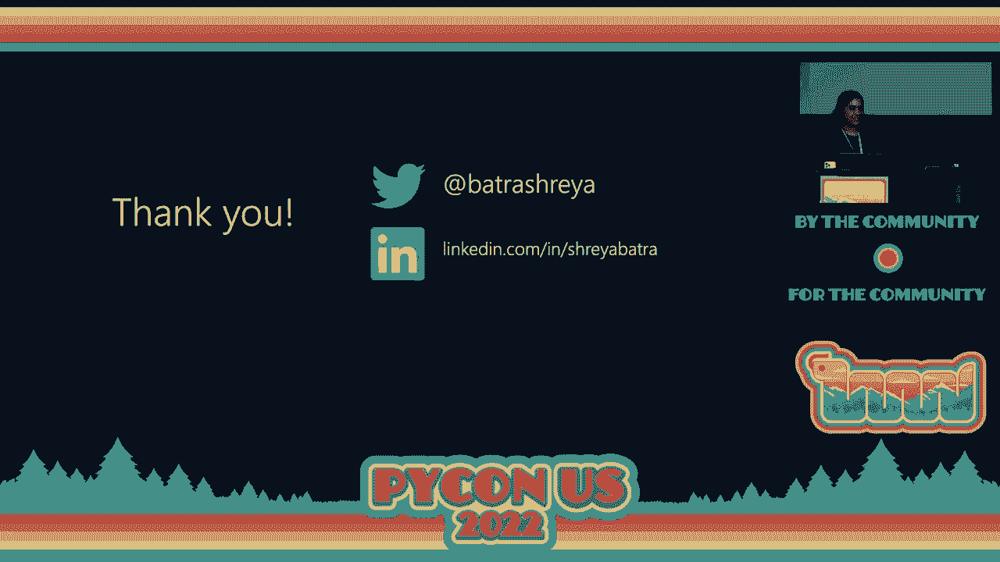

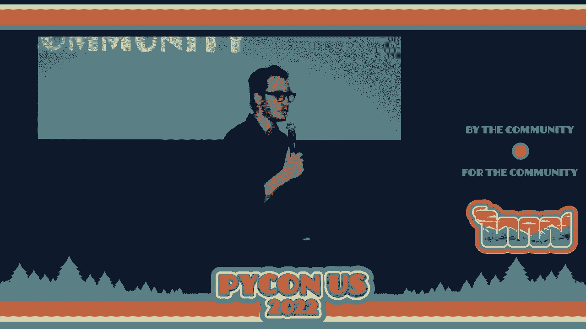

使用“安排-行为-断言”模式能使每个测试用例只关注一个独立行为，从而在测试失败时更容易定位问题根源。

## 2：计算思维及其在教育中的应用 🧠

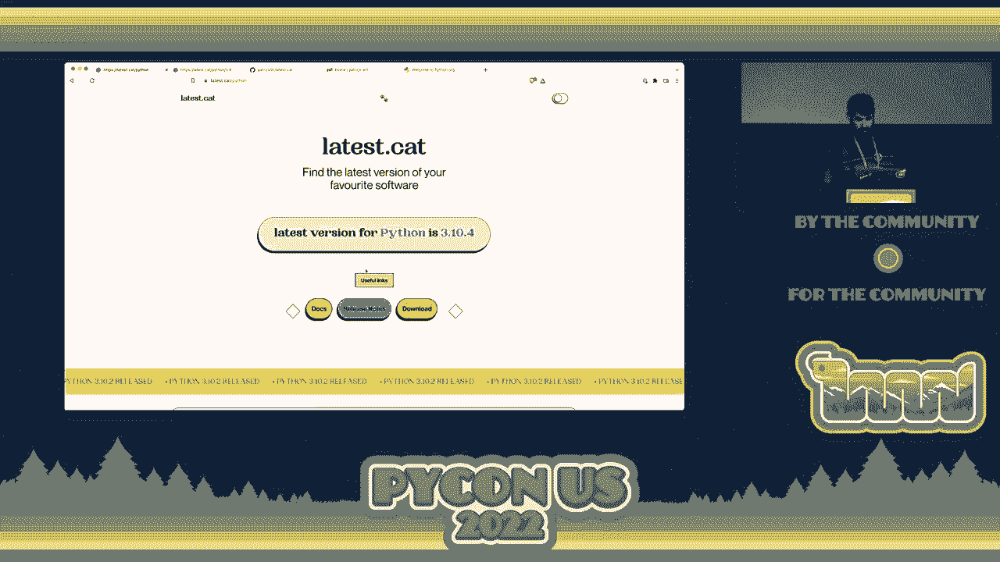

上一节我们介绍了编写测试的结构化方法，本节中我们来看看一种超越编程的思维方式——计算思维。

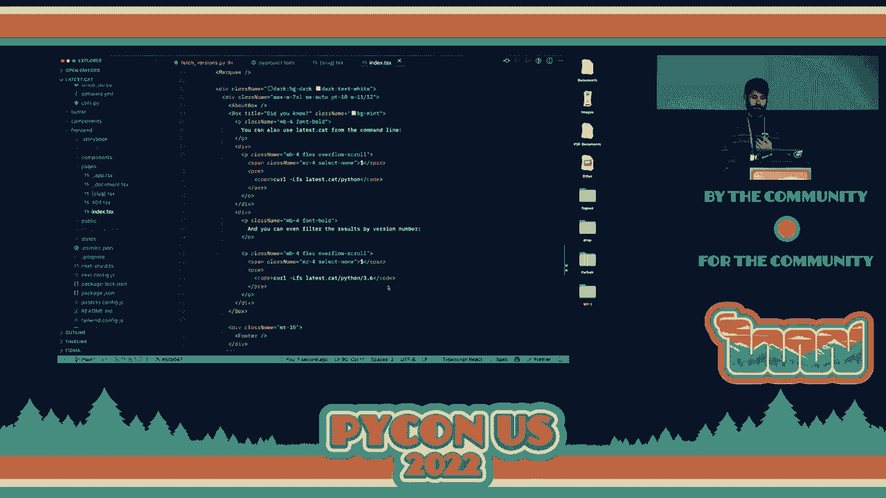

计算思维是计算机科学背后的核心概念，它关注如何形成有效的解决方案，而不涉及具体的编程语法。这种思维模式包含四个主要组成部分，适用于各个学科和现实问题。

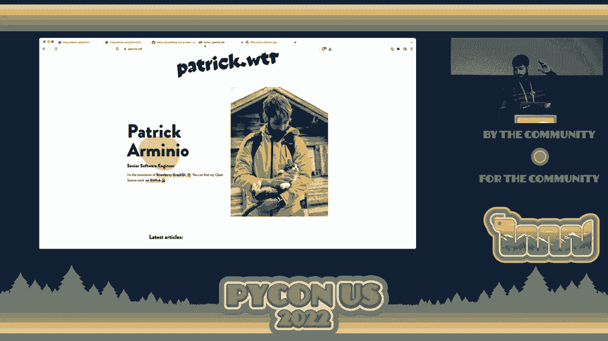


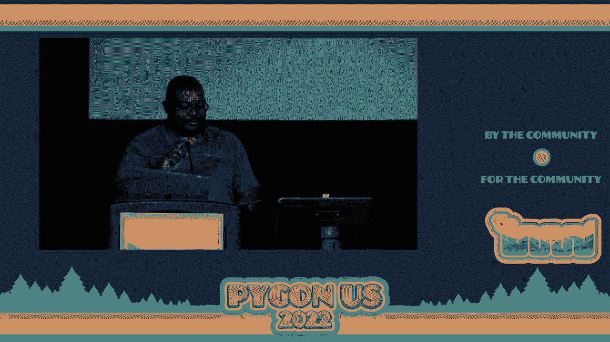

以下是计算思维的四个核心组件：

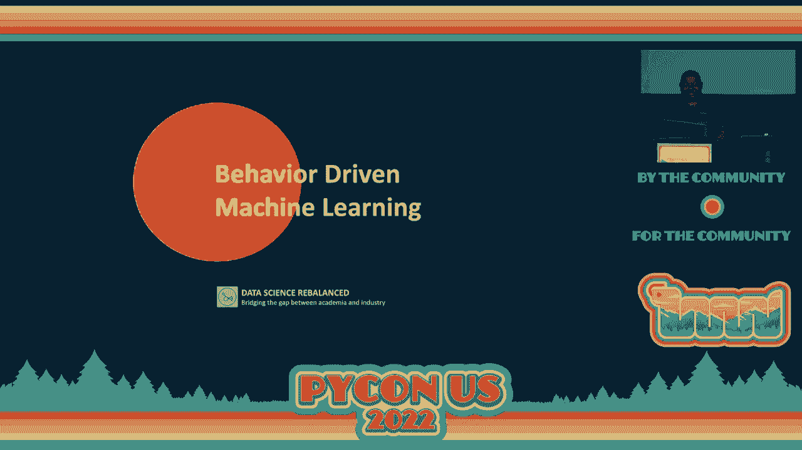

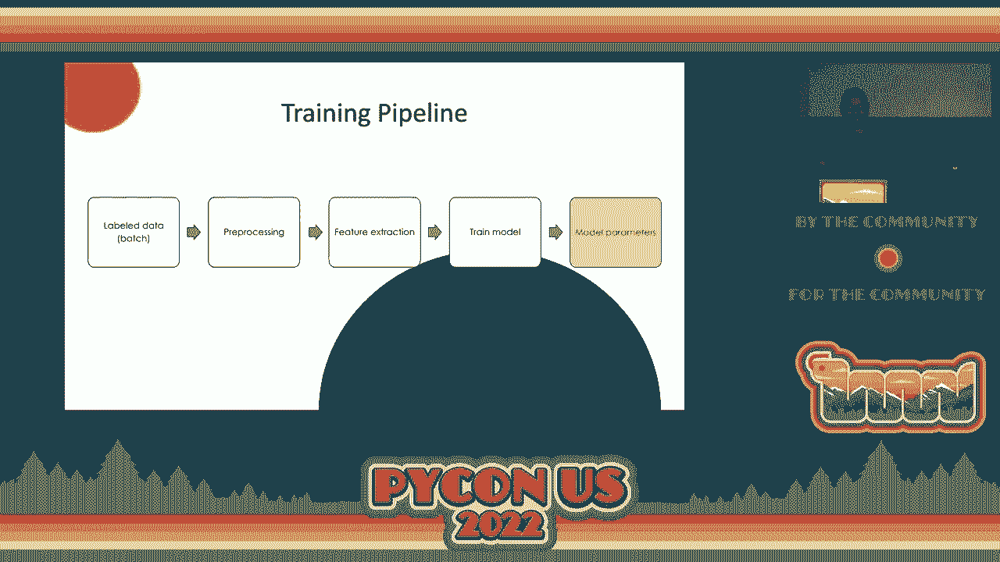

1.  **分解**：将复杂问题拆解成更小、更易管理的部分。
2.  **模式识别**：在问题或数据中寻找规律或趋势。
3.  **抽象**：忽略不必要的细节，专注于关键概念。
4.  **算法设计**：创建一步步解决问题的清晰指令。

以在一个会议中心寻找房间为例，我们可能无意识地运用了计算思维：先寻找指示牌（模式识别），若无则选择方向尝试（算法设计），并重复此过程直到找到目标（循环）。有意识地运用这些步骤，可以优化解决问题的过程。

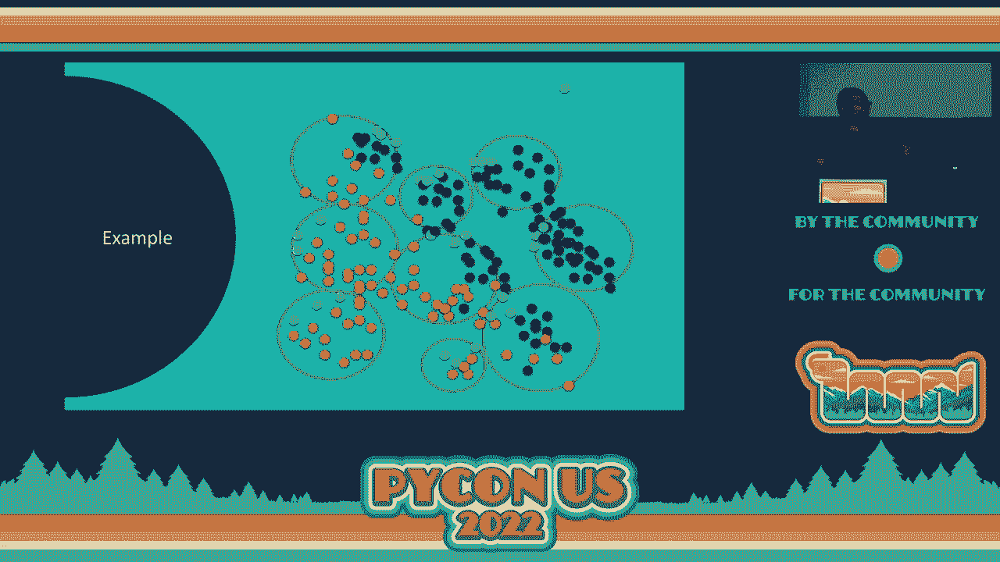

将计算思维融入教育，并非要取代编程教学，而是作为其坚实的基础。它不需要开设全新课程，而是可以将相关概念整合进现有的数学、科学乃至语文课程中，帮助学生从根本上改变分析和解决问题的方式。


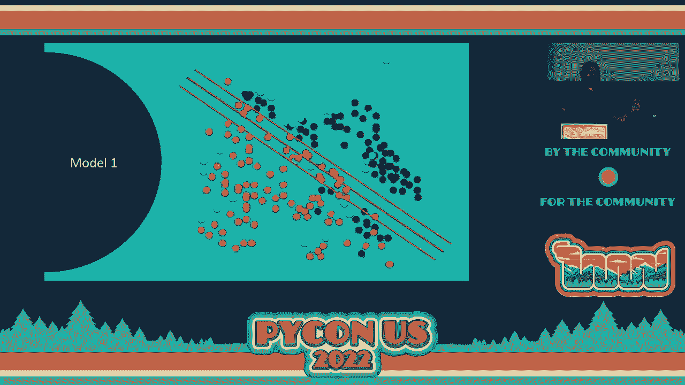

## 3：实用工具介绍：latest.cat 🛠️

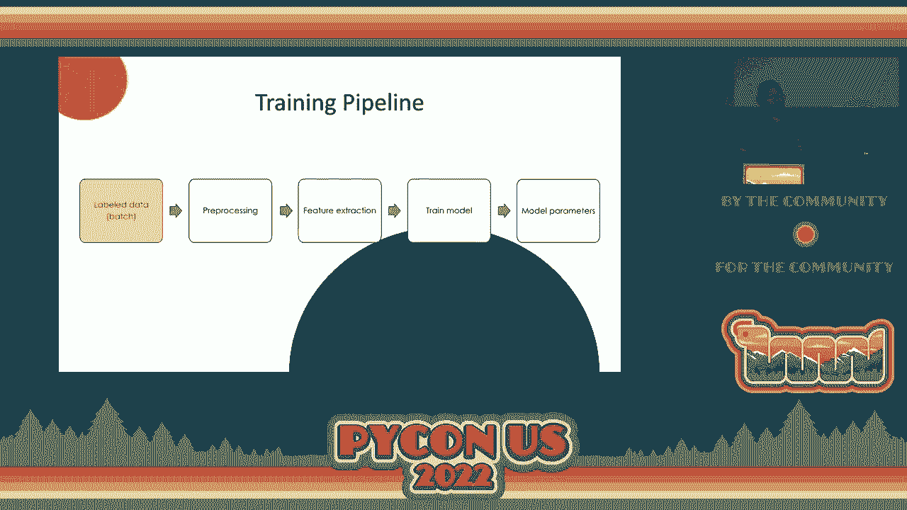

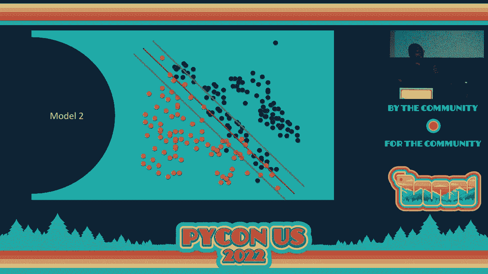

在理解了计算思维这种宏观理念后，本节我们来看一个解决具体微观问题的实用工具。

开发者经常需要查询软件的最新版本号，这个过程往往需要打开浏览器并访问官网，步骤繁琐。`latest.cat` 是一个命令行工具，旨在简化这一过程。

该工具允许用户快速查询多种编程语言和工具的最新版本。其使用方式非常简单直接。


以下是使用 `latest.cat` 的基本示例：

```bash
# 查询 Python 的最新版本
$ curl latest.cat/python
3.9.12

# 使用工具自带的 `kers` 脚本查询
$ kers -s python
Loading latest version of python...
3.9.12
```

该工具目前支持 Python、Node.js、PHP、Rust 等多种软件，并且是开源的。用户可以通过提交 Pull Request 来为其添加对新软件的支持，从而帮助整个社区提升效率。

## 4：行为驱动的机器学习策略 🤖

从实用的工具转向数据科学领域，本节我们来探讨一种更高效的机器学习模型训练策略。

传统的机器学习教学通常建议使用所有可用数据来训练模型。然而，在工业实践中，并非所有数据都具有同等价值。一种更优的策略是采用“行为驱动”或“主动学习”的方法，即智能地选择对模型改进最有帮助的数据进行训练。

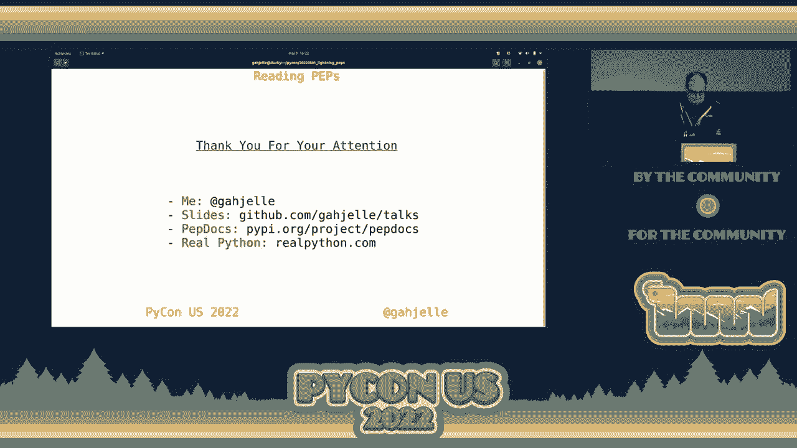


这种方法的核心步骤是通过迭代来寻找数据集中最重要的样本。

以下是行为驱动机器学习的关键步骤：

1.  **初始采样**：不对整个数据集进行随机采样（可能引入偏见），而是先进行聚类，再从每个聚类中选取代表性样本作为初始训练集。
2.  **模型训练与评估**：使用初始训练集训练一个模型，该模型会在某些“不确定”区域（如置信度接近50%的边界）表现困惑。
3.  **智能扩充**：将这些模型感到“困惑”的数据点加入训练集。
4.  **迭代优化**：用扩充后的训练集重新训练模型，并重复步骤2和3。模型性能会先提升后下降，峰值点即对应最优模型。

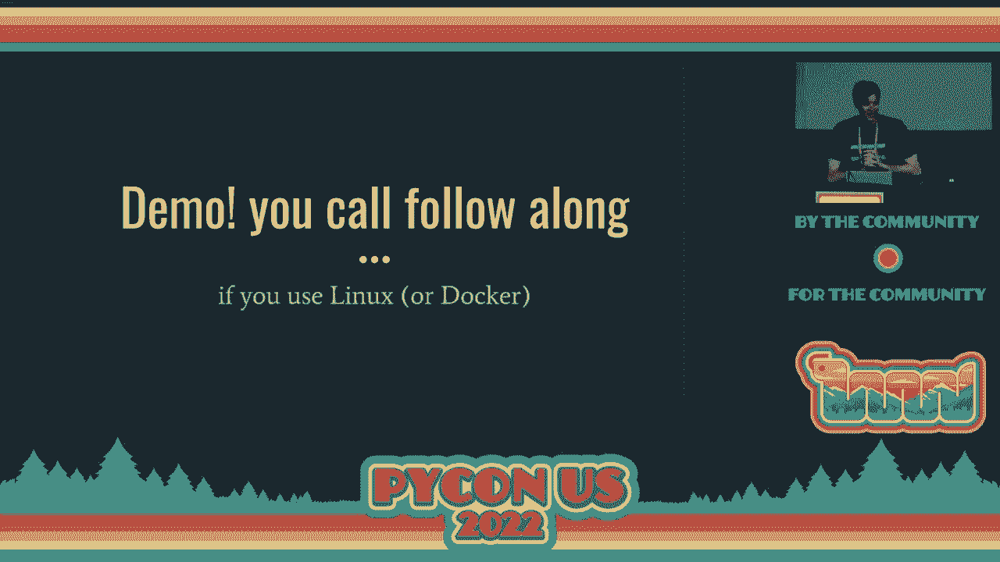

这种方法有多重优势：对于有标签的数据集，可以用更少的数据训练出最佳模型；对于无标签的数据集，可以大幅减少需要人工标注的数据量；同时，它还有助于减少模型因数据分布不均而产生的偏见。

## 5：如何阅读与利用Python增强提案 📄

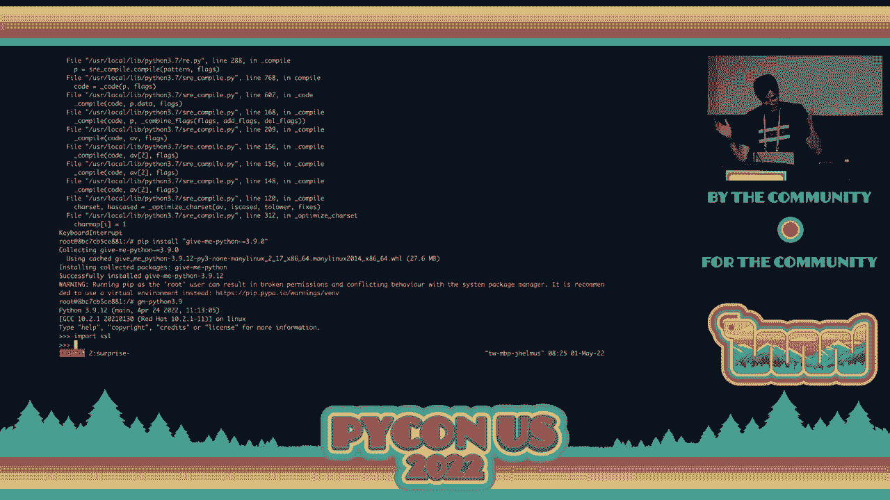

了解了前沿的机器学习方法后，我们回到Python语言本身，探索其发展的蓝图——PEP文档。

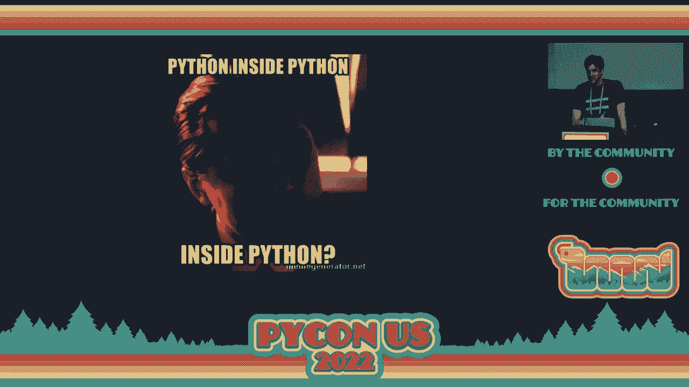

PEP是Python增强提案的缩写，它们是描述新特性、技术规范及社区流程的官方文档。阅读PEP不仅能了解功能的具体实现，还能洞察语言设计的历史与决策过程。

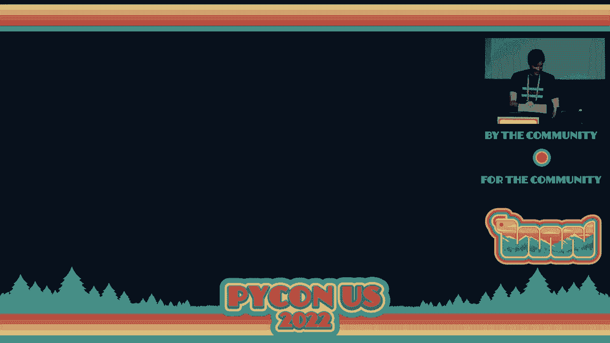

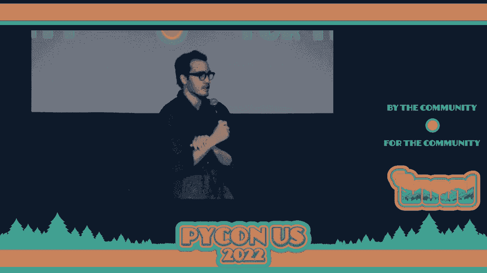

PEP文档是高度技术性的，通常不是学习如何使用某个功能的最佳教程，但却是理解其“为何如此设计”的绝佳材料。例如，PEP 8是广为人知的代码风格指南，而PEP 636则提供了关于模式匹配的出色教程。

为了方便查阅，社区提供了 `pep` 命令行工具，可以快速获取和转换PEP文档。

以下是使用 `pep` 工具的一些示例：

```bash
# 在终端中查看PEP 8的内容
$ pep 8 | less

# 在浏览器中打开PEP 8的网页
$ pep -w 8

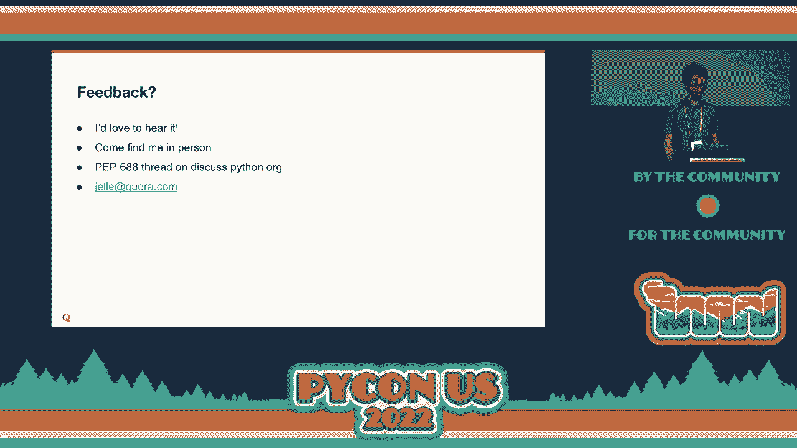

# 将PEP 13转换为Markdown格式并保存
$ pep --markdown 13 > pep-13.md
```


通过阅读PEP，尤其是其中的“动机”和“被拒绝的提案”部分，开发者可以深入理解Python语言的设计哲学和演变轨迹。

## 6：后疫情时代的线下技术社区重启 🎪

最后，让我们从技术文档回到人与人连接的层面，探讨后疫情时代线下技术社区面临的挑战与机遇。

组织线下技术聚会（如Python本地聚会）在疫情后遇到了显著挑战：人们习惯了线上会议的便利，对重返线下感到不确定；组织者在协调工作、生活与社区活动时感到疲惫；寻找演讲者和维持社区热度也变得更为困难。

尽管面临困境，许多社区通过坚持举办高质量的线上活动成功保持了活力。例如，某个地方Python聚会小组在两年内不间断地举办了20多次虚拟会议，保持了社区的凝聚力。

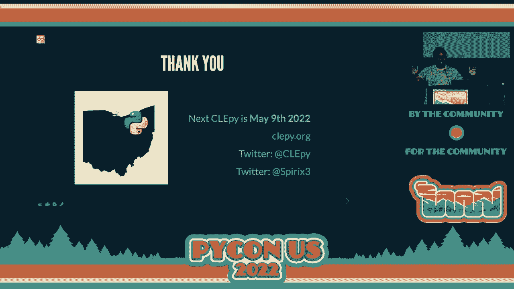


当前的目标是安全地重启线下聚会。这需要组织者付出更多努力，同时也离不开公司的赞助（提供场地、食物等）和社区成员的积极参与。线下聚会所带来的面对面交流、即时反馈和深度社交联系，是线上活动难以完全替代的宝贵体验。

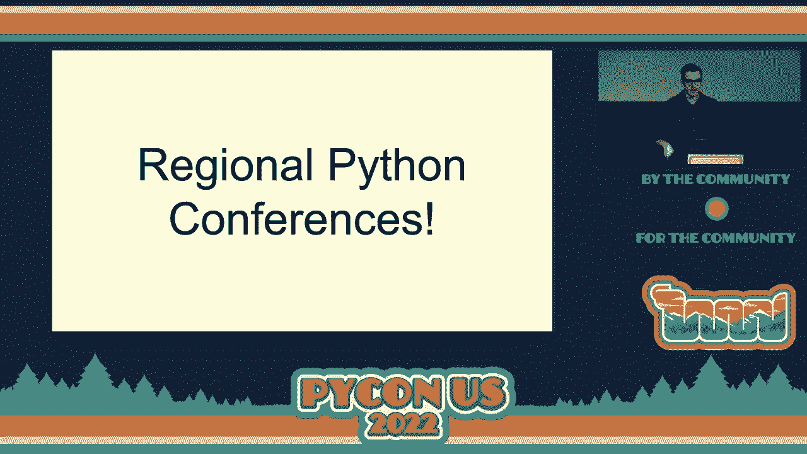

## 7：全球Python社区会议巡礼 🌍

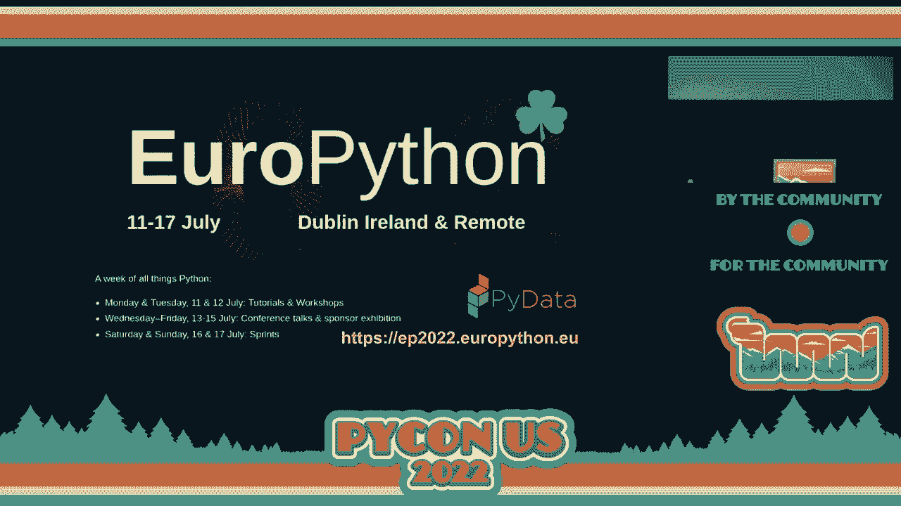

在思考本地社区重启的同时，全球Python社区也充满了活跃的交流活动。本节我们简要了解一些即将举行的地区性PyCon会议。

以下是部分即将举行的Python会议信息：

*   **PyCon Europe**：将于7月举行，包含研讨会、主题演讲和编程冲刺，是体验国际Python社区氛围的好机会。
*   **PyDay San Francisco**：一个在旧金山举办的单日户外Python会议，注重交流与分享。
*   **PyCon Japan**：日本最大的Python会议，提供日语和国际化的内容，线上线下结合。
*   **PyCon Taiwan**：将以线上形式举行，汇聚亚太地区的Python开发者。
*   **Python Brasil**：巴西的Python大会，提供葡萄牙语和西班牙语支持，活动形式多样。

参加这些会议是学习新知、拓展视野和结识同好的绝佳途径。

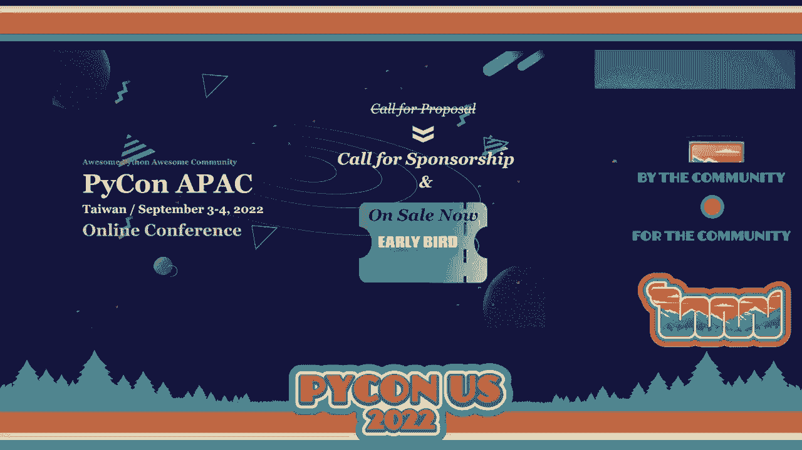

---

本节课中我们一起学习了多个软件工程与Python实践的独立主题。我们从编写结构清晰的测试用例开始，探讨了计算思维这一基础方法论，接着介绍了提升效率的开发者工具和先进的机器学习数据策略。然后，我们深入了解了如何通过阅读PEP来理解Python语言的设计，并最后关注了线下技术社区的组织与全球Python会议的动态。这些内容涵盖了从具体代码实践到抽象思维，再到社区建设的多个层面，希望能为你的学习和职业发展提供启发。