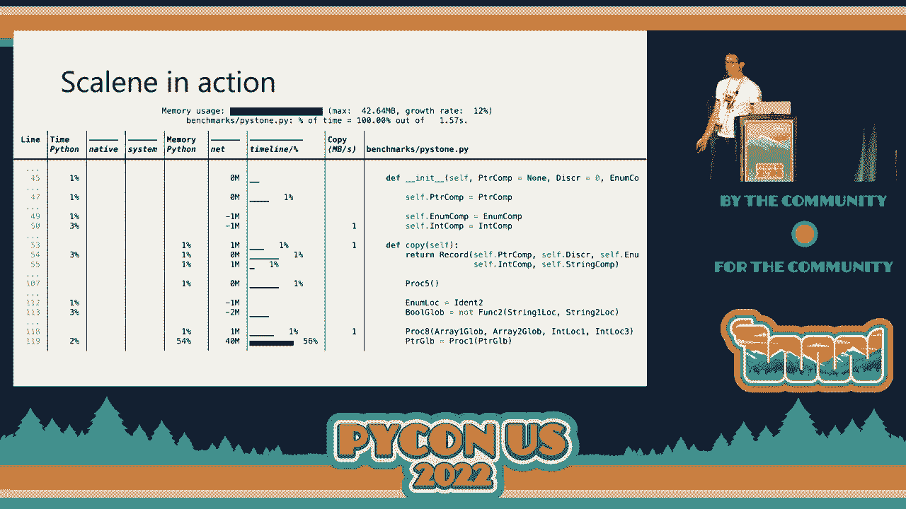
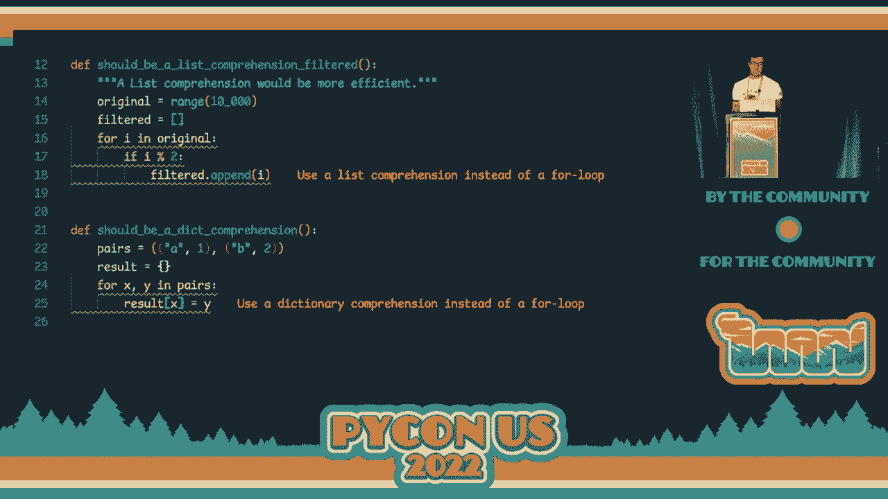
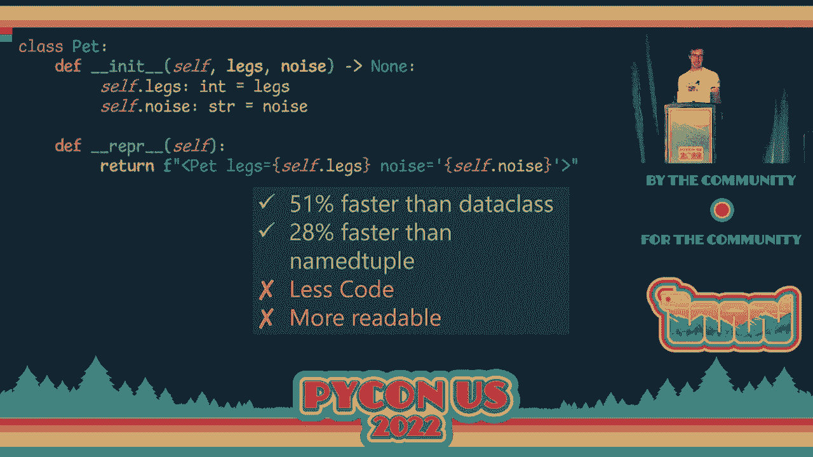
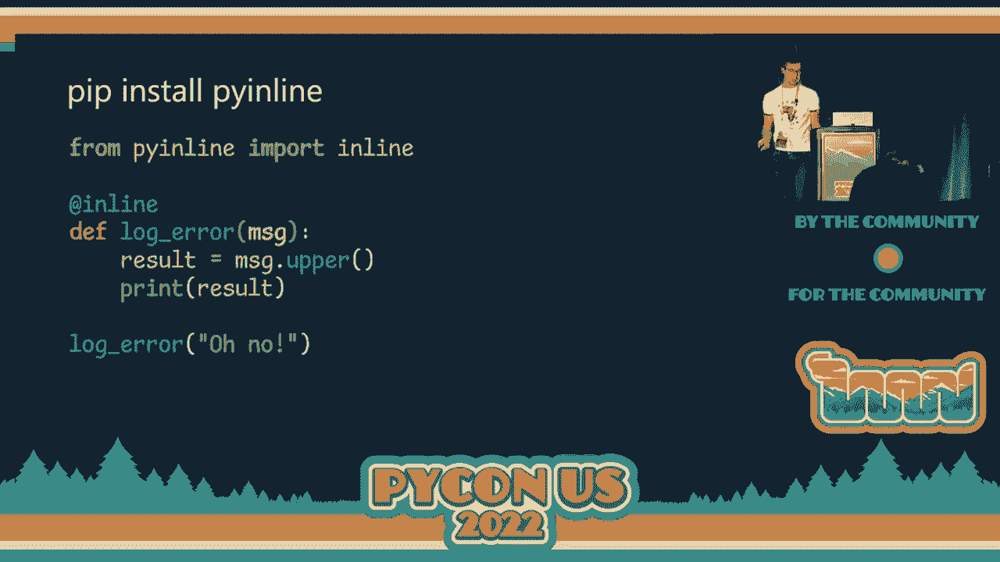
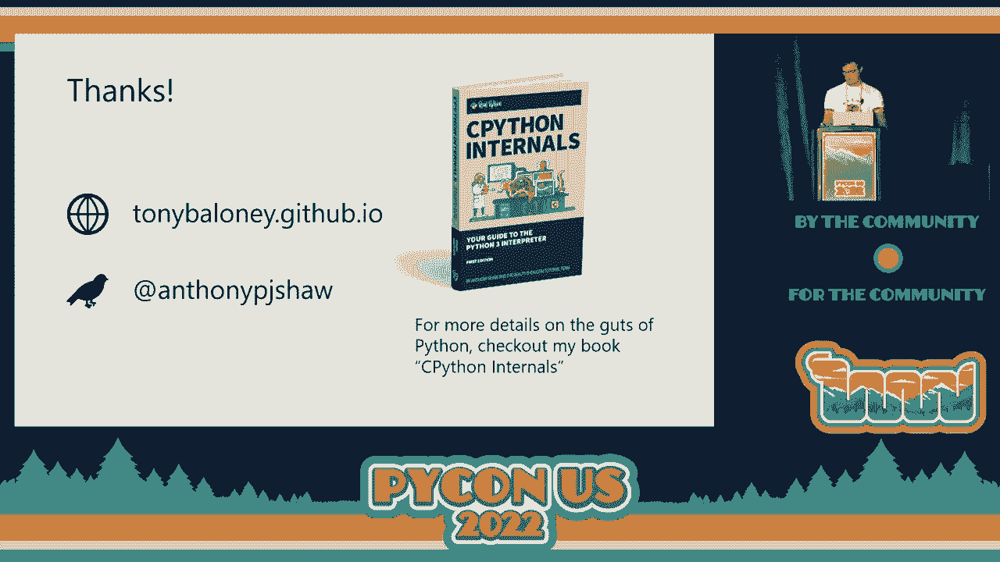

# Python性能优化：P20：编写更快的Python！常见性能反模式 🚀


在本教程中，我们将学习如何通过识别和修正常见的代码反模式来提升Python程序的运行速度。我们将探讨几种关键的优化技巧，包括循环不变性、推导式的使用、数据类型的选择以及函数调用开销的管理。这些方法旨在通过微小的代码改动，带来显著的性能提升。

---

## 性能优化前的准备 📋

在开始优化代码之前，有一些重要的准备工作需要完成。上一节我们介绍了本课程的目标，本节中我们来看看如何为优化打下基础。

首先，你需要建立一个性能基准。这意味着你需要知道当前应用程序的运行速度如何。没有基准，你将无法衡量优化是否有效。

以下是开始前必须做的几件事：

*   **创建基准**：测量当前代码的性能，作为后续比较的参照。
*   **使用真实数据**：基准测试应使用尽可能接近生产环境的数据，而非虚假数据。
*   **进行原子性更改**：每次只做一处小改动，以便准确识别性能变化的原因。
*   **多次运行测试**：由于CPU存在性能波动，单次测试结果可能不准确，需要多次运行取平均值。
*   **关注显著提升**：通常，低于10%的性能提升可能源于噪声，可以忽略。我们应关注30%、60%或更高的提升。

### 使用性能分析工具

识别代码中的“热点”（即消耗大部分运行时间的部分）至关重要。为此，我们需要使用性能分析工具。分析工具主要分为两类：

*   **追踪分析器**：在函数执行前后插入代码来精确计时。优点是准确，缺点是开销较大，可能使程序运行变慢。例如Python标准库中的 `cProfile`。
*   **采样分析器**：定期对运行中的程序进行采样，记录当前执行的代码。优点是开销小，对程序性能影响微乎其微。

以下是推荐的分析工具：

*   **Austin** 和 **Scalene**：两者都是出色的采样分析器，开销极小，并能提供行级别的详细分析报告，帮助你定位到具体的耗时代码行。
*   **cProfile**：Python内置的追踪分析器，兼容性好，但开销相对较大。
*   **pyinstrument** 和 **yappi**：功能强大的纯Python分析工具。



---

## 核心反模式与优化策略 ⚙️

在通过分析工具定位到性能瓶颈后，我们就可以针对性地应用优化策略了。上一节我们介绍了如何准备和分析，本节中我们来看看具体的优化技巧。

### 1. 循环不变性 🔄

**核心概念**：在循环内部，有些表达式的结果在每次迭代中都是**不变的**。高效的编译器会自动将这些表达式移出循环（称为“循环不变代码外提”），但Python解释器不会这样做。

**反模式示例**：在每次循环迭代中重复计算相同的值。
```python
# 优化前
def slow_loop():
    x = (1, 2, 3)
    i = 6
    for _ in range(100000):
        result = len(x) * i  # len(x) * i 的结果在循环中不变
```
**优化方法**：将不变的计算移出循环，赋值给一个变量。
```python
# 优化后
def fast_loop():
    x = (1, 2, 3)
    i = 6
    x_len_times_i = len(x) * i  # 计算一次
    for _ in range(100000):
        result = x_len_times_i   # 直接使用结果
```
**效果**：此优化可带来约 **55%** 的性能提升。需要警惕的不仅是简单表达式，还包括字典查找、方法调用等。

### 2. 善用推导式 📝



**核心概念**：使用列表推导式、字典推导式或集合推导式来创建新的序列，通常比传统的 `for` 循环更高效、更简洁。

**反模式示例**：使用 `for` 循环和 `.append()` 方法创建新列表。
```python
# 优化前
new_list = []
for item in old_list:
    if condition(item):
        new_list.append(transform(item))
```
**优化方法**：改用列表推导式。
```python
# 优化后
new_list = [transform(item) for item in old_list if condition(item)]
```
**效果**：代码更简洁，并可获得约 **23%** 的性能提升。同样适用于创建字典（`{k:v for ...}`）和集合（`{x for ...}`）。

### 3. 选择正确的数据类型 🧱

**核心概念**：Python不同的内置数据类型在创建、查找、迭代等方面性能差异显著。根据使用场景（如是否可变、是否需要唯一项、主要操作是遍历还是查找）选择最合适的类型。


**关键决策点**：
*   **是否需要可变**：不需要则优先使用**元组**而非列表。
*   **内容是否为字节**：是则考虑 **`bytes`** 或 **`bytearray`**。
*   **是否需要唯一项**：是则使用**集合**。
*   **数据映射开销**：在JSON和类对象间频繁转换可能很低效，需评估是否必要。

**类类型性能对比**：
在表示简单数据结构时，不同类类型的性能排序（从快到慢）大致为：
1.  **带 `__slots__` 的自定义类**（手动定义属性，限制动态属性创建）
2.  **普通自定义类**
3.  **`namedtuple`** / **`typing.NamedTuple`**
4.  **`dataclass`**（由于魔法方法开销，创建实例较慢）



**注意**：如果只创建少量实例，这种差异可以忽略。但如果需要创建成百上千个实例，选择合适的类型就非常重要。

### 4. 避免不必要的函数调用 📞


**核心概念**：在Python中，调用函数（特别是纯Python函数）会产生一定的开销。在热点循环中频繁调用微小函数会累积成显著的性能损失。

**反模式示例**：在循环内调用一个简单的工具函数。
```python
# 优化前
def add(a, b):
    return a + b


total = 0
for i in range(100000):
    total = add(total, 1)  # 每次循环都有函数调用开销
```
**优化方法**：对于极其简单的操作，考虑将代码内联到循环中。
```python
# 优化后
total = 0
for i in range(100000):
    total = total + 1  # 消除了函数调用开销
```
**效果**：在这个极端的例子中，内联优化可带来超过 **50%** 的性能提升。**注意**：这会牺牲一些代码的清晰度和复用性，应仅用于已确认的热点代码区域。


### 额外技巧：使用 `match` 语句（Python 3.10+）🎯

**核心概念**：Python 3.10引入的 `match` 语句（结构模式匹配）在匹配序列（如列表、元组）时，比等效的 `if-elif` 链速度更快。

**效果**：在序列匹配场景下，使用 `match` 语句可比传统写法快约 **80%**。

---



## 总结与最佳实践 🏁

本节课中我们一起学习了四种提升Python代码性能的核心反模式及其优化策略：

1.  **提取循环不变代码**：将循环内不变的计算移出循环。
2.  **优先使用推导式**：用列表、字典、集合推导式替代手动循环和添加操作。
3.  **谨慎选择数据类型**：根据使用场景（可变性、内容类型、操作类型）选择最合适的数据结构，了解不同类类型的性能差异。
4.  **管理函数调用开销**：在已确认的热点循环中，权衡代码清晰度与性能，必要时将微小函数内联。

**最佳实践流程**：
1.  **分析先行**：永远先使用采样分析器（如Scalene、Austin）定位真正的性能瓶颈，不要盲目优化。
2.  **聚焦热点**：将优化精力集中在消耗大部分运行时间的少数代码区域上。
3.  **量化效果**：每次优化后，与基准对比，确保改动确实带来了预期的提升。
4.  **团队沟通**：与团队成员分享这些性能模式，在代码审查中留意潜在的性能问题，防止性能回归。



记住，优化的目标是在保持代码可维护性的前提下，获得有意义的性能提升。对于非关键路径的代码，可读性和简洁性往往比微小的性能提升更重要。