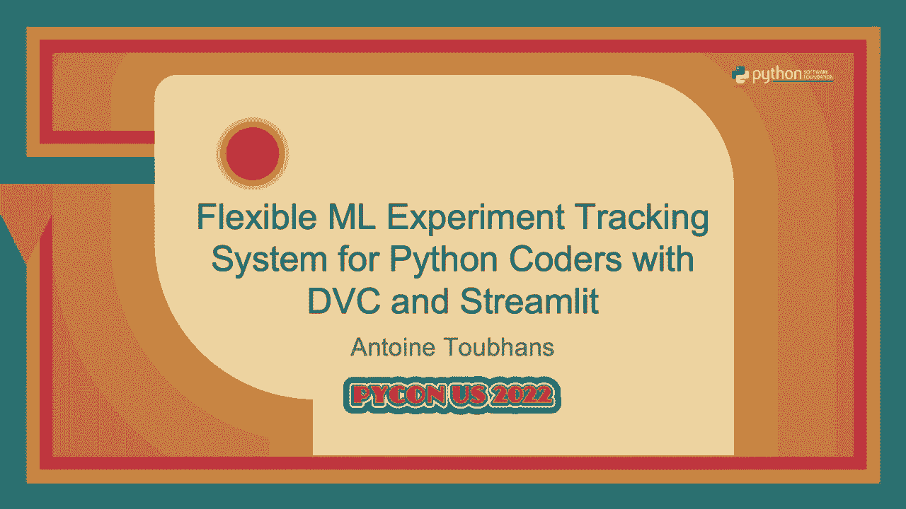
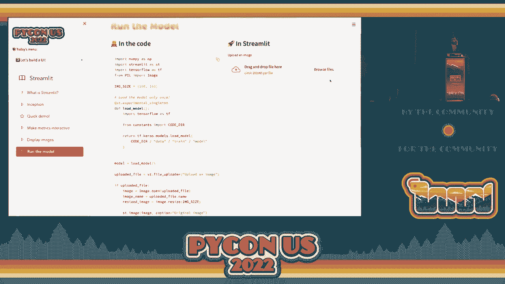
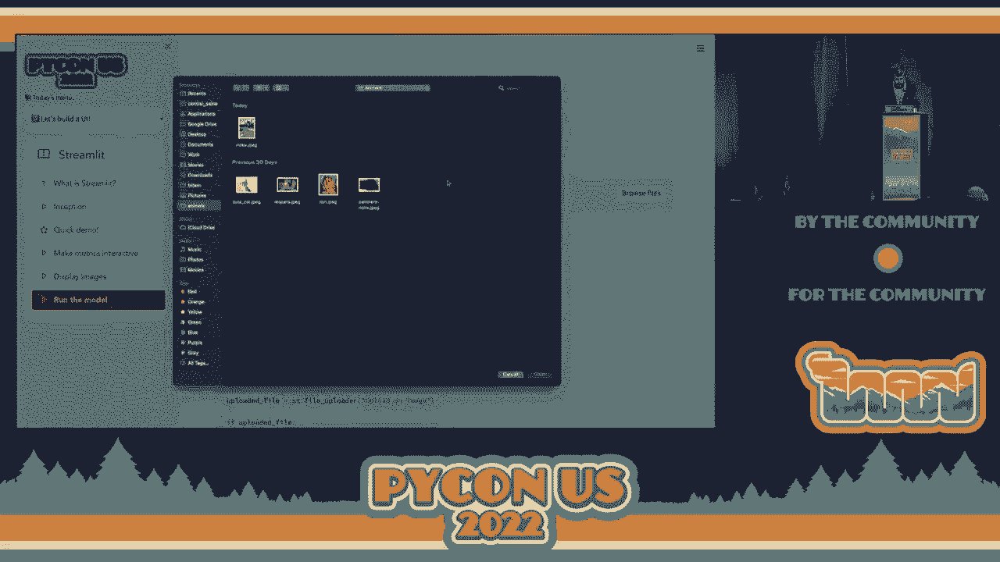
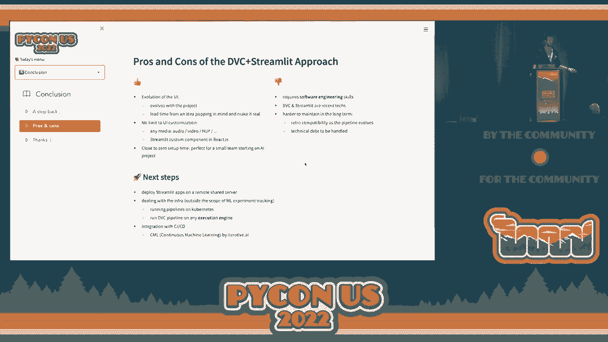

# 机器学习实验跟踪：P21：构建灵活的ML实验跟踪系统 🧪




在本教程中，我们将学习如何为Python程序员构建一个灵活、可定制的机器学习实验跟踪系统。我们将结合使用DVC（数据版本控制）和Streamlit这两个强大的工具，来管理实验数据、确保可重复性，并创建交互式可视化界面来分析和比较实验结果。

---

## 1. 机器学习项目中的实验跟踪 🔄

在典型的机器学习项目中，工作流程是一个循环：你拥有数据，尝试训练模型，评估结果，然后根据反馈调整数据、模型或参数，并再次进行实验。这个过程需要有效的实验跟踪。

一个优秀的实验跟踪系统应具备以下核心功能：
*   **记录**：跟踪每次实验所使用的数据、代码和参数。
*   **比较**：能够轻松地比较不同实验的结果。
*   **组织**：随着实验数量增加，需要有效组织以便搜索。
*   **可重复性**：能够精确复现成功的实验。
*   **协作**：便于在团队中分享实验知识和成果。

市面上有许多集成的解决方案（“单体”方案），但它们往往不够灵活。本教程将展示如何利用Python生态中的模块化工具，构建一个完全可定制的系统。

---

## 2. 示例项目：猫狗图像分类 🐱🐶

为了演示，我们将使用一个经典的图像分类任务：区分猫和狗。这个示例基于TensorFlow教程，数据集包含约3000张图像。

一个基础的训练管道通常包含以下步骤：
1.  **下载数据集**
2.  **准备数据集**（如划分为训练集、验证集和测试集）
3.  **在训练集上训练模型**
4.  **评估模型**以获得性能指标

运行一次实验涉及几个环节：
*   **设置实验**：定义模型、数据和参数。这可以通过代码或配置文件（如`params.yaml`）来完成，并用Git进行版本控制。
*   **运行管道**：按顺序执行脚本。手动操作容易出错。
*   **保存结果**：保存模型权重、指标文件等输出。
*   **跟踪实验**：记录实验的元数据（用了什么参数、数据、代码版本）。

对于后三个环节，我们需要更好的工具。

---

## 3. 引入DVC：数据与管道版本控制 📊

DVC（Data Version Control）是一个Python库，用于跟踪Git无法有效处理的大文件（如数据集、模型）。它的工作原理是用小的元数据文件替代大文件，这些元数据文件则由Git管理。

**核心命令示例**：
```bash
# 跟踪大文件，类似 git add
dvc add dataset/
git add dataset/.dvc
# 推送数据到远程存储
dvc push
```

DVC的一个强大功能是**可重复管道**。你可以在一个YAML文件（如`dvc.yaml`）中定义数据处理阶段。

**管道定义示例 (`dvc.yaml`)**：
```yaml
stages:
  prepare:
    cmd: python src/prepare.py
    deps:
      - src/prepare.py
      - data/raw
    outs:
      - data/prepared
  train:
    cmd: python src/train.py
    deps:
      - src/train.py
      - data/prepared
    params:
      - train.epochs
      - train.lr
    outs:
      - model.pkl
    metrics:
      - scores.json:
          cache: false
```

运行整个管道只需一条命令：
```bash
dvc repro
```
DVC会自动解析依赖顺序，并利用缓存机制：如果某个阶段的输入未变，则跳过该阶段以节省时间。

现在，运行实验的步骤简化为：
1.  **设置**：修改`dvc.yaml`或`params.yaml`。
2.  **运行**：执行`dvc repro`。
3.  **保存**：DVC自动跟踪输出数据，使用`dvc push`保存到远程。
4.  **跟踪**：实验的元数据（`.dvc`文件）被Git记录。

然而，通过`git log`查看实验历史并不直观，且机器学习实验常是非线性的（尝试多种参数组合）。DVC的**实验（experiments）**功能解决了这个问题。

你可以使用`dvc exp run`来运行新实验，并覆盖特定参数：
```bash
dvc exp run --set-param train.lr=0.01
```
使用`dvc exp show`可以清晰地查看所有实验及其指标、参数：
```bash
dvc exp show
```
这提供了强大的命令行实验跟踪能力。

---

## 4. 引入Streamlit：构建交互式Web应用 🎨

虽然DVC在命令行中能很好地跟踪数据，但在可视化和交互比较方面有所欠缺。这时就需要Streamlit。

Streamlit是一个用于快速构建数据Web应用的Python库。你只需编写Python脚本，就能创建丰富的交互式界面，无需前端知识。

**基础用法示例**：
```python
import streamlit as st
import pandas as pd

# 显示文本
st.title(‘我的实验看板’)

# 显示数据框
df = pd.read_csv(‘predictions.csv’)
st.dataframe(df)

# 添加交互控件
threshold = st.slider(‘选择置信度阈值’, 0.0, 1.0, 0.5)
filtered_df = df[df[‘confidence’] > threshold]
st.write(f’高于阈值的数据量：{len(filtered_df)}‘)
```

你可以轻松构建应用来：
*   **调查模型**：例如，滑动滑块查看模型在不同置信度下的预测样本。
*   **测试模型**：上传图片，实时查看模型预测结果。

Streamlit让创建自定义分析界面变得异常简单。



---



## 5. 强强联合：DVC + Streamlit 🚀

现在，我们将DVC的数据跟踪能力与Streamlit的交互可视化能力结合起来，构建一个完整的实验跟踪系统。

### 5.1 实验总览应用
这个应用类似于`dvc exp show`的图形化版本，但功能更强大。

**核心代码思路**：
1.  使用DVC的Python API获取所有实验的元数据。
2.  使用Streamlit将数据展示为可排序、可过滤的表格。
3.  添加图表，如绘制“准确率 vs. 训练轮数”来可视化趋势。

**获取实验数据的关键代码**：
```python
from dvc.repo import Repo

repo = Repo(‘.‘) # 初始化DVC仓库对象
experiments = repo.experiments.ls(all_commits=True) # 获取所有实验
# experiments是一个包含提交哈希和实验信息的字典

# 获取某个特定实验的详细指标和参数
exp_metrics = repo.experiments.show(revs=[‘exp-123abc‘])
```

### 5.2 实验对比（Diff）应用
这个应用用于比较两个不同实验的预测结果，例如找出模型预测不一致的样本。

**核心代码思路**：
1.  提供下拉框让用户选择两个要比较的实验（提交哈希）。
2.  使用DVC的`dvc.api.open()`函数读取存储在特定实验版本下的预测结果文件。
3.  比较两个预测结果，高亮显示差异。

**读取特定版本文件的关键代码**：
```python
import dvc.api

# 在修订版本 ‘exp-a1b2c3‘ 下打开文件
with dvc.api.open(‘predictions.csv‘, rev=‘exp-a1b2c3‘) as f:
    df_exp1 = pd.read_csv(f)
```

结合这两个应用，你的团队就拥有了一个功能强大且完全可定制的实验跟踪与协作平台。

---

## 6. 总结与展望 📈

在本教程中，我们一起学习了如何构建一个灵活的ML实验跟踪系统：

1.  **识别需求**：我们明确了实验跟踪在ML项目循环中的核心作用：记录、比较、组织、复现和协作。
2.  **使用DVC**：我们利用DVC进行数据和管道的版本控制，通过`dvc.yaml`定义可重复管道，并使用`dvc exp`系列命令在命令行中高效管理和跟踪非线性实验。
3.  **使用Streamlit**：我们借助Streamlit快速构建交互式Web应用，用于可视化实验结果和创建模型调试界面。
4.  **整合方案**：我们将两者结合，通过DVC Python API获取实验数据，并用Streamlit构建自定义的实验总览和对比应用，从而实现了强大的图形化跟踪与协作功能。

**这种方法的优势**在于**极高的定制性**和**极低的初始设置成本**。你可以根据团队的具体需求设计任何界面。但需要注意的是，它要求团队具备一定的软件工程能力来开发和维护这些代码。

**下一步**，你可以考虑：
*   **部署Streamlit应用**：使用Streamlit Cloud等服务将应用部署到线上，方便所有团队成员（包括非技术人员）访问。
*   **集成CI/CD**：利用DVC的CML（Continuous Machine Learning）等工具，将实验训练集成到GitHub Actions等CI/CD流水线中，实现自动化测试和报告。



通过这套由模块化工具构建的系统，你能够为机器学习项目打造一个透明、高效且适应自身工作流程的实验管理环境。

---
*教程内容基于Antoine Toubhans的演讲《灵活的ML实验跟踪系统，适用于Python程序员》整理。代码示例可在相关仓库获取。*