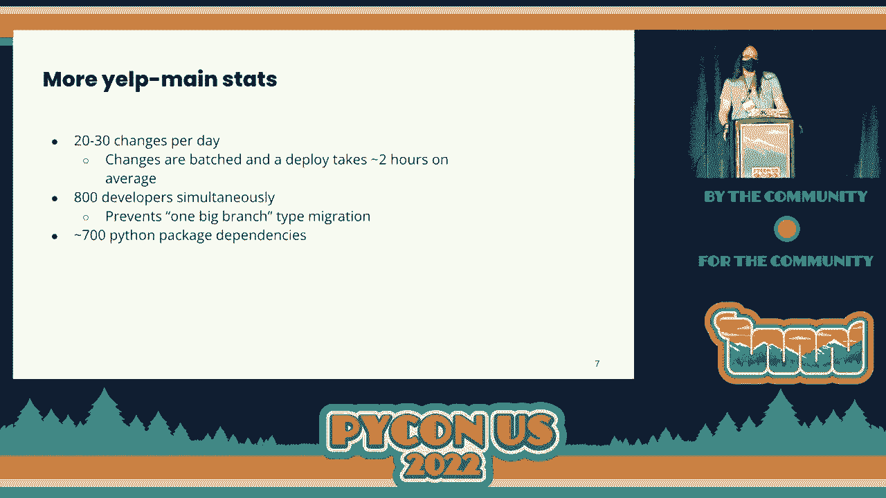
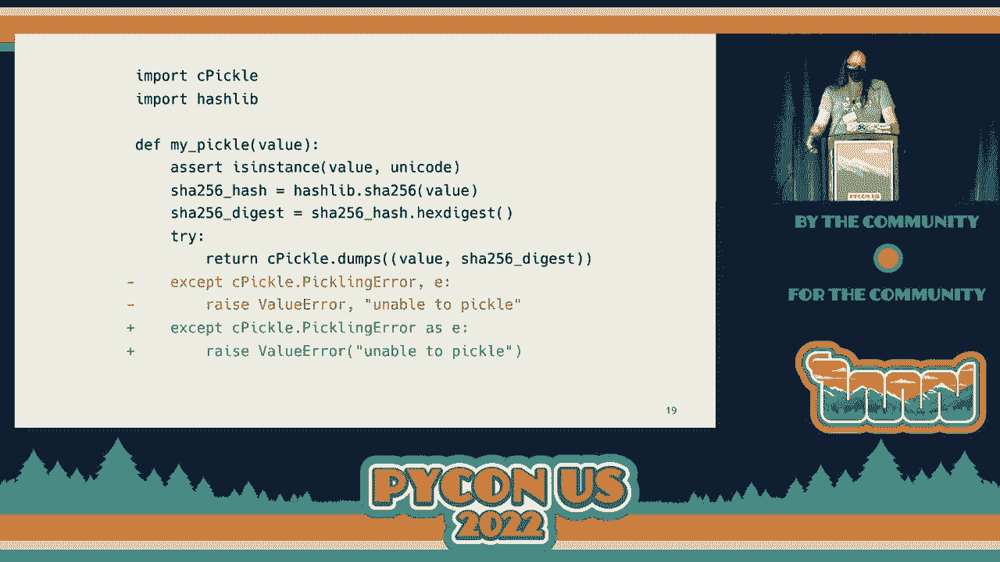
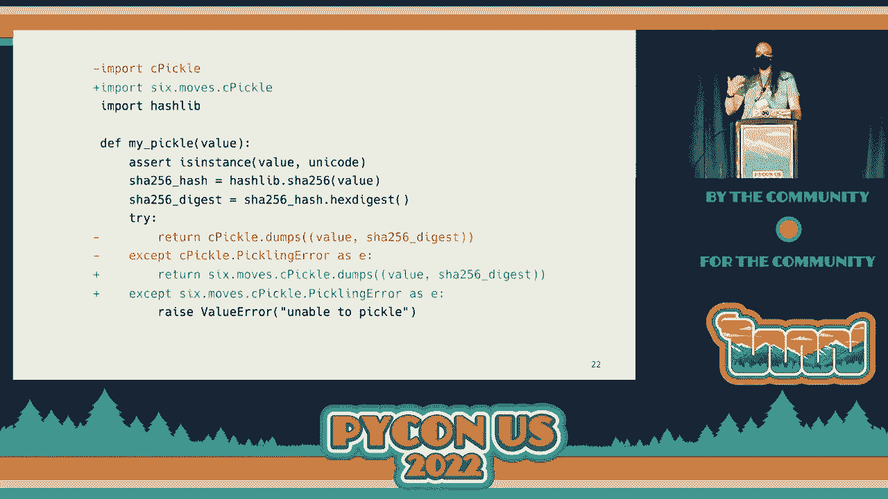
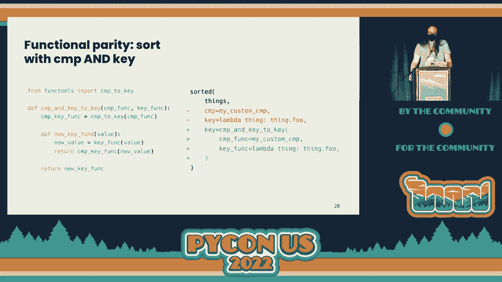
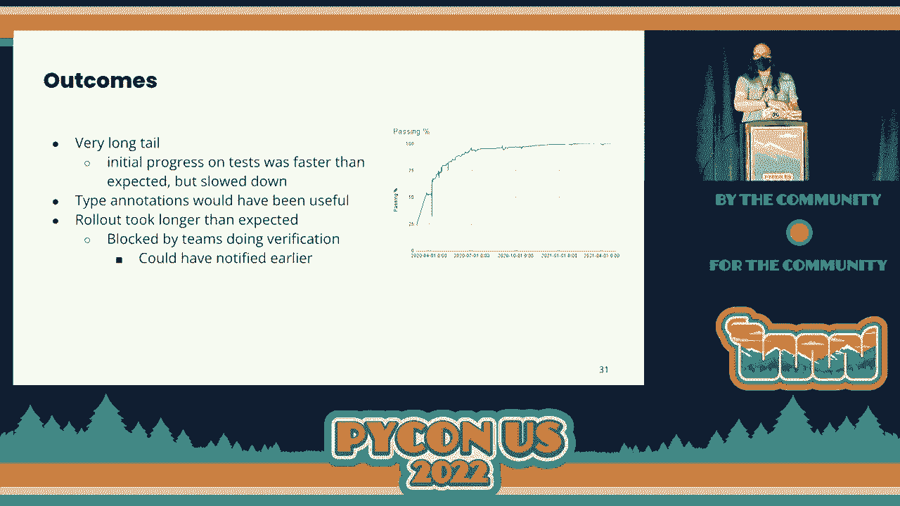
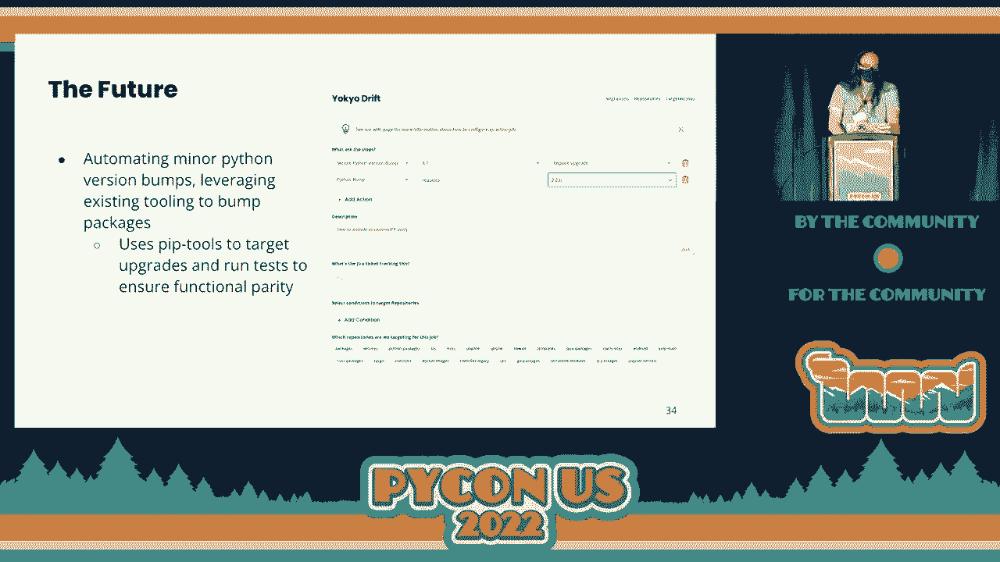

# P23：演讲 - 本杰明·巴雷托 _ 我们是如何在不打断开发的情况下迁移 3.8 百万行 Python 2 的 - VikingDen7 - BV1f8411Y7cP

好的，非常好。

好的，感谢您参加本次会议的最后一个演讲。我们有本杰明·巴雷托，本杰明·巴雷托为我们展示他是如何在不打断开发的情况下迁移 3.8 百万行 Python 2 的。接下来请你，本杰明。你好，我是本·巴雷托，我是 Yelp 的一名软件工程师。

我们将直接进入主题。所以先说一下我自己。我在肯塔基州的路易斯维尔长大，或者如果你不是那里的话，可以叫路易斯维尔。我上了乔治亚理工学院，2014 届。我获得了计算机科学的学士学位。毕业以来，我在 Yelp 工作了将近八年。

我在核心服务团队工作，我们负责很多后端基础设施的事情，比如工具、测试运行器等等。我们也专注于 Yelp 的许多 Python 基础设施。这包括我们的 PI PI 服务器，以及用于 Python 的许多基础库。如果你想联系我，我的 Twitter 是@benbarretow，我的 GitHub 是 github.com/benbarretow。

首先，我来自 Yelp，在 Yelp，我们专注于将人们与优秀的本地企业连接起来。

为此，我们的代码需要正常工作。那么我们来谈谈 Yelp 主系统。这是我们今天关注的代码库的名称。它是我们的单体系统。这是 Yelp 最初的代码库。我们后来转向了面向服务的架构，但它依然存在，并且仍然有大量重要的代码在其中。

那么 Yelp 主系统在我们的生态系统中存在于何处？这对理解为什么我们需要这样做以及它在迁移时的样子非常重要。这是一个请求流的概述。基本上有两种基本的工作方式。第一，我们从用户那里收到请求。它进入我们称之为路由服务的部分，这是一个反向代理层。

这将进入 Yelp 主系统。而 Yelp 主系统负责创建一个 HTML 页面。它将从自己的数据库获取数据。并可能调用一些独立服务，即我们称之为后端服务的东西。然后它将渲染一个完整的 HTML 页面，最终呈现给用户。另一种方式，这是更现代的处理方式。

请求将会有路由服务，而不是，它将进入我们称之为前端服务的部分。这是与 Yelp 主系统不同的服务，负责创建那个 HTML。然后前端服务将调用一些后端服务以获取数据。接着，它可能还会调用内部 API，这部分是 Yelp 主系统所暴露的。

一个 RESTful JSON API，用于获取其数据库中的数据。因此，不论你怎么切分，Yelp 主站对于用户获取我们的网页来说都非常重要。那么我们来深入探讨一下它是如何结构化的。首先，Yelp 主站有一个网络服务器。这个网络服务器负责处理所有的网络流量。

这被称为六个不同的网站。所以我们有 www.yelp.com。这是我们面向消费者的网站。如果你曾经使用过 Yelp，那可能就是你所看到的。Biz.yelp.com 是我们面向商家的网站。正如我提到的，还有内部 API。总的来说。

这些有超过 2000 个端点。所以这是大量的逻辑和代码。除了网络服务器，还有我们称之为批处理的东西。这些只是后台进程。由于历史原因，它们被称为批处理，但这就是我们使用的术语。我们有超过 800 个独立的批处理，它们都作为独立进程运行。

所以，网络服务器是一个单一的进程，每个批次是一个独立的进程。它被用于各种事务，但任何我们不想在网络请求期间处理的事情，比如时间密集型报告、数据填充，可能还有账单，实际上就是在正常网络请求期间无法完成的任何事情。

关于我们如何在 Yelp 主站上开发，我们每天大约有 20 到 30 次变更。它们只是一个分支。因此，一个分支可以很大，也可以很小，但这就是我们衡量的方式。我们将这些变更批量处理成我们所称的推送。所以这个推送或部署平均需要大约两个小时。

这部分原因是我们批量处理，因为这需要很长时间。否则，白天就没有足够的时间来推送所有的代码。大约有 800 名开发者同时在这上面工作，这也是为什么这里有很多技术的原因。

不一定在较小的代码库上使用。这确实防止了一种大分支类型的迁移。我们还有大约 700 个 Python 包依赖，这绝对不是你能得到的最大数量，但比典型的 Python 应用程序要多得多。

此外，它还相当老旧。第一次提交是在 2004 年。你可能还记得，当时“嘿，大家好”还在排行榜上。它是在 2003 年发布的，但仍然在流行。

正如我在标题中提到的，它包含 380 万行 Python 代码。还有其他东西，比如 JavaScript 和 CSS，如果打印出来的话，大约相当于 63 本《战争与和平》的长度，这是一部著名的长篇历史小说。

小说。而且它大约有 100,000 个测试，这个数字真是难以想象。所以我算了一下，完整运行一次需要多长时间？大约需要 35 个小时。我们实际上并不这样做。我们有一个并行测试运行器。但那 35 个小时的总时长大约相当于看三遍《指环王》的加长版。

《指环王》三部曲，我相信你们中的一些人以前做过这件事。

所以绝对是一个马拉松。你可以这样做三次。但这都是非常重要的。我们有很多用户。我们有很多人使用这些东西。我们每月大约有 3300 万的活跃用户，这大约是秘鲁的总人口。所以让我们谈谈实际的迁移，以及我们需要做什么。

为什么我们要这样做，首先？这对大多数人来说似乎是显而易见的，但还是值得一说的是，我们知道我们使用的重要库将会停止支持 Python 2。像 PyTest 和 PIP 这样的东西，已经停止支持 Python 2 了。

能够使用更新的语言特性真的很不错。这是一种开发者生产力的提升。关于我们需要做什么才能实现这一点，我们知道在这个项目期间不能停止正常开发。我们不能仅仅说，嘿，我们不打算发布任何新特性。我们不打算增加收入。

这根本不是一个选项。此外，重要的是，为了确保这一切安全，我们需要确保所有更改都能安全回滚。所以我们不能说，好的，我们要进行这个重大更改。如果出现故障，我们无法回退。我们不想让他们处于这种境地。所以让我们谈谈这个过程的不同阶段，以及时间线是什么样的。

所以第一步基本上是确保代码能够在 Python 3 下解析。这实际上是一个非常简单的任务。在这方面的实际更改很少。所以我们花了大约两周的时间。接下来是可导入性。这基本上是确保我们实际上能够在 Python 3 下导入代码。

这看起来有点微不足道，但实际上是相当多的工作。我们花了大约两个月的时间。但最大的一个，毫无疑问，是第三阶段。我称之为功能平衡，这花了我们大约一年。这基本上是确保代码的工作方式是相同的。

我稍后会详细讲述这一点。然后最后，一旦我们真正有信心我们的代码在 Python 2 和 3 下都能正常工作，我们就进入了推出阶段，实际将其推出到生产环境。这花了我们大约两个月。因此在实际跟踪这项工作方面。

你必须了解需要做什么，并确保人们之间的协调和其他相关工作。所以这就是我们为每个文件所做的。这就是我提到的可解析性，这实际上是任务中的一个非常小的部分。所以这简直就是，你只是尝试解析所有文件。你只是简单地在上面运行 Python 3。解析得好吗？

如果没有生成工单，那就像是单次处理。对于可导入性，我们做的是导入所有文件，然后检查导入错误的堆栈跟踪，看看导致这个导入错误的最后一个实际在我们代码库中的文件。然后将其传递给 unique-c，接着排序。

然后你会看到导致导入错误的主要文件。你大概每周运行一次那个脚本，生成工单，然后处理这些工单并修复它们。对于功能上的一致性，大部分工作都是运行测试。因此我们已经有一个测试运行器，可以根据回溯将所有测试失败分组。

因此，我们基本上定期运行测试。我们几乎每天都运行一次。然后我们会生成工单，记录顶端的问题，然后从那一池中选择一些东西。所以在这方面一个重要的工具是 Python modernize，有些人可能熟悉，也可能不熟悉。

Python modernize 是一个很棒的工具。这是一个我们使用的开源工具，它将仅支持 Python 2 的代码转换为兼容 Python 2 和 3 的代码。由于我们想确保这个版本的回滚是安全的，我们需要确保它是兼容的。我们不能仅仅使用 2 到 3。即使 Python modernize 实际上使用了 lib2 到 3。

它利用了 lib2 到 3 中的许多功能来让你达到那个状态。一些 2 到 3 的修复实际上是完全兼容的。但其中一些使用 6 作为兼容层。实际上还有一个类似的工具叫做 Python Futurize，它使用 future。我们已经在使用 6，所以决定使用 modernize。

除了你的特定设置之外，并没有特别的理由去选择其中一个。就它实际所做的而言，它修复了一些语法变化，修复了一些标准库的导入变化，以及一些行为变化。所以我将逐一讲解我在右侧的示例中的每一个变化。

首先是在 Python 2 中，你从 Q 模块中导入 Q 对象，Q 类，它是大写的。但在 Python 3 中，你是从小写的模块名中导入它。因此，你不能同时从两者中导入，所以使用这个 6 的 shim 来导入那个类。另一个是值、方法，以及 items 方法和 keys 方法。

这些在 Python 3 中都返回迭代器而不是列表。因此，为了兼容，你必须将它们包装在列表中，且这会自动完成。同样，iter items 方法、iter values 和 iter keys 在 Python 3 中被移除了，因为它们现在是多余的。因此，现在有一个 shim 用于 6，并自动用该 shim 替换常规方法调用。

最后还有一个语法更改，以前你可以这样引发异常，给出异常类和参数的逗号。但现在不再支持了，所以它会为你构造异常。接下来我们来谈谈在这个迁移过程中使用的一些工具。

所以我们使用 pre-commit。Python modernized 实际上是一个 pre-commit 钩子。pre-commit 非常好，因为它允许我们运行所有这些 linter 和代码修改，确保它们在新分支上运行。所以我们确保任何新提交的代码都会经过这些代码修改，从而尽可能与 Python 3 兼容。

而且有趣的是，我们实际上在这个仓库中添加了黑色（black）。在这个迁移的过程中，这并没有需要额外的开发时间。它就这样发生了，我们并没有特别考虑，结果也很顺利。所以让我们来看看这段代码。我编写了这段无聊的代码，它可以帮助我们逐步了解这个过程。

迁移以及每个阶段的样子。因此首先是可解析性，正如我提到的。在这种情况下，你基本上只需运行——我们运行了 Python modernized。这修复了一些语法错误。正如我提到的，有对引发语法的更改，也有对接受语法的更改。你以前可以说接受异常和一个绑定的变量名。

这个例外被移除了在 Python 3 中。因此你现在必须说 as。

而 Python modernized 会为你修复这些问题。

就这样。这就是可解析性。所以可导入性基本上又是——同样使用 Python modernized。我们主要是分块进行，以确保回滚的安全性。我们希望确保我们的更改相对较小。同时，我们还需要修复我们的包导入性。

所以很多内容都是将那些包升级到现在支持 Python 3 的版本。有些我们不得不替换，因为它们从未支持 Python 3。我们通常会使用某种分支或类似的东西。而有些则需要重构，因为它们也未曾支持 Python 3。

我们想，实际上我们并不太需要这些。我们可以进行重构。然后我们还有内部包。其中一些包还没有 Python 3 的支持。它们太旧了。因此我们必须升级它们以支持 Python 3，然后在 Yalt main 中进行更新。大部分工作只是运行 Python modernized。

现在我们可以导入这段代码。其中一件事是 C pickle 在 Python 3 中被移除，合并到 pickle 模块中。所以有一个部分是这样。Python modernized 正好解决了这个问题，以及所有的导入和引用。

所以功能平等是接下来要关注的。

功能平等主要是首先，我们构建了一个并行的虚拟环境。我们只是做了一个基于 Python 3 的第二个虚拟环境，使用大部分相同的包。我们必须过滤掉一些主要是向后兼容的东西，这些东西可以在 Python 3 中安装。

像类型和特性这些在 Python 3 中是我们不需要的。这也导致我们在 Python 3 下进行开发。这样人们可以使用 Python 3 验证他们的代码在我们切换后是否能正常工作。接下来，我们想让我们的测试通过。正如我提到的，我们需要修复 100,000 个测试，这真是一大堆。

我们仍然使用了很多现代化的 Python 工具。其中一些是可以自动化的。正如你在右侧看到的，这又是我们的代码。其中一件事是我们在使用 Python 2 的内置 Unicode，这在 Python 3 中不存在。因此，我们使用了一个 6-shim 来解决这个问题。这真不错。

但房间里的大象总是文本和字节。在 Python 2 中混合这些是非常容易的。所以我们必须在 Python 3 中修复这些问题。主要依赖于测试。还有其他一些棘手的事情，比如双下划线布尔与双下划线非零。在 Python 3 中是双下划线布尔。

用于 if 语句的真值性。这是如何自定义 if 语句的真值性。在 Python 2 中，它是双下划线非零。因此，有一些自定义类定义了双下划线非零，但没有定义双下划线布尔。而这很令人困惑，因为它在 if 语句中通过了。

或者在你预期时没有通过 if 语句。所以你必须确保找出实际错误所在。修复是简单的，但实际上找出错误更困难。类似于元类，这实际上可以通过 Python modernize 来修复。只要你使用元类的任何时间。

这个函数使用了一个 shim，以确保它在 Python 2 和 Python 3 中都能正常工作。但行为可能会让人困惑。但我们的目标始终是确保 Python 2 和 Python 3 之间的行为一致性，以确保在我们向前推进时一切正常工作。我们还必须处理的另一件事情是。

事实是我们有这些使用 pickle 的缓存。如果你曾经需要处理 Python 2 和 3 之间的 pickle，它并不是特别好用。有很多奇怪的陷阱。因此我们决定完全放弃 pickle。所以我们决定切换到 JSON。但我们不想完全破坏我们的缓存。

因为这些缓存对于我们网站的性能至关重要。所以我所做的基本上是开始记录这些 JSON 编码的值。然后我们会在编码后检查这些值的相等性。因此我们基本上确保了 pickle 和 JSON。

编码后的缓存值最终是相同的。一旦我们将它们调整到工作状态，我们基本上会切换到我们所称的混合模式。在这种模式下，我们会尝试读取 JSON 值。如果这不奏效，我们会回退到 pickle，读取 pickle 值，然后再写回 JSON。

然后每当我们写入一个新值时，就写入 JSON。随着时间的推移，如果你等得够久，最终你会主要得到 JSON，然后你可以只使用 JSON。而且有一些东西非常复杂、奇怪的设置，我们就是无法修复。因此我们最终只是使用了一个缓存前缀。所以这些东西在 Python 2 和 Python 之间就是不同的。

另一个我们必须处理的事情是 context lib 嵌套，这在 Python 3 中被移除了。这相对容易修复。它只没有自动修复，基本上我们编写了一个使用 exit stack 的函数来复制接口。我们还用了一点 said 来替换导入和用法。

另一件事是你实际上可能会遇到——你可能对——不太熟悉的 CMP 函数，它曾经在 Python 2 的 sorted 和 list.sort 中使用。所以这主要是——这个关键函数是在——我记不清是哪一个版本的 Python 2，但最终 CMP 函数被移除了。

这两者只是处理排序的略微不同方式，决定如何对事物进行排序。但事实证明，你实际上可以同时使用两者。functools 中有一个 shim 函数可以将 CMP 函数转换为键函数，即 functools 的 CMP 转键，这非常有用。但有时你可以同时使用这两者，而这并没有真正得到支持。

所以我们编写了这个函数，它接受这两个函数，并将其转换为一个新的键函数。它实际上所做的只是调用 CMP 到键的转换。它在传入的值上调用键函数，并将该新值传递给创建的 CMP 到键函数。抱歉，我应该只是——。

所以这就是——这真的很有用。

因为有些情况确实很难进行重构。

所以推出。这是，我认为，最酷的部分。这是我发现最困难的部分。但我们想出了一个应对这种情况的方法，我认为非常有趣。因为我们有这些并行的 Python 2 和 3 虚拟环境，我们实际上能够独立运行某些实例，有些在 Python 2 下，有些在 Python 3 下。

但运行的代码是相同的。我们会使用反向代理层，基本上根据 URL 前缀，转向 Python 3 实例或 Python 2 实例。这使我们能够逐个 URL 前缀进行精细推出。非常棒，因为如果我们在特定前缀上遇到错误。

我们不需要回滚所有内容。我们只需要说，哦，那个前缀有问题。让我们回滚。解决问题后再推出。这非常有价值，因为有些错误只是没有被测试捕获。我们的测试覆盖率还可以，但你永远无法做到 100% 完美。

所以我们能够做到这一点真的很有价值。我们使用一个责任表格进行了协调。六个站点大约有 800 个端点前缀。然后我们对批处理做了类似的处理。因为它们是独立的过程。

我们实际上可以独立地将它们切换到 Python 3。我们也做了类似的责任表格。因此在结果方面，特别是在功能平衡阶段，这确实是一个非常长的尾部。这是——抱歉。这是我们测试失败随时间变化的图表。所以我们一开始测试失败率非常高。

或者说通过率。我们开始时通过率非常低，但我们很快达到了非常非常高的水平。但是最后几个百分点花了更长的时间，因为每次我们做的修复影响较小。类型注解会非常有用。我们考虑过添加类型注解。

在这个项目之前，但我们决定，这本身就是一个庞大的项目。所以我们没有去做。但这会非常有用，尤其是在文本和字节问题上。推出确实比预期要花更长的时间。我们最初的预期是一个月。部分原因是我们被团队阻塞了，进行验证。

这有点是我们的错，没有早点通知他们。因为这种——这个曲线，我们并不确切知道何时会完成。所以我们只是觉得，哦，我们快完成了。

让大家知道这件事。但这有点晚了。最后，我们的速度提升了大约 15% 到 20%，这很好。我们并没有特别追求这个目标。我们只是想让我们的代码在新的 Python 版本上运行，但结果却变得更快。

这非常棒。此外，我们的内存使用减少了约 26%。我认为这两点确实表明，这种基本的维护工作对公司的底线可以产生真实的影响。出于这样的原因进行这项工作是非常有价值的。关于未来。

我们现在正在做的，就是自动化小版本的 Python 升级。我们试图利用现有的工具，这个工具用于升级包。我们基本上使用 PIP 工具进行有针对性的升级，然后运行测试以确保功能一致。这实际上是在运行——它是我们内部的一个工具。并且它现在正在运行。

我们可以进行这些升级，将 Python 版本升级到更新的小版本。这真的很棒。

就这些。我知道没有官方的问答环节，但我在这之后没有其他安排。所以如果你想问我任何问题，我很乐意在走廊里回答。 [掌声]。
