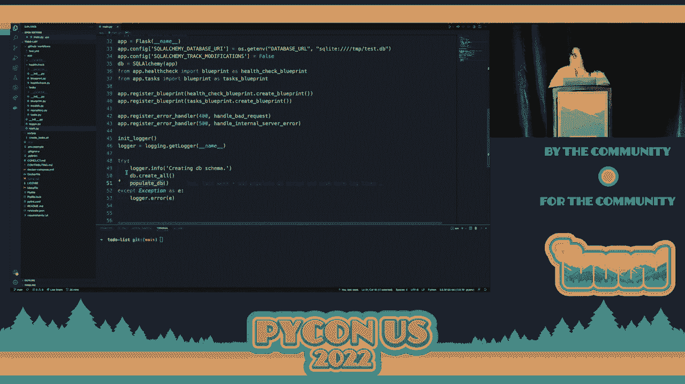
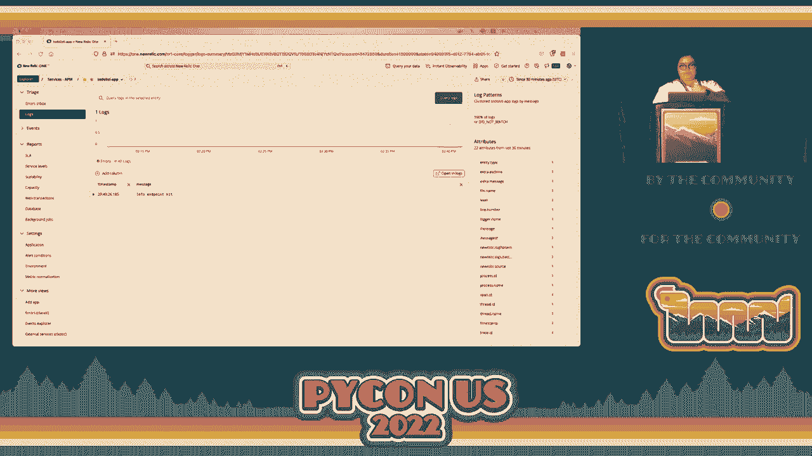
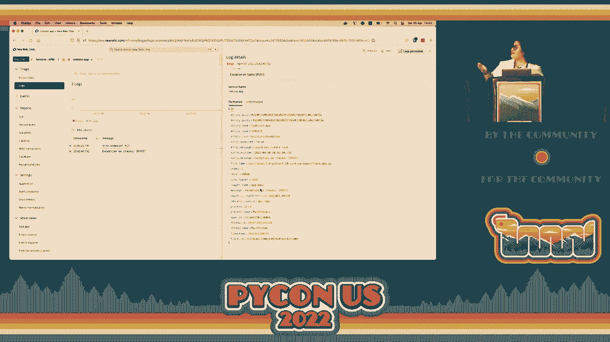
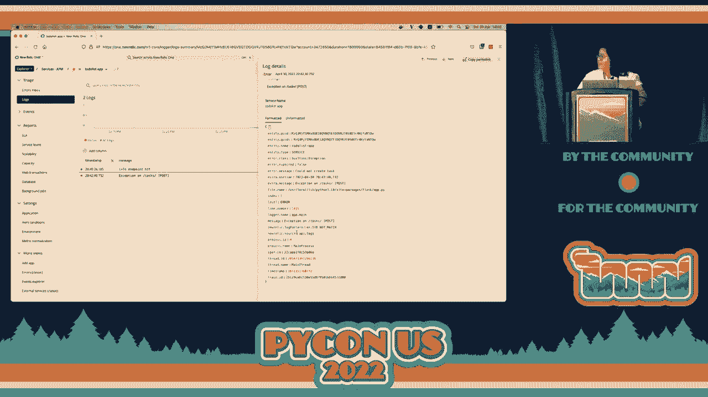
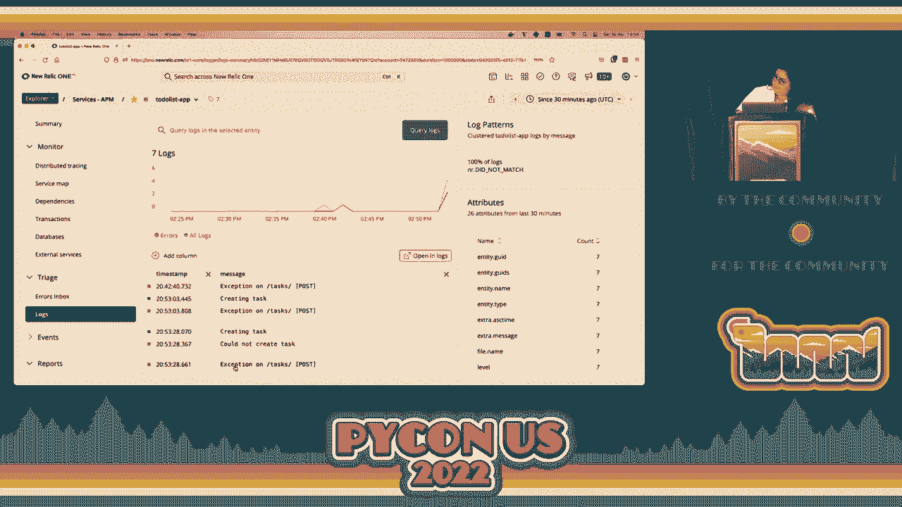

# 可观测性驱动开发：P25：演讲 - 比安卡·罗莎


## 概述
在本教程中，我们将学习“可观测性驱动开发”的核心概念。我们将探讨为什么软件会崩溃、如何通过提前规划来避免生产环境中的问题，并介绍使用APM（应用性能监控）工具和良好日志实践来构建可观测系统的具体方法。课程内容基于比安卡·罗莎（Bianca Rosa）在PyCon上的演讲整理，旨在帮助开发者在问题发生前就能洞察系统状态。

---

## 章节 1： 引言与问题定义 🎯

大家好。本次演讲在355号房间进行，演讲者是来自巴西里约热内卢的软件开发者比安卡（Bianca），主题是可观测性驱动开发。

软件开发的目的是满足用户或使用者的期望。无论是网页加载、数据处理还是机器学习模型输出，软件都在试图满足某种需求。当软件崩溃无法满足期望时，会导致用户挫折和商业损失。开发者通常会进入紧急的问题解决模式。

我们常常在问题已经于生产环境爆发后，才意识到缺乏足够的数据来诊断问题。这会导致高压的“救火”状态。本教程的核心思想是：**我们应该在开发初期就考虑可观测性，以便在生产环境出问题时能快速定位根因**。

---

## 章节 2： 可观测性基础工具 🛠️

上一节我们介绍了提前规划可观测性的重要性，本节中我们来看看实现可观测性的基础工具。

对于以Web为中心的后端开发，可观测性通常围绕两个核心组件：**APM（应用性能监控）工具**和**日志系统**。大多数现代解决方案都同时包含这两者。


以下是市面上一些知名的可观测性工具：
*   **开源/商业工具**：ELK Stack (Elasticsearch, Logstash, Kibana)、New Relic、Datadog、Honeycomb、Grafana Labs、Splunk。
*   **开放标准**：**OpenTelemetry**。这是一个开源的、供应商中立的遥测数据（指标、日志、追踪）收集框架。它允许你将数据导出为标准格式，然后由你选择的工具（如New Relic, Datadog）进行消费和分析，避免被单一供应商锁定。

选择工具时，需要根据你的具体用例、功能需求和偏好（如是否倾向开源）来决定。本教程后续将使用New Relic进行演示，但这仅是出于演示者经验考虑的示例。




---

## 章节 3： APM工具实战演示 💻


在了解了基础工具后，我们现在通过一个具体的示例应用，来看看如何集成APM工具。

我们将设置一个最简单的Flask示例应用，并集成New Relic APM。




**核心集成步骤（代码描述）**：
```python
# main.py
import newrelic.agent
newrelic.agent.initialize(‘/path/to/newrelic.ini’)



from flask import Flask
app = Flask(__name__)

# 你的应用路由和逻辑…
```
以上代码导入了New Relic代理并初始化。集成后，New Relic将自动监控应用中的函数调用、HTTP请求等。

应用启动后，在New Relic控制台可以观察到：
*   **事务（Transactions）**： 所有HTTP请求（GET, POST, PATCH等）及其成功率、响应时间。
*   **服务地图（Service Map）**： 可视化展示应用组件（如Web服务器、数据库）之间的调用关系。
*   **追踪（Traces）**： 对于慢请求，可以查看详细的代码执行路径和每个步骤的耗时。

这个简单的集成能立即提供丰富的运行时洞察，而成本通常只是添加几行代码。

---

## 章节 4： 实施良好的日志实践 📝

仅仅有APM工具可能还不够。当用户遇到一个“内部服务器错误”时，APM可能告诉我们“有一个异常”，但无法直接告诉我们“用户试图创建了一个没有`description`字段的任务”。这时，结构化的日志就至关重要了。

以下是关于良好日志实践的几个核心原则：


1.  **使用纯文本日志消息**： 日志消息本身应是固定的字符串，便于在日志系统中分组和筛选。例如，使用`“Task created”`而不是`f“Task {task_id} created”`。
2.  **利用“额外字段（Extra Fields）”存储变量**： 将动态信息（如`task_id`, `user_id`）作为键值对放入日志的额外字段中。这样既保持了消息的可分组性，又携带了上下文。
    ```python
    # 代码描述：使用Python标准logging库的extra参数
    logger.info(‘Task created’, extra={‘task_id’: task.id, ‘user’: user.email})
    ```
3.  **为每个请求设置唯一标识符（Request ID/Trace ID）**： 这个ID应该出现在该请求生命周期内的所有日志条目中。这让你能轻松追踪一个特定请求的所有相关日志，是问题诊断的利器。
4.  **有意识地使用日志级别**：
    *   `ERROR`： 需要关注的问题。
    *   `WARNING`： 潜在问题。
    *   `INFO`： 生产环境中重要的常规信息（如“用户登录”、“订单创建”）。
    *   `DEBUG`： 仅用于本地开发的详细信息。



许多成熟的Web框架日志处理器（如`newrelic.agent.logger`）会自动为你注入**Trace ID**、文件名等额外字段，极大地提升了日志的可追溯性。


---

## 章节 5： 诊断性能问题实例 🔍

现在，我们将APM监控和日志结合起来，解决一个实际的性能问题。



假设我们有一个批量更新任务的接口，但性能非常慢。通过New Relic的**慢事务追踪（Slow Transaction Trace）**功能，我们可以清晰地看到：
*   一次请求包含了**50次独立的数据库UPDATE操作**。
*   每次更新都伴随一次日志API调用。

**根因分析**：
*   **数据库问题**： 代码使用了循环内逐个更新的模式，而非批量更新。
*   **日志问题**： 同步的日志调用阻塞了请求响应。

**解决方案**：
1.  **优化数据库操作**： 将循环更新改为单条`批量UPDATE`语句。
    ```sql
    -- 伪代码示例
    UPDATE tasks SET status = ‘done’ WHERE id IN (id1, id2, …);
    ```
2.  **优化日志操作**： 将日志处理器配置为**异步模式**。这样主线程在写完日志消息后即可继续处理，由后台线程负责将日志发送到远端服务器，不阻塞请求响应。


通过APM工具提供的详细性能剖析数据，复杂的性能瓶颈变得一目了然，修复方向也清晰明确。

---


## 总结

在本节课中，我们一起学习了可观测性驱动开发的核心思想与实践方法。

我们从**为什么需要可观测性**开始，认识到在开发初期就融入可观测性思维，能避免生产环境出事后的手足无措。接着，我们介绍了构建可观测系统的两大支柱：**APM工具**和**结构化日志**，并通过一个Flask应用演示了如何快速集成APM监控。

然后，我们深入探讨了**良好的日志实践**，包括使用纯文本消息、额外字段、请求ID和有意义的日志级别，这些实践能极大提升故障排查效率。最后，我们通过一个性能问题的实例，展示了如何利用APM提供的详细追踪信息，快速定位并解决数据库和日志调用中的性能瓶颈。


记住，可观测性的目标不是增加复杂度，而是通过增加系统的透明度和可理解性，让你在问题影响用户之前就能发现并解决它们，从而构建出更稳定、可靠的软件系统。