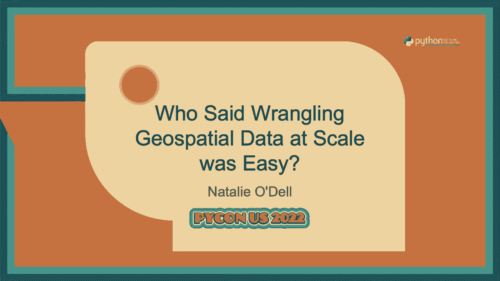
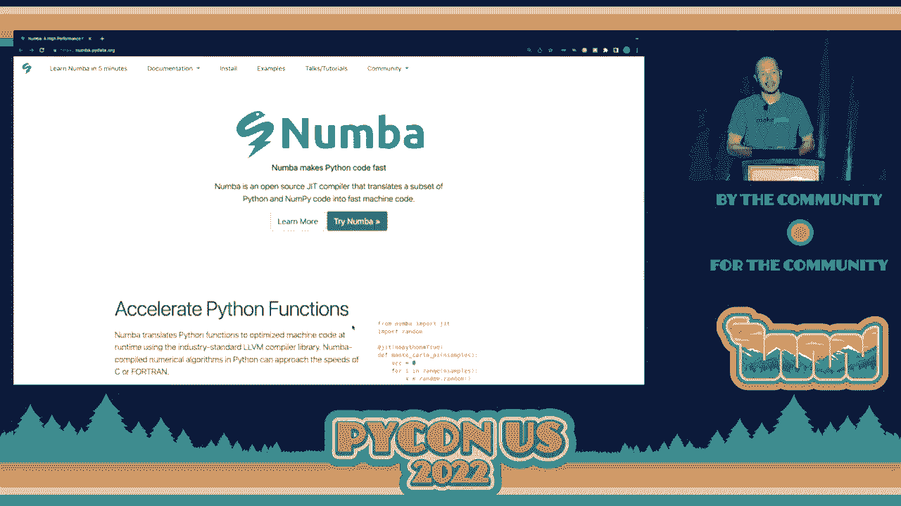
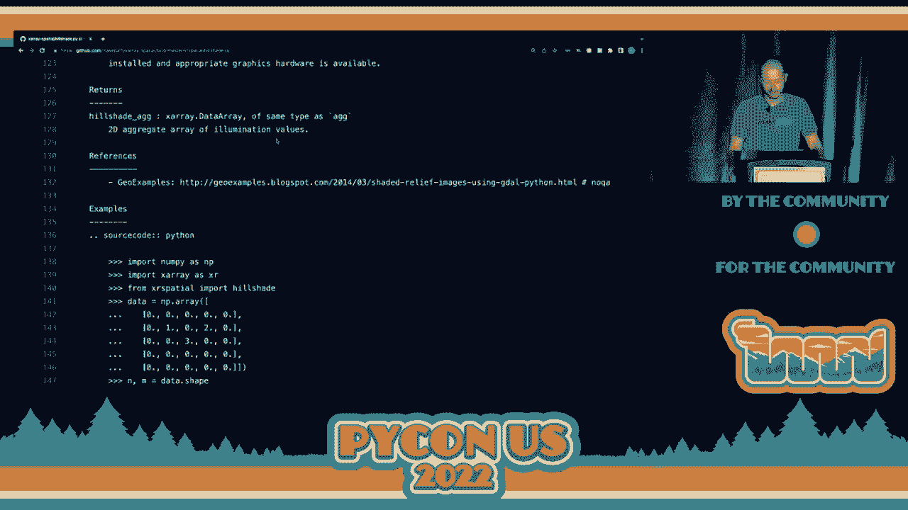

# P27：演讲 - 布伦丹·柯林斯 _ 谁说在规模上处理地理数据很简单 _ - VikingDen7 - BV1f8411Y7cP

\>\> 大家好。让我们欢迎布兰登·柯林斯进行关于谁说地理数据处理在规模上很简单的演讲。

你的特殊数据在规模上处理起来很简单。非常感谢 PyCon 2022 的组织者们，让这次活动得以举行。我很高兴能在这里。这是我的第一次 PyCon。同时，你知道的，这是我第一次 PyCon 演讲，显然也是我的第一次演讲。此外，特别感谢来自自然保护协会的克里斯·斯凯诺，他在 2008 年借给我他的《PyCon 傻瓜书》，并且非常耐心。

当我在写我的一些第一次 PyCon 函数时，我与之并肩作战。我了解到地理空间数据以及在一家名为 Blue Raster 的公司工作时，将空间思维带入组织的力量，该公司利用地理空间数据帮助保护组织更好地实现目标。我在地理空间数据领域建立了自己的职业生涯，得益于许多人的工作。

对于其他人。特别感谢彼得·王、特拉维斯·奥拉芬特、马特·洛克林（他在这里）以及布莱恩·范迪万，他们指导并帮助了我，还让我看到有一些商业模式并不需要将重要工具锁在专有许可证和密钥后面。因此，特别感谢这些人。我想开始时展示一个例子。

这是一个针对地理空间数据的垂直扩展解决方案。我们看到的是克雷特湖国家公园，当我在地图上点击时，我正在生成视域或视线分析，同时旋转太阳的位置进行光线追踪以产生阴影。这得益于使用 CUDA 支持的 GPU，所有代码都是用 CUDA 编写的。

来自我们在 MakePath 维护的一个名为 XRA Spatial 的库。这是一个将少量数据转化为相对计算密集型任务的快速例子，使用的是 GPU。在这个演讲中，我将介绍一些你在进行 Python 地理空间分析时应该了解的不同工具。我的名字是。

布伦丹·柯林斯。我参与开源地理工作大约有 10 年了。我是 XRA Spatial 的维护者，这是一款基于光栅的空间分析库。我也是数据着色器的忠实粉丝，这是一种通用的光栅化管道。我们将稍微讨论一下数据着色器。我也是下方《金雅典圣经》的作者。

对于任何对在圣经上进行自然语言处理感兴趣的人，还有一个新的来自 MakePath 的包，名为 MapShader，旨在使 GIS 网络服务在 Python 中变得简单。我是 MakePath 的联合创始人，这是一家位于奥斯丁的空间分析公司。我们专注于将数据科学生态系统中的更广泛工具引入地理空间专业人士。

我们合作的客户。很多时候，通用数据科学的工具并不是以 GIS 分析师和地理空间数据科学家所认识的方式命名的，我们正在努力弥补这个差距，同时为客户提供服务。如果你想了解更多关于 MakePath 的信息，请访问我们的博客，你可以看到一篇关于。

在大湖国家公园进行 GPU 增强的地理空间分析的博客文章，我刚才展示了。你可以看到更多关于创建这个的内容。那么，谁说大规模处理地理空间数据容易呢？也许是 Sophia Yang。我不知道你是否认识她。她是 Anaconda 的高级数据科学家。她刚刚。

启动了一个 YouTube 频道，上面有一些非常好的内容，她展示了许多数据科学的秘密。所以也许是 Sophia Yang。还有 Natalie Odell，她是 MakePath 的 GIS 分析师。Natalie，你认为大规模处理地理空间数据容易吗？有时。 有时。很酷。所以 Natalie 是。

一个非常有趣的库叫做 Census Park A。而 Census Park A 所做的是，它正在将 2020 年人口普查的地理文件、形状文件转换为一种更适合大规模处理的格式，即 Park A。所以这并不是 Park A 文件本身，而是创建这些 Park A 文件的工具。所以你可以去。

Census Park A 并下载这些，你可以修改这些脚本以供其他用途。但我们。处理了 2020 年人口普查的数据，使其更容易从像 Dask 和 Spark 这样的超大数据系统中消费，以及其他解决方案。

现在，处理地理空间数据困难的原因之一是存在许多不同的格式。所以当我们转向 OGC，开放地理空间联盟时，我们可以看到 OGC 当前支持的标准列表，里面有很多标准。它们适用于许多不同类型的数据，如果你。

参与其中，以选择我应该针对哪些数据格式。所以这次讲座。我希望你在离开这次讲座时对不同类型的地理空间数据应该使用的格式和工具有一个好的了解。这些数据格式大致分为两类。其中一种是针对矢量数据，另一种是针对栅格数据。

在查看 data carpentry。org 时，这是一个很好的学习数据科学的网站。你可以看到对矢量数据的一点介绍。所以，矢量在数据科学中是一个非常复杂的术语，但在 GIS 和地理空间中，它指的是点、线和多边形。因此，矢量数据代表离散现象。所以如果我们考虑一栋建筑，那栋建筑。

可以表示为一个点。它可以表示为一条线，比如建筑轮廓，或者可以表示为一个多边形。这些都是矢量格式。因此，矢量是用于离散现象的。处理矢量数据点、线和多边形的一些工具应该考虑，从一个叫做 pandas 的库开始，很多人。

你熟悉的让我们能够在 Python 中操作表格数据并组织带标签的 numpy 数组的工具。现在又出现了一个库叫做 geo pandas，它会在你的 pandas 数据框中添加一个几何列，这样你就可以使用与 pandas 类似的 API 来处理矢量数据。因此，geo pandas 非常出色，就像 pandas 一样，它是一种。

你正在处理的内存数据结构。因此，矢量侧的另一个库。

我想谈的就是 dask geo pandas。所以 dask 数据框是一个非常好的抽象，可以将 pandas 数据框扩展到多个线程、多个核心或多台机器，它也有这个扩展 dask geo pandas，以便在你的 dask 数据框上提供几何列，这样你就可以使用 dask 抽象与 geo pandas。

是一个相对较新的库。我会说它有一些粗糙的地方，但这些问题正在被解决。如果你要处理无法适应单个机器的矢量数据集，它是一个非常好的依赖项。因此，当我们处理人口普查 parquet 时，Natalie 在编写这些脚本时，我们使用 dask geo pandas 来加载每一个单独的人口普查。

将文件合并成一个大的数据框，然后我们可以将其保存为分区的 parquet 文件。因此，我将多次提到 parquet，我认为处理大规模地理空间数据的第一个要点是 parquet 是一个非常好的朋友。OGC 现在正在发布一个 geo parquet 规范，以便在。

你的 parquet 文件中包含几何信息，有几个原因让你想要使用 parquet 作为格式。第一个原因是你想使用 parquet 作为格式，因为它是二进制格式，而不是基于文本的格式。它支持多种压缩格式，并且以列的方式存储数据，这非常好，并且是可分区的。

因此，这四个因素使得 parquet 成为存储数据的一个非常好的选择，我们知道性能分为两部分。它分为内存和 IO，或计算和 IO。因此，parquet 将处理扩展的 IO 组件，只要我们在 parquet 文件中有一个几何列，我们就能够进行扩展。

在数据上进行向量操作。因此，缩放的第一个教训是选择一个适合快速输入输出的数据格式。它应该是二进制的，支持各种压缩类型。它应该大多数情况下是列存储的，因此如果你只对一列感兴趣，就不必将所有数据加载到内存中。

可以进行分区，这样你可以让单独的进程或工作者加载一个分区，而不是必须加载整个数据。现在，空间数据的另一个领域是栅格。

栅格数据是规则网格。我们知道栅格格式来自于 JPEG 和 PNG 等格式。它们是图像。因此，在地理空间领域，栅格格式主要用于表示连续现象。例如，降雨、土壤类型是常见的。高程通常也以栅格形式表示。来自地理空间领域的一个有趣的老生常谈是我们说栅格。

更快的向量是正确的。因此，很多时候在性能方面的提升可以通过确保使用正确的数据格式来实现。如果你将一个大型的高程数据集从栅格转换为向量，可以做到这一点，但最终会得到非常复杂的向量。每个数据都有许多顶点。

在处理这些时，速度会比较慢。现在，栅格数据有其自身的问题，我们将讨论一些将帮助你的库。我们都知道并喜爱的基础库是 NumPy，它使我们能够分配一个类型数组，这比说 Python 的异构数组工作得要快得多。

Python 列表在这里我们为每个元素进行所有的类型检查。因此，NumPy 为随后的栅格处理地理空间库奠定了基础。但是，NumPy 有一些地方可能比较困难。它的一个问题就是缺乏标签。因此，当你使用 NumPy 数组时，你会发现你做了很多整数索引。

使用 NumPy 数组切片语法。如果你能构建一个立方体，那就太好了。想想一个 3D 数组，其中 x 和 y 是你的地理坐标，也许 z 是你的不同层。这些层可能是 Landsat 图像的波段，或者是来自已进行地理配准的地方的不同数据集。

X 数组将使你能够为这些维度标记并使用字符串而不是整数引用这些维度。这使得你的代码更具可读性，三个月后当你回到一个函数时，你能够理解它的作用。X 数组进行了大量的工作，我们应当对其进行极大的赞誉。

地理社区在推动 x 数组格式和其他像 XAR 这样的格式方面做了很多工作，我们也依赖于它们来处理栅格数据。Make path 决定可以有更多的通用函数。

基于 x 数组对象。我们创建了一个名为 x 数组空间的库，其中包含 x 数组对象的空间扩展。这个库并没有引入任何新的数据结构。它只是一个真正的通用函数集。因此如果我们把 NumPy 视为两件事，nd 数组加上像一些和标准差这样的通用函数，这些函数在 NumPy 数组上操作。

x 数组空间基本上就像空间 ufunks，接受 x 数组数据数组作为输入，并倾向于返回 x 数组数据数组作为输出。有一些函数返回 pandas 数据框，我们可以看到其中的一些。但我们有一个很好的 x 数组空间功能列表，如果你向下滚动一点。

我们可以看到我们支持的一些通用函数类别。因此分类或分箱栅格，想要在栅格上使用等间隔方法进行分箱。焦点分析，我们查看像素周围的邻域，类似于卷积滤波器，但我们有一个通用应用，因此你可以创建自己的。

自定义滤波器以处理图像。热点分析用于识别图像中统计显著的热点。统计多光谱功能，这些都是关于不同波段和影像的组合。因此，如果你获得 Landsat 场景或哨兵场景，你将会有 RGB 波段，但还有近红外和其他一系列波段可以组合。

将这些组合在一起以提取有趣的信息。在多光谱中经典的会是 NDVI。因此，还有许多其他的。当我浏览这些特性时，你会注意到这里有不同的列。因此，这些不同的列对应于函数支持的数组后端。NumPy x 数组数据数组，所以 x 数组是。

将 NumPy 数组封装以提供正确的标签，但它也可以封装其他类型的数组。因此，它也可以封装 Dask 数组。所以如果你使用 Dask 加载一个分块数组，你仍然可以使用那些 x 数组标签，但底层数据是 Dask 数组，而不仅仅是 NumPy 数组。还有 Koopa 数组，Koopa 在 CUDA 和 GPU 之上提供了类似 NumPy 的 API。

所以这真的很方便。你可以将 Koopa 数组放在 x 数组数据数组中，然后通过 x 数组空间函数运行，这很不错。还有 Dask GPU 列。这对应于你正在进行分析的 GPU 集群。我们在栅格上有一些简单的路径查找，还包括接近度分析。

因此，我们以几种不同的方式查看目标像素的距离。有分配方向和距离，即接近度函数，这些目前仅适用于 NumPy 和 Dask 数组。我们仍在实现 Koopa 版本。一些栅格去矢量工具和经典的表面工具，比如坡度和曲率视域。

我之前展示的这些内容在这里。我们有矢量（vector）和光栅（raster）。数据着色器（data shader）是一个很棒的工具，它来自 Anaconda，主要由 Jim Bednar 和 Jim Christ 领导。它是一个通用的光栅化管道。我的意思是从矢量数据转换为光栅数据。那么如果你正在处理高程数据，同时还在处理其他数据呢？

与地块数据结合。地块，比如说社区中某一物业的边界，最好的代表是矢量，而高程则最适合用光栅表示。数据着色器将允许你以智能的方式在两者之间转换，同时还允许你指定聚合函数来处理重叠绘图的问题。因此数据着色器。

着色器是一个非常惊人的工具。我们在 MakePath 中一直在使用它，这里我们可以看到一个例子，显示的是美国 48 个州的人口分布，每个像素代表一个数据点。所以这是一个点的矢量数据集，而数据着色器正在将其聚合到两个不同的像素上，然后应用一个函数进行简化。

将这些值映射到颜色上。这里应用了对数颜色渐变，因此我们能够区分中西部城市，而不会被纽约、休斯敦、芝加哥和洛杉矶淹没。但是数据着色器是你在工具箱中希望拥有的工具之一，以便你可以轻松地将矢量转换为光栅，并进行共同配准数据集。共同配准的意思是确保。

它们的像素对齐。所以如果我加载我的高程数据，然后想要引入地块数据并按地块汇总高程，对吧？我必须将这些地块转换为光栅，但我需要确保它们的像素对齐，这就是数据着色器可以帮助你的地方，通过帮助你重新采样高程数据，将矢量数据光栅化。

将它们结合起来，使你能够进行分析，而无需担心那些有创意的、可能阻碍步骤的内容。现在在扩展中，还有一些其他的依赖关系需要强调，这里 Numba 无疑是其中之一。在 X-ray 空间中，我们大量使用 Numba 进行垂直扩展，而垂直扩展的意思是加快我们的算法速度。我希望能继续使用 Python。

当我需要遍历一堆像素时，我不想退回到 C 扩展。因此，我希望能向你展示 X-ray 空间中的 Numba 函数之一，它使得在不添加 C 扩展的情况下拥有高效代码成为可能。在横向。

对于扩展，Dask 是能够扩展到多个线程和多个 CPU 的解决方案。它理解 Numba 函数，以便将其发送到工作节点，因此这些工具集成得非常好。我提到过 Kupai。Kupai 用于与 CUDA GPU 进行交互，具有类似 Numba 的语法。这里是我们在 X-ray 空间上进行的最近一次合并，其中 Twee，一位工程师。

当前的热点 Kupai 案例实现运行在纯 Kupai 上，Numba 有助于大幅提高在测试此数组大小时的性能。我们获得了 6000 倍的性能提升。这是一个例子，可能还有很多低垂的果实可以在热点工具上做。使用 Numba 及其针对 CUDA 的 JIT 装饰器，我们能够针对。

热点的 GPU 可实现显著提升。我还想强调微软的行星计算机。行星计算机将策划的数据集与可扩展的计算结合在一起。Jupiter Lab 和 Dask、Numba 等开源工具也在其中。我们来快速看一个例子。

我们可以看到从行星计算机提取高程数据并进行名义分析。我所做的是导入数据着色器，导入行星计算机库和 X-ray，选择一些感兴趣的区域，然后使用堆栈目录来访问数据。堆栈是一个很好的开源规范。

这是一个时空资产目录，能够有一个可以读取的 JSON 文件，描述一个多部分栅格数据集。因此，如果你有一个大型数据集，比如 Landsat，有许多场景，你不想逐一遍历每个场景并检查它的边界是否在你的研究区域内。你希望咨询一个索引。这就是堆栈的作用。它是一个你可以放入的索引。

S3 及其他一些格式，读取该堆栈目录，找到你感兴趣的数据。我们已经查询了这个堆栈目录，NASA DEM 针对我们的感兴趣区域。我们正在检索该高程。然后我们能够抓取数据并使用数据着色器和 X-ray 空间。因此，这里我们使用 X-ray 空间计算一个山影图，然后上色。

使用伪高程颜色图进行映射。这是在查询一个非常大的数据集，但它使用堆栈来确定要提取的数据区域。然后使用 X-ray 打开该数据集并重新采样。使用 X-ray 空间计算一个山影图，在特定位置的方位角放置光源。最后用数据着色器进行实际操作。

向数组添加颜色映射。这是一个 X-ray 数据数组。如果你在交互中，这就是一个 X-ray 数据数组。我提到了一点关于堆栈，所以请查看堆栈。围绕堆栈有很多很好的工具。堆栈并不是特定于 Python 的，它只是一个规范，但有 pie stack 和其他实现它的库。

X-ray 空间有完整的用户指南，可以查看不同的工具和操作。这是一个接近性笔记本，我们正在计算点的接近性。我们有我们的起始点，并能够运行 X-ray 空间接近性工具，生成一个网格，其中每个像素是与最近点的距离值。

你可以选择不同的距离度量。你也可以这样做，比如说，计算从线特征的距离。这是线特征的结果。你可以对那个距离进行阈值处理。你还可以做临近分配和方向，我希望值不是到最近物品的距离。我希望它是最近物品的 ID。这就是。

分配是什么。因此，这就是一个分配网格。然后还有方向，你希望，比如说，最近点的方位方向。这些是 X-ray 空间中一些可用的工具。我们确实有一个持续的 CUDA 工作组，正在研究算法。我提到过热点工具。我想快速展示一下，我的时间不多。

左边。查看这些数字函数时 X-ray 空间内部的代码是什么样子。这是坡度的代码。但我将迅速将其更改为阴影图，因为我们在这里看到更多阴影图的演示。所以我们首先有一个使用 NumPy 实现的阴影图，仅使用 NumPy 的 U 函数。很好。我们可以将我们阴影图的 NumPy 版本。

可以扩展到使用 Dask。看看 Dask 是多么简单。在这里有一个边缘情况，我们必须处理重叠的分区。因为我们的数据是分散的，我们可以使用映射重叠。所以我们可以从一个分区提取边缘像素，并从另一个分区提取边缘，这样我们可以计算我们的阴影图，而不会对每个分区产生边缘效应。

我们的栅格。然后我们可以在 CUDA JIT 装饰器上洒上。这使得我们为 GPU 启用了这段代码。所以在这里的这个文件中，大约有 200 行包含一些文档。它处理 NumPy 案例、Dask 案例、GPU 案例和 Dask GPU 案例。所有这些都在 200 行代码内，没有任何 C 扩展，并且性能非常好。所以查看 X-ray 空间。

从中提取最小钢铁函数，并查看将 NumPy 和 Dask 一起实现的示例。总的来说，我非常感激能在这里。这是一个与 Python 社区互动的绝佳机会。我鼓励大家与我和 MakePath 的其他人联系。我总是喜欢去推广这些工具，帮助组织使用它们。

我想我们没有进行问答环节，但非常感谢大家给予的机会，希望在会议上见到你们。[掌声]。

