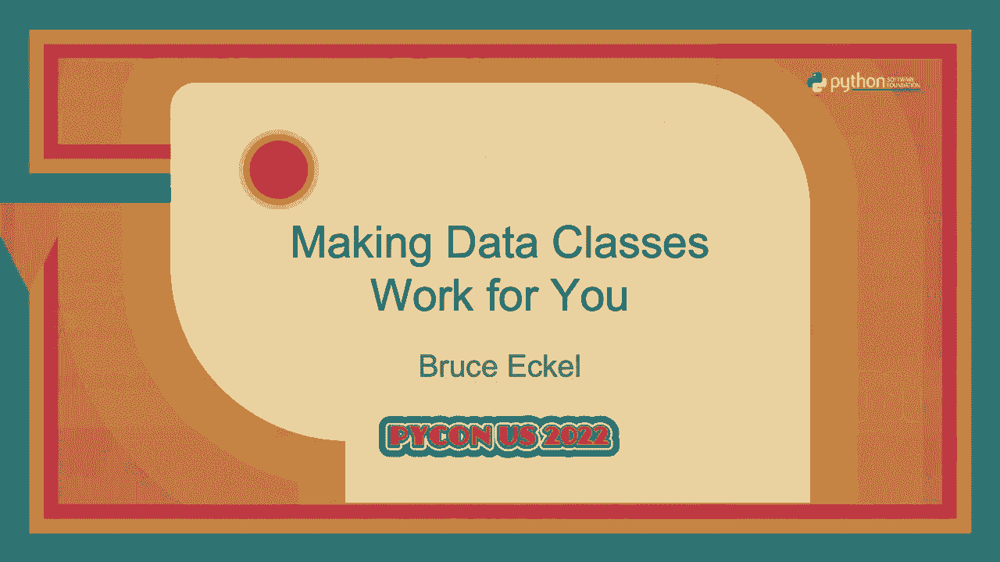
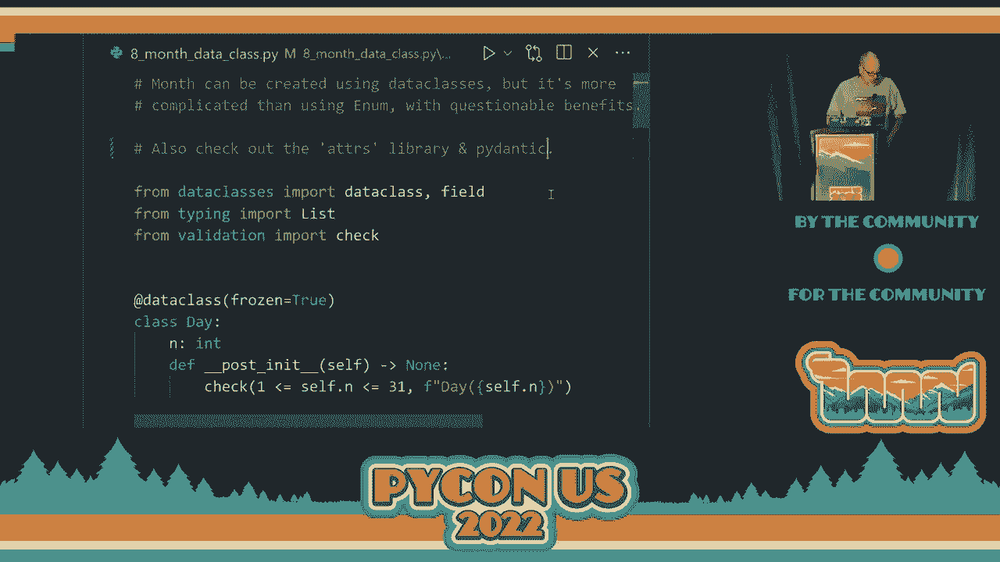

# P28：演讲 - 布鲁斯·艾克尔 _ 让数据类为你服务 - VikingDen7 - BV1f8411Y7cP

\>\> 各位先生女士，我们将由布鲁斯·艾克尔先生进行关于制作的演讲。

数据类为你服务。 \>\> 好的。好的。听起来一切正常。所以所有这些——这实际上是示例。所有的示例都在 GitHub 仓库中。所以这是我的仓库，寻找数据类作为类型。即使你忘记了，也应该很容易找到。这是从——我和我的朋友詹姆斯·沃德做的一个播客，我们采访了某个人。

谁创建了一个——他们称之为 Scala 的智能类型库，某种东西就这样点击了。我在过去几年里大量研究函数式编程，某种东西就这样结合在一起，我希望在这个演讲中你们也会经历这样的过程。因此我将从通常开始，如果你的类型——如果你的类型不正确。

你应该抛出一个异常。但我想展示所有错误，因此我创建了这个小函数来检查表达式，并且有几个错误消息。第二个通常是超出范围。这就是我将其分开的原因。通常你会使用断言来检查事情并抛出异常，但我想看到在示例中发生的所有错误。所以我写了这个。

这不是特别重要，但你需要看到它是什么。让我们把它放大。那么假设我们有一个非常简单的系统，我们想要做某种客户反馈。所以我们将有一个叫星星的东西，其值应该在一到十之间。你知道客户反馈系统是如何运作的。你永远无法真正给它零颗星。

所以它将是一到十，典型的做法是使用一个 int。因此，一个 int 是一个值在负非常大数字到正非常大数字之间的类型。我们想要让它——我们想要调整它以便使用我们的星星，使其在一到十之间。这意味着我们通常会说，好的。

每次我使用这个时，如果你要做对，我需要检查参数以确保它确实在一到十之间。这样我的星星才是正确的。因此我在那里做了，然后这个其他函数无论你在哪里使用它，你都需要检查它是否正确。现在你们中的一些人可能会看着这个说，哦。

但你返回的是星星加五。那么如果你开始时星星是十，那你将返回十五。那么我们只能说我们返回的是一个 int，因为，这就是我们在这种情况下所拥有的。所以我们并不真正知道我们在这种情况下返回的是一个星星对象。

我们只是返回一个整型。所以也许星星加五或星星乘五是可以的。也许这没问题。我不知道。但如果我们希望它是一个适当的星星，那么我们也有问题。所以这真不是一个令人满意的解决方案。此外，每次我有一个新函数或如果我想更改星星的某些内容，我会。

我必须回到这里，确保我检查的每个地方，都需要更改它。所以这些东西分散在各个地方。让我们看看能否换个方式来看待这个问题。我们的问题是什么？

我们传统上如何解决这个问题？传统上，这是对象应该为我们解决的事情之一。关键是封装。因此这里的想法是，在我的构造函数中，首先在 Python 中，传统上我们会说。如果它前面有下划线，那就意味着它是私有的。

你实际上可以进去看看，但如果你想的话，也可以修改它。但这就是我们所称的私有。因此，我们将其设为私有，接下来我们将使用属性装饰器来允许你读取它。但由于没有写入器，因此你只能读取它。挺不错的。我们已经将其封装起来了。

我们把它隐藏在类的内部以及每个我使用的方法中。我需要执行某种前置条件检查，在这种情况下就是你传递给我的星星数量，仍然是一个整型。我会用我的条件函数检查，确保这不是太大。

然后我将执行某种内部操作，之后我会进行后置条件检查，以确保我没有搞砸任何事情。我需要在我为我的类定义的每个方法中都这样做。条件是简单地使用我的检查，如果你传递了一个参数，它就会进行检查。

如果你不传递参数，它会检查 self.underscore number，局部 number 值。好吧，这就是面向对象编程的承诺，我们会有这种封装，我们保持一切安全，而我开始接触它时，正是它真正开始出现的时候，看起来是个好主意，似乎是一个更好的主意。

比我们以前的普通函数要好得多。但这看起来仍然相当杂乱，并且似乎并不好。在这里，我只是展示因为没有设置器，它阻止了变更。你会得到属性错误。这需要很多工作。如果我添加另一个方法，必须确保或者如果其他人来了。

并添加另一个方法，他们必须知道该怎么做，以确保他们进行了适当的前置条件和后置条件检查。所以这并不是特别令人满意。那么让我们看看另一种方法，即数据类。数据类的想法是，我实际上已经忘记了这是什么时候加入 Python 的。谢谢 3。

7 在 3.7 中添加，基本上你能够定义这些类属性。这是类的一个属性，然后是数据类，我想称之为装饰器，但这不是正确的名称。我们做列装饰器。好吧，因为我知道太多语言，术语搞混了。

数据类装饰器接收这些信息并为你制造这个类，它具有许多属性。包括它取这些属性。这些类属性并创建一个构造函数，基于这些属性，按你定义的顺序使用它们，你需要类型注解，以便它知道该如何处理它们。

因此它创建了一个你可以调用的构造函数。你不必给出参数名称，但你可以。而且现在每个字段在对象中都有相同的属性。这样你可以访问名称、编号、深度，然后，哦，我在这里有一个默认参数。因此，在这里我调用了默认值。

使用默认参数。它创建一个魔法方法 `__eq__`，以便你可以比较这些消息对象之间的关系。还有一个替换函数，允许你从一个现有对象创建一个新的对象，并对一个或多个属性赋予不同的值。当你从函数式编程的角度看事情时，这一点很重要。

这与不可变性这个概念相结合，使用得越多，你就越喜欢它。因此我们稍后会看一下。这些默认仍然是可变的。所以这意味着我不能将它用作字典中的键。如果我尝试这样做，它会告诉我它是不可哈希的。

它不可哈希的原因是因为所有属性都是可变的，并且它构建哈希键的方式是通过所有这些属性来索引字典。因此，如果它们是可变的。这意味着你可以将哈希键放入，并对其进行修改。

当你查找某些内容时，它会生成一个不同的哈希键。因此你无法找到该对象。这只是防止了任何类型的哈希系统在所有语言中的标准。如果它是可变的，那就是个坏主意。好的。所以我们还想在这里添加一件事情，即数据类有这个选项。

这允许你说这些对象是冻结的。这意味着生成的构造函数会使所有这些属性都是不可变的。技术上来说，这仍然是 Python，你总是可以对其进行修改。但是，如果你试图修改这些东西，你会收到一个冻结实例错误。它会告诉你。

哦，你不能这样做，因为你说这个应该是冻结的。因此现在我们有了一些东西，这与函数式编程的做法更接近。我们稍后会看到这带来的好处。我们看到的一件事是，我们能够将对象用作。

我们的哈希表，因为如果它是不可变的，那么它将自动创建双下划线哈希函数。所以它对此很满意。因此，我们可以将其用作字典中的键，这里我们进行查找。好吧。在函数式编程中，我很长一段时间感到困惑的事情之一是我听到的一个短语，我不知道，可能是卢卡·卡尔德利（Luca Cardelli）或者其他某个人，早期类型研究者之一。

早期的类型研究者说，类不是类型。我不太明白这是什么意思，但在函数式编程中，他们经常谈到这一点。你有时会听到的一个短语是类型是一组值，这对我来说要容易得多。它只是定义一个有限值集合的一种方式。

你尝试做的事情之一，嗯，功能编程中你做的几件事情之一是使所有东西都是不可变的，这样你就不必考虑保护数据。默认情况下，它是受保护的，因为你不能改变它。因此，这简化了一切。你不必在数据周围有一堆方法来保护它。

你可以说，这是我的数据。你不能改变它，所以你可以读取，但不能修改。一切都很安全。你通常希望做的另一件事是让不可能的值不可表示。因此，在我们这个星体的例子中，我们想要做到的就是将 1 到 10 以外的任何值视为不可能的值。

所以我们将开始说，好的，这是我的星体类，它是一个数据类，不可变的。这里是星体的数量。然后你从数据类中获得的另一件事是这个双下划线后初始化函数。因为数据类会接收你的信息并为你生成构造函数。所以可能有某种方式可以去干扰构造函数。

但说“好吧，自动化构造函数”要简单得多。一旦完成，我会运行这个初始化后的函数并检查值。这通常就是你在初始化后所做的。你可能还能用它做其他事情。但它的意图是让你可以检查你刚刚构造的对象的结果。

这里是我检查确保它在范围 1 到 10 内的地方。现在当我有操作星体对象的函数时，请注意它们不再是方法。它们可以是，但把它们视为独立函数要简单得多。

这是接受星体对象并返回星体对象的函数。现在我不必担心在修改它们之前或之后进行测试或其他任何事情。这些都已经处理好了，因为你能够创建的唯一类型的星体对象是正确的星体对象。所以请注意，这里我实际上是返回一个星体对象。

所以当你阅读时很清楚，哦，是的，之前我返回的是一个整数。我可以是一个星星，也可以不是。在这里很清楚，我返回的是一个星星对象，当我在这里执行这个操作时。如果超出范围，构造函数，包括构造过程，会自动发现我是否做错了什么。

所以我想指出的是，这样做是多么简单和清晰，因为在星星类中，我明确地定义了它是什么，我无法创建任何不正确的对象。因此，在程序的其余部分，我甚至不必考虑它。这就是我希望你最初意识到的那个“啊哈”时刻，哦，我应该这样做。

这样做会让我生活轻松得多，而且会减少各种错误。如果以后有人使用我的星星对象，如果我决定把顶部数字改为五，而不是十，一切都会正常。或者至少如果有问题，它们会立即被发现。我不必在代码中寻找所有这些测试。好的。

现在让我们来看功能编程中我们尝试做的下一件事，那就是组合事物。我们有这些运作良好的小块，然后我们希望能够将它们组合在一起。我在这里要组合的是一个由其他数据类构成的数据类。因此，最终我们要做的就是创建一个人。

这个人将包含全名、出生日期和电子邮件地址。所以也可以将这些做成数据类。因此，全名有一些——所以现在的后处理将检查在初始化后名字的有效性。我将进行的测试之一是确保有两个名字。

因此我将其拆分，如果它大于——让我看看。如果它是——是的，它应该大于一。如果不是，如果只有一个名字，那么就会说：“哦，你必须有两个名字。”然后你会想在这里做各种其他事情。但你可以在这里谈论名字的地方完成所有这些。

一旦创建后，你就不必担心它在其他地方被使用。第二个地方是出生日期。对于其他这些，我只是展示一些检查正在进行。我们稍后会实际查看出生日期。然后电子邮件地址进行某种检查。

现在我们可以从现有的数据类组合一个新的数据类。你会注意到它创建的构造函数要求你传入名字、出生日期和电子邮件地址。因此，获得的内容非常清晰易读。那么——如果我们继续打印，你会看到它作为检查的一部分执行。

这个人构造函数。它调用所有单独部分的构造函数。然后它显示——这也是我之前没有提到的一件事，数据类还会为你生成一个不错的双下划线字符串，所以它会生成一些你通常需要自己做的东西，创建一个新的类以产生可读的字符串输出。

所以你可以看到这也为你生成了这个。好的。所以现在我稍微提到了出生日期。但这是一个有趣的话题，可以深入探讨一下。那么让我们看看——我们想关注的是使用这些的价值。

类型和数据类真的很棒，但枚举也是定义类型的一种方式，因为通过枚举你有一组值。你有一个有限的值集合。它是在编译时定义的。我是说，它在编译之前就存在，而我们看到的数据类实际上是在运行时创建的，而枚举是在编译时创建的。

这样做的一个好处是你的 IDE 可以利用这一点进行补全或其他操作。如果你有一个枚举，它可以告诉你这里是选项，你只需选择它们，其他更复杂的事情也是可能的。那么让我们看看构建一个日期。所以我们将遵循这个模式，使用冻结数据类。

我们有一天，它有日期编号，我们要进行检查。我们将进行一个基本的检查，这显然不够彻底。但作为开始，我们将说这一天必须在 1 到 31 之间。好的。至于年份，我们说好吧，这可能是某个人的出生日期，所以在此之前可能没有人活着。

1900 年之后绝对没有出生日期。因此，这将是我们的检查内容。现在对于月份，我们将使用枚举。这让我可以为所有月份命名。再说一次，我记不清这个功能是什么时候添加的，但你可以将每个枚举值分配给一个对象。这可能是 310。在这种情况下，对象将只是一个元组。

数字是我们传统使用的月份数字。然后在这里我们有这个月份中可以有多少天。因此，我们可以做的事情之一是我们有一个静态方法，我可以说给我月份。月份数字。当然，它必须确保该月份数字在范围内。

如果是，它就继续生成与该数字相关联的对象。在这里我们解决了一个月的日期问题。所以如果我有一个月份和一个日期，我可以将日期传递给月份，它会说好的。这个日期的数字是多少，然后我会在该月份的元组中索引并制作。

确保它小于或等于那个。因此现在我们可以保证每个月的天数都是正确的。所以现在我可以再次进行这种组合操作，把出生日期、月份、日期和年份都放在一起，它们会在创建时执行所需的检查。然后在后期的检查中，我只需要将日期传入。

检查我的月份的天数。它会自动检查确保日期在范围内。好的。这很酷。现在我有一组这样的数据，它会遍历并验证所有这些。所以我的出生日期显然是可以的。然后我们有一堆东西来检查并发现，哦，这些东西超出了范围，给我提供了所有超出范围的信息。所以我不知道。

我很高兴发现这一点。而且我做了一些测试，因为最初我认为我只是找到了某人的例子，他们使用了元组，我想哦，你可以使用元组，但后来我进行了测试，发现哦，是的，你可以将其赋值给任何对象，当然，为什么不呢？

这是 Python。好的。所以这一个月，我用的是 e，月份也可以用数据类来创建，但这比使用任何枚举要复杂得多。这才是这个例子的重点。请记住，所有这些例子都在 GitHub 仓库中，所以你可以查看它们，它们正是你在这里看到的内容。所以我可以做之前做的事情，然后我可以实际使用数据。

类，冻结的数据类持续一个月，你会发现它显得明显更复杂且更难以理解。所以这是一个值得了解的好事。比如当你有有限数量的元素时，如果你能将它们放入枚举中，那可能会比使用数据类的方法更好。如果你有很多元素，或者只需要创建其中的一部分，那么数据类。

类的方法可能会更好。是的。所以这次的重点只是表明它可以工作，但它更复杂且不易维护。好的。所以我想，是的，这就是一切。好的，我确实讲完了。我们还有五分钟，但我想我们不能提问。是吗？我们可以提问吗？

这次我们可以进行提问。好的，所以我有五分钟的提问时间。有没有问题？是的。那么问题是，你能将现有的类冻结吗？哦。你能冻结单独的字段吗？我没有遇到这种情况，所以我不能确切说，我的意思是，可能可以，但我没有遇到。所以我猜可能不行。哦，我们有一位专家。不。

还有其他问题吗？你可以，哦，所以你可以像我在正常类示例中那样单独将它们设置为只读属性。但你是手动做的，是的。是的。[听不清]，好的。[听不清]，好的。[听不清]，观察到的是我没有任何问题。[听不清]。观察到的是我没有考虑闰年，但可能会有一些聪明的想法。

做法是这样的。是的。这是一个好观点。是啊。其他人也会注意到这一点。还有别的吗？是的。[听不清]，它检查什么？[听不清]，好的。你们对这个问题的理解比我更好。[听不清]，好的。你们对这个问题的理解比我更好。[听不清]，好的。是啊。

人只是调用基础类型的构造函数。对于组合类型我应该这么说。好的。好吧。哦等等。我们这里有一个。[听不清]，我不是。但我的意思是我最近听说过它们。所以我没。 [听不清]，是的。是啊。还有一个是这个 Adors 库，嗯，是的，我应该说 Adors 和，我不能。

是啊。所以是的。是啊。我的意思是有很多工作在进行，但一旦你看到这样做的好处，你就会明白为什么其他人正在努力使其更好。好的。我想我们结束了。是的。[听不清]，谢谢。[掌声]。

（掌声）。
