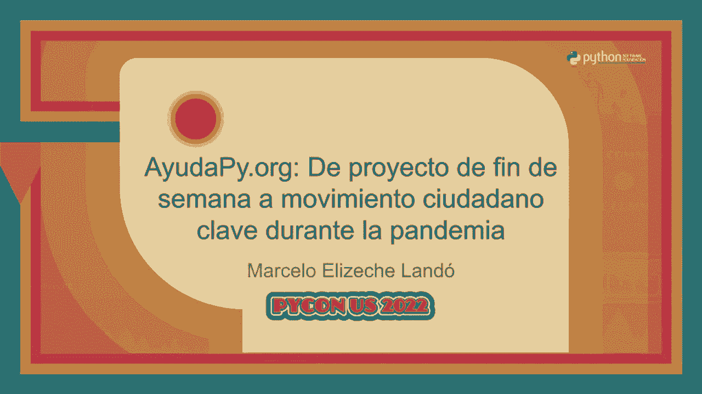
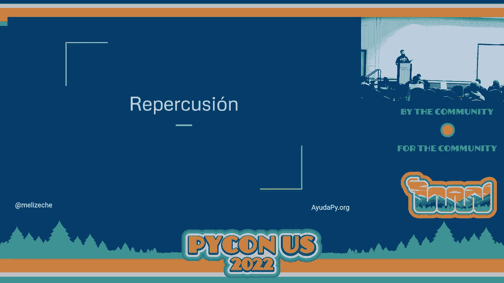
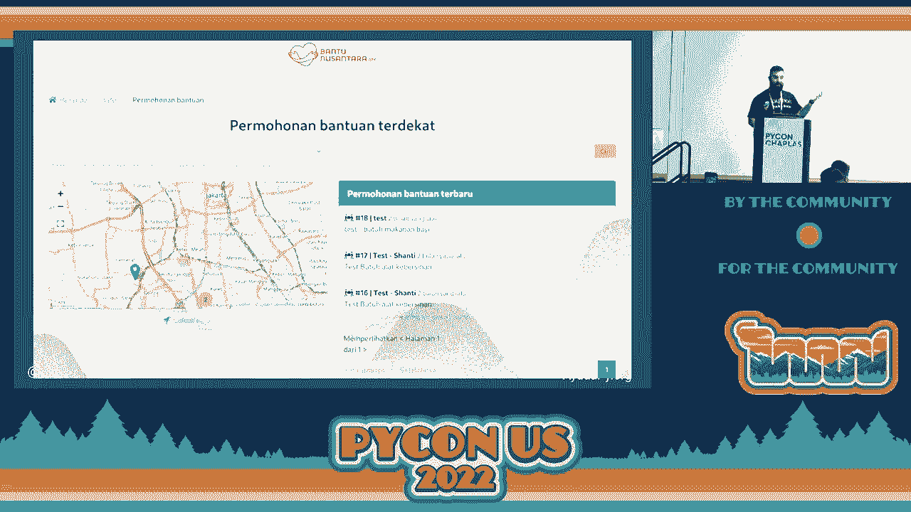
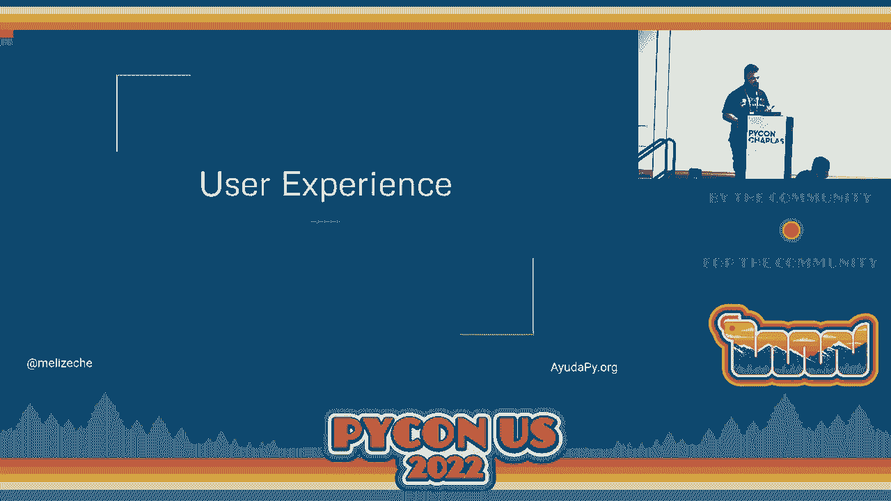
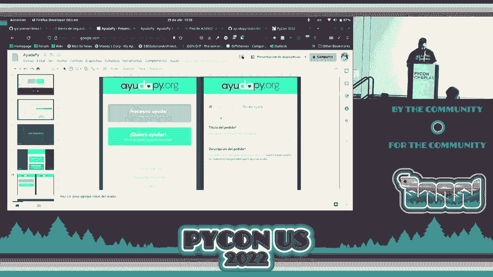
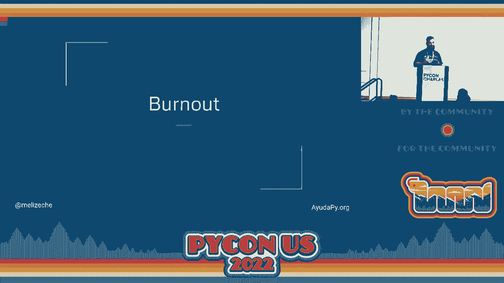
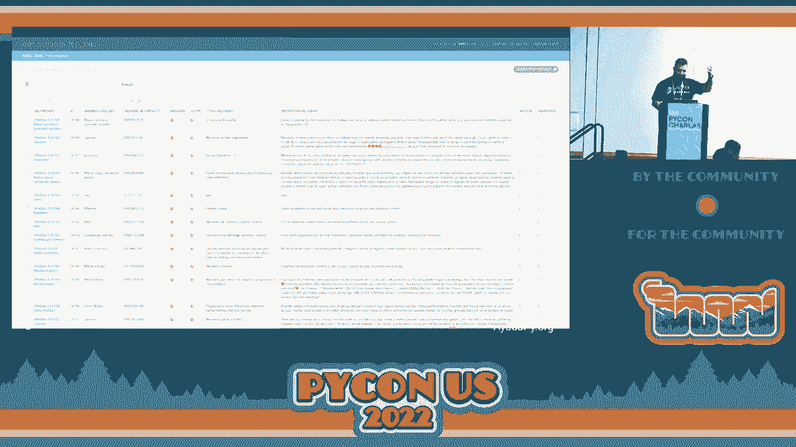
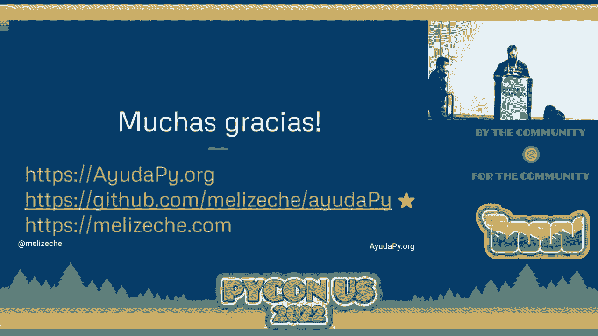

# 开源项目实战：P3：从周末项目到可持续社区




## 概述

在本节课中，我们将学习如何将一个简单的周末编程项目，发展成为一个活跃、可持续的开源社区。我们将以 `AyudaPy` 项目为例，探讨其从个人想法到社区驱动的演变过程，并总结出可复用的关键步骤和核心原则。

## 章节一：项目缘起与核心问题 🔍

上一节我们概述了课程目标，本节中我们来看看 `AyudaPy` 项目是如何诞生的。

任何成功的项目都始于一个明确的需求。`AyudaPy` 的诞生是为了解决一个具体的社会问题：在紧急情况下，高效地连接需要帮助的人与能够提供帮助的资源。

其核心运作模式可以用一个简单的公式表示：

**需求匹配 = 信息收集 + 信息验证 + 高效分发**

这个公式意味着，项目成功的关键在于建立一个可靠的流程，收集真实的求助与援助信息，进行必要的验证，然后将其精准地传递给能采取行动的人或组织。

## 章节二：从想法到最小可行产品 🛠️

明确了核心问题后，下一步就是快速构建一个可用的产品来验证想法。

从周末项目起步的关键是专注于开发一个 **最小可行产品**。这意味着你需要剥离所有复杂的功能，只构建解决核心问题所必需的最简单功能。



对于 `AyudaPy` 而言，其 MVP 可能包含以下基本功能：

以下是构建 MVP 时建议遵循的步骤列表：
1.  **定义核心功能**：仅实现信息发布和查看。
2.  **选择简单技术栈**：使用熟悉的、能快速上手的工具，例如 Python 的 Flask 或 Django 框架。
3.  **部署与发布**：使用 Heroku、Vercel 等平台快速部署，并开放源代码。
4.  **收集初始反馈**：让最早的用户试用，并根据反馈进行快速迭代。

这个过程的核心是行动与验证，而不是追求完美。

## 章节三：吸引首批贡献者与建立社区 👥

当 MVP 开始运行并产生价值后，项目就可以向社区化迈进了。





一个项目从“我的项目”转变为“我们的项目”，关键在于吸引和维护贡献者。`AyudaPy` 通过解决真实、紧迫的问题，自然吸引了第一批希望贡献力量的开发者。

以下是建立健康社区的几个要点：
*   **降低贡献门槛**：编写清晰的 `README.md` 和 `CONTRIBUTING.md` 文档，说明如何设置开发环境、提交代码。
*   **标注“新手友好”任务**：在 Issue 中明确标记出适合新贡献者解决的简单问题或功能。
*   **积极互动与认可**：及时回复 Issue 和 Pull Request，感谢每一位贡献者的工作，无论贡献大小。
*   **建立沟通渠道**：创建公开的聊天群组（如 Discord、Slack）或论坛，供社区成员交流。

过渡到社区驱动是项目可持续发展的基石。

## 章节四：项目治理与持续发展 📈

随着社区壮大，需要更清晰的结构来引导项目方向，避免混乱。

良好的治理模式能确保项目在规模扩大后仍能高效运作。这包括决策流程、角色定义和冲突解决机制。



一个常见的轻型治理结构如下：
```markdown
- **维护者**：拥有代码库写入权限，负责 Review PR、管理发布。
- **贡献者**：提交过被合并的代码或文档的社区成员。
- **用户**：使用项目并提供反馈的群体。
```
决策可以通过在重要的 Issue 或 RFC 中进行公开讨论并寻求共识来进行。

保持项目的透明度和开放性，是激励长期贡献的关键。

## 章节五：总结与核心收获 🎯



本节课中，我们一起学习了将一个周末项目发展为成熟开源社区的完整路径。



我们回顾了从识别问题、构建 MVP，到吸引贡献者、建立社区治理的全过程。每个阶段的核心在于 **创造价值**、**保持开放** 和 **促进协作**。

记住，成功的开源项目不仅是优秀的代码，更是围绕代码构建起来的、充满活力的人际网络。无论你的项目始于何种想法，遵循这些原则都能帮助你走得更远。



（掌声）