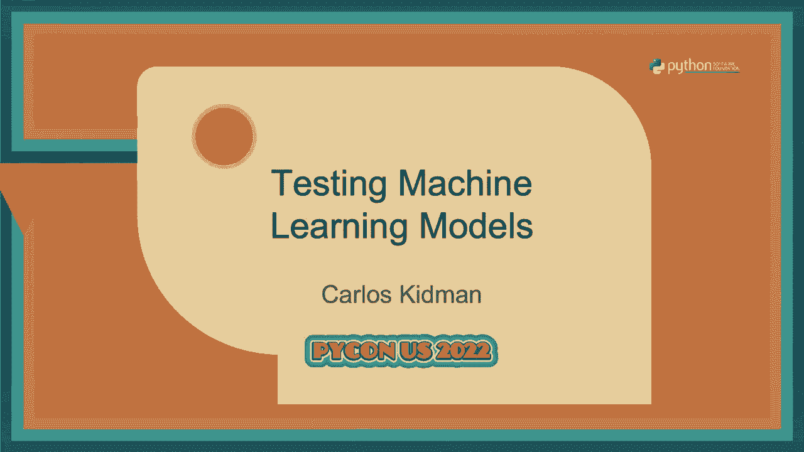
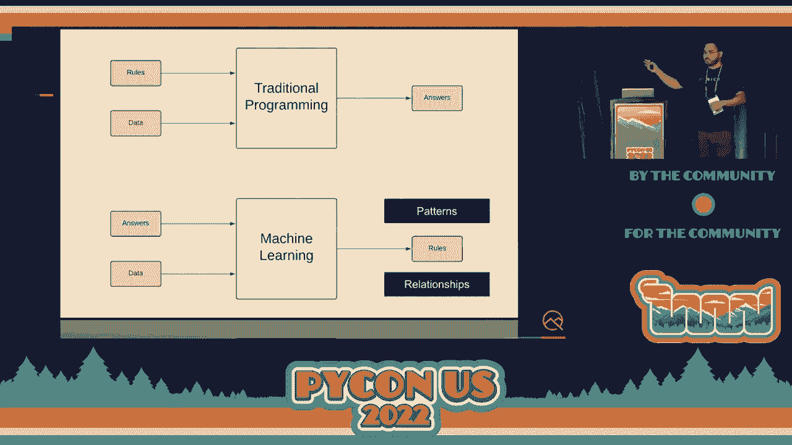
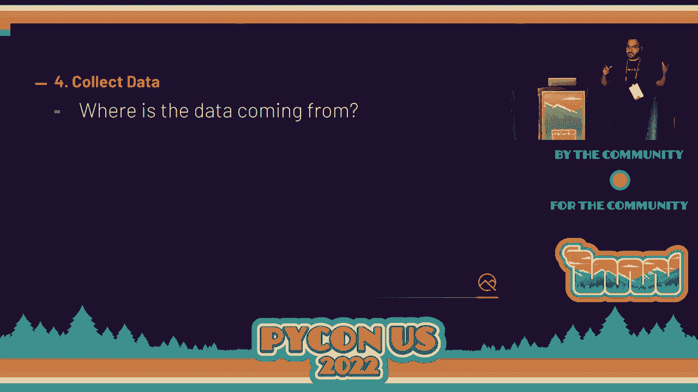
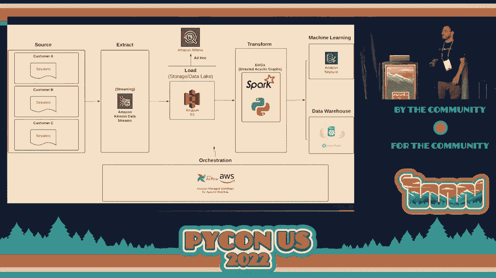
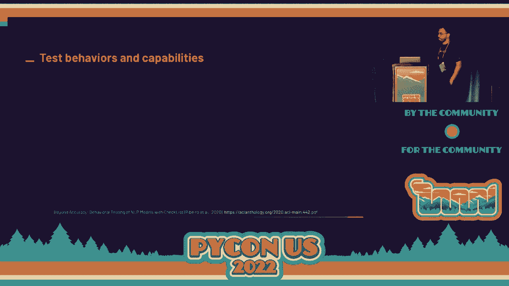
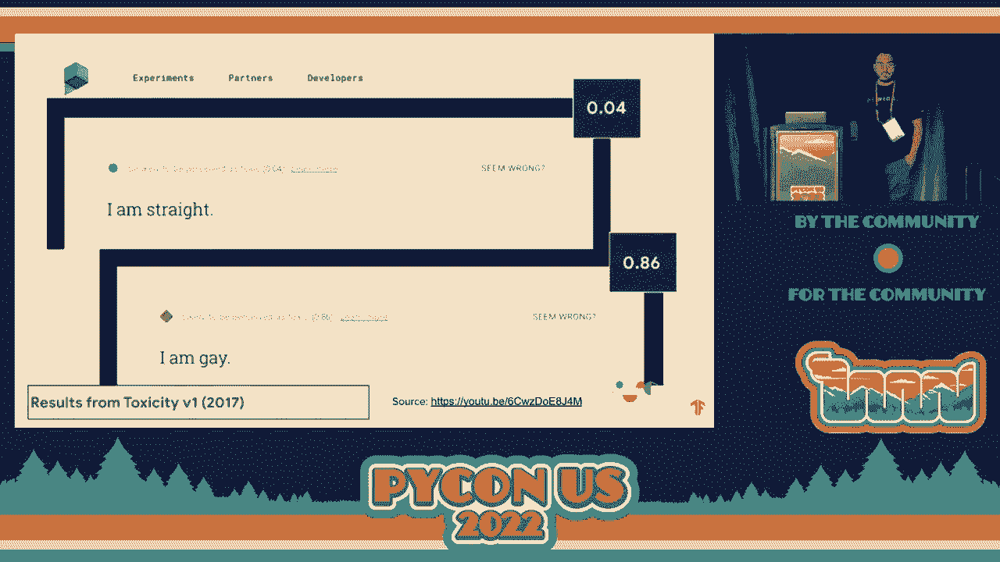

# 机器学习模型测试：P30：测试机器学习模型




## 概述
在本节课中，我们将学习如何对机器学习模型进行系统性的测试与质量保障。我们将从机器学习的基本概念入手，逐步探讨在模型开发与部署的各个阶段，如何应用软件测试的理念和技术来确保机器学习系统的可靠性、公平性和有效性。

---

## 机器学习基础：从预测开始


上一节我们介绍了课程概述，本节中我们来看看机器学习的基础概念。

机器学习的一个常见应用是预测。预测是指基于数据中的模式和其他现有值来推断未知值。

假设我们是一家杂货店的机器学习工程师，任务是预测顾客进店后会花费多少钱。我们有以下数据集：
*   一位顾客花费了 10 美元。
*   两位顾客花费了 20 美元。
*   四位顾客花费了 40 美元。



如果问三位顾客会花费多少，你可能会回答 30 美元。你是如何得出这个答案的？因为你发现了数据中隐含的规则：每位顾客平均花费 10 美元。因此，对于任意数量的顾客 `n`，预测花费金额的公式可以表示为：
**花费金额 = n * 10**

这本质上就是一个简单的监督学习模型的工作原理：它从数据中寻找关系并建立规则。

---

## 传统编程与机器学习的测试差异

上一节我们通过一个简单例子理解了预测，本节中我们来看看测试传统软件与测试机器学习模型有何不同。

在传统编程范式中，我们定义明确的规则（函数），输入数据，然后得到输出。例如，一个判断数字是否为偶数的函数：
```python
def is_even(number):
    return number % 2 == 0
```
为此编写单元测试非常简单：输入 3，期望得到 `False`；输入 2，期望得到 `True`。

机器学习则不同。在机器学习中，我们输入的是“答案”（标签）和“数据”，算法会自行推导出“规则”（模型）。因此，输出存在不确定性。在上一个例子中，我们无法保证三位顾客一定会花费 30 美元。他们可能花费 28 美元、50 美元，甚至可能不消费。测试的难点在于，我们无法像传统软件那样断言一个固定输出是绝对正确的，而是需要验证模型的行为是否在可接受的范围内。

机器学习系统的故障点也与传统软件不同，其中一个核心风险来源于数据。数据驱动着整个机器学习系统，如果数据存在问题，模型的输出就会有问题。

---

## 测试左移：在开发早期引入质量保障



上一节我们讨论了机器学习测试的挑战，本节中我们来看看一个重要的软件测试理念——“测试左移”。

“测试左移”是指在软件开发生命周期中，尽可能早地引入测试和质量保障活动。典型的软件开发生命周期包括计划、设计、开发、测试、部署等阶段。如果将其视作一条从左（开始）到右（结束）的流水线，“左移”意味着让测试人员、开发人员和质量实践更早地参与到流程中，例如在设计和计划阶段就介入，以便提前发现和预防问题。

假设我们要启动一个新的机器学习项目，以下是结合了“左移”思想的开发流程概览，我们将逐一审视每个阶段。



---

## 机器学习项目开发与测试流程

以下是结合了“测试左移”思想的机器学习项目关键步骤，我们将看到测试和质量活动如何融入其中。

### 1. 定义问题与目标
首先，我们需要明确要解决什么问题。在杂货店的例子中，问题不仅仅是“预测顾客花费”，更深层的业务目标可能是“防止商品缺货或库存积压”。一个好的问题定义应清晰说明系统为谁服务、是否真的需要机器学习解决方案。

### 2. 定义成功标准与评估风险
我们需要定义项目成功的基准，并评估潜在风险。这包括：
*   **设定初始基准**：建立一个简单的概念验证作为比较基线。
*   **评估风险**：考虑数据隐私、安全性、模型偏见等风险。
*   **确保资源**：确认团队是否拥有必要的领域专家（如医学专家、语言学家）来帮助构建和验证系统。

### 3. 设计初始架构
设计系统的技术架构，包括：
*   数据来源（哪个数据库或表）。
*   数据处理流程（ELT：提取、加载、转换）。
*   模型部署方式（REST API、移动端、边缘设备）。
*   开发与生产环境下的监控方案。

### 4. 收集与理解数据
数据是机器学习系统的生命线。我们需要理解：
*   数据来源（用户日志、传感器、第三方）。
*   数据如何进入系统（流式或批处理）。
*   开发环境的数据准备（是否使用生产数据快照或合成数据）。
*   数据在到达模型之前经历了哪些处理步骤。

理解完整的数据流水线至关重要。例如，一个简单的数据流可能是：用户会话数据 -> Kinesis（流处理）-> S3（数据湖）-> ETL作业 -> Neptune / Snowflake（数据库）。测试人员需要关注流水线的每一步，因为任何环节的故障都会影响下游数据质量，进而影响模型。

### 5. 准备数据
在此阶段，我们清洗和转换数据以供模型使用。活动包括：
*   处理缺失值或错误值。
*   将数据转换为合适的格式和形状。
*   进行特征工程。
数据质量直接决定模型质量，因此数据工程师和分析师在此阶段会进行大量的数据验证和测试。

### 6. 训练与验证模型
这是模型开发的核心阶段，包括：
*   进行实验，比较不同模型。
*   记录训练和验证指标（如准确率、损失）。
*   调整模型参数和权重。
*   使用工具自动化跟踪实验过程，避免手动记录带来的混乱。
**验证** 特指模型在预留的、未见过的数据集（验证集）上的表现，用于评估其泛化能力。

### 7. 测试模型行为
此处的“测试”侧重于评估模型在更广泛意义上的行为，而不仅仅是准确率。我们需要检查：
*   **模型是否表现出有害偏见？**
*   **是否满足隐私和安全要求？**
*   **性能和可靠性如何？**（能否处理高并发？能否抵抗对抗性攻击？）
*   **是否真正解决了我们定义的问题？**
*   **最终用户是否信任并喜欢使用这个系统？**

### 8. 部署模型
将模型部署到目标环境（如云端API、移动应用）。在此阶段，可以应用传统的软件测试技术：
*   **API测试**：使用 `requests` 库测试模型服务端点。
*   **性能测试**：使用如 `locust.io` 等工具测试模型服务的吞吐量和延迟。
*   **集成测试**：确保模型与整个系统协同工作。

### 9. 监控与迭代
模型部署后，工作并未结束。我们需要：
*   持续监控模型在生产环境中的表现。
*   设置警报机制。
*   收集反馈，洞察模型性能变化（如数据漂移）。
*   根据监控结果迭代和重新训练模型。
这涉及到 **可观察性** 和 **MLOps（机器学习运维）** 的实践，确保模型能持续提供价值。

---

## 贯穿流程的风险管理策略

在以上所有步骤中，我们都需要持续进行风险管理。策略主要分为三类：
1.  **预防风险**：通过“左移”实践，如在设计阶段进行风险风暴、示例映射，让团队对潜在问题达成共识。
2.  **缓解风险**：采用蓝绿部署、功能标志、A/B测试、向小部分专家用户先行发布等策略，控制问题的影响范围。
3.  **检测风险**：通过自动化测试（单元测试、集成测试、端到端测试）来及时发现问题。

---

## 案例分析：Zillow的教训

上一节我们讨论了风险管理，本节中我们通过一个真实案例看看忽视测试和监控的后果。

Zillow曾试图建立一个机器学习系统来自动买卖房产以赚取差价。初期系统运行良好，但最终导致巨大亏损并引发大规模裁员。原因包括：
*   **数据质量问题**：系统依赖的数据可能不准确或被操纵。
*   **缺乏人工监督**：系统被赋予过高自主权。
*   **未考虑外部因素**：模型基于历史数据训练，当COVID-19疫情爆发导致市场剧变时，系统无法适应，公司也未及时暂停或调整。
*   **监控与响应不足**：部署后缺乏持续的、有效的监控和干预机制。



这个案例凸显了“测试右移”（即部署后持续的监控、评估和迭代）的重要性。机器学习系统的生命周期不是一个线性过程，而是一个包含持续监控和再训练的无限循环。

---

## 实用的机器学习测试技术

上一节我们看到了忽视测试的后果，本节中我们介绍几种具体的、可用于机器学习模型的测试技术。

### 1. 对抗性攻击测试
这种测试旨在发现模型的脆弱性。攻击者通过精心构造的输入来“欺骗”模型，使其产生错误判断。例如：
*   在图像上添加特定噪声，使模型将“海龟”识别为“步枪”。
*   在停车标志上粘贴贴纸，使自动驾驶系统将其误认为“限速标志”。
*   穿着特殊图案的衣服，使安防AI系统无法检测到人。
测试人员可以扮演攻击者角色，进行威胁建模，并创造性地设计测试用例来评估模型的鲁棒性。



### 2. 行为测试
行为测试关注模型是否具备我们期望的能力，而不仅仅是看准确率指标。这需要在设计阶段（左移）就与团队共同定义这些“能力”。例如，对于一个文本模型，能力可能包括：词汇质量、命名实体识别、处理否定句等。
一家公司通过定义能力并编写针对性测试（如最小功能测试、不变性测试），发现了比传统方法多近三倍的错误，并能快速比较多个现成模型的优劣。

### 3. 公平性与负责任AI测试
此类测试旨在检测和消除模型中的有害偏见。偏见可能来源于数据（历史偏见）、测量方式或模型设计本身。
**示例**：
*   **毒性检测偏见**：一个系统判断“我是同性恋”比“我是异性恋”更有“毒性”。
*   **翻译性别偏见**：将性别中立的土耳其语句子翻译成西班牙语或英语时，系统自动为“护士”分配女性代词，为“医生”分配男性代词。
测试方法包括“不变性测试”（仅改变敏感属性，如性别、种族词汇，看输出是否发生不应有的变化）和“方向性测试”（检查输出变化的方向是否符合预期）。解决方案可能包括在设计中提供多个选项让用户选择。

---

## 总结
本节课中我们一起学习了机器学习模型测试的全貌。我们从机器学习的基本预测概念出发，理解了其测试与传统软件测试的差异。我们深入探讨了“测试左移”和“测试右移”的理念，并梳理了在一个完整的机器学习项目流程中，从问题定义、数据收集、模型训练到部署监控各阶段应关注的测试与质量活动。最后，我们介绍了几种关键的测试技术：对抗性攻击测试、行为测试和公平性测试。希望本教程能帮助你建立起对机器学习系统进行有效测试和质量保障的框架性认识。记住，构建可靠的机器学习系统需要开发、测试、运维和领域专家的紧密协作。