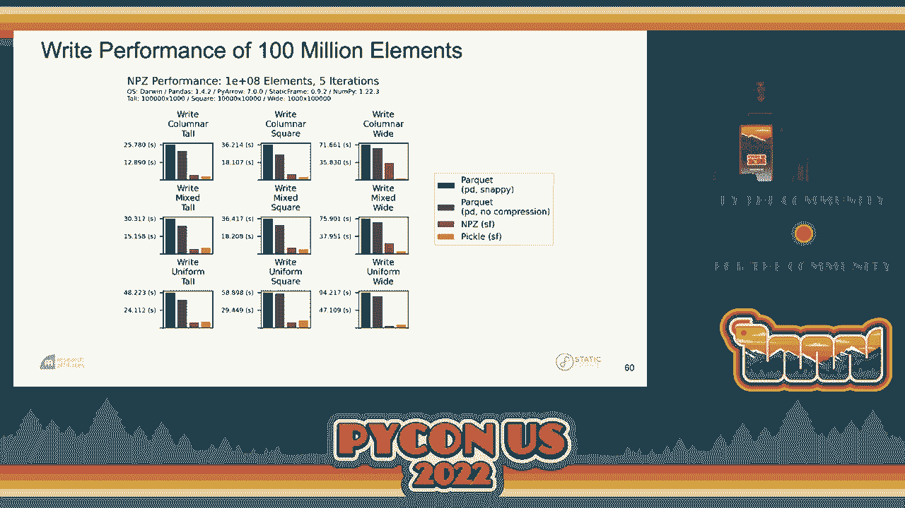

# 数据框序列化与内存映射：P31：使用 NumPy 的 NPY 格式实现比 Parquet 更快的性能


在本教程中，我们将学习如何利用 NumPy 的 NPY 和 NPZ 文件格式，来实现比流行的 Parquet 格式更快的数据框序列化与读取。我们将深入探讨数据框的内部结构、NPY/NPZ 格式的原理，并通过性能对比展示其优势。最后，我们还将了解如何通过内存映射技术进一步提升大数据的处理效率。

## 数据框：P31：1：数据框的核心组件

上一节我们介绍了本教程的概述，本节中我们来看看数据框的核心组件是什么。

数据框并非简单的二维数组。它是一个包含列数据的表格，其中各列可以具有不同的数据类型（异构类型）。数据框的行和列可以拥有标签，这些标签可以是任意类型，并且支持层次化结构。此外，数据框还附带有名称属性，用于为行、列或整个框架附加额外的元数据。

以下是一个数据框组件的示意图：
*   **值数组**：存储实际数据的 NumPy 数组，每个数组对应一种数据类型。
*   **索引数组**：定义行标签的数组，可以是层次化的。
*   **列数组**：定义列标签的数组，同样可以是层次化的。
*   **类型信息**：指明索引、列和值数组中每个组件的具体数据类型。
*   **名称属性**：附加到行、列和框架本身的额外标签元数据。

数据框在内部使用“块”来管理数组存储，以提高性能。块合并策略主要有三种：
*   **未合并块**：每一列都是一个独立的一维数组。
*   **顺序依赖合并块**：相邻且类型相同的列被合并为一个二维数组块。
*   **顺序无关合并块**：所有类型相同的列（无论是否相邻）被合并为一个二维数组块。

Pandas 使用顺序无关合并以获得最佳的类型整合，但增加了转换复杂度。StaticFrame 库则采用顺序依赖合并，虽然在类型整合上可能不是最优，但降低了复杂度，这有助于提升序列化性能。

## 序列化挑战：P31：2：现有格式的局限性与 NPY/NPZ 的潜力

上一节我们介绍了数据框的内部结构，本节中我们来看看完整序列化数据框所面临的挑战。

除了 Python 的 `pickle` 模块，目前没有一种通用格式能完美支持数据框的所有特性（包括所有 NumPy 数据类型、层次化标签、异构类型标签以及名称属性）。Parquet 格式虽然性能出色且支持丰富元数据，但它本质上是为跨平台列表数据设计的，并非原生数据框格式，因此在与数据框相互转换时可能导致信息丢失。

`pickle` 格式虽然速度快，但由于安全性和长期存储可靠性问题（可能执行恶意代码、引用失效对象），不适合作为持久化存储方案。

因此，理想的数据框序列化方案需要：
1.  编码所有值及其类型。
2.  编码所有索引和列标签。
3.  支持层次化标签。
4.  支持每个标签深度的异构类型。
5.  保留名称属性。

NumPy 的 NPY 格式为序列化单个数组提供了优秀的基础。它定义了一种二进制文件格式，可以编码任何 NumPy 数组的维度、数据类型、内存顺序和实际数据。NPZ 格式则是多个 NPY 文件的 ZIP 压缩包。一个自然的想法是：能否将数据框视为一系列 NumPy 数组的集合，并用 NPZ 格式进行序列化？

## NPY/NPZ 格式详解：P31：3：理解二进制编码机制

上一节我们探讨了数据框序列化的需求，本节中我们深入了解一下 NPY 和 NPZ 格式的具体构成。

一个 NPY 文件由两部分组成：一个文件头，后面跟着连续的字节数据（有效载荷）。

**文件头** 包含以下信息：
*   **魔数前缀**：标识这是一个 NPY 文件。
*   **版本号**：指定格式版本。
*   **头长度**：指示需要读取多少字节来获取完整的头信息。
*   **数组描述字典**：这是一个经过编码的 Python 字典，包含三个关键信息：
    *   `descr`：数据类型的描述字符串。
    *   `fortran_order`：布尔值，表示是否是 Fortran 列优先顺序。
    *   `shape`：数组的形状元组。
*   **填充字节**：确保头部的总长度是 64 字节的倍数。


**有效载荷** 就是数组数据的连续字节表示。


例如，一个包含 `[False, True, True]` 的布尔数组，其 NPY 文件大致结构如下：
```
[魔数][版本][头长度][{‘descr’: ‘|b1’, ‘fortran_order’: False, ‘shape’: (3,)}][填充][数据字节]
```


NPY 原生支持通过 `pickle` 来序列化对象数组，但出于安全考虑，在数据框序列化场景中应避免使用此功能。


NPZ 文件则是一个包含多个 NPY 文件的 ZIP 归档。原始的 NPZ 规范没有规定标准的命名约定或元数据文件。在本方案中，我们为其添加了这些规范，以便系统地组织数据框的各个组件。

## 编码数据框为 NPZ：P31：4：将组件映射到文件

上一节我们理解了 NPY 的格式，本节中我们来看看如何将一个完整的数据框编码到一个 NPZ 文件中。

策略是将数据框的每个组件数组存储为一个独立的 NPY 文件，并将所有额外的元数据存储在一个自定义的 JSON 文件中，然后将所有这些文件打包到一个（未压缩的）ZIP 归档中，即 NPZ 文件。

以下是映射关系：
1.  **值数组**：每个数据块（可能是合并后的二维数组）存储为一个 NPY 文件（例如 `__blocks_0__.npy`, `__blocks_1__.npy`）。
2.  **列标签数组**：列索引的每个层级存储为一个 NPY 文件（例如 `__columns_depth_0__.npy`）。
3.  **行标签数组**：行索引的每个层级存储为一个 NPY 文件（例如 `__index_depth_0__.npy`）。
4.  **元数据 JSON 文件**：一个名为 `__meta__.json` 的文件，存储以下信息：
    *   各组件的类型描述符。
    *   索引和列的深度信息。
    *   所有名称属性。

通过这种结构，NPZ 文件完整地封装了重建数据框所需的全部信息和数据。

## 性能优化：P31：5：超越 NumPy 原生实现的加速


上一节我们介绍了如何将数据框编码为 NPZ，本节中我们探讨一下如何通过优化 NPY 的读写过程来获得极致的性能。

NumPy 原生的 `np.save` 和 `np.load` 函数设计注重兼容性和通用性。当需要序列化包含成千上万个数组的数据框时，这些通用例程可能成为瓶颈。通过实现一个更专注、更精简的 NPY 读写器，可以获得显著的性能提升。

优化措施包括：
*   **移除不必要支持**：放弃对结构化数组、对象数组（及相关的 `pickle`）以及由 Python 2 编写的旧版 NPY 文件的兼容性支持。这简化了代码路径。
*   **头部缓存**：在序列化数据框时，许多数组的头部信息（如数据类型、形状）是相同或相似的。缓存已编码的头部可以避免重复计算。
*   **固定使用版本 1**：坚持使用 NPY 格式版本 1，它足以满足需求且实现简单。

这些优化使得 NPY/NPZ 的读写速度大幅超过 NumPy 原生实现，从而为超越 Parquet 的性能奠定了基础。

## 性能对比：P31：6：NPZ 与 Parquet、Pickle 的基准测试

上一节我们了解了性能优化的方法，本节中我们通过具体的基准测试数据来比较 NPZ、Parquet 和 Pickle 的表现。


测试涵盖了多种数据框形态，以全面评估性能：
*   **数据规模**：100 万元素和 1 亿元素。
*   **形状比例**：细高形（行多列少）、方形、宽形（行少列多）。
*   **类型异构性**：
    *   **列式**：每列类型都不同，无块合并。
    *   **混合**：部分列类型相同，存在部分块合并。
    *   **均匀**：所有列类型相同，可合并为单个块。

以下是核心发现：

**读取性能**：
*   Pickle 通常是最快的。
*   **NPZ 的读取速度在所有测试场景下均快于（压缩或未压缩的）Parquet**。
*   当数据框类型更均匀（块合并程度高）时，NPZ 的优势更明显。
*   Parquet 使用压缩有时会降低读取速度。

**写入性能**：
*   **NPZ 的写入速度在所有测试场景下均显著快于 Parquet**。
*   在某些情况下，NPZ 的写入速度甚至接近或超过了 Pickle。

**文件大小**：
*   未压缩的 NPZ 文件通常小于未压缩的 Parquet 文件。
*   压缩的 Parquet 文件比 NPZ 文件更小，这是其优势。但在处理超大文件（如 1 亿元素）时，压缩 Parquet 的读写性能代价很高。
*   NPZ 文件大小通常比压缩 Parquet 大，但超出幅度一般不超过 25%。

综上所述，NPZ 在速度和通用性上取得了很好的平衡，尤其在读写速度上优势明显。



## 内存映射数据框：P31：7：使用 NPY 实现极致读取性能


上一节我们对比了不同格式的性能，本节中我们探索一种更高级的用法：将整个数据框内存映射到 NPY 文件，以实现极致的读取性能和低内存占用。

内存映射允许将磁盘文件的内容直接关联到进程的虚拟内存空间。对于大型数据集，这可以：
*   **显著提升读取速度**：避免将整个文件一次性加载到物理内存。
*   **支持惰性加载**：只在访问数据时才将其调入物理内存。
*   **减少内存拷贝**：多个进程可以共享同一份只读数据。

实现内存映射数据框的步骤：
1.  将数据框导出到文件系统的一个目录中，每个组件数组保存为独立的 NPY 文件（而非打包成 NPZ）。
2.  使用 `mmap` 系统调用为每个 NPY 文件的数据部分创建内存映射。
3.  利用这些内存映射缓冲区，直接构造 NumPy 数组（`np.ndarray`）。
4.  使用这些数组重新构建数据框。

由于 StaticFrame 采用不可变数据模型和顺序依赖的块合并策略，其内部存储结构与 NPY 文件布局高度一致，使得内存映射可以无缝进行，无需额外的数据转换或复制。

基准测试表明，**使用内存映射 NPY 目录的方式读取数据框，其性能甚至超过了 NPZ 和 Pickle**，同时保持了最低的内存占用，非常适合处理超大规模数据集。

## 总结与展望：P31：8：当前状态与未来方向

本节课我们一起学习了如何利用 NumPy 的 NPY/NPZ 格式来实现高效的数据框序列化与内存映射。


我们首先剖析了数据框的复杂结构，然后指出了现有序列化方案（如 Parquet 和 Pickle）的局限性。接着，我们深入了解了 NPY/NPZ 这种已有十多年历史的二进制格式，并展示了如何通过系统性地映射数据框组件到 NPY 文件集合，再打包成 NPZ，来实现完整的数据框序列化。

通过针对性的性能优化，NPZ 格式在读写速度上全面超越了 Parquet。更进一步，通过将数据框导出为 NPY 文件目录并实施内存映射，我们获得了近乎极致的读取性能和高效的内存利用。

目前，这套 NPY/NPZ 的读写例程已在 StaticFrame 库中完全实现，并应用于生产环境，取得了显著收益。用户可以通过简单的接口（`to_npz`, `from_npz`, `to_npy`, `from_npy`）来使用这些功能。Pandas 用户也可以通过转换为 StaticFrame 来间接享受此技术带来的好处。

展望未来，可能的改进方向包括探索 NPY 数据的压缩算法，以在保证速度优势的同时，进一步缩小文件体积。


希望本教程能让你对数据框的序列化与高性能处理有更深入的理解，并为你的数据处理工具箱增添一个强大的选项。