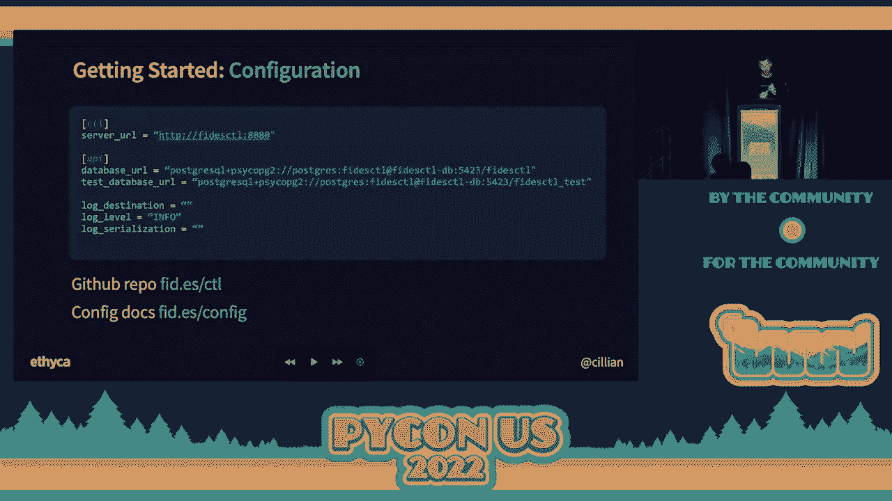
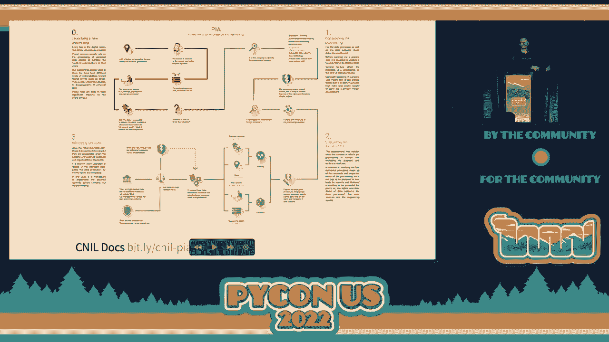
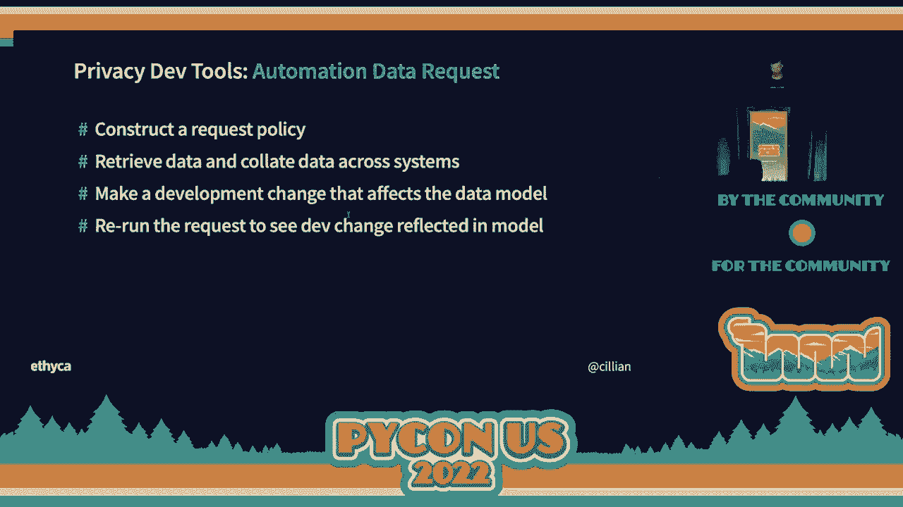
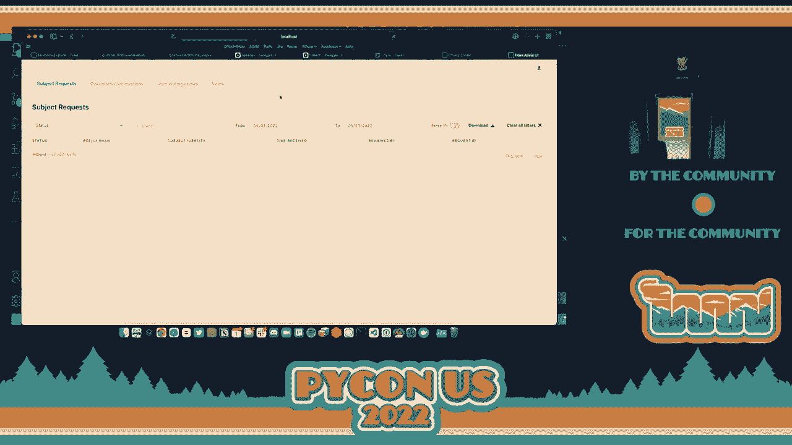
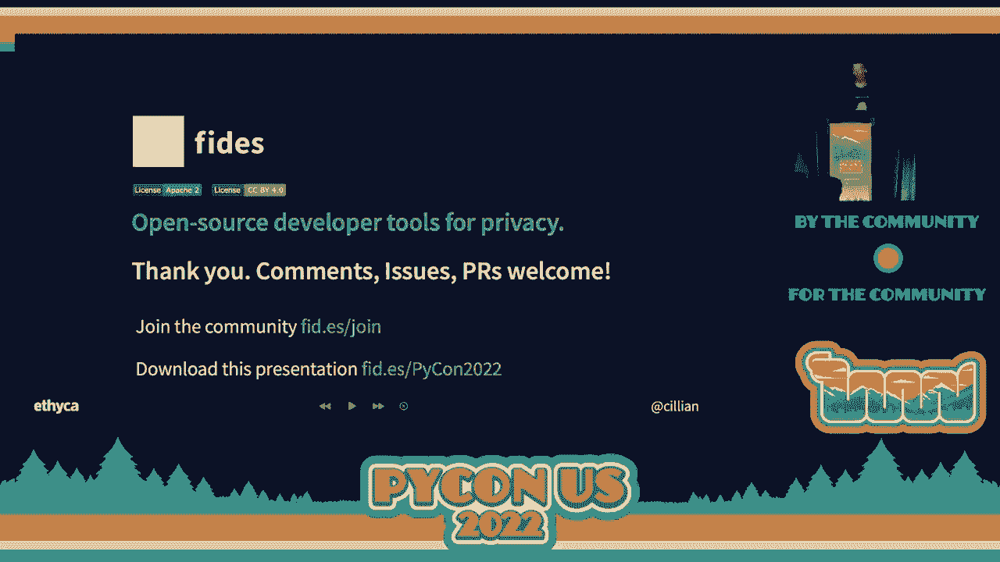

# 数据隐私工程：P33：基于Python的开源数据隐私工具Fides 🛡️


## 概述
在本节课中，我们将学习一个名为Fides的开源数据隐私工程平台。我们将了解“隐私即代码”的理念，探索Fides的核心概念，并通过实际演示学习如何使用它来管理软件开发中的隐私风险和执行用户数据权利。

---

## 什么是“隐私即代码”？🤔
上一节我们介绍了课程主题，本节中我们来看看“隐私即代码”这一核心理念。

在软件开发中，隐私通常被视为发布后需要解决的问题。这给开发者和法务团队都带来了挑战。诸如GDPR、CCPA等法规引入了数据发现、隐私审查、权利请求等复杂概念。

“隐私即代码”的理念是将隐私作为软件开发流程中的一层来对待，类似于“安全左移”。其目标是**为开发者提供工具，使得构建尊重隐私的系统变得更加容易**，从而将隐私考虑内嵌到开发过程中，而非事后补救。

---

## Fides 平台简介 🚀
上一节我们探讨了“隐私即代码”的理念，本节中我们来看看实现这一理念的工具——Fides平台。

Fides是一个开源的隐私工程平台，旨在帮助开发者和数据工程师更容易地遵守隐私法规。它包含两个主要组件：
*   **Fides控制**：在软件开发生命周期中运行，用于在开发阶段管理和评估隐私风险。
*   **Fides操作**：一个容器化应用，用于在生产运行时代表用户执行和管理数据权利任务。

Fides的核心是**Fides语言**，这是一种轻量级的隐私描述语言，允许开发者描述其系统的数据隐私特征，而无需深入了解复杂的法律条款。

---

## Fides 核心分类法 🗂️
上一节我们介绍了Fides平台的组成，本节中我们深入了解一下其描述隐私的核心语言——分类法。

Fides语言通过四个核心概念来描述数据和隐私特征：

以下是四个核心数据类别：
1.  **数据类别**：描述“什么”类型的数据。例如：`user.contact.email`（电子邮件地址）或`system.operations`（系统操作数据）。
2.  **数据主体**：描述数据“关于谁”。指的是数据所关联的个人。
3.  **数据用途**：描述使用数据的“目的”。例如：提供电子商务服务、进行广告投放等。
4.  **数据限定符**：描述数据集中个人的**可识别程度**。例如：完全可识别、去标识化、聚合匿名化等。

通过组合这四个简单的概念，可以建模大多数数据和隐私场景。



---

## 如何使用 Fides 语言进行声明 📝
上一节我们了解了核心概念，本节中我们来看看如何实际使用Fides语言进行声明。



声明方式故意设计得轻量且声明式，主要使用点符号表示法，并以YAML文件形式存在于项目中。

例如，声明两种数据类型：
```yaml
# 声明系统操作数据（如时间戳）
data_categories:
  - system.operations

# 声明用户提供的可识别联系电子邮件
data_categories:
  - user.contact.email
```
开发者可以根据所知信息的详细程度，选择使用具体或抽象的标签。

在Fides中，有四种基本资源用于组织声明：

以下是四种基本资源：
*   **组织**：代表一个公司或部门，是资源层级的根。
*   **系统**：代表单个项目、服务或应用程序的隐私属性，描述其行为和使用数据的目的。
*   **数据集**：建模任何可能包含数据的事物，如数据库、数据表、列表等。
*   **策略**：描述关于系统的可执行规则集，将企业隐私政策转化为代码。

---

## 实践演示：在开发中执行隐私策略 🔍
上一节我们学习了如何声明，本节我们通过一个演示来看看Fides控制如何在实际开发中工作。

演示将模拟一个简单的电子商务应用。流程如下：
1.  **扫描基础设施**：使用`fidesctl scan`命令扫描AWS环境，识别可能包含数据的系统。
2.  **生成数据集**：使用`fidesctl generate dataset`命令连接到具体数据库（如Postgres），生成数据模型的YAML文件框架。
3.  **手动标注**：开发者根据分类法，在生成的YAML文件中为数据字段添加标签（如将`email`字段标注为`user.contact.email`）。
4.  **声明系统**：在另一个YAML文件中声明应用程序（系统）的行为，包括其处理的数据类别和用途。
5.  **策略评估**：定义企业隐私策略（例如：“拒绝使用敏感数据进行个性化或广告”）。使用`fidesctl evaluate`命令，Fides会将系统声明与策略进行对比。
    *   如果系统试图使用被策略禁止的敏感数据（例如，误将电子邮件标注为医疗健康数据），评估将**失败**，并阻止代码提交。
    *   如果符合策略，评估则**通过**。
6.  **生成审计跟踪**：所有评估结果都会生成审计日志，记录合规情况。

这个过程将隐私审查左移到了CI/CD管道中，防止了风险代码进入生产环境。

---

## 实践演示：自动化数据主体权利请求 ⚙️
上一节我们看到了如何在开发阶段控制风险，本节我们看看Fides如何自动化处理生产环境中的用户数据权利请求（如“被遗忘权”）。



处理数据主体访问请求通常耗时耗力。Fides操作利用Fides控制生成的元数据层，可以自动化执行这些请求。

演示流程如下：
1.  **提交请求**：用户通过Fides隐私中心网络界面提交数据访问请求（提供电子邮件）。
2.  **自动化检索**：请求被提交到Fides操作服务器。服务器根据元数据层中定义的数据类别映射，**自动定位**到所有存储该用户数据的系统（如Postgres数据库、MailChimp）。
3.  **执行并返回**：Fides操作从这些系统中检索用户的所有相关数据，并汇总到一个JSON文件中返回。
4.  **适应变化**：当数据模型变更时（例如，为某个字段添加了新的隐私标签），开发者只需更新开发环境中的数据集声明YAML文件。提交后，元数据层自动更新。后续的数据权利请求将**自动适应**新的数据模型，无需重写任何生产环境脚本。

这大大简化了响应数据权利请求的工程负担。



---

## 总结
本节课中我们一起学习了：
1.  **“隐私即代码”** 的理念，即将隐私作为软件开发中的必要一层。
2.  **Fides开源平台**，它通过Fides控制（开发时）和Fides操作（运行时）来实现这一理念。
3.  **Fides核心分类法**，包括数据类别、主体、用途和限定符，用于描述隐私特征。
4.  **如何使用YAML文件**声明数据和处理逻辑。
5.  **两个核心实践**：
    *   在CI/CD管道中**自动评估隐私策略**，防止风险。
    *   **自动化处理数据主体权利请求**，利用元数据映射大幅提升效率。




Fides是一个基于Python的强大工具，旨在让工程师更简单、更高效地构建尊重隐私的系统。