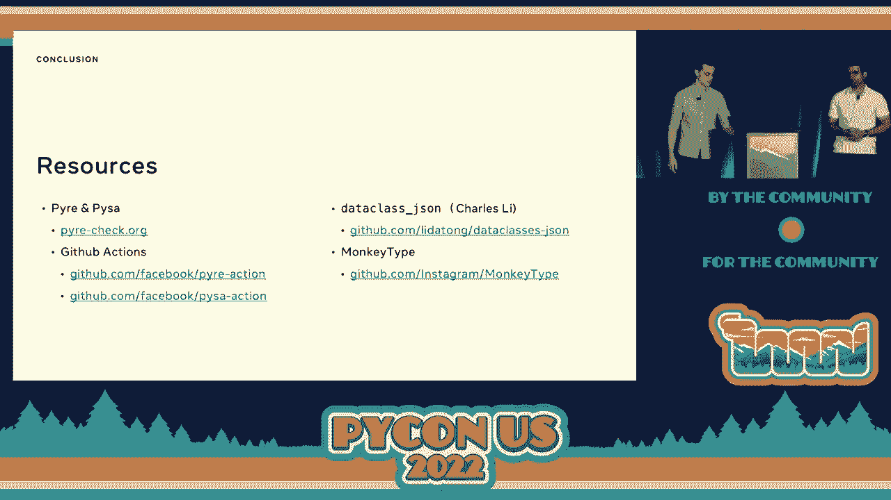

# Python 类型安全代码：P37：讨论 - 格雷厄姆·布莱尼 & 普拉迪普·库马尔·斯里尼瓦桑


## 概述
在本教程中，我们将学习如何利用 Python 的类型系统来提升代码的安全性。我们将探讨类型注解如何帮助持续预防和检测常见的安全漏洞，例如 SQL 注入、路径遍历和隐私数据泄露。通过具体的代码示例，我们将展示类型如何使安全编码变得既方便又可靠。

## 1：安全左移与类型的作用

在安全领域，“左移”是一个核心概念。它指的是在软件开发生命周期中，越早发现和修复漏洞，其成本和影响就越低。最糟糕的情况是漏洞被外部攻击者利用。更好的情况是我们通过自动化工具或代码设计本身来预防漏洞。

对于大多数项目（尤其是资源有限的开源项目或小型团队），实现安全左移最现实的方法就是依赖**自动化预防和检测**。本次讨论的核心论点是：**Python 的类型注解是持续预防和检测漏洞的强大工具**。

我们将围绕一个示例照片分享网络应用来展开，它有两个主要端点：
1.  `get_photos_for_user(username)`: 根据用户名获取照片列表。
2.  `get_photo_by_id(photo_id)`: 根据照片ID获取特定照片。

接下来，我们将看看类型如何帮助保护这个应用。

## 2：使用 `LiteralString` 预防命令注入

上一节我们介绍了安全左移的概念，本节中我们来看看类型如何帮助预防一类经典漏洞：命令注入（以 SQL 注入为例）。

在示例应用中，`get_photos_for_user` 端点可能这样构建 SQL 查询：

```python
# 危险：使用字符串插值（F-string）
query = f"SELECT * FROM photos WHERE owner = '{username}'"
cursor.execute(query)
```

如果攻击者传入用户名 `admin' OR '1'='1`，就会导致 SQL 注入。最佳实践是使用参数化查询，将命令与数据分离：

```python
# 安全：使用参数化查询
query = "SELECT * FROM photos WHERE owner = %s"
cursor.execute(query, (username,))
```

然而，开发者可能因为方便而错误地使用 F-string。我们希望库的 API 设计能引导开发者走向安全路径。类型系统可以帮忙。如果 `execute` 方法只接受普通的 `str` 类型，它无法区分安全和不安全的字符串。

Python 3.11 引入了 `LiteralString` 类型（旧版本可通过 `typing_extensions` 导入）。它表示由字面量字符串构建的字符串。我们可以重新定义 `execute` 的签名：

```python
from typing import LiteralString

def execute(self, query: LiteralString, parameters: tuple = ...) -> None:
    ...
```

现在，当我们使用参数化查询时，查询字符串是一个字面量，类型检查通过：

```python
query: LiteralString = "SELECT * FROM photos WHERE owner = %s"  # 这是 LiteralString
cursor.execute(query, (username,))  # 类型检查通过
```

而使用 F-string 时，由于插入了变量 `username`（其类型是普通的 `str`），生成的查询类型也是 `str`，而非 `LiteralString`，类型检查器会报错：

```python
query = f"SELECT * FROM photos WHERE owner = '{username}'"  # 类型是 `str`
cursor.execute(query)  # 类型检查器报错：期望 `LiteralString`，得到 `str`
```

这种方法将安全责任从库的使用者转移到了库的作者身上。它不仅能预防 SQL 注入，同样适用于 Shell 命令注入、服务器端模板注入等场景。

**关键点总结**：通过在敏感 API 中使用 `LiteralString` 类型，我们可以利用类型检查器在编码阶段就预防命令注入漏洞。

## 3：使用运行时类型验证确保数据格式

上一节我们看到了如何预防代码注入，本节我们来看看如何确保外部输入的数据格式符合预期，从而避免另一类漏洞。

在 `get_photo_by_id` 端点中，代码可能这样处理请求：

```python
import json
import os

def get_photo_by_id(request_body: str) -> bytes:
    data = json.loads(request_body)  # 加载 JSON
    photo_id = data["photo_id"]       # 获取 photo_id 字段
    filepath = os.path.join("pictures", str(photo_id))
    with open(filepath, "rb") as f:
        return f.read()
```

如果攻击者传入 `{"photo_id": "../../etc/passwd"}`，代码就会尝试读取系统密码文件，造成路径遍历漏洞。问题在于我们盲目信任了用户输入的 `photo_id` 是数字。

我们可以手动编写验证代码，但这很繁琐且容易出错。类型注解结合运行时验证库可以优雅地解决这个问题。以下是使用 `dataclasses-json` 库的例子：

```python
from dataclasses import dataclass
from dataclasses_json import dataclass_json

@dataclass_json
@dataclass
class PhotoRequest:
    photo_id: int  # 明确声明字段类型为 int

def get_photo_by_id_safe(request_body: str) -> bytes:
    try:
        request = PhotoRequest.from_json(request_body)  # 自动验证并解析
        photo_id = request.photo_id  # 保证是 int 类型
        filepath = os.path.join("pictures", str(photo_id))
        with open(filepath, "rb") as f:
            return f.read()
    except ValidationError:
        raise ValueError("Invalid request")
```

当攻击者传入恶意字符串时，`from_json` 方法会抛出 `ValidationError`，因为字符串无法转换为 `int` 类型。这样，我们就用几行声明式的代码防止了漏洞。

**关键点总结**：利用基于类型注解的运行时数据验证（如 Pydantic, dataclasses-json），可以简洁、安全地处理外部输入，避免因数据格式不符导致的安全问题。

## 4：利用数据流分析检测复杂漏洞

前面两节我们探讨了如何预防具体漏洞，本节我们来看看如何利用类型进行更复杂的分析，以检测那些无法通过简单类型约束发现的问题，例如隐私数据泄露。

回顾 `get_photos_for_user` 端点，它应该检查当前用户是否有权限查看目标用户的照片。最初的代码缺少这个隐私检查：

```python
def get_photos_for_user(current_user_id: int, target_username: str) -> List[Photo]:
    query = "SELECT * FROM photos WHERE owner = %s"
    cursor.execute(query, (target_username,))
    photos = cursor.fetchall()
    return photos  # 问题：未检查 current_user_id 是否有权限
```

这里的问题是，`current_user_id` 和返回的 `photos` 在类型层面都是整数或对象，类型系统无法区分“已授权访问的数据”和“未授权访问的数据”。我们需要一种能跟踪数据在程序中如何流动的工具。

这种技术称为**数据流分析**或**污点分析**。它跟踪特定数据（源）在程序中的传播路径，直到它到达我们关心的位置（汇）。在 Meta，我们使用一个名为 **Pysa** 的开源工具（基于 Pyre 类型检查器）来做这件事。

我们可以配置 Pysa：
*   **源**：将来自数据库查询的结果标记为“用户数据”。
*   **汇**：将返回给 HTTP 响应的数据标记为“输出点”。
*   **净化函数**：将执行权限检查的函数（如 `check_privacy`）标记为“净化点”，经过它的数据被认为是安全的。

当我们对没有隐私检查的代码运行 Pysa 时，它会报告一条从数据库到返回值的“污点数据流”，从而发现漏洞。当我们添加了 `check_privacy(current_user_id, photo)` 调用后，Pysa 看到数据流经过了净化函数，便不会报告问题。

那么，类型注解在这里起什么关键作用呢？数据流分析需要精确知道程序调用了哪个函数、哪个方法。考虑以下代码：

```python
conn = create_sql_connection()
conn.execute(query)  # 调用的是哪个 `execute` 方法？
```

如果 `create_sql_connection` 没有返回类型注解，分析工具就无法确定 `conn` 是 `SQLConnection` 对象（有 `execute` 方法）还是其他什么对象。有了类型注解，工具就能进行精确的调用解析，这是实现高精度数据流分析的基础。

研究表明，类型覆盖率对数据流分析的效果有巨大影响。在示例中，将类型注解覆盖率从 100% 降低到 80%，可能导致可检测到的数据流减少超过 40%。

**关键点总结**：高质量的类型覆盖为高级静态分析工具（如污点分析工具 Pysa）提供了基础，使其能够检测 SQL 注入、XSS、秘密泄露、SSRF 等复杂的安全漏洞。

## 5：如何为你的项目添加类型

我们已经了解了类型的强大之处，现在来看看如何在实际项目中引入和提升类型覆盖率。Instagram 的数百万行代码实现全面类型注解，提供了很好的范例，主要途径有以下三种：

以下是具体的方法：
1.  **MonkeyType**：这是一个开源工具，它在程序运行时收集类型信息，并生成存根文件，之后可以将这些类型信息添加回源代码中。
2.  **Pyre Infer**：这是 Pyre 类型检查器的一个功能。当你代码库中已有一部分类型时，Pyre Infer 可以推断出其他未注解部分的类型，并建议添加。
3.  **手动注解**：工具无法覆盖所有情况，尤其是一些复杂的泛型或动态模式。一定程度的、有针对性的手动工作是达到高类型覆盖率所必需的。

## 总结

在本教程中，我们一起学习了如何利用 Python 类型系统来构建更安全的应用程序。

我们首先理解了**安全左移**的理念，并论证了**类型注解是实现自动化预防和检测的关键**。接着，我们通过三个具体方案深入探讨：
1.  使用 **`LiteralString`** 类型，在 API 层面预防 SQL 注入等命令注入漏洞。
2.  利用**基于类型的运行时验证**（如 Pydantic），确保外部输入的数据格式安全，防止路径遍历等问题。
3.  通过提高**类型覆盖率**，为**数据流分析工具**（如 Pysa）提供基础，以检测隐私泄露等复杂的数据流相关漏洞。




最后，我们介绍了为项目添加类型的实用方法。将类型检查集成到开发流程和 CI/CD 中，能持续保障代码安全。希望本教程能让你相信类型注解的价值，并开始在你的项目中实践类型安全编码。