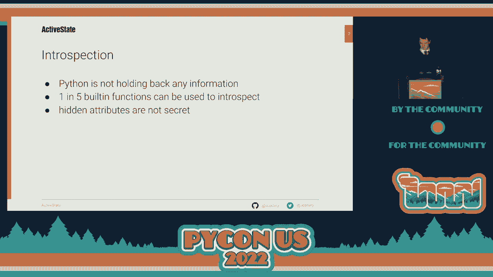
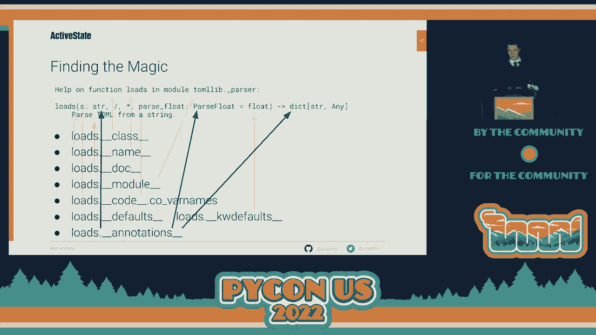
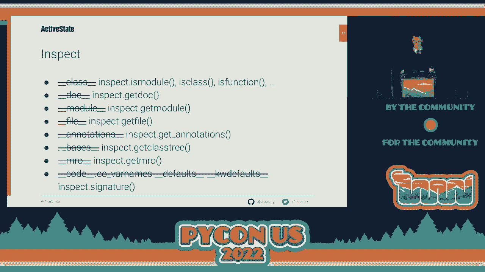
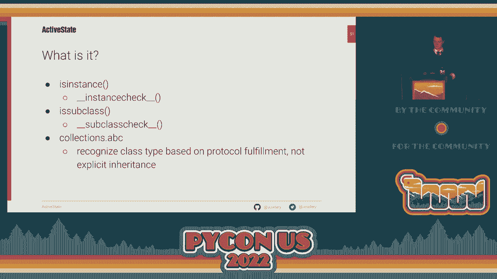
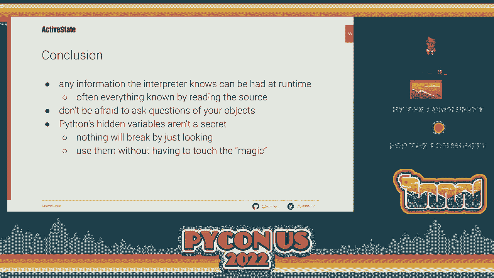

# Python反射教程：P38：反射简介

## 概述
在本节课中，我们将要学习Python中的反射。反射是代码查看自身的能力。我们将探索Python解释器如何查看运行中的代码，并学习如何获取相同的信息。课程将涵盖内置函数、特殊方法（魔法方法）以及`inspect`标准库模块的使用。

---

## 1. 反射的基本概念

反射是代码查看自身的能力。Python内置了强大的反射功能，目前有大约70个内置函数，其中约15个专门用于查看代码和提取信息。

这些信息有些是隐藏的，有些是“魔法”，但没有什么是真正的秘密。Python并非有意隐藏这些内容，只是为了在常规编码时将它们放在一边。

---

## 2. 使用`help()`函数

如果我们想了解一个对象，可以从交互式解释器开始，简单地调用`help()`函数。

以下是使用`help()`的步骤：
1.  在交互式解释器中输入`help()`，可以获取如何使用帮助的指导。
2.  输入`help(help)`可以了解`help`函数本身的详细信息。
3.  输入`help(pickle)`可以获取关于`pickle`模块的详尽信息。

`help()`的输出结构清晰：
*   首先描述对象的类型和名称。
*   接着显示对象的文档字符串（`docstring`）。
*   然后列出模块中定义的所有类及其继承关系。
*   对于每个类，列出其所有方法。
*   接着列出模块中的所有顶级函数及其签名。
*   最后显示模块中的常量和源代码位置。

然而，`help()`函数有一个关键限制：它不返回任何值。所有信息都输出到屏幕，程序无法捕获这些信息来做决策。

---

## 3. 探索Python对象模型

既然`help()`无法提供程序可用的数据，我们需要深入Python对象模型来寻找信息。这些信息存储在对象的“魔法属性”中。

在Python中，魔法方法（Dunders）是指以双下划线开头和结尾的特殊方法，例如`__str__`。解释器使用这些方法来运行程序。

### 3.1 使用`print`和`repr`
`print()`函数通过调用对象的`__str__`魔法方法来获取其字符串表示。在交互式解释器中直接输入对象名，则会调用`repr()`函数，它使用`__repr__`魔法方法。虽然两者输出可能相似，但并不可靠，因为开发者可以重写这些方法。

### 3.2 访问魔法属性
为了获取`help()`展示的信息，我们可以直接访问对象的魔法属性。

以下是关键魔法属性：
*   `__class__`：对象的类型。
*   `__name__`：对象的规范名称。
*   `__doc__`：对象的文档字符串。
*   `__file__`：对象定义所在的文件（适用于模块）。
*   `__module__`：对象所属的模块（适用于类、函数）。
*   `__bases__`：类的直接父类（元组形式）。
*   `__mro__`：方法解析顺序。

对于函数，获取签名信息更为复杂：
*   参数名称存储在`__code__.co_varnames`中。
*   参数的默认值存储在`__defaults__`和`__kwdefaults__`中。
*   类型注解存储在`__annotations__`中。

通过访问这些属性，我们可以重建`help()`输出的所有信息，并以程序可用的形式存储。

---

## 4. 使用`inspect`标准库模块

手动访问魔法属性虽然可行，但较为繁琐且容易出错。Python提供了更优雅的解决方案：`inspect`模块。

`inspect`模块专门用于检查运行中的代码。它提供了一系列函数，可以安全、统一地获取对象信息，无需直接处理魔法属性。

以下是`inspect`模块的一些常用函数：
*   `inspect.getdoc(obj)`：获取对象的文档字符串。
*   `inspect.getfile(obj)`：获取对象定义所在的文件。
*   `inspect.signature(func)`：获取函数的签名。
*   `inspect.isclass(obj)`, `inspect.isfunction(obj)`等：判断对象的类型。

使用`inspect`模块更加安全，因为它能处理更多边缘情况，并且函数名清晰地表明了查询的意图。

---

## 5. 判断对象类型与能力

在深入检查对象之前，最好先判断对象的类型和能力，以便提出合适的问题。

以下是相关的内置函数：
*   `type(obj)`：总是返回对象的类型。在Python中，一切皆对象，因此此函数总是有效。
*   `id(obj)`：返回对象的唯一标识符。
*   `callable(obj)`：判断对象是否可调用（如函数、类、有`__call__`方法的实例）。
*   `isinstance(obj, class)`：判断对象是否是某个类（或其子类）的实例。
*   `issubclass(cls, class)`：判断一个类是否是另一个类的子类。

**注意**：`isinstance`和`issubclass`可以配合抽象基类（ABC）使用，以检查对象是否实现了特定协议（如可迭代、序列），而不仅仅是检查继承关系。

---

## 6. 获取对象的成员列表

`help()`能够列出模块或类的所有成员。在程序中，我们也有多种方法获取对象的属性。

以下是获取对象成员的方法：
1.  `vars(obj)`：返回对象`__dict__`属性的副本，即其属性和值的映射。不传递参数时，返回当前局部作用域的字典。
2.  `locals()`和`globals()`：分别返回当前局部和全局作用域的字典。
3.  `dir(obj)`：尝试列出对象所有可访问的属性名称，包括通过继承获得的属性。它尽力而为，但在动态语言中无法保证完全准确。
4.  `inspect.getmembers(obj)`：结合了`vars`和`dir`的优点，返回对象所有成员的`(名称, 值)`对列表。
5.  `hasattr(obj, name)`和`getattr(obj, name)`：最精确的方法，它们模拟了点号`.`属性访问的查找过程，可以明确判断属性是否存在并获取其值。

---

## 总结
本节课中我们一起学习了Python反射的核心概念。我们了解到：
1.  反射是代码内省自身的能力。
2.  `help()`函数能提供丰富信息，但无法被程序捕获。
3.  信息存储在对象的魔法属性（如`__name__`, `__doc__`）中。
4.  `inspect`模块提供了更安全、便捷的API来获取这些信息。
5.  可以使用`type()`, `callable()`等函数预先判断对象的类型和能力。
6.  可以使用`dir()`, `vars()`, `inspect.getmembers()`等函数获取对象的成员列表。

Python并没有对你隐藏秘密，魔法属性被“隐藏”只是为了避免在常规编程中被意外使用。请放心地在交互式环境或代码中探索你的对象，这没有任何风险。