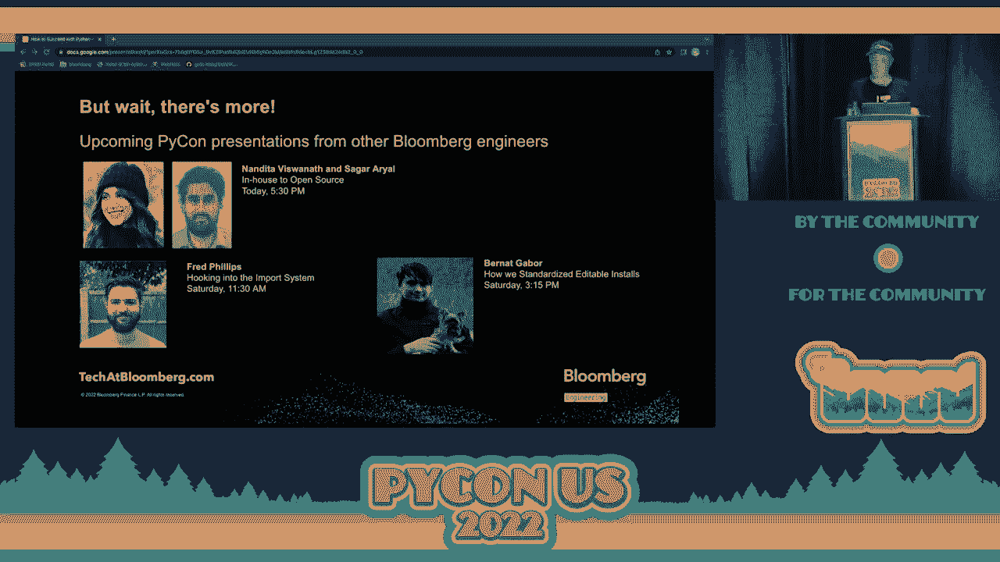

# Python在企业中的成功应用：P42：演讲 - Greg Compestine


## 概述
在本教程中，我们将学习Greg Compestine在彭博社（Bloomberg）推动Python成功应用的经验。我们将了解一个大型企业如何从零开始建立强大的Python生态系统，涵盖社区建设、技术架构、团队协作以及克服挑战的策略。无论你是开发者还是技术管理者，这些实践经验都将为你提供宝贵的参考。

---

## 章节 1：背景与起点 🏢

上一节我们概述了本教程的主题，本节中我们来看看彭博社的背景以及Python引入的初始环境。

彭博社是一家全球性的金融信息和软件公司。公司成立40周年，在全球拥有近200个办事处和超过20,000名员工，其中近7,000人是软件工程师。在很长一段时间里，C++是公司首选的开发语言。

大约在2000年代中期，JavaScript开始在用户界面开发中获得关注，Python也开始崭露头角。演讲者本人在2007年左右于另一家公司开始使用Python，主要用于数据处理和构建自动化流程。

当时，公司内部调查或尝试使用了多种编程语言，但没有任何一种语言能取得像Python那样的成功。Python成功的基础建立在三个核心支柱之上。

以下是Python成功应用的三个核心支柱：
1.  **强烈的社区兴趣**：开发者对Python作为通用工具抱有浓厚兴趣。
2.  **有效的组织协调**：通过建立专门组织来管理社区沟通与协作。
3.  **计划的技术支持**：公司为Python的推广和应用提供了有计划的技术支持。

---

## 章节 2：社区驱动的萌芽 🌱

上一节我们介绍了Python应用的三个支柱，本节中我们来看看社区兴趣是如何转化为实际动力的。

起初，社区兴趣与其他公司类似。开发者将Python视为一个配备了“电池”的通用工具，可用于数据分析、机器学习或快速搭建网络服务。

然而，在彭博社这样的企业环境中，仅凭通用功能是不够的。公司内部存在大量定制的网络和数据库API。如果开发者只使用标准Python库，他们的工作成果就会成为“孤岛”，无法与公司内部的其他核心应用程序进行通信。

转机来自一个实习生项目。该实习生成功封装了一些流行的C++库，使其能够嵌入到Python解释器中。这一突破使得开发者能够用Python编写真正的业务应用程序，并与公司内部系统进行交互。从此，Python的应用开始迅速增长。

与此同时，公司采纳了“公会”（Guild）的概念。公会是专注于某项特定技术的志愿者团体，旨在促进该技术的最佳实践。

以下是当时存在的一些公会：
*   Python公会
*   数据库公会
*   JavaScript公会
*   C++公会
*   测试公会

Python公会早期的工作包括组织内部会议、发送通讯、参与项目，并维护那个由实习生开发的扩展解释器。

---

## 章节 3：建立基础设施团队 🛠️

上一节我们看到了社区和公会如何推动Python发展，本节中我们来看看官方技术支持团队是如何成立的。

Python基础设施团队成立于2016年初，最初只有一名成员在旧金山。几个月后，演讲者作为第二名成员加入。团队设定了明确的技术目标。

以下是团队成立初期的核心目标：
1.  **稳定现状**：解决现有C++扩展解释器中的问题。
2.  **规划封装**：制定未来C++库封装的策略。
3.  **管理解释器**：建立解释器及其版本的管理机制。
4.  **改善部署**：解决软件打包和部署过程中的挑战。

团队到达时，社区的发展已经走在了前面。开发者自行下载不同版本的Python并构建应用，而公司内部存在多个由实习生开发的、一次性版本的扩展解释器。这导致了严重的依赖管理问题。

原有的基础设施是为分布式、独立的大型C++二进制应用设计的，与在共享解释器集上运行多个Python应用的概念不兼容。此外，早期的C++封装也存在诸多缺点，它仅仅是C++代码的薄包装，导致了许多C++的编程习惯和内存管理问题渗透到Python代码中。

---

## 章节 4：战略调整与内部开源 🤝

上一节我们了解了基础设施团队面临的挑战，本节中我们来看看他们采取了哪些关键策略来扭转局面。

团队首先明确了工作范围的界限。他们采用了“内部开源”（Inner Source）模型，即团队的所有项目都对内部社区开放，鼓励透明沟通和贡献。

团队专注于使用Python公会作为社区的代表，从他们那里获取关于未来计划的反馈和新API的设计意见。公会则帮助团队传播信息、组织内部聚会，并在在线讨论中提供支持。

团队还系统性地整理了文档，从一个简单的使命声明和FAQ开始，逐渐发展为包含每个支持软件包的详细参考手册和操作指南。

为了取代难以维护的旧扩展解释器，团队制定了一个新计划：为每个重要的C++库提供独立的、精心设计的Python软件包。这极大地改变了架构，减少了维护负担。

团队选取了公司内最流行的一个C++库，并与公会共同设计了一个新的Python API。其设计原则是：支持Python惯用法、保证良好性能、提供可靠解决方案。

然而，新API推出初期无人问津。团队通过与社区深入沟通，了解他们在使用旧API时遇到的痛点，并建议他们尝试新方案。随着时间推移，新API在性能和可靠性上证明了其价值，采纳度才逐渐提高。

---

## 章节 5：成果与现状 🏆

上一节我们介绍了团队推动技术采纳的策略，本节中我们来看看这些努力最终取得的成果。

如今，Python在彭博社内部已成为一门“一等公民”的编程语言。在公司招聘网站上，Python是出现频率最高的技术关键词之一。新员工入职培训也使用Python来介绍公司应用开发的概念。

内部Python社区已增长到数千名开发者，并且社区驱动的项目也大量涌现。这些项目在项目管理、文档和设计上，都借鉴了基础设施团队的模式。

C++库的原作者也开始使用这些Python封装库进行测试，并用Python编写自己的工具，形成了良好的协同。

当前公会的结构包括两名共同负责人，以及十几个由约20名成员组成的工作组，每个组专注于一个特定领域。基础设施团队也与公会保持着紧密的跨团队咨询关系。

大多数C++封装库现已进入维护阶段，运行稳定。团队当前的工作重点是改善解释器的升级体验、优化第三方依赖管理，以及提升开发者的整体开发体验。

---

## 章节 6：关键经验与建议 💡

上一节我们看到了Python在彭博社的成功现状，本节中我们来总结一下可供其他企业借鉴的关键经验。

如果希望在自己的公司培养类似的技术公会和社区，有几个方法被证明是有效的。

以下是培养成功公会和社区的关键建议：
1.  **纳入工作职责**：公会活动不能完全依赖志愿者的业余时间。应将其视为开发者正式职责的一部分，管理层需要为此预留时间。
2.  **管理升级生命周期**：技术升级（如Python版本）常被视为次要活动。需要向管理层阐明不升级的风险，并将其作为项目规划的一部分。
3.  **维护沟通文明**：在全球化、在线沟通为主的团队中，保持文明、包容的对话氛围至关重要。需要树立良好榜样，避免粗鲁或讽刺的言论。
4.  **利用诊断工具**：使用强大的工具来诊断和解决问题。例如，彭博社开源的 **`memray`** 工具，可以帮助深入分析应用程序的内存使用情况，无论底层是Python还是其他语言。
    ```bash
    # 示例：使用 memray 运行并分析脚本
    memray run my_script.py
    memray flamegraph my_script.bin
    ```

此外，彭博社的其他同事也在持续为开源社区做贡献，并在PyCon等大会上分享经验，这进一步促进了内外部的技术交流。



---

## 总结
在本教程中，我们一起学习了Greg Compestine分享的彭博社成功应用Python的完整路径。我们从企业背景和初期挑战开始，逐步了解了**社区驱动**、**公会组织**、**基础设施团队建设**、**内部开源模型**以及**战略性API设计**如何共同作用，将Python从一个小众工具转变为企业级的一流开发语言。核心经验表明，成功的关键在于**技术与管理并重**，**社区与官方协同**，以及**持续的沟通与透明**。希望这些经验能为你在自己的组织中推广和应用Python提供清晰的蓝图和实用的建议。