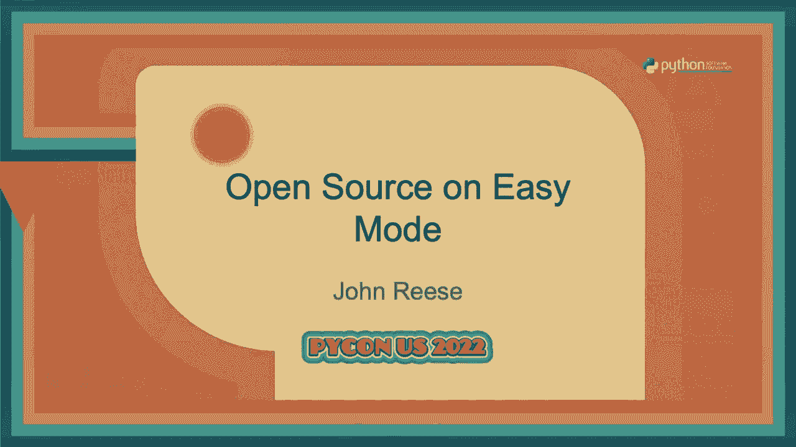
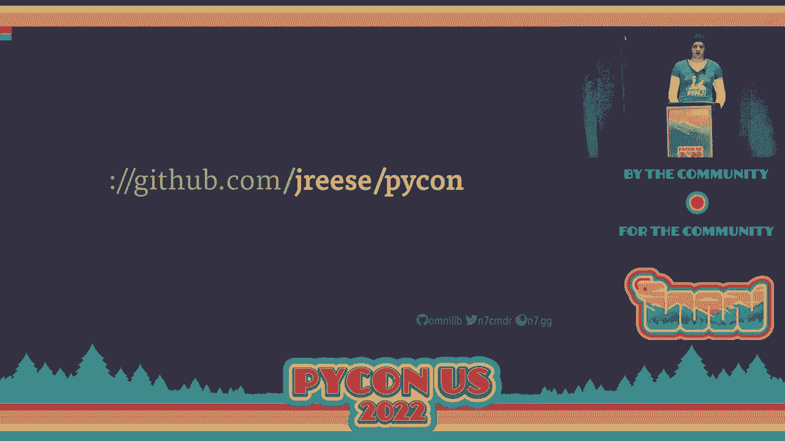
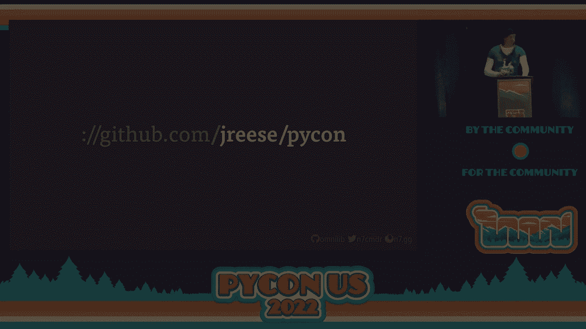

# Python开源项目维护：P45：开源简单模式 🛠️




在本教程中，我们将学习如何通过一系列工具和最佳实践，构建一个连贯的端到端开发者体验。这些实践旨在减少维护开源Python项目所需的总体工作量。我们将快速涵盖项目元数据、依赖管理、开发工作流程、代码质量、文档、社区贡献和项目发布等多个方面。

---

## Python开源项目维护：1：项目元数据与依赖管理 📦

上一节我们介绍了本教程的整体目标，本节中我们来看看项目的基础部分：元数据和依赖管理。这是项目发布和分发的核心。

### 项目元数据

项目元数据是发布包到PyPI的核心要求。结构良好且标准化的元数据能让开发工具更好地理解我们的项目。传统方法使用`setup.py`，但这本质上是需要执行的任意代码，缺乏标准化。

更好的方法是使用一个明确定义的、不涉及执行他人代码的格式。Python社区已经批准了`pyproject.toml`标准。该文件位于项目根目录，是项目元数据和开发工具配置的中心。

`pyproject.toml`最初的标准集中在构建后端的选择上。PEP 517和518定义了构建系统表，包管理器可以使用它来安装偏好的构建后端并构建包。

```toml
[build-system]
requires = ["flit_core>=3.2"]
build-backend = "flit_core.buildapi"
```

如今，根据PEP 621，`pyproject.toml`还可以包含标准化的项目元数据。这种新格式位于文件的顶层`[project]`表中，包含了所有基本的包信息。

```toml
[project]
name = "my-awesome-package"
version = "1.0.0"
description = "A package for doing awesome things"
requires-python = ">=3.8"
dependencies = [
    "requests>=2.25.0",
    "click>=7.1.0",
]
```

### 依赖管理

仅仅列出依赖项通常不够，这可能导致用户因版本或平台问题而报告错误。因此，我们需要更好地定义依赖关系。

软件会变化，包会获得新功能或进行破坏性更改。我们可以对依赖项设置版本限制，以确保包管理器安装兼容版本。

*   **固定版本**：`dependency == 1.2.3`。这能保证兼容性，但对用户不便，特别是当其他包需要不同版本时。
*   **宽松限制**：`dependency >= 1.0.0, < 2.0.0`。这允许用户使用旧版本，但可能暴露于安全风险。
*   **面向未来的限制**：`dependency >= 1.2.0`。我们只指定下限，相信依赖项不会突然破坏兼容性。这使用户能升级到更安全的版本，也意味着我们无需在依赖项每次更新时都发布新版本。

我们还可以为依赖项添加环境标记，以支持特定平台或Python版本。

```toml
[project]
dependencies = [
    "pywin32 >= 1.0; sys_platform == 'win32'",
]
```

### 验证依赖限制

设置了版本限制后，我们需要验证它们是否正确。我们需要在每个允许的版本上进行测试。工具`pessimist`可以解决这个问题。它会查看项目依赖关系，并对所有匹配版本运行测试，然后生成报告。

```bash
pessimist --quick  # 快速模式，仅测试最旧和最新版本
```

---

## Python开源项目维护：2：构建可重现的开发工作流程 🔄

上一节我们确保了项目元数据和依赖的可靠性，本节中我们来看看如何构建一个可重现的开发工作流程。这能简化开发、测试过程，并让新开发者更容易上手。

仅仅拥有一份命令列表没有帮助，我们需要一个专用的命令运行器来组合所有构建和测试步骤。虽然`make`可以满足基本需求，但它对Python项目了解不足。

理想情况下，我们希望工具能为我们设置虚拟环境和安装依赖项，并能通过单个命令在多个Python版本上运行。`Tox`和`Nox`是常见的选择。这里介绍一个名为`thx`（Thaxx）的新工具，它专注于优化Python项目的开发工作流程。

`thx`完全在`pyproject.toml`中配置。定义作业非常简单：

```toml
[tool.thx.jobs]
test = "pytest"
lint = "flake8 src/"
format = "black --check src/"

[tool.thx.default]
jobs = ["lint", "format", "test"]
```

运行`thx`时，它会在虚拟环境中执行默认作业。如果作业失败，会给出清晰的错误输出。

### 多版本支持与并行执行

`thx`支持在多个Python版本上运行工作流程。只需指定版本列表，`thx`会为每个版本创建独立的虚拟环境并并行运行作业。

```toml
[tool.thx]
pythons = ["3.8", "3.9", "3.10", "3.11"]
```

对于某些作业（如代码格式化），只需运行一次。可以将其标记为`once = true`。对于复杂的多步骤作业，可以定义步骤列表并按顺序运行。如果步骤间无依赖，可以标记为`parallel = true`以实现并行执行，充分利用多核系统。

### 监视模式

`thx`还有一个监视模式，可以监听文件变化并在每次修改后自动重新运行任务，为开发提供即时反馈。

---

## Python开源项目维护：3：提升代码质量 ✨

现在我们有了构建工作流程的工具，本节中我们来看看如何提升代码质量。更好的代码意味着项目更可靠、更易于阅读和维护。

### 代码风格与格式化

代码风格的一致性至关重要。选择一个代码格式化工具（如`black`）并使其自动化。`black`具有强大的安全保证，配置简单，能结束所有风格争论。

```toml
[tool.black]
line-length = 88
target-version = ['py38']
```

### 导入排序

除了代码风格，导入语句的排序也很重要。工具`usort`可以安全地自动排序导入，它能理解语法树，并将导入语句分组（标准库、第三方、第一方）。

```python
# 排序前
import sys
from myapp import something
import os
from third_party import library

# 排序后
import os
import sys

from third_party import library

from myapp import something
```

`usort`会将干预语句（如函数调用）视为障碍，确保导入移动的安全性。

### 组合工具：`uformat`

单独运行多个格式化工具容易导致冲突。`uformat`是一个组合工具，它在内存中将`black`格式化和`usort`排序作为一个原子步骤执行，保证了结果的一致性。

### 使用 Linter 发现潜在问题

Linter 可以帮助发现代码中的潜在错误和不良实践。`flake8`是一个优秀的选择，它易于配置并有丰富的插件生态。

建议关闭与代码风格相关的 lint 错误，让格式化工具负责风格，让 linter 专注于发现逻辑问题。

### 静态类型检查

类型检查器（如`mypy`）能进行更深入的分析，确保值在代码库中正确传递和使用。添加类型注解不仅能帮助发现错误，还能作为优秀的验证文档。

```python
# 无类型注解
def get_user(id):
    ...

# 有类型注解
from typing import Optional
def get_user(id: int) -> Optional[User]:
    ...
```

对于开源项目，建议使用`mypy`。如果愿意全面注解，可以启用严格模式以发现更多问题。

---

## Python开源项目维护：4：文档与社区互动 📖

上一节我们讨论了提升代码质量的工具，本节中我们来看看如何维护项目文档并简化社区互动流程。

### 自动化文档生成

清晰的文档至关重要。`Sphinx`是专为Python设计的文档生成工具，它能将一组源文档编译成完整的网站。`Sphinx`使用reStructuredText格式，并支持自动从源代码中提取API文档（包括文档字符串和类型信息）。

通过`autodoc`扩展，我们可以轻松地将代码中的文档集成到生成的网站中。

```rst
.. automodule:: mymodule
   :members:
```

### 文档托管

`Read the Docs`是一个优秀的免费服务，用于构建和托管项目文档。它与GitHub集成良好，支持在每次代码推送或创建拉取请求时自动构建文档。

### 设定社区期望

积极的社区互动需要明确的期望。
*   **行为准则**：制定并执行行为准则（如Contributor Covenant），以应对不当行为。
*   **贡献指南**：明确说明接受何种贡献（如仅错误修复、功能请求），以及贡献前是否需要先开issue讨论。
*   **管理时间**：明确你的支持级别，不要过度承诺。你的时间属于你自己。

### 简化贡献流程

降低贡献门槛能获得更高质量的贡献。
*   **贡献者指南**：详细说明如何设置环境、运行测试、代码风格要求等。
*   **可重复的工作流程**：确保贡献者使用与你相同的开发工作流程。
*   **Issue和PR模板**：使用模板引导用户提供必要信息（如复现步骤、环境详情）。
*   **持续集成**：使用CI（如GitHub Actions）自动测试贡献，在多个系统和Python版本上运行，并直接提供反馈。

---

## Python开源项目维护：5：项目发布与总结 🚀

上一节我们探讨了如何培育社区，本节中我们来看看项目发布的最后一步，并对本教程进行总结。

### 版本管理

选择并坚持一个版本号方案（如语义化版本`semver`或基于日历的版本），并清晰地传达你的版本计划。一致性是关键。

### 自动化发布流程

发布过程应该尽可能自动化、可重复。
*   **基于标签**：发布应基于版本控制中的标签。
*   **变更日志**：使用工具（如`attribution`）自动生成变更日志。
*   **构建分发版**：需要构建两种主要分发格式：
    *   **Wheel**：二进制分发，安装快速，但特定于平台和Python版本。
    *   **源分发**：可在任何地方重建，是最后的保障。
*   **CI辅助构建**：利用`cibuildwheel`等项目在CI中自动化构建支持多平台/版本的wheel。

### 总结

在本教程中，我们一起学习了构建和维护一个健康Python开源项目的完整生命周期：
1.  **使用`pyproject.toml`管理标准化的项目元数据和依赖**，并通过工具验证依赖限制。
2.  **利用`thx`等工具创建可重现、高效且支持多版本的开发工作流程**。
3.  **通过`black`、`usort`/`uformat`、`flake8`和`mypy`等工具自动化提升代码质量和可靠性**。
4.  **使用`Sphinx`和`Read the Docs`自动化生成和托管项目文档**。
5.  **通过明确的准则、详细的贡献指南和CI/CD管道来培育社区并简化贡献流程**。
6.  **制定清晰的版本策略并自动化发布流程**。





记住，这是你的项目和生活。运用这些工具和最佳实践的目的是为了减少维护负担，让你能更专注于创造价值，并享受开源的乐趣。祝你编码愉快！