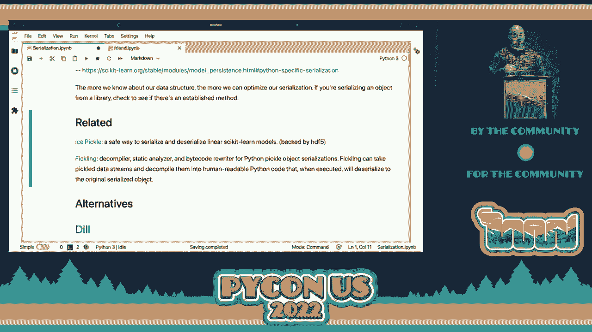
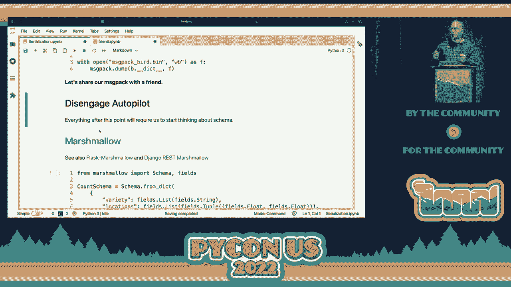
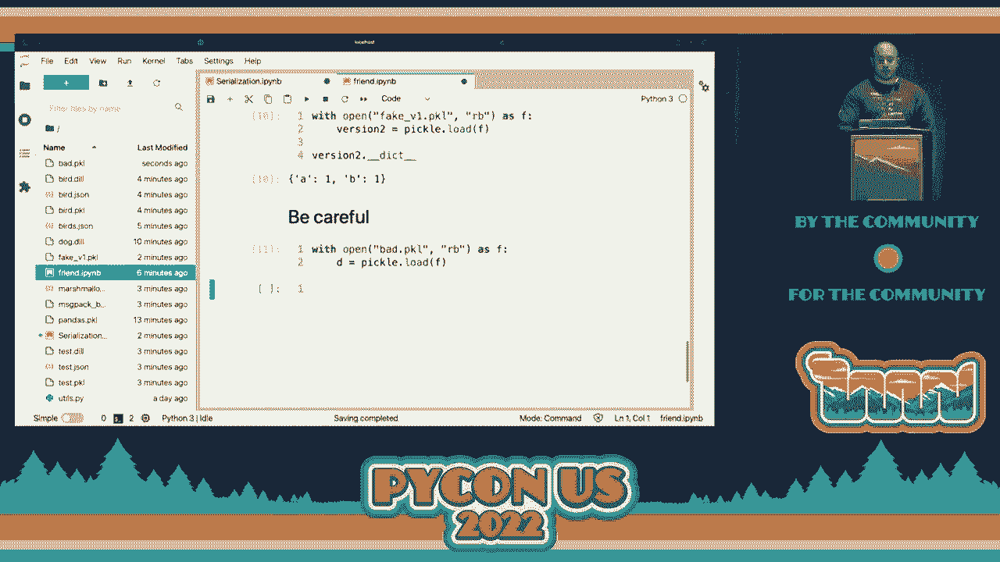
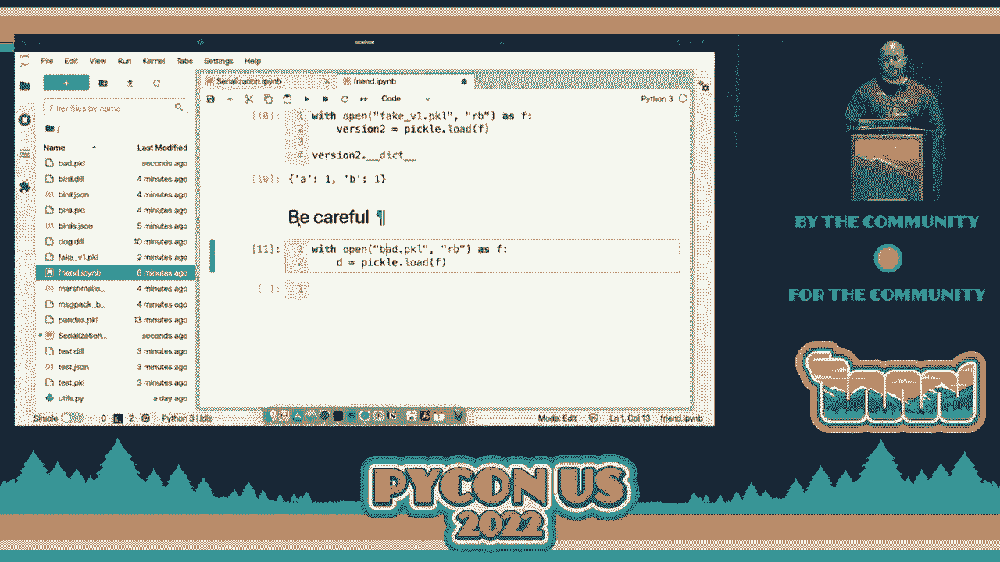

# P46：演讲 - 约瑟夫·卢卡斯 _ 序列化 超越腌制 - VikingDen7 - BV1f8411Y7cP

欢迎来到今天下午的会议。

现在我们有乔·卢卡斯在这里首次亮相 PyCon，谈论序列化超过腌制。让我们给他一个热烈的掌声。谢谢大家。替代标题可以是序列化和非偏见的介绍。我们将讨论 pickle 及其他格式，并比较一些优缺点。

我不会使用幻灯片。我将通过 Jupyter Notebooks 进行演示。因此，对于不熟悉这种格式的人，我们有这些可编辑的部分，我们将在其中运行一些代码并查看输出。这些笔记本可在此存储库中获取，演示期间我将使用它们。

eBird API 作为一个例子。我认为在每个人的 PyCon 旅程中，都会有一个时刻，公开可用的 API 会很有用，你可以用来测试一些东西。他们会给你一个 API 密钥。他们有一系列不同的 API 可以使用。我认为这是他们提供的一个很酷的服务。因此，我鼓励大家去看看。同时我也想提一下 Operation Code，这是一个非营利组织，帮助退伍军人与他们的家人开始软件开发的职业生涯。如果你是可以从一些指导中受益或有兴趣指导那样的人，请查看一下。

家庭开始软件开发的职业生涯。所以，如果你是一个可以受益于一些指导或有兴趣指导这些人的人，请查看一下。因此，从一些定义开始，序列化。它是将数据转换为可以存储、传输或后续重建的东西。

这并不是传输或存储它们的行为。它只是将数据转换为那种格式，通常像是字节流。那么我们如何安排这些字节的顺序，以便我们能够在另一端重建它？同时值得一提的是，反序列化有时是困难的，对吧？

我们必须建立这些标准，你会经常看到反序列化的错误导致安全漏洞。因此，序列化的两个主要类别是明文（plaintext），这样你可以打开文件并读取，或是二进制（binary），而那样是不可行的。我们在这里主要讨论二进制序列化，但我们可能会稍微谈谈明文。

那么，为什么你可能需要序列化数据，或者你什么时候会这样做？

一个例子可能是，如果你花了几个小时训练一个机器学习模型，如何保存它并在之后使用？你如何将它部署到生产环境中？

你如何与同事分享它？没错，因为你不希望他们再经历重新训练的过程。或者假设你在内存中构建了一些需要高成本查询的对象。这些查询在金钱上或时间上是否昂贵？或者在变化数据上的时间相关查询？当然，你可以将这些数据保存为 CSV 文件或某种数据库。

但是如果你已经围绕这些数据构建了一个对象，并且已经进行了某些后处理，你可能想要保存这个中间表示，以便与同事共享。例如，我认为序列化最广泛使用的原因是两个方之间的数据传输。当数据通过网络传输时，它需要以字节流的形式存在。

我们如何将这些字节按顺序排列，以便在另一端能够正确读取？

所以我们将快速查看 API。我们只是请求犹他州最近的观察结果，并查看第一个结果。这只是为了让我们稍微理解后面的场景。API 给我们返回了一堆东西。我们主要会关注通用名称。所以这里返回给我们的第一只鸟是 Woodhouse's scrub j。

我不知道那是什么样子的。但这是看到它的经纬度。所以这是我们在这种情况下将要处理的数据形状。因此，这里的场景是我们构建了一个鸟类计数器类，可能会实例化一些对象。我们希望序列化这个类，以便我们的同事不必做相同的 API 调用。

或者做相同的计算。因此，这个类有一个品种属性，它只是 eBird API 返回的每种品种的列表。然后我们将构建一些经纬度位置的元组。所以在这里我们将把这个类实例化为对象 B，并调用 getBirds 方法，然后检查其中的一些属性。因此，在这个例子中，有 266 只鸟可以在这里看到。

我们将使用这些属性作为我们证明或检查反序列化是否正确进行的方式，通过我们将在演示过程中回顾的各种方法。在这种情况下，构造对象并调用方法的整个过程仅花费了毫秒级的时间。但想象一下，你正在对多个数据库进行数据库查询。

将这些数据融合在一起。这可能需要几个小时。因此，这可能是你需要序列化的情况，以便你不必再次做这项工作。在 Python 标准库中，我们有 pickle。pickle 有很多很棒的功能，非常用户友好。要将对象写入 pickle，我们只需打开一个可以写入二进制数据的文件。

来转储我们的 pickle。Jupyter 在这里有这个文件浏览器功能。所以我们现在看到我们创建了这个 bird.pickle 对象。现在我们将加载这个 pickle，以确保它是我们想象的那样。因此，事实证明我们可以将那个二进制块加载回去，结果是一样的。

仍然有 266 只鸟。第一只仍然是 Woodhouse's scrub j。现在我提到的一个用例是与同事协作。那么让我们与朋友共享这个 pickle。在这个新的笔记本中，它是一个完全独立的内核。没有任何变量或其他内容与另一个笔记本共享。

所以我们的朋友将运行我们刚刚运行的完全相同的代码来加载 pickle。但他们做不到。他们遇到了这个奇怪的属性错误。获得这个错误实际上是促使我写这个演讲的原因。所以我正在构建一个夺旗比赛，想让参赛者能够提交。

我训练了机器学习模型，然后进行测试。但我不想关心他们使用的库或结构是什么。所以我希望他们能够使用 scikit learn、pytorch 或 TensorFlow。我希望他们提交这些东西的门槛非常低。

我不想让他们提交一堆额外的元数据让我理解。我们稍后会回到这一点。但对于遇到这个错误的其他人来说，关键是 pickle 并不是像 zip 文件那样工作。它并不会把你所需的一切打包进这个二进制文件。相反，这实际上非常吸引人，关于这个的精彩文章我不会深入探讨。

它是一种基于栈的虚拟机，并且有这些引用系统。因此，在我们朋友的笔记本上，他们实际上需要知道鸟计数器对象是什么。那个类是什么样的？所以如果他们在这里定义了那个类，他们现在可以成功加载那个 pickle，并看到有 266 只鸟，其中一只是 Woodhouse 的 Scrub Jay。

重要的是要注意，我们的朋友实际上并没有运行任何代码。他们只是引用了对象或类定义。因此，他们没有我们的 API 密钥来运行该查询。这个对象是从二进制 pickle 重构的。我们从未调用构造函数或其他任何方法。所以 pickle 的一些优点是，它在标准库中。我认为每个人都应该稍微偏向于导入新库，如果可以的话。我们不需要定义一个模式，我们稍后会谈到，但就像是定义数据及其类型的系统。而且 pickle 文档非常完备，尽管它有一些尖锐的边缘，且使用得当。

在其他例子中有恶意使用的情况。因此，文档非常出色。他们提供了一些安全使用的指导。他们将其与 JSON 进行了比较，讨论了格式的结构。实际上，pickle 有不同的协议，你可能会在不同时间使用。然后，他们定义了什么可以被 pickle 或 unpickle，我们稍后也会谈到这个。

一些缺点是我一直提到的安全考虑，我稍后会演示这一点。它只与 Python 互操作。因此，如果你在企业工作，认为我需要持久化或序列化这个对象，并且它可能需要被一些 Java 代码读取，那么 pickle 可能不是最佳格式。正如我们在另一个笔记本中看到的。

加载仍然需要访问类定义。我最近了解到，pandas 对任意数据有一个序列化方法，而不仅仅是数据框。因此，如果你有 pandas 可用，你可以在这里用 pandas 对数据进行序列化。还有一些其他很酷的功能建立在 pickle 之上。

所以 shelve 是一种数据库结构，你可以有一个字符串作为键，然后值可以是任何可以被序列化的内容。因此现在你可以在一个有序的键值结构中引用你的序列化数据块。在这个示例中，如果我们想每天创建一个新的鸟类计数器，我们可以创建某种键，然后索引并找到这些数据块。

Joblib 也是一个很酷的库。它在底层使用 pickle，但对大型和非结构化数组进行了优化。因此，这是 scikit-learn 模型的推荐解决方案。这种想法，比如，嘿，也许我们可以进行一些优化，而我们对数据结构有一定了解，这真的很重要。所以我们稍后在讨论 schema 时会看到。

但你对正在序列化的内容了解得越多，就越能在速度或空间上进行优化。这里还有一些其他有趣的项目，比如 ice pickle。

这是一种安全序列化和反序列化线性 scikit-learn 模型的方法，我认为它是。

这里值得一看。这建立在了解你正在序列化和反序列化的概念之上。你知道他们使用这种 H5 格式，但每个 scikit-learn 线性模型只会有系数、截距和可能的类别。因此我们可以利用这个结构，并将其转储到序列化格式中，并准确知道我们想如何提取它。

ice pickle 的全部意义在于它避免了 pickle 中一些潜在不安全的功能。Trail of bits 也进行了大量的研究，专注于 pickle 的安全性研究。他们提供了一个工具 fickling，允许你对 pickle 进行一些安全分析。现在我们将转向一些替代方案。因此，dill 是一个可替代 pickle 的工具，你可以以相同的方式使用 dump 和 load。

它具有扩展的功能，因此你甚至可以保存整个解释器会话，而不仅仅是一个对象，主要用途是将 Python 对象作为字节流跨网络发送。因此，dill 是我最终用于捕获旗帜示例的工具。任何竞争者都可以将他们的分类器和 dill 打包，我就能在他们的环境中使用它。

接收端。在这种情况下，我们对鸟类计数器做了一个小修改。我们把它称为狗计数器，唯一的原因是为了表明我们的朋友对狗计数器毫无了解。他们不知道如何重建那个对象。因此，我们将在这里初始化一个 d，并查看有多少只狗。

结果表明，狗和鸟是相同的东西，所以仍然只有 266 个，然后我们会将其导出到一个 dill。我们的朋友现在没有关于狗计数器的知识，可以读取这个并看到有 266 只狗。所以我们可以看到，这种即插即用的功能给你带来了更多的可能性，但它可能会有一些权衡，我们稍后会讨论。另一种选择是消息包。

这是二进制序列化，所以一切都会压缩为二进制格式。他们宣传它小且高效，实际上他们提供了一些包装器，用于导出和加载，以便你可以使用那些你熟悉的方法。不过，当我们实际查看时，这里有一个重要的区别。

在消息包中实现这一点，我们序列化的是类属性，而不是整个对象。因此，当需要反序列化时，我们需要解压这些属性并重新初始化一个新对象。在这种情况下，这是有效的，但可能不是你想在每种情况下都这样做。这与消息包知道如何转换的数据类型有关。

二进制序列化格式。因此在此之前，我们实际上不需要担心模式。我们只需将对象放入一个方法，然后在另一端取出。之后的每一点，我们需要更多地考虑定义这些。

对象是。我要在这里讨论的第一个是 marshmallow，它有一些很好的集成。

对于快速 Django。在这里，marshmallow 使用这种字典结构来定义我们的模式。如果你还记得类定义，variety 是一个字符串列表，locations 是浮点元组的列表。所以我们在这里定义它。我们仍然引用那个第一对象 B。然后我们实际上将其导出为 JSON。

然后我们的朋友可以做一些有趣的事情。在这里，我们的朋友将他们的模式定义为一个类，但这些定义在功能上确实需要匹配。然后 marshmallow 提供了一整套功能，因为它知道模式，可以帮助你。因此，这里有一个 postload 装饰器，它做了我们在消息包中所做的事情。

它解压属性并利用这些属性重新初始化一个新对象。通过了解模式，marshmallow 还可以进行许多其他的数据验证工作，而这些是 dill 或 pickle 无法做到的，因为它们对模式不敏感。所以现在我们已经定义了一个模式，我们的朋友可以打开这个 JSON 再次看到。

它们是 266 只鸟。在这次讲座后，我需要查一下 Woodhouse 的 scrub jay 看起来是什么样子。我每次练习这次讲座时，看到的鸟都是不同的，对吧？

昨天是一只美国秃头鹰，我觉得那真的很酷。前一天是一只乌鸦，那就有点无聊。因此，你会注意到对于 message pack 和 marshmallow，我们仍然需要定义鸟计数类，因为我们将通过它重新初始化一个对象。

而我们在 dill 中不需要这样做。这让我想起了《星际迷航》中关于传送器的争论，比如传送器会杀死你吗？你在传送两边还是同一个人？

这也是同样的想法。同时还要注意，对于 marshmallow，发送到网络上的内容是 JSON。因此，如果你有一些内容并没有真正转换成 JSON，你将不得不自己编写一些序列化或反序列化函数。所以一些属于提前了解架构的其他内容是。

Avro 和 protobuff，它们是非常强大的解决方案，我不会深入讨论。它们值得独立的讨论，我认为之前有一个很棒的 protobuff 讲座。但它们属于同一类，即对你的架构有所了解。将其编译为二进制格式并发送到网络上，以便我们可以非常高效。

然后提供一些其他功能。值得谈谈 JSON，因为我们一直在使用这个 eBird API，它在进行 JSON 的双向通信。我认为 JSON 有很多优点。因此它是人类可读的，非常互操作。你会发现你使用的所有东西都有 JSON 读取库。然而，它的缺点是每次都附带架构。

所以当我们打开一个 JSON 对象时，它会包含架构。比如它会包含词汇、种类和位置。因为我们这里使用了一个非常宽泛的 JSON，其中种类是一个庞大的列表，我们可能不会注意到它的大小。但想象一下，如果你有一个非常深的架构，仅仅保存二进制值。

在这种情况下，JSON 变得非常低效。所以我们可以稍微谈谈时间和空间。这将是非常不科学的。我们将序列化同一个对象，并在这些不同的库中进行测量。我会说，根据你的数据形状，你会得到非常不同的行为。因此，理解你的数据格式以及你试图序列化的内容是很重要的。

以严谨的方式进行这项工作对于你的应用是非常重要的。在这里是 JSON。我认为我们通常看到这个对象的时间大约是毫秒级。12 千字节。Pickle 会更快。看吧。半毫秒，并且更紧凑。这就是我之前提到的与 Dil 相关的成本。Dil 为我们做了很多，但速度很慢。

它比 JSON 慢。在这个例子中，它基本上和 JSON 一样大。我可以看到在其他例子中这种情况变得更糟。Message pack 作为二进制格式很快且相对小。然后 Marshmallow，我认为速度合理，但由于将一些架构数据打包到数据包中而稍微大一些。

到目前为止，我们还讨论了一些相当标准的类型，比如墨水、字符串和列表。但这些并不一定在每种格式中都可以保持或可序列化。因此，例如 NumPy 数组无法序列化为 JSON。这是你需要自己处理的，或者真正去 NumPy 那里，它会帮助你解决这个问题。

我们可以尝试序列化一个函数。因此，JSON 无法序列化函数。但如果是命名函数，大多数情况下 Pickle 可以。这其中有一些例外，但 Pickle 无法序列化 Lambda，因为每个 Lambda 都是命名为 Lambda 的。因此，它在这方面会遇到很多麻烦，值得一提。地球的发现汇聚。

我谈到了 Pickle 文档，它非常明确。因此，如果你在寻找序列化器，我强烈推荐阅读那份文档页面。接下来，我认为我们需要讨论像 Avro 和 Protobuff 这样的产品为什么非常有用。对我来说，它们的主要价值主张在于架构版本控制和演变。

因此，我们可以把架构看作是我们期望某个东西在某一时刻的快照。这是一个虚假对象。它有这两个属性。我们可以创建一个，并将其转储到 Pickle 中。但假设一名新开发者在一年后加入项目。当他们查看代码时，这就是一个虚假对象在这一时刻演变的样子。

它有这个 C 属性。当它们加载这个旧的 Pickle 时，C 属性不存在。因此，这种演变以及更简单的序列化解决方案的无能为力可能会导致许多边缘案例。你的代码可能会表现出意想不到的行为或根本不工作。这对像爱好学习项目这样的情况可能无关紧要。

但当你考虑客户端-服务器架构时，这就变得重要了。因此，如果有很多客户端在序列化并向你发送数据，你可能无法依赖它们在你同时更新架构时都进行更新。因此，能够版本化或演变你的架构并让你的应用程序处理这种情况是非常重要的。

在序列化层可以非常好。因为这样你就不必编写所有这些处理不同情况的奇怪业务逻辑。我认为在讨论 Pickle 时，我们不能不强调安全性问题。

我不想就这么轻描淡写地过去。因此，Pickle 在 DC 意识到 Pickle 时使用了这个特殊的`dunder reduce`。这里需要返回这个元组。但是在这种情况下，除了返回，嘿，我们实际上是如何构造一个鸟类计数器的，我们将返回对系统命令的调用，对吧？这显然不是我们想要的。因此，当我们转储这个 Pickle 时，我们的朋友去运行它。

好吧，他们执行了 Pickle。

但事实证明，系统命令执行了。

所以我们确实强调了这是有问题的。因此我们提供了代码执行，这显然是危险的。

总之，您的序列化格式是一个设计决策，会影响许多事情，包括任何互操作性和安全性。您需要为合适的工作选择正确的工具。因此，我认为您会看到互联网上有一些绝对的文章大概说“永远不要使用 Pickle”。我不会走到那一步。我认为 Pickle 是一个非常好的工具。

您只需要了解何时使用它，它的局限性是什么。我不会建议每个人都去实现 protobuf，对吧？

这是一种重量级解决方案，可能并不是您所需的。因此，请考虑一下您的数据结构，思考一下您的数据结构可能会如何演变，然后选择相应的格式。感谢您的时间。[掌声]
