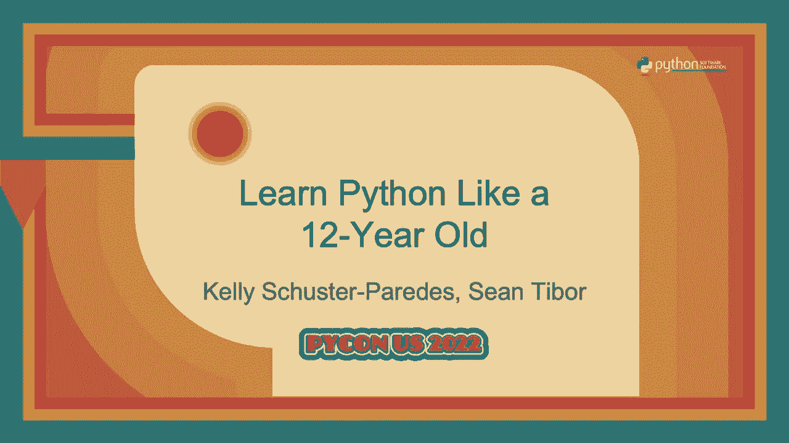
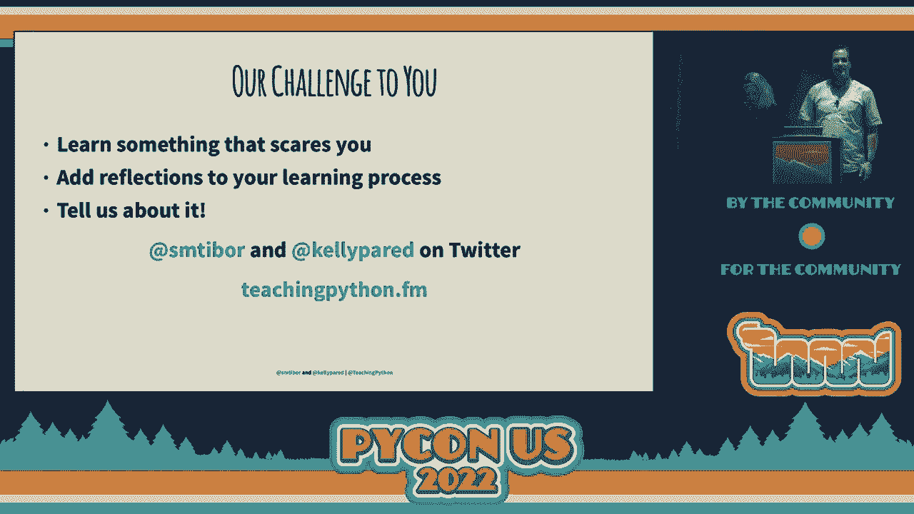

# 像12岁小孩一样学习Python：P49：谈话 - 凯利·舒斯特-帕雷德斯 & 肖恩·提博尔

## 概述
在本节课中，我们将探讨如何借鉴12岁孩子的学习方式，来更高效、更有趣地学习Python。我们将深入分析好奇心、感官参与、情感投入、承担风险以及元认知反思这五个核心要素，并学习如何将它们“黑客”到我们自己的学习过程中。

## 1. 保持好奇心 🧐
上一节我们介绍了课程的整体目标，本节中我们来看看第一个关键要素：好奇心。孩子们天生充满好奇心，这种广泛的求知欲是他们学习的强大驱动力。作为成年人，我们需要重新激活这种认知技能，将其视为可以锻炼的“心智肌肉”。

以下是培养好奇心的具体方法：
*   **质疑一切**：在学习代码时，不断问“这是如何工作的？”和“为什么这样有效？”。即使不能深究到最底层，这种追问也能加深理解。
*   **探索未知代码**：主动阅读与自己习惯不同的代码示例，例如《流畅的 Python》这类书籍，或研究PyPI上的各种库，看看Python还能做什么。
*   **寻找“坏”代码**：在GitHub上搜索项目，分析他人代码中“不够好”或“糟糕”的实现。思考“为什么这样做是错误的？”，这能反向巩固最佳实践。

## 2. 调动多重感官 👐👃
仅仅依靠视觉（看屏幕）和触觉（敲键盘）来学习是远远不够的。调动所有感官可以创造更丰富的学习体验，帮助大脑建立更牢固的记忆连接。

调动感官学习的关键在于创造独特的学习“仪式感”：
*   **关联特定感官**：例如，手握一杯热咖啡的香气、温度和味道，可以给大脑发出“现在是学习时间”的信号。
*   **关注整体体验**：在学习时，不仅关注看到的内容，还要留意自己的感受和整个环境的氛围。

## 3. 与情感共学，而非对抗 😄😤
情感是让知识持久留存的关键。孩子们会直接表达学习中的挫败感和成功后的喜悦，而成人常常压抑情感。我们需要学会识别并利用情感来促进学习。

以下是利用情感优化学习的策略：
*   **拆分学习任务**：将大目标分解为小块，缩短奖励周期。每完成一个小任务，就能获得一次成就感（多巴胺分泌）。例如，采用**番茄工作法**（学习25分钟，休息5分钟）。
*   **建立内在奖励**：与其依赖外在奖励（如吃块巧克力），不如创造内在奖励（如在社交媒体分享成果），这更能从内心激发积极情绪。
*   **检查情绪状态**：定期问自己“我现在感觉如何？”。识别压力（它会释放皮质醇，阻碍记忆形成）并主动调整，确保自己处于有利于学习的状态。

## 4. 勇于承担智力风险 🚀
孩子们在安全的环境下乐于尝试和冒险，这加速了他们的学习和创造性连接。成人大脑有约20%用于抑制风险，这有时会阻碍学习。我们需要主动创造可以“安全失败”的空间。

以下是承担学习风险的方法：
*   **学习跨界知识**：如果你是Web开发者，可以尝试学习数据科学或硬件编程，建立新的知识连接。
*   **尝试教学**：教别人是巩固学习并承担自尊风险的有效方式。正如凯利所说：“**我一生中从未写过一行代码。而现在她教过成千上万的学生。**”
*   **寻找“更糟糕”的方法**：故意尝试构建你认为可能会失败的东西。如果成功了，回报巨大；如果失败了，你也能从中学到宝贵经验。

## 5. 进行元认知反思 🤔
元认知即“对思考的思考”，是巩固学习、将短期记忆转化为长期记忆的关键步骤。通过反思学习过程本身，我们可以成为更高效的学习者。

以下是实践元认知反思的工具：
*   **定期反思**：每天或每次学习后，问自己：“我今天学到了什么？”或“我之前不知道什么？”
*   **应用“开始、停止、继续”框架**：
    *   **开始**：我将在学习中开始做什么新事情？（例如，开始尝试使用`requests`库）
    *   **停止**：我将停止做什么低效的事情？（例如，停止过度使用`turtle`模块做演示）
    *   **继续**：我将继续做什么有效的事情？（例如，继续用`pygame`制作简单应用）

## 总结与挑战
本节课中，我们一起学习了如何像12岁孩子一样，通过**激发好奇心**、**调动多重感官**、**善用情感力量**、**勇于智力冒险**和**坚持元认知反思**来“黑客”你的Python学习过程。

现在，我们对你提出挑战：
1.  **学习一件让你有点害怕的新事物**。
2.  **在你的学习过程中加入定期的反思环节**。
3.  **更加关注并优化你学习新知识的方式**。

记住肖恩分享的那句名言：“**我总是寻找我不能做的事情，以便我能学会做它们。**” 开始行动吧！

（课程结束）