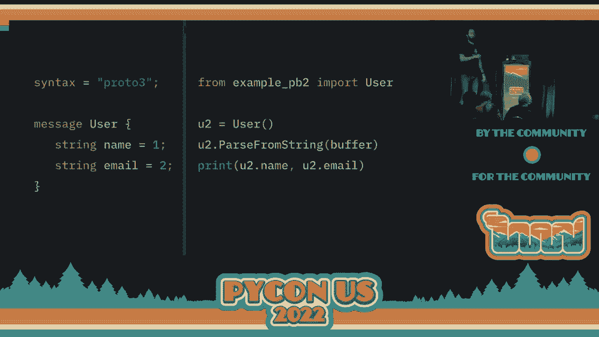
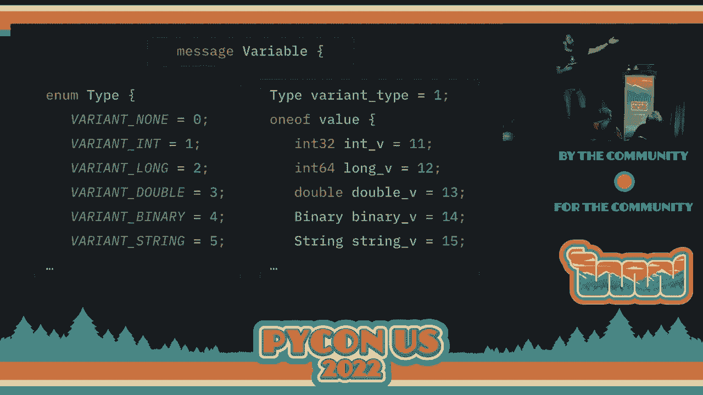

# P52：演讲 - Liran Haimovitch_ 有效的 Protobuf_ 你想知道的一切，但 - VikingDen7 - BV1f8411Y7cP

大家好。

欢迎来到这个是什么？我们的 415 次演讲。希望到目前为止你们已经听到了很棒的演讲。接下来的演讲是由 Lidon Heimovich 主讲。真不错吗？Rookout 的首席技术官和联合创始人。正如你所看到的，他在网络安全方面有广泛的经验。他在这里与我们讨论 Protobuf。好吧？我把时间留给他。谢谢。[掌声]，大家好。很高兴来到这里。

这是我第二次在 PyCon 演讲。三年前我在克利夫兰参加会议，就在疫情爆发前。我想知道有多少人在克利夫兰的 PyCon 上举过手？哦，太好了。很多人。我不确定你们是否见过我，但能再次见到大家真的很棒。对我来说，会议是缺失的。

今天，我将讨论 Protobuf 以及一般的序列化，是什么，它的必要性，以及如何充分利用它，注意事项。

在深入讨论之前，我想快速介绍一下自己。我叫 Lidon Heimovich。我是 Rookout 的首席技术官和联合创始人，稍后我会提到这一点。我今天大部分时间都在关注各种运行时及其在云环境中的操作。Python 绝对是我花费最多时间的一个。

以及 JVM 节点，我花了很多时间理解它们的运行方式以及如何在云环境中充分利用它们。它可能是在无服务器环境中的网络。在观察性上下文中花费大部分时间，如何理解应用程序中发生了什么。我们如何对它们进行监测，以及如何轻松获得高质量的数据。

我非常好奇幕后运作的方式，这可能有助于解释稍后我们将与 Protobuf 一起做的一些事情。

在深入讨论序列化之前，我希望你们先看一下这个。之所以从 Python 的 Hello World 应用开始，是因为这可能是你见过的第一个、最后一个，也是唯一一个没有变量的应用。每当我们想在软件工程中做一些有意义的事情时，我们都希望能够执行某个重要操作。

任何类型的程序，我们必须有变量。原因在于变量是我们在代码中管理数据的方式。字典的定义是变量是我们如何标记、存储和处理信息的。在高级计算机语言中，本质上，任何我们想从用户那里读取的东西，任何我们想作为输出写入的东西，以及任何我们想以任何方式、任何形式处理的东西。

我们将使用变量来做到这一点。显然，在幕后，Python 解释器并不太关心我们的变量。

发生的事情是，有一个 CPU 在运行我们的代码，某种层级上，Python 解释器或任何你使用的运行时都会分配内存或使用机器内的内存。我不会深入讨论虚拟内存与物理内存及其相关内容。但解释器使用应用程序的内存来存储和管理你的变量。如果你说。

例如，创建一个语句，使 x 等于 5，那么 Python 解释器就有两个任务要完成。第一个，它必须找到一些内存，x 将要驻留在其中。从现在起，每当提到 x 时，都将使用这个地址。它会将 5 放入那个内存地址。如果稍后你要做 x 等于 7，那么它将去同一个地址。

并更新为 7。如果你继续读取 x，那么它将从那个内存地址读取。现在，我之所以从变量开始，是因为变量是我们编写计算机程序的关键。那么接下来会是什么呢？

当我们想要让我们的应用程序与其他应用程序通信时，会发生什么？

也许我们想通过网络进行通信，发送请求到某个地方。也许我们想把一些数据存储在文件、磁盘上，或者甚至在数据库中，以便该应用程序或另一个应用程序在某个时候从内存中读取。现在，为此我们需要提取我们的信息。我们需要提取这些信息。

我们已经给了 Python 解释器，它存储在内存中的某个地方。我们需要以某种方式将其取回，因为我们并不知道内存中发生了什么。基本上，这就是序列化的核心。序列化就是将我们在内存中的信息提取出来并创建成一个流。

一系列字节或缓冲区。我们得到了，我知道，100 字节或 5K。无论如何，我们得到了某种数量的字节，以清晰和可用的方式表示我们想要的信息，然后可以将其保存到数据库，保存到磁盘，或者通过网络发送。这样，我们可以让其他应用程序，或者甚至是我们自己未来的应用程序，能够。

读取这些信息并加以利用。现在，在考虑序列化时，有很多种方式和考虑因素。首先，我想告诉你，不要自己编写。无论你做什么，无论你需要什么，你可能都不想自己编写。外面有很多有用的序列化方法。

每种方法都有其优缺点，你可能自己写的东西会有更多缺点而非优点。所以请你，除非你是专家，不要自己编写。选择一个已经存在的。现在，在你选择序列化引擎时，有一些事情需要记住。首先，你需要考虑你想要它可移植还是不可移植。

可移植性有许多因素。在可移植性方面。我能在另一个应用程序中读取我创建的这个缓冲区吗？我能在另一个运行时中读取它吗，比如，我能把它从 Python 移到 Java 或 JavaScript 吗？

我能在不同的操作系统或不同的 CPU 架构上使用它吗？

或者这些数据只在提供的上下文中有用？

在不同的可移植性层面上有各种限制。当然，我们都希望我们的代码是可移植的，因为为什么不呢？

我们希望代码可移植，数据也要可移植。问题是，如果你放弃可移植性，你通常可以采取各种捷径，让事情变得更简单。如果你追求可移植性，事情在过程中可能会变得更困难。其次，你需要决定是选择动态类型还是静态类型。

或者序列化。原因再次如同你为 Python 所做的。Python 最近引入了类型。但即便如此，我们经常创建小程序。我们只想写些快速且简单的东西。我们可以在没有类型的情况下去做，走一步算一步，简单易行。但后来这些程序会增长，代码库也会扩大。

作为我们生成数据的消费者，我们通常希望有静态类型，这样机器可以验证数据的正确性，也作为一种文档形式。因此，这会使其他工程师或未来的人更容易理解。

厨师们要理解数据的含义。最后但并非最不重要的是，我们必须在文本和二进制之间做出选择。文本通常是为人类设计的。这将使你的序列化更容易阅读。因此，当你获得那串字节流时，你很可能能够快速浏览并大致了解发生了什么。

你提取的数据是什么，它意味着什么。但是如果你选择二进制， chances are 你会很难理解发生了什么。但你会得到一个巨大的好处，二进制通常对机器更好。因此，如果选择二进制格式，性能通常会更好。

那么让我们看看几个你可能熟悉的流行框架，除了 protobuf，显然的。首先是 JSON，JavaScript 对象表示法。你们有多少人熟悉 JSON？几乎每个人都知道。所以我不会多说 JSON，但它几乎是今天网络上的标准。

我相信你知道它非常可移植，且非常文本化。所以你可以很容易地用肉眼读取。而且因为它被广泛采用，尽管是文本化的， chances are 即便如此，你在每个运行时中都会获得相当不错的性能，更不用说 Python 了，因为它会表现得很出色。另一方面，我们有 Pickle。你们有多少人熟悉 Pickle？哦。

还不错。因此，Pickle 是 Python 标准库中的一个内置包。它允许你用一行代码序列化任何 Python 对象，并在稍后读取。它的性能相当不错。Pickle 的最大缺点是可移植性。除了无法在 Python 外读取外，即使在 Python 内部，你可能也会发现。

如果你的应用程序或其他元素发生了变化，序列化对象会变得困难。因此这是一件需要牢记的事情。但如果你只是在寻找一些简单粗暴的东西来入门，Pickle 可以是短期序列化的不错选择。最后但并非最不重要的是，我们有 Protobuf，这几乎就是我们今天讨论的主题。在 Rookout。

我认为这是我们使用的最受欢迎的序列化平台之一。我们将其用于多个目的，原因有几个。首先是 Python -- Protobuf 是高度可移植的。我认为这是我最喜欢的选择之一。目前大约有 20 种语言支持 Protobuf。这对许多使用案例来说非常重要。Protobuf 提供静态类型，这使得记录你要序列化的内容变得简单明了。非常清楚你在序列化什么以及如何编写和读取。

这在性能上非常出色，既得益于静态类型，又得益于其二进制特性。Protobuf 在几乎所有运行时中表现优异，显然，Python 也是其中之一。它们其中之一。具有很好的向后和向前兼容性，因此你可以添加字段，也可以移除字段。一切基本上都会继续进行。这有点冗长的样板代码。

这显然是一个关键的重要性，因为在序列化内容时，常常涉及大量的样板代码。你需要将内存中所有的信息整理好，以便序列化算法能够接手。而 Protobuf 在利用大量自动生成的代码方面非常出色。我稍后会提到这一点。Protobuf 经过了长时间的考验。

它已经存在了 20 年，实际上 -- Google 在 2002 年开始内部使用它，几年后将其开源。如今，Protobuf 3 是大家使用的主要版本，而且已经存在了相当多的年份。并且有一个很好的社区。显然，没有什么能与 JSON 相提并论。

但这是一个相当不错的社区。我认为这是任何二进制序列化器中最活跃的社区。因此，这些就是我喜欢 Protobuf 的原因。现在，在你开始全面使用 Protobuf 之前，有一些事情需要注意，尤其是在你还没有熟悉 Protobuf 的情况下。首先，Protobuf 在某些情况下不太适用。

如果你确实想自己读取输出，输出将是二进制的。它将非常难以阅读。它不是文本的，不要尝试。同时请记住，如果你在使用 Protobuf，你需要一个规格。同一消息在使用不同规格时可能意味着不同的东西。

因此，消息的静态类型非常重要，以便能够读取它。如果你的消息变得太大，基本上超过几兆字节，那么序列化器可能没有针对这一点进行优化，你可能会遇到相当糟糕的性能。最后但同样重要的是，如果你处理的数据有专用的序列化算法。

显然，信息指标表示音频、视频、图像，这些都有各自专用的序列化格式。使用这些格式会更好，而不是使用一些通用的通用算法。

让我们快速回顾一下什么是 Protobuf 以及如何使用它。所以这就是我提到的，Protobuf 使用静态类型，你从创建一个协议开始。在我们的案例中，Protob，允许你定义任何你想序列化的数据。你首先定义你的头部，语法在我们这个案例中是 Protobuf3，然后你创建。

你可以创建任意多的消息。或者这是一条非常简单的消息。用户，它有两个字段。一个是姓名，另一个是电子邮件，它们都是字符串。而这里有字段编号，一个和二。现在 Protobuf 要求你指定字段编号的原因是，字段编号是消息编码的方式，并且对它们的向后兼容性至关重要。

因此，Protobuf 采用了 Python 的明确优于隐式的方法，要求你定义字段，以便它们不会随时间而改变，这对你来说非常明确，你可以管理它。因此，一旦我们得到了文件，我们使用 Protobuf 编译器，Protosy，来构建我们的 Python 文件，以便你可以使用它。Protobuf 几乎支持每个操作系统的编译器。

你可以看到安装它的一些更常见的命令行。然后你只需编写 Protosy，将 Python 输出到当前文件夹，创建我们的 protofy。现在我们有了。这非常，非常，非常简单。我们所做的就是可以导入。例如。我们的新类本质上是 Python 创建的一个类。

Protosy 创建了一个名为 user 的类，以表示我们的用户消息。我们导入它。我们创建一个对象。我们可以设置对象的姓名和电子邮件。然后我们只需使用 buffer serialized to swing 将其序列化到缓冲区。如果我们愿意，可以打印出来。正如我提到的，非常，非常，非常少的样板代码。

我们如何读取这条消息？这也非常简单。我们创建一个对象。我们从字符串传递它。然后我们可以在那儿输出。Python 类属性作为我们刚刚读取的消息的字段。非常，非常。非常容易入门。非常容易做一些相当令人印象深刻的事情。

现在，使用 Protobuf 你可以做一些更复杂的事情，我会非常简要地提及。首先关于原始数据类型，我给你展示了字符串原始数据类型。Protobuf 还拥有缓冲区、布尔值、整数和浮点数。所以你几乎可以序列化所有常见的数据。

显然，你还可以将消息嵌套到其他消息中，以便根据需要创建更复杂的对象。Protobuf 有一些高级关键字，用于更高级的用例。包括重复，这允许你将任何字段变成列表，这样你不仅可以有零个或一个字段实例，而可以有任意多个。你可以添加一个。

这允许你指定同一消息中只能存在多个字段中的一个，类似于你熟悉的联合。保留字段允许你指定字段编号不应被使用，无论是为了向后兼容还是其他兼容性。而枚举则提供了一种语法糖，给数字赋予名称。最后但同样重要的是，Protobuf 还有自己版本的字典。

这被称为映射，你可以用它来序列化那些相关对象。

现在，我们为什么需要 Protobuf 来看看我们一直在做什么呢？

所以我不确定你们中有多少人熟悉我们的工作，但 Protobuf 本质上是一种实时调试器或生产调试器。我们允许你在应用程序中的任何代码行设置一个非破坏性断点。一旦该代码行被触发，我们将应用程序的状态快照，包括所有局部变量、堆栈跟踪，然后在后台传输。

你可以看到应用程序的状态，并获得类似调试器的体验，即使纯应用程序在云中运行。现在，这就是我们从第一天开始使用 Protobuf 的原因。我们使用 Protobuf 来序列化应用程序的状态，所以我们将你所有的局部变量、所有你拥有的内容放入一个 Protobuf 的结构中。

那么我们是如何创建一个不能表示变量的 Protobuf 消息的呢？

我们首先创建了一条消息，显然这条消息被命名为变量。我们为它添加了一个枚举。这些枚举允许我们指定变量的类型。它是一个非类型？还是一个整型？

这是一个长双精度二进制字符串，还是其他？显然，我们需要描述不同对象的类型大约有 30 种，包括类型名称和对象等等。然后我们添加实际字段。所以我们有一个字段是类型，允许我们看到它。我们有一个联合，每个值对应一个字段。所以我们有一个整数，一个长整型，一个双精度。

我们有一个二进制和一个长整型。所以如果我序列化一个非类型，类型将是零。并且不会有值，因为非类型总是非的。如果我序列化一个整型，类型将是一个，值将位于字段中。

第 11 个，代表一个 int 的值。这是有效的。这基本上是可行的。你可以在任何代码行设置断点。你可以看到数据。大家都很满意。但我们想把它提升到一个新的步骤。因为仔细想想，一旦你查看局部变量，就会出现一个变量。

这可能会有一个属性指向另一个变量，再到另一个变量，以及另一个变量。那么你在哪里停止？在我们最初的 POC 中，我们从大约五层开始。我们到达了五层对象并停在那里。但后来我们的一个客户过来要求我们深入 20 层。显然，这是一个扩展树，因此数据量会呈指数增长。

而获取 20 层深的树可能会变得相当昂贵。在内存、CPU 和延迟方面。因此，我们发现自己在试图平衡这一点。而我们给客户提供了一定程度的控制。你想要更大的快照，可能会花费更长时间吗？

还是说你想要更小的快照，稍微快一些？显然，他们想要两者。他们想要既大又非常快的快照。因此，我们想做得更好。我们想提高性能，尤其是对于包含大量数据的大快照。所以像任何优化项目一样，明确你想优化的目标非常重要。

所以我们首先决定要优化延迟。因为这就是我们在停止应用程序时减慢速度的原因。其次，我们在优化消息大小，因为如我所提到的，消息变得相当大，超过 100 兆字节。Protobuf 对此非常低效。

传输它们可能会变得混乱。因此，我们想减少消息大小。另外作为旁注，我们想减少 CPU 利用率并减少分配数量。因此，我们进行的第一次优化是请求序列化。我们以同步方式做了最基本的操作。我们只复制原始类型。

捕获不可变的数据结构并复制可变的数据结构，例如字典中的最少内容。然后我们在后台处理其他所有内容。不可变数据的复制、打包、管理所有元数据，以及最终序列化为字节。所有这些可以在应用程序继续前进的过程中在后台完成。其次。

我们发现，在那些 100 兆字节的消息中，占据最大数据量的是字符串。因为一个整数可能只占用几字节，可能是两字节，可能是六字节，但不会大于此。字符串可以占用数十、数百甚至数千字节，而且它们会重复出现。

不仅仅是字符串变量本身，实际上可以有多个变量具有相同的值。但想想属性名称或类型名称。如果你有相同的对象一千次，你将捕获其类型一千次。对于每个属性，你将捕获属性字符串一千次。

那么为什么不去重呢？每当你第一次遇到字符串时，给它一个编号。下次你遇到相同的字符串时，给它相同的编号。然后在后台，你还将序列化这个整个字典，以便可以进行评估。现在，我想简单谈谈协议编码，但我不确定。

因此，协议融合了变体方法用于序列化数字。我希望你能明白，数字占用不同的字节数。如果数字较短，数字在 127 以内将占用一个字节。超过这个数字将占用两个字节或三个字节，而不是将。

固定字节数。因此坚持使用更小的数字非常非常非常重要，尤其是在字段方面。现在协议融合了键值编码。这意味着如果你考虑我们之前的消息用户。然后它将是名称的键，值为名称，即**莱昂·哈莫维奇**。

然后将会是电子邮件的键，然后是我电子邮件的值。键是消息的重要组成部分，尤其是对于较小的字段。顺便提一下，键是构建的。它们也作为变体构建。它们的计算方式是字段编号右移三次，位与线类型进行相加。

因此，我们基本上为字段编号获取四个比特。这意味着字段编号从 1 到 15 编码为一个字节。超过这个的则编码为两个字节，或者如果你想疯狂的话，编码为三个字节。所以我给你的第三个建议是，确保你使用的任何字段 ID 经常处于。

1 到 15 的范围内。这将节省大量内存并加快处理速度。现在在我们看到的其中一件事情中，我们有大约 40 到 50 个不同的字段编号。我们一些最有用的字段位于 1 到 15 之外。因此我们接下来的工作是非常努力地减少字段数量。

我一直在使用。现在我想提到的是，这在某种程度上会打破结构。我们决定这样做是值得的。我们将其推向极限。我们希望尽可能快。即使这会让代码有点凌乱。这并不总是如此。这并不总是好事。

在许多情况下，为了让代码更清晰，你可能会承受额外的性能影响。因此，我们所做的一件事是合并字段。如果你有多个字段，其中有非常小的值，无论是布尔值还是小数字本身，你都可以合并它们。例如，我们有两个字段。

其中一个是你记得的枚举，它表示一个类型。另一个是布尔标志。因此我们合并了它们。我们移动了其中一个，添加了位运算，并节省了一个字段。这真是太棒了。我们在重用字段方面做了很多工作。例如，如果你记得，我们有字段 11 是一个整型，字段 12 是一个长整型。现在，正如我提到的。

Protobuf 根据数字的大小而不是类型来编码数字。因此，我们可以只使用同一个字段来表示数字，而不需要过多的处理。随着我们变得更加积极，我们发现每创建一个消息都会添加自己的键和头部，增加额外的处理和大小。

如果你查看列表的实现，复杂类型的列表是重复的键值对集合。因此，你一次又一次地添加键。另一方面，如果你使用的是数字列表，那么长度仅编码一次，然后它们逐个添加值。

我们已经看到，每添加一个消息都会显著影响性能。因此，为了管理这一点，我们找到了如何使用更少的消息，如何避免创建消息。我们发现，只有四种复杂类型真正需要消息。其他一切我们都可以绕过，保持一个更有效的扁平结构。

编码。最后但同样重要的是一次性（one-off），我之前提到过。一次性允许你声明仅有的一个一次性事物。如果你还记得，我给你展示了我们为一个字符串创建的消息。这样做的原因是，使用一次性时，你只能有一个字段。

如果你希望那个字段具备多个属性，你需要用消息将其包装起来。正如我们提到的，用消息包装是不可取的。因此，我还想提一下，一次性不允许你向属性添加重复项。再次，你必须通过添加消息来解决这个问题。

最初，我们有一个一次性，其中包含了许多值。之后，我们移除了一次性，创建了一个扁平结构。在积极使用字段并将它们合并后，我们实际上只使用了字段 6 到 12 来保存变量的值。1 到 5 用于元数据，而其他一切则保留供将来使用。

这就是它的工作方式。这些基本上是平均水平的消息。我们获得了一些相当不错的性能提升。我们将序列化的延迟降低了 40%。大小几乎减少了 50%。如果我向你展示更大的消息，结果会更加显著。我觉得这样不太公平。

但这也是我们的目的之一。现在在我结束之前，我想提到一件事。这个我没有涉及，因为这次演讲主要集中在 protobuf 上。protobuf 有一个 C 扩展，可以在 Python 中使用。现在这是我们无法使用的，因为我们的代码运行在其他印前处理过程中。

我们不想添加可能在某些情况下导致慢问题的本机扩展。但如果你在自己的应用程序中运行 protobuf，并且只是想寻找一些简单的性能提升，你可以通过简单地添加一个环境变量，指示 protobuf 使用本机扩展。

所以这将使用 C 代码而不是 Python 代码进行序列化。因此我们将获得不错的性能。消息大小将保持不变，但在许多使用情况下，处理速度往往更快。

\>\> 好吧。谢谢你，Bidan。你有任何问题要问他吗？可以，好的，谢谢。\>\> [掌声]，[掌声]。

