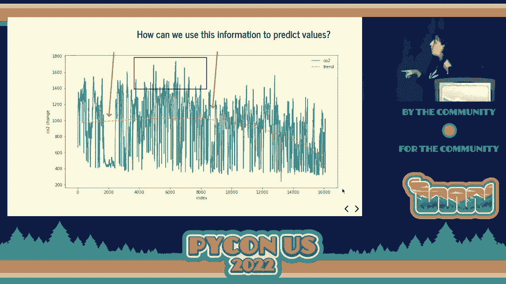
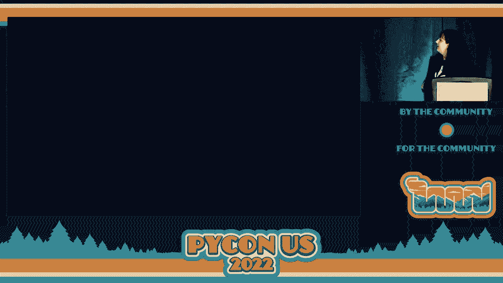

# P53：讲座 - 玛利亚·何塞·莫利纳·孔特雷拉斯 _ 更好的空气，更好的健康 创建一个室内 - VikingDen7 - BV1f8411Y7cP

欢迎回来。我欢迎大家参加今天的最后一场讲座。我们有玛利亚来进行演讲。

这是关于更好的空气、更好的健康，创建一个室内空气质量监测和预测系统的讲座。接下来请交给你，玛利亚。非常感谢你。大家好。我很高兴今天在这里讨论如何创建空气质量监测和预测系统。在开始之前，我想。

我想问问你们有多少人对传感器数据和微控制器感兴趣？很好。那么，数据分析呢？哦，好。那么，机器学习和数据科学呢，整体来说？

太棒了。这是为你准备的讲座。那我们开始吧。我叫玛利亚·何塞。如你所知，我有植物分子生物学的背景。目前我在一家垂直农业公司担任数据科学家。但是在我的空闲时间，我喜欢做一些与微控制器和物联网相关的项目，混合所有这些。

我爱这个项目。这是其中一个项目。那么，这个项目的动机是什么呢？嗯，随着疫情的出现，我的生活方式发生了变化。在疫情之前，我是在现场工作，过着更为活跃的生活。后来我转向远程生活，发生了一些变化。其中一些让我更多待在家里。我几乎整天都在家。

有一天，我开始感到很多头痛，感觉非常困，我不知道为什么。直到有一天，我在想这里到底发生了什么，我意识到当我走出去呼吸新鲜空气时，我感觉好多了。我想，等一下，可能是我公寓里的空气出了问题。

然后我开始做一些研究，想知道如何量化你在家里的空气质量。我意识到有很多因素。例如，住在你公寓里的人有多少？还有湿度和潮湿。顺便说一句，我认为你很重要要注意你公寓里的湿度。

这是一位生物学家，因为霉菌和真菌在潮湿和高湿度时会非常活跃。但这是另一个话题，留到另一天。然后我们还有通风。你可能会想，哦，我开窗户就行了，对吗？

嗯，这有点复杂，稍后你会明白为什么。之后我们讨论污染和来源。例如，如果你住在一个有很多工厂的城市，或者住在乡村，那是不同的。比如说，如果你住在火山附近，例如在加拿大、冰岛或沙漠中，那也是不同的。此外，我们还有其他因素。

这个系统是相当重要的。我开始思考，“我的问题是什么？我还不知道。”然后我开始阅读出版物，正如我提到的，我是一名科学家，我热爱优秀的科学出版物。我意识到有一个领域，很多科学家在发表关于 CO2 的研究。他们所有人，这确实只是一些集合，但。

关于 CO2 和其对我们健康影响的出版物非常多。他们都最终说很难将 CO2 水平与健康问题关联，因为这更复杂。正如我之前提到的，还有湿度、污染物以及你可能存在的先前健康状况，但所有这些都表明 CO2 有重要的。

我们健康的因素。正如你所见，在第一个例子中，CO2 将对决策表现产生影响。好的建议。如果你需要做出决策，请在做这个决定之前打开窗户，因为这会影响你。好吧，什么是好的？什么是坏的？这取决于，对吧？定义总是。要小心，因为。

取决于来源，数字会有所变化，但让我们把它作为对值的近似。在这里，我们的 CO2 每百万的数量是 x 轴，然后我们有考虑到这个情况是好还是坏的不同步骤。正如你所见，低于 1000 时，我们可以认为是好的，而高于 1000 时则。

总结信息可能是不好的。此外，我们在这里可以找到的不同健康影响，你需要考虑的因素大约是 2000，但这取决于我们的其他因素和我们之前的健康状况，可能在 2000 之前就发生。好吧，在那时，我说。嘿，我需要做些什么，并测试我的室内条件是否正常。为此。

我所做的是说我要使用传感器，我将收集数据。我会监控这些值，以查看我的公寓发生了什么。但随后，我想，等等，如果我也做一些预测，因为在现实生活中拥有这些值真的很好，但如果我可以预防这种情况，然后出现了预测的想法。

我们一步一步来，因为你将会看到这有点复杂。好吧。让我们从数据收集开始。我使用了两种不同的传感器。一种是用于颗粒的，一个蓝色的，那是 PMSA，然后我们有 CD 用于 CO2。我想尽可能多地获取数据，因为正如我之前提到的，这些因素总是在帮助。

我最喜欢的方法是，尽量保持简单。就像我尝试做一些简单的事情，但随后一切都变得复杂。你将会看到，你将会看到。但我会努力。我会努力保持简单，我保证。然后我所做的是将这个特定的传感器连接到 QT pi 微控制器，它真的很小，是一个非常紧凑的系统。

这真的很简单。我用 Liquid Python 运行它。一切都很好，直到我决定我想收集所有这些数据，并想进行数据传输。这个微控制器没有蓝牙或 Wi-Fi，所以我无法收集数据。然后我想，嗯。

我们试试另一种方法。你可以考虑，好的，你可以更换微控制器，选择一个带 Wi-Fi 或无线的。是的，这是真的。问题是，我试图回收家里的微控制器，以尽量减少一切。因此，是的。但说实话，发生了什么。我的第二个 CO2 想法是使用。

micropysome 与 ASP-ASP32。这款微控制器有 Wi-Fi。一切运行得很好，直到我尝试连接另一个传感器，颗粒传感器，我在连接时遇到了一些问题，我无法解决这些问题。这对我来说是个瓶颈。出于这个原因，我决定采用另一种方法。但你会看到，这是其中之一。

我现在的工作进展。好吧，接下来是什么？然后我直接去了一个 Raspberry Pi，带无线功能。这将是数据收集的设置。当然，我还想要其他东西。我想要一个带屏幕的设备，能够查看我的信息。因为这真的很好，想象一下，你在开会时可以看到是否需要。

来决定是否打开窗户，或者情况如何。这也是一个完美的借口，可以说，“嘿，我们需要结束会议，因为我的 CO2 值正在上升。”好吧，我不确定这是否有效。但也许这是一个完美的借口。在这种情况下，Raspberry Pi 4 也是因为我家里有它。你可能会使用其他的，这没问题。

完全不需要。我只是添加了一个可触摸的屏幕，这真的很好。不错。那么，这是我们正在获取的项目结构。两个传感器正在获取信息。存储信息的是 Raspberry Pi。然后我有两个 Raspberry Pi 通过 TCP 套接字连接，进行套接字连接。然后我们可以开始查看数据。

当然，这只是我获得的一些数据的一个例子。在 X 轴上，我们有日期，在 Y 轴上，我们有不同的参数，对吗？这些单元使用的是单元内的温度，湿度和 CO2。只是想给你展示一下，那里有一些波动，这不会很简单。这将不是一个简单的项目。

我可以告诉你。这是我的 CO2 值。在绿色区域，值还不错，低于 1000。在橙色区域，我有这些值，情况可能更好，而紫色区域是值不太好。尤其是箭头指向的和接近 2000 的底部。这不是一个好的条件。当然，我无法关联。

我因为无法做到这一点而与我的遗产有关。但这表明我公寓的空气质量不好。看到这个项目发展得很有意义让我感到很高兴。然后我们一方面有监测系统，我们稍后将看到结果。另一方面，我们有预测。

预测方面，我所做的是实现时间序列。如果你不熟悉时间序列的概念，基本上，我们有一个与二氧化碳无关的图。无论如何，在 X 轴上，我们有时间，Y 轴上有值。这意味着我们将获取随时间变化的值，而时间是重要的。顺序将非常重要。

这里我们有一个我数据的相当压倒性的图。请花点时间。没关系。只是，哇。在 X 轴上，我们有索引。索引就是时间。在时间序列中，我们通常把时间作为索引。就像第一天、第二天、第三天。我们将做的是一、二、三，然后把它作为索引。在 Y 轴上。

我们有二氧化碳。我们这里有的是我二氧化碳值不同的时间振荡。在箭头处，我指示了一些值非常低的空间。你对那些时刻发生了什么有想法吗？开窗。还有别的吗？我们可以开窗。没有。没有。没有。哇。我告诉你。我那时不在家。我在度假。一旦你在度假。

你可以看到整个变化。这真的很酷。重要的是，我跟踪的二氧化碳也是在我工作的地方。可以这么说。如果我不在办公室，那就没问题。在这里，我指示了一个非常高的二氧化碳值。你对这里发生了什么有想法吗？抱歉？

不。很多天。我在家里有一些访客。如果你在家里有访客，注意更频繁地开窗。这是我学到的重要教训。如果你一天开一次窗，当你有访客时，尝试加倍或三倍。还有，最后一个有趣的事情是趋势。这是那条橙色线。

我们在这里？抱歉。我们在某个时刻开始下降。有什么想法？

发生了什么？是的。有两件事。一个是季节变化。因为我住在德国，冬天真的很冷。然后，你知道，你试着减少开窗，因为真的，真的很冷。这是一个问题，你可以看到。但当春天开始时，真的很不同。行为、天气就像，“是的，是的。”

“让我们打开窗户，一切都会好。”这是其中一件事。而第二件事是我意识到，我开始分析 CO2 数据，发现我在家中有问题。我开始改变打开窗户的方式。因为一开始，我只打开一个窗户，然后是第三个窗户，假设如此。

这是一个组合。我意识到当我玩不同的窗户时，值发生了显著变化。这意味着我公寓里的流体受到了影响。了解这一点真的很有趣。如果你感兴趣，还有其他有趣的东西可以探索。然后一切都好。让我们实现它吧。

一些机器学习，试图预测我的 CO2 水平。有很多方法可以使用。在我的案例中，我决定看到这篇论文，里面有一个非常有趣的方式，因为它有自适应的方法来预测室内 CO2。然后，他们还有这个包含不同条件、不同参数和不同的表格。

架构。我意识到，“哇，我可以实现很多不同的架构。”是的，我买账。当然，我对我的项目做了一些变更，但最终，我尝试遵循的是那种窗户的自适应理念。不过，我在为下一个做剧透。然后我创建了那个资产。好吧，我之前监测过。

创建了那个资产。我监测了不同的变量，包括 CO2、湿度、温度、颗粒物以及活动水平。因为当然，你意识到如果你不在家，就会降低 CO2 的水平。因此，如果你把这个包含在你的模型中，预测就不会很准确，因为如果你不在家，你就会。

做了大量工作，产生 CO2 等等。是的，这些事情。然后，我创建了那个资产，考虑了时间序列的工作。对此要始终保持警惕。同时，它也需要对训练数据进行规范化。我实现了这个窗户的概念，移动窗户。在这种情况下，我不确定你是否熟悉。

采用这些方法，但我们有一个时间段来训练我们的模型，然后我们为下一个小时、几天进行预测，取决于你的需求。然后你想做的是将这个窗口移动到预测上并更新。我们移动、更新。我们将重新训练，我们将重新训练，我们将重新训练。我们将获得。

这样可以获得更准确的结果，因为我们有更新的结果。如果你不在家或者有其他原因，你的数据集将受到影响。至少如果你拥有最近的情况，你将获得更准确的结果。然后我使用了 CNN。我不打算深入讨论。

尾部，因为如果没有，我们将无法结束这个讨论。但如果你有。任何问题，我会很高兴或者在某个时候向你展示 CNN 的架构是什么样的。我还喜欢分享，当我参加数据科学的讲座时，看到人们进行更深入的参数选择。

原因，我也包括它，但我会保持快速和简单，以防你对此不太感兴趣。但我喜欢它。因此，我决定把它包括在内。提到几点。这就像我们在这个地方有一个卷积 1G，我们正在分析它的作用是分析和构建图像。然后我们有。

对于我们将要引入的变量和时间的输入形状。在匹配池 1G 中，发生的事情是我们正在提取最重要的信息。然后我们将获得我们的输出。当然，还有更多的代码。这只是其中的一部分。让我知道。关于指标生成结果，我使用 RMS 作为性能指标。

我为每个参数进行了实验。我试图看看它是如何工作的。但正如你所知，作为一个数据科学项目，你需要一次又一次地迭代，我做得非常多。我只是做了一些分析和方法，因为一旦这个项目完成，我们需要做的是回过头来改进和优化整个过程。

从窗口的角度来看，这真的很不错，我喜欢实现这一点。但你需要意识到每个窗口将有其自身的性能，因为如果某个窗口缺乏数据或发生了一些事情，或者很多事情可能会。这里，我展示了一些我认为可能真的很有趣的结果。

以查看它的进展。在蓝色中，我们有输入。在绿色中，我们有标签，而在橙色中。这个交叉是预测。我这里得到的是 24 小时的窗口。我每小时进行一次预测。当然，在我们要看到的最终版本中，我们不会有这个准确的内容。我们将得到的是。

最后的预测。但我只是想和你分享每一步的进展。正如你所看到的，在某些点上，准确性相当高。我们期望标签与预测之间有一半的重叠，绿色和橙色。但是在某些情况下，在某个时刻，并没有发生。但这是。

这算是正常，但需要进行优化。但这并不算坏。这是我们最终项目结构，因为我们将有机器学习预测部署在我们的树莓派上，然后我们将在另一个树莓派上有一个更简单的闪存应用程序，我们将有显示器。

一切看起来是怎样的。首先，我想，我需要在我的公寓里安装所有传感器在树莓派上。让我们看看。真的很好。我还移除了我姐姐的一张照片。不要告诉她。请不要告诉她。我为一些传感器只做了一些布置。是的。这就是我们树莓派上的闪存应用程序。

我们将要接近座位或工作地点的那个。这些信息，你可以在这里看到温度、湿度。这是二氧化碳浓度。这里我们有预测和日期。目标是实时获取传感器的原始值。当然，并不是每一秒。我想我每隔一段时间就会更新。

如果我没记错是 10 分钟。然后每小时一次预测。一小时，我决定每小时进行一次，因为这对我开会时有足够的时间，我可以休息一下。这是我打开窗户和做一些事情的足够时间。更频繁获取这些值确实很有趣。但当然，这取决于标准。

以及你需要的东西。这就是它的样子。这是你的树莓派。变更以及现在对我们有效的东西？我正在实施这个，但使用微控制器，而不是取出至少一个树莓派。我的想法是实现并使用 TensorFlow Lite。老实说，只是为了好玩。我只是想。

做一点研究，看看。我提到的事情是，我在模型中没有包括颗粒信息。也许有人在想，等等，你是为了这个而把系统从微控制器更改为树莓派，对吧？是的，我是。问题是，传感器晚到，因为我买得有点晚，无法在。

我想要的所有数据。我已经运行了带有二氧化碳、湿度和温度的系统。我做了决定，决定取出颗粒，但在下一次迭代中将会包含，因为这将带来很多有趣的信息。当然，优化。这是一个数据科学项目，并且进行了优化。

但也可以来自微控制器，所有项目都可以优化。好的，我将在这里结束我的演讲。如果你想联系我或有问题，随时可以找我。我会很高兴讨论，因为我热爱这些话题，正如你所看到的。我非常享受。谢谢你的关注。[掌声]。

（掌声）。
