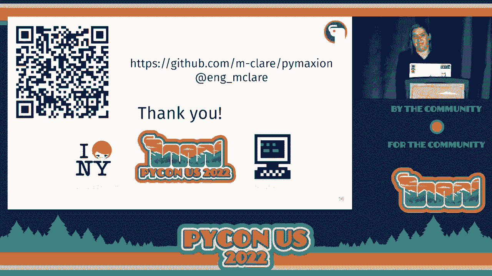

# P55：演讲 - 玛丽安娜·瓦赫特 _ 它能混合吗 _ 为 B - VikingDen7 - BV1f8411Y7cP

好吧，希望这能推进我的幻灯片，我可以继续下去。

好的，我的演讲题目是“它能混合吗？”这讲的是如何使用 Python 为 Blender 编写自定义约束求解器。所以我将要讲的内容包括一些动机和背景，关于我为什么关注这个特定问题，然后再讲一下我选择的原因。

使用 scythethon，考虑一个玩具问题，探讨 Python 包结构。当你使用 scytheon 时，编译 scytheon 包，然后进行性能测试。所以你如何使用 scytheon 释放 gill，如何对 scytheon 进行性能分析，然后在前端，我为什么选择使用 Blender，并且分享一些关于 Blender 开发和 Blender 插件的信息。

关于我一点。我曾经是一名结构工程师，参与了一些标志性的交通项目和大型博物馆的建设。但在过去的一年里，我在软件领域工作。在此之前，我从 2015 年开始编写 Python，但我已经完全转向软件开发。

主要专注于全栈 Web 应用程序，进行大量的数据可视化。你可以在我的博客找到我。我会写一些这类内容，同时我也在 Twitter 上。所以我可以做一个关于结构工程软件状态的完整演讲，但最重要的是，它的状况并不理想。你在商业软件中建模，以了解其在载荷下的表现。

你希望它能移动，但不要太多。然后你使用一个分析程序，它可能有某种设计的方法。那么，柱子应该有多大，地板应该放多少钢筋。但在咨询设计实践中，通常会回到 Excel 中设计所有这些东西。然后大多数情况下，你会使用专有软件与其他学科交换数据。

所以建筑、机械、电气和管道基本上是为了弄清楚所有的结构如何与其他组件相配合。由于我在软件方面工作了一段时间，我对建筑环境中的软件状态有很多问题。用户界面通常非常过时，而且很难在没有的情况下获取信息。

通过点击和浏览不同的子菜单，这并不是很友好于开发者。成本也相当高。标准的结构分析软件许可证通常在$10,000 左右，即使用户界面糟糕得很。作为参考，结构工程的起薪大约在$60,000 和。

每年 $70,000。就软件的操作而言，我会说它相当慢。结构分析背后的数学需要大量的矩阵反演，而实际上没有任何即时反馈循环。你点击某个东西，走开，再回来查看结果。可能我最大的问题是这完全是一个黑箱。

如果你运气好，你会得到一本包含简单测试用例和验证的手册，但查看实际代码是不可能的。在我们拥有计算机之前，一些最精美的建筑是使用名为形式发现的物理建模方法构建的。其理念是可以将一个悬挂的加重链条反转。

为了找到一个结构在预压缩状态下的形状。你可能熟悉安东尼·高迪在巴萨罗那尚未完成的教堂——圣家族大教堂，它实际上使用了这一技术，如左侧所示，利用他的悬链模型找到建筑的预压缩形式，该建筑仍然未完成。

你可以在右侧看到。所以今天，教堂的建造正在使用计算几何技术以及计算形式发现进行。我几年前也对计算机图形学产生了兴趣，因为这个领域发展迅速。

在实时仿真中领先于结构分析。有一个特定的约束求解算法用于形式发现和实时物理，它实际上已经通过两个插件实现进入了建筑环境软件，以及一个名为犀牛的商业三维建模软件。

这里展示的示例来自于名为 shape up 的算法的原始实现，该算法是在 EPFL 开发的，但现在广泛商用的是叫做 kangaroo 二。你可能会问，如果这些已经存在，为什么我还要重写它？

我对这方面的疑虑在于，我仍然认为这个特定软件的用户界面并不好。它基于可视化编程，这对快速原型设计非常好，但不利于文档记录或可重复过程。即使在这个界面中，它也不是免费的。犀牛软件的许可证费用约为 $1,000，这可能让爱好者难以承受。

这些实现并不慢。你在前一张幻灯片上看到的都是实时的，但在实现方面仍然存在一些黑箱问题，虽然 shape up 是开源的，但 kangaroo 二的物理引擎仍然不是开源的，所有的几何约束都在此。

引擎中的内容是用 C# 编写的。带着这些前提，我想尝试用 Python 实现这个算法，以使其开源、可访问和可扩展。接下来讲讲我如何构建这个 Python 插件，我称之为 Pymaxian。

当你说要在 Python 中构建某样东西时，第一个障碍就是关于其速度的抱怨。因此，我转向 Python，以保持我熟悉的 Python 语法，但显著提升速度。有几种包装器和方法可以在 Python 中获得 C 或 C++的执行，实际上，你可以使用 SWIG 生成 Python 绑定以进行形状处理。然而。

这仍然意味着，如果你想扩展约束或更改任何内容，你必须用 C++编写并与 Python 绑定进行编译。我希望尽可能少写 C++。我认为这些其他库可能会更难翻译。

这些约束因为非常依赖矩阵运算而存在限制。因此，基本上我想创建一个通用框架，便于构建并保持 Python 包的外观和感觉。最关键的是，我希望能够编写可以释放 Python 中全局解释器锁的函数。

GIL 可以获得显著的速度提升，也可能利用并行计算。那么，什么是 Python？

这是一个优化的静态编译器，允许你在 Python 中包装 C 或 C++库。你还可以将 Cython 编译为 C 或 C++，而 Cython 是 Python 的超集。然后，这个编译的库可以作为扩展导入到标准的 Python 脚本中。因此，为了开始，我选择了一个相当简单的静态分析问题，即加载。

在中点处的电缆。因此，这实际上是一个相当难以手工解决的问题，因为电缆在载荷下变形的形状会显著变化。有趣的是，大多数结构分析基于假设变形非常小。这个问题只涉及三种类型的约束，总共有五个约束。

你有锚点，这将防止点 0 和点 2 在施加载荷时向中心移动。力本身就是一个约束。然后，点 0 和点 1 之间以及点 1 和点 2 之间的关系是基于电缆的材料特性。基本上，它的拉伸程度决定了它想要恢复到原始长度的程度。

所以，形状算法的作用是独立考虑这些约束，并根据约束分别投影每个点的理想位置，这是一个局部求解。然后，这些约束相互权衡，以找到最佳满足应用约束的粒子位置，而这是一个迭代过程。

该算法的关键特性是每个约束的局部求解可以独立应用，这意味着你可以并行运行。因此，最终我为这个小问题创建了一个相当大的库，许多文件。因此，PXD 和 PYX 文件扩展名是 Cython 特有的。

这些 PXD 文件基本上是借用 C++ 的头文件，然后类和方法在 .pyx 文件中定义。好吧，我最终确实在 C++ 中编写了一个非常小的几何库，而不是处理包装现有的库，这仅仅是因为我不想处理一些典型 C++ 几何库（如 CGAL）的所有许可问题或大型构建。

剩下的约束完全是使用 Cython 合同定义的，因此每个都需要一个 PXD 和一个 PYX 文件。那么我为什么需要这些头文件呢？在 Cython 中，如果你打算导入一个模块，你必须有一个对应的 PXD 文件。所以 Cython 中让我意识到的一件事是，你不能随便子类化。

你只能有一层子类化，子类可以从多个超类继承。因此对于我的目的来说，这很好，因为我可以将约束设置为父类，然后每种约束类型，比如锚、缆绳、力，都是各自的子类，并根据约束具有自己的 calculate 实现。

这是父约束类的典型头文件，包含所有类型声明。因此，每种类型都以 CDF 为前缀，因为它们是数据类型和方法，用于在没有全局解释器锁（GIL）的情况下运行程序，这意味着它们不能是 Python 对象。因此，CDF 方法也不能从 Python 调用。如果要这样做，你需要定义一个 CP def 方法。

所以这将以 Python 或 C 扩展的形式运行，或者你必须为该函数编写一个 Python 包装器。关于一般约束类的实际方法，calculate 方法将根据所有约束进行重写。因此，它必须具有相同的签名。

sum moves 方法对所有约束都是通用的，因为这是每个约束的局部求解。因此，锚点的 calculate 方法非常简单。它只是空间中的一个 3D 向量，将返回其在空间中的位置到原始锚点。缆绳的 calculate 方法要复杂一些，你可以把它想象成。

力来自拉伸橡皮筋，或者橡皮筋想要回到其原始的松弛形状，因此它对你在系统中握住的两个点施加相反的力量。回到我第一张幻灯片上的 XKCD 笑话，你确实需要编译 Python。我写了一堆辅助函数，以确保 Python 正确识别所有内容。

不同目录中的不同组件，以及附加一些额外的编译参数，以便在未来如果我想使用 OpenMP 进行并行化时能够与 OpenMP 编译。因此，默认情况下，Python 编译 C，所以我需要指定 C++ 作为语言。对于实际的构建命令，in place 标志确保编译后的文件会。

需要与基础文件处于同一目录，以便从包中导入时非常清晰。看起来就像是在导入一个标准的 Python 文件。因此，一旦你编译了一个 Python 包，你将获得动态库文件。我在 Mac 上构建，所以我得到的是 SO 扩展名。

你还会得到与基文件同级的新 C++文件，这些文件体积庞大。生成的 C++代码有成千上万行，所以并不一定是你想要深入研究的内容。因此我进行了测试。它比我使用的原始纯 Python 方法显著更快。

但是虽然它更快，我想知道到底能快多少，并且我想找出分析 Python 代码的最佳方法。因此，我提到想用 Python 来释放 GIL 以改善运行时间，但在你能够在没有 GIL 的情况下运行 Python 函数之前，还有许多步骤需要完成。

你在之前的幻灯片中看到过一些内容，但静态类型和变量声明是必需的。你可以尝试其他一些方法来提高性能，例如通过在文件顶部添加编译器指令来去掉 Python 的一些训练轮。因此在这种情况下，我关闭了边界检查和环绕功能。你真的。

必须小心使用这些，因为如果你构建它并意外索引了某个可能环绕的内容，你会遇到非常奇怪的错误，这可能会很难调试，因为你会让 Python 崩溃。而且我也强烈建议为我们要编译的函数编写 Python 包装器，以便查看，因为否则你无法访问它们。所以你将有更多代码，但。

这将更容易进行调试和测试。如果你不编写无 GIL 函数，你可以在 Python 中使用 CP def 函数，这些函数可以从 C 或 Python 调用。因此，对于无 GIL 功能的其他项目，你会看到 def 而不是 CP def 或标准 Python 的 def 函数。不过，如果你不打算为无 GIL 进行优化，你绝对可以。

在 Python 中将这些混合使用于其他用例。Sython 在编译时会相当好地警告你，如果你的代码中嵌入了不兼容的 Python 对象。而对于这些 CDF 方法，你还需要确保在你的 pxd 文件和 pyx 文件中签名匹配，因此所有参数以及无 GIL 标志都要一致。需要注意的一点是，在签名中写入无 GIL。

方法的定义并不意味着在运行时它会自动默认使用无 GIL。你只是表明该方法可以在没有 GIL 的情况下运行。这个项目的一个最大救星是 Sython 的一个功能，它让你可以查看每个 pyx 文件中有多少 Python 代码被调用。所以如果你传递了 dash。

对命令行添加一个标志，它会自动为你查看的文件生成一个 HTML 文件，该文件将突出显示一个方法访问 Python 对象的程度。因此，你可以在这个代码块中看到，因为我使用 NumPy 创建数组，这意味着我在创建 Python 对象。因此，`end-to-arrays`是 Python 对象。我怎么会有数组呢？

没有`go`能工作吗？你可以使用内存视图来访问 NumPy 数组，并在`no-gil`块内更新它们。因此，这对我来说非常有用，可以将粒子位置跟踪为一个 3D 位置数组，我可以将其传递给每个约束的计算方法。好吧，这些都是准备工作，一旦你完成了，就该释放`go`了。

你需要做的就是在你想要运行的函数部分添加`no-gil`。同时，你必须确保在该代码块内调用的任何函数也标记为`no-gil`，并且你已经检查过之前的所有步骤。因此，你应该能在代码中看到显著的加速。我能够看到超过 100 倍的加速。

一旦我释放了`go`，这让我在数千个约束条件下几乎瞬间收敛。我仍然想尝试使用`scytheon`进行性能分析，所以我转向了`PySpy`，这是一种在 Rust 中实现的低开销性能分析选项。因此，将这个分析器集成到我的代码中需要一些设置，包括添加一些额外的标志。

我还需要在我的设置文件中确保从`scytheon`生成的 C++代码包含行号。你还需要在每个 PyX 文件的这些编译指令开始处添加它，以将行跟踪设置为 true。我的个人电脑是 Mac，这对 PySpy 的一些功能运行良好，但你无法对本地函数进行性能分析。因此。

我最终创建了一个 Docker 容器，并在 Linux 上运行了`PySpy`。这有点有趣，弄清楚如何制作一个拥有正确权限的容器。因此，第一条命令就是这样。第二条命令包含确保记录本地子进程的标志，然后所有结果将输出为火焰图。

然后最后一条命令只是将火焰图从 Docker 容器复制到我的常规目录，这样我可以在运行结束后关闭容器。因此，我得到的是一个火焰图，它让我了解到在我的模拟中哪些进程花费的时间最长。结果显示，装配过程是最耗时的。

粒子系统以及将所有 Python 对象转换为可视化，基本上就像初始化所有对象一样。这是最耗时的部分。因此，转到前端，这很好。我做了一个运行快速的东西，但我看不到它。因此，我还没有任何漂亮的模拟视觉效果。我不想重新发明轮子，所以我决定。

要将 Pymaxian 集成到一个成熟的开源 3D 图形程序 Blender 中。这个漫画在接下来的几张幻灯片中会更容易理解，但不用说，与 Blender Python、系统 Python 和虚拟 Python 之间有很多乐趣。那么什么是 Blender？正如我提到的，它是免费的开源软件，采用新的 GPL 许可证。

我仅列出了与 Blender 一些可能性，这些可能性将超出我熟悉的另一个三维建模程序 Rhinoceros 的能力。在 Blender 中做任何事情就像是从消防栓里喝水。有很多不同的事情可以做。我在 Blender 的探索仅仅是触及了表面。

因为我主要在处理网格，使用 Pymaxian 也很方便。Blender 还有一个非常成熟的 Python API，其大部分底层代码是用 C 或 C++ 编写的。因此，Blender 生态系统中有非常丰富的附加组件。我添加了一些我最喜欢的来自建筑环境的组件。

Sverchock 更加通用，因为它是一个可视化编程接口，类似于 Grasshopper，后者在使用 Rhinoc 的建筑师中非常常见。那么你如何将新创建的 scytheon 包放入 Blender Python 中呢？你需要针对与 Blender Python 相同版本的 Blender Python 来构建 scytheon。

你可以通过脚本选项卡调查关于你的 Blender Python 安装的所有信息。实际上有一个 IPython 接口，可以输入 sys.path 或 sys.version 信息。我决定将我的 scytheon 包符号链接到 Blender Python 安装的站点包中，而不是复制或与 Blender Python 一起构建它。

现在 Pymaxian 是 Blender 站点包的一部分，但我仍然需要添加 Blender 将如何通过其 UI 和操作与该包进行交互。因此，对于使用 Blender 的最佳开发方式存在很多争议。我通常会在每次修改时创建一个新的实例并重新启动 Blender。

热重载并不总是有效。随着 Blender 的演变，它的有效性也在不断变化。例如，在 2.9 版中有效的重载方法在 3.1 版中不一定有效。但至少，我确实推荐从命令行启动 Blender，因为那样你所有的输出或调试信息都会打印到一个单独的控制台窗口中。所以我将我的 Blender 包放入了。

附加组件目录也使用符号链接。抱歉。好吧。这是基本 Blender 附加组件的典型文件结构。在右侧，你可以看到有一个侧边菜单，那实际上是我为 Blender 的 Pymaxian 接口创建的菜单。你可以在其中使用 Pymaxian 的 Blender 上下文。

这是编辑上下文中的对象，位于选项卡之一上。我有许多按钮是这个菜单的一部分，还有一些弹出面板。Blender 操作符文件中，你会找到调用 Pymaxian 的所有 UI 操作。因此它在属性和方法方面有一个特定的 Blender 类结构。

它还有一些对唯一标签的要求，比如下划线、ID 名称、下划线标签。然后你可以看到，我必须定义执行，也就是要返回一组特定的值。因此，对于所有这些漂亮的面板，你必须有特定的前缀来定义具体属性。否则当你告诉它基本上添加你的包时，它不会注册。

在这些弹出面板中，你可以设置一些附加属性以设置基本值。在这种情况下，它增加了约束的强度，使用了典型的符号。这些 UI 面板都有一个绘制方法。因此，大多数典型的附加组件也有一个属性文件，并且你必须注册每一个。

你在这些菜单中使用的常量，这在我的情况下导致了相当多的代码生成，因此我决定不使用属性文件，而是将那些约束放入一个 JSON 文件中，基本上是绑定了所有选项，像是用户可以设置的值的精确度。因此我把它放入一个基本上进行分组的 JSON 文件中。

每组值由约束类型决定。然后在我实际的菜单文件中加载 Blender 时，我能够导入并迭代该 JSON 文件，以自动注册这些属性，这样未来添加内容到这个 JSON 文件会更容易，而不是需要编写一堆类。

所以经过这些，我现在得到的是什么？Pimaxian 目前仅支持几个约束，基本上是一个概念证明，但我能够复制我在前几张幻灯片中展示的悬挂布料形态探索。我希望能做更多使其更具互动性。你可以在 Blender 中使用模态操作符，以允许一些交互性。

我还在考虑可能使用套接字，这样能够反馈更新的几何体，以便用户可以与模拟进行更多交互。所以最后我真的很想感谢 Python 软件基金会和 Pilates 给我这个机会来这里发言。特别是纽约市的 Pilates 小组，他们起到了关键作用。

这是一个更简短版本演讲的讨论平台。我还想感谢 Recur Center，因为我在上个夏天的静修中主要参与了这个项目的 Blender 部分。所以谢谢你们。

[BLANK_AUDIO]。
