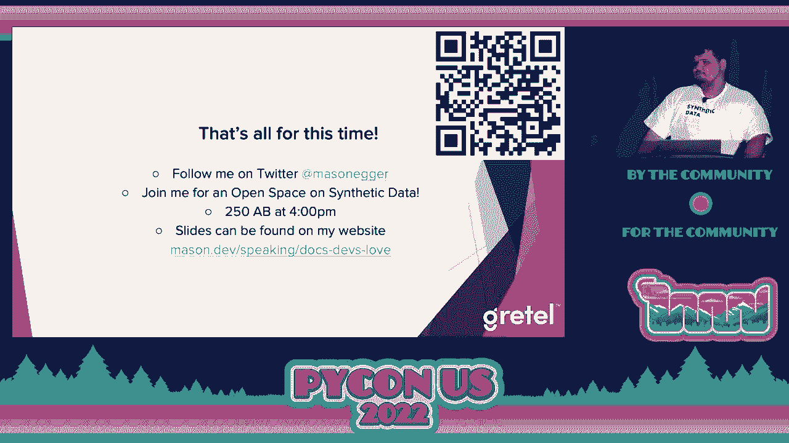

# P56：演讲 - Mason Egger_ 编写开发者喜爱的文档 _ 提升技术写作的十个技巧 - VikingDen7 - BV1f8411Y7cP

好的，各位，非常感谢这场会议的最后一场演讲。

如果你有机会，下载二维码。这是下载链接。拍下来，拍张照片。这些幻灯片很精彩，所以你会想要有一份额外的副本。你可以在观看演讲时翻阅它们。如果你想，可以放大查看。但我会给你额外的一分钟，希望你不会让 Wi-Fi 超负荷。

说到这一点，我要请 Mason 和 Edgar 来教我们如何编写开发者喜爱的文档。提升技术写作的十个技巧。接下来请。太棒了。谢谢大家。大家过得怎么样？这是我自 2019 年以来第一次在现场会议上演讲。很高兴能回来。是的，这些幻灯片内容丰富。我在上面有很多信息。

如果你想跟着我，我知道从后面看会很难跟上。所以，首先，我是谁？我叫 Mason Edgar。我是 Gretel 的开发者倡导者，Gretel 是一家合成数据公司。稍后会谈到这个。在加入 Gretel 之前，我是数字海洋的开发者倡导者和社区作者。

这就是我学习到的所有知识。如果你从未见过或使用过数字海洋的教程，它们非常棒。那里有很多优秀的人教会了我很多关于文档的知识。我想和你分享。因此，为了稍微设置一下背景，我们先开始。

让我们谈谈什么是技术写作。所以想想你在跟随在线教程时的感觉。你知道，你正在复制和粘贴代码块，执行各种操作。它在第一次运行时就神奇地工作。你无需去寻找任何东西。它就是有效的。你会想，哇，太棒了。

然后想想你花了多少时间去寻找那些不起作用的文档。你知道，它漏掉了一步。缺少了什么。你就是没法使用。而现在你感到沮丧，不知道该怎么办，只能去谷歌一下。这就是糟糕的文档。那么这两者之间有什么区别呢？你知道的。

是什么让一个成功而另一个失败呢？

今天我们将在这个演讲中讨论这个。简单快速地概述一下。我喜欢定义事物。技术写作是以指导或信息为目的的写作，专注于如何使用特定工具完成任务。那么为什么技术写作很重要呢？嗯，技术写作非常重要，因为它通常是给人的第一印象。

如果有人去你的项目，尝试使用它，却无法弄清楚文档，通常在几分钟内，他们会去别的地方。世界上很少有库是唯一可以做到这一点的。因此，你的文档实际上是你营销和吸引人们的第一步。

使用你的产品、开源项目或其他任何东西。你的技术文档教人们如何使用你的项目或代码。如果你不教人们如何使用它，那你在做什么？你知道，你需要把它放在那里。你上次是如何通过查看代码发现新项目的？

是通过去 GitHub 打开某人的 app.py，读我不算，读我你的技术文档。实际上，很少有人会通过打开 GitHub 阅读源代码来找到新项目和新代码。如果你这样做，恭喜你，我为你喝彩，但大多数人不是这样做的。技术文档教用户如何有效且安全地使用你的项目。

想象一下你在给轮胎充气，文档上写着，给轮胎充气，或者给轮胎充气到 35 psi。如果没有最后那部分，可能会导致一些灾难性的后果。因此，拥有技术写作可以帮助你围绕你的项目建立社区。

这实际上是围绕任何项目建立社区的第一步之一。它允许人们回来。很可能会吸引人们回来。人们会想要贡献。你知道，人们真的很兴奋，哦，那些文档太好了。我想去贡献那个项目，他们会这样做。

然后他们会告诉他们的朋友，这就是我们都知道我们在 PyCon 的原因。我知道你们中的许多人分享过，哦，你应该看看这个库或者你应该看看那个库。口碑是谈论事物的一个很好的方式。因此，你需要让你的文档像是帮助你建立社区一样运作。

所以今天我将谈论我提高技术写作的十大技巧和窍门。我在这里加上“窍门”，因为我决定把它们结合在一起而且不会拼写。让我们声称这些是我的，这些是我的。也就是说，这是我的观点，你可能会觉得这里有我完全遗漏的东西，非常棒。

这并不让它变得不那么惊人。这只是我所经历的和我在 DigitalOcean 工作期间学到的内容，大约两年半的时间。仅仅因为它没有出现在这里，并不意味着它不好。而且选择 10 个确实很难。如果我能完整地进行这个演讲，这将是 Mason 的 374 个提高技巧。

你的文档。没有人会愿意听那场演讲。我也不会留在那里。我会起身离开。所以今天我们将讲第十条，希望他们能帮助你改善你的文档。因此，第十个建议是，让你的最终目标清晰明确。在文档的第一段、最开始时要有一个清晰简洁的目标。

说清楚这是我希望你做的事情。这个库将允许你在本教程中做 X。你将通过使用这个来做到 X。在你开始撰写文档时，务必要清楚地表达最终目标。如果你在写教程，不要在开头花费一千个字来告诉用户这项技术有多么伟大。他们已经知道了。他们是在学习你的内容。

你不需要在第一段花时间讲这个网络库。好吧，在 1976 年或 67 年，他们决定建立 DARPA。没错，你回得太远了。这是浪费时间和精力。不要花时间去美化你的技术。如果他们想读小说，他们会去读小说。

开发者来这里是为了完成任务，他们反正会跳过那些内容。让读者清楚他们将从中学到什么。在这个教程中，你将设置一个 Apache web 服务器，并使用 Hugo 作为静态网站生成器来部署一个静态网站。要明确告诉他们这就是他们将要得到的内容。

这样人们可以知道自己在做什么，并迅速开始。因此我们重新表述一下。第九个建议是，不要过于冗长。技术文档应该简洁，而不是小说。有很多很好的软件工程小说。我建议你去看看。但技术文档不应该是一部小说。SAT 词汇在这里是不必要的。

如果你不知道 SAT，那是一个大学入学考试，询问你是否知道这些英语单词，而这些单词在日常用语中已经没有人使用。日常用语。这个词不错。SAT 词汇在这里。永远假设你的读者并不使用与你相同的语言。永远假设他们可能是英语非母语者，并且使用非常复杂的词汇。

使用不常见的日常用语会拖慢他们的速度。并不是说他们不知道这些词，而是浪费时间。目标是低阅读水平。你可以使用这样的应用程序。这是海明威编辑器的侧面截图。Grammarly 也能做到。目标是让阅读水平非常低，以便人们能够轻松阅读你的文档。

快速而不是花时间去弄清楚文档所说的内容，更重要的是如何去做。我的个人目标是达到三年级的阅读水平。你不应该花太多精力去理解这些文档。有时候会很困难，所以我会允许自己提高到六年级的阅读水平。

这回到我之前提到的观点。这确实对非母语人士使用你的文档有帮助。提示八。使用包容性语言。避免使用性别代词，选择更中性的代词。不要害怕使用第二人称。你会这样做的。这是完全可以接受的。在某个地方，至少在我的教育经历中，我们被告知不要使用第二人称。总是使用第三人称。不。

你可以使用第二人称，对吧？如果你想用第二人称复数，我喜欢“y'all”这个词。如果你问我，我可以在稍后的时间给你关于“y'all”的整个演讲，非常好玩。或者如果你在酒吧请我喝足够的酒。真的很有趣。网上有录音。你得去找找。

避免使用可能被视为贬低或侮辱的网络俚语。像“新手”或“十倍开发者”或“傻瓜”。你的文档是为了教人，而不是为了引发争吵。有一个很棒的系列书籍，比如《傻瓜也能做的事情》。这是一个很好的系列。我喜欢它们。我觉得它们很棒。我认识一些人不会买那些书，因为他们觉得。

“我不是傻瓜。我明白。不这样做。不要让人们因为非包容性语言而不想使用你的文档。这只会伤害你，而不是他们。避免使用可能让人质疑或怀疑自己能力的词汇。像简单或容易这样的表达。你应该只是简单地这样做。这并不好。想象一下，如果你登录到 Python 网站，文档的第一部分是简单的。

从源代码编译和安装 Python。这没有什么简单的。如果我看到那个，我会说，“不，我要换另一种语言，找一些更简单的。”尽量避免使用这些词。你会感到惊讶。你可能会觉得这一要点有点奇怪，但你会感到惊讶。

你会惊讶有多少人因为看到别人告诉他们简单的东西，而发现对他们来说并不简单，从而对整个项目失去兴趣。尽量避免使用那种说法。限制技术术语。对于你们来说，行话本身就是行话。我觉得这很搞笑。行话是特定职业或群体使用的特殊词汇或表达方式。

如果你不在那个群体中，理解起来很困难。每次使用行话都可能让初学者难以理解你的内容。你看到我刚才做了什么吗？我得承认，在我进入这个行业八年后，我才最终明白那个词是什么意思。我以为人们只是在发鸡叫声。我是说。

“这是写代码的一种奇怪方式，但我是说，兄弟，是的，我们会这样做。”它有效。了解你的受众会帮助你决定可以使用多少行话。我说要限制。这确实取决于情况。你是在为你的团队写内部文档吗？

你可能更容易逃避这个问题，因为团队应该知道这些内容。如果你不知道文档的目标读者是谁，始终假设他们是初学者。假设最低水平，这样你会写出更好的文档。这将是一个反复出现的主题。想想那个不以你语言为母语的人。

不使用它会容易得多。初学者总是会感激你过于详细地解释所有的内容，尤其是对于那些领域中的专家。你们中许多人都是专家。你知道你并不会逐字阅读文档。你知道你是浏览它，而不会注意到是否有某个词，因为你是浏览并寻找你需要的东西。所以，第六个建议，定义所有缩略语。

技术领域有太多的缩略语。这令人沮丧，伤透了我的心灵。我们有如此多的缩略语，以至于有些有两个或三个含义，你必须使用上下文线索来理解这些缩略语。我希望看到政治体系在他们的英语测试中使用这个。没有人会答对，他们都会失败。试着弄清楚你指的是哪一个缩略语？

缩略语很容易吓跑读者。新学习者通常会感到恐惧。因为你无法通过上下文线索理解缩略语。你必须知道，缩略语会吓跑你的读者。毫无疑问。因此，在首次介绍缩略语时，写出其全名。

所以如果你要说类似“向 DNS 添加记录”的内容。你应该说“向域名系统（DNS）添加记录”。看看，你现在已经定义它了。现在读者可以理解并继续前进，知道它的含义。如果你打算在文档的其余部分使用这个缩略语，请说明。

你说你以这个例子为基础，向域名系统（DNS）添加记录。我们将在本文档或教程的其余部分中将域名系统称为 DNS。这适用于较长的内容。如果你打算像实际的技术文档那样写，使用词汇表没有错。你可以只设一个词汇表，每次使用时都引用。

你链接到它时，可以是一个弹出的高亮气泡，或者仅仅是链接到文档的其他部分，即你的术语的词汇表。我花了更多的时间担心缩略语，因而不使用技术。

我希望在面向初学者的内容中，所有缩略语都消失。这是对我来说最难的一步，因为我喜欢表情包。我是从表情包中成长起来的，它们是最好的东西。但要避免使用表情包、成语和地区性语言。除非你确信知道你的受众是谁，否则你需要避免使用它们。

对于那些不知道习语的人来说，习语是一组由用法建立的词汇，普通人无法推导出来。所以如果你使用像“这是一块蛋糕”或“全力以赴”这样的表达，这些对不了解该习语的人来说是不可理解的，尤其是如果他们不是你的语言的母语者，这会非常混淆。

因此，尽量避免它们。如果你在编写内部文档，你的六个同事可能理解这些。然而，对于可能从未见过《海绵宝宝》的全球观众来说，他们可能不理解大小写的梗。可能真的不会发生。所以，我喜欢梗，它们是教学的好方式，但你应该尽量避免它们，以实现包容性的文档。

避免使用可能让母语和非母语人士感到困惑的区域语言。比如说“执行这个命令会完全破坏你的系统”或“不要使用这个库”。这是有风险的，我不得不查阅，因为我不懂非美式英语。在德克萨斯州或美国，我们也有很多地区变体，比如 Coke 和 Pop。

与汽水相比。避免使用这些类型的短语和这些类型的表达，外地人可能不理解它们。提示四：使用有意义的代码示例和变量名。使用你产品或开源库可以解决的现实问题的示例。其他人想知道你的代码解决了什么问题，给他们展示。

不要告诉他们它做什么，给他们展示。如果你从这个演讲中什么都不带走，那就不要告诉人们你的库做什么，而是展示给他们看。他们会从中获得比其他任何事情更多的理解。读者通常会直接跳到代码上。你们中有多少人阅读过你在谷歌上查找的每个 Stack Overflow 的解释？

你们中有多少人在页面中间向下滚动，只看了答案而没有阅读下面的文本？举手，我也做过。人们跳过文本，他们去看代码，所以确保你使用的是现实世界中的问题。使用有意义的变量名。我们都说代码应该是自文档化的。

这是我们对自己说的谎言。这将是我自传的标题。代码应该是自文档化的，以及我们对自己说的其他谎言。文档也应该是自文档化的。Foo 和 bar 是无用的，它们需要被去掉。停止使用它们。它们毫无价值，没人能理解它们。让它们离开。

包括运行代码所需的一切。这包括导入语句等内容。有时我阅读的文档中写着：“哦，太好了，这是一个很棒的代码块，”我读完它后，却无法运行，因为他们没有告诉我如何导入他们的库。我想：“哦，不，这太遗憾了，”然后我得去找解决办法。包含这些内容。

包括用户需要完成它的所有内容。请确保有一个完整的代码副本，以便复制和粘贴。如果你要构建一个教程，逐步引导某人，这些是导入。这是如何做第一部分、第二部分、第三部分。在最后，包含一个代码块，包含整个内容。

人们不需要复制五个不同的代码块。他们可以复制一个代码块并立即使用。人们代码示例，还有另外一个，这是一个推文引用。如果你想，“Foo 和 bar 没用，去掉它们。”这将是我竞选总统时的口号。提示三。

避免让读者离开你的文档。这是一个很多人不常考虑的重要问题。尽量避免将读者发送到其他网站或链接。互联网让我们完全忘记 900 个标签的能力。在浏览器窗口的顶部，一旦你去下一个标签，很可能。

你可能再也回不去了。完成任务所需的一切应包含在文档或教程中。复制其他文档中的几步实际上比将用户发送到 15 个不同的网站更好。如果你要这样做，请不要抄袭，最好是重写，或者你可以引用并给作者信用，但请不要抄袭。

如果你要让读者离开你的文章，我不推荐这样，至少要有理由和方法让他们回来。尽量在一开始就处理好。这是 DigitalOcean 在教程中做得很好的地方，这是我喜欢的一点。在最顶部有一个这些教程的先决条件列表。

你需要安装 Ubuntu，你需要安装 Python，可能还需要安装 Java，因为你在做一个 Minecraft 服务器。这些在顶部都定义得很好，并且有链接可以带你去其他地方，然后你会回来，一旦你进入。

在教程的主体中，你将不会再离开该教程。所以链接到它们。如果你自己已经写了文档，可以链接到你自己的内容，但要尽量避免让人们挂在那里，让他们去别处。不要仅仅说去安装 Python。

给他们一个成功的教程，使他们能够完成这个任务，并在完成后能够回来。但要避免让读者离开，去其他网站。你永远无法让他们回来。你会有另一个标签在 600 个 Chrome 标签页中。你的电脑会过热，因为 Chrome 占用了你所有的 RAM。

然后他们重启，结果就没了。难道这不是只有我遇到的情况？好的。第二点，可能是最重要的提示之一，就是让你的内容易于扫描。这又回到了 Stack Overflow 的问题。我们不会阅读完整的文档，我们只会扫描寻找所需的信息。这在专家和高级用户中非常普遍。

而初学者则会从头读到尾。因此，确保读者能轻松找到单个信息。他们可能不需要关于如何安装 Apache 和运行 Hugo 及安装静态站点的完整教程。他们可能只需要那一条命令，来搞清楚如何实际进行编译。

让 Hugo 工作的步骤。他们不需要整个教程，但他们会去你的教程，找到需要的信息。因此，正如我所说，初学者倾向于阅读完整的帖子，而经验丰富的用户则会扫描他们需要的内容，他们获得所需的信息后就离开。使用标题和副标题来划分内容。

概述重大变化，比如下一步或上下文的变化。因此，如果你在文档中提到，“接下来我们要做这个。”你完成一个部分后，介绍下一个部分，继续进行。使用目录。我非常喜欢目录。这有助于扫描的用户，因为他们再次需要快速找到信息。

他们并不是在试图阅读所有内容。他们在快速解决一个非常具体的问题。如果他们找到了你的文档，但在 30 秒内没有找到答案，他们就会去 Stack Overflow。我希望我能有实际的统计数据，但我认为人们在网站上平均停留的时间大约是六秒钟。

他们点击进去，寻找他们需要的内容。如果没有找到，他们就走了。这就是为什么如果你查看 Google Analytics，你会看到跳出率，这是指用户离开你网站的速度。它非常低，因为他们来到了你的网站，寻找所需的内容，但在一瞬间没有找到就离开了。

这种情况时常发生。写作时要保持风格一致。如果你要写一份大型开源项目，或者要开始自己的博客，请确保风格一致，培养统一的声音。例如，如果你要写作，所有的库名称用粗体表示，所有的文件路径用斜体表示。确保保持一致。

这让人们在浏览时习惯于你的风格，他们会觉得，“哦，那是粗体，那是文件，那是库名称。”我立刻就知道。如果你在不同地方都改变风格，这会使得扫描变得更加困难，人们就不会再回来了。用户比你想象的更快地习惯这些风格。

再次强调，使文档更易于扫描，一致性是关键。你必须保持一致。否则，人们无法使用你的文档，他们会去其他地方。提示一，这是最重要的一条。请验证你的文档。测试你的文档。

始终验证你的说明并测试你的工作。没有文档的情况比错误的文档更糟，因为没有文档意味着我会去别处寻找。错误的文档浪费我的时间。时间是宝贵的。我们都知道这一点。我们在过去三年中都学到了这一点。

这段时间极其宝贵。请不要浪费它。如果可能的话，让其他人测试你的工作。你会感到惊讶。你在写教程或文档时会产生偏见，因为你是这个库的主题专家。这对你并没有真正的帮助，因为你会填补空白却意识不到。

你在填补空白。让其他人测试你的工作。这是将新的开源维护者引入开源项目的好方法。我会在后面的幻灯片中谈到一些关于 Hectoberfest 的事情，但让人们参与进来。这是让他们测试你的文档的好方法。使用一个新的环境进行测试。

是的。你不必使用一个新的环境进行测试。有太多残留的文档，你不知道你安装了什么。也许有一天你不小心使用 pip 安装了某个东西，而你不在虚拟环境中，你从来没有返回去清理，现在系统 Python 中残留着一些东西，这让人感到困扰。

只有你能用的地方。它在你的机器上能工作。商标。它在我的机器上能工作。因此，在测试时始终使用一个新的环境。这会让事情变得简单得多，也会让它更具一致性。这个提示因为我总是——十个太少了，我必须再加一个。实践。

就像生活中的一切，变得更好唯一的方法就是实践。因此，你必须练习技术写作。就像你练习代码一样。就像如果你是音乐家，你练习弹吉他一样，你必须练习。尽量每天或每周抽出一些时间来写作。你不必发布它。

我不会——我写的代码只是为了练习编程，我不会提交给 Mason 库或做 HackerRank 的程序。不，你可以把它留给自己。它不必是公开的。没有人需要看到它，只有你，但练习仍然会有所帮助。但有一件事不要做。不要把它扔掉。把它保存在一个文件夹里。你永远不知道什么时候会想要翻出来。

你永远不知道这可能会激励你去做其他事情。你可能会写关于某个主题的东西，六个月后忘记了，但你会想，哦，对，我写过这个，这样你就可以重新翻阅自己的笔记。那你如何开始技术写作呢？在工作中写文档。

我保证你的经理会喜欢你。在我作为工程师期间，获得的每一次晋升都是因为我决定记录下我能找到的一切。有总有东西可以记录。如果你工作在一个没有任何可记录内容的地方，永远不要离开。如果你必须像水泥一样固定在大楼里，因为你在一家独角兽公司工作。

开始一个博客。这是一个很好的方法。博客最好的地方是它可以是免费的。好吧，它可以是免费的。我甚至不知道自己在说什么。如果有人支付你写作，或者你在公司写作，你的主题可能会受到限制。而当你拥有自己的博客时，你可以写任何东西。

你可以写关于技术的内容。你也可以写非技术的东西。如果你去看看我的博客，我写的是两者的混合。所以这非常自由，非常适合练习。还有另一件事是，你可以为开源项目做贡献。许多开源项目总是需要文档方面的帮助。

它很少是完美的，也很少是完整的。即便如此，它们总是需要示例。示例是文档的一个重要部分。Hacktoberfest 是一个很好的起点，也是我开始的地方。我在 DigitalOcean 工作了两年半，最近离开了。

Hacktoberfest 是十月一个很棒的活动，你可以通过提交拉取请求并让维护者接受来获得激励。在过去两年里，我利用 Hacktoberfest 的贡献改善了一些文档和我认为可以更好的项目。我相信你，相信我，他们会喜欢的。

这里有很多人都是在 Hacktoberfest 起步的，现在都是了不起的贡献者。我可以指出你吗？可以吗？是的。Marietta，这位杰出的 CPython 开发者，她的部分起步就是在 Hacktoberfest。她就坐在我演讲的这里。她是第一位女性 CPython 贡献者。

我非常喜欢她。她现在在 Hacktoberfest 董事会工作。她就是这样开始的。你们都可以以完全相同的方式开始。你必须从某个地方开始。这是一个很好的起点。这就是我这次的全部内容。如果你愿意，可以在 Twitter 上关注我。你可以给我发推，我会回答问题。我在 250 A/B 有一个关于合成数据的开放空间，正好在这之后。

但如果你想来和我聊聊文档，完全可以。你可以在二维码上再次找到幻灯片，或者它们在我的网站上。感谢你的时间。希望你能让你的文档更好。 [掌声]，（观众鼓掌）。

