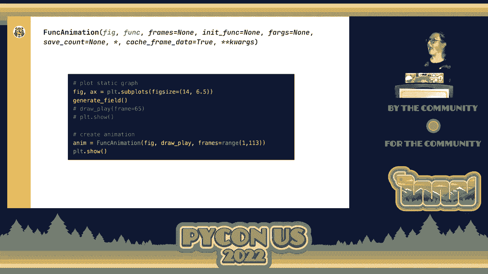
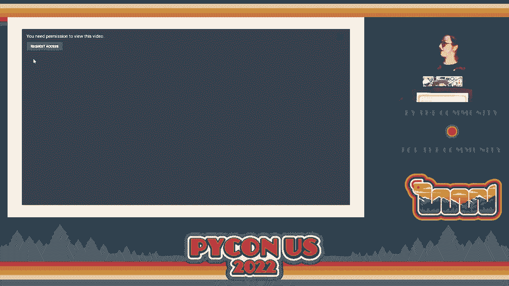
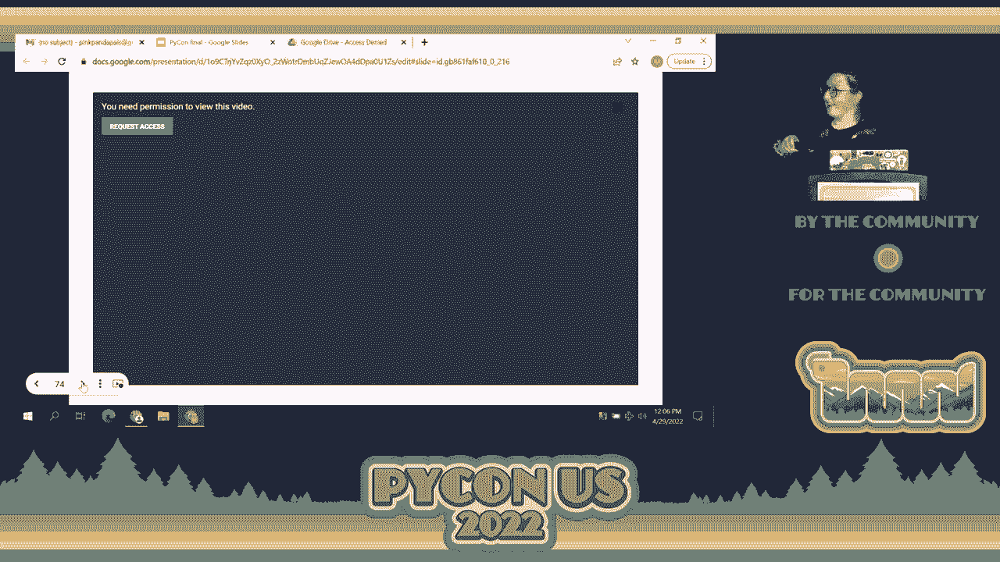

# P58：演讲 - Miranda Auhl_ 使用 matplotlib 的 FuncAnim 动画 NFL 逐场数据 - VikingDen7 - BV1f8411Y7cP

好的，我想我们终于准备好开始了。抱歉让你们等了一会儿，但希望。

我们准备好了。好的，请给 Miranda 热烈的掌声。谢谢。大家好，我希望你们今天过得很好。我非常兴奋今天能在这里。这实际上是我第一次在大型会议上发言。哇，感谢大家的热情。哇。今天我们将要探讨。

特别是与 funk 动画相关的，这是一个 matplotlib 的类。所以，关于我自己的简单介绍。我已经有一个很棒的介绍了，但我叫 Miranda Auhl。我是 timescale 的开发者倡导者，timescale 是一个基于 Postgres 的时间序列数据库。这就是我的背景。同时我也附上了我的 GitHub。

首先，因为我今天的演讲中会展示一些代码片段，但我不会深入细节。所以，如果你想确保能够看到我今天将要讲解的 Python 脚本中的所有细节，你可以通过我的 GitHub 账户访问它。所以现在如果你漏掉了什么也不用担心。你可以查看。

之后再看或问我问题。我在演讲结束时会提供确切的代码库链接。然后这是我的电子邮件和 Twitter 账号。所以，随时可以联系我。我想带你们进行一场旅程，不幸的是这不是霍比特人的旅程，因为那会很棒。但这是我将静态数据转化为。

我们将图表转化为数据动画。在这个过程中，我们将一起走过。这大致是我们将要遵循的设置和路径。所以首先，在我们真正可视化任何数据之前，我们必须理解数据并实际抓取数据。你知道，这很重要。然后我们将看看如何创建一个静态可视化。

最后，我们将看看如何将这个静态可视化转化为数据动画。所以我们开始时，你可能可以从这个演讲的名称中猜到。我们从 NFL 和 NFL 数据开始。所以在 2015 年，NFL 做了一件非常有趣的事。他们开始要求每个体育场都有 RFID 接收器，并且每个球员。

球内也有 RFID 标签。实际上有 RFID 标签，可以追踪每十毫秒的运动、速度、加速度等等。所以可以想象，从 2015 年至今，NFL 追踪每个球员每场比赛的速度、加速度等数据，每十毫秒记录一次。这是非常酷的时间序列数据。

令人惊讶的是，在时间尺度上震撼我们的是，NFL 实际上允许人们免费访问这些数据。同样，我简直不敢相信 NFL 发布了供任何人分析的免费数据。您所需要做的就是拥有一个普通账户。因此，从 2020 年开始，NFL 开始举办这些大数据球赛，发布。

这是这个令人惊叹的时间序列跟踪数据的一个子集。您可以下载它，下载 CFP 并进行分析。特别是在 2021 年大数据球赛中，他们发布了一大批每十分之一秒的跟踪数据，特别侧重于传球比赛。但是，他们当然不能发布所有数据。

数据，因为，他们不想向公众发布所有信息。但是，他们确实发布了大量数据。因此，当我的团队和我得知此事时，我们都惊呆了。伟大的时间序列数据带来了分析的重大责任。说法就是这样，对吧？好吧，我们就这样继续吧。所以所有的分析。

对，我们看到这些数据，我们知道我们想分析它。因此，第一步实际上是了解数据，对吧？这是一张您可以通过 2021 年大数据球赛访问的表格。这是跟踪表，基本上跟踪球员和球的每十分之一秒的物联网读数。

这实际上是您在比赛中可以访问的列的一个子集。因此，我们看到这里有很多数据。我想首先通过逐列帮助大家更好地了解数据。首先是时间，这是一个时间戳列。我们看到。

这是一个递增的每十分之一秒的时间戳。因此，我们看到在时间戳的左边或右边，我们有 14.599，实际上是 14.6。然后下一个时间戳是 14.7。因此，我们在这些数据中得到了十分之一秒的读数。这真的很细致。这非常有趣。这意味着我们可以，。

您可以分析和汇总这些数据的可能性很多。同时请注意，我们对于每个时间戳有很多重复行。这是因为，NFL 在所有球员和球上都放置了 RFID 标签。因此，每个球员和球每十分之一秒都会进行一次读数。在这种情况下，因为。

NFL 无法向我们发布所有数据。然而，他们确实为这个数据集发布了所有关于特定传球比赛的重要球员和球的每十分之一秒的数据。因此，您会看到这里有 14 行数据。13 个是球员，其中一个是球。因此，真不错。接下来我们有 X 和 Y。X 和 Y 是列。

代表坐标平面上的 X 和 Y 坐标。NFL 设置了球场，足球场。这样他们可以基本上将其视为一个 X，Y 坐标平面，以便你能够找到在任何时刻任何球员或球的位置。在这些比赛中，这真不错，对吧？所以这实际上就是这些 X，Y 坐标的含义。它是码数。

它是以码数为单位。它精确地说明了那个个体或球在任何给定时间的位置。然后我们有速度，S 代表个体在那个时刻的速度。接下来是加速度，A 就是这个意思。比赛 ID 是每场比赛的唯一标识符。得知道哪一个是哪一个，知道这些是有好处的。

然后这个比赛 ID 在说，指定由于这些数据主要是展示传球比赛。这个比赛 ID 是我们在比赛中知道特定传球的唯一标识符。这就是这个比赛 ID 的作用。然后最后一列是相当重要的。在今天的讨论中，我们将深入探讨这一点，但这是这个帧。

一开始，你知道，这并不特别清楚它是什么。实际上，这个帧列是在将每个十分之一秒映射到一个整数值。而且，它不仅仅是将其映射到一个整数值，而是将其映射到一个随着时间不断增加的整数值。因此，正如你看到的，14.599 的十分之一秒。

映射到帧值为一。而 14.7 秒的十分之一秒映射到帧值为二。因此我们看到，随着时间的增加，这个帧值也在增加。还有一个值得注意的地方是，当我们进一步查看这些数据时，对于每个比赛 ID，它会计算每个十分之一秒并将其映射到帧上。但是然后随着。

一旦你触发一个新的比赛值，比如说如果我们进入 76，这个帧值会重新开始计数。因此，我们从中知道 14.599 的十分之一秒是在第 75 场比赛中发生的第一个十分之一秒。然后你知道 14.7 是第 75 场比赛中发生的第二个十分之一秒。因此，这些帧 ID 是独特的。

到比赛中。好吧，现在我们开始了解我们的数据。现在我们可以进入有趣的部分。我们实际上可以分析它。我们可以创建可视化图表。因此，我想知道的其中一个可视化是，我们有这些 x，y 坐标。让我们实际上在场地上绘制这些球员，对吧？这听起来挺有趣的。我们有这些信息。来吧，做吧。

所以我创建了一个脚本，并且我的 Python 脚本设置了一个参数，因为我想专注于一次一个的比赛。因此，我定义了我想查看的比赛 ID，然后是我想要深入分析并绘制数据的比赛 ID。于是我定义了这个。然后我还从我的时间尺度数据库中提取我的数据。因此我在提取。

在我的 Python 脚本中，这个特定动作的数据。因此我可以深入挖掘并分析它。那么，我在我的 Python 脚本中有数据。接下来是什么？好吧，如果我要在场地上绘制玩家，我需要一个场地。因此我创建了一个生成场地的函数，我可以直接调用它，得到这个超棒的场地。所以我。

我让所有的 matplotlib 函数融合在一起，打包成一个函数，这样我可以调用它来生成场地，获取你知道的码线和标记等等。所以，然后，我们有了一个场地，但现在我们需要实际绘制玩家。所以我创建了另一个函数。

我创建了一个绘制动作的函数。这个绘制动作函数接受一个帧值。因此它接受一个帧参数，并将在该帧中绘制一个动作图。因此，帧值表示一个时刻。我可以输入一个时刻，并绘制这个图。因此，通过这个函数，我让它绘制，哦。

这只是，知道吧，给我们展示框架值。所以通过这个绘图函数，我获取了这个框架值，然后实际上可以绘制玩家。我创建了一个图例，并且我还得到了一个标题。所以，好吧。现在为了实际创建函数并在图表上绘制，我让它可以只调用这四行代码，得到，你知道的。

这个我想要的静态图。所以第一行是一个图形。我正在创建一个 matplotlib 图形。第二行是我生成场地，因此我在图形上生成场地。第三行是我为帧 ID 值为 65 调用绘制动作函数。然后最后一行是绘图显示，实际上给我们展示了这个图，所以我们可以看到它。

所以这是我正在深入研究的特定动作的第 75 秒，10 分之一秒。你知道的，我们看到主队、客队，还有足球，像你知道的，这很酷。你知道，这是一个有趣的图。我可以看到场上的玩家，但你知道，球在哪里。

现在传递过来了吗？它似乎漂浮在空中。没有人真正附着于此。所以，实际上，这个静态图，我觉得，它对我来说并不算太好。因此，我问了一个问题，嗯，如果我可以让它动画化，不仅让玩家在这个动作中移动，还能看到历史上。

他们在进行这个动作时移动。这就是 funk 动画发挥作用的地方。但为了理解如何使用 funk 动画，我觉得你必须理解动画是如何工作的，因为它们直接相连。所以，让我们考虑一个翻书。翻书，通常是这样的。

通常是一组快速翻转的静态图像，以给人这种运动的错觉。因此，我实际上用 iPad 创建了一个数字翻页书。我画了一堆粉色小球的静态图像。好吧。每一个都是。仅仅是静态图像，你知道，酷豆。 我得到了这个静态图像。太棒了。那么，什么是。

超酷的是，当你依次播放这些静态图像时，你会得到动画，对吧？你把这些静态图像串在一起，然后。你得到了动画。这，朋友们，就是 funk 动画的工作原理。它基本上是一个华丽的数字翻页书。那么，funk 动画的过程是这样的。

取一个静态图形函数，并对该函数进行反复迭代。因此，它会产生，你知道，静态图形函数生成一个图形。所以 funk 动画迭代。它创建了所有这些静态图形，然后将它们合在一起，依次播放以创建动画。因此，如果我们要在。

我们的代码，我们必须了解如何使用它，对吧？所以，这里我从 matplot。lib 文档中提取了这个，这就是我们在使用 funk 动画时需要的所有参数。我强调了在使用 funk 动画时必须包含的两个必要要求。因此，第一个是 fig。fig 需要一个图形，matplot。

图形对象可以生成这种动画。然后，funk 代表一个绘图函数，matplot，或者说 funk 动画实际上可以迭代以创建。所有这些静态图形，然后，你知道，它会将所有图形融合在一起。希望到此为止，你会想，等一下。我觉得我们有那个。我觉得我们。

我们确实有这两样东西，通过这样设置静态图形。我们创建了一个图形，这是我们所做的第一行代码。很酷。我们满足了第一个要求。太棒了。然后第三行调用了 drawplay 函数。我们知道 drawplay 函数实际上是一个可迭代函数。这一帧。

与时间直接相关。因此，当我们对这个帧值进行迭代时，你知道，我们在，知道。一，二，三，遍历这些整数帧值，对吧，我们实际上是在对时间进行迭代。我们在查看第一分之一秒，第二分之一秒。不断地、持续地。 所以，当我们对这个帧进行迭代时，我们实际上是在迭代。

随时间推移绘制。这正是我们想要绘制的，对吧？我们想在这个场地上绘制玩家的运动，随着时间推移。因此，我们有两个要求。好吧，现在下一个问题是，我能否直接将它放入函数中，函数就好了？

答案基本上是肯定的。但我们需要做一些快速调整，以确保它能够正常工作。因此，一件事是，如果我们要动画我们的绘制播放函数。就像现在一样，我知道的，在场上绘制图形，创建图例，创建标题，我们会得到这样的结果。不理想，对吧？这并不完全。

我们想要的是什么。因此，例如，球员的运动，这很好，对吧？我想看看球员如何随着时间的推移而移动，并且我想保留他们的历史运动。但这个图例是个问题。所以，这让我想谈谈这两种函数类型。当你创建要插入的迭代函数时，你可以使用。

Funk 动画。这是绘图函数，绘图函数类型与设置函数类型。因此，绘图函数类型，我强调了我称之为的三个函数，三种类型的函数，我称之为我的迭代函数，我的绘制播放函数。这个我们将首先查看的绘图函数，确实是一个绘图函数。它是累加的。

因为动画在继续，它正在向动画中添加图形。因此，每次调用绘制播放时，这个绘图函数将向动画中添加一个新图形。它是累加的。因此，这就是绘图函数的累加特性，好的？说了很多。抱歉。记住这一点，现在，永远。

这个函数是一个设置函数。它将被替换。因此，绘图函数。在你动画时添加，当你动画时，设置函数会被替换。因此，这个标题，你知道的。它并没有真正造成问题。可能，你知道，每次绘制播放时，都会被调用。它在设置标题。所以，出于效率考虑，我们可能想要把它移出去。

但我暂时就把它放在那儿，因为它并没有造成很多问题。但是图例，最后一个函数，这是个问题，对吧？这实际上是作为绘图函数在起作用，对吧？因为每次调用绘制播放函数时，它都会添加一个图例。所以，这是个问题，最简单的方法就是删除它。我们。

将其移到生成字段函数中，这个函数只会执行一次。因此，这使得它很简单。这是一个简单的方法，快速修复，以删除那个我们不想要的绘图函数。因此，接下来的注意事项是，确保每当你创建你的迭代函数时，你迭代的值或你迭代的参数。

在定义中，over 必须是第一个指定的参数。因此，对于绘制播放，对吧？

这没关系。我们只有一个参数值。但假设我有两个其他参数。在我的迭代函数中，我需要确保先调用框架，然后再调用其他参数。这就是 Funke 动画真正关注的内容。如果你不把迭代参数放在第一位，它将无法工作。好的。那么，现在我们实际上可以。

创建我们的动画。我们可以将这个静态图表转换为动画。所以，这里是静态图表的 Python 代码。我们在定义的顶部有 Funke 动画，仅供参考。所以，首先，我们需要实际上将 Funke 动画插入到我们的代码中。很好，意思是我们把它放进来。问题是 Funke 动画需要将动画存储到一个变量中。

因此，在这种情况下，我称我的变量 anim 表示动画。然后，这是使用 Funke 动画的一个要求。它必须有某个地方来存储动画。因此，你创建那个变量。接下来，你有两个必需的参数。所以，首先，我们有 fig。我们把 fig 放进去，然后是绘制播放函数，它是迭代函数。

这是下一个必需的参数。我们只需调用名称。你不添加任何参数。你只需调用函数的名称并把它放进去。最后。我还想——哦，抱歉，我没有——迈克尔在那儿。我还想指定 Funke 动画将要迭代的帧。默认情况下，Funke。

动画将从整数值零开始迭代。它将遍历整数值。所以，它从零开始，一，二，依此类推。在我们的案例中，我们喜欢整数值。我们想要在整数值上迭代。但我们希望它从一开始，并在整数值上迭代。所以，我们实际上可以指定确切的。

我们希望动画迭代的值范围。在这种情况下，我想要的值是从一开始，你知道，按一的增量增加。然后，这个 13 就是这个特定播放的帧的最大值。所以，我把所有帧值放在边界内。所以，这就是我从哪里得到了，因为我们从一开始。它一直到 13。

然后朋友们，嗯，现在我们实际上可以注释掉上面调用的绘制播放帧函数和静态图表的显示。我们可以把它注释掉。然后把图表显示放在我们的动画下面。哦，等等，它没有。

好吧，没关系。因为我这里还有另一个图表。没问题。我有一个——我有。

一个——它的 GIF。所以，没问题。技术问题，伙计们。真让人喜欢。好吧。我觉得我可以去下一张幻灯片。你可以——是的。好吧。这是——这是一个。

我添加的动画，我希望在第一个动画之后显示。但有趣的是，我把这个静态图表拿过来了，所以你可以忽略球衣号码。这些是我添加的球衣号码。而且，对，这更加有趣。现在，我们实际上可以看到这个播放——你知道，我们不仅仅是看到一个快照。

你知道的，球漂浮在太空中。现在我们实际上可以看到过去被投掷。这。个人就快要得分了，实际上也得分了。这真是超级有趣，参与感更强。酷的是，一旦你有了这样的动画，你可以像我在这里所做的那样添加内容。因此，在这种情况下，我使用了一个设置函数，一种设置类型的函数。

为每个人添加球衣号码，这样我们就知道谁在过去了什么，或者谁在擒抱谁。我还添加了一些统计表。如果你愿意，也可以在图表上为个人添加统计数据。可能性是无穷无尽的。那么你如何使用动画呢？只要你有一个图形，你就可以。

一个 matplotlib 图形，哦，还有一个可迭代的绘图函数，那么你就可以对其进行动画处理。这就是你所需要的一切。尤其是如果你能避免设置类型的绘图函数，并确保可迭代的帧值是第一个，你就可以对其进行动画处理。我希望你能感到鼓舞，实际上去尝试。

在家里的静态图表中试试这个。因此，各位，这就是全部。这基本上就是这样。以下是一些资源。第一个链接是指向我 GitHub 项目的链接。我包含了所有幻灯片以及我在这里运行的 Python 脚本。这是完整的脚本。因此，你可以获得我没有在这里展示的所有代码。第二个是 CAGG 比赛的链接。

2021 年 CAGGLE 比赛。因此，你可以自己下载数据。你所需的仅仅是一个 CAGGLE 账户。然后第三个和第四个链接实际上是第一个是我的团队制作的教程，旨在帮助你基本上通过从 CAGGLE 获取数据、将其放入一个时间序列 BB 数据库（基本上是 Postgres）来指导你。然后，哦，那是我的。

思路流程。然后实际上进行分析。最后只是一个博客文章，探讨你可以尝试的其他分析。所以就这些。祝大家编码愉快。非常感谢你们在所有技术问题上的耐心。我希望你们今天剩下的时间过得愉快。是的，谢谢。如果有人想要时间的贴纸，欢迎来找我。

如果你有问题，欢迎来找我。所以谢谢。

（掌声）。
