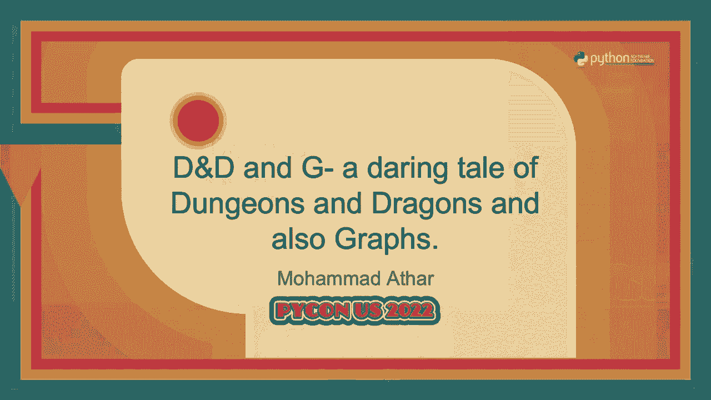
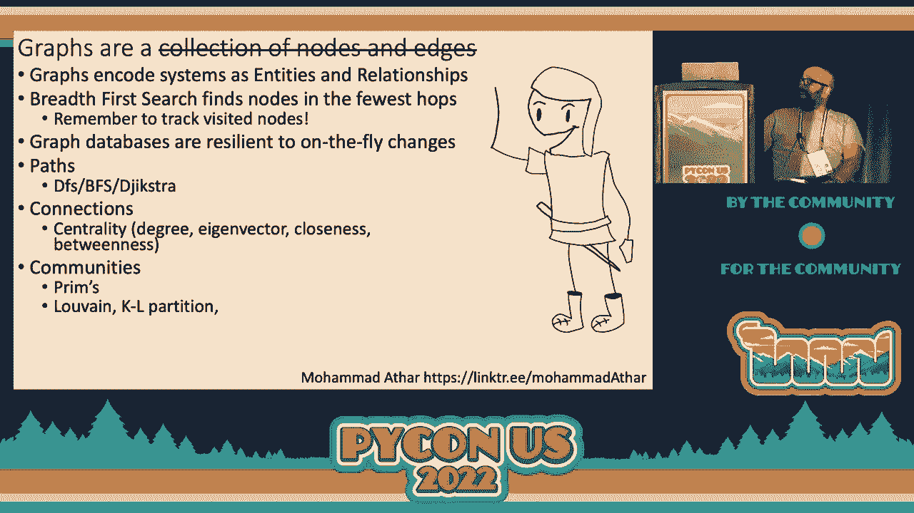
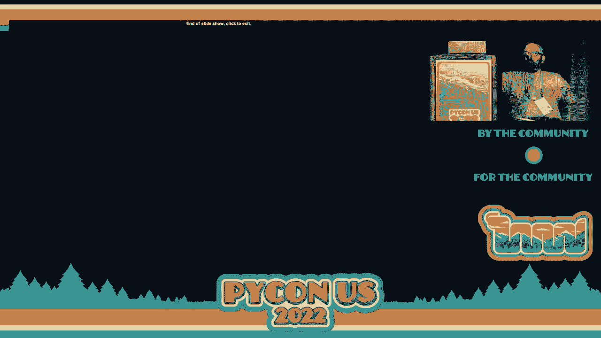

# P59：演讲 - 穆罕默德·阿萨尔 D&D 和 G 一个关于龙与地下城的冒险故事，以及 - VikingDen7 - BV1f8411Y7cP

欢迎回来。

我们今天的第二个演讲是关于 D&D 和 G，一个关于龙与地下城的约会故事，还有 Mo Madata 的工艺。请交给你了，Mo。大家好，感谢你们耐心等候。我站着很难受，我通常不会这么无礼。我们开始吧。是的，因为我大部分时间是在大型公司工作的，所以我的脑子有些混乱。

我必须给你们一个议程。我们将非常快速地谈谈我自己。我会设定一下你们的水平。然后我会非常简要地介绍图形，以及它们为什么很酷，为什么重要。然后我会谈谈我将其分为三部分的一些算法。

不同的类。好吧，让我们深入探讨一下。如果你想在这个演讲中跟进，可以查看我的链接树。它就是 Muhammad-Athar，上面有演讲的 PDF 和其他一些内容的链接。我会不断添加，所以请偶尔回来查看。是的，在我众多的兴趣中。

我真的觉得图形很有趣。显然，我喜欢 Python。我喜欢画画和偶尔做 DM，所以这三者的结合很不错。关于你， 希望你已经有了一些编程基础。这不会是一个真正需要大量编码的演讲，所以应该没问题。如果没有的话。

希望你对 Python 中的地图或字典有所了解。这是非常基础的面向对象内容，没有什么太难的。这里会涉及一些矩阵。如果你不熟悉它们，也不用担心。你可以随时回过头来学习它们，或者不使用它们，使用其他东西，因为图形是灵活的。所以熟悉图形的人可能会认出这是科纳斯堡市的地图。

这是图论中的一个经典问题，呈现了一个被河流分隔的城市。在河流之间有两个陆地。因此，有四个陆地通过七座桥相连。问题是，你能否游览这个城市，并且每座桥恰好走一次？

我更愿意通过询问你的朋友圈来激励图形。如果我问你关于你的朋友圈，你可能不会告诉我他们的姓名、出生日期和身高等信息。你更可能会告诉我他们的故事。

哦，这是我的朋友艾丽斯，我通过一个共同的朋友鲍勃在克莱尔举办的派对上认识的，那时我输掉了很多钱给我的朋友丹和艾伦。你正在描述这些人和你与他们的关系。这就是图形令人兴奋的地方，因为它们是一种能够编码的数据信息结构。

系统作为实体和关系。许多其他数据结构声称可以做到这一点，但图将这些关系视为一等公民，这就是它们真正强大的地方。而且它们特别能够编码的两个特殊关系是方向关系。例如，友谊类型的关系是有方向的。

如果你和某人是朋友，你会假设他们也是你的朋友，但如果你在 Twitter 上关注某人之类的，他们并不一定要关注你。这就是图在编码方向关系时特别有用的地方。还有传递关系。我喜欢用的例子是，如果一个广告公司制作了一个病毒式的。

视频，然后付费在 Twitter 上发布它。如果你真的喜欢它并且转发了，但你并不真的想买他们的产品，那么这个广告活动在经典分析中是失败的。但是如果你深入挖掘一下，你的朋友可能看过这个视频，正好在考虑购买该产品并且买了它。因此，你可以使用图分析来编码这些传递关系并进一步挖掘。

更深入地分析任何特定广告活动或其他关系的成功或失败。这是一个更经典的图的示例。它的本质上更正式的定义是，图是一组节点和边。那些只是图中的基本原子单位，边是表示它们之间连接的节点对。例如，我们有——我的光标在哪里？

找到了。节点 A，C，B 和 D。在它们之间有边。我们还可以有有向边，这仅在有向图中，你的边必须是有序对。我真的很想谈谈的一个事情，但不知道如何融入这个对话或演示的是路径和子图。它们是非常有用的工具。

因此，如果你在做图分析，你一定想熟悉这一点。路径就是它听起来的意思。它只是一组节点，你会得到一个——哦。我找不到我的光标。找到了。你得到一个起始节点和一个结束节点，并通过其他节点到达那个结束节点。然后子图只是图的一部分。

因此，如果你在做图分析时，这些将非常有用，但我想提到的最后一个稍微尴尬的事情是标签，它们是一种描述节点类别的方法。例如，在这个图中，我们有服务器或客户端，那就是一个标签。但是你也可以向任何图添加一个属性，那就是任何其他信息，且。

这就是图的真正优势所在，因为你可以添加名称、模型、特定机器上的空闲空间量或两台机器之间的延迟等内容，并真正开始进行一些很酷的分析，进一步挖掘你的数据。就应用而言，它们无处不在。如果你在这里。

希望你已经对此感到兴奋。但你可能已经在地图、社交网络、难题求解、状态空间、疾病传播、通信中见过它们。我不会读这个。你们可以稍后阅读。它无处不在。好的，这是 PyCon，所以我将非常简要地介绍如何在 Python 中表示图。

你可以使用邻接矩阵或度矩阵、边列表、字典，或者你可以使用像 network X 这样的包。因此，当你有一个矩阵表示时，矩阵实际上只是一个数字表。你让行表示起始节点，列表示目标节点。例如，你知道，我们在这里得到了数字二。

所以这是从 A 到 D，我们有两条边从 A 到 D。因此，表格中的数字表示边的数量。你会看到沿对角线的地方，全是零，因为这些节点没有连接到自己。还有一件事是，你会发现这个矩阵是对称的。例如。

从 A 到 B 是一条边，但从 B 到 A 也是一条边，因为从 A 到 B 和从 B 到 A 各有一条边，因为这个图是无向的。如果你在使用有向图，请小心，因为矩阵不会是对称的，某些假设会崩溃。这在 Python 中看起来就像一个列表。如果你想变得复杂一些。

你可以使用 NumPy 数组。你也可以只使用边列表，它只是成对出现。需要注意的一点是，我在这里两次写了边 CD，因为从 C 到 D 有两条边。字典很不错。它们更适合有向图。在这一个中有很多冗余，因为我想表示同一个图。

但是它们也很不错，因为你可以使用任何可哈希对象作为字典的键。因此，取决于你如何编写自定义节点类，你可以直接使用该对象作为键，并只拥有实际节点的列表。或者你可以制作自己的自定义节点对象和图对象，并将你的逻辑放在里面。尽管我非常喜欢图，但它们并不适合所有情况。

如果你在探索图和图数据库，特别是，如果你的写操作很多，或者你在查询数据库的大部分内容，最好避免使用它们。你会失去很多图所提供的效率。那么让我们开始吧。没错，快速免责声明。D&D 本质上是种族主义的。

这是《海岸巫师》正在解决的问题，但这已经根深蒂固了。因此，这让你感到困扰。我非常努力地避免在这里出现这样的表现形式，但我不是完美的。如果确实出现了，请告诉我，因为我一直在努力变得更好。它本质上并不暴力，但在 D&D 冒险中有时会出现暴力。

所以我也尝试去最小化这个。好吧，我们开始吧。你们在酒馆里相聚，你想要得到一个伐木工，因为外面下着大雪。酒吧就在这里的最上方，而你们却在这里的最下方。因此，你需要穿过这个非常繁忙的酒吧。你心想，这没问题。

我就要开始走了，但你来到了一个分叉路口。于是你想，哦，天哪。好吧，我就随机选择一条分叉。我不知道，随便哪一条。但这意味着你会走入死胡同，对吧？因为你碰到了这个，我不知道的美好东西。就像一只狗，一个女人，一个人。这是我唯一没有画的图。

所以我并不知道里面的所有事情。我在第一幅图中给了那个家伙信用，诺亚·QH，去看看他。你知道，支持艺术家。所以，嗯，你碰到了这个障碍。于是你回到了交叉口，走了分叉路口的其他选项。基本上你可以一直这样做，直到你到达酒吧。在最坏的情况下。

你的三元组看起来像这样。你从这里开始。你来到一个交叉口，然后你做出一个决定，如果这个决定导致你走入死胡同，那么你就返回并尝试另一条路径。这被称为深度优先搜索。哦，开玩笑的，我需要更多练习。首先。

我要告诉你如何将地图转换为图。你可以把走廊看作边，把交叉口看作节点。因此，这比许多其他事情更不自然，但确实自然地转化为图。所以你有我刚刚用字母标记的节点，以及死胡同节点。

我刚刚标记为一个 X。然后你有连接这些节点的边。你可以使用深度优先搜索，这是一种简单的递归算法，快速实现，易于使用。是的，我可以讲解一下。我们还有时间吗？是的，我们有时间。好的。深度优先搜索的运行方式是递归的，对吧？

所以你总是想在开始时放置结束条件。还有一个总是让我困惑的小细节是要确保你标记当前节点为已访问。正是这些算法的工作方式，它们会建立未访问节点的列表。如果你不将它们标记为已访问，你将陷入循环。

然后你基本上只需检查每个节点。如果它是目标节点，你就知道了。只需递归进入它。因此，我想在这里逐一讲解一两个迭代。我们将从底部的节点开始，该节点已标记为已访问。它不是终点。因此，我们将其标记为已访问。然后我们将检查它的每一个未访问的邻居。

对吧？我们将通过基本上到达顶部来执行深度优先搜索。这不是终点。因此我们在这里不会返回 true。我们将其标记为已访问。然后对于它的每一个邻居，我们将进一步递归。因此，最终你会遍历整个过程并到达终点。

你终于可以点一杯啤酒。如果你在美国未满 21 岁，还可以点一杯无酒精啤酒。但是当你点啤酒时，一个小街头流浪儿走过来请求你的帮助。你心想，哦，你知道吗？我来了。我在这里回答冒险的召唤。结果你因在酒吧中间拔出武器而被赶出酒吧。

每个人都只是想玩得开心。因此他带你去下水道，那里的情况很糟。但它被锁住了。你心想，啊，我得找到一把钥匙。他说，别担心。我觉得爱丽丝或鲍勃有钥匙。这是个奇怪的城镇，每个人的名字都是按字母顺序排列的。所以你心想，没问题。

我去问爱丽丝，看看她是否有钥匙。爱丽丝说，我没有钥匙。但也许你可以问卡门或德夫。你心想，好的，没问题。但我首先得去问鲍勃。鲍勃说，我也没有钥匙，我的脸看起来像吐司。所以也许去问艾伦。然后你心想，好吧，我要把艾伦加到我的名单上。

但我首先得去找卡门。卡门说，我也没有钥匙。去问鲍勃吧。这时事情开始循环。你心想，这太荒谬了。我为什么要这样逐一询问，明明有图的魔力可以帮助我整理这个搜索？所以如果我们把这个搜索重新审视，把人当作节点。

每个节点之间的边代表了这些人之间的关系。这可能是诸如“爱丽丝认识鲍勃”、“爱丽丝关注鲍勃”或“爱丽丝和鲍勃是朋友”之类的关系。或者“爱丽丝认为鲍勃有钥匙”，这就是我们将要使用的关系。所以让我们用——哦，天哪，再次审视这个问题。

我还有 15 分钟。哇，我以为这是一个 45 分钟的演讲。哎呀，伙计们，广度优先搜索太棒了。去做吧。好吧，有一件事，你要确保标记你的节点为已访问。这实际上是——是的。你在顶部划掉它们。因此当卡门终于告诉你去找鲍勃时，你会想。

哈，我已经处理好了。你会说，我可不会再被困住，伙计。那么，你还需要了解广度优先搜索的什么呢？哦，这也很酷，因为在解决问题时，你可以即时构建图形。所以这很棒。在你解决任何问题时，不必了解图的所有信息。

你正在解决的问题。还有一件我很喜欢的事情是，图比任何其他数据库都更能灵活修改。这就是广度优先搜索。广度优先搜索，大家都知道。查一下。所以，是的，你的标记已被访问。这是另一件事。这就是在这个网络上深度优先搜索的样子。

然后，这就是广度优先搜索的样子。它很酷，因为你可以在尽可能少的跳跃中找到解决方案。而对于深度优先搜索，你必须走到特定路径的尽头。所以，广度优先搜索绝对是你要记住的一项技能。

对于大多数简单问题，搜索是最有效的方式。你找到了钥匙，身处下水道，有一张地图。你心想，没问题。我已经把地图转换成图形了。而且我做过广度优先搜索。我可以在两个跳跃内到达那里，简单。所以你就跑去，孩子们看着你像个傻瓜，而他却比你先到了。

你会想，什么？他会说，我知道一个来自巫师迪克斯特拉的更快的方法。因为你没有考虑路径长度。如果你考虑路径长度，你可以找到更快的路径。因为如果你从 S 到 A 再到 B，你会走过这个大走廊，而如果你从 S 到 A 再到 E，你就会走一条小绕路。

如果你从 S 到 A 再到 B 绕道，你可以从 B 到 E，这样更短。这是一个很棒的算法，我希望有时间能和你讨论。但这就是了，所有内容都在 PPT 中。如果你们想知道，这就是要重复的一件事。

直到你将目标节点标记为已访问。这是进行迪克斯特拉时的小陷阱。不要太早结束。然后你进入恶棍的巢穴，发出蝙蝠侠的声音，发现这家伙并不是一只大蝙蝠，他只是个信使。因此，现在你有了一整张人际关系名单，或者说是一堆信息。

彼此发送的消息。因此你会说弗兰克的消息，吉娜的消息，赫克托的消息，等等，这就变得非常混乱。所以你把它变成一个图形。现在你有了一张消息图，说明这些人正在给这些人发消息。这样就不会混淆，因为图形使问题变得简单得多。

所以它看起来像这样，而不是仅仅是一个项目符号列表。因此，你可以在这里使用的算法是——是的，你如何确定谁实际上掌控这个网络？对此有很多不同的算法。大致上有两个类别，即关节点，它们告诉你哪个节点或。

你可以删除一条边，完全将图从彼此分开，基本上变成两个图，两个独立的图，或者一个不连通的图。如果你有这样的点，那是很好的。但这些并不总是存在。因此你可以使用的另一个工具是中心性，它只是确定一个节点的影响力。

我将使用度中心性，因为计算起来真的很简单。它只是逐个节点计算度数。因此你可以用 n 减 1 来归一化。节点数减去 1。这是任何节点可以拥有的最大连接数。因此它最终看起来像这样。然后你可以去掉一个在中心的节点来说明。

一个影响力很高的人。有很多其他的中心性。度中心性只是最简单的一个。你肯定想看看其他的。因此你去做更多的蝙蝠侠声音。然后你拿着一大袋钱去找市长，他们说，是的，这很好。我终于可以为城镇提供资金。但我不知道怎么分配。

这是我们的城镇章程。我们必须为所有这些事情提供资金。而我不知道从哪里开始。因此你可以使用社区检测，这是另一类算法。我只会讲素数，因为我几乎没有时间。但基本上你把章程中的每个实体变成自己的节点。

所以你有实体 1，1 是市长，1，2 是市长的助手，等等。然后你通过基本上问，他们是否在章程的同一部分中提到来连接它们。然后你可以稍微松散地连接它们，说，好吧。如果他们在章程中有提到，那连接就没有那么强，对吧？

所以我想对此有所了解。我将这条连接的权重设为 2，以表示，根据章程，这些实体之间的距离稍微远一点。然后你就有了一份边和它们的权重的列表。实际上，我是的，我按边权重对它们进行了排序，因为你需要这样做来处理素数。

算法，因为你基本上去掉所有节点，然后开始添加，或者你去掉所有边，然后开始将边添加回你的图中，直到你得到一个被称为生成树的东西。这看起来就是这样。你添加一条边，然后再添加一条边，然后你就按照顺序进行。

按权重排序的边列表。但如果你这样做，对吧。你可能最终会得到一个环，这与树的定义相悖，因为我们试图得到一个具有最小权重同时又完全连接的图。因此我们实际上不需要这个。

我们可以直接删除这个，我们继续这个过程，最终将图连接成一个被称为最小生成树的结构。然后我们可以开始删除边缘，以构建社区检测算法。这基本上就是倒着进行，直到达到所需的组数。所以我们将删除边缘 AF 和边缘 BF。现在我们有三个社区，对吧？

我们最终为市长办公室和市长助理的资金与水务、道路维护、动物越境、消防医疗和危险魔法同样多，因为图形并不是银弹。因此我想说的一件事是，你的算法只有在它们应该工作的情况下才能运行。所以如果它们，你应该总是问自己在运行之前我期待什么样的结果。

有什么算法吗？这件事，嗯，我不会分享那个轶事。没关系。基本上，你想在运行算法之前知道成功和失败的样子，对吧？

如果你没有得到预期的结果，请检查是否正确实现。检查是否有类似的算法。我确实提到过有很多社区检测算法。试试看。最后，重新定义一下什么是节点或边，因为也许在同一段落中的任意关系并没有编码任何有用的信息。

对吧？所以，哇，我准时到了。我还有时间剩下。太好了。我练习了大约五次，觉得我掌握了。但是，你知道，当你站在这里，灯光照耀时，时间就不重要了。但我只是想给你们留下一些小东西。图表很棒，哦。

不能把手臂交叉在麦克风上。它们真的很棒，因为它们将系统编码为实体和关系。如果今天你没有学到其他算法，至少要看看广度优先搜索。它真的很有用。你可以用它做很多不同的事情。它们对即时变化也非常有弹性。

你可以在数据库中向你的图形或任何节点或边添加信息，而不必更新整个内容，不必，你知道，重写模式等等。我们经过的三大类算法是路径、连接和社区。

外面有很多不同的东西。所以，肯定自己去看看。查看我的链接树。里面有我的 GitHub，我本来想在昨晚我的飞机着陆和现在之间填充一些内容，但我肯定会在本周晚些时候添加更多资源，供你们查阅。太好了。我真不敢相信我还有时间剩下。看看那。

你们又有了五分钟的生命。

谢谢观看。
