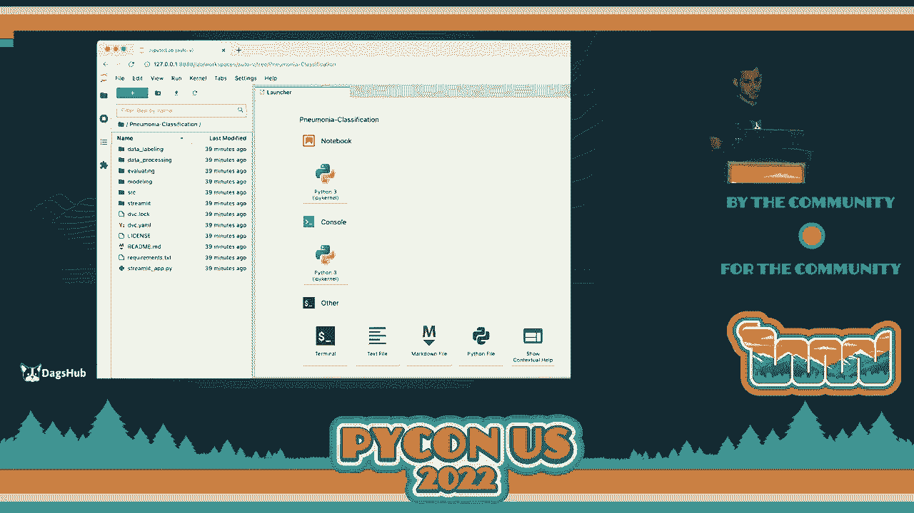

# P62：演讲 - Nir Barazida_ 停靠你的 Jupyter Notebook - VikingDen7 - BV1f8411Y7cP

好的，大家。

感谢大家的耐心。请与我一起欢迎来自 DAGsHub 的 Nia，她将谈论 Docker 和加载书籍。谢谢你。感谢大家的等待。对于技术问题，我深表歉意。我必须说，看到大家在这里真是太棒了。

这两年来进行虚拟会议非常疯狂，终于见到了大家的面孔，甚至还有一些我在会议期间已经见过的熟悉面孔。这真是太棒了，感谢大家今天的参与。我想通过问几个问题来开始今天的会议，这样我们可以更加数据驱动。

我们为什么想在 Jupyter 和 NodeBook 中使用 Docker？我首先想问一下，大家使用的是什么操作系统？举手吧，谁在用 MacOS？哇，哦，很多人。很好。我喜欢它。刚刚遇到了一些问题。那 Linux 呢？不错。哇，挺多的。Windows 呢？哦。

在 Windows 上编程？哦，这对你有用。开玩笑的。我以前用 Windows，但后来发现 Mac，使用 Mac 编程是最好的。你们使用什么特殊硬件吗？例如 GPU，强大的 GPU，非常强大的集群？在这里有没有人使用特殊硬件来训练他们的机器学习模型？

好的，看到很多人。很好。太棒了。我想问一下在座的所有人，如果我提议大家一起合作一个机器学习项目，你们觉得怎么样？

你觉得这可能吗？嗯，可能会非常具有挑战性。你会面临很多不同的依赖项，使用的操作系统会有问题，比如“在我的机器上可以工作，但在你的机器上不行”，这将是许多难以克服的挑战。在这次演讲结束时。

我们将使在座的所有人能够在同一个机器学习项目中共同合作，无论他们使用的是什么操作系统或工具，只需使用 Docker。因此，你们将成为 Docker 的超级英雄。

这次演讲将专注于 Docker 的基本概念。什么是 Docker？

我们为什么真的需要它，它有哪些不同的组件？

所以如果到会议结束时你对它不熟悉，你将会熟悉。如果你已经熟悉 Docker 并知道如何使用它，这将对你是一个很好的复习。我的名字是 Nio Balazita。我是 DAGsub 的 MLOps 研究员，DAGsub 是机器学习的 GitHub。它为你完成 DevOps 的繁重工作。

在我的研究中，我专注于机器学习工作流程，在我看来，它在机器学习、DevOps 和人之间有着完美的平衡。当我下班时，我会进行另一种类型的重工作。对此，我认为我们准备开始了。那么，Docker 是什么？Docker 是一个开源软件打包工具，用于构建隔离环境和。

运行具有其依赖关系的应用程序。因此，我们能够将我们的应用程序和项目打包到操作系统级别，并在不同的机器上运行，而不必担心它所拥有的依赖关系。这是业界最广泛应用的工具之一。

并且它在项目的开发和生产生命周期中得到广泛使用。那么，为什么我们真的需要 Docker 来进行机器学习呢？一般来说，Docker 提供的主要优势是标准化。这首先给我们带来可重复性，这对数据科学家来说非常重要。

所以，大家使用的是相同的操作系统，相同的工具，相同的依赖关系。这意味着如果我们想要重现之前的结果，我们可以非常轻松地做到。我们可以简单地使用我们的 Docker 容器在本地机器上运行，并开始构建我们的模型。它还为我们提供了移动应用程序的能力。

我们的模型训练需要从一台机器迁移到另一台。如果你想一想，大多数使用或训练机器学习模型的人都使用大量计算能力。因此，他们确实需要将项目从本地机器迁移到远程集群或强大的 GPU 机器。这一点非常重要。有些人可能会问。

为什么不简单地使用 Colab 来完成这个任务呢？好吧，Colab 确实提供了一个隔离环境，其中包含团队所需的所有依赖项。这可能有点过于严厉，我为此感到抱歉。因为 Docker 很好，并且提供了一些有价值的能力。但是，当你试图将工作投入生产并迁移到生产环境时。

这会变得更加困难，因为你不知道机器使用的操作系统。如果你和你的团队成员使用同一台机器，你使用了什么工具。那么，从研究状态迁移到生产状态会花费更长时间。这就是为什么我不建议在考虑部署到生产时使用 Colab。好的。

因此，我们准备讨论 Docker。Docker 有三个主要组件，最终创建那个隔离环境。我读了一篇非常好的博客文章，作者是我们的首席执行官，所以我可能有点偏见。他将构建 Docker 容器的过程与烘焙饼干的过程进行了比较。这听起来可能有点搞笑。

但我向你保证，这会很有意义。在接下来的两分钟内。所以，Docker 的第一个组件是 Docker 文件。Docker 文件基本上是一个包含所有命令的文件。当我们生成 Docker 镜像时，这些命令将被调用，这是下一个组件。

它基本上包含所有命令，如复制、移动文件或运行某种安装。因此，该文件将保存所有这些命令。在我们的类比中，Docker 文件是工程师关于如何创建我们的饼干切模的说明。比如应该有多高，应该多坚固，等等。

接下来，我们有我们的 Docker 镜像。我们的 Docker 镜像就像一个非常、非常大的压缩文件。所以不要在这个房间外使用它，包括在家观看的人。所以 Docker 镜像就像一个压缩文件，保存着我们项目的所有组件或所有依赖项。如果你想将本地机器上的文件复制到该 Docker 镜像中。

如果你想安装所需的操作系统，如 Nox、Ubuntu 等。在我们的类比中，Docker 镜像基本上是我们的饼干切模，将创建我们的 Docker 容器。所以它基本上包含了我们运行应用程序所需的一切，配备所有依赖项。最后，我们有我们的 Docker 容器。

许多人可能听说过 Docker 容器。Docker 容器基本上是我们应用程序的一个实例，正在运行。在我们的类比中，Docker 容器实际上就是我们的饼干。所以我们通过整个过程尝试构建的东西。这些容器存放在哪里？

所以容器存放在容器注册表中，这是一种特殊类型的存储。公司使用不同类型的存储，如 AWS、ECR、Azure 容器注册表等。但还有另一个注册表，即 Docker Hub。你可以把它想象成 Docker 的 GitHub，它有很多 Docker 镜像。

所以这很重要。所有这些注册表都存储着 Docker 镜像。这些镜像在 Docker Hub 上可供公众使用，适用于各种任务。因此，如果你需要用于机器学习或运行 Flask 应用程序的镜像，如果你想使用 Windows、Mac OS 或其他操作系统。

所以你会在 Docker Hub 上找到它们。现在我想我们准备好动手，开始为我们的机器学习项目从头构建新的 Docker 容器。为此，我将使用我的新单分子分类项目。我试图对 X 光胸片进行分类，看是否有肺炎。

我的 DAGs up 仓库包含我的代码和数据。我的代码由 Git 版本控制，我的数据由 DVC 版本控制。我将把所有这些拉取到我的 Docker 容器中。此时，假设我想测试一个新的假设。我想使用一种不同类型的骨干模型。

我将使用 VGG19，而不是 ResNet。这是我的新假设。为此，我将创建一个新的 Docker，并拥有我需要运行该实验的所有依赖项。所以我们的目标是创建一个 Docker 容器，我将在其上运行实验，包含我的团队正在使用的所有依赖项。

那么我们要做的第一部分是什么呢？

我们将开始编写我们的 Docker 文件。由于时间有限，我不会详细介绍如何安装 Docker。这是一个相当简单的过程。这个过程在不同的操作系统之间是有区别的。因此，在 Mac、Windows 等操作系统上的安装方法各不相同。但这非常。

应该是一个非常简单的任务。我将在最后一张幻灯片上添加一个链接，参考如何安装它。所以在开始工作我们的 Docker 文件时，我们通常会基于一个已经具有我们项目所需的一些基本依赖项的先前镜像。比如我们希望使用的操作系统，或者我们希望使用的语言。

它显然是 Python。一些框架，比如 Keras、TensorFlow、PyTorch 等等。如果我们不打算基于之前的镜像，我们将不得不从头开始写所有东西，这将非常困难。或者这将是一个非常漫长的过程。因此，我强烈建议你基于之前定义的镜像来构建你的镜像。

对于我的项目，我需要以下依赖项。所以我需要 Python 3 及以上版本。我需要 Git，因为我想把我的项目克隆到那个 Docker 容器中。我想使用 Jupyter notebook 和 TensorFlow 作为框架。所以在 Docker Hub 上快速搜索一下，瞧，我找到了一个由 Project Jupyter 维护的 Docker 镜像，可能很多人都熟悉。

它们是维护 TensorFlow 和 Jupyter notebook 镜像的。还有许多与数据科学相关的其他依赖项，如 pandas、NumPy 等等。我们实际看到的是什么呢？首先，我们看到维护者的名称，然后是反斜杠。

然后是我们这里的图像名称。这里的图像名称实际上是 TensorFlow-notebook。这一点很重要。接下来，我们可以看到这个 Docker 镜像的可靠性。所以我们可以看到它有五千万次下载，这相当可靠。我们还可以看到如何将它拉取到我们的本地机器上。

假设我们不想重新发明轮子。我们想要使用那个已经存在的图像。所以我们所需要做的就是将它拉取到我们的机器上，然后我们可以开始使用它。接下来，我们要查看标签。标签基本上是该 Docker 镜像的版本。

它会随着依赖项的更新而更新。假设 TensorFlow 发布了一个新版本。那么可能 Jupyter notebook 或 Project Jupyter 也会创建一个新版本。你可以看到这里有一个特殊类型的标签，即 latest。而 latest 意味着该镜像的最新版本。接下来。

我们可以看到它所使用的操作系统。所以这里它使用的是 Linux，重量为 3.1 吉字节。让我们把这个信息放入我们的 Docker 文件中。为此，我们将使用 from 命令，它将说明我们将使用的基础镜像。接下来，我们将说明维护者反斜杠。

我们想要使用的镜像的名称。最后，我们将说明标签名称。所以这里我使用 latest，但如果你想要该镜像的早期版本，你可以简单地指定它们。在这里指定。当我运行那个命令构建镜像时，它将简单地运行安装命令并使用标签 latest。

此时，我想继续查看我的 DAGSA 仓库，看看我的 Git 远程和 DVC 远程，基本上是我的远程存储。因此，我可以拉取我的数据。我在哪里存储我的需求？我也希望安装与我的项目相关的所有需求。所以我将所有这些信息放入我的 Docker 文件中。

在这里你可以看到我使用了 run 命令，它将基本上运行以下管道。接下来，我将克隆我的仓库。我将目录更改为项目。我坚信使用分支来测试新的假设。所以我切换到 VGG19 分支。然后我安装我的需求，并拉取我的所有数据。

所以这将被翻译成这个。还有一些我认为对你有价值的命令。所以我们有 N 命令，它将简单地设置环境变量。我们有 copy，它将把文件从我们的本地机器复制到那个镜像。可以想象成一个虚构的压缩文件。我们有维护者。

所以这是 Docker 镜像维护者的名字。还有 CMD 命令，它是在构建镜像后默认运行的命令。接下来，我们想要运行这个 Docker 文件并构建我们的 Docker 镜像。因此，为此，我们将使用 Docker build 命令。我们将使用 pull 标志。

它将简单地从远程 Docker hub 拉取所有最新更新。接下来，我们将标记它。所以我将它标记为助记符分类，即仓库名称，以及 VGG19，这是我想要测试的假设。然后，我将指定我的 Docker 文件的路径。通过从你的终端运行这个命令。

它将构建一个新的 Docker 镜像。如果这是你第一次使用那个基础镜像，那么 TensorFlow notebook 镜像将会下载到你的本地机器。然后，它将运行所有相关命令，并将其包装在那个 Docker 镜像文件中。现在让我们看看我们所有的文件。

所有我本地的图像。因此，通过运行 Docker images，你将看到你拥有的所有镜像。在这里我可以看到我有新的单细胞化和 VGG19。接下来，我们希望运行我们的 Docker 容器并开始我们的项目。为此，我将使用 Docker run 命令。

我将给它一个名称，因此我会靠近我的名字，指定我想使用的端口，以及我希望基于的 Docker 容器的镜像。因此，它将使用新的单细胞化 VGG19。你还可以在这里指定 Docker 镜像 ID，它也会有效。通过运行该命令。

我将在终端中看到与我从终端运行 Jupyter notebook 时相同的内容。因此，它将简单地运行 Docker 容器，并为我提供需要复制到浏览器中的 URL，以便获取 Jupyter notebook 环境。通过复制其中一个 URL，我将获得一个完全配置的 Jupyter notebook 环境，包含所有项目依赖项和文件。因此，这包括我的代码文件和数据文件。基本上，我所需的一切，以便开始测试新的假设。

假设在此时，我更改了几行代码，我运行了实验。现在我准备对其进行版本控制，并推送到我的 Git 和 DVC 远程库。因此，我想同时推送我的 Git 跟踪文件和我的 DVC 跟踪文件。为此，我想通过 SSH 连接到那个 Docker 容器。我们该怎么做呢？

因此，我们将使用 Docker X 命令，它将执行该命令。

我们将获得一个交互式终端。然后我们将获取我们想连接的 Docker 容器 ID，以及我们想运行的命令。这看起来会是什么样子？

然后我将开始查找我当前正在运行的所有容器。从中，我将获取我想连接的容器 ID。接下来，我将运行命令，即 Docker 执行 IT。然后提供容器名称。接下来我将打开该容器中的 shell 脚本。正如你所看到的。

我在我的运行容器内。接下来，我们可以简单地运行或更改目录，运行 Git 状态。对我们的代码进行版本控制，然后推送到我们的远程库。就是这么简单。你可以开始在一个隔离的环境中与同事一起构建你的机器学习项目，而不必担心依赖问题或使用不同类型的工具。

通过推送所有这些文件，我可以看到在 DAGs 上的实验，并将其与不同的实验进行比较。我可以对我的 Jupyter notebook 进行差异比较，查看我修改了哪些单元格。修改时的输出是什么？如果我以不同的方式处理数据，那么它的输出又是什么？

等等。所以在今天的时间快要结束时，我想快速回顾一下我们讨论的内容。我们首先讨论了为什么我们实际上需要 Docker 来进行机器学习？

我们理解，这对我们与同事合作和再现结果非常有价值。然后我们讨论了 Docker 的不同组件。我们有 Docker 文件、Docker 镜像，最终还有 Docker 容器，这是一个完全配置且正在运行的实时应用。

最后我们看到如何从头开始构建我们的 Docker 容器。我想问问你们是否有任何问题，在你们提出之前，我将先提出一个我没有涵盖的问题。那么你如何与同事分享我们刚刚创建的那个镜像呢？

由于时间有限，我们今天无法讨论这个。但这其实是一个相当简单的任务，就像 Docker push。它听起来像 Docker push。你只需在 Docker Hub 中设置你的凭据，然后推送到你的 Docker 注册表。再次说明，我在最后一张幻灯片上添加了一个链接，方便你轻松完成。

如果你有任何问题，我很乐意回答。我想我们还有一分钟，或者你想把它放到会后讨论。>> 实际上，我们很抱歉让你感到困惑。由于 COVID 限制，我们不能在房间里接受提问，但欢迎你到前面来提问。>> 太棒了。那么我们就把它放到会后讨论吧。

我想感谢大家今天的参与。太棒了。能够进行现场演讲和交流，看到你们每一个人都在这里真是太好了。这真的让我很感动，所以我非常兴奋。非常感谢你们的参与。>> [掌声]。
