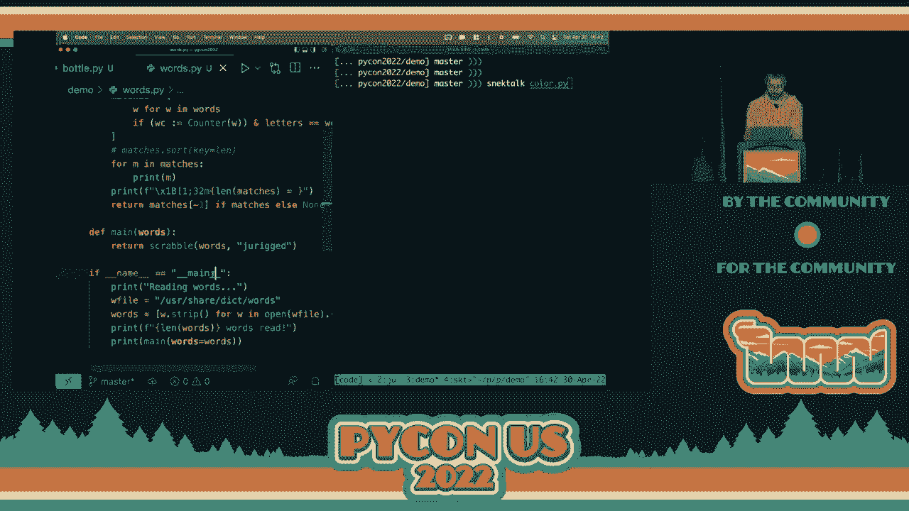

# P63：演讲 - 奥利维尔·布鲁莱克 _ 如何在 Python 运行时进行更改 - VikingDen7 - BV1f8411Y7cP

大家好。请热烈欢迎奥利维尔先生。他将讨论如何。

[掌声]，\>\> 大家好。今天我将向你们展示如何在 Python 运行时进行更改。换句话说，我将解释如何在 Python 编程语言中实现实时编码。首先，什么是实时编码？我将使用的定义是。

这是实时编码。实时编码是一种开发过程，在程序运行时同时编辑它。这样，对该程序的更改可以实时观察到。例如，在这里底部我有一些代码，用于一个我毫不掩饰地从 Pi 游戏教程中复制来的玩具视频游戏。当游戏运行时，我们可能会做一些更改。

加速是如何工作的。当我们这样做时，游戏立即响应并使用新的规则。当然，这对于游戏开发非常好，因为你可以获得所有的即时反馈。但你也可以用它来在不重启服务器的情况下更新其余的后端。或者在长时间运行的机器学习程序中修复一个 bug。

不想为每次所做的更改重新运行耗时的预处理。因此，如果我们看一下现有的实时编码平台，你会发现其中很多都在音乐创作领域。例如，超级合成器或发送 Pi。因为它们允许你立即听到对代码和参数所做更改在输出中的反映。

这对了解哪些内容有趣或不值得做是非常有帮助的。我还必须提到小类型语言，自 70 年代以来一直存在。它最著名的实现是 Squeak，以及它的分支 Pharo。它们围绕在实时环境中编码的概念构建，使其成为该领域的先驱。关于 Python 特定的。

我认为 Jupyter 笔记本在某种程度上符合这个理念。虽然它仅限于你在笔记本中编写的单元格，但它有一个很棒的功能，可以开启称为自动重载的功能。在 iPython 中也可以使用。这可能是我即将展示的内容中最接近的东西。现在我要展示的是我自己的实时编码库。

被称为 Jurigged。如果我有时间的话，也许我会演示一个我称之为 Snack Talk 的平台，它是建立在 Jurigged 之上的。在我们更深入探讨现场编码的机制和实现之前，我将准确描述我们希望做什么。请记住，我们在这里所做的每一个决定都将改变 Python 的运行。

有一些权衡。我们在这里最基本的需求是能够在程序执行的中间更新函数。我真的指的是在执行的中间。所以，你启动程序。它像往常一样一步一步地执行。然后在某个时刻，你用你喜欢的文本编辑器打开其中一个源文件，并进行更改。

一些函数的代码，然后你保存。接下来会发生什么？我们希望发生的事情是，一旦你保存，我们希望修补正在运行的进程。我们将保持执行指针在当前位置。因此，例如，在这里我们即将执行 Y 函数。我们将保持在执行中的位置。同时我们也将保持程序状态。但。

我们将更改函数。这意味着下一次我们调用 foo 时，将运行新代码。简而言之，这就是我们在这里的主要目标。但有很多细节需要更准确。例如，假设我们有这个函数 f，它在一个名为`mod.py`的模块中。我在另一个模块`test.py`中使用它。

这个测试函数。因此，我将以三种不同的方式调用 f。首先，我将从模块`mod.fx`中获取它。第二种方式是，我将使用这个直接导入的 f 引用。或者我将简单地从一个字典中获取，我在其中存放了这个函数。这些都是我在许多现有项目中找到的有效调用函数的方法。

Python 程序。我希望的是，如果我更改`mod.py`中 f 的源代码，我希望所有这些引用都被更新。在这种情况下，它们都应该返回新的结果，即 1000。现在你可以立刻看到，仅仅重新运行那个模块`mod.py`是不够的。因为这只会创建一个新的 f，并不会更改现有的。

在`test.py`中，f 的值和字典中包含的值。第一次调用会被调整，但其他调用则不会。因此，这是我们必须注意的。接下来，我们还希望更新方法。例如，也许我想在动物类中添加一个 talk 方法。在我添加这个方法之前，如果我创建一些动物，比如叫她 Bertha。当我要求她说话时。

我将得到一个属性错误。但在同一个正在运行的程序中，如果我添加这个 talk 方法，我希望不仅是未来的动物，所有现有的动物也应该突然获得说话的能力。在这种情况下，即使我们的 Bertha 也会突然获得这种能力。同样，如果我改变一个现有方法，我也会。

希望现有对象使用新版本。当然，对于可接受的更改类型，有一些固有的限制。因为虽然我们可以相对容易地更新行为，但对象状态则不能如此。如果例如，你更改对象的初始化方式或更改内部数据结构，旧对象可能会变得。

与新行为不一致。在这种情况下，你可能需要简单地重启这个`function`。当然，并不是所有情况都有解决方案。然后我们也想更新闭包。对于那些可能不熟悉这个术语的人来说，闭包是一个嵌套在另一个函数内部的函数。例如，我在这里展示的就是你可以写的最简单的闭包。

虚线框是一个闭包。它携带来自另一个函数的某些状态，这里是来自`adder`的变量`x`。这在 Python 中很常见。你可能以前做过。例如，如果你写一个装饰器来包装一个函数以添加一些新行为，那么在装饰器内部定义的那个适当函数就是一个闭包。而这个例子。

我所展示的加法函数在虚线框内，会将`x`加到作为参数给出的任何数字上。为什么呢？

因此，每次调用`adder`时，我们都会创建一个新的加法函数，它与`adder`的`x`值打包在一起。因此，`add one`是与`x`值为`1`的加法函数打包在一起。在另一个文件中，`add two`是与`x`值为`2`的加法函数打包在一起。因此，当我们调用这个测试函数，给`add one`和`add two`传入`10`时，我们会得到`11`和`12`。

因此，如果我们改变那个加法函数，理想情况下我们希望发生的事情是，我们希望改变这些闭包。我们希望`add one`和`add two`都发生变化。所以我将加号换成了乘号。所以现在测试应该返回`10`和`20`。我注意到的一点是，如果你在`iPython`中使用重载百分比。

它实际上会正确地改变`add one`，因为它正在重新运行模块。但它会漏掉`add two`。因此在这种情况下，你会得到`10/12`而不是`10/20`，这就是不一致的。再次强调，有一些限制。例如，你不能从外部作用域要求比原始要求更多的变量。

因此，如果有另一个变量`z`你想从`adder`中捕获，但之前没有捕获。你不能捕获它，因为事后无法做到这一点。它可能已经消失，并被垃圾回收器回收。我要提到的最后一个要求是精度。我的意思是我们应该只更新。

这需要做什么。例如，这里我有一个小程序，它简单地循环用户输入，并在用户给出的每个数字上调用`f`。如果我们更新`f`，我们希望继续运行那个`while`循环，但在下一次迭代中，我们将对下一个输入调用`f`的新版本。当然，问题在于`f`与。

避免在更新部分代码的过程中再次运行 while 循环。这是我在现有的 Python 解决方案中没有看到的东西。也许我错过了，但我觉得这很重要。因为很多人可能想在程序中更改的功能都在主脚本文件中。所以你希望能够。

在不从头开始重新运行脚本的情况下进行这些更新。那么我们将如何进行呢？我们将使用的方法是热补丁。因此，这基本上是在程序的实时实例中补丁函数。为了理解如何修补 Python 代码，我们首先需要了解数据结构。

对于函数的工作。我使用了之前相同的闭包示例，但将外部和内部作为函数名称。其背后的函数结构如下。左上角的框是外部函数的函数对象。它包含许多字段，但我想关注的重要字段是这里的 dunder 代码。当我说 dunder 时，我是指。

在前后各有两个下划线，供你参考。而该字段，dunder 代码，指向一个不同的对象，即代码对象，其中还包含许多与函数相关的字段。例如，有一个参数代码，还有许多其他内容。但还有这个字段指向函数的字节码。所以当我们。

调用其他函数，它会读取 dunder 代码指针并获取该代码类型对象。然后它将读取字节码并执行它。如果我们有内部函数，那么在某个时刻我们需要为内部函数创建一个函数对象。在其 dunder 闭包字段中，我们将放置一个包含变量的元组。

我们正在捕获的内容。在这种情况下是 x。dunder 代码指针将指向内部函数的代码对象。而该对象最初包含在外部函数代码对象的 CO_understore 核心常量字段中。因此，这只是一个执行所需常量的列表，比如文字值、true、false，以及某些代码对象。

最终，正如我所解释的，我们可能有多个函数实例对应于不同的捕获值，但它们最终都指向同一个代码对象。现在 Python 的有趣之处在于这些 dunder 代码指针可以被修改。因此，你可以取任何现有的函数对象并将该指针更改为指向代码。

你自己制作的某个其他函数或对象。如果你做错了事情，这可能会很危险。你实际上可以导致分段错误。但它基本上允许你动态改变函数的行为。所以我们想要做的是，每当我们有新代码时。

我们想要识别所有指向旧代码的函数。然后我们希望将所有旧代码的双下划线代码指针更改为新代码。好的，考虑到这一点，这是计划。首先，我们需要检测源文件是否发生了变化。已经有库可以很好地做到这一点。例如，我使用过的 watchdog。

我们可以简单地在后台监视变化。当发生变化时，我们可以异步地进行批处理。然后我们需要识别哪些函数或哪些函数发生了变化。这涉及对旧源代码和新源代码之间进行结构差异比较，并剥离未改变的部分。所以我觉得我真的没有时间去详细说明这一点。

所以我就说到这里。有几种方法可以比其他方法更好地做到这一点。一旦我们有了这些，我们将在隔离中编译新代码以获得一个新的代码对象。然后我们需要找到与所更改内容对应的旧代码对象。那一步需要一点思考。天真地说，你可能会认为它会是。

很容易找到，因为如果我在模块 m 中更改函数 f，那么在模块 m 中，如果我获取属性 f，它基本上应该在那里。在 99%的情况下，这种说法基本正确。但事实是，它可能在任何地方。例如，也许它是一个带有装饰器的函数，而那个装饰器将其深藏在字典或其他地方。

模块，因为也许它是 Web 服务器上根的处理程序。当然，这种情况是合法的。也许装饰器也执行了它并将其丢弃。所以它甚至不在身边，无法更新。但为了弄清楚这一点，你基本上需要探索整个堆。最终，我觉得我并不认为。

其实并没有其他彻底的解决方案。所以我基本上就是这样做的，但使用了垃圾回收模块。通过使用 GC 模块，你可以获取所有对象，并基本上找到所有函数，缓存它们的代码对象、文件和行号。事先来看，这相当昂贵。但理想情况下，我们希望在热补丁的开始时只执行一次。

模块是早期导入的。在这种情况下，这并不算太糟糕。但当然，它引出了一个问题，那就是后面加载的模块怎么办，对吧？幸运的是，这相对简单，因为我们有灵活性来设置事物。我发现一个很好的方法是使用审计钩子功能。这是 Python 3.8 中新增的功能。

本质上，这是一个监听关于 Python 运行时事件的方法，当我们打开文件时，当我们分叉一个进程等等。同时，每当我们执行代码时。每当新模块被导入或执行用户代码时，都会触发 exec 审计事件，你可以进行监视。这将向你提供之前的代码对象。

到执行。因此，你可以从那里获取对象。这基本上是找到的最简单、最容易的方法。但这仍然不完全足够，因为我们需要处理每个指向该代码对象的函数对象。现在，许多函数对象可以有相同的代码对象。尽管我们早些时候调用了获取对象。

可能是在之后创建的。但在这种情况下，GC 模块中仍然有 getrefers 函数，它将帮助我们基本上找到它们。再次强调，这个操作与堆中对象的数量成比例，正如我发现的那样。但热补丁并不是一个经常发生的操作。坦白说，它需要真的。

在显著之前是很大的。现在我们拥有了一切，我们终于可以交换指针，然后获利。现在，我们完成了吗？嗯，我会说，还有一些小问题需要解决。例如，如果你仅为某些函数选择性地更新代码，并且它们的行数与之前不同，那么任何未更改的函数。

但后面的内容将会在回溯中显示错误的行号。所以如果我们想要，好的行号，我们当然想要，那么我们还需要做更多的更新。另一个问题是依赖于代码检查或代码签名检查的复杂装饰器将会失败。所以我在这种情况下想到的是即时编译器。例如。

我还在考虑使用例如类型注释进行调度的单调或多调库。让我给你一个例子。这是使用我编写的名为 OVLD 的多调度库的代码，你可以用 pip 安装并尝试，如果你想的话。这非常酷。所以，是的。

在这个简单的例子中，我基本上定义了一个具有两种行为的函数 F。所以如果参数是 int，它将执行这个乘法，然后在没有找到匹配时有一个回退函数，它只会耸耸肩。那么如果我们更改这些定义，使其不再是 int，而是 float，我们将。

添加另一个调度，以便在输入是字符串时可以做一些特别的事情。所以理想情况下，我们希望行为能够调整。这样在我们用 int 调用 F 时，我们得到了 100，但现在没有 int 的函数。所以在更改后它耸耸肩，而 float 和字符串则从耸肩变得温暖和热情。

问题在于我们不能简单地重建一个新的 OVLD 对象，因为可能存在其他引用，它们将变得不同步和错误。因此，我们想要更新现有对象。与此同时，如果我们要这样做，我们需要更新该对象的内部状态。所以如果它有，例如，一个名称的缓存。

类型到调用该类型的函数，我们需要更新它。实际上没有通用的方法可以知道如何做到这一点。它必须是一个特殊代码。但是如果我们有一个协议，让库可以选择加入呢？我做了一个，虽然可能不完美，实施可能还有点 bug，但就是这样。这个想法是，

当我们有一个代码对象并且寻找指向它的函数时，我们也可以搜索一种特殊类型的对象。例如，这种符合对象。所以，当我们获取引用时，它将找到函数和代码之间的链接。并且它也会找到这个链接。如果它看到这一点，它会看到与一个具有 donder 的对象之间的链接。

conform 方法，它会知道，好的，我必须用新代码调用这个。然后那个对象会知道如何更新另一个对象的内部数据结构。这很不错。我认为这是一种相当好的方法，因为它避免了对热补丁库或任何外部库的依赖。你只需定义那个对象。

并正确连接事物，确保对它的引用被保存到某处。如果我们在进行实时编码，那将是有帮助的，否则它将仅仅坐在那里而无所事事。对吧？好的。所以我们快要结束了。我想做的事情是展示一下 jerk 是如何工作的。所以我将要。好的。好的，我假设。

这应该足够大。好的。所以 jerk 的工作方式是，它的工作方式完全相同。你可以用它来替代 Python。因此，代替 Python bottle.py，你可以使用 jerk bottle.py。我将添加 V 标志，以便它是详细的。好的。所以这里我只是在打印啤酒瓶之歌。如果我想，我可以更改代码。

更加适合儿童。所以现在我有牛奶瓶而不是啤酒瓶。我可以做一些愚蠢的事情。现在是一个会说话的蛇。我会提到的一点是，如果你不能修改当前正在运行的函数，那么你可以。但是更改只会在你第二次调用它时生效。例如，我更新了这个。

在 sing 方法中，但它仍然是逐个执行，因为它正在执行 sing。但是下次我调用 sing 时，它会调整。我可以改变这一点，以便稍微快一点。所以这是一种你可以在任何现有程序中使用 jerk 的方法。我还想在一个开发环境中使用它，在这里你并不一定是有组织的。

在你不一定自己写循环的情况下。所以我这里有另一个例子。好的。这就像一个简单的例子。所以想法是，当我们执行这个时，我们会得到这个小接口，所有在标准输出上的内容都会打印出来。我们在这里也得到了结果。所以当然我可以在这里更改它。它会重新执行。

从我在注释行中指定的主函数开始。你可以在模块中指定任何函数。它基本上会在那里停止，让你在需要时重新启动开发。我可以修改其他函数，比如我可以移除排序，然后它就不再排序了。如果我做一些错误的事情，它会显示错误。

我可以修复它，然后它会再次运行这个程序。最后我可以继续，然后它将正常执行程序。对吧？好的，我还有一分钟。所以我要给你展示的另一件事是小吃，谈话。这是我在 Gureg 基础上构建的东西。对吧？这是一个接口。

你可以打印任意对象，它们有这样的图形表示。这是一个随机颜色函数。我可以选择编辑它。好的，实际上这就是我想做的编辑。但是是的，我基本上可以更改它，它会改变行为。但我也可以保存它。所以你可以看到编码的原始源文件。

一旦我在这里更改了它，我可以选择保存，然后它会保存回原始源文件。你也可以用它来编辑内置的东西之类的。而且你甚至可以把它们保存回来。这是我写过的最糟糕的脚枪。不过，总的来说，就是这样。好的，那么，对吧。

总之，添加补丁功能、方法和闭包在大多数情况下是可能的，这就是我在 Gureg 中实现的。通过协议也可以实现多重调度和代码转换。我称之为“雷电一致性协议”，并在一个我称之为 CodeFind 的独立库中实现了它。如果有人想要的话。

看看这个，我会很感激的。所以，是的，就是这样。谢谢。如果你想要幻灯片，你可以扫描二维码。如果你想尝试 Gureg，我也有一个二维码。所以就是这样。非常感谢。[掌声]。

