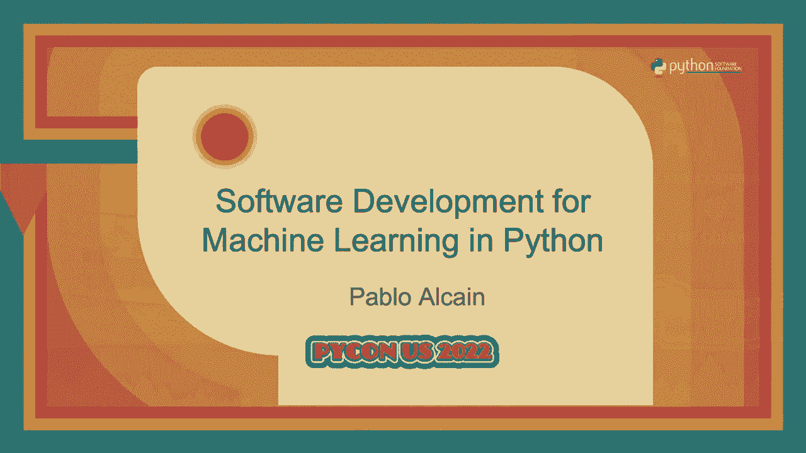
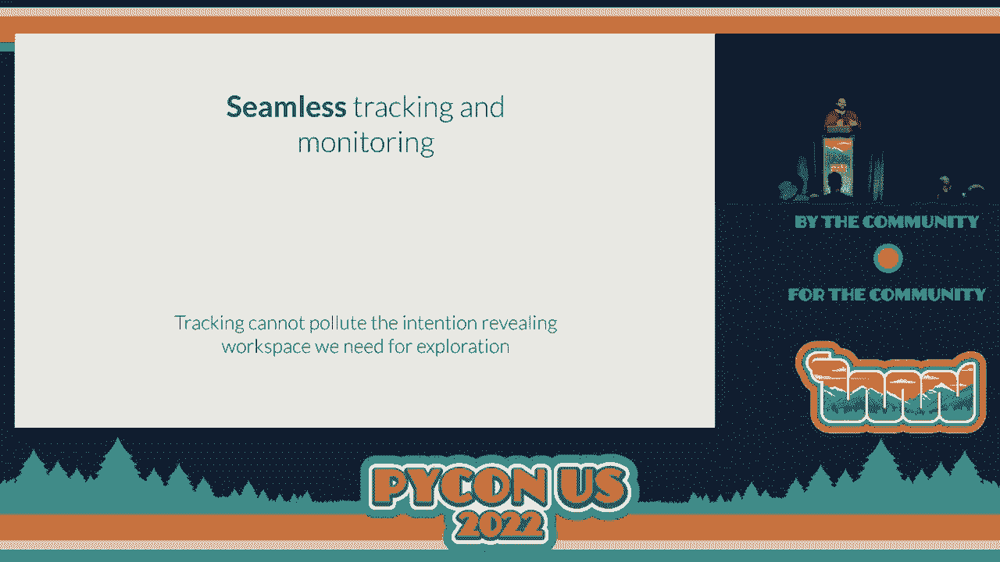
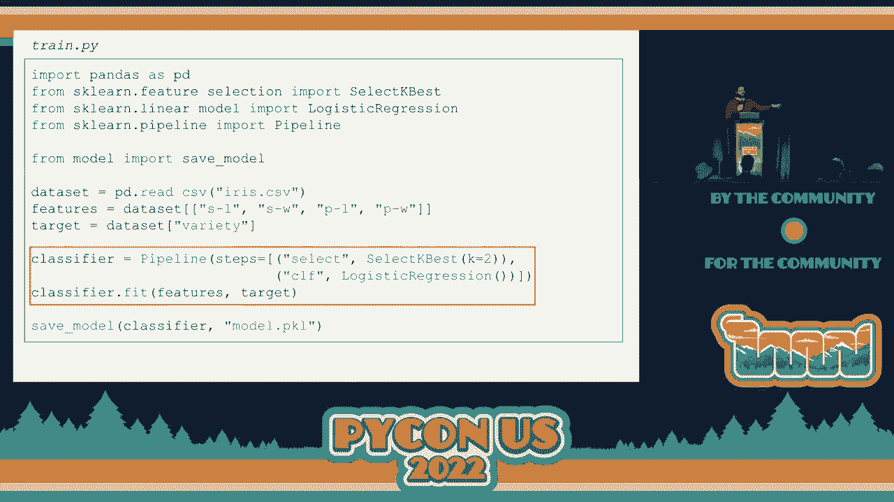
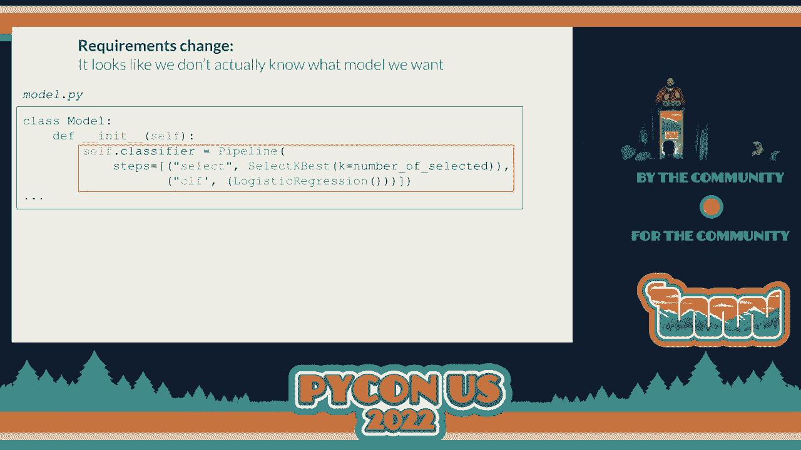
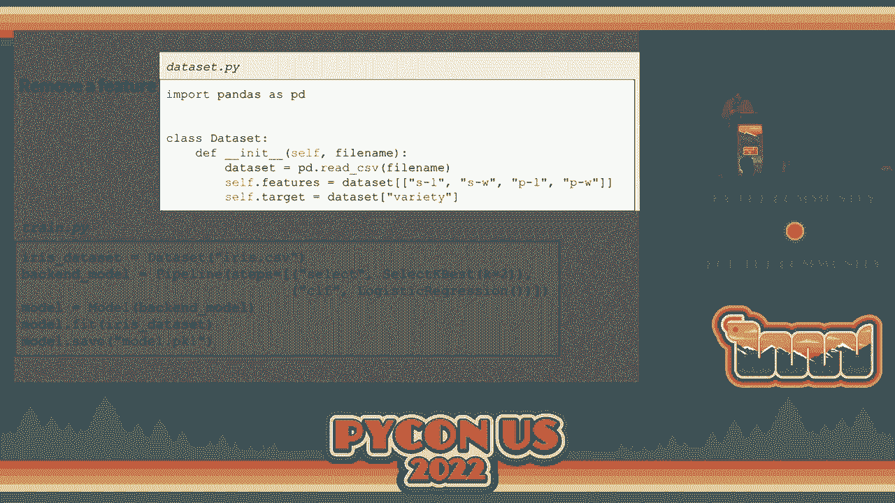
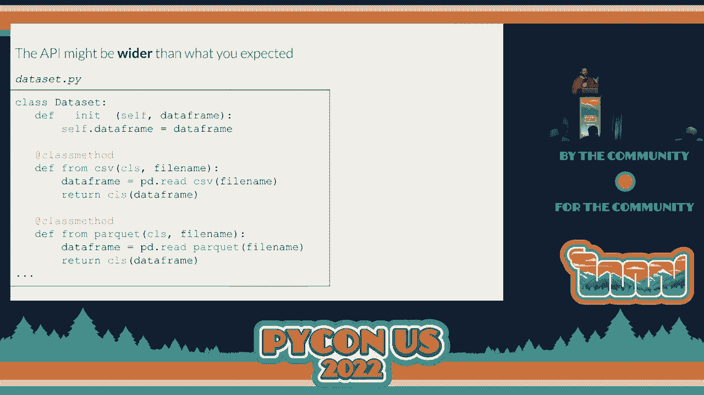

# P64：演讲 - Pablo Alcain_ Python 中的机器学习软件开发 - VikingDen7 - BV1f8411Y7cP

大家好，欢迎回来。

接下来由 Paolo Alkain 进行关于 Python 中机器学习软件开发的讲座。

现在交给你，Paolo。现在这样更好，对吧，你将受到我的限制。希望一切顺利。首先，欢迎大家。非常感谢你的到来。我很高兴能在这里，也感谢所有让这一切成为可能的团队，每天都为我们这场精彩的会议而努力。

我希望我们接下来的几分钟能讨论一些非常有趣的内容，不仅对我来说有意义，而且与我们在机器学习行业的最新发展有关，我们试图探讨一下在机器学习中需要什么样的软件开发。

所以我们先从一个非常简单的问题开始。这是一个非常著名的问题，无论你去哪里找 scikit-learn 的教程，或者许多试图让你入门分类问题的页面，你可能都听说过分类的概念。在这里，我们有鸢尾花的想法，其目的是让我们能够通过四个特征对它们进行分类：花瓣长度、花瓣宽度。

花萼长度和花萼宽度。从这四个特征中，我们必须弄清楚它属于哪个品种。如果是 cetosa，醋的颜色是什么？

首先需要说明的是，由于这些内容将会被截取，你会看到列字符串被大幅缩短。这并不是我所鼓励的。最好能尽量使用最好的列名，但在这种情况下我们需要节省幻灯片的空间。我想说，在生产代码中不应该这样命名列。

当你查看这个问题以及如何解决它时，第一件事就是通常你会翻开一本旧书或打开一个 Python 解释器，然后开始将其作为一个游乐场。尝试新想法，找出如何解决这个问题。因此，解决这个问题的一个非常简单的方法可以是这样的。

这个问题的简单解决方案使用了对于机器学习开发者或数据科学家来说非常常见的技术栈，基本上是使用 pandas 和 side idler。你可以看到开头有一堆导入，然后我们基本上加载了一个数据集。从我们加载的 CSV 数据集中，我们识别了特征和目标。

然后我们将用来自 scikit-learn 的管道对象对其进行分类。在这种情况下，这个管道对象包含两个步骤。在第一个步骤中，我们根据特定标准选择两个最佳特征。我们甚至可以选择我们想要的特征。从这些特征中，我们直接使用弹性回归进行分类，以便查看结果。

找出它们属于哪种类型。这就像是分类器的声明。在下一步中，我们实际上会对模型进行拟合。这就是我们通常所说的机器学习模型的训练。然后我们计算训练集上的准确率得分。

这只是为了展示我们可以做的事情之一。再说一遍，我并不是说你应该在训练集上计算模型的准确率。但在计算出准确率后，我们只是告知并了解我们得到的准确率得分。哇，我没想到会这样。幻灯片上发生了一些奇怪的事情。

就像我在幻灯片下有一个子幻灯片。这里没有显示出来。让我尝试快速解决这个问题。好的。这就像是实时设置。哦，我的天。好的，哇。看起来是某个机器学习模型理解了我想要的内容。好的。现在我们从这里开始。好的。可能会再次发生。我不知道我是怎么解决的。

所以如果再次发生，我可能需要重新排查一下。现在，这是我们所完成的演示。实际上，我们在这里看到的这个管道几乎是我从你们学习教程中逐字提取的。当我们需要将其投入生产时，会出现几个障碍。

当我们尝试将这段小代码投入生产时。这是一张非常知名的图像，来自一篇名为“机器学习系统中的隐性技术债务”的论文。我建议每位尚未阅读此论文的数据科学家、机器学习开发者或机器学习工程师去看看，因为它能让你看到在思考这个问题时我们作为数据科学家所忽视的地方。

在你视野的另一边。如果你是一个机器学习工程师，你会意识到数据科学在查看和处理生产代码时通常面临的问题，反之亦然。将事物投入生产意味着面临许多不同的挑战。我不会列出所有的挑战，但基本上我认为我们通常不考虑的那些。

有时我们没有考虑到在部署中的持续训练、基础设施的提供，以便实际进行模型训练、模型跟踪，以及如何服务于模型。这仅仅是你可以看到的众多问题中的一个子集。

不是问题，而是挑战，当你必须将其投入生产时，你会看到这一点。我们在这里看到的论文的一个关键要素是，我们刚刚构建的机器学习代码只是整个结构的一小部分。我今天要讨论的是我们如何使这小而基础的代码部分。

我们如何让它运作，以便服务于进入生产的目的，并且也方便科学家的探索。我们为什么要说数据科学家或机器学习开发人员了解代码如何进入生产是重要的？我们所说的是数据科学家的开发体验是紧密耦合的。

生产是什么样子的。在第一个例子中，假设我们有一个科学家做了一些更改，也许比我们刚才看到的更多，并直接将其部署到生产中。我们所说的部署到生产，意味着他或她是负责的人。

实际上编写我们所称的生产代码。这将属于我们之前看到的结构。在这种情况下，数据科学家或机器学习开发人员与生产代码的外观有很大的耦合。但同样值得注意的是，如果下一个数据科学家来并尝试在此基础上进行更改，他们必须能够理解生产代码是什么。

经验之间的耦合既涉及代码的首次编写，也涉及理解代码以便后续进行更改。现在我们可以想到另一个极端解决方案，那就是设立一个障碍。我们在数据科学家和生产之间放置机器学习工程团队。

代码，我们说，嘿，你不会是编写生产代码的人。别担心。你只需思考模型，考虑它如何运作。所有这些都在你的实验中进行，我将负责将其写入生产代码。尽管看起来这样可以将数据科学家与生产代码本身解耦。

问题在于，当下一个数据科学家来并尝试理解发生了什么时仍然存在。他们必须获取我们在生产中最新的代码，并且必须理解这意味着什么以及如何使用它。现在，这可以通过许多不同的方式来解决。一种可能性是说机器学习工程师是负责的那个人。

解释生产是如何与每个数据科学家相关的。另一个可能性是，数据科学家需要彼此交流，这些都是在许多不同方面都能很好运作的常见解决方案。但今天我想和你讨论一个用于生产化的软件设计解决方案。

机器学习代码。如果我们能学会如何编写这段代码，以便它符合以下四个支柱，那会怎么样？第一个是目标必须具备快速和简单的探索。我们知道，针对这些问题的解决方案非常具备猜测性，模型变化得太快。因此，我们必须让数据科学家能够在生产的基础上探索新的想法。

代码。但我们也希望它具有声明性和意图性。马丁·福勒表达得比我可能更好，他说的其中一件事情是，目标是我们唯一的文档，它足够详细和精确，可以作为文档使用。这并不意味着除了目标之外，我们就不需要编写任何文档。

当然，我并不是这么说。我所说的是，我们必须抓住这里的生产代码的机会。我们必须能够利用我们在生产中拥有的代码。我们必须尽可能地使其具有声明性。另一个重要的事情是，我们需要设立我们所称之为合理的检查点。接下来我们将更好地定义我所指的内容。

但我们在这里的主要目标是，如果我们有一个管道，在整个生产代码中做许多不同的事情，我们希望能够用我们之前的解决方案来解决问题，并简单地重用其中的一个步骤。我们还希望能够跳出问题，并将之前的步骤作为参考。

供我们的探索等。重用这些步骤非常重要。请记住，有时这甚至是必要的，因为某些步骤可能运行时间过长，如果你必须等待四到五个小时才能运行一个步骤，你就无法加快这个探索过程。还有另一个非常重要的事情是，我们需要无缝的跟踪和监控。

这是在生产中运行的代码。我的意思是，我们必须跟踪代码，但不能以污染我们刚才描述的声明性和意图代码的方式来进行跟踪。假设我们看到的是同样的运行代码，但我们有。

大约 30 或 40 个调用来锁定这个、锁定那个等等。

这是一个解决方案，虽然它锁定了模型，但却严重污染了开发空间。因此，我们想要避免这种情况。现在，结合我刚才讨论的这四个支柱，我们将对刚刚看到的模型进行生产化的详细说明。现在这是我们刚写下的训练文件。

现在导入的内容已经折叠，可能在演讲的某些部分会折叠。我们要记住，重要的是无论如何都能正常工作。这是我们刚刚写的代码。我们从这里看到的代码中意识到，这不可能投入生产。为什么？

因为我们刚刚在分类器中训练的模型。fit 行仅存在于这个 Python 文件的作用域内。我们需要找到一种方式将这个模型持久化，以便稍后能够加载它，做我们需要做的事情，例如，我不知道，像在线服务模型之类的。因此，我们意识到的第一件事是，不是检查准确性代码。

我们实际上想要做的是将模型保存为一个 pickle 文件，例如。你知道 pickle 是一个非常有用的库。我们可以用这句非常简单的两句话直接加载它，这要归功于 with 语句。现在，当我们这样做时，文件中的预测部分将会被加载。

我们拥有的模型文件。在一个未见的数据集上，这个我们正在查看的未见的 i。我们将进行预测，并自然地检查准确性评分，对吧？

现在请记住，这只是预测的可能实现之一。当然，我们可以以这种方式进行，从我们将训练与服务解耦的那一刻起。我们实际上可以通过，我不知道，通过 REST 端点或通过 FastAPI 或其他方式来服务。我们可以自由地以任何方式进行。所以把这个文件视为我们可以服务模型的所有可能方式的代币。

一旦它被持久化。我们刚刚写的目标中，我们意识到的第一件事是我们正在暴露实现细节，对吧？当我们查看这两件事时，我们在说，嘿。也许我们不想在目标中告诉人们我们是如何保存模型的。如果我们与他人一起保存，它是某种东西，我们想要抽象，对吧？

我们想要将其抽象化。我们知道如何做到，对吧？我们将其抽象为函数。我们创建了保存模型函数和加载模型函数，负责实际在底层执行这项工作。做这件事的那一刻，有两件事。两件非常重要的事情开始发生。第一个是你可以在训练中看到。

我们刚刚删除了 with 语句的 py 文件。那可能是我们两行代码的一部分，以声明式的方式放置，对吧？

现在我们知道我们实际上是把模型保存在某处。但另一个事情开始发生的是，我们现在将整个目标库进行了拆分，整个目标库，只有三个文件，对吧？无论如何。我们将整个目标库拆分为两个不同的语义空间。

一个是我们在顶部看到的。这就是我们要称之为库空间的东西，对吧？这些是我们要开发的所有工具，将在底部的应用空间中使用，对吧？

所以我们现在要做的是在库空间中工作，看看我们如何简化应用代码，这正是我们希望数据科学家或机器学习开发人员进行迭代的。现在在我们完成这个之后，构建保存模型功能，以及加载模型功能，train.py 文件现在的样子是这样的。

你看，这很重要，这就是我把导入留在这里的原因，现在我们不是直接导入人员，而是从我们自己的库中导入保存模型功能。现在我们看看我们所拥有的，嘿，有些东西与我们刚刚看到的相似，对吧？我们这个分类器发生了什么？

有点类似于我们所做的加载模型和保存模型的事情。

我们有这个想法，对吧？我们需要将它们抽象成函数。关于这个想法，我要给你一个小剧透。这就是我们方法开始衰退的地方。所以我想非常清楚地说明，我不知道如何足够清晰地表述，这是我们开始滑向一个危险坡度的方式，我们将看到它超越了什么，对吧？

所以这没关系，对吧？我们还不知道剧透。我们很开心，正在构建这个拟合模型。它实际做的事情是加载分类器并进行拟合，对吧？所以这是模型拟合的一部分。

现在我们知道的一件事是，桑迪·梅茨在一次演讲中以很棒的方式提到这一点，演讲的主题我想是《所有的小事》。如果你还没看过，我建议你去看看，当你在代码中看到这种模式时，比如有重复的前缀或后缀。

你看到的实际上是里面一个对象在被折磨，尖叫着，对吧？

这里有一个对象，我们必须找出它的名字。很明显，我们所看到的对象是模型对象，对吧？

所以我们进行小的重构，把我们拥有的函数改成这些模型对象的方法。看，现在它看起来更漂亮了，对吧？

因为分类器现在属于初始化部分，而拟合只是拟合。而 train.py 文件仍然看起来非常声明性，非常有意图地揭示，现在更多地呈现出这种面向对象的方式，对吧？我们不仅满足于此，我们还说，嘿，有什么相似的事情发生在那个资产上。

对吧？我对这个资产的处理方式有点像我对模型所做的那样。再说一次，我不会开始把这些放入函数中。我们已经知道，尾部的最终结果是我们将构建数据集对象，对吧？

所以下一步我们要说的是，嘿，也许我们在这里看到的特征和目标是一个称为数据集对象的抽象的一部分。我们想给你这个名称，对吧？我们有了数据集。这就是我们要做的，特征已经在构造函数中写下来了。

特征和目标意味着什么。现在我们来看一下之前看到的 `train.py` 文件。哇，这看起来比我们之前的清晰多了，对吧？

我们有了更简洁的代码，甚至还可以在这里添加我们的抽象，对吧？

所以模型的 `.fit` 不再像以前那样直接使用特征和目标。我们现在使用的是刚刚构建的数据集，具有一个抽象。我们对此非常满意，但正如我告诉你的，这并不是故事的结束，对吧？

因为突然有人告诉我们，嘿，我们不想总是选择这两个最佳特征。有时你想选择三个，有时你想选择一个。当你编写代码时，有人只是想了解如何探索这个数据集。

对吧？他们只是想看看如果我们不必选择最好的两个特征，会表现得如何。我们说，好吧，我们知道怎么做，对吧？保持冷静，保持冷静。我们知道怎么做。我们不再半心半意地选择那两个，而是传递选定特征的数量作为参数，对吧？现在我们非常高兴，因为我们拯救了这一天，对吧？

现在你可以选择想要的选定数量，对吧？那么，要求就满足了。突然他们说，嘿，有时我们其实不想选择，我们想要放弃。你在我们拥有的所有数字和所有特征上做一点小处理。然后我们说。

好吧，我们可以让这个工作，对吧？因为我将和你签订一个合同，如果你发送的选定数量为零，那么我将完全忽略选择步骤，对吧？

现在感觉有点奇怪，对吧？我意思是，与 Na 进行比较并不是我们很享受的事情。但我们也正在进行人们要求的所有这些变化。突然有人说，实际上我们并不总是想做 60 次回归。

我们想尝试多层感知机。我们已经深陷于这个思维过程中，唯一能想到的就是在这个构造中再加一个 if，对吧？

这在你试图为你的库提供所需的灵活性时经常发生，对吧？所以现在，如果之前的部分有点，呃，呃，呃。e-de。现在这简直是令人恐惧的，对吧？我们有与字符串的比较。我们必须提高更窄的，如果有人，比如，甚至做，我不知道，像是一个小。

在传递分类器类型时出现了错误，这完全没有任何意义，对吧？我的意思是。我们没有走在正确的路径上。必须有更好的方法来做到这一点。然后我们意识到问题在于我们实际上不知道，模型是什么。

我们想要的，对吧？所有正在变化的事物。我实际上在解释的是，这个模型，正如我们所说，是非常推测性的，我们将会。

永远不知道模型是什么样子的。所以我们从一开始面临的主要问题是说模型必须在这里实例化，对吧？分类器必须在这里。如果我们不在这里实例化模型，而是简单地将其作为参数传递，会怎么样，对吧？

在构造函数中，我们不再做那些奇怪的事情，比如处理字符串和选择性的数字等，而是简单地说，后端模型，我的意思是指实际上要进行拟合计算的那个，可以作为构造函数中的参数传递。

现在，当我们开始这样做时，这就是模型的样子，而我们在这里刚刚发现的并没有什么新鲜事，对吧？我们并没有发现任何东西。这就像一个众所周知的面向对象设计模式，称为**依赖注入**，对吧？如果你熟悉**SOLID**这个缩写。

**依赖注入**是**SOLID**缩写中的 D，对吧？这就是它的重要性。对我们来说，在 Python 中，通常**依赖注入**仅意味着在构造函数中参数化某些东西，对吧？而在这种**依赖注入**和组合机制中，通常我们最终会得到方法的委托，对吧？

因此，我们从模型类调用的拟合实际上将调用委托给后端分类器的拟合，对吧？这是一个你在开始进行**依赖注入**和组合时会经常看到的图形。现在这是模型的样子，可以看到我们所做的是去掉了刚构建的模型的耦合。我们去掉了它与实际实现之间的耦合。

对吧？现在实现也回到了表面上。所以我们现在有这个**依赖注入**的想法，作为修复我们刚刚置身其中的一些问题，对吧？但突然有人告诉我们，我想去掉一个功能，对吧？

从我们这边来看，我想简单地去掉一个功能。这不是一个要投入生产的东西。我只是想知道如果没有这些特性，模型会表现如何。我们看看我们的目标，另一方面我们说，好吧，也许有一些。

依赖注入可能会有所帮助。我并不是说它没有帮助。但无论如何。如果这是我们想要做的，我们必须在这段代码中重新实现特性的删除，对吧？我的意思是，我们需要去写它，去记录它，还要测试它。

我们将不得不排查用户可能遇到的任何问题。因此，我们在这个数据集.py 文件中看到的是有些不同的事情。我们需要做的，来回答是什么挑战在这里提出的，就是反思我们在进行依赖注入时实际上做了什么，对吧？

我在这里争辩，我们所做的并不仅仅是对 cycle-learn 模型在模型步骤中的依赖注入，而是我们也向数据科学家暴露了一个已知的责任，对吧？

通过进行依赖注入，我们并没有引入任何依赖。我们引入的依赖是科学家们非常熟悉的 psychic-learn 库，对吧？他们已经具备了这个堆栈。如果他们有任何问题，他们知道如何解决，知道如何在 Stack Overflow 上查找。

他们知道如何相互沟通可能的解决方案。那么如果我们从这里的成功经验中汲取教训，做类似的事情来处理数据集呢？现在，数据集不再加载 CSV 文件并拆分成特征和目标，而是简单地填充数据框属性，并让它对所有人开放使用。

是的，对吧？因此目标和特征选择是在应用程序代码中完成的，然后我们想要做的改变是立刻的，对吧？

在开发应用程序时，这就在我们的指尖之上。那么这里是什么呢？我们在这里构建的是什么，对吧？

我想先花点时间反思一下这如何运作。我们用数据集、模型等构建的只是抽象，对吧？

在软件工程中，有很多种方法可以定义抽象，但我特别喜欢的是 Shoyl Spolsky 写的那种，它非常简单，但也直击要点，对吧？抽象是对更复杂事物的简化，这些复杂的事情在表面之下发生。我为什么特别喜欢这个解释？首先。

因为这用非常简单的语言表述，同时也揭示了什么是抽象，右？什么是抽象，什么是实现细节？所有这些都是非常主观的，对吗？

我们无法预知什么应该属于抽象的部分。我们不知道什么对谁来说更复杂，更复杂的程度是什么，对吗？

对于其他科学家来说，像是学习这并没有复杂得多。这是他们在职业生涯中做了很长时间的事情。本文称之为“泄漏抽象的法则”，已有 20 年的历史，这让我仍然感到惊讶，对吗？它 20 年了，对我来说仍然是常青的。

施罗德·斯波尔斯基写下了泄漏抽象法则。他所说的是，所有非平凡的抽象在某种程度上都是有缺陷的。什么是有缺陷的抽象？这意味着无论我们多么努力地隐藏实现细节，一些东西最终还是会浮出水面，对吗？

有些东西会渗透到应用代码中，无论你多么努力地将它们隐藏在库代码中。这并不意味着我们不需要抽象，绝对不是，对吗？

我们必须进行抽象，但我们必须对此保持警惕，因为我们在这里看到的不仅仅是泄漏抽象法则在实际中的运作。我们也看到这些抽象受到压力要泄漏，对吗？数据科学家，应用代码的用户正在施加压力，要求我们泄漏这些信息。

实现细节或我们认为是实验细节的东西。它们会受到压力重新浮现，对吗？

所以我们必须在自己的抽象中做出妥协，对吗？

我们必须让抽象泄漏，因为它们最终会这样做。但从我们意识到这一点并简化探索的那一刻起，我们可以选择它们如何泄漏，对吗？

我们在这里构建的并不仅仅是一个库。我们并不是试图重建 pandas，也不是重建 scikit-learn。我们想做的是提供一个代码开发的框架，同时在这个框架中，我们利用了应用用户已经掌握的 Python、pandas 和 scikit-learn 的知识，对吗？

我们在此基础上加以利用，这在许多其他不同的库中也同样适用，对吗？如果库是 Pyspark、TensorFlow、PyTorch，无论我们在技术栈中使用哪个库，我们都可以采用类似的方法，利用应用程序的知识。

用户拥有并利用这些来为我们服务。那么让我们看看这如何试图在开始的案例中实现四个支柱。首先，快速且简单的探索，我希望我们现在想一下，假设我们想尝试的事情是，如果，我不知道，如果我们移除冗长的序列，会发生什么？如果在我们的数据集中，我们想移除长度超过五的序列，会发生什么？

所以探索是微不足道的，对吧？科学家们已经知道如何处理 pandas。他们已经知道如何编写这些查询，可能对我们来说有点像二者结合。我们并不考虑将这些直接投入生产，但他们可以这样做，如果他们想，对吧？因此，我们允许这种探索的可能性。

但现在我们如何使其成为声明式和有意的揭示呢？

这就是抽象的力量为我们所用的地方，对吧？

不仅抽象为开发者所用，也为应用程序所用。因为我们可以移除冗长的、奇怪的查询，而这些查询可能会更大，更详细。我们可以将其抽象并验证为一种声明式的方法。

并且有意的揭示要足够明显。所以现在当我们查看 train.py 中的调用时，我们可以很清楚地看到这里发生了什么，对吧？

我们并没有看到在实际应用中直接用到查询和 pandas。我们看到的是我们正在从数据集中移除冗长的序列，对吧？

另一个重要的事情是，我们讨论的都是合理的检查点，对吧？

我们能够随时连接和断开生产代码的能力。而为此，我想说一些事情。

在检查点中我们可以讨论很多内容，对吧？从持久化到，我不知道，到改变时间视图等等。

但我希望你考虑暴露基本类型的想法，这里的基本类型也包括数据框，对吧？考虑暴露基本类型，而不是你们自定义的抽象。这将有助于在检查点之间实现灵活性，对吧？

因为这将允许人们以他们构建的 pandas 数据框的方式来提供特征和数据集，对吧？所以我们将更倾向于或至少考虑在此基础上进行实现，特征在目标中明确写出，而不是特征而是屏幕底部的实现。现在我应该说点什么。

在进行此操作时要小心，我们不必让代码完全被基本数据类型污染。这是一种非常著名的代码气味，拥有所有气味中最好的名称，那就是所谓的原始类型迷恋。我们不想迷恋使用基本类型，但我们要知道在使用它们时，何时是一个好的妥协以提供灵活性。

这如何帮助我们实现无缝跟踪和监控？再次强调，现在抽象在我们这边起作用。现在在我们看到的那个馈送模型内部，我们可以简单地添加一行登录信息，对吧？使用自定义记录器，无论我们想要如何构建，有很多工具可以自动完成。我并不是说你必须自己编写记录器。

我所说的是，无论你如何获取到那个记录器，你都可以在应用程序的库部分中插入它，而无需触碰应用程序，对吧？

这是我们拥有的一个优势。再一次，抽象在我们这边为我们工作。当你开始做这种事情时要小心，API 可能比你预期的要广泛。这在库开发中是一个反复出现的主题。

你希望你的库尽可能地像一个箭头一样深入，对吧？

所以不要暴露太多，但要暴露那些具有深度、做很多事情、抽象出多种内容的东西。再一次，这应该是我们在开发代码时普遍追求的目标，但请记住，由于我们将面临的抽象泄漏，我们最终可能会拥有比我们想要的更广泛的 API。

这里是一个示例，可能在你开始进行这种开发的瞬间就会发生，不同的人会说：“我有时想从数据框加载，有时想从 CSV 文件加载，有时我什么也不想加载。”这些事情将会发生，我们需要确保提供这种灵活性。

一直以来，正如我所说，使用时要非常谨慎，注意你在应用程序中暴露的内容，以及你用于内部开发的内容。这是一种区分，可能有助于你应对最终会出现的复杂性。当然，如果 API 最终变得过于广泛。

你可能会考虑进行一些重构，思考这是不同方法的组合。但本质上，请记住我们无法放弃的目标之一是：我们必须为正在进行的人员提供合理的检查点和快速探索。

以便使用我们的库。好的，作为结论，首先，我在做这类事情时学到的一件事是，什么是实现细节在于观察者的眼中。对某些人来说，可能是非常复杂的事情的细节，而这些事情实际上是我们希望在整个过程中发生的。对某些人来说，这就是他们所开发的代码。

我们需要尽快理解实现的二元性，以及哪些是细节，哪些不是，以便能够利用它而不是与之对抗。另一个重要的事情是，我们必须允许应用目标的灵活性，让它以开发者的语言表达。我们有一些应用目标的开发者，他们已经对 pandas 了解很多。

他们已经对 PISPARC 和 tensorflow 有了很多了解。不要把这些信息藏起来。允许他们以他们整个职业生涯所学习的方式来书写目标。允许他们用这些应用开发者常用的语言来表达。他们可以在彼此之间交流问题。

他们甚至可以在更广泛的论坛上提问，并利用不同来源的帮助。还有一件事，如我们所提到的，某些指令最终会泄漏到应用目标中。与其费尽心思去思考如何制作这些抽象，如何防止它们泄漏，我们不如接受它们最终会泄漏的事实。

而不是与之对抗，应该引导它们以一种方式泄漏，让我们能够快速探索目标，并最终达到客户所检查的清晰度，从而实现实验的无缝跟踪。以上就是我目前的分享。谢谢。感谢你，Paula，带来了精彩的演讲。

