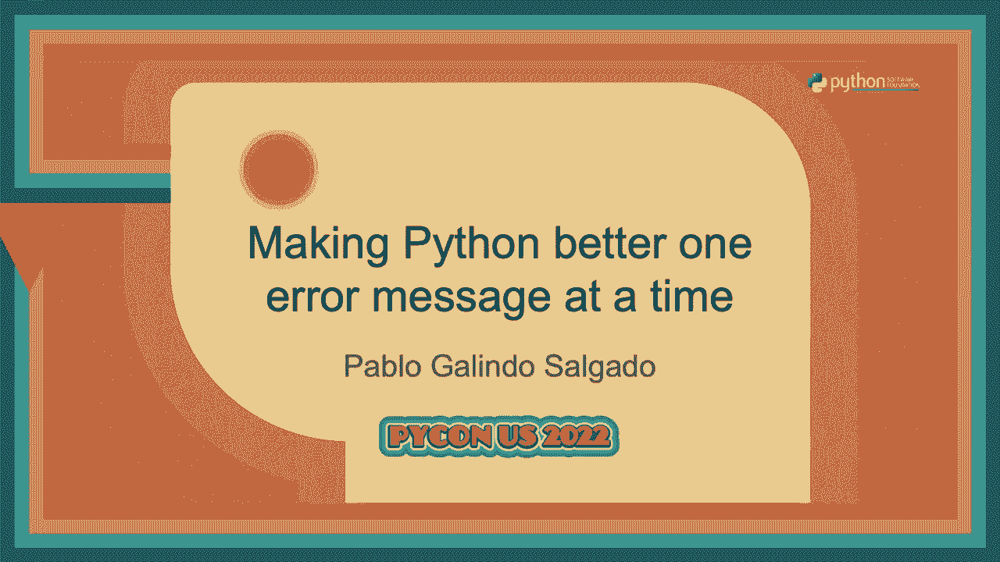
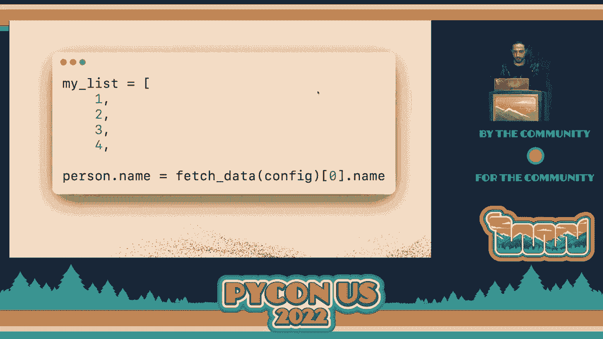
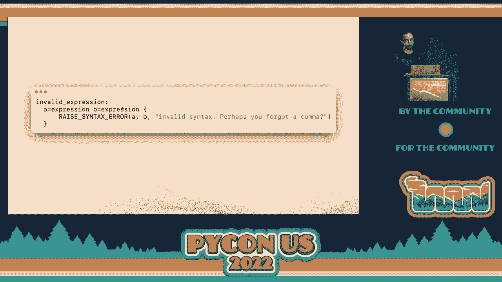
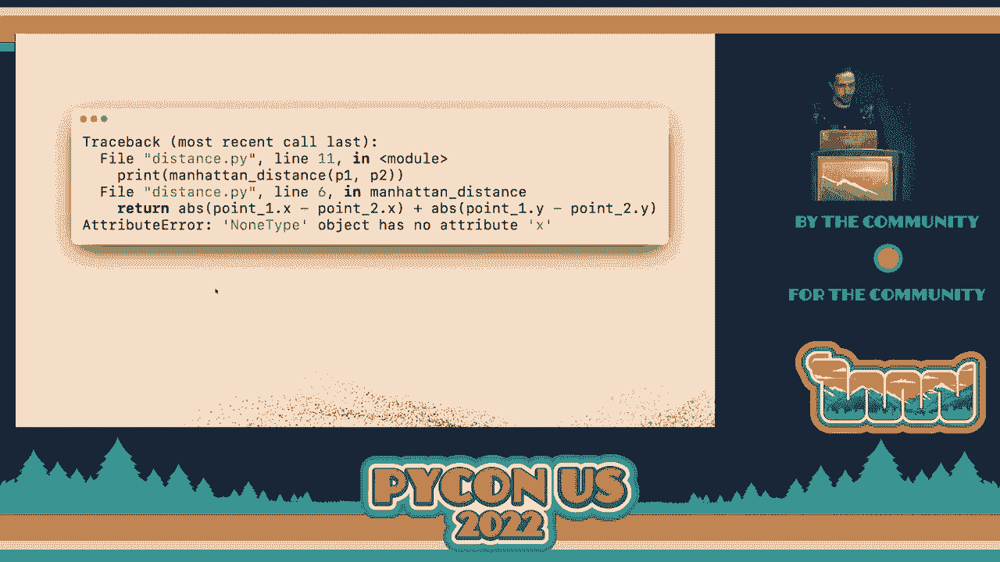
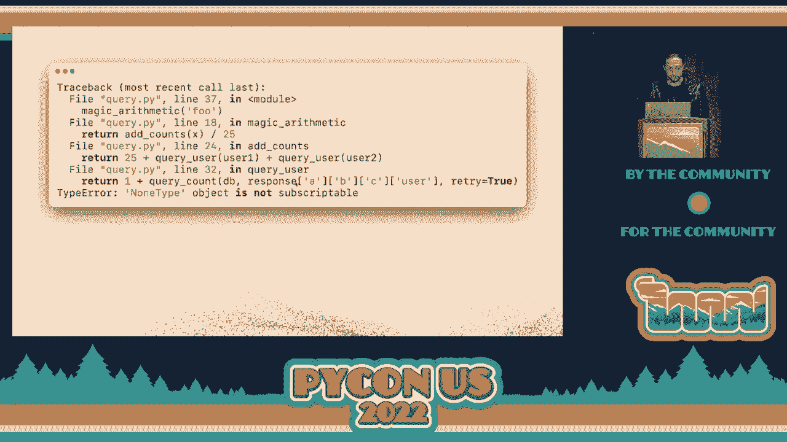
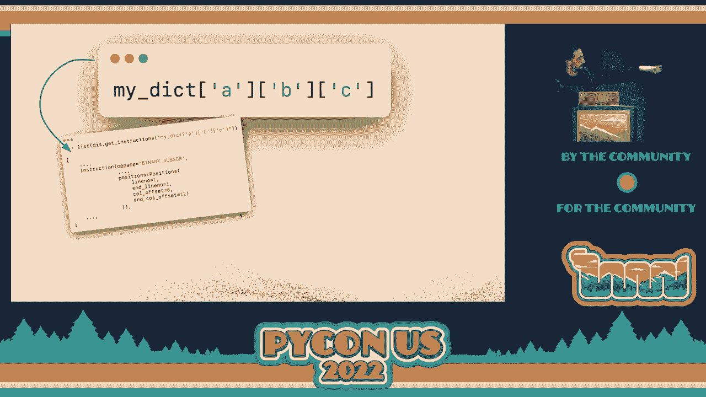

# P65：演讲 - 巴勃罗·加林多·萨尔加多 _ 逐步改善 Python 的错误信息 - VikingDen7 - BV1f8411Y7cP

欢迎大家来到我们第二次会议的演讲。

而今天，现在，我们真的很荣幸能请到巴勃罗，他在彭博工作，但他也是一位非常活跃的 C Python 核心开发者。他要告诉我们 Python 中错误信息的改进。所以请与我一起欢迎他。你好，大家好。好吧，有人告诉我我说话很快。

所以系好安全带，因为这将会是一次，好的，非常棒的经历。我是谁？谢谢大家的互动，所以我会简短一点。我是 Python 核心开发者，今年担任 Python 机器委员会成员。我还是 310 和 31 的发布经理，同时我在彭博工作。但这有点无聊。

那么我们来谈谈错误信息，对吧？酷。那么让我告诉你一个故事，所有好的演讲都从一个故事开始，所以让我告诉你一个故事。在加入之前，我开始学习计算机科学与工程，我曾经是一名物理学家。所以我在攻读博士学位，尽管我是一个理论物理学家，某些东西是你需要的。

不时需要做的事情就是进行模拟。在那个时候做这些模拟时，我开始使用 Python。那天，一个朋友也在用 Python，正在攻读物理博士，来到了我们这里，我们三个在房间里，遇到了一个无法解决的语法错误。

我们花了 15 分钟试图找出问题所在。想想这个，对吧？

三个物理学家在攻读博士学位。我们有工具来解决宇宙中最深奥的谜题，但我们却无法解决一个语法错误。相当糟糕。所以，你知道，语法错误是重要的，对吧？

因为它们会影响开发者的时间和其他事情。那么让我带你参观一下，语法错误在 Python 之前是怎样的。一个很炫的图像，好吧，例如，这就是我当年无法解决的语法错误。那是什么呢？

有什么问题吗？有趣。那么让我给你一些背景。不全是程序，但程序大致是这样的，对吧？那里有很多东西。有人发现错误了吗？所以这个错误相当于这个，对吧？你有一个字典，你没有关闭字典，然后你有一个函数定义。

所以解析器在字典之后继续，工具发生了，但还没有结束。然后它尝试找到这个函数并说，嗯，这个函数不适合字典。然后它说，是的，这是无效的语法。但如果你只看主题，这种情况就不好，对吧？相当糟糕。这只是一个例子，但还有更多。

比如，这个呢？有什么问题？谁知道这有什么问题？

错误就是这个。这有点不对。你想在那里写一个元组，然后是一个生成器推导。但是，结果是你需要为这个元组加上括号，否则解析器无法理解你在写什么。这不是最好。

这个呢？你有一个列表。你没有关闭这个列表。然后你有一堆东西，比如，你在这里赋值什么的。然后解析器说，是的。那个等号——我不喜欢那个等号。这是无效的语法。或者，像这样，那个呢？

你有一个漂亮的字典。所以你将核心开发人员映射到他们的 GitHub 用户名。然后你忘了那里那个逗号。

然后解析器说，Google 的 Langa 是无效的语法。如果你问我，这相当无礼。但是，你知道的，这不好。那么这个呢？你尝试处理一个异常处理器。但是在多个异常的情况下，你忘了括号，得围绕着它来处理。这告诉你那是无效的语法，这相当让人困惑。

特别是如果你不习惯于这种带有多个异常的语法，或者如果你刚开始学习 Python。那么这个呢？你在写字典，然后你——我不知道。你慌了，没有在这里放值或者其他什么的。然后你关闭它，解析器告诉你，是的，那括号，不，不好。所以无效的语法。

这是所有中最糟糕的。举手，如果你曾经遇到过这个。是的，是的，我想到了这一点。所以这就像——特别是，你知道，像 EOF。你知道，你已经向多少人解释过 EOF 的意思了。是的。所以这里的想法是，你知道，在之前的版本中，我们看到了这些东西。

然后我们说，看看，这个词之所以在这里不是因为我们懒惰或其他什么的。这是因为编写这些东西并将它们整合到一个大语言的机制中，比如 Python，结果是相当困难的。但是，结果是现在在 Python 3.9 之后，我们有了一个新的解析器。所以我会稍后谈论这个。

而这个解析器让我们开始思考，比如，我们怎么能解决这些问题？比如，我们能否改善编写 Python 的人们的体验，使得错误信息更友好，比如，他们出现语法错误时不知道它们的意思是什么。因为这非常重要，因为许多人认为这对学习者至关重要。

这个语言。但结果是，我有丰富的经验使用这个，我感到非常高兴，因为自从我使用它以来，我修复了许多这些错误信息。所以，你知道，这对有经验的人也很重要。那么让我们谈谈，像，我们如何使用新的反向解析器来修复这些错误。你们许多人可能对这些事情并不了解。

那么让我介绍一下反向解析器。反向解析器是我们与 Sandre Sanjido 在 PEP 617 上合作的成果。基本上，我们替换了 C Python 中的解析，这个解析最初是在 1990 年引入的——这是 Gido 提出的 Python 的第一条评论，这是旧的解析器。而新的反向解析器是在 30 年后制作的。所以，你知道的。

旧的解析器是一种非常强大的技术，但你知道的，我们认为我们需要一个新的解析器，因为有很多事情是旧解析器无法做到的，除了与维护者相关的主题和其他事情。因此，现在我们可以用新的解析器完成的事情包括带括号的上下文和管理器。

出于我知道的技术原因，我不会详细讨论，我们无法做到更好，因为现在你可以放置这样的开括号，和表面在那边。此外，例如，匹配语句。我们喜欢匹配语句。是的，我觉得，它们很酷。你可以匹配所有的东西。

这只有在新的解析器下才有可能，这真是太好了。但也有一个问题。很多人看到这些事情时感到相当生气，因为他们认为新的反向解析器略显低级，对吧？因为现在我们有很多模糊和可怕的结论，因为反向解析器实际上允许我们使用非常奇特的语法等等。

但如果你能说服自己新的反向解析器实际上是非常有帮助的，因为你知道的。是的，允许我们做一些你可能不知道的事情，可能喜欢或不喜欢。但这些事情无论如何都是可能的，我们有一个改进 Python 语法的过程，这并不是反向解析器的错，对吧？就像，你知道的，如果你有一把刀。

刀可以有多种用途。我会让你想象一下你可以用刀做什么。但这里的想法是反向解析器现在终于允许我们做到这些新的消息，这是相当酷的。所以让我说服你，以防你以前没有见过它们。让我给你展示一些我们在三个版本中的新消息。我们有很多。

所以我不会覆盖很多内容，但会提到一些。例如，在 Python 中的三个新消息。所以请记住，你有这个条件，对吧？

然后你忘记了那里的冒号，这是学习这门语言的人尤其常犯的错误。所以现在我们告诉你冒号的方面。这很酷，对吧？更多的事情。所以，例如，现在我们有类似的事情，你在写字典时，忘记写那个值。

现在当你做这个事情时，解析器说，我实际上在字典键和冒号之后分散了一个表达式，这也是相当酷的。这显然是相当常见的。许多人在看到这个时非常开心。

你在比较某些东西，然后你在这里忘了是否写了双等号。

如果你在写 C 语言，这似乎是相当糟糕的，因为你知道你正在赋值给左边的任何东西。而在 Python 中，这是一个语法错误。现在我们建议你考虑，也许你其实是想用两个等号，而不是单个等号。还有其他的情况，比如，如果你在字典中忘记了一个逗号，这里就会很明显。

但要记住，你有那些大的配置字典，而不是 py 文件或其他地方。你忘记了一个逗号，这相当常见。因此，你不是得到有效语法的 Google 缓存语言，而是得到这种混乱，告诉你，哦，也许你在这里忘记了一个逗号。这至少已经帮了我十次以上。

所以例如，如果你在写条件语句或其他很多代码块时，你没有正确缩进，现在我们会告诉你，哦，我们其实期望一个索引块。然后我们会补充说明，缩进块是在某一行的 if 语句之后。所以你会有上下文，尤其是如果 if 之后的块很大的话。

当你错过缩进时，和你写 if 的地方相距很远。现在我们准确告诉你，当你取消缩进时，哪个结构是错误的。当然，大家最喜欢的，当你没有关闭一个字典，而你有一个函数。现在我们告诉你，嘿，那个括号没有关闭，这非常酷。

这可能是人们最喜欢的错误之一，因为这是相当常见的。这个错误是这样的，你知道，文件中出现了意外，或者你的函数定义错误。很酷。因此，有很多这样的错误，这很好，但事实证明，添加错误消息是相当困难的。让我告诉你一些在我们开发错误消息时发生的有趣故事。

假设，例如，你想开发以下错误消息，比如缺少逗号，对吧？所以例如，你说，我想要这个，对吧？

有人正在写一个列表，并且在两个元素之间缺少逗号。因此这里没有逗号。你想写这个东西。所以你忘记了一个逗号。我们是怎么做到的？因为你去语法那里，然后你需要教会部分如何看待问题的样子。所以在这里，如果你不理解语法，我们不会忘记。

这是反向语法。但在这里我们是说，如果你看到一个表达式后面跟着另一个表达式。

你可能缺少一个逗号，对吧？比如想一个变量，四。你是一个变量，或者一个加一后跟三，或者 X 或其他东西。在这些情况下，你知道，这是无效的语法，但这可能意味着某人缺少了一个逗号，对吧？

然后你很高兴，然后你说，好吧，在这种情况下，我需要抛出这个无效的语法。也许你缺少一个逗号，一切都很好，对吧？不，不，不，不，不，因为像这样。现在有人忘记了 in 关键字，它告诉你你可能缺少一个逗号。这是错误的。那这样呢？有人在流前缀中写了它，现在它告诉你你缺少了。

一个逗号，这是错误的。那这样呢？你没有在这里关闭元组，然后在后面放一个 B，它正在查看下一行的变量和前一行的两个变量，并告诉你你缺少一个逗号。那这样呢？这相当糟糕，对吧？看看这个。结果是我不知道这有什么问题，但显然我缺少一个逗号。

这不好，对吧？那这样呢？你正在写一堆数字。我是说，这真是太疯狂了，但这也在告诉你，这很奇怪。它在告诉你，你缺少一个逗号，但不是在开头。是最后一个，好吗？

那这样呢？这是一个软关键字，现在当你做很多 foo 的时候。实际上是两个名字连在一起。这在我的语法中，然后它会告诉你你缺少一个逗号。所以我们破坏了我的语句。抱歉，Brian。不好，对吧？结果这其实是真的。在这里你可以看到我在引入机器逗号时修复的所有对等项。显然。

你知道，知道我们的许多解析器并不能让你不在机器逗号上失败。这是一件相当困难的事情。那这样呢？这相当有趣。所以结果是我们的解析器是一个打包解析器。结果是它们天生以指数时间运行。这意味着当它们解析你的输入时，它们所需的时间是指数级的。

对于你输入到解析器中的字符数。为避免这种情况，我们有一个叫做打包解析器的东西，基本上是引入了记忆化。这是一种花哨的缓存。我不打算详细说明。但有趣的是，一旦你把缓存放进去，解析器就会运行。

在时间复杂度为线性的情况下，速度非常快，大家都很高兴。但如果你忘了放缓存，糟糕的事情可能会发生。例如，这个在 Python 3.10 中解析需要两秒钟。这是一个语法错误。所以如果你放一堆开放的括号，然后放一个冒号，这是错误的。但它需要两秒钟。解析器需要两秒钟才意识到这是无效的。

如果你添加一堆括号，花费的时间超过一个小时。所以这个已经修复了。所以不用担心。我们在这里修复了。你知道，有人非常高兴我们修复了那个。可能他们需要再花一个小时来知道提交的语法错误。但原因是你在添加错误信息时需要非常小心。

原因在于我们多次验证了语言的真实语法。我们知道它运行得很快。我们知道它有效。我们对发生的事情非常确定。这很好。但事实证明，添加错误信息是一个全新的领域。原因在于，语法和解析器希望了解你的语言中什么是正确的。这正是它们的用途。

但是现在你开始使用一个解析器来处理一个无穷大的词。这个词包含了与 Python 无关的事物。而这要复杂得多，尤其是当你开始使用一些无效规则，并将这些无效规则与真正的语言结合时。

问题在于验证这些事物是否正确，并且它们在奇怪的构造中不会引发奇怪的语法错误，比如你之前看到的逗号，或者这些奇特的括号。这相当困难。而且我们发现，这需要更多的努力和验证。从那时起，我们对解析器和我们使用的技术进行了很多改进。

去验证这些事物。但是正如你所看到的，有时它们会被跳过，人们可能会在 Twitter 上发现我们。所以请不要在 Twitter 上嘲笑我们。你可以把这当作计时器使用。所以你知道，如果你测量你的午餐时间是一个小时，你可以把这个东西打开，然后在你完成后再回来。这很酷。好的。

这些是语法错误，这很好。我们解决了一些，你可以在 Python 3.10 的新功能文档中看到我们添加的所有错误。但你也可以看到我们在 3.11 中添加的错误，并且我们将来还会添加更多。但是我们还有更多的功能。例如，我们有运行时建议。那么这些是什么？这些不是语法错误。

这些是在运行时发生的错误。例如这个。如果在 Python 3.10 中，你在 collections 模块中这样做，如果你拼写错误了模块的一些属性，我们现在会提供建议。所以例如，如果你说 name tople，这样是不好的。

所以现在我们告诉你，也许你是想说 name tople。这适用于所有情况。它适用于模块、自定义类、标准库中的事物、第三方模块，等等。这很好。我们不仅在属性访问时提供这种功能，在名称访问时也提供。例如这里我将一个变量赋值为施瓦茨希尔德黑洞。

我希望我能正确地发音。

然后你拼写错误，因为拼写错误非常容易，然后你就得到了一个正确的结果。

建议。相信我，那是正确的版本，非常酷。你知道，这是一个小改进，但事实证明，它节省了很多时间，尤其是当你在一个非常大的函数中输入错误的变量时，因为它会立即告诉你发生了什么。我认为这是我最喜欢的之一，因为自从我们添加了这个，它帮助了我很多。

即使在我们开发这个的时候，所以这非常酷。但是问题是，好的，这些是如何完成的，因为这是一个非常有趣的事情，比如说错误数组的检查。让我给你解释一下我们是如何做到的。这非常有趣。第一件事是现在我们扩展了一些异常，特别是属性错误。

异常与两个东西。现在这些异常三次知道你尝试访问的属性的名称，以及你尝试访问的对象。所以如果这是集合模块，对象将是集合模块，而名称将被命名为顶球体。这个例子将是 X 和一些东西，然后写在那里的。

我不知道为什么我不带自己的幻灯片。但是这是一个浮现出来的属性，然后我们运行一个词距函数。这是一个非常简化的版本，适合于幻灯片。我们使用的那个是我不知道的`200 行`C 代码，实际上不太适合演示。但这个想法是这是一个非常简单的算法。

它使用某种版本的门外汉的距离来知道哪些是最接近的字符串。与我们提供的相似，然后它会告诉你，好的，所以也许你知道这些是我们认为最好的匹配。它查看对象的交易来区分哪些是最好的。所以基本上算法是，一旦你有了这个词实例函数，你就做点什么。

好吧，所以我将使用这个函数来知道在异常中所有可能的属性。然后我将逐个检查与那个的词距。我将选择更小的一个，这可能就是建议。我们在这里和那里有大量的额外检查，以确保我们不做奇怪的事情。

对于那些，但这基本上就是算法。但等等，还有一些事情。考虑这一点，属性错误在各处被引发。如果我们开始做这个算法来检查更接近的程序异常和名称，这非常非常昂贵，所以我们不在属性错误上执行这个事情。

因为它会使得情况降低得如此多。所以我们在这里做的基本上就是我所说的，这件事需要快速。因为如果你捕捉到属性错误，没有人会看到那些建议，我们需要确保这种代码依然快速。对吧？所以我们在这里做的，这是 SQL，但我会解释。

所以我们在这个 SQL 中所做的基本上是，当你引发异常时，不是做这件事，而是做这个被称为打印异常的高级函数。因此，我们仅在异常上升到顶层时执行这件事，解释器将崩溃，因为没有人处理异常。

所以当我们打印回溯时，你知道所有这些消息，因为解释器即将完成，在那一步，最后我们要做的就是这个打印异常建议，它运行我刚才展示给你的函数，然后提供你刚做的建议。所以基本上，那个函数非常酷，这样我们保持 Python。

快速时，我们仅在解释器即将终结时执行这件事，正常运行的代码并捕获异常保持快速。这只是一个例子，展示了错误消息相当困难，因为现在你可以。试着对人友好，但你需要确保语言的正常用法仍然快速，人们在正常代码中不需要为良好的错误消息付出代价。

这不会引发错误消息。所以我们有更多的事情，我对此非常兴奋，所以这是在 Python 3.11 中更好的回溯。让我向你展示这是什么。所以这是我和 Maras Cara 及 Batu Chantascaya 一起做的 PEP 657。它有这个可怕的名称，包括在回溯中精细粒度的错误位置，但我向你保证。

你会发现事情实际上远比我们放置的名称要伟大，它基本上看起来像这样。所以如果你之前有一堆错误，这是一些代码的回溯，和这里。

它告诉你，在这个长表达式中，这个错误的绝对值是非类型的。

对象没有实际的 X。这意味着在这条长线中有些东西是 None，但具体是哪个你不知道。你可能需要触碰包知道那里发生了什么，这并不好。但在 Python 3.11 中，我们准确地看到了哪个是 None，这个要好得多，我们相信，我们还看到了这些高级底层功能。

在所有的回溯中。这在你进行字典访问时也非常有用，所以之前，例如你实际上。

在一个大的 JSON 中，一些响应和许多其他内容，错误是非类型对象。无法被下标，这意味着在这个响应中，这些层级中有些是 None，但你。

不知道是哪一个，但现在在 3.11 版本中，我们告诉你哪一个是没有的。这太好了，效果好得多，你知道你还可以在追踪中看到函数调用的哪一部分。因为例如在这一行，你可能会是这里的这个，我们使用了一个，或者这里的这个，我们使用了二。

知道是哪一个，所以现在你不需要去碰那个包，我们觉得这太棒了。如果你在做一些复杂的数学，像这个除法的东西相当复杂。但现在它告诉你除以零，哪些除法是零，现在在 3.11 版本中。会告诉你是哪一个，所以这很好，那么我们是怎么做到的呢？我们就是这样做的。

基本上通过在每条字节码指令中注入额外的信息，例如。你执行这个组装字典访问，你会看到它由 Python 指令组成。我们称之为字节码，我们对每条指令。附加额外的信息，你实际上可以使用这个模块来检查这些额外的信息。

它会告诉你，例如，对于这个二元下标之一。每个字典访问，现在它有行号，当它发生时的行号，冒号选项和。我们使用这些信息来知道并向你展示发生的位置。实际打印这个东西的代码相当复杂，看起来并不好。

但就是你知道的，这相当复杂，但这很不错，因为我们考虑了。许多因素，例如，如果你有一个二元操作符，我们会指向确切的。二元操作，比如加号、减号或其他什么的，我们在两侧下划线。这样做只是为了让你知道，我们付出了全部努力，确保那些错误。

看起来不错，它们不具侵入性，我们可以尽可能地突出显示信息。因此，基本上我们是怎么做到的，想象一下你有这段代码，一旦我们知道。它是另一段代码，我们分析来自字节码的字节码指令。与我们已经拥有的行号和冒号选项。

因此，我们基本上重新排列了这个表达式，因为我们知道它必须是有效的，因为。它是通过 Python 代码获取该表达式的抽象语法树，然后我们结合。这两个来提供定制的错误信息，在这种情况下，我们使用抽象。来了解这是一个二元操作符，然后我们使用错误位置。

知道我们需要指向这里，然后我们使用这些信息来添加这个小。字符，除了下划线，你知道这并不简单，但看起来很棒。所以这一切都不错，但现在你可能在想，我该如何帮助这个，因为。你知道我喜欢错误信息，我希望能帮助开发错误信息并制作。

Python 很棒，我们希望你能帮助我们，所以我将教你如何有效地帮助我们处理错误消息。你能做的第一件事是打开问题，现在 Python 的问题跟踪器在 GitHub 上运行，这很不错，最后我们终于能够做到，明天在同一场讲座中会有更多内容，现在你可以打开一个问题，他们有跟踪器。

对于 CPython，请告诉我们你认为我们应该关注的建议，我们有时会告诉你，这个建议实际上很困难，或者会影响其他事情，所以请保持开放的心态，不要沮丧。如果我们告诉你添加错误消息很困难或不可能，但很多时候，这种情况已经发生过，大家已经在努力。

请访问我们的[问题跟踪器](https://example.org)，并提出建议，哦，这个特定的错误如何呢？我们已经实施了这一点，所以如果你有想法，特别是如果你刚开始学习 Python，举例来说，且你对这些错误信息感到沮丧，来告诉我们，这真的会很有帮助。

我花了 20 分钟做一个博士学位，结果无法做到，所以这是一个很好的候选者。如果你是一位教育工作者，或者你在教 Python，看到你的学生在错误信息上挣扎，我们希望知道哪些错误信息是他们最困难的。如果你想更深入地探讨，你可以自己来处理。

最好的起点是去我在 Python 开发指南中写的那个人那里，你可以 Google 一下“Python dev guide parser”，这是一份名为“CPython 解析器指南”的大型文档，内容相当技术性，但我觉得非常好，其他开发者也可以验证这个说法，想法是你可以在这里详细了解解析器的工作原理。

在本指南的最后，有一节关于如何添加你的消息以及如何验证错误消息的内容，你可以阅读这部分，然后尝试添加一些错误消息，添加一堆测试用例，然后提交一个 PR 给 CPython，这将会非常酷，不仅如此，很多人已经在做这件事了。

这里有一堆由社区成员提出的错误消息，而不是我自己提出的，它们已经得到了改善，除了这个仍然是开放问题的消息之外，所有这些消息将在 3/11 中展示，这非常棒，所以你也可以成为其中之一，或许头像更酷，但你可以提出新的错误消息。

我很乐意审查你的 PR，只是你需要考虑到，我们能否保持开放的心态，因为正如你所见，错误信息相当复杂，有时人们非常兴奋，带来了看似很好的错误信息，但实际上我们需要拒绝它们。

这相当复杂，所以当你提出这些错误信息时，请保持开放的心态。基本上就是这样，我希望你对这个有一点了解。我认为这个故事的道德是，如果你在攻读博士学位时，因某些语法错误而失去信心，那么你可能会在解析方面研究多年。

语法你可以制作一个最流行语言的解析器的新版本。在世界上你可以加入团队的核心，然后你可以改善情况。或者你可以选择等待直到其他人这样做，然后你可以使用它，非常感谢你，我希望你喜欢它。[鼓掌]

