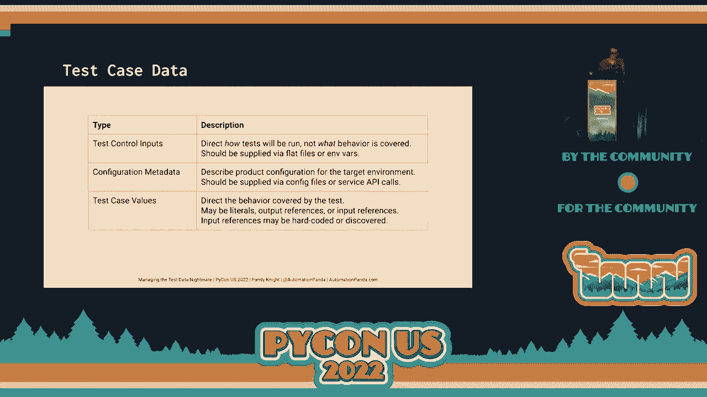
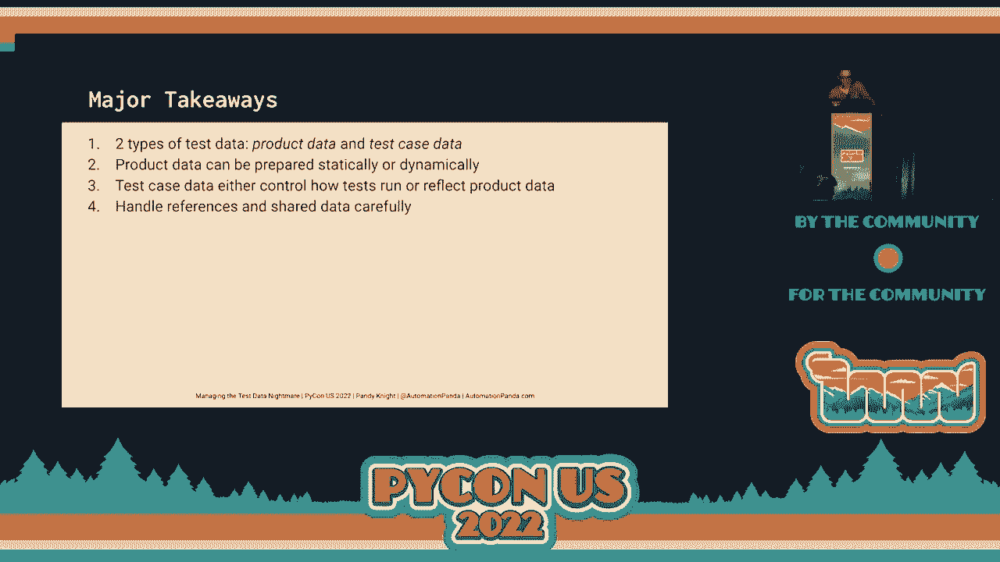

# 测试自动化：P67：管理测试数据噩梦 🧪


在本节课中，我们将要学习如何有效管理软件测试中最棘手的挑战之一：测试数据。我们将区分产品数据和测试用例数据，探讨不同的数据准备策略，并学习如何避免数据冲突，从而构建更健壮、更易维护的测试。


## 概述：测试数据的双重性


测试任何软件产品时，最棘手的挑战之一就是处理测试数据。测试数据包括被测试产品内部的实际数据以及测试用例所用的数据值。作为测试人员，我们不应低估正确处理测试数据的工作。良好的数据与良好的测试和良好的自动化同样重要。

因此，在本次演讲中，我们将深入探讨产品数据与测试用例数据之间的联系。我们将学习如何选择正确的策略来处理这两者，包括如何在测试时避免数据冲突。到最后，你将知道如何管理自己测试项目中的测试数据噩梦。


## 一个示例：银行贷款应用

假设我们有一个银行贷款申请的应用。银行可以从不同类型的贷款中配置此应用，例如：房屋抵押贷款、汽车购买或学生贷款。所有信息都存储在数据库中的数据里。每种贷款产品都是不同的。它有自己独特的利率、到期时间和还款计划。

我们可以编写一个简单的测试用例来验证基本应用行为。创建新贷款申请的场景从打开 Chrome 浏览器并加载页面 MyLoanApp.com 开始。当用户为房屋抵押贷款创建新贷款时，用户输入所有个人身份信息。用户提交申请后，页面会显示成功消息和参考号码，申请将发送到银行。

此测试为用户创建并提交了新的房屋抵押贷款申请。这个场景中有很多测试数据点。显而易见，有用户的个人信息、贷款类型、发送到银行的贷款申请记录、显示给用户的参考号码。此外，URL 是配置信息，浏览器可以说是一种测试输入。测试数据在这个简短简单的场景中无处不在。这些数据与测试不可分割。没有特定的数据，这个测试将毫无意义。


## 区分两种测试数据

不幸的是，测试数据这个术语是模糊的。我们将其应用于贷款网页应用中的产品数据，以及各种测试用例数据，这些数据使得即使是最基本的测试也能正常工作。

*   **产品数据**指的是软件系统中真实存在的数据。对于贷款网页应用，产品数据包括银行的所有产品配置和借贷信息。
*   **测试用例数据**指的是用于定义测试用例的数据。它可能包括在被测试产品中输入的值、控制测试如何进行的输入，或者从产品中检索的记录。在后者的情况下，测试用例数据是产品数据的反映。它的值指向存在于产品数据中的实体。

这两种类型的测试数据是分开的，但又是相互连接的。区分这两种数据类型很重要，以避免混淆。

测试用例数据对产品数据的依赖可能是脆弱的。例如，考虑我们测试用例的步骤，以创建一个家庭抵押贷款的新申请。只要银行的网页应用程序配置为家庭抵押贷款，这一步就能正常工作。然而，产品数据可能随时变化。如果家庭抵押贷款的具体内容发生变化，比如贷款不再称为“家庭抵押贷款”，而是“个人住宅贷款”，这就会导致测试用例失效。频繁的失效为测试管理带来了噩梦。

## 管理产品数据的策略

对于功能测试，测试数据与测试用例和测试代码同样重要。我们如何适当地处理产品数据和测试用例数据呢？我们可以使用哪些策略来避免脆弱的依赖关系？

在这次讲座中，我们将探索多种处理产品数据和测试用例数据的方法。不幸的是，市面上没有通用或完美的解决方案。但你可以通过选择适合你需求的策略来避免噩梦。


### 什么是产品数据？


正如之前所述，产品数据是测试中的任何实时数据。简单来说，就是数据库中的一切。它可以包括用户账户、管理设置、产品自定义、用户创建的记录、用户上传的文件等等。在我们讨论的贷款申请示例中，产品数据将包括诸如用户账户、贷款产品设置、贷款申请以及后台银行数据等内容。

数据必须在产品中存在，作为大多数测试的先决条件。将数据导入系统主要有两种方法。

### 策略一：静态数据准备

你可以在运行测试之前设置数据。这将是静态数据创建。例如，一个贷款网页应用程序可以配置一组预注册的用户和一系列贷款类型。测试用例，无论是手动还是自动，都可以假设这静态数据已经在系统中，并简单地引用它。

静态数据准备是处理复杂数据或速度较慢的数据的好策略。例如，用户账户可能需要电子邮件验证，因此自动化测试可能更容易使用一组预注册的用户。如果人们可以简单地引用现有数据，而不是每次都创建新数据，他们的速度会更快。

然而，静态数据必须得到维护。对静态数据的任何更改也可能影响测试。随着数据格式的更新，静态数据也可能随着时间而变得过时，或者如果数据是时间敏感的，比如时间序列。

### 策略二：动态数据准备

你可以在测试执行期间设置数据。这就是我们所说的动态数据创建。在示例贷款测试案例中，贷款申请文档是动态创建的。测试并不引用现有的贷款申请。它创建一个新的。

动态创建的记录避免了对静态数据的硬引用带来的脆弱性。它还可以被当前的测试案例独占使用，保护它们不被其他测试案例的干扰。动态数据准备的主要缺点是执行时间。这确实会降低测试速度。动态创建的数据本质上是一次性的，因此最终应该清理。

### 如何选择？

哪种策略最好？通常，测试需要两种策略结合使用。设置缓慢或被视为不可变的数据应使用静态数据准备，而快速且易于设置的数据应使用动态数据准备。当我开发测试解决方案时，我更倾向于根据测试案例尽可能动态地创建数据，以尝试保持测试案例的独立性。当测试动态创建所需数据时，它将是唯一引用它的测试案例。而且碰撞的风险要小得多。

### 实施静态数据准备的方法

这两种数据准备策略在实施时有点复杂。数据准备确实取决于你正在进行的测试案例。然而，静态数据准备有一些与使用它们的测试案例无关的一般策略。

以下是几种常见的静态数据准备方法：

*   **手动配置**：测试人员登录系统并手动创建他们需要存在于系统中的记录。好处在于技术要求低，任何人都可以做到。然而，它速度较慢，扩展性不好，且容易因缺乏维护而失修。
*   **自动配置**：自动化工具可以创建所需的数据，而不是手动设置一切。这可以通过多种方式实现，例如重用测试中的用户界面交互、调用 REST API，甚至可能使用像 Puppet 或 Chef 这样的工具。自动化可以以确定性或随机的方式生成数据。自动化还可以清理数据。不幸的是，它需要额外的技能，自动化代码必须进行维护。
*   **克隆数据库**：使用云管理工具，克隆数据库比以往任何时候都更容易。你可以将一个数据库保持在黄金状态，并在运行测试之前创建一个副本。一旦测试完成，副本可以被销毁。无需细致的清理。然而，克隆大型数据库可能不太实际，且可能需要额外的精细化。
*   **模拟端点**：这将完全消除对数据库甚至服务的依赖。Mocks 返回的所有数据也是确定性的，为你的功能测试提供一致的结果。但 Mocks 通常需要大量额外的设置工作，而 Mock 数据可能使测试忽视现实世界变化。Mocks 还意味着测试在覆盖范围上不会真正实现端到端。

这些策略也可以协同工作。例如，你可以使用自动化脚本在黄金数据库中配置产品数据，然后克隆该数据库。

### 关于合成数据


很多时候，我们希望在系统中使用生产或类生产数据，以反映现实世界。不幸的是，生产数据中包含诸如个人身份信息等内容，且不总是安全共享。合成生成数据是避免这些障碍的绝佳方式。例如，**Redo AI** 是一个出色的工具，能够生成统计上准确、保护隐私并且安全共享的合成数据。你可以将 Redo AI 与任何静态数据准备策略结合使用。


### 决策因素

在决定最佳静态数据准备策略时，有多个因素需要考虑：
*   你的数据有多大？
*   数据需要有多新鲜？
*   这些数据需要多频繁地更新？
*   尝试像模拟或克隆数据库这样的高级技巧会有多难？
*   是否存在任何官僚主义阻碍自动化解决方案？
*   大家有没有自动化、数据库管理或 Mocks 所需的技能？
*   成本问题呢？

## 管理测试用例数据

上一节我们介绍了如何处理产品数据。接下来，让我们看看测试用例数据。测试用例数据本质上是测试用例的一部分。让我们重新审视之前的示例测试用例。如前所见，这个简短场景的步骤中有多个测试数据位。它们代表不同类型的测试用例数据。

### 类型一：测试控制输入

看看第一步。假设 Chrome 浏览器已经打开。Chrome 浏览器是测试数据，因为它指定了加载应用程序的网络浏览器类型。这就是我们所说的**测试控制输入**。它指导测试的运行方式，而不是指定任何关于未来行为的内容。

测试控制输入不应在测试自动化代码中硬编码，而应该作为输入传递给自动化。这样，测试可以轻松重新定位。

有几种方法可以做到这一点：
*   **使用配置文件**：创建一个包含输入值的平面文件（如 JSON 或 YAML）。测试自动化代码可以在任何测试开始之前读取文件，并可以注入输入值。
    ```json
    {
      "browser": "chrome",
      "environment": "staging"
    }
    ```
*   **使用环境变量**：测试可以从系统 shell 或配置文件中设置变量，自动化可以按名称读取这些变量。这对于与持续集成服务器或 Docker 容器的集成很有用。

### 类型二：配置元数据

注意这里的 URL 是硬编码的。这也不是一个好习惯。通常，开发团队会在开发过程中托管多个产品实例，如开发环境、暂存环境或测试环境。使用这样的配置信息限制了测试的运行地点。关于产品配置的任何信息称为**配置元数据**。这可以包括 URL、用户名、密码以及可能的其他描述符。

有几种方法来处理配置元数据。你可以使用平面文件或环境变量作为测试控制输入。然而，我确实推荐使用平面文件，同时也建议将测试控制输入与配置元数据分开。创建输入以引用目标配置，并在配置元数据文件中存储多个配置。这样，测试人员只需更改一个或几个简单输入即可针对任何配置。

### 类型三：测试用例值

剩下的测试用例数据都属于称为**测试用例值**的类别。这些值直接与测试中所执行的行为相关，而不是与任何配置因素相关。即使在这种分类中，还有子类型。

以下是测试用例值的几种类型：

*   **字面值**：这些值在测试中是硬编码的。在这个例子中，个人信息表包含字面值。字面值使用简单，它们通过示例提供规范。人们应该独立于任何静态创建的产品数据。它们应该是可以安全地由测试用例生成的值。
*   **输出引用**：这些值通常是从被测试的产品中检索的。它们是通过执行某种行为生成的输出。在这个示例测试中，引用编号可以从成功页面抓取并验证其正确格式。可以从网络应用的后端检索贷款申请，以验证其是否被正确提交。这些值不能是字面量，因为它们源于产品。必须通过引用来引用它们，并从产品中检索其值。
*   **输入引用**：这些值直接指向产品数据。当个人信息如姓名和地址由测试用例动态创建时，贷款类型的名称指的是应用中的贷款配置。因此，此测试具有输入依赖性。它必须指定贷款类型，并且该贷款类型必须已经在产品数据中存在。

### 处理输入引用的策略

编写此测试的最简单方法是直接硬编码引用。这就是这里所做的。名称“住房抵押贷款”指的是网络应用中贷款类型的名称。硬编码引用使得编写测试变得简单，但它们需要在系统中存在静态预备数据。当产品数据发生变化时，引用也会变得难以维护。

避免静态数据带来的痛苦的一种方法是动态创建这些记录或配置。如果测试调用后端为每次测试运行创建一个名为“住房抵押贷款”的新贷款产品，那么就不需要静态预先准备的数据。然而，我们已经知道动态准备的痛点。

一个稳健的解决方案可以被称为**数据发现**。假设目标网络应用已经配置了多种可接受的贷款类型。测试可以描述贷款类型，而不是硬编码所需贷款类型的名称，然后使用自动化搜索网络应用的配置，以找到符合所需标准的贷款类型。例如，如果银行的不同地区对这种贷款类型有不同的名称，发现机制可以查看配置，寻找满意的住房抵押贷款类型，并返回你所在地区的特定名称。发现使得测试能够搜索现有产品数据以获取所需记录，而不是硬编码这些记录。发现使测试对产品数据的变化更加弹性。



## 避免数据冲突


此时你可能在想：“哇，这真是一大堆信息。”没错，但噩梦还没有结束。还有一个问题需要解决：冲突。当多个参与者在共享资源上操作时，可能会发生冲突。例如，当多个测试者同时访问系统时，就可能会发生。当自动化测试并行运行时，额外的考虑事项适用。

以下是避免冲突的几个关键原则：

*   **孤立你的测试环境**：防止外部参与者打扰。如果你有共享的测试环境，在测试运行时阻止人们使用它。如果你使用容器，自己运行容器。尽量使其尽可能孤立。
*   **将共享数据视为不可变**：当测试在测试环境中并行运行时，它们可能需要使用相同的产品数据。因此，将任何共享数据视为常量，以防止一个事物干扰另一个事物。
*   **尽可能多地使用动态数据准备**：测试在它们不共享的数据上无法发生冲突。将静态准备的产品数据保持在最低限度。静态创建的数据更可能成为共享数据，而共享数据更可能导致冲突。

## 总结



今天我们覆盖了很多信息。总的来说，如果你从中得到的一个信息，那就是选择打败你噩梦的最佳策略。每个产品都是不同的，每个团队也是不同的。


本节课中我们一起学习了：
1.  **两种类型的测试数据**：产品数据和测试用例数据。
2.  **产品数据的准备策略**：可以是静态的或动态的，并可通过手动、自动、克隆或模拟等方式实现。
3.  **测试用例数据的分类**：包括测试控制输入、配置元数据和测试用例值（字面值、输出引用、输入引用）。
4.  **避免冲突的关键**：隔离环境、视共享数据为不可变、优先使用动态数据。


记住，没有放之四海而皆准的解决方案。把我在这次演讲中分享的策略作为建议，根据你的具体项目和团队情况，选择最适合的组合来管理你的测试数据，从而构建更可靠、更高效的测试自动化。