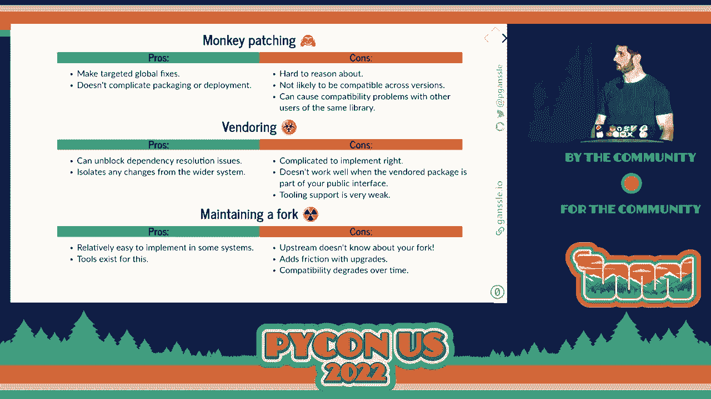

# 处理依赖中的Bug：策略指南


## 概述
在本教程中，我们将学习当项目依赖的第三方库或他人代码出现Bug时，可以采取的一系列应对策略。我们将从最推荐、最规范的做法开始，逐步过渡到更“黑客式”的临时解决方案，并分析每种策略的优缺点和适用场景。

---

## P68：演讲 - 保罗·甘塞尔 _ 当 bug 出现在别人代码中时该怎么做

我们即将开始本场会议的第二场演讲。


这位是保罗·甘塞尔。他将告诉我们当 bug 出现在别人代码中时该怎么做。

我的名字是保罗·甘塞尔。我是谷歌的软件工程师，同时也是许多开源项目的贡献者。除此之外，我还是 Python 的核心开发者，我在 `datetime` 和 `zoneinfo` 模块上工作过。我还维护过像 `DateUtil` 和 `setuptools` 这样的库，并参与了许多打包的工作。

作为一个主要开发库的人，我显然是共享代码的支持者。但我也意识到承担依赖关系是有风险的。无论是第三方依赖，还是在你组织中某个其他团队的内部依赖。其中一个风险是今天演讲的主题，那就是当你依赖的某个东西出现 bug 或其他不兼容性时。修复它并不像修复自己代码中的 bug 那么简单。

这次演讲涉及多种处理依赖中的 bug 的策略。但它被组织成一系列从正确做法中战略性撤退的过程。所以我们将从合适的工具开始，来敲这个钉子。然后随着进展，我们会转向更“黑客式”的，甚至是危险的做法。

---

## 1：识别问题：什么是“别人的Bug”？

那么，我们所说的在别人代码中的 bug 是什么意思呢？这是我在工作中遇到的一个例子。

这只是一个最小的重现示例。这个函数应该工作的方式是，你有一个数据框，它接受 `.agg()`，并且应该传递这个函数 `f`。而 `.agg()` 本身接受两个参数。它接受函数，然后接受 `axis`。然后它应该将所有额外的位置和关键字参数传递给这个函数。

```python
# 预期行为：将 f 应用于每一行，并将这一行和数字 3 传递给 f
df.agg(f, axis=1, 3)
```

在 Pandas 1.1.3 中，当我第一次写这个演讲时，实际上引发了一个错误。某种奇怪的事情是 `axis` 参数被传递了两次。这有点奇怪。所以我们可以检查文档，确保我理解如何正确使用这个函数。你可以看到，是的，Pandas 确实打算让你以这种方式使用它，但它并不工作。所以这是 Pandas 中的一个 bug，或者是它们文档中的 bug，两者之一。

---

## 2：黄金标准：修复上游

那我该怎么办呢？正确的做法是告诉 Pandas，因为他们怎么会修复它，除非他们知道。如果你想尝试一下，可以提交一个补丁并在上游修复它。在这种情况下，做起来相当简单，关键是，这个补丁也很容易审核。因此，在我提交拉取请求后，仅仅几天就合并了。然后它被安排在 1.1.4 版本中发布。所以我所要做的就是等待发布的到来。

**优点**：
*   为所有人修复了问题。
*   无需自己维护变通代码。
*   可能改善与上游维护者的关系。

**缺点**：
*   需要说服维护者接受你的补丁。
*   存在延迟：从修复到发布，再到你部署新版本，可能需要很长时间。
*   对于不活跃的项目，补丁可能永远不会被合并。

> 我没有时间详细讲解你应该做什么以及实际的方面。但我在 2018 年在 PyData 做了一个关于这个话题的演讲。如果你在我网站上查看幻灯片，可能会找到那个演讲。

---

## 3：权宜之计：本地变通

如果无法立即等待上游修复，我们需要本地变通方案。上一节我们介绍了修复上游的理想情况，本节中我们来看看如何在本地绕过问题。

那么在这段时间里你该怎么办？你能做的最好的事情就是绕过这个问题。

### 策略一：直接修改调用代码

在这种情况下，绕过这个问题相当简单，因为我所要做的就是不再按位置传递，而是按关键字传递。

```python
# 原始有问题的代码
# df.agg(f, axis=1, 3)

# 变通方案：使用关键字参数
df.agg(f, axis=1, extra_arg=3)
```

如果你在一个地方碰到这个错误，这种做法是完全可行的。如果解决方法相对简单，只需更改一个小地方。如果你对触发错误的代码和周围的代码没有偏好，这样的做法特别好。

### 策略二：封装包装函数

如果这些事情不成立，最好将你的解决方法封装到一个包装函数中。

因此，我在这里稍微将那个小解决方法进行了通用化处理。我把它封装在一个函数中，这个函数可以作为 `DataFrame.agg` 函数的替代品。

```python
import pandas as pd

def dataframe_agg(df, func, axis=0, *args, **kwargs):
    """包装函数，将额外位置参数转为关键字参数以绕过Pandas bug"""
    # 将所有位置参数（args）转换为关键字参数
    # 这里假设我们知道要传递的关键字参数名，例如 ‘extra_arg'
    # 这是一个简化示例，实际逻辑取决于具体Bug
    kwargs[‘extra_arg‘] = args[0] if args else None
    return df.agg(func, axis=axis, **kwargs)

# 使用包装函数
dataframe_agg(df, f, axis=1, 3)
```

**优点**：
*   封装了复杂的解决逻辑。
*   提供了一个简单的删除目标（将来可以搜索替换回原函数）。
*   可以立即部署。

**缺点**：
*   变通函数可能会成为永久的技术债务。
*   并不总能应用（例如，需要修改的是被依赖函数内部的行为）。

---

## 4：进阶变通：机会性升级

好吧，我们都可以说我们要清理刚刚产生的技术债务，但实际上这个解决方法函数可能会永远存在。你可以使用的一种策略是将其变得不那么 hack，并最小化范围，我称之为**机会升级**。

这里的想法是，在我们的包装函数中，而不是无条件地应用这个变通，我只需写一个小函数，说明如果这个 pandas bug 目前活跃，就执行这个；否则，返回原始内容。

```python
def has_pandas_bug():
    """通过特征检测判断Bug是否存在"""
    try:
        # 最小化复现Bug的代码
        test_df = pd.DataFrame()
        test_df.agg(lambda x: x, axis=1, 1)
        return False  # 如果没有报错，说明Bug已修复
    except Exception as e:
        # 如果触发了预期的错误，说明Bug存在
        return True

def dataframe_agg_opportunistic(df, func, axis=0, *args, **kwargs):
    """仅在Bug存在时应用变通的包装函数"""
    if has_pandas_bug():
        # 应用变通逻辑
        kwargs[‘extra_arg‘] = args[0] if args else None
        return df.agg(func, axis=axis, **kwargs)
    else:
        # 直接调用原函数
        return df.agg(func, axis=axis, *args, **kwargs)
```

判断Bug是否存在有两种主要策略：
1.  **特征检测**：直接运行一个最小复现代码，看是否会触发错误。更健壮，不依赖具体的版本号。
2.  **版本检查**：检查当前安装的库版本是否在受影响的范围内。实现简单，但需要精确知道受影响的版本范围。

**优点**：
*   最大程度减少了变通代码的影响范围。
*   当上游修复后，代码会自动恢复正常路径。

**缺点**：
*   特征检测可能复杂或耗时（例如，Bug是内存泄漏）。
*   版本检查需要精确的版本信息。

**现实例子**：
*   `importlib.resources` 的回退实现。
*   `six` 库（用于Python 2/3兼容）。
*   `pytz` 的废弃垫片（deprecation shim）。

---

## 5：危险区域：猴子补丁

现在让我们进入下一个策略，这就是我们开始进入真正危险和 hacky 的领域，那就是**猴子补丁**。

猴子补丁的工作原理是，Python 中大多数模块和类都是可变的，并且它们存在于一个全局命名空间中。所以你实际上可以在运行时动态修改你想要修补的代码。

```python
import pandas as pd
import pandas.core.groupby.generic

# 假设这是我们的修复函数
def patched_agg(self, func, axis=0, *args, **kwargs):
    kwargs[‘extra_arg‘] = args[0] if args else None
    # 调用原始的 agg 逻辑，这里需要访问原函数
    return self._orig_agg(func, axis=axis, **kwargs)

# 保存原始函数的引用
pandas.core.groupby.generic.DataFrameGroupBy._orig_agg = pandas.core.groupby.generic.DataFrameGroupBy.agg
# 用我们的函数替换它
pandas.core.groupby.generic.DataFrameGroupBy.agg = patched_agg
```

**优点**：
*   可以全局性地、透明地修复问题，即使是你调用的其他库的代码使用了这个有Bug的函数。
*   无需修改大量调用点的代码。

**缺点**：
*   **极其危险**：动态修改代码，违背其他开发者的预期。
*   **紧密耦合实现细节**：补丁依赖于库的内部结构，库升级极易导致补丁失效。
*   **作用域难以控制**：补丁可能影响你未预料到的代码部分。
*   **难以理解和调试**。

**建议**：如果必须使用，请尽量缩小范围。例如，使用上下文管理器将补丁限制在特定代码块内。

```python
from contextlib import contextmanager

@contextmanager
def temporary_monkey_patch():
    original_agg = pandas.core.groupby.generic.DataFrameGroupBy.agg
    pandas.core.groupby.generic.DataFrameGroupBy.agg = patched_agg
    try:
        yield
    finally:
        pandas.core.groupby.generic.DataFrameGroupBy.agg = original_agg

# 使用方式
with temporary_monkey_patch():
    # 在这个代码块内，agg函数是被修补过的
    some_other_function_that_uses_agg()
```

**现实例子**：
*   `setuptools` 曾经广泛地对 `distutils` 进行猴子补丁，导致了很多长期问题。
*   `unittest.mock.patch` 本质上就是一个可控的、作用域明确的猴子补丁工具。

---

## 6：隔离策略：代码供应

下一个策略是**供应商化**。你在项目源代码中包含一个或多个依赖项的副本。

它的工作原理是，你只需将你拥有的依赖的源代码复制到你的项目树的某个地方，然后修改所有对这个依赖的导入，指向你本地的副本。

```
my_project/
├── src/
├── vendor/ # 供应商化目录
│   ├── __init__.py
│   └── squalene/ # 复制的依赖库代码
│       ├── __init__.py
│       └── ...
└── my_code.py
```

在 `my_code.py` 中：
```python
# 不再使用 import squalene
from vendor import squalene # 导入供应商化副本
```

**优点**：
*   将你的更改与更广泛的系统隔离开来。
*   你可以完全控制依赖的版本和其中的补丁。
*   解决了“钻石依赖”问题（两个依赖需要同一个库的不同版本）。

**缺点**：
*   **实现复杂**：需要重写导入语句，处理内部相对导入等问题。
*   **容易泄漏**：供应商化代码中的某些导入可能仍会指向全局安装的版本。
*   **不适用于公共API**：如果你的函数需要返回该依赖定义的类型（如DataFrame），你无法返回来自供应商化副本的类型。
*   **升级麻烦**：需要手动合并上游更改和你本地的补丁。

**现实例子**：
*   `pip` 和 `setuptools` 供应商化了它们的所有依赖，以避免引导问题。
*   一些桌面应用（如 `invoke`）供应商化依赖，但可能导致依赖过期和安全问题。
*   本演讲的幻灯片源码就供应商化了 `reveal.js` 库并应用了一个补丁。

---

## 7：最终手段：维护分支

最后一个选项是**维护一个分支**。当你在你的生产环境中部署和维护一个修补过的库或依赖版本时。

与供应商化的区别在于，这种方式是全球性的（安装在 `site-packages` 中），而不是作为你项目源码的一部分。

**常见做法**：
1.  克隆上游仓库。
2.  创建你的修复分支并提交补丁。
3.  从这个分支构建你自己的包（如 `.whl` 或系统包）。
4.  在你的环境中部署这个自定义包。

**优点**：
*   相对容易开始（fork、修改、构建）。
*   有许多工具支持（如 `quilt` 管理补丁序列）。

**缺点**：
*   **维护负担重**：你需要持续将上游更改合并到你的分支，解决冲突。
*   **与上游脱节**：上游的变更很容易破坏你的补丁。
*   **造成生态分裂**：组织内部可能开始依赖你分支的特有行为，导致未来无法撤回补丁或升级。
*   **社区支持差**：如果你基于此分支报告问题，上游维护者可能不予理会。

**现实例子**：
*   几乎所有 Linux 发行版都会为它们打包的软件携带补丁。
*   大型企业内部经常维护关键依赖的分支。

一个**成功故事**：在谷歌，我们曾为 `attrs` 库维护一个补丁分支。后来我向上游提交了一个 PR，将某个测试依赖改为可选依赖，并被接受。这让我们移除了最后一个补丁，现在可以轻松跟上 `attrs` 的官方更新。

---

## 总结与最终思考



本节课中我们一起学习了处理他人代码中Bug的多种策略，让我们回顾一下：

1.  **修复上游**：黄金标准，利人利己，但可能有延迟。
2.  **本地变通（包装函数）**：可接受的权宜之计，易于部署和清理。
3.  **机会性升级**：更智能的包装函数，能自动感知Bug修复。
4.  **猴子补丁**：危险但强大的全局修改，应严格限制作用域。
5.  **代码供应**：将依赖副本纳入项目，实现隔离，但实现复杂。
6.  **维护分支**：部署自定义版本，长期维护负担最重。

我想给大家留下几个最后的思考：

1.  **耐心是一种被低估的美德**。许多策略都会引入技术债务。建立组织流程，培养与上游维护者的良好关系，可以帮助你更有耐心地等待官方修复。
2.  **谨慎积累技术债务**。快速解决问题的诱惑很大，但每一个 hack 都是未来需要偿还的债务。有意识地选择策略，并制定计划来清理它们。

