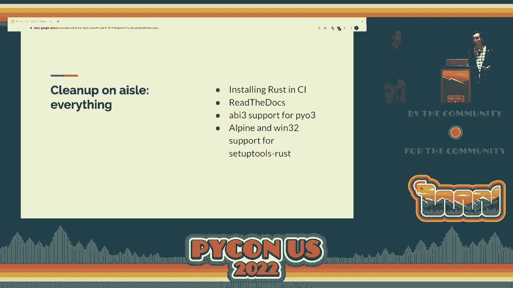

# Rust 构建 Python 扩展：P69：演讲 - 保罗·凯赫尔 & 亚历克斯·盖纳


## 概述
在本教程中，我们将学习如何将 Rust 语言集成到 Python 项目中，以构建高性能且内存安全的扩展模块。我们将以 `cryptography` 库的实践经验为例，介绍从动机、工具选择、构建集成、发布策略到实际迁移的完整流程。无论你的项目规模如何，这些经验都将帮助你更顺畅地采用 Rust。

---

## 章节 1：为什么选择 Rust？🚀

上一节我们介绍了本教程的概述，本节中我们来看看选择 Rust 作为 Python 扩展语言的核心动机。

安全性至关重要。作为一个加密软件包，用户期望我们提供超出常规的安全保障。`cryptography` 库最初依赖用 C 语言编写的 OpenSSL 来处理所有加密算法（如 AES 和 RSA）以及解析 X.509 证书等结构。

C 语言虽然能编写出高性能的代码，但其内存安全性存在固有缺陷，容易引入缓冲区溢出和使用后释放等漏洞。OpenSSL 自身也曾遭遇此类问题，例如著名的“心脏出血”漏洞。

对大型 C/C++ 代码库的分析表明，大约三分之二的漏洞与内存安全性相关。这意味着，如果换用不同的编程语言，这些漏洞中的大部分是可以避免的。Rust 语言因此成为理想选择，原因如下：
*   **内存安全**：只要不使用 `unsafe` 关键字，Rust 能从根本上杜绝缓冲区溢出等内存安全问题。
*   **高性能**：Rust 的性能可与 C 语言媲美，并提供对内存布局的精确控制。
*   **现代工具链**：Rust 拥有包管理器、构建系统、代码格式化器等一整套现代开发工具，并且与 Python 绑定的集成已经非常成熟。
*   **广泛采用**：Rust 已被许多大型科技公司广泛使用。

因此，为了最小化对 OpenSSL 潜在漏洞的暴露，并提升代码库的整体安全状态，我们决定在 `cryptography` 中引入 Rust。

---

## 章节 2：工具选择与初步集成 🛠️

上一节我们探讨了选择 Rust 的原因，本节中我们来看看具体需要哪些工具以及如何进行初步集成。

我们首先需要选择用于创建 Python 与 Rust 之间绑定的库。我们选择了 **PyO3**。PyO3 封装了 CPython 的 C API，其接口人性化、维护良好，并且几乎支持全部的 Python API 功能。

以下是一个使用 PyO3 的简单示例代码，它创建了一个包含单个函数的模块：

```rust
use pyo3::prelude::*;

/// 一个将整数乘以二的函数
#[pyfunction]
fn double(x: i32) -> i32 {
    x * 2
}

/// 将函数注册为模块的一部分
#[pymodule]
fn my_rust_module(_py: Python, m: &PyModule) -> PyResult<()> {
    m.add_function(wrap_pyfunction!(double, m)?)?;
    Ok(())
}
```
PyO3 会自动处理许多细节，例如在 Rust 整数和 Python 整数之间进行转换，并在数值溢出时抛出异常。

接下来，我们需要解决如何构建 Rust 代码并将其集成到 Python 包的安装流程（`pip install`）中。我们希望这个过程对用户尽可能透明。为此，我们选择了 **setuptools-rust**，它由 PyO3 的维护者提供。

`setuptools-rust` 向 `setup.py` 的 `setup()` 函数添加了 Rust 扩展选项。你只需指向包含 Rust 代码的目录，它就会自动编译代码，将生成的 `.so`（或 `.pyd`）文件放置到正确位置。

---

## 章节 3：构建与持续集成（CI）的挑战 🧩

上一节我们介绍了核心工具，本节中我们来看看在构建和持续集成环境中遇到的具体挑战及其解决方案。



为了让最基本的集成通过测试，我们首先需要在所有持续集成（CI）环境中安装 Rust。以下是需要处理的环境：

1.  **GitHub Actions**：基础镜像已自带 Rust，无需额外操作。
2.  **Docker 测试容器**：需要在容器构建脚本中添加安装 Rust 的命令。
3.  **OpenDev CI 服务**：同样需要添加安装 Rust 的步骤。
4.  **ReadTheDocs 文档服务**：其官方 Docker 镜像最初没有 Rust。我们向该镜像提交了拉取请求（PR），成功将 Rust 添加进去，现在所有使用 ReadTheDocs 的项目都能轻松构建包含 Rust 的文档。


解决了环境问题后，我们面临一个更复杂的挑战：**ABI3/有限 API 兼容性**。

CPython 支持 ABI3（有限 API），使用其子集编译的扩展模块可以向前兼容，这意味着只需为所有 Python 3.x 版本构建一个 wheel 文件，而无需为 3.5、3.6、3.7 等每个版本单独构建。这对于维护多个 Python 版本的支持至关重要。

然而，当时的 PyO3 不支持 ABI3，总是针对完整的 CPython C API 进行构建。修复这个问题相当复杂，我们向 PyO3 团队提交了大约 7 个拉取请求，涉及数千行代码的重构。幸运的是，PyO3 团队给予了出色的支持，现在任何使用 PyO3 的人都可以通过启用一个选项来构建 ABI3 兼容的 wheel。

此外，我们还遇到一些平台特定的构建问题：
*   **Alpine Linux**：它使用 `musl libc`，而 Rust 对其处理方式特殊。我们向 `setuptools-rust` 提交了 PR，使其能检测 `musl` 环境并传递正确的编译标志。
*   **32 位 Windows**：在 64 位 Windows 系统上运行 32 位 Python 时，一些工具会错误地尝试构建 64 位 Rust 库。我们同样通过向 `setuptools-rust` 提交 PR 修复了此问题。

完成这些工作花费了数周甚至数月时间，但好消息是，这些努力只需付出一次。现在，不仅我们自己的项目能顺利构建，所有后续想要使用 PyO3 和 `setuptools-rust` 的开发者也能直接受益。

---

## 章节 4：发布策略与支持矩阵 📊

上一节我们解决了技术集成的挑战，本节中我们来看看如何制定发布策略以及确定对不同平台和环境的支持级别。

作为 Python 生态的基础组件，我们需要在“推动现代化以提升安全性”和“保持广泛兼容性以免影响用户”之间找到平衡。我们制定了四个非官方的支持级别：

以下是不同支持级别的具体说明：
1.  **一级支持（全面支持）**：我们在 CI 中测试并通过二进制 wheel 发布的平台（如 x86-64 Linux/macOS/Windows）。我们对这些平台有高度信心。
2.  **二级支持（尽力支持）**：我们无法在 CI 中测试，但在实际中有显著使用量的平台（如 ARM HF、MIPS）。我们会接受补丁并努力提供合理的使用体验。
3.  **三级支持（社区支持）**：较为小众的架构和操作系统。只要补丁质量良好并通过我们的 CI，我们会接受。
4.  **四级支持（不支持）**：例如过旧的 OpenSSL 版本、我们选择不支持的 Python 版本，或需要对代码库进行重大修改才能支持的架构（如 s390）。

我们依据 PyPI 的下载统计数据来指导决策，例如决定何时放弃对某个 Python 版本的支持（通常在使用率降至 5% 以下时）。

---

## 章节 5：分阶段发布与用户反馈 🔄

上一节我们制定了支持策略，本节中我们来看看如何通过分阶段发布来管理变更，并处理来自用户的反馈。

为了让用户平稳过渡，我们制定了一个两步发布计划，并通过邮件列表和 GitHub 问题提前与社区沟通：
1.  **版本 3.4**：包含一个可选的 Rust 扩展模块。默认会构建，但并非运行 `cryptography` 所必需，用户可以通过设置环境变量来禁用 Rust 构建。
2.  **版本 35.0（后改为新的主版本号方案）**：包含一个必需的 Rust 扩展模块，没有它库将无法工作。

我们于 2021 年 2 月 7 日发布了 3.4 版本。绝大多数用户没有遇到任何问题。然而，我们确实收到了一些重要的反馈，并从中吸取了教训：

以下是我们在首次发布后遇到的主要问题和学到的教训：
*   **错误信息不友好**：编译失败时，`pip` 输出的错误信息过于冗长和技术化。我们改进了错误处理，使其能捕获错误并输出更友好、更具指导性的消息，包含环境信息和常见问题解答的链接。
*   **逃生机制不易发现**：虽然文档中记录了禁用 Rust 的环境变量，但在错误信息或变更日志中没有突出提示。我们后续加强了这方面的提示。
*   **Rust 工具链的安装**：一些用户需要学习如何安装特定版本的 Rust，这与他们通常通过系统包管理器安装 C 编译器的体验不同。我们提供了更清晰的指南。
*   **版本号与用户期望**：一些用户因“语义化版本”而锁定了 `cryptography<3.4`，当 3.4 包含重大构建变更时，他们的构建意外失败。为了避免这种“惊喜”，我们此后改为像 Firefox 一样，每个功能发布都使用新的主版本号（如 35.0, 36.0）。

我们也认识到，在引入 Rust 这样重大的变更时，**不应同时发布其他侵入性更改**，并且需要为可能遇到问题的用户提供更强大的调试支持。

---

## 章节 6：用 Rust 重写核心功能 ⚡

上一节我们讨论了发布和用户反馈，本节中我们来看看如何实际使用 Rust 重写核心功能以获取价值。

在构建基础设施就绪后，下一步就是用 Rust 做一些实际有用的事情。我们主要有两个目标：
1.  替换我们自己编写的一小部分 C 代码（例如处理加密常量时间操作）。
2.  替换 OpenSSL 的 X.509 证书处理层及其相关的 ASN.1 解析代码。

重写过程遵循了软件重构的最佳实践：
*   确保有良好的测试覆盖率。
*   不要一次性重写所有内容。
*   将重写分解为一系列小的、可测试的拉取请求（PR）。
*   确保每个 PR 都能保持测试通过，不让代码库处于半破损状态。

这次迁移带来了显著的收益：
*   **安全性**：达成了主要目标，消除了相关代码区域的内存安全漏洞风险。
*   **性能**：获得了巨大的性能提升。例如，将 OCSP 响应解析器从 OpenSSL/C 实现迁移到 Rust 实现后，性能提升了 **10 倍**。这是因为 OpenSSL 的解析代码进行了大量内存分配和复制，而利用 Rust 的安全特性，我们可以轻松编写出零分配、零拷贝的解析器。
*   **架构改进**：使 API 边界更加清晰。例如，我们的 X.509 API 不再与 OpenSSL 的私钥对象深度耦合，现在可以支持云密钥管理服务等更多场景。

---

## 章节 7：总结与展望 🎯

在本教程中，我们一起学习了将 Rust 集成到 Python 项目中的完整旅程。

我们从**安全性和性能的动机**出发，选择了 **PyO3** 和 **setuptools-rust** 作为核心工具。我们克服了**构建与 CI 集成**中的诸多挑战，特别是解决了 **ABI3 兼容性**和跨平台构建问题。我们制定了清晰的**发布策略和支持矩阵**，并通过**分阶段发布**来管理用户过渡，积极吸取**用户反馈**以改善体验。最后，我们成功**用 Rust 重写了核心功能**，在提升安全性的同时，获得了显著的性能改进和架构收益。

我们的采用曲线显示，在发布需要 Rust 的版本后，大部分用户都成功地完成了迁移。目前，约 80% 的 `cryptography` 下载包含了 Rust 组件。

这项工作证明，Rust 现在是一个可行的选择，无论你的 Python 项目有多么流行和关键。虽然初期需要投入精力解决工具链和集成问题，但绝大多数基础工作已经完成，并且成果已贡献给上游，可供整个社区使用。

未来仍有改进空间，例如为 FreeBSD 等系统提供预编译 wheel，进一步简化构建工具链，或实现与 CPython 更深的集成。但毫无疑问，今天在 Python 中使用 Rust 的体验对大多数用户来说已经非常优秀。


希望本教程能激励和帮助你在自己的项目中考虑并采用 Rust，共同建设一个更安全、更高效的 Python 生态系统。