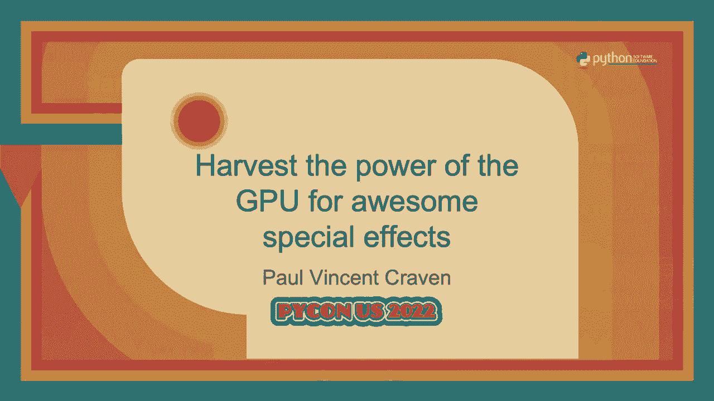
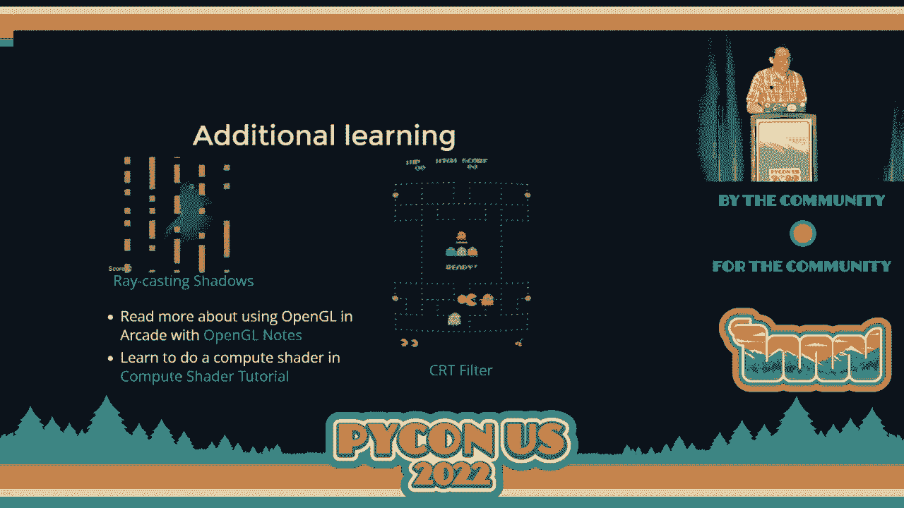

# 利用GPU的力量实现精彩特效：P70：演讲 - 保罗·文森特·克雷文




在本教程中，我们将学习如何利用图形处理器（GPU）的强大能力，为你的程序创建酷炫的视觉效果。我们将了解为何要使用GPU，它与CPU处理方式的区别，并通过一个简单的发光球体示例，手把手教你如何用Python和GLSL着色器开始你的GPU编程之旅。

## 为何使用GPU？🚀

上一节我们介绍了本课程的目标，本节中我们来看看为何要使用GPU。

CPU是计算机的大脑，负责处理通用计算任务。然而，当涉及到图形渲染和大量并行计算时，拥有成千上万个小型处理核心的GPU则更为高效。将图形工作从CPU卸载到GPU，可以释放CPU去处理游戏逻辑、物理模拟等任务，同时实现更复杂、更流畅的视觉效果。

以下是使用GPU可以实现的几个优势：
*   **处理海量精灵**：基于CPU的库（如Pygame）可能难以流畅渲染超过2000个精灵。而基于GPU的库可以轻松处理数万甚至数百万个精灵。
*   **实现高级特效**：如光晕、粒子效果、动态光影等，这些效果在CPU上实现困难，但正是GPU的专长。
*   **进行大规模并行计算**：例如模拟成千上万个具有相互作用的物体（如引力计算），这在GPU上可以高效完成，而在CPU上则几乎不可能实时运行。

## CPU与GPU工作方式的区别🔄

上一节我们了解了GPU的优势，本节中我们来看看它与CPU在工作方式上的核心区别。

传统的CPU绘图方式是“即时模式”，即每帧都向显卡发送具体的绘制命令（如“画一个矩形”）。这种方式无法充分利用GPU的并行能力，甚至可能更慢。

现代GPU编程则采用“保留模式”。其核心思想是：**提前将数据和“脚本”（着色器）发送到GPU**。在游戏运行时，CPU只需告诉GPU“绘制我之前给你的那些东西”，或者更新少量数据（如位置坐标），GPU就能并行地、高效地完成所有渲染和计算。

**关键公式/概念**：
*   **CPU即时模式**：`每帧：发送绘制命令 -> GPU执行`
*   **GPU保留模式**：`初始化：发送数据 + 着色器脚本 -> 运行时：CPU更新少量数据 -> GPU并行执行脚本进行渲染/计算`

## 开始实践：创建你的第一个着色器🎯

理解了基本原理后，本节我们将动手创建一个简单的Python程序，并运行一个GLSL着色器，在屏幕上绘制一个发光球体。

我们将使用 `arcade` 库，它简化了创建窗口和加载着色器的过程。首先，确保安装arcade库：`pip install arcade`。

### 第一步：创建基础窗口

首先，我们需要一个能显示内容的窗口。以下是创建窗口的Python代码框架。

```python
import arcade

class MyGame(arcade.Window):
    def __init__(self):
        # 调用父类初始化，设置窗口大小为1920x1080
        super().__init__(1920, 1080, “GPU特效示例”)
        # 后续将在这里初始化着色器

    def on_draw(self):
        # 此函数每秒被调用约60次，用于绘制
        # 目前只是清空屏幕（黑色）
        arcade.start_render()

# 创建窗口并运行程序
if __name__ == “__main__”:
    window = MyGame()
    arcade.run()
```

### 第二步：加载并运行着色器

有了窗口之后，添加着色器非常简单。我们需要从文件加载一个GLSL着色器，并在每帧渲染它。

以下是更新后的 `__init__` 和 `on_draw` 方法：

```python
import arcade
from arcade.experimental import Shadertoy

class MyGame(arcade.Window):
    def __init__(self):
        super().__init__(1920, 1080, “GPU特效示例”)
        # 获取窗口尺寸
        window_size = self.get_size()
        # 从文件创建着色器
        self.shadertoy = Shadertoy.create_from_file(window_size, “circle.glsl”)

    def on_draw(self):
        # 清空屏幕后，渲染我们的着色器
        arcade.start_render()
        self.shadertoy.render()
```

### 第三步：编写GLSL着色器（基础圆）

现在，我们来编写 `circle.glsl` 着色器文件。着色器是一个小程序，会对屏幕上的**每一个像素**执行一次。

初始版本将在屏幕左下角原点附近绘制一个白色区域。

```glsl
// 着色器玩具（Shadertoy）框架的基本结构
void mainImage(out vec4 fragColor, in vec2 fragCoord) {
    // 1. 将像素坐标标准化（转换到0.0到1.0的范围）
    vec2 uv = fragCoord / iResolution.xy;

    // 2. 计算当前像素到原点(0,0)的距离
    float dist = length(uv);

    // 3. 根据距离决定颜色：距离小于0.2为白色，否则为黑色
    vec3 color = vec3(0.0); // 初始化为黑色
    if (dist < 0.2) {
        color = vec3(1.0); // 白色
    }

    // 4. 输出最终颜色（RGB）和透明度（A）
    fragColor = vec4(color, 1.0);
}
```

**代码解释**：
*   `mainImage` 是主函数，每个像素调用一次。
*   `fragCoord` 是输入，代表当前像素的坐标。
*   `fragColor` 是输出，代表该像素应显示的颜色（RGBA）。
*   `iResolution` 是着色器玩具框架提供的全局变量，包含屏幕分辨率。
*   `length()` 是GLSL内置函数，计算向量的长度（即距离）。
*   `vec3(1.0)` 表示一个由三个1.0组成的向量，即白色。

### 第四步：改进着色器（居中且正圆）

上一步的圆在角落且可能是椭圆。我们需要将其移动到屏幕中心，并修正宽高比使其成为正圆。

更新 `circle.glsl` 中的计算部分：

```glsl
void mainImage(out vec4 fragColor, in vec2 fragCoord) {
    // 标准化坐标
    vec2 uv = fragCoord / iResolution.xy;

    // 将坐标原点移动到屏幕中心
    vec2 centered_uv = uv - vec2(0.5);

    // 修正纵横比，确保是正圆（假设y轴需要调整）
    centered_uv.y /= iResolution.y / iResolution.x;

    // 计算到屏幕中心的距离
    float dist = length(centered_uv);

    vec3 color = vec3(0.0);
    if (dist < 0.2) {
        color = vec3(1.0);
    }

    fragColor = vec4(color, 1.0);
}
```

### 第五步：实现发光效果

一个实心圆不够酷，让我们给它添加发光效果。原理是使用距离的倒数来创建平滑的渐变。

再次更新 `circle.glsl` 的颜色计算逻辑：

```glsl
void mainImage(out vec4 fragColor, in vec2 fragCoord) {
    vec2 uv = fragCoord / iResolution.xy;
    vec2 centered_uv = uv - vec2(0.5);
    centered_uv.y /= iResolution.y / iResolution.x;

    float dist = length(centered_uv);

    // 基础颜色（白色）
    vec3 base_color = vec3(1.0);
    // 使用距离的倒数创建渐变，并乘以一个缩放因子控制光晕大小
    float intensity = 0.02 / dist;
    // 将基础颜色与强度相乘
    vec3 final_color = base_color * intensity;

    fragColor = vec4(final_color, 1.0);
}
```

### 第六步：从Python传递数据（控制位置与颜色）

我们希望用鼠标控制发光球的位置，并能自定义其颜色。这需要从Python程序向着色器传递数据。

首先，在Python端（`MyGame`类中）获取鼠标位置并传递数据：

```python
class MyGame(arcade.Window):
    def __init__(self):
        super().__init__(1920, 1080, “GPU特效示例”)
        window_size = self.get_size()
        self.shadertoy = Shadertoy.create_from_file(window_size, “circle.glsl”)
        # 初始化一个默认颜色（浅蓝色）
        self.light_color = (0.7, 0.8, 1.0)

    def on_draw(self):
        arcade.start_render()
        # 1. 获取鼠标位置
        mouse_pos = self.get_mouse_position()
        # 2. 准备要传递给着色器的数据
        self.shadertoy.program[‘pos’] = mouse_pos
        self.shadertoy.program[‘color’] = self.light_color
        # 3. 渲染着色器
        self.shadertoy.render()
```

然后，修改GLSL着色器以接收并使用这些数据：

```glsl
// 从Python程序接收的“统一变量”（每个像素值相同）
uniform vec2 pos;   // 发光球位置
uniform vec3 color; // 发光球颜色

void mainImage(out vec4 fragColor, in vec2 fragCoord) {
    vec2 uv = fragCoord / iResolution.xy;

    // 将传入的鼠标位置也标准化
    vec2 normalized_mouse_pos = pos / iResolution.xy;

    // 计算当前像素与鼠标位置的距离（两者都已标准化）
    float dist = length(uv - normalized_mouse_pos);

    // 使用传入的颜色，而不是固定的白色
    vec3 base_color = color;
    float intensity = 0.02 / dist;
    vec3 final_color = base_color * intensity;

    fragColor = vec4(final_color, 1.0);
}
```

## 更多可能性与学习资源🔮

通过上面的步骤，我们已经成功创建了一个由GPU驱动的交互式发光球特效。但这仅仅是开始。着色器还能用于实现更多效果：

以下是你可以进一步探索的方向：
*   **阴影与光照**：在2D场景中模拟动态光影效果。
*   **粒子系统与大规模模拟**：在GPU上模拟数万个相互作用的物体（如星空模拟）。
*   **后期处理滤镜**：为整个游戏画面或视频添加CRT扫描线、模糊、颜色校正等效果。
*   **几何变形**：创建波浪、融化等动态纹理效果。

**学习资源建议**：
*   **Shadertoy网站**：一个在线社区，可以编写和分享GLSL着色器代码，是绝佳的灵感来源和学习平台。
*   **Arcade库文档**：查看关于 `Shadertoy` 和 `OpenGL` 的更多高级示例和说明。
*   **OpenGL/GLSL教程**：深入学习着色器编程的语法和概念。

## 总结🎉

在本教程中，我们一起学习了GPU编程的核心概念与实践方法。

我们首先了解了GPU并行计算的优势。然后，我们对比了CPU即时模式与GPU保留模式工作流程的根本区别。接着，我们通过一个完整的示例，学会了如何：
1.  使用 `arcade` 库创建应用窗口。
2.  加载并运行GLSL着色器。
3.  编写一个从绘制基础图形到产生发光效果的着色器。
4.  从Python程序向着色器传递数据（如鼠标位置和颜色），实现交互。



你现在已经掌握了利用GPU力量的第一步。鼓励你大胆实验，修改着色器中的数字和公式，观察不同的视觉效果，并尝试将着色器应用到你的游戏或图形项目中。