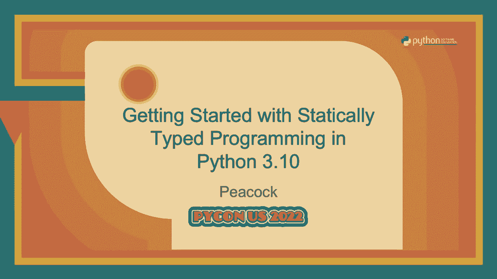

# Python静态类型编程入门：P71：演讲 - Peacock_ 在 Python 3.10 中入门静态类型编程


## 概述



在本教程中，我们将学习如何在 Python 中开始使用静态类型。我们将从为什么需要类型提示开始，逐步介绍基本语法、常用类型、高级概念，并了解 Python 3.10 及 3.11 中引入的新类型特性。本教程旨在让初学者能够轻松理解并应用类型提示来编写更健壮、更易维护的代码。

---

## 为什么需要类型提示？🤔

在开始学习具体语法之前，我们先了解类型提示的动机。考虑以下没有类型提示的代码：

```python
def process_data(data):
    return data.upper() + 1
```

这段代码在编写时不会报错。然而，当我们传入一个字符串时，`data.upper()` 可以工作，但加上整数 `1` 会导致运行时错误。如果我们传入一个整数，`data.upper()` 本身就会出错。没有类型提示，我们无法在代码运行前发现这些潜在的错误。类型提示的目的就是在开发阶段（通过类型检查工具）提前发现这类问题，提高代码的可靠性。

---

## 基础入门：从函数定义开始 ✍️

上一节我们看到了缺乏类型提示可能带来的问题。本节中，我们来看看如何为函数添加基本的类型提示。

为函数添加类型提示非常简单。只需在参数名后加上冒号和类型，在函数定义的冒号和函数体之间，用 `->` 指明返回类型。

```python
def greet(name: str) -> str:
    return f"Hello, {name}"

def initialize() -> None:
    print("Initializing...")
```

以下是几个要点：
*   `None` 用于表示函数没有返回值（或返回 `None`）。
*   基本类型如 `int`, `float`, `bool`, `str`, `bytes` 可以直接使用。

---

## 使用内置与标准库类型 📦

我们已经学会了为函数参数和返回值添加基本类型。在实际编码中，我们经常需要处理更复杂的数据结构，如列表、字典等。以下是常用的集合类型及其表示方法。

在 Python 3.9 及以后版本，你可以直接使用内置的 `list`, `dict`, `tuple` 等作为泛型。

```python
from typing import Dict, List, Tuple, Set

# Python 3.9+ 的写法 (推荐)
def process_items(items: list[int]) -> list[str]:
    return [str(item) for item in items]

# Python 3.8 及之前的写法
def old_process_items(items: List[int]) -> List[str]:
    return [str(item) for item in items]
```

除了基本集合，标准库 `typing` 模块还提供了许多其他有用的类型：
*   `Iterable`：任何可迭代对象。
*   `Sequence`：只读序列（如 `list`, `tuple`）。
*   `MutableSequence`：可变序列（如 `list`）。
*   `Mapping`：只读映射（如 `dict`）。
*   `MutableMapping`：可变映射（如 `dict`）。

选择更通用的类型（如 `Sequence` 而非 `list`）可以使你的函数接口更灵活，接受更多类型的参数。

---

## 元组与字面量类型 🧩

列表和字典通常包含同一类型的元素。但有时我们需要表示固定长度或固定值的类型，这时就需要用到元组类型和字面量类型。

**元组类型** 可以精确表示每个位置元素的类型和总长度。
```python
def get_coordinates() -> tuple[float, float]:
    return (1.5, 2.8)

# 表示一个包含不同类型元素的固定长度元组
person: tuple[str, int, str] = ("Alice", 30, "Engineer")
```

**字面量类型** 用于限制变量只能是特定的几个值。
```python
from typing import Literal

Direction = Literal["north", "south", "east", "west"]

def move(direction: Direction) -> None:
    print(f"Moving {direction}")
```

---

## 高级类型概念 🔧

掌握了基础类型后，我们来看看如何组合它们以表达更复杂的约束。本节介绍联合类型、可选类型和可调用对象。

### 联合类型
联合类型表示一个值可以是几种类型中的任意一种。在 Python 3.10+ 中，使用 `|` 运算符。
```python
# Python 3.10+
def square(number: int | float) -> int | float:
    return number ** 2

# Python 3.9 及之前
from typing import Union
def old_square(number: Union[int, float]) -> Union[int, float]:
    return number ** 2
```

### 可选类型
可选类型是一种特殊的联合类型，表示一个值可以是某种类型，也可以是 `None`。它是 `T | None` 的简写。
```python
from typing import Optional

def find_user(user_id: str) -> Optional[dict]:
    # 如果找到用户，返回用户信息字典，否则返回 None
    ...
```
使用 `Optional` 时需注意，在后续代码中需要处理值可能为 `None` 的情况。

### 可调用类型
可调用类型用于注解函数参数或返回值本身是函数的情况。
```python
from typing import Callable

def apply_func(func: Callable[[int, int], int], x: int, y: int) -> int:
    """接受一个接收两个int并返回int的函数，并应用它。"""
    return func(x, y)
```

---

## 创建自定义泛型类型 🏗️

有时内置类型不足以描述我们的数据结构。这时，我们可以创建自己的泛型类。

通过继承 `typing.Generic` 并指定类型变量来定义泛型类。
```python
from typing import Generic, TypeVar

T = TypeVar('T')  # 声明一个类型变量

class Stack(Generic[T]):
    def __init__(self) -> None:
        self.items: list[T] = []

    def push(self, item: T) -> None:
        self.items.append(item)

    def pop(self) -> T:
        return self.items.pop()

# 使用
int_stack: Stack[int] = Stack()
int_stack.push(1)
# int_stack.push("string")  # 类型检查器会报错
```

---

## 版本兼容性与新特性概述 🆕

Python 的类型提示系统在不断进化。为了确保代码在不同版本的 Python 中都能工作，可以使用 `from __future__ import annotations` 语句。它将所有类型注解视为字符串，避免在运行时求值。

```python
from __future__ import annotations
# 这样，即使在 Python 3.9 中也能使用 `list[int]` 这样的语法而不会报错
```

以下是各版本引入的重要类型相关特性速览：
*   **Python 3.7**: `dataclass`，简化类的创建。
*   **Python 3.8**: 字面量类型 (`Literal`)，更精确的类型提示。
*   **Python 3.9**: 内置集合泛型语法 (`list[int]`)，更简洁。
*   **Python 3.10**: 类型联合运算符 (`|`)，参数说明变量 (`ParamSpec`)，类型保护等。
*   **Python 3.11**: `Self` 类型，用于注解返回类实例的方法。

---

## Python 3.10 类型新特性详解 🚀

Python 3.10 为类型系统带来了几项重要改进，让类型提示更强大、更易用。

### 1. 更简洁的联合类型语法
使用 `|` 替代 `Union`。
```python
def func(arg: int | str) -> int | str:
    ...
```

### 2. 参数说明变量
`ParamSpec` 用于捕获可调用对象的参数签名，在装饰器等场景中非常有用，能更好地保持类型信息。
```python
from typing import Callable, ParamSpec, TypeVar

P = ParamSpec("P")
R = TypeVar("R")

def decorator(func: Callable[P, R]) -> Callable[P, R]:
    def wrapper(*args: P.args, **kwargs: P.kwargs) -> R:
        print("Calling function")
        return func(*args, **kwargs)
    return wrapper
```

### 3. 类型保护
`TypeGuard` 允许你定义用户自定义的类型保护函数，帮助类型检查器在条件分支后缩小变量类型范围。
```python
from typing import TypeGuard

def is_str_list(val: list[object]) -> TypeGuard[list[str]]:
    return all(isinstance(x, str) for x in val)

def process(items: list[object]) -> None:
    if is_str_list(items):
        # 在此分支内，items 被识别为 list[str]
        print(" ".join(items))  # 安全
    else:
        ...
```

---

## Python 3.11：Self 类型 🤖

Python 3.11 引入了 `Self` 类型，用于注解返回类实例的方法，特别是在继承场景下非常有用。

```python
from typing import Self

class Shape:
    def set_scale(self, scale: float) -> Self:
        self.scale = scale
        return self  # 返回自身以实现链式调用

class Circle(Shape):
    def set_radius(self, radius: float) -> Self:
        self.radius = radius
        return self

circle = Circle()
# 类型检查器知道 set_scale 返回的是 Circle 实例
circle.set_scale(1.5).set_radius(10)
```
使用 `Self` 比使用泛型或 `"Shape"` 字符串字面量更直观、更准确。

---

## 总结 📝

本节课中我们一起学习了 Python 静态类型编程的入门知识。

我们从**为什么需要类型提示**开始，了解了它能帮助我们在代码运行前发现错误。接着，我们学习了**基础语法**，如何为函数参数和返回值添加类型。然后，我们探索了**内置与标准库类型**，如 `list[int]`、`dict[str, float]` 以及更通用的 `Sequence`、`Mapping`。

对于更复杂的场景，我们介绍了**高级类型概念**，包括联合类型 (`|`)、可选类型 (`Optional`) 和可调用类型 (`Callable`)。我们还学会了如何**创建自定义的泛型类型**来描述自己的数据结构。


最后，我们回顾了**类型系统的版本演进**，并详细了解了 **Python 3.10** 引入的联合运算符、参数说明变量和类型保护，以及 **Python 3.11** 引入的 `Self` 类型。


希望本教程能帮助你开始在 Python 项目中使用类型提示，编写出更清晰、更可靠的代码。