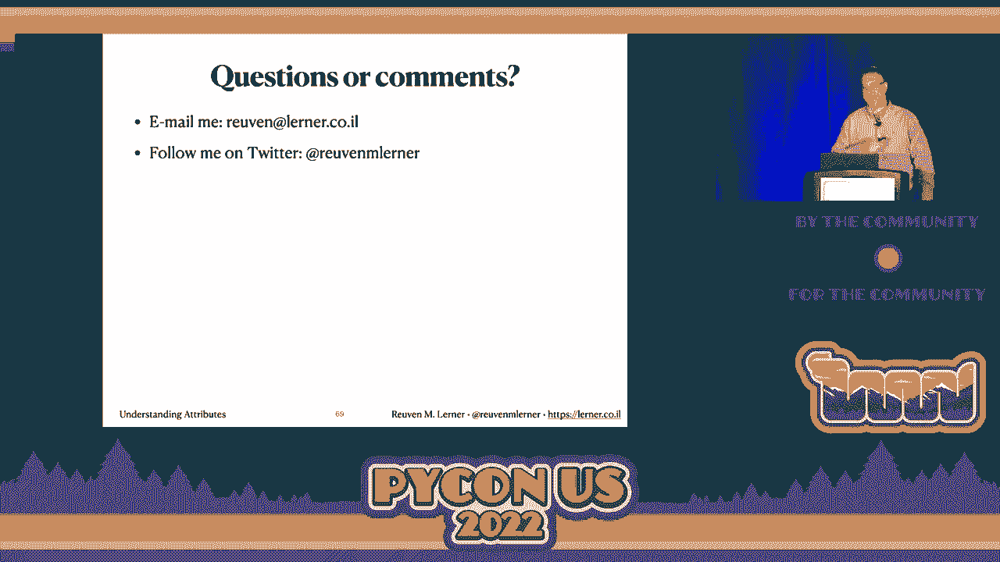

# P72：演讲 - Reuven M. Lerner_ 理解属性（或者 _ 他们并没有你想的那么无聊 - VikingDen7 - BV1f8411Y7cP

大家好，欢迎来到第二个环节。我是 Jonas。我将担任本环节的主席。

接下来的三场演讲将介绍演讲者。如果你觉得舒适，请走到前面，这样你可以看到幻灯片。我们这一环节的第一位演讲者是 Reuben，他将讲解理解属性。据说它们并没有那么无聊。大家注意自己。好的，大家好。哇。

见到人们以三维形式出现真是太好了。你们没有想过吧？也许你们知道，也许你们已经经历过。你们可能听说过现在有一点疫情。无论如何，我的名字是 Reuben，我以教授 Python 为生。自 1995 年起我就一直在这个行业。我做企业培训、视频培训和混合培训。

我有一个叫每周 Python 练习的项目。我有书籍、pandas、Python 练习。欢迎你们来我的展位，之后问我问题，甚至获得我的书籍的周边和抽奖。但让我们开始讨论当前的话题。让我们给一个变量赋值。激动吗？在这里我说 X 等于 100。这到底发生了什么？

我告诉你这并不意味着什么。许多来自 C 语言世界的人，我们必须对他们表示善意，怜悯他们。基本上，来自 C 语言世界的人相信，当你说 X 等于 5 时，你实际上是在取一个变量，这基本上是一个内存位置的别名。你是在说我想把那个值放进去。

内存位置。这在 Python 中并不是这样工作的。这并不意味着将 100 的值放入名为 X 的内存位置。它的意思是名称 X 现在应该指向整数对象 100。这是完全不同的概念。我们可以很好地观察到这一点。对于不熟悉它的人来说，Python tutor 网站是个好去处。

dot com 给 Phillip wall。惊人的，惊人的内容。在左侧我们看到变量 X，全局变量 X，指向整数对象 100。到目前为止，一切顺利。让我们变得更高级一点。让我们创建一个什么都不做的类，类名为 my class pass。然后我说 X 等于我的类的一个实例。现在我要做的是。

我要说 X 点 Y 等于 100。我在这里做什么？我并不是在给 X 赋值。我是在给 X 点 Y 赋值。我在 X 上创建一个属性。Y 不是一个变量。这一点非常重要，要记住并理解我们在 Python 中有两个完全独立的存储系统。在这里，我们看到 X 指向我的类的一个实例。

在那个类中，我们有一个属性 Y，值为 100。现在，Python 中的每个对象都有属性。每一个。你可以将它们视为对象上的一个私有字典。但不是使用方括号，而是使用点来设置或检索它们。而属性并不存在于变量中。所以虽然我们可以口语上说。

说 X 有一个属性 Y。从现实角度来看，X 是指向那个对象的变量，而对象具有属性 Y。所以我们可以很容易地从属性中检索。我可以说，比如，`sys.version`。对吧？我已经导入了 `sys`。我创建了全局变量 `sys`，它指向一个模块对象。所以 `sys` 是一个变量，而 `version` 是一个属性。

在那个变量上。它让我获取我正在运行的 Python 版本。我可以说 `stir.upper`，ABC。`stir` 是一个全局变量，实际上是内置的。对吧？它是一个引用字符串类的变量。`upper` 是这个类上的一个方法。然后我一旦检索到那个方法对象，实际上是一个函数对象，我就可以用括号来调用它并返回结果。

同样，我可以说 `random.random` 返回 0 到 100。`random` 是一个模块。它是一个方法。我获取那个方法对象并调用它。到目前为止都很好。就像变量一样，属性可以包含任何 Python 对象。它可以是数据，可以是一个函数。绝对任何东西都可以在属性中。就像绝对任何东西都可以在变量中。

如果我想设置属性呢？好吧，通常情况下，除了与用 C 编写的内置类型有关的非常少数例外情况，你可以在 Python 中对任何对象设置任何属性。所以这里假设我有一个不是内置类型的对象，我可以说 `x.y = 100`。我将会把那个属性添加到对象中。

如果属性已经存在，那么我用新版本替换之前的版本。如果这听起来很像字典，没错，它确实很像字典。所以，有些人可能还记得我们在将 Python 2 升级到 Python 3 时遇到的困难。好吧，我有一个更简单的解决方案。`sys.version` 等于 4.00。这样就好了。

我现在已经升级到 Python 4，完全没有支付。你看，我可以绝对、肯定地设置我想要的任何值。对任何属性，我想要的任何对象。但你知道我为什么要把版本设置为 4 吗？如果我把它设置为 4.20，埃隆·马斯克就会来买 Python。好吧，我们实际上总是设置属性。

我们总是不会太多考虑。如果我创建一个新类 `class Person`，我将会有一个 `__init__` 方法。这个 `__init__` 是什么呢？我告诉你，它不是构造方法。它不是在创建新对象。新对象已经创建后，`__init__` 被调用以添加属性到对象上。这就是它的角色。

如果你的对象没有属性，就不要使用 init。如果你对象没有属性，你还有其他问题，但现在先不谈这个。然后我给 self 一个 name。所以 self 是这个实例。它是刚刚创建的新实例。name 是参数，包含的局部变量。

这个值。然后我做的是把那个值 name 赋给 self 的 name。自然而然，self 就是那个新实例。所以我在那个实例上添加了一个属性。现在对象拥有它。现在它在这里被 self 引用。但当然在方法外，外部的 init，这个对象将会有一个不同的名称，一个不同的引用。

一个不同的变量。例如，P1 和 P2。虽然在 init 中是错误的，但我们可以看到发生了什么。我们有全局变量 person，它指向 person 类。然后在 init 中，我们有两个局部变量，self 指向那个 person 实例。我们可以看到，self 有一个名为 name 的属性和。

它的值是 name one，这是我们从变量 name one 赋值过来的。然后当我们返回时，好吧，我们得到了 name 和 name one。当我们返回时，P1 是指向那个实例，它仍然有属性 name。而我们有的值是 name one。好吧，不错，不错。让我们让这个变得更有趣一些。

这个程序缺少什么呢？好吧，让我们假设这是我们创业公司的，知道的，瑰宝。我们，这个程序实在太棒了。能够像这样创建一个人。显然，我们很快就会上市。但我的经理进来说。我跟我们的客户谈过，他们要求新的功能。客户希望我们。

跟踪我们在虚拟世界、虚拟宇宙中创建了多少人，如果你愿意，可以称之为元宇宙。所以让我们在添加人时跟踪人口。好吧，我该怎么做呢？这里有一个想法。我可以为此使用一个全局变量，对吧？这是个绝妙的主意。其实这并不是一个绝妙的主意。

所以我在这里要说的是人口等于零。我将创建那个全局变量。然后我要创建这个类。接下来我要做的是，每次我创建一个新实例时，我们都会通过 Dunder init。每次我都可以给人口加一。因此，在我创建我的实例之前，我要说之前。

人口等于那个。然后，我要说人口等于那个。它会从零开始。它将以二结束。这将是精彩的，直到它，不再是。未绑定的局部错误。我希望你们每个人都有一个最喜欢的 Python 错误。因为这是我最喜欢的一个。因为它让各种人困惑不已。未绑定局部错误。

这是什么意思？好吧，绑定是一种赋值的方式。基本上，这意味着，嘿，傻瓜。你有一个没有值的局部变量。但你还是试图检索那个值。等一下，这怎么可能呢？因为在 Python 中，我的意思是。看，在其他语言中，你可以声明一个变量，然后不赋值。你。

可能会遇到这种情况。但在 Python 中，我们没有声明。除了。哇，真是一个惊人的语言。那么基本上，我怎么会有一个没有值的变量呢？

答案是因为它是局部的。因为当我在一个 dunder 内时。我在一个函数内部。在函数内部，如果我给一个变量赋值，那么。这个变量根据定义是局部的。Python 会跟踪这一点并说，啊哈，你赋值了一个。population，population 是局部的。但这是编译时。然后我运行这个函数，并说。

好吧，我需要一个加上当前值，哦，我的天，未绑定局部错误。那么，我要怎么做呢？

好吧，一个可能性是使用 global。这不是一个好的解决方案。一个可能性是使用 global。global 语句说，嘿，Python，当你编译这个函数时。不要将 population 记录为局部变量，不要理会它。相反。赋值给全局变量。确实，这有效。我可以在这里说 population，等于零。

这里我们会得到零。这里我们会得到二。一切都很好。但其实并不是。因为。除非你绝对，肯定需要，否则你真的不应该使用全局变量。这并不好。但我们有更好的解决方案。记住，Python 中的一切都是。一个对象，包括类。每个对象都有属性。我们可以设置和检索属性。

每个对象都有。所以怎么样呢，怎么样呢？我们在人员类上设置一个属性。那么，我要做的就是。我会拿我的类 person。在我定义它之后，然后我会把 population 添加到它。可以这样做吗？当然可以，绝对可以。不要这样做。但你可以绝对，肯定地做到这一点。而且它会有效。正如我喜欢说的，不幸的是。

这有效。对吧？就像，它会给你正确的解决方案。在这里我们看到的是，我们。不能再将 population 视为全局变量。因为它不是。根本不是。它是一个属性。一个在 person 上的属性。但我认为我们都可以同意。这看起来相当丑陋。或者，正如我们所说的，咨询行业。一个机会。所以首先。

我们正在创建人员类。然后在我们完成后，我们将 population 属性添加到它。这不可能是最好的方法。好吧，我有一个解决方案。解决方案是测验时间。这段代码将打印什么？所以我基本上拿了我这里的人员类。然后我去掉了 population 的内容。并添加了一些打印语句。那么问题是。

那么将以什么顺序打印？而我是个好人，我会给你一个提示。A 会首先打印。之后，你就得靠自己了。好吧，没问题，我会揭示答案。答案是 A，B，D，E，C，C。那么这里发生了什么？

因为这对很多人来说并不明显。我也给他们展示过这个。我真的很喜欢给人们展示这个，因为它迫使你认真思考很多这些问题。而且这与类没有任何明显的关系。所以打印 A，完成了。但许多人，特别是那些来自静态编译语言的人，会说，好吧，这里打印 B。

这根本不会运行。或者也许它会运行，然后他们开始尝试去搞清楚，但就是不工作。但实际上，它立刻被打印出来。然后他们说，哦，我明白了。A，然后 B。显然我们接下来要打印 C。不是的，我们接下来打印 D。我们跳过 C。所以有什么地方出错了，有点奇怪。

这不仅仅是你在海外的时候。所以接下来我们有 D。然后我们有 E。最后，我们打印 C，并且打印两次。那么发生了什么？人们之所以困惑的部分原因是函数和类看起来几乎一模一样。所以在这之前，这能发生之前，我们需要有被调用的人。

Dunder 需要在那儿。函数和类看起来一样，但函数体在定义函数时并不会被执行。但类体在定义类时需要被执行。否则就没有 Dunder 可以在我们全新的对象上调用。那么这意味着当我定义一个类时，它是逐行执行的。

等一下。在我的类中，我有 Dunder。难道 Dunder 的主体不应该运行吗？不，因为函数体在定义时不会运行。函数体只有在你实际运行时才会运行。但这里发生了一些奇怪的事情。那死亡呢？

死亡做两件事。它创建一个新的函数对象，并把该对象分配给一个变量，也就是函数的名称。但在这里死亡定义了 Dunder，它是什么？它是一个属性。它是一个属性。方法是属性。因此 Dunder 是在类上的一个属性，就像我们之前设置的人口属性。这恰好是一个函数属性。

它不是整数。在这两种情况下，我们在类上的属性定义方式不同。我们用死亡来定义它。但这里还是有些不合理。我把它当作类属性。怎么可能死亡现在定义了一个属性，而通常是定义一个变量呢？原因是你可以把类看作无文件模块。

没有文件的模块。类体中的函数是类属性。在类内部，它们看起来像变量。但在类外部，它们看起来像属性。这就像模块。当你在模块文件中定义一个函数或变量时，在文件内部，这是一个全局变量。但在文件外部，我将其作为我定义的模块对象上的属性。

我已经导入了。所以我们在类内部定义的任何函数都不是变量。它们是属性。我们类上的属性。因此我们在类中进行的任何赋值都不会创建变量。它们也会创建属性。这意味着我可以回到之前的 person 类。我可以说 population 等于零。就这样。

我并不是在创建一个变量。这不是一个全局变量。这根本不是一个变量。这是一个属性。Person.population。顺便说一句，有时候人们会问，为什么我们不把它称为类的 person.population 方面呢？原因是，名称 person 只有在类体运行后才被定义。所以你不能这样做。有些人。

看这个，他们会想，哦，我以前见过这些。我有 C++ 的背景。我们称这些为静态变量。我会说，请不要在我的课上使用粗俗的语言。但问题是你不应该这样说，因为这会混淆概念。静态变量是共享的。它们在类和实例之间是共享的。但属性则不是共享的。

名称并不是共享的。它们可以全部引用。它们可以指向同一个对象。但是，属性只存在于类中。Python 没有共享属性的概念。它在语言中根本不存在。好吧，让我们看看。让我们看看它们是不同的。所以我将添加一点代码。我将说在我们创建了两个 person 之后。

对象，person.population。我将向你展示。我们不会从 P1 和 P2 的 population 中获得任何东西。看，person population 我得到了，P1 population 我得到了，P2 population。我得到了。哎呀。它成功了。我们得到了相同的值。所以也许它们真的共享。不是的。这就是我介绍我称之为 ICPO 的地方。Python 中的属性查找路径。

实例类父对象。这就是 Python 一直在查找属性的方式，一直如此。而一旦你理解了这一点，Python 中许多其他事情就开始变得更有意义。那么这个 ICPO 规则是什么呢？首先，Python 在你实际提到的对象上查找。实例本身，并询问，这个属性在这里存在吗？如果存在，那就太好了。

我们停止。我们有了值。如果没有，我们不会立刻放弃。我们去看类。实例类是否有这个属性？如果有，那就太好了。如果没有，我们继续去查找父类。我们稍后会谈到这个，但我们会在父类中查找。如果那里也没有，那么就是类层次结构的顶层对象。所以让我们一步步来看。我说 person.population。

Python 转向，我知道它感觉不像一个实例，但类是对象。除非它们的实例，P1 这个人有属性 population 吗？答案是有。我们得到这个值，故事结束。然后 Python 问，嘿，P1，你有属性 population 吗？答案是没有。但 Python 没有放弃。它说，哦，我明白了。

哦，我会检查一下这个班级。P1 这个人的类有属性 population 吗？有。我们也得到了值。我还可以说 P2。P2 有这个属性吗？没有。这个人，有吗？有。

我们得到了结果。现在我应该指出，这假设我们没有给 P1 或 P2 分配属性 population。如果你这么做，所有的赌注都没有了。因为那样它会在实例上找到属性。而不会继续到类。最后你会陷入一个糟糕、糟糕的境地。不要这么做。我的 CPO 解释了方法查找。

确实有。因为如果我现在有一个新版本的人，对吧？

这个版本的人有一个新方法。它有 greet 方法。所以我可以说 P1 等于 person name one，P2 等于 person name two，我的两个朋友。我们来给他们打个招呼。P1.greet。这里发生了什么？Python 转向 P1，问它是否有 greet 属性？答案是没有。于是它转向类。这个人。

有没有 greet 属性？答案是有。我们得到了那个方法对象并执行它。然后我们在这里做同样的事情。P2。它有 greet 属性吗？没有。这个人有吗？有。

我们得到了方法对象并执行它。效果很好。这里的方法被定义为类属性。但我们通过实例访问它。好的。让我们试试一个新类。对吧？我们的 person 对象如此成功。我的老板回到我身边，说，听着，我们需要一些新东西。我们需要一个 employee 类。员工。

员工几乎就像人一样。有时员工甚至是人。但这取决于你工作的公司。因此，员工与人不同，是通过两个属性创建的。名字和 ID 号码。否则，他们和人是一样的。所以我们必须有一些区别。那么，我该怎么办？我说我的老板在听。我知道我会做什么。给我一个月的时间。

老板说，听起来不错。一个月后见。我想，哈，我打算在五分钟内搞定这个。然后这个月我就看 TikTok 视频。太好了。所以这里我有了我的 person 类。我现在使用程序员工具箱中最强大的工具。复制粘贴。我定义我的 employee 类，做一些轻微的调整。我增加了一个赋值。

根据 ID 号码生成自我 ID 号码。然后我可以创建一个新员工。我叫它 E1，greet。E2，greet。太棒了。我觉得自己棒极了，因为现在我有整整一个月来改善我的舞蹈。我的老板一个月后回来。像所有软件公司老板一样，想检查我的代码。看看我的代码，说。

为什么我花这么多钱在 Python 培训和会议上，而你所做的只是复制和粘贴？你为什么不使用继承？我说，继承。对吧。再给我一个月。我保证会更好。听起来不错。老板走开了。一个月后见。所以我们再试一次，只不过使用继承。我该怎么做？我放。

在 employee 后面加上 person 的括号。这表示，employee 是一个 person。Employee 继承自 person。这到底意味着什么？它将 person 插入到 ICPO 搜索中。这意味着，现在如果我们在类中找不到属性，我们将作为父类进行查找。如果我们在 employee 中找不到属性，基本上是一个方法，我们会在 person 中查找。

结果果然，现在我调用 E1.greet。发生了什么？Python 说，E1 有 greet 吗？

答案是否定的。这类员工有 greet 吗？答案是肯定的。搜索结束。我们通过继承并没有取得任何成果。所以是的，我们从个人那里继承，但我们并没有利用它。所以现在让我们利用它。让我们使用继承。我们可以利用它，因为 greet 方法正是如此。

在 person 和 employee 中是相同的。因此我们可以在 employee 中去掉它。所以我在这里说。class employee，跟以前一样，只是我去掉了 greet 方法。现在当我调用 greet 时，发生了什么？Python 问 E1。你有属性 greet 吗？答案是，否。它问 class employee，你有属性 greet 吗？答案是否。所以我们。

去父类。你有属性 greet 吗？答案是肯定的。我们得到了方法。我们运行它，一切都很好。E2 也发生了同样的事情。因此，很多人看到这段代码时说，哦，继承听起来很棒。然后他们说等等。我们可以进一步改进这段代码。因为 name，我设置 name 和 employee。我也可以设置 name，为什么？

我是否在设置 name 和 employee，同时也在个人中设置？我可以直接在 employee 中去掉它。一切都会很棒。所以在这里，我传入 name，跟 name 无关，因为我是个乐观的人，我假设个人会处理好这一切。是的，除了它不会。Employee 没有属性 name。我说，什么？这怎么可能？我。

决定在其上运行 var 的函数。只是确认一下。我看到 E1 只有一个 ID 号，E2 只有一个 ID 号。也许你有时在工作中会感觉他们并不真的相信你有一个名字。只是一个数字。但这是一个错误，而不是一个特性。或者我想这么认为。那么这里发生了什么？好吧，事情是这样的。

name 属性从未设置。我们从未到达 person.thunder，在那里设置了 name。问题基本上是这样的。我们创建了 employee 的新实例。我们问新的实例你有它吗？没有。我们问 employee 你有它吗？是的。那段运行了。我们从未到达 person，因为它从未运行。name 没有被添加。来自的人。

静态编译语言常常对此感到惊讶，因为它们将类视为一组声明。它们会说，哦，子类的声明和父类的声明会合并在一起。所以我得到了所有这些不同的字段。我得到了所有这些不同的属性集。但是在 Python 中并不是这样。我们显式地设置这些属性。

在 Python 和在它上，你不在它上运行。属性没有被设置。那么我们能对此做些什么呢？我们有几种不同的可能性。一个是在 employee 的内部明确调用 person。的内容。就在那儿，我可以说，是的，我可以运行它。这在技术上没有问题。但这正是，给了我正确的答案。

但在这里使用 super 更好。Super 基本上说它是一个代理，并且它会说我会弄清楚我们可以在它上运行什么。它会向上遍历链。它会说，哦，person 有在它上执行的内容。我会运行那个。太好了。然后我们得到了 M1。我们得到了 hello M2。一切都很好。这就是我们在实例、类和父类上看到属性的使用方式。

我还应该补充，如果我们有多个父类，对吧，如果我们有某个东西源于某个东西，而这个东西又源于某个东西，这样层层递上去，直到它到达对象。对象是我们对象层次结构中的顶级对象。让我们聊聊这个。当我。

打印 P1 还是打印 E1？首先，我得到的东西实在是太丑了。我永远无法理解为什么这被视为默认值，但好吧，确实如此。无论如何，为什么？

因为当我调用 print，print 时，为什么我们可以在 Python 中打印任何东西？因为 print 会将其参数转换为字符串。我们如何将某个东西转换为字符串？我们在它上调用 stir。那么，当我们在它上调用 stir 时会发生什么？它会寻找一个 dunder stir。P1 有 dunder stir 方法吗？没有。P1 的类 person 有 dunder stir 吗？没有。

对象有 stir 吗？是的。所以我们得到了 dunder stir 的默认实现。这就是我们看到的默认丑陋结果。而对于 E1，它基本上是同样的事情，只是多了一步。E1 有 dunder stir 吗？没有。E1 的类 employee 有 dunder stir 吗？没有。E1 的类的父类 person 有 dunder stir 吗？没有。对象有它吗？

是的。我们都明白了。这就是我们如何进行运算符重载的。属性查找。如果你在你的类中定义了 dunder stir，你基本上是在更早的阶段停止了搜索。因此，你永远无法到达对象中的 dunder stir。但是仍然有一些东西缺失。Python 喜欢明确。Python 喜欢没有魔法地工作。我们在 Python 中。

喜欢嘲笑那些有魔法的其他语言。你知道，显式优于隐式。但这里有一块我们都知道的魔法，我们并不抱怨太多。那就是方法重写。你可能知道这一点，也可能不知道。但基本上，如果我有 s 等于 abcd，然后我调用 s.dot upper，我得到的是 abcd。太好了。

这是我们调用方法的正常方式。但我也可以说 stir.dot upper of s。这也是可行的。这是完全一样的。但这里有点问题。有什么地方不对劲。我们知道方法存储在类属性中。我们知道我们可以从类或实例中检索类属性。但不知怎么的。

根据我们检索的方式，我们得到了不同的行为。让我们再看看这一点。回到这里。好吧。我在请求 dunder 的 dot upper。我在请求 upper 属性。我可以在实例上请求它。我可以在类上请求它。在一种情况下，它期望在类的情况下，作为参数获取实例。

但在实例的情况下，它不会。因此，这里发生了什么？好吧，让我们问 person.dot greet。我们得到的是什么？我们得到一个函数，一个普通的 Python 函数。P1.dot greet。我得到了一个绑定方法。哈。这有点奇怪。发生了什么？答案是描述符。通常，当我检索类属性时，我得到存储在该属性中的对象。

这是我们到目前为止看到的正常行为，你可能在日常生活中也见过。你对此不会多想。但如果该属性有一个 dunderget 方法。也就是说，如果该属性属于某个类型，而该类型安装了 dunderget。那么，返回的结果将是 dunderget 的结果。让我们试试这个。

我在这里要定义类 loud number。好的。基本上，这只是会为我们存储一个整数。没什么太令人兴奋的。我应该顺便提一下，描述符可以非常复杂。我不会在这里讨论所有描述符。我只是以更高的层次向你展示它。但你应该能大致明白。因此。

我有我的课程。这是一门完全合理的课程，对吧？Dunder 本身是 N。然后，当我们在其中运行 Dunder 时，我们将打印出我们在那里的信息。我们将会将 self N 赋值为 N。然后 dunderget，这是那个特殊的方法。我们将说 self，我只是暂时不详细讨论我们收到的参数。我们将。

我们很快就会进入这个。Splat args，意味着你想传递的所有位置参数，这没问题。那么我们将怎么做呢？我们将返回 self.dot N。如果我将 loud number 的一个实例赋值给一个非常特殊的属性，什么也不会发生。但如果我将它赋值给一个类属性，魔法就会发生。我们来看看。所以假设我们定义类 person。

age 等于 loud number 30，对吗？那么我在这里做什么？我正在创建一个 person 类。这个 person 类什么都不是。我现在只是专注于这个描述符。我说，让年龄等于一个新的 loud number 30 的实例。当我现在问时。好吧，当我运行时，我得到 loud number 的初始化并等于 30，因为我们运行了那个代码。

它是类定义的一部分。当我们定义一个类时，类定义会运行。当我说 P 等于 person 时，太好了。我们创建了 person 的新实例。当我说，哎呀。不，不，不，不，不，回来。好吧，演讲结束，朋友们。希望你们保持悬念。那时在我的论文答辩期间发生时情况更糟。无论如何，这里发生了什么？

我们这里有 P，一个 person 的实例。它指的是一个 person 的实例。很好。这不是最有趣的事情。真正有趣的是，在它上面，我有 person。它指的是 person 类。它有一个属性，age。那么，age 的值是什么？

这是一个 loud number 的实例。我知道跟踪这一点有点混乱。但基本上，类属性是一个对象。当然，类属性总是对象，因为在 Python 中一切都是对象。只是这里，它是一个我们用这个奇怪的 dungger get 方法创建的类型的对象。现在看看这个。我说，P。age。

我通过实例检索类属性。它调用了方法。Dungger get 正在运行。然后我得到 30。然后我说 person.age。方法正在运行，我得到 30。这有点奇怪，对吧？我的意思是，我确实得到了属性值。但是我没有得到属性本身。我得到了无论什么 dungger get 的。

返回给我的功能。这更奇怪的是。我没有使用括号。在 Python 中。如果我不使用括号，我不会调用方法或函数。而在这里，我没有使用括号。然而，它被调用了。这是什么鬼？那么，获取参数是什么？

这实际上在做什么？好吧，之前我说它只是拆分参数。实际上，它获取两个参数。这两个参数被赋值给两个变量。调用这些参数有不同的名称和约定。我称之为对象类型。选择你自己的毒药。所以在 self 之后我们得到的第一个参数是对象。来自哪个实例。

是正在检索的属性，对吗？那么，我试图通过谁来检索这个？

第二个参数是这个属性存储在哪个类中。那么我们再试一次。我将创建我的类。Age 等于 loud number 30。我们看到了。现在我说 p 等于 person，一个新的实例。我说 p.dot age。看看我在打印中得到的是什么。它说对象是 person 的一个实例。好吧，这是真的。

通过实例 person p 访问 age 时，对象就是 person，类是 person。所以我们知道像 p.dot age。它在 get 下被调用。并且 get 知道是在哪个实例上，以及从哪个类中。如果我说 person，如果我说 person.dot age，对象是 None。但对象类型仍然是类 person。换句话说，如果我通过类检索它。

对象是 None。但如果我通过实例检索它，对象就是我运行它的实例。哎呀，回来。事情是这样的。你每天都在使用描述符，因为方法就是描述符。当我们通过类检索方法时，Python 返回的是原始函数。但是当我们这样做时，它可以判断因为对象被设置为 None。所以我们。

需要将实例作为第一个参数提供。它知道，哦，我在这里没有得到对象。所以我们需要获取那个参数，以便我们可以正确调用函数。但当我们通过实例检索方法时，Python 说，啊哈，我想做的是获取那个实例对象并将其变为第一个参数，把它移到那里，以便我们可以调用。

原始函数及其所有参数，但将对象放在前面。那么，它将如何做到这一点呢？答案是，偏函数（partials）。你可能对它不太熟悉，但在 Python 的有趣工具中有个叫做偏函数的东西。所以我可以说，比如，添加（add）一个和 b 返回 a 加 b，这是一个完全正常的加法函数。然后我说加五（add five）。

等于 add 的偏函数和五。加五实际上是一个函数对象。它是一个可调用的。我可以像你看到的那样在底部调用它。我说 add five of 10，它返回 15。因为我们在 add 上预加载了第一个参数五。这正是我们的方法在这里发生的情况。当我通过实例调用方法时，Python 会进行重写。

并返回一个偏函数。它自动将该实例分配或绑定到方法上。你知道它在这里说什么。当我检索 person.greed 时，它只是一个函数。但是在返回 p1.greed 时，它是绑定到那个特定对象的 bound method person greed。它告诉我们它在做什么。但在没有逐步理解所有这些属性内容之前，这很难理解。等一下。

它对我们的原始函数做了什么？对吧？就像说，哦，我定义了我的方法，它被替换成了这种描述符魔法。但我的原始方法 greed 到底在哪里？答案是，它被放在了另一个类属性上。它有点被移到 dunder dict 中。所以那里的方法名称是关键。而。

原始函数就是那个值。所以如果我们通过类请求一个方法，对象就是 None。我们得到的是原始函数。方法描述符只是返回一个函数，来自 dunder dict。但如果有一个对象在那儿，Python 基本上就创建了一个偏函数，将我们的实例与该函数一起返回，这就是我们的方法。所以，当。

当我们请求 Python 中的 a.b 时，很多事情正在发生。Python 通过 iCPO 查找我们的属性。当我们最终找到一个属性时，它可能是描述符。而描述符根据我们是通过实例还是通过类调用它，做一些魔法。我们每天都在使用描述符，而不太考虑它。并且我应该补充。

有些人真的想实现描述符。你几乎不需要这样做。我认为了解协议有助于更深入地理解 Python。但实际上你自己实现描述符的几率非常非常小。大多数情况下，如果你考虑实现一个描述符，你可以使用所谓的属性。

这是一种更简单的描述符形式，覆盖了很多内容。但基本上通过这些属性，我们获得类属性。我们获得继承。我们几乎能够在实例和类之间共享东西。我们获得方法的魔力和它们的重写。好了，现在到了结束。非常感谢大家。显然我们。

在这里不接受问题和讨论。但我想说，如果你想来，我在展会有一个展位。欢迎你来和我聊天，问我任何问题，我会很高兴。非常感谢大家。[掌声]。

