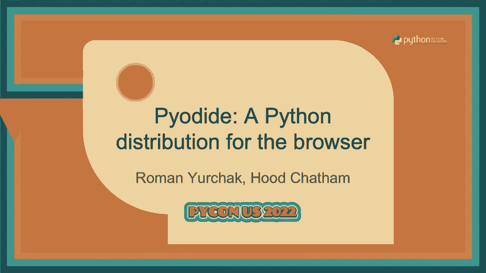

# Pyodide 教程：1：什么是 Pyodide？




在本节课中，我们将要学习 Pyodide 的基本概念，了解它是什么以及它如何工作。Pyodide 是一个可以在 Web 浏览器中运行的 Python 发行版，它使得开发者能够直接在客户端执行 Python 代码，而无需依赖后端服务器。

## 概述

Pyodide 的核心是将 CPython 解释器编译为 WebAssembly，从而在浏览器环境中运行。它不仅支持运行 Python 代码，还能使用许多流行的 Python 科学计算库，如 NumPy、Pandas 和 Matplotlib。这使得在 Web 应用中集成复杂的 Python 数据处理和可视化成为可能。

## WebAssembly 简介

上一节我们介绍了 Pyodide 的基本概念，本节中我们来看看其底层技术——WebAssembly。

WebAssembly 是一种为基于栈的虚拟机设计的二进制指令格式。它是浏览器中除 JavaScript 外的第二种编程语言，具有可移植、体积小和注重安全性的特点。WebAssembly 本身不提供标准库，所有与外部世界的交互都需要通过宿主环境（如浏览器）定义的导入函数来实现。

## Emscripten 工具链

为了在 WebAssembly 中运行 C/C++ 代码，我们需要一个编译器工具链，这就是 Emscripten。它使用 Clang 编译器将代码编译为 WebAssembly，并提供了 JavaScript 绑定来实现系统调用，从而模拟了一个 POSIX Linux 环境。这使得移植现有的应用程序到浏览器成为可能。

## Pyodide 的核心组件

Pyodide 主要由以下几个核心组件构成：

*   **CPython 解释器**：标准的 Python 解释器被编译为 WebAssembly。
*   **外部函数接口**：用于处理 Python 的 C 扩展。
*   **JavaScript 主机环境**：提供操作系统功能，所有标准库都在其中实现。
*   **预编译的二进制扩展**：包括 NumPy、Pandas、SciPy 和 Matplotlib 等。
*   **MicroPIP**：一个用于从 PyPI 安装纯 Python wheel 包的简化工具。

## 包管理与生态系统

Pyodide 支持丰富的 Python 包生态系统。以下是其包管理的主要方式：

*   **预构建的二进制包**：超过 120 个核心科学计算包已预先编译好。
*   **通过 MicroPIP 安装**：可以从 PyPI 安装纯 Python 的 wheel 包。
*   **自定义构建系统**：对于带有二进制扩展的包，需要使用受 Conda 启发的元数据格式进行专门构建。

## 外部函数接口

能够在浏览器中运行 Python 只是第一步，与现有的 Web 技术（JavaScript/DOM）无缝交互同样重要。Pyodide 提供了友好的外部函数接口来实现这一点。

**从 Python 调用 JavaScript**：你可以直接从 Python 导入并使用全局 JavaScript 对象。
```python
from js import setTimeout
def callback():
    print("Hello from Python!")
setTimeout(callback, 1000) # 1秒后调用
```

**从 JavaScript 调用 Python**：全局 `pyodide` 对象让你可以访问 Python 环境。
```javascript
let sum = pyodide.runPython(`
    def add(a, b):
        return a + b
    add
`);
console.log(sum(2, 3)); // 输出 5
```

Pyodide 会自动在简单类型（如数字、字符串、None/null）之间进行转换。对于复杂类型，它会创建代理对象，让你可以跨语言调用方法。

## 架构与限制

Pyodide 在 Emscripten 提供的虚拟机环境中运行 Python 代码。这个环境具有以下特点：

*   它是一个 32 位架构。
*   拥有一个内存中的文件系统。
*   **存在一些限制**：
    *   不支持多进程 (`subprocess`)。
    *   不支持线程。
    *   不支持套接字，因此无法直接使用 `requests` 等网络库。
    *   标准输入/输出流需要重定向到网页进行渲染。

## 主要用例

Pyodide 开启了多种新的应用可能性，以下是三个主要的用例领域。

### 1. 交互式计算

这种架构下，所有计算都在用户的浏览器中完成，服务器只提供静态文件。这对**科学交流、数据可视化**和创建**交互式文档**非常有利。
*   **优点**：
    *   **无需安装**：用户无需在本地安装 Python。
    *   **易于部署与扩展**：开发者无需维护服务器、容器或云服务。
    *   **保护隐私**：敏感数据无需离开用户设备。
*   **相关工具**：PyScript、Jupyter Lite、Stlite、Iodide 等。

### 2. 教育

Pyodide 为编程教育提供了理想的平台。例如，法国的高中课程已采用基于 Pyodide 的笔记本解决方案，每周服务约 10 万用户，而只需维护极少的静态文件服务器。

### 3. 机器学习模型部署

传统部署 ML 模型需要复杂的服务端设置。使用 Pyodide，你可以：
1.  在 Python 中训练模型并用 `pickle` 序列化。
2.  将序列化的模型和推理代码直接嵌入网页。
3.  用户在浏览器中加载页面即可运行模型进行预测。
这种方式简化了部署流程，并允许在客户端进行模型训练和实时交互。

## 技术挑战与解决方案

在开发 Pyodide 的过程中，团队克服了许多技术难题。

**SciPy 与 Fortran**：SciPy 依赖 Fortran 代码，但缺乏成熟的 LLVM Fortran 编译器。解决方案是使用 `f2c` 工具将 Fortran 代码转换为 C 代码，并结合大量手动修补，才使大部分 SciPy 测试得以通过。

**函数指针调用约定**：许多 Python C 扩展存在函数签名不匹配的问题，这在本地系统上可能运行正常，但在 WebAssembly 严格检查下会导致崩溃。Pyodide 的解决方案是使用一个 JavaScript “跳板”函数来中介调用，此方案已被上游合并到 Python 3.11。

**异步 I/O 与网络**：由于缺乏套接字支持，需要使用 JavaScript 的 `fetch` 等异步 API。Pyodide 实现了一个自定义的异步事件循环，将其任务调度到浏览器的事件循环中。对于同步阻塞操作（如下载文件），可以使用 Web Workers 配合 `synclink` 这样的项目来模拟。

**包体积优化**：Python 科学计算包通常很大。潜在的优化方案包括：将大包拆分成小包、使用打包工具只包含运行时实际访问的文件、实现动态导入，或者等待平均网页大小增长的趋势。

## 未来发展路线图

Pyodide 项目仍在积极发展中，未来的工作重点包括：
*   **维护与更新**：持续跟进 Emscripten、CPython 和新版依赖库。
*   **补丁上游化**：将 NumPy 等库的修复补丁提交到上游项目。
*   **功能增强**：改进对异步 I/O、Web Workers 的支持，探索线程支持的可能性。
*   **优化与文档**：继续优化包体积，构建更可持续的构建系统，并完善项目文档。

## 总结


本节课中我们一起学习了 Pyodide，一个强大的浏览器内 Python 运行环境。我们了解了它的核心原理是基于 WebAssembly 和 Emscripten，认识了其架构和主要组件，并探讨了它在交互式计算、教育和机器学习部署等领域的应用。尽管面临包体积、网络 I/O 等技术挑战，但 Pyodide 及其活跃的生态系统正在不断进步，为在 Web 上构建丰富、隐私友好且无需服务端的 Python 应用开辟了新的道路。