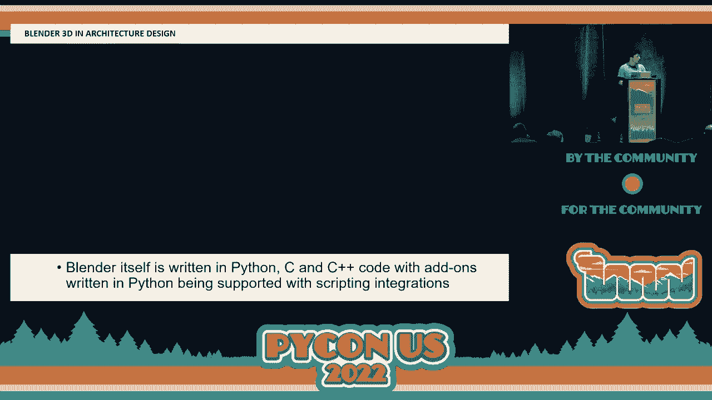
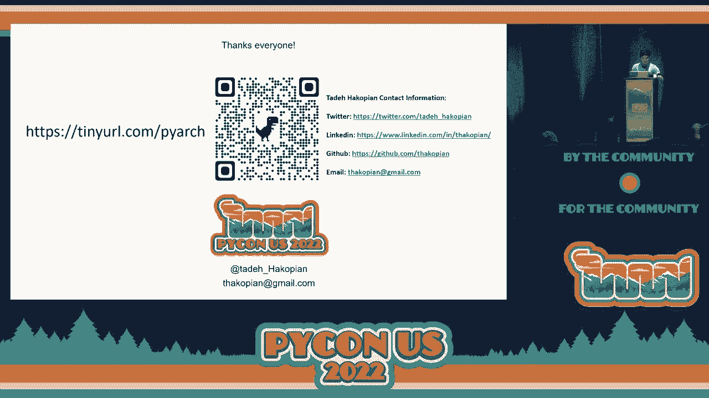

# P77：演讲 - Tadeh Hakopian_ 用 Python 编程建造摩天大楼 - VikingDen7 - BV1f8411Y7cP  

你好，欢迎大家。  

  

我们的下一个演讲即将开始，这次演讲的嘉宾是**Tadehakopian**，他将谈论如何使用 Python 编程创建 Skype 爬虫。让我们用热烈的掌声欢迎 Tadeh。顺便说一下，如果你们想在我开始之前预览一下演讲，或者想跟上进度，我在 PyARC 有二维码和短网址。  

我会在最后再提一次。让我们开始吧。我是**Tadehakopian**，程序经理，背景是建筑以及使用数据和虚拟现实工作流程的建筑工程。多年来，我一直在教人们这些知识，低代码、Python 编程。对我来说，Python 的一个重要特点是它的可能性。  

这是一个展示 Python 如何以多种不同方式支持建筑师和设计的案例。在我们讨论这些例子时，请考虑一下你如何使用你的建筑空间、你周围的环境以及你与它的互动，并思考实现设计意图和概念所需的条件。  

将想法变为现实以及其中的挑战。我们得到的是建筑师和建筑师。人们认为建筑是系统、模式、语言等的集合，这确实是很大一部分。很多人拥有计算机科学的建筑背景，但还有建筑。这些例子是楼层平面图，它们有共同的基础。  

它们之间有这么多术语的原因是，来源于 60 年代和 70 年代的一个叫做**克里斯托弗·亚历山大**的人，他是一位传统建筑师，谈论设计模式。  

使用特定排列的窗户。这对于小建筑、住宅楼或城市来说是合理的。而且你可以将其放大。一些计算机科学学生在 70 年代注意到了这一点，并说，“嘿，这是个好主意。”所以他们借鉴了他的许多概念，创造了设计模式的概念，这就是你获得这些建筑思想与计算机科学结合的地方。  

实际上，两个群体之间有大量共享知识和交集，所以已经有很多共同之处。谈到建筑时，人们通常会想到建筑师的工作。他们想到一个人在板子上画画，提出创意，充满艺术感，这确实是一个重要的部分。  

但如今，这更像是一个设计草图。而在以前，他们会整天画图。他们只需要做大约 20 张图纸，就能在几面、几种方案中传达整个建筑，而现在完成任何事情需要几千张图纸。所以我们已经从这种方式发展了。

这就是我们今天的工作方式。这不仅仅是一个二维图像。我们的建筑完全以 3D 实现。不仅仅是简单的 3D 几何，它还包括建筑的高度、几何、每个门、窗的数量、面积、墙体的体积等等。因此，大量数据嵌入在我们的工作中。

今天。因此这不仅仅是一个图像或示例。这是真实的数据。现在我们有了这种数据丰富的格式，可以更容易地访问它。之前，字面意思上只是草图和绘图，并不是很有用的数据。这个系统称为建筑信息建模。它提取设计意图、几何和数据。

并将其整合到一个通用数据环境中，以便我们能够同时访问所有这些信息，而不必以不同的方式存储信息。基本上，这就是一个关系数据库。你看到的只是相互连接的表格。这就是当今世界的运作方式。我们使用一些软件。我将以在建筑信息建模（BIM）领域非常常见的 Revit 作为参考。

像数十亿人使用的这个软件。因此还有其他的选择，但我们今天就以这个为参考，它本身具有 3D 建模能力和数据库，能够提供诸如高度图等功能。它会生成图纸。如果你曾经在一座建筑中。

任何在过去 10 年内被翻新或新建的建筑，可能就是这样组合起来的。因此，这比以往任何时候都更丰富和可获取。但为了访问这些，我们需要一些特殊工具。这种看起来像格子布的东西叫做 Dynamo。这是一个低代码解决方案，可以连接到类似这样的东西。

从这些 BIM 解决方案中提取数据和几何形状，以便我们可以操作它并获得一些自定义工作流程。简单来说，你可能见过类似的东西。比如，Node-grad 是一个在外面相当受欢迎的例子。它只是一个节点图，通过线连接在一起。基本上是你的输入、处理和输出。

低代码或无代码解决方案。这就是 Dynamo 的样子。你可以用它连接到 Revit API。你可以进行算术操作。你可以将两个数字相加并得到结果。但你可以进一步操作。你实际上可以用它来处理几何。因此你可以在模型中绘制一条线，选择。

实际上弄清楚像在这条线上需要多少个点，特别是像这样的曲线。你可以把整数放在那里作为滑块。有一个代码块，空间量，然后你会得到一个结果，你可以将其输入到你的模型中。这非常方便，因为你不必坐在那里自己去弄明白。

然后将其绘制出来，或者会花费很长时间。因此，这是一项非常酷的自动化技术。它是实时可视化的，你可以看到结果。我们进一步扩展。我可以创建一些像平面图的东西。我说是一个矩形平面图，我设定长 30 英尺和 60 英尺。我只需将四个角的 XYZ 坐标绑定在一起。在底部我有我的。

不同种类的材料。幕墙和楼层，我想要多少层，以及六英寸的混凝土。 我连接这些矩形有线集上的点来创建我的形状，然后我嵌入我想要的设备类型和材料，以得到一些地板、墙壁和层数的输出。我们从这个几何预览到这个结果。这是。

大约 70 层的塔楼。因此我们只用了大约两秒钟就建好了我们的摩天大楼。就是这么快。如果我手动去做，可能需要一个小时，甚至两个小时。因此，使用 Dynamo 可以得到非常酷的结果。你也可以做一些非常规的事情。你可以。利用这些组合块，随意在墙上设计一个波浪图案。它可能。

在上面放一些艺术。如果你想做一些独特的事情，再次你可以进行所有操作。你不必是编程专家就能使用它。此外，你可以预览几何图形。你想玩弄的，连接事物，你知道，看看事情是如何发展的。如果你喜欢那种动手做的感觉，这真是太好了。

粘土概念，很多设计师对此不太熟悉，仅仅依靠可视化文本代码。但是你可能会问，这一切都很酷。太好了。那 Python 又是怎么回事？某人那里。它里面也有一个 Python 脚本节点。这是我多年前进入 Python 世界的入口。但我真的想用它，但我没有办法使用它。它在这里工作。

你可以用 Python 完成那些部分的任何事情，但 Dynamo 确实有一个。它内置了一个小型 IDE。你只需导入运行时。你导入随 Dynamo 软件附带的几何库。然后你有一个输入节点。所以你必须有一根电线连接进来。然后你有一个输出节点。这与典型的 Python 脚本有点不同。否则。

是一个非常相似的概念。最棒的是，你不需要使用 API。你不需要了解 SDK 的任何内容。你只需使用这个 Python 脚本加上 Dynamo 脚本，就可以将数据放入数据库。而 Revit 的 API 是一个庞然大物。它并不友好。能够绕过它真不错。因此，与你使用的所有这些相比，你可以。

在 Dynamo 中使用 Python 脚本运行它。此时它使用的是 Iron Python 或 Seed Python。关于实现，我可以给你一个示例。我们可以做一个循环来制造一堆东西。在这种情况下，这种情况时常发生。只需一个按键，就可以快速将东西放入你的模型中，无论你想构建什么。因此，即使是低代码脚本。

创建一个循环需要我花一点时间。因为我在想，好的，我该如何获取一些坐标呢？这里有一个我们的小脚本示例。在这里，我们只是导入我们的运行环境，几何形状。然后还想写入 Revit。因此，我必须在这里导入 Revit 的内容。我所做的就是无论是什么。

我想放进去的族，族只是你想放进去的对象，创建一些坐标。X，Y，Z，Z，Z，Z，Z，Z，Z，并给我一个输出列表。所以这是一个 X 范围，范围是从 0 到 100 英尺，间隔 20 英尺，Y 的循环也是如此，X 范围同样是从 0 到 120。而 Z 也在那个范围内。所以我得到了我的 X，Y，Z，按照所需的间隔。

设定任意步骤。然后我输出一个点的坐标值，X，Y，Z。我说，好吧，柱子将是族实例乘以这个，按坐标点，并将一个柱子附加到那。就是这样。所以这就是所有的努力。因此我可以拿一些这样的东西，放入脚本的 ID 中，然后输出所有内容。

所以我在不使用大量节点和电缆的情况下，整个几何形状就列在我面前。这真的很酷，因为我可以将这件事交给任何人，如果他们对编码或 Python 一无所知，只需更改那些数字。他们就可以了。没错，只需使用那些数字。

你可以更改它们，并且可以在那里解决其余问题。所以这真的很容易阅读。它紧凑而且很好，因为你可以将其推送到你的模型中。最近我做过这件事，我不得不做相同的事情大约 6,000 次。我不想手动做这 6,000 次或其他任何方式。这只是一个快速的方式。

只要你知道你的范围，它就会相当干净地输出所有内容。这是一些你可以通过基本脚本和示例做到的事情，甚至连那些低代码节点也无法轻易实现。你可以进一步操作。如果你知道自己想要什么，你可以直接分配说与。

长度参数并有一个原点，设定一个轴并告诉它转动轴，你会得到这个很酷的扭转塔效果。之前的这个摩天大楼，像是。什么是半层？如果我使用那些节点来连接，这会花费一段时间。但是我可以使用这个来直接说扭转它，扭转它就行。你可以在这个过程中获得很多乐趣。

再次强调，这非常容易阅读。其实没什么疯狂的。它们当然可以更长，但这些只是紧凑的示例。这是一个关于在设计领域轻松使用 Python 的示例。你可以进一步使用它。你可以参考一些复杂的示例，比如如何处理这些钢材数组。

梁和柱以奇怪的方式对齐。你也可以使用脚本来帮助你创建这个。否则，这将需要一些努力。我们的一些软件对变化并不太友好。因此，在低代码解决方案和代码解决方案之间拥有这样的东西来创建几何形状是非常好的，我们可以用它来进行一些酷炫的项目。你也可以。

更进一步。这个示例我不需要链接。这是一个如何使用这些工具快速制作火车站天篷的完整示例。所以你可以操控所有你在这里看到的菱形，而不必花费一个月，真的是一个月，而不是老式的方式。因此，这些是我们现在拥有的可能性。

使用 Python 和这些其他解决方案，这在十年前甚至是不存在的。这促使我创建了自己的课程。这是几年前的事，我制作了自己的课程。我学习了它，研究了它，并创建了关于如何在这个环境中使用 Python 和 Dynamo 做所有这些事情的课程。所以我可以展示。

向设计行业的其他人展示他们如何将其用于各种不同的用途。当然，像其他任何代码一样，你确实需要进行调试。当事情不工作时，就会发生这种情况，出现错误和警告，弹出那些黄色框。因此，你并不是完全免于错误。这是任何编码的现实之一。但这其实是相当。

使用这个学习体验非常有趣，因为你可以看到你的结果。要么你会得到一些不应该出现的奇怪形状，要么你会得到太多的对象或不够的对象。因此，看到这些结果从你面前浮现出来是挺有趣的。这非常鼓舞人心。对于初学者来说，这是一次非常好的体验。你可能会问，其他事情呢？什么。

关于绘图？好吧，事情是这样的。我们刚才看到的一切只是 Dynamo 解决方案，它附带了正确的软件。整个社区正在利用 Python 创建他们自己的解决方案。比如，这个叫做 Pyrebit。它是一个快速应用原型解决方案。这里的想法是，如果你真的想，你可以跳过所有这些。

低代码和 Dynamo 的东西，只需将其放置在软件之上，你就不必担心 C#和 SDK 等等。你只需使用这个基于另一种开源解决方案（称为 Python 封装器）的 Pyrebit 解决方案。因此，整个社区，没有人真的想使用 Rebit 的 SDK。就是这么迫切。

绕过它是非常痛苦的。所以大家基本上都做了自己的解决方案。Pyrebit 是一个项目，RPW，Python 封装是另一个项目，他们把头凑到一起做了这个。酷的是，还有一个工具栏，可以为你自动化很多事情，开箱即用，你可以制作自己的工具。人们一直在。

我已经使用这些解决方案做了几年。这真的很棒，因为你可以在你的软件内部操作。你不必直接使用低代码环境。你可以将它作为应用程序与同事分享。这一切都是预先打包好的，电池也包含在内。而且，你知道，它看起来是这样的。这就是。

那个没人愿意使用的可怕 API。你仍然需要学习如何使用它。有趣的故事。这个网站实际上是另一个开源项目，叫做 Rebit API 文档，某人做的，因为开发者发布的 API 文档真的很糟糕。所以这个家伙基本上把它放到了网上，开发者们随后自己也使用它来获取信息。

他们为不同版本的软件提供了自己的文档。所以这是一个开源解决方案，可以了解所有的代码示例。然后你可以使用它。阅读起来有点困难。这是基于 Python 的，而不是 C#，你可以用它来创建自己的应用程序，做一些很酷的事情，比如编辑非常规形状或奇怪的形状，以及一些你无法直接做到的事情。

要么是使用开箱即用的工具，要么就是必须花很多钱在第三方解决方案上。所以现在你可以直接用 Python 编辑模型，这真是太棒了。如果我说我创建了它，它就能工作。我可以免费分享给任何人。而且我们也跳出了所有其他的 BIM 软件，我们有 Blender，这是一款非常受欢迎的通用建模软件。这里有很多。

很酷的事情。每个人，它是目前最受欢迎的三维建模软件之一。你可以用它进行动画、工业设计等。

C++有很多对 Python 的支持，特别是在脚本方面。这个图像与我的演讲没有关系。我只是觉得它真的很酷。这就是你在 Blender 中可以做的事情。它像是动画和阴影处理。真的很酷。这是一款非常棒的软件。使用起来也相当友好。而且它是开源的，完全免费。赶快去拿吧。它的工作方式就是这样。

它的工作原理是这些叫做网格的东西，用原始网格创建几何形状。玩起来相当简单。正如你在底部看到的，它也有一个低代码解决方案。所以这类解决方案相当受欢迎。你可以使用低代码，可以使用 Python 脚本，也可以在 UI 中使用按键。这很容易上手。

但你不能立即用它们进行建筑设计。这就是 Blender Brimad 的用武之地。这是一个开源软件，它的理念是，如果我们仅仅使用 Blender 来建模我们的建筑信息建模，那就太酷了。现在 Blender 仅处理网状和几何形状，并没有处理数据库的整个侧面。但如果我们取了几何形状并。

网状结构并推送到数据库。这就是中介，可以快速将你的模型想法转移到软件中，并继续处理数据库侧面。这就是当你拥有 Blender 解决方案中的几何形状和网状结构，并将其放大用于建筑时发生的事情。你所做的只是把这些网状结构变成这些形状。

这些形状包含固体，固体装载了墙壁和门，建筑的。盔甲。然后你可以在最后看到那部分楼层平面图，并且可以放在一张图纸上。非常，非常快，非常酷。这有点像每个人的梦想。因此，只需快速在软件中完成一些事情。我认为这就是事情的发展方向。

他们不想为了获得很棒的创意而去“吃”它。很多建筑师和工程建设人员，他们必须经历这一切才能得到任何美好的东西，而这则省去了很多过程。最酷的是，你可以将 Blender 与 IFC 结合。IFC 就像是 BIM 世界的 JSON。这是一个行业基础类。

像是一个非专有的。你可以用它来将 Blender 的内容，使用这个 IFC 格式，然后通过 Blender 导入其他软件。然后你可以作为可交换文件加载。然后你可以开始在你的专有 BIM 软件中编辑这些，有很多种。不仅仅是 Revit，还有一大堆。

像这样的酷东西。你可以把你的想法看作一个巨大的网状结构或一系列网状结构，创建。类似这样塔楼的生成选项，其中底部是一个较大的形状，而顶部是一个较小的形状。你把它提升起来，让顶部和底部连接。你给它一个扭转，没过多久你就得到了建筑。这是一种惊人快速的方法。

在 Blender 上。他们可以将其推送到其他软件并进行处理。这非常酷。但我们还没有完成。还有这个很酷的 ladybug。这就是 ladybug 工具的魅力所在。它用于气候和天气分析。我们越来越关注任何类型的建筑环境如何使用能源。这对舒适度非常好。

所以有一系列的解决方案，其中之一是 ladybug。它几乎可以与任何流行的几何引擎兼容。它全是用 Python 编写的。如果你想尝试，可以使用 pip 安装 LBT-ladybug。它都是免费的。它的功能是这样的。它可以帮助你进行太阳路径分析。像顶部那样的大弧形管道。

这只是太阳在一年中每个位置的轨迹。它提供了一个纬度。因此你可以研究一座建筑，找出其太阳能特性。当阳光透过窗户照进来时，房间的哪些部分在一年中的某些时间获得阳光。怎样才能让它成为一个舒适的空间。

不要太热，也不要太冷。所以你需要开启加热器。你知道，尽量让它高效运作。这些是帮助人们的工具和解决方案。研究这些并做出更好的设计，建造更好的建筑，降低能耗，使其对环境的碳足迹更好。这只是动态本地平台的一个例子。

但这还有很多其他的东西。所以这就是它的好处，非常多功能。它还有一个朋友，蜜蜂（honeybee），也做类似的事情。在这种情况下，它进行数据能量分析的可视化。所以你可以了解，全年、每天、24 小时内，甚至六个月期间的大小和波动。

它给你一些可视化效果。他们在这里有一整套工具。现在你可以用这些工具来完成这一切。它们还可以在生成设计和所谓的选项区域上做一些酷炫的事情。在这些地方，你可以利用 AI 机器学习工具来帮助你找出每一种可能的场景，比如房间的不同大小。

窗户、排列等等，获取一系列不同的结果，帮助你确定可以向前推进的更好参数设置，从而缩小你的选择范围。因此你不必手动完成这些。这些是人们目前用于建筑和结构工作的工具。

确保我们有真正合理的想法和合理的设计解决方案。而且，这一切都是通过你将使用的工具来完成的，这些工具要么是基于 Python 构建的，要么来自 Python 库。这就是未来的美好之处，它将朝着 Python 的方向发展，成为不同数据集之间良好的数据交换平台。这样你就可以从各种来源获取数据。

不同的模型格式和数据库，SQL，通过开放交换将它们集成到 Python 中。然后在 Python 中，使用不同的库，比如 pandas，我们将帮助你从中提取一些分析结果，以便不会被卡住。这一直是我所在的建筑环境中的问题。事物会卡在某个地方，看起来很不错。

直到你想提取数据。但至少有一种方法来做到这些开放标准、可访问的编码解决方案，供每个阶段的人使用 Python 进行一些数据分析。未来将更多地涉及数据科学，因为人们对如何使用数据和机器学习等事物来帮助我们理解更感兴趣。

我们建筑中的事情非常复杂。你只看到外表，但在背后有一整套需要研究的引擎。根据参考资料来看，约 20-25%的碳排放来自建筑。那么我们如何更好地设计碳影响较低的建筑呢？物联网（IoT）。

像微型黑客松这样的事情可以帮助我们开发物联网解决方案和数字双胞胎解决方案，以帮助我们监控建筑。几乎所有的东西都在朝着视觉双胞胎的方向发展，无论是大建筑还是小建筑。建筑行业的一切也落后了 10 年。如果一切在 10 年前已经启动了物联网的浪潮。

这款手表是我心中的物联网设备。所以我们试着看看如何为整个结构做类似的事情，并获取一些真实的能源消耗数据。人们不愿意去的空间，因为不方便。也许这个房间。有一些应用程序。当然，我今天早上看到 Peter Wang 展示的所有酷炫的 Python 项目。

PyScript 与 WebAssembly 以及 Michael。好吧。还有我之前提到的酷炫自定义应用程序。如果你不想购买一个真实或总线解决方案，因为你不需要它或者不知道如何使用其他工具，至少你可以尝试自己制作工具。

更加紧凑或使用别人工具集的程度，以及为你想要的内容提供直接的解决方案。这些都是 Python 可以涉足的领域。向所有开源维护者致敬。我刚刚谈到的所有内容，都是一个开源项目。Dynamo。尽管它是基于一个企业项目，但我们自己是一个开源项目。我可以制作自己的副本。

他们是一个出色的团队。我没有在这段时间内向你展示草图，但这是另一家企业赞助商的相似产品。当然，Blender 是完全开源的。它是开源的最佳示例之一。Pyre Revit 和我向你展示的所有其他工具，这些家伙都很出色。我本来无法做到。

如果没有这些工具，我今天无法和大家交流。我总是想表达我的感激之情。当然，Python 软件基金会的所有人都很出色。程序员应该享受乐趣。这就是我选择 Python 的原因。JavaScript 也很棒，C#也很棒。它们都很出色，但 Python 让我真正享受建筑和设计的工作。

我觉得自己像是在撞墙，努力去调试一些东西。这变得更加易于接触。这就是我喜欢这门编程语言的原因。我准备了 Python，它使一切成为可能。这就是 Python 的魅力。它能做很多事情，太棒了。如果你对我今天展示的任何解决方案感兴趣，请考虑一下。

参与这些事情。这些工具在任何方面都非常有趣。如果你想了解更多，可以联系我。实际上，最终他们希望更多的人意识到 Python 能做什么，不仅限于其传统功能，还包括构建的世界。我认为如果我们都关注我们在构建环境中能够做什么，以及自动化。

编码和数据，将会是一个更好的构建环境。在这一点上，就像每个人都用直觉来设计。如果我们有更健全的流程和更好的工具，我们能得到一个更好的未来版本。这种情况正在传播，像是希望在 Python 中获得更多的参与。这是我展示的所有资源。

今天。右侧是不同软件的各种仓库和学习库的链接。我特别感谢所有的贡献者。他为 API 网站做了这一切。这是关于 Pyrebit、Deon、D'Mon 和 BlenderBim 的，还有 Valadybug、Dynamo 团队和 Grasshopper 团队的内容。我总是想感谢他们，因为我。

真的很依赖他们。感谢他们。谢谢大家参加我的演讲。我真的很感激。如果你想要扫描二维码，那就在这里。我想这会在视频中。如果你想联系，不难找到。就是这样。我可以开始提问，或者我可以走到走廊里。谢谢。[掌声]，[音乐]。

有人有什么问题吗？如果没有，我们可以在这里见到发言人，他可以回答你关于演讲的任何疑问。

你想要麦克风吗？给我一秒钟。我只是想问你，认为计算设计架构将走向何方，因为 Revit 和你提到的许多开源工具都在影响 Revit，而这是一种专有基础设施。你还提到了 IFC，这是建筑的开放标准。我想知道你对 IFC 的看法，或者它将走向哪个方向。

你认为这是专有的，还是会完全开源？

我的希望和梦想将会非常开源。专有软件将是可选的。你可以使用它。也许它会给你更好的工作流程版本。你可以使用 IFC 等等，以较高的水平完成你的工作。我认为我想说的是，越多的人对这些开源解决方案感兴趣并使用它们。

正在基层层面进行追求。越多的专有软件解决方案必须对此做出反应。他们必须失去客户需求。他们总是在互相竞争，总有不同的公司就像锁住了他们的东西，像是，你必须使用这个。即使在不同的公司的 BIM 解决方案之间。

他们反正不喜欢分享。你被锁定在他们的格式中。如果我们有像 IFC 那样的东西，真正强大的 IFC，大家正在朝这个方向发展，并且人们希望更多地使用它，那将会加速进程。我认为这是完全可能的，但人们必须意识到他们所工作的公司是如何访问这些软件的，谁在这些软件上工作。

这种解决方案确实希望有更多开源的，而不是被锁定在某个供应商中。我认为这只是一个传播信息、传播知识的问题。你传播得越多，就越能展示这些可能性。这是相当容易接触的。传播得越广，它就会获得更多关注。这是一个朝那个方向的草根运动。我真的这么认为。

只要人们想要，用户想要，供应商就会回应并做出更多友好的 IFC。我不确定这是否会像我们所称的桌面版本的 IFC，而不是网络版。关于这一点我不太确定，因为在网络上交换一切都更容易。那里的开放性稍微强一点。

与导出文件、对其进行操作相比，后者稍显繁琐，存在不少摩擦。因此，这可能是 IFC 解决方案之间的结合。我相信有一个 IFC.js，可以帮助实现这一点。所以它可能会朝着不同的方向发展，但我认为如果人们希望它，它最终会朝着更好的 IFC 版本发展。我对此持乐观态度。任何。

还有其他问题吗？今天我们很高兴能继续这个讨论。抱歉我们时间不够，但正如我所说，他会很高兴继续这个讨论。

感谢你，Tadeh，精彩的演示。谢谢。

