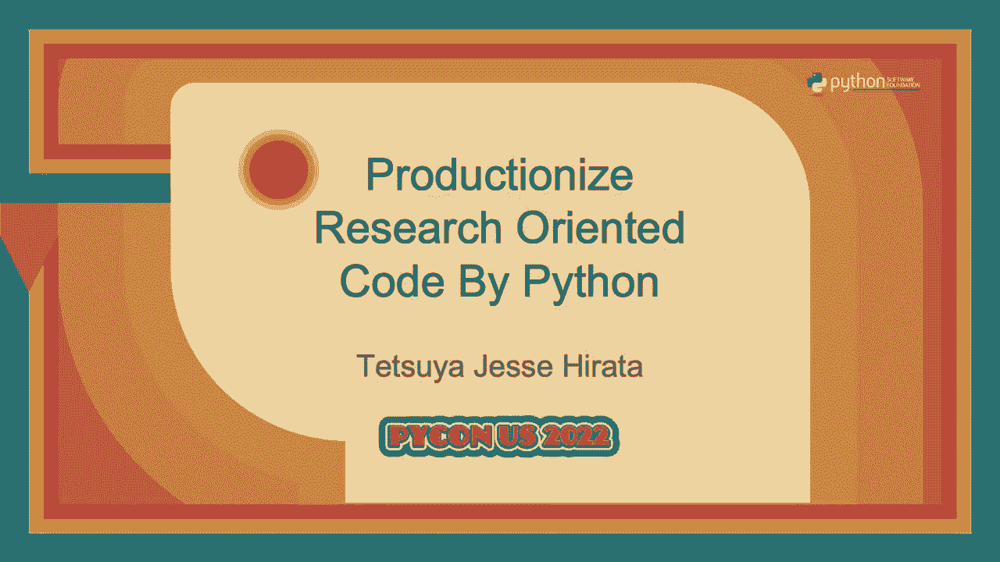

# P78：谈话 - Tetsuya Jesse Hirata_ 通过 Python 生产化研究导向代码 - VikingDen7 - BV1f8411Y7cP

大家好，欢迎回来。

让我们欢迎 Jess 进行关于通过 Python 生产化研究导向代码的演讲。Jess，交给你了。大家好，我是 Jesse。我在教育和科技行业工作了几年。在这个行业中，我谈论了 AI/ML 项目中数据科学与工程之间的问题。因此，基于我的经验，我将谈论生产化研究导向代码的过程。

使用 Python 编写代码。那么让我先分享背景。Python 工程师被分配到 AI/ML 项目，频繁面对以研究为导向的代码。因此，理解将研究导向代码生产化的过程可以帮助 AI/ML 项目更顺利地进行。目标受众可能是参与研发的 Python 工程师。

数据科学家，AI/ML 项目中的首要负责人或数据工程师。因此，三年前。我做了一个五分钟的课程，我们在 2019 年 Python 美国讨论了这个话题。所以，这也是我人生中的第一次演讲。因此，在这三年中，我发表了关于 Python 和数据科学主题的演讲。

从这个世界出发并发表了一本关于它们的书。然后，我今天回到 Python 美国。所以，这次演讲是基于我与数据科学家的三年项目经验，我在书中写的内容以及过去在 Python 上的演讲。因此，我提炼出了将研究导向代码转变为产品的四个步骤。这段代码。

将代码模块化，重构它们，然后使其成为产品。所以，就这样。非常简单。我将逐步解释每个步骤，更深入一些。因此，这四个步骤中的核心示例是基于项目反应理论编写的，也称为双参数逻辑回归，这是一种经典的统计模型，主要用于此。

使用教育心理学。该模型通常用于预测多少学生能正确回答，基于问题的特征。因此，在这次演讲中，我使用了基于该统计模型的代码，但模型不是这次演讲的主要主题。因此，我不会讨论模型本身。那么，让我们来看第一步。第一步是理解研究导向代码。

一般来说，研究导向代码是为了解决一些新问题而实现的，并将结果总结成论文。因此，研究导向代码的 AI 项目是主要由数据科学家或研究人员编写的，用于发现新知识。因此，发现新事物是编写代码时的最高优先级。现在。

这是一个使用代码撰写论文的常见生命周期。只有一个人开始修正数据，进行预处理，训练或计算数据，然后查看结果告诉你什么。如果结果呈现出新知识，就用它撰写论文并发表。因此，这段代码是该过程中编写的预处理代码。

这段代码似乎是一个长函数，适用于一组，但从上到下在视觉上是可访问的。此外，它可以轻松快速地编写。这并不是关键，但足以快速获得结果。所以，这是计算代码的示例。这段代码用于附加和使用数据框。

它能够轻松处理输入数据，并使用数据框获取输出数据。那么，生产级代码是什么呢？根据这篇论文，我们如何根据评分标准评估生产系统，CC 评分的 ML 系统从 0 到 12 分。因此，零分更像是转型前的研究导向代码。

从 7 到 12 的 ML 系统评分是产品在生产环境中部署几年后的结果。因此，我在这次演讲中建议的目标是产品评分从 5 到 6。这意味着合理测试，但大多数测试和程序可能是自动化的。因此，通过这些开发周期，深度产品质量得以提升。

我在一家公司担任唯一的通过工程师几年，但通常工程师与团队一起开发真实应用。因此，他们会构建架构、实现功能、测试审查和发布产品。他们会不断接收反馈，除非他们开发出没有错误的完美产品。

他们需要不断重复、发布和修复产品。因此，这意味着生产代码需要高可维护性、可扩展性和处理速度。这是我以前以泊松方式重构的代码示例。这段代码似乎比之前的代码短，并且复杂性较少。

设置复杂性。底部有两个简单函数。这段代码可以以更快和更简单的方式构建模型。因此，我确定了研究导向代码和生产代码之间的三种不同之处：不同的范围、不同的编码风格特征和不同的编码目标。

风格。因此，研究人员更专注于编写预处理代码和 MR 代码、计算代码。另一方面，工程师有责任编写生产级代码的整体部分。因此，研究导向代码似乎易于处理且在视觉上可追溯，而生产代码需要关注高并发速度和高可读性。

代码应该是可测试的和模块化的。这是因为研究人员更专注于寻找最有效和合适的机器学习模型，而工程师则有责任确保代码在服务器上正确且可靠地运行。那么，泊松工程师在研究导向代码方面首先应该做些什么呢？

首先要做的是什么？所以，深入编写代码之前，先阅读代码。左侧的图片是一个长行的 Jupyter 笔记本。我以前经常看到代码。好的。关于 Jupyter 笔记本，好的，我将继续。所以。在查看以研究为导向的代码后，像涂鸦一样做笔记以深入理解代码。

因此，准备模块化笔记有三种策略。我在阅读研究导向代码时快速做笔记。所以。第一种是使用商店写注释。第二种是添加注释。这两者都是事情。第三种，第三种是移动文档。那是什么呢？所以。

移动文档对高效理解代码非常有用。如果你使用 VS Code，请安装 VS Code 的实时共享扩展，以便共享代码并共同编辑。所以，在文档的片刻后，加入此 MOOP 的成员可以在同一环境中。

页面上不需要额外的维基和关于此代码的文档。此外。如果你和初级或高级人员一起工作，这对于入职培训是有益的。所以。这是部分带注释的研究导向代码的页面示例。所以。在阅读代码时，你是否从带注释的代码和备忘录中理解了代码？

这应该是为了更好地理解代码，而不仅仅是为了记住代码和执行操作。所以，对理解代码和熟悉代码的意识和态度将影响你做笔记的方式。而且，轻松引导到下一步。所以，下一步是通过使用级别对代码进行模块化。

研究导向的代码有三种类型的范围，例如准备代码、提议过程和计算数据。所以，基于你在之前步骤中写的注释，将代码分类为准备、提议处理代码和计算代码。所以。在将每个代码按级别分组后，我们可以将它们分解为函数并使其可测试。所以。

在对每个代码进行分组时，你会发现重复的代码和使用行或库的小错误。你可以在这一步修复它们。所以，然后我们可以得到像表格一样的模块化结果。所以。我们可以为每个研究导向代码页面获取模块。我们可以得到 preparation.py，其中具有访问数据库、清晰执行和加载输入数据的功能。

我们还可以获取 processing.py，它具有替换、调用离散数据的功能，过滤输入数据和重命名列。所以，最后，我们得到 prediction.py，它具有计算逻辑回归和输出结果的功能。所以，现在。因此，研究导向的代码变得松散耦合。

你可以为每个模块制作目录结构映射。这是一个用 Frask 开发的 API 目录结构示例。我发现这种目录结构非常简单且易于使用。左侧框中的目录结构包含 API 目录、模块目录和主目录。

根目录。位于 API 目录中的 Tandaini.py 模块在列表中具有根。每个端点的逻辑都在你 L 目录中每个模块中实现。因此，如果你在一个小团队中工作，成员为一、二、三并实施新模块，你只需将其添加到 L 目录的新端点中。如果团队成员数量增加。

你可以将每个模块拆分为各个版本，并共同工作，保持模块之间的松耦合。因此，我在幻灯片上写了 Frask 的 API 目录结构。Frask API 也可以具有类似的目录结构，但通常，映射的方式依赖于每个框架的特性以及你想要开发的内容。

现在我们到达重构准备代码和预处理代码的步骤。因此，在开始重构代码之前，我们应该粗略地编写一个测试代码，比如重构、票据风格、非购买风格和谷歌风格等。然后执行代码格式化工具，如 Brack 或 Alt-PEP8，并检查代码是否正确运行。

通过使用 Pytest 并利用 break8 检查编码风格的一致性。除此之外，类型注解也可以作为代码文档的一种选项。如果所有团队成员都熟悉类型提示的语法，你可以通过这三个过程进一步明确每段代码的需求。

然后我们终于可以开始重构代码了。现在我们应该重构代码的哪个部分？首先，关注准备代码和预后处理代码。通常，预测模块中使用 ML 库和数学库，因此重构的代码行数不会很多。因此，GPU 绑定处理的优化可以在确保之后再进行。

如果代码能够在服务器上正确运行，我们就有机会通过重构找出预测是否仍然无效。因此，我们正在尝试重构 IO。Preparation.py 中有一组代码，通过查询访问数据库或对象存储。

关于库的授予，让我分享几个我经常遇到的例子以及我如何简化它们。在探索性分析阶段，数据科学家并不确定哪些数据特别有用。如果你收到的第一个查询带有星号，你可以缩小从数据库提取的数据范围，这样会更快且成本更低，就像第二段代码一样。

在访问对象存储时，有时你可能需要花费很多行代码，仅仅是为了通过使用现成的库加载 CSV 文件。因此，我的一个建议是将代码封装起来，使其更简单。这样它就可以重用，并且成本效益高。因为这种代码即使是任何人编写的，其实都是相同的。每个人的 AI/MF 项目，例如数据工程师、Python 工程师和数据科学家，都会编写。

相似的代码。不仅你能够实现成员，其他团队的成员也可能正在编写相同的代码，仅仅是为了加载数据。因此，对于 Python 工程师来说，也可能有机会在内部产生重大影响。接下来我们来看 P-post 处理文件。用于分析的库和用于开发的库是不同的。一组待处理或后处理的数据代码往往包含各种类型的库和数据类型也会混合。

作为常见情况之一，P-post 处理数据有三种方式，比如 pandas、部分代码和秘密查询。常见的操作有过滤、重组、去重，且每种方式都有各自的数据。因此，大多数以研究为导向的代码需要使用 pandas、学校（即数据处理工具）或秘密查询，或两者兼而有之。

所以这三种方式有不同的特征。使用 pandas 的代码是迭代性的，以便于修复编写者的代码。只有 Python 的代码是可测试的，而秘密查询具有高处理性能和简单的语法。因此，这取决于架构和项目规模，但首先要考虑的是是否需要使用 pandas 和秘密查询。

并将其重构为只有 Python 的代码，以使其更具可测试性。如果用于计算的数据已经在 preparation.py 中提取和具体化，我们就不需要为一个人编写许多预处理代码。因此，最后一步是将其转化为产品，即 API。

那么，研究导向的代码可以生成什么产品呢？输出不是论文，而是产品，这意味着在服务器上工作一个季度，用户可以访问它。但是，产品的外观有几种。因此，快速让我缩小关于本次演讲中产品的范围。

所以产品可以是 Web 应用程序或 Web API。这是将研究导向的代码转化为产品的流程图示意图。在这个幻灯片中，POC 更像是产品，而 NRC 脚本主要用于业务报告。因此，在对数据导向项目有一个全面的本地概述时，两种类型的代码也可以在这个流程中共存，但本次演讲主要关注于研究导向的代码。

因此，这四个转换步骤可以在流程图中映射成这样的形式。从研究导向的代码到产品有四种转换模式。一种是从研究导向的代码中提取的模型或配置代码直接集成到 Web 应用中。第二种是我们可以基于研究导向的代码实现 API。

第三，当我们使用现成的 API 或第三方 API 时，我们通常将它们集成到网页应用程序中以供使用。最后，当模型或配置代码已经集成到网页应用程序中时，我们提取这部分代码并将其制作成供公众使用的 API。因此，这次演讲重点在于开发网页 API。为了将我们的研究导向代码转变为网页 API。

我们必须实现如何路由请求并检查请求，检查错误和路由点。让我分享一些在 URL 中实现请求路由的技巧。这个幻灯片左侧有一张输入数据表，用于两个参数。

逻辑回归。在右侧，有一张由模型计算得出的输出数据表。输入数据是关于学生是否正确回答每个问题。项目名称是问题的名称，项目 ID，每个问题的难度，科目，名称，考试名称和修正，都是二进制数据。另一方面。

输出数据是关于正确回答问题的概率。因此，这个 API 的作用是获取概率，以便我们可以将概率直接作为端点名称进行标记。根据最佳实践，我们的函数名称应该是动词或动词加名词。因此，这个函数的作用是计算结果或获取概率。

将计算结果或获取属性作为函数名称。因此，理解输入和输出的数据，即理解代码计算并生成的数据，是创建 API 的一个重要步骤。接下来是请求参数检查的实现。

我的建议是使用 JSON schema 实现请求参数检查。这个请求叫做 common，包含学生姓名和学生成绩作为参数。这个 JSON 文件是示例 JSON schema。在这个文件中，你可以定义需要检查哪些数据以及如何检查这些数据。

所以这个 gradle JSON 文件定义了学生姓名的数据类型为字符串，必须作为请求参数包含，而学生成绩的数据类型也被定义为字符串，必须包含为 true，字符的最大长度限制为 120，最小长度为一个字符。在这个示例中。

请求参数不允许为空。因此，根据 JSON schema，JSON validate.py 会检查请求参数，第一个验证函数检查 JSON schema 是否存在。第二个验证 schema 函数检查请求参数是否正确，基于前面的幻灯片定义的 JSON schema。为了执行这些函数。

将函数名称作为语法糖写在端点下方。与 JSON schema 相关的代码似乎很复杂，但大多数代码在这个幻灯片上都是这样的，因此你可以参考这个代码，我也可能在我的 Twitter 上分享幻灯片。因此，最后的实现是错误检查。在实现代码之前。

我们需要考虑每段代码的处理是否应该停止。因此，处理是否停止取决于服务规范。例如，如果你实现推荐系统，有时你不希望停止服务，即使准备代码未能加载某些数据，仍然要继续推荐。

这是 Frask 中错误 100 的示例。如果你停止处理，可以使用一个强制函数来检测错误。如果你不想停止处理，只需返回 JSON 格式的结果即可。所以实现起来很简单，但决定哪部分代码的处理应该停止或继续就困难得多。因此，我建议在此之前与产品经理或 QA 团队讨论服务规范。

开始实施错误检查。好的，让我快速总结一下从研究或链接代码到产品的完整步骤转变。第一件事是理解代码的特性，并通过做笔记来弄清楚它是如何工作的。然后，根据代码文档对代码进行模块化，标记代码为准备、存储库处理和计算。第三步是通过简化输入输出和预处理代码来重构准备代码。

编码风格。所以最后，将其变成一个由请求路由、请求参数检查和错误检查组成的 API。因此，在部署产品后，我们需要通过进行负载测试来优化速度和状态稳定性。因此，有一些有用的负载测试工具，如 Load cost 和 Vegeta。

Load cost 是一个基于 Python 的负载测试工具，可以通过 Python 代码管理负载测试场景，并通过 GUI 监控服务器上的负载。Vegeta 是一个基于 Go 的 HTTP 负载测试工具，可以作为命令行工具和库使用。如果你在寻找轻量级负载测试工具。

Vegeta 可以是一个选项。你可以对你的代码进行 Vegeta 攻击。因此，通过使用这些负载测试工具，如果我们发现性能不够好，我们可以对 Web 服务器和应用程序服务器进行参数调整，并考虑端到端的同步。如果没有改进，再次思考架构。

基础设施或使用不同语言重构代码。因此，再次重申，从研究导向代码到产品的四个步骤转变非常简单。理解代码、模块化代码、重构它们，然后在部署代码后将其变成产品，检查性能。谢谢。[掌声]。

