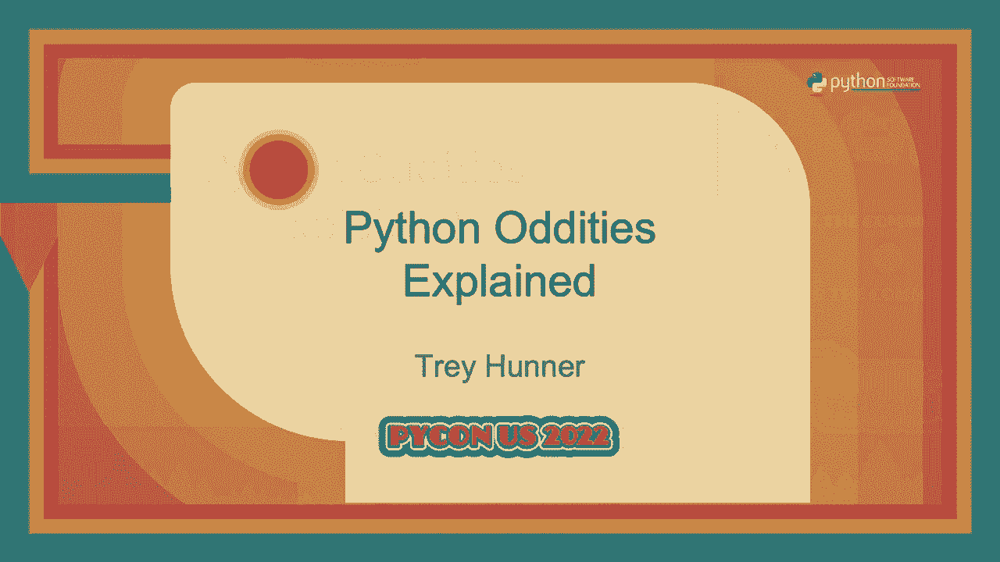

# Python 奇异性解释：P79：演讲 - Trey Hunner




## 概述

在本教程中，我们将跟随 Trey Hunner 的演讲，深入探讨 Python 语言中一些看似奇怪或令人困惑的行为。我们将从变量作用域和赋值开始，逐步深入到可变性、鸭子类型以及增强赋值运算符（如 `+=`）的微妙之处。通过学习这些“奇异性”，你将能更好地理解 Python 的设计哲学，并写出更健壮、更符合 Python 风格的代码。

---

## 变量与作用域

上一节我们介绍了本教程的主题，本节中我们来看看 Python 中变量和作用域的一些独特行为。

### 循环中的变量泄漏

在 Python 中，`for` 循环没有自己独立的作用域。这意味着在循环内部创建的变量在循环结束后仍然存在。

```python
x = 0
numbers = [1, 2, 3, 4, 5, 6, 7, 8]
for x in numbers:
    y = x * x
print(y)  # 输出：64
print(x)  # 输出：8
```

循环结束后，变量 `y` 保留了最后一次迭代的值（64），而循环变量 `x` 也“泄漏”到了外部作用域，其值为列表的最后一个元素（8）。

### 列表推导式的作用域

与 `for` 循环不同，在 Python 3 中，列表推导式拥有自己的作用域。循环变量不会泄漏到外部。

```python
x = 0
numbers = [1, 2, 3, 4, 5, 6, 7, 8]
squares = [x*x for x in numbers]
print(x)  # 输出：0
```

执行列表推导式后，外部的变量 `x` 仍然是 0，没有被内部的循环变量覆盖。

### 全局变量与局部变量

在函数内部，Python 通过赋值操作来区分局部变量和全局变量。一旦对变量进行赋值，Python 就会将其视为局部变量。

```python
numbers = [1, 2, 3]

def add_numbers(more_numbers):
    numbers += more_numbers  # 这会引发 UnboundLocalError 错误

add_numbers([4, 5, 6])
```

上述代码会引发错误，因为 `+=` 操作符同时包含读取和赋值。Python 在解析函数时，发现 `numbers` 被赋值，因此将其标记为局部变量。但在执行 `+=` 时，它试图先读取这个尚未定义的局部变量，从而导致错误。

以下是解决此问题的正确方法：

```python
numbers = [1, 2, 3]

def add_numbers(more_numbers):
    # 明确声明使用全局变量
    global numbers
    numbers += more_numbers

add_numbers([4, 5, 6])
print(numbers)  # 输出：[1, 2, 3, 4, 5, 6]
```

**核心概念**：在 Python 中，赋值语句（`=`）总是改变**变量**（即变量指向的对象）。而像 `list.append()` 这样的方法则是改变**对象**本身。

---

## 可变性与对象引用

上一节我们探讨了变量作用域的规则，本节中我们来看看可变性以及变量如何“指向”对象。

### 变量是引用

在 Python 中，变量并不“存储”对象，而是“指向”或“引用”对象。多个变量可以指向同一个对象。

```python
numbers = [1, 2, 3]
my_list = numbers
my_list.append(4)
print(numbers)  # 输出：[1, 2, 3, 4]
```

`numbers` 和 `my_list` 指向同一个列表对象。通过 `my_list` 修改列表，通过 `numbers` 访问时也会看到变化。

### 元组的“不可变性”

元组本身是不可变的，意味着你不能改变元组包含的引用。但是，如果元组包含一个可变对象（如列表），你仍然可以改变那个对象。

```python
my_tuple = ([1, 2], 3)
my_tuple[0].append(99)
print(my_tuple)  # 输出：([1, 2, 99], 3)
```

我们没有改变元组 `my_tuple` 本身（它仍然包含对同一个列表和整数 3 的引用），但我们改变了列表对象的内容。

### 无限递归数据结构

由于变量和数据结构存储的是引用，因此可以创建指向自身的结构。

```python
weird_list = []
weird_list.append(weird_list)
print(weird_list)  # 输出：[[...]]
```

`weird_list` 包含一个对其自身的引用。Python 的 REPL 使用 `[...]` 来表示这种递归，以避免无限打印。

**核心概念**：Python 中的“改变”有两种含义：
1.  **改变变量**：使用赋值语句（`=`）让变量指向一个新对象。公式：`变量 = 新对象`
2.  **改变对象**：调用对象的方法（如 `list.append()`）来修改对象本身的状态。

---

## 鸭子类型与操作符行为

上一节我们理解了变量和对象的引用关系，本节中我们来看看 Python 如何通过“鸭子类型”来处理不同类型的对象，以及 `+=` 操作符的奇怪之处。

### 鸭子类型

Python 不严格检查对象的类型，而是检查对象的行为（它有什么方法，能做什么）。这就是“鸭子类型”：如果一个东西走路像鸭子，叫声像鸭子，那么我们就可以把它当作鸭子。

例如，`list.extend()` 方法接受任何“可迭代对象”，而不仅仅是列表。

```python
my_list = [1, 2]
my_list.extend((3, 4))  # 接受元组
my_list.extend(“ab”)     # 接受字符串（会添加字符 ‘a’, ‘b’）
print(my_list)  # 输出：[1, 2, 3, 4, ‘a’, ‘b’]
```

### `+=` 操作符的歧义

`+=` 操作符（就地加法）的行为取决于左侧对象的类型。

*   **对于可变对象（如列表）**：`+=` 会**改变原对象**，相当于 `list.extend()`。
    ```python
    a = [1, 2]
    b = a
    a += [3, 4]
    print(a)  # 输出：[1, 2, 3, 4]
    print(b)  # 输出：[1, 2, 3, 4] (b 和 a 指向同一个被修改的列表)
    ```
*   **对于不可变对象（如元组、字符串、整数）**：`+=` 会**创建一个新对象**，然后让变量指向它。相当于 `a = a + b`。
    ```python
    a = (1, 2)
    b = a
    a += (3, 4)
    print(a)  # 输出：(1, 2, 3, 4)
    print(b)  # 输出：(1, 2) (b 仍然指向旧的元组)
    ```

因此，在 Python 中，`a += b` **并不总是等价于** `a = a + b`。对于列表，前者改变原对象，后者创建新对象。

### 一个极端的例子

这个例子展示了 `+=` 在复杂情况下的行为：

```python
my_tuple = ([1, 2], )
try:
    my_tuple[0] += [3, 4]
except TypeError as e:
    print(f“发生错误：{e}”)
print(f“元组现在是：{my_tuple}”)  # 输出：([1, 2, 3, 4], )
```

这里发生了两件事：
1.  列表的 `__iadd__` 方法（即 `+=` 的内部实现）成功执行，将 `[3, 4]` 添加到了元组内的列表中。
2.  随后，Python 尝试执行赋值操作 `my_tuple[0] = ...`，但由于元组不可变，这一步失败了并抛出 `TypeError`。

所以，**列表被修改了，但赋值操作失败了**。这在实际编程中很少遇到，但它揭示了 `+=` 是“先尝试就地操作，再执行赋值”的两步过程。

**核心概念**：在 Python 中，应关注对象的**行为**（如是否可迭代、可调用），而非其具体**类型**。`+=` 等增强赋值操作符的行为是对象可自定义的，对于可变和不可变对象有不同的默认实现。

---

## 总结

在本教程中，我们一起学习了 Python 中几个关键的“奇异性”：


1.  **作用域规则**：`for` 循环变量会泄漏到外部作用域，而列表推导式则不会。函数内的赋值默认创建局部变量。
2.  **变量与对象**：变量是对象的引用。赋值改变引用，方法调用改变对象本身。理解这一点是理解许多 Python 行为的关键。
3.  **鸭子类型**：Python 通过行为而非严格类型来使用对象。这使得 API 更灵活，但也要求开发者清楚对象应具备的行为。
4.  **`+=` 操作符**：它的行为取决于对象的可变性。对可变对象是就地修改，对不可变对象是创建新对象。它并不总是等价于 `a = a + b`。


Python 的这些设计选择，虽然有时看起来奇怪，但大多有其内在一致性和实用性。当你在代码中遇到令人困惑的行为时，不妨深入探究其背后的原理，这往往是加深对 Python 理解的绝佳机会。记住，尝试打破事物并观察其反应，是学习编程语言的有效方式。