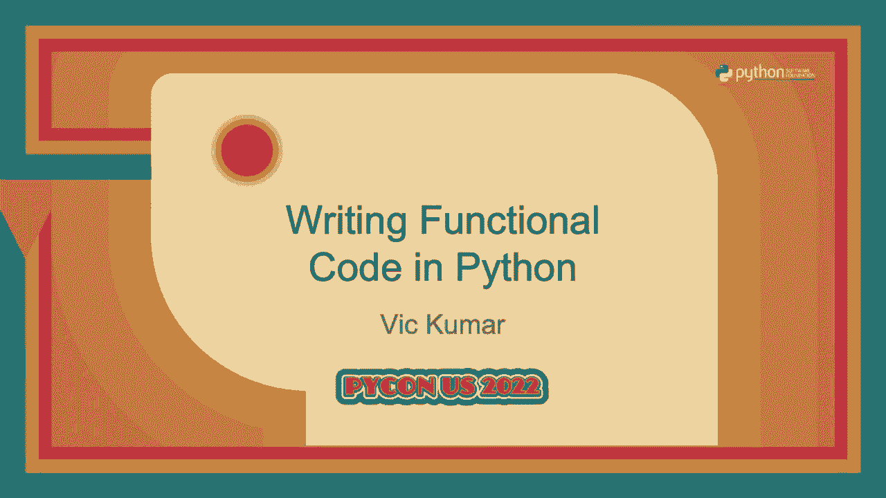
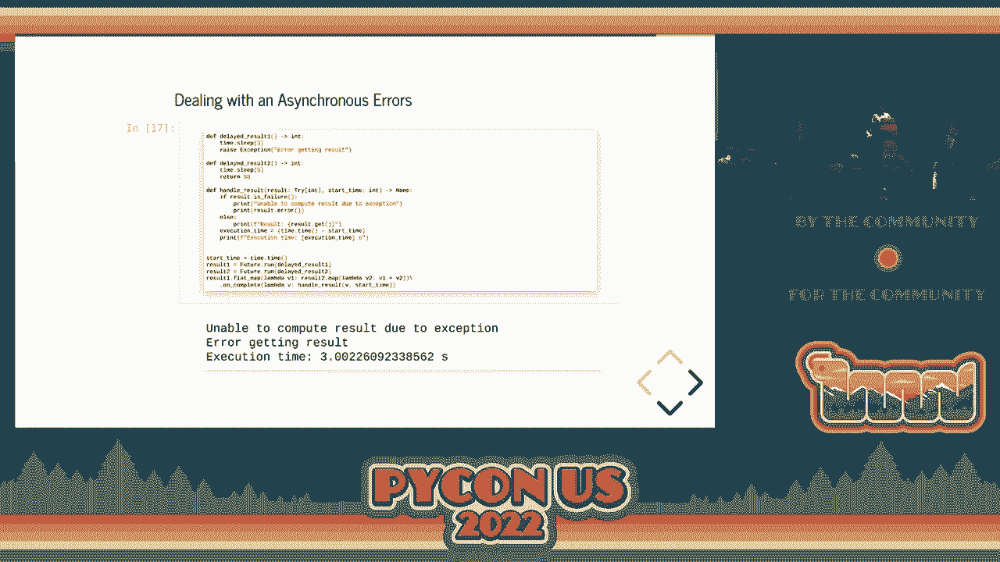
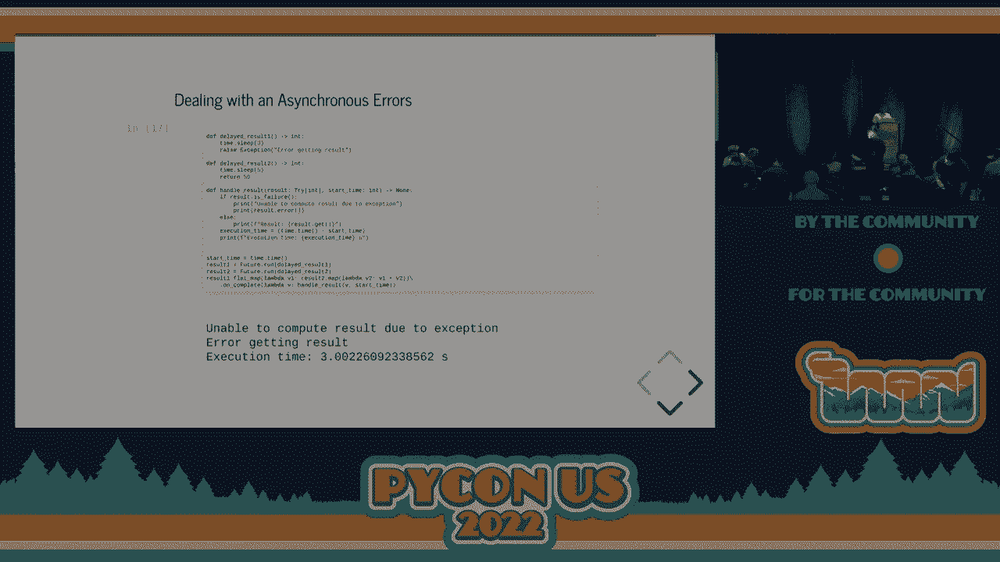

# P80：演讲 - Vic Kumar_ 用 Python 编写函数式代码 - VikingDen7 - BV1f8411Y7cP

欢迎大家。

希望大家都能听见我。 欢迎来到 2022 年盐湖城 PyCon 的下午会议。 在我开始整个演示之前，所有内容都在我的 GitHub 上。 如果你在运行 Jupyter notebook，你可以运行一个 Jupyter notebook。 PDF 幻灯片也在上面。 我的 GitHub 是 Vic Kumar，1981。 好吧，关于我的一点点介绍。我在 Excela 工作。

我们是一家位于弗吉尼亚州阿灵顿的技术咨询公司。 我们做三件人们愿意付钱的事情：现代软件交付、人工智能和分析以及敏捷转型。 网站 excela.com 就在那。 我们目前有数据工程师和数据科学家的职位空缺。

所以请随意访问网站或之后联系我。对吧。 我目前参与的一些项目可以访问 code.io。 这有点像是泄漏代码和远程面试的结合。再次提到，我们在多种语言中都有 Jupyter notebook 集成。

所以如果你想在 Jupyter 内核中尝试 Rust，欢迎查看那个网站。 如果你使用注册代码 PyCon 2022（小写），你可以获得免费的延长订阅。 是的。 我还在 HBCU Digital 上工作，这是一个为历史悠久的黑人大学和大学提供的 ESPN 应用程序。

我们在努力增加许多实时内容。 我们在 Roku、Apple TV 以及移动应用上都有。 好吧，关于我的闲聊够了。 让我们聊聊函数式编程。 在过去的五、六年里，我相信我们都听说过、玩过、尝试过这些新的技术。我们就称它们为“新来的孩子”吧。

这些较新的语言中，我们有 React.js 和 JavaScript。 针对所有.NET 开发者，有 F#。 显然，Scala 和 Kotlin 在 JVM 中依然强劲。 对于 iOS 开发，我们现在有 Swift。 所以你不必再写 Objective C。 还有更多传统的函数式编程语言。

仍有编程语言，如 Haskell 或 OCaml。因此，函数式编程背后的理念是相当简单的理念，但却有深远的影响，这也是我喜欢它的原因。 函数式编程的理念是我们将施加一个限制或约束。

我们将尝试限制我们的代码，设定一个条件，只用纯函数编写代码。 那么什么是纯函数呢？

纯函数是指没有副作用的函数。 所以下一个逻辑问题就是，副作用是什么呢？ 所以副作用是指任何不是纯计算的内容。 如果你改变变量的状态，如果你就地修改数据结构，如果你在代码中抛出异常，或者处理任何类型的 IO、控制台、网络。

这些是副作用。另一种看待或思考这个问题的方式是，一个函数有输入和输出。在这种普遍存在的情况下，不仅仅是 Python，而是编程的一般原则，函数有输入和输出。如果我们在这个函数内部做任何与输入或输出没有明确关系的事情，那么根据定义这就是副作用。

函数的签名中并没有明确说明它正在做的事情。所以这就是副作用背后的想法。对吧？好的。一个纯函数具有引用透明性的特性。因此，当我们谈论副作用和什么是纯函数时，这有点像某种东西。

我们可以证明。这就像数学一样。我们可以一步一步地分析我无法在这里阐述引用透明性的定义。但有一种更简单的方式来思考这个问题。所以，是的。让我们来一些编码示例，以便更好地理解这个问题。所以我这里有一个函数。它只是在添加一组数字。

所以我们将开始创建一个变量 sum。我们将其赋值为零。我们会遍历列表中的每一项，并将数字相加，我们可以看到。当我们相加这些数字时，得到了正确的输出。但如果我回想起代数课或数学课，我知道这就是为什么每个人都在这里。

因为他们想回到代数课。当我说像 x 等于一，y 等于二，x 加 y 等于多少？我会告诉你是三，因为在我脑海中我把 x 替换为值一，把 y 替换为值二，1 加 2 等于 3。所以在这第一段代码中，我说 sum 等于零，当你告诉我 sum 时。

等于零，那么从数学上讲，如果我在任何表达式的右侧使用和，它应该产生相同的结果。所以让我们看看这如何运作。那么，我将 sum 等于 sum 加 n 替换为 sum 等于零加 n，因为你告诉我 sum 等于零。正如你所看到的，它并没有给出相同的答案。

它实际上给出了一个不正确的答案，因为它遍历了列表。它到达了列表中的最后一个项目，然后说好，sum 等于八加零，所以它等于八。但这与我们之前得到的值不同。尽管这段代码看起来非常无害，非常简单，我们仍然可以。

看到或许有一些我们不喜欢的地方。我可以很容易想象我们尝试相加的列表可能会变得非常非常大。因此现在我们可能会想，好吧，让我们尝试应用一些并发。让我们添加一些线程，并使用线程运行相同的代码块。

显然，我们可以将列表分区，使得线程在列表的不同部分上操作。但如果我们到达这一行求和等于求和加 n，并且我们进行了这种变异，我们不能让两个线程同时修改变量求和。你必须做一些像锁、互斥量的事情，某种锁或也许是原子操作。

但无论如何，如果我们想让这个多线程，我们必须以并发的方式处理这个问题。所以真正的问题是可变状态的求和。我们想要摆脱这种可变状态，因为正如我们在前一张幻灯片中看到的，变异是一种副作用，我们可以看到这个函数不是引用透明的。

我们用零替代了求和的值。它没有返回相同的结果。那么好吧，让我们尝试摆脱可变状态的求和。有一些相当简单的方法可以做到这一点。第一种方法是使用递归。如果列表只有一个项目，就返回那个项目，否则返回第一个项目加上求和。

列表的其余部分。我们可以看到这给我们带来了相同的值，并且在函数内部没有可变状态的后果。好的。我们可以处理同一问题的第二种方法是使用我们称之为高阶函数。高阶函数是一个将函数作为参数传入或将函数作为输出返回的函数。因此，在这里我们将从内部工具导入一个很酷的函数叫做 reduce。

而内部工具的第一个参数显然是一个 lambda。它从列表中获取两个元素并返回一个项目，然后递归地将其应用到列表中。因此，这个概念将在接下来的几张幻灯片中再次出现。在函数式编程中，我们喜欢使用高阶函数来抽象化诸如。

不必变更状态。因此，我们看到这里有两种方法可以摆脱可变状态。这两个例子 add numbers two 和 add numbers three 是引用透明的，而上面的那个我们知道它不是。我们已经证明了这不是引用透明的，因此那个函数是。

在功能上是不纯的。它不遵循我们在数学中喜欢的属性和规律。这正是这个前提与函数式编程的关系。好了，现在我们基本接受了使用高阶函数的想法。我做了一件事情。我不知道这是好事还是坏事，但我添加了一些类。

这是一个可以通过 pip 安装的库，pip install pi effects。这是我首次尝试介绍一些在像 Haskell 这样的语言中，或者在 Scala 中绝对会看到的类。因此，今天我们讨论的类型是 option，try 和 either。

实际上，我们不会涵盖这两者，但我们将讨论选项，尝试功能。库中确实有这两者，但今天我们不打算覆盖它们。所以，让我们来谈谈抽象某些行为，一些常见的行为。我们将通过使用类来处理这个问题。

所以选项类是一个父类，或者说是一种接口，它有两个子类的实际实现。其中一个叫做 some，另一个叫做 empty。如果有值，我们将其封装在 some 类中，否则就是 empty。和往常一样，我们先创建一个示例数据模型，便于进行一些操作。

这里的想法是我们将创建一些类。我们将有一个人，一个人将有一个联系人，而联系人将有一个名字。名字具有名和姓的属性。这就像是一个嵌套的层次类结构。

假设给定一个人，我想找出联系人号码一的名字。我使用数据类，然后我们不必担心获取函数，获取姓氏、获取名字。这些只是包装器，我们将使用它们，以便看到选项类是如何运作的。但首先我们将直接使用属性。

我们的示例是给定一个人，我们想找出该人的联系人号码一的名字。我们创建一个类似于人对象的东西，你可以看到我们将使用 if 语句。因此，沿途任何东西都有可能是空的。这就是我们所要处理的。

我们有这个嵌套的层次结构。我们想在层次结构中获取某个东西。但在这个过程中，我们必须进行检查，因为某些东西可能没有值。它可能是空的，这将导致问题。因此，我们必须检查是否有这个人，如果这个人的联系人一存在，以及他们是否有名字，然后返回这个值，否则返回 none。

对吗？这可能会变得更加复杂。我们的类结构越是嵌套和层级化，所需的分支和条件逻辑就越复杂，以便从这个类转到那个类。好的，让我们看看选项类是如何工作的。好的，这就是函数式纯粹主义者喜欢的地方。

在第二个示例中，我们实际上没有任何分支逻辑，这些都被抽象化处理，通过一个叫做 flat map 的操作。flat map 是一种将输入链接或组合在一起的方法，你会在其他类中看到相同的技术。它将一个函数的输出作为下一个函数的输入。

功能性同行真正喜欢这种函数的地方是，如你所见，下面的第二个函数我们获得一个输入，应用一系列函数，并得到一个输出。对一个功能性的人来说，这就是每个程序应该始终工作的方式。我们获取一个输入，应用一系列函数，得到一个输出。它完成的功能与第一个函数相同。

我们可以对这两个函数进行的另一种观察是，第一个函数尽管告诉我它返回一个字符串，但在函数签名中并没有告诉我这个字符串可能是空的。在下面的函数中，我可以看到它返回一个字符串的选项，因此调用者可以了解这一点。

方法现在知道返回的这个值可能是空的，他们被迫处理空值的情况。在选项类的情况下，你有一些获取或其他的功能。因此，如果没有值，你可以在那里提供一个值。所有的函数，如 get contact，contact.get name，name.get first name。如果我上移一张幻灯片。

这些函数只是简单的返回一个选项的函数。而这正是扁平映射为我们做的事情。它只是将选项连接在一起，这样我们就可以以一种从左到右的方式重写这个逻辑。第二个 API 也是我们所称的流式 API。它的读取方式与英语相同，从左到右。

你不一定是用 if 语句和 while 循环来从内到外地阅读英语，而是从左到右地阅读。因此，我们可以享受到链接操作的好处，并看到流式 API 风格。这就是我们如何使用选项类处理空值。第二个例子将处理异常，因为我们讨论过。

之前的例子是一个异常，就像我们与求和所做的例子一样，我们改变了那个函数是非纯的。所以每次我在代码中引发异常时，我也面临着同样的问题，我的代码不是引用透明的，函数也不是纯的。因此，我们处理选项的方式类似，选项是一个父类。

两个子类来处理我们想要的行为。我们有一个类叫做 try。这个 try 类也是一个父类。try 类有两个子类，第一个叫做 success，另一个叫做 failure。所以 success 封装了没有错误发生的成功值。

failure 封装了在某个事件中可能被抛出的异常，比如一个接受。因此，让我们在这里举一个可能失败的例子。它可能出错。因此，我们将查看 JSON 解析的示例。我们有两个字符串，第一个字符串是可以解析的。它会解析成我们的模型。是正确的。

我故意在第二个字符串中犯了一个错误。“没有名为 `first name` 的属性”是错误的。所以当我尝试解析我的 JSON 并将其加载到我的模型中时，它将引发一个错误。它将引发一个异常。所以让我们看看如何以非常简单的方式做到这一点。所以我们有 `parse person`。我们将进行 `JSON loads`。我们将其加载到一个字典中。

我们将检查一些属性。从那个人那里，我们将解析联系，并从那个联系中解析名字。那里的 `parse name` 函数，我们可以看到除了它引发了类型错误。我无法反序列化这个名字。因此，这个函数并不纯粹。同样，就像我们在选项中看到的那样。

当我只看 `parse name` 的签名时，它接收字典作为输入并返回一个名字。这个函数的签名没有告诉我这可能会抛出或引发一个异常。也许在文档里有这样的说明。但我认为我们可以让它更明确。所以那里的例子是有效的。

它从我们的 JSON 字符串中获取第一个联系人的名字。如果你回去看，哦，抱歉。爱丽丝是正确的名字。所以它有效。但这个函数确实引发了一个异常，可能没有我们想要的那么明确。所以我们会举一个例子。哦，是的。我忘了这一点。

所以如果我们解析第二个字符串（这是无效的），就会发生这种情况，我们会得到一个错误，指出“没有名为 `first name` 的属性”是错误的。因此，当我们尝试解析名字时，可以看到我们得到了这个异常，因为第二个 JSON 对于我们的模型来说并不是一个好的 JSON。对吧。所以让我们试着用 `try` 类重写这个。

所以这里的 `parse name` 函数，我们将使用 `try.of`，它将封装一个可调用对象。如果那个可调用对象成功，它将返回一个成功。如果可调用对象失败，它将返回一个失败。在函数的签名中，我们可以看到，好的，它接收相同的字典作为输入。但是返回值不仅仅是一个名字。

这是一个名称的尝试。所以看到那段代码的人，阅读那段代码的人可以看到这个函数可能会失败。它可能成功也可能失败。就像我们在选项类中看到的那样，我们将不得不处理失败的情况。哦，抱歉。好的。所以我们将继续测试这个函数。哦，是的。

抱歉。我在这上面忘了一件事。我们在 `try` 类中处理失败的方式与我们在选项类中处理失败的方式非常相似。在选项类中，当它是空的时候，我们应用了一个叫做 `get or else` 的方法。因此，当它为空时，我们说 `get or else` 做这个。而我们也可以用 `try` 来做到这一点。但在这种情况下，我们将使用 `or else supply`。

它像**get or else**，但接受一个可调用对象作为其参数。因此在这种情况下。我们将调用一个名为**handle parse error**的函数，该函数将创建联系人。但它只会警告我们无法解析这一点。因此，如果我们有很多 JSON 要解析，我们希望收到警告。

我们想知道从未发生过的事情。我们可能希望继续，你知道，继续解析。即使有一些错误或问题。所以，是的，这些都是测试。那么第一个人。这是一个很好的字符串。你可以看到它确实和我们之前看到的完全一样，没有抛出异常。它得到了第一个名字，**爱丽丝**。然后在第二个中，它告诉我们，哦。

在解析时出错，你知道，联系人，联系人一。它给了我们第二个人，并且说联系人名称是已知的。因此，这有点像我们看到的选项。我们尝试更明确地处理和处理错误，使用**try**类。

所以我们提取了空的行为。我们围绕**try-except**块的行为进行了抽象。我们将简要触及的第三类是如何使用相同的概念来处理并发和未来。我相信在许多不同的语言中都有未来。**promise**。未来的工作方式与选项和尝试略有不同。

并且没有显式的父类和子类。未来的作用是未来将开始，并且它将没有值。该值尚未完成。对于某些时间段。未来最终将像**try**那样表现。一旦未来完成。

要么是来自未来的成功值，要么是来自同一未来的失败值，其中封装了你的可抛出异常。所以让我们看看这个是如何工作的。我们可以做的最简单的事情就是在新的上下文中异步运行某些内容。

线程，这个用**特征超越**完成。因此我们这里有一个非常简单的函数。等待三秒钟，然后返回值 100。所以我们将检查一些事情。我们要做的第一件事是对整个过程进行计时。我们将获得值后，只需做一个小的映射语句。

在结果值上加一。我们将立即检查未来是否完成。它不会完成，因为它刚刚开始，并且有三秒钟的等待。然后我们将再等四秒。我们将再次检查未来是否完成，此时为真。完成等于真。我们将打印出那种值的结果，即 101，并且我们得到了总体。

执行时间大约是四秒。里面的睡眠时间使其大约为四秒。所以是的， pretty simple 的示例。我们可以很容易地使用未来在新线程中运行某些东西。好的。但结合两个东西呢？看起来我们看到扁平映射来组合我们的选项和尝试。我们可以做同样的高阶函数来组合特征。

所以这里有两个线程。一个将睡眠三秒，返回 100。另一个将睡眠五秒，返回值 50，然后我们想做的是将这两个结果相加，对吗？所以你可以看到结果一我们称之为特征执行，结果二我们称之为未来，第二个函数，然后我们说结果一我们扁平映射到结果二，并将它们相加。

我们添加了一些回调。所以这里的回调做的事情与我们在更具命令性的示例中所做的相同。我们试图计算整体运行时间。所以在这个示例中，一个线程用了三秒，另一个线程用了五秒。两个线程并行执行。一旦较长的线程完成，它就结合了结果。

我们得到了 150 的值。执行时间大约是五秒。那么如果出了什么问题呢？

所以在这个示例中，我们将处理一个错误。第一个函数实际上会抛出一个异常，我们知道这不是纯的。但在这个示例中，我们还是会这样做，看看会发生什么。在我们的回调中，我们有相同的代码来扁平映射和映射，但在我们的回调中。因为一旦特征完成，它的行为就像一个尝试。

它有一个成功和一个失败，我们可以检查它。所以在我这个示例的回调中，我简单地检查结果是失败还是成功，并分别处理这两种用例。所以在这个示例中，它再次并行运行了三秒线程和。

五秒的线程，三秒的线程失败了，所以它实际上没有完成。五秒的线程一直在运行，但在计算的目的上，它实际上在三秒内完成了，因为它遇到了错误并报错。因此我们有这种基于特征的回调风格，可以用来检查值。

一旦它完成，无论成功还是失败。好的，但我会跳到几张幻灯片。我们在这个示例中使用扁平映射和映射理解组合特征。我们可以很容易地看到，好吧，所以这里有两个线程在运行，两个结果。我们关心的异步计算的值，但如果有三个呢？

或者四个、五个或更多的结果，这可能会让你知道如何进行扁平映射，反复进行扁平映射，这可能会变得有点复杂。实际上，所以当我运行特性时，我会得到一个特性值，然后又得到另一个特性值，再然后是另一个特性值，最终我会得到一个特性的值列表。

而我真正想做的是，我想反转这个，而不是拥有一个特性值列表，我希望有一个单一的特性和一个值列表，这些值结合了我所有威胁的结果。在像 Scala 这样的语言中，这个函数被称为 future.trovert。它反转这两个东西，所以它将一个特性列表转化为一个特性列表。

所以让我们来看一下它是如何工作的，我们有结果一，它与特性输出运行延迟相同，结果一特性输出到结果二，在这里我们调用 future.trovert，并提供特性列表，然后同样的事情，我们只是调用完成处理程序来获取执行时间，类似于我们的最终结果，然后打印出来。

所以 future.trovert 我们可以看到，如果我们处理的是许多不同类型的计算结果，我们可以迅速将一个特性列表反转为一个单一列表的特性。所以这里的一些关键要点是，当我们使用副作用时，我们可以看到有时我们的代码没有我们希望的那么明确。

如果函数是更具引用透明性的，那么它会使代码更难以推理。如果它们是纯的，那么它使我们能够以更局部的方式推理我们的函数，并且它为我们使用高阶函数和抽象提供了机会，以处理我们代码中可能存在的常见行为，我们看到了这些例子。

处理空值、并发和异常，所有这些例子正如你所看到的，就像英语一样，从左到右阅读，我们不再编写嵌套的 if 语句和更难阅读的内容，一切都是从左到右阅读，我们获取输入值，应用一些函数，然后得到一个。

返回值，这就是函数式程序员如何看待世界，如何看待程序，以及他们希望每个程序都以某种方式运行，而这就是我想说的，谢谢大家，这是我的推特账号 vikumar1981，这是我的 GitHub 页面。谢谢 WIC 带来的精彩演讲，现在我想打开讨论。

进行讨论并邀请观众提问。谢谢。谢谢。好，准时。有没有关于 WIC 的问题？好的。谢谢。[音乐]，在未来的例子中，为什么是一个整数列表而不是一个尝试事件列表？

是的。好的，所以在回调中，这只是一个单一的尝试事件，所以你实际上可能是对的。也许我会查看我的幻灯片，这个问题很好，你可能是对的，因为它是可选的静态类型，也许我确实搞错了可选注解。让我快速检查一下我的幻灯片。

我问这个的原因是之前的例子没有遍历，只有尝试，所以我在想。好的，这个例子对吧？嗯？与之前的例子相比，只有结果作为尝试。哦，对，确实如此，所以处理结果接受一个列表，而这里的处理结果接受一个单一的整数的尝试。是的。

好的，不，这可能是幻灯片上的错误，实际上你是对的，它应该是一个列表事件的尝试，因为你可以检查成功和失败，这是列表事件的尝试，我可能应该更正这个。那么尝试列表和列表的尝试之间有什么区别呢？好的，区别是什么？嗯，所以列表尝试事件有点难，因为每个单独的尝试现在。

必须检查成功和失败，但如果你尝试列表事件，我可以检查整个事情的成功和失败。到底是全部成功了，还是全部失败了？所以反转过来就变得有点有用，因为现在我可以直接检查整个事情。

好的，这有意义吗？是的，确实有意义，谢谢。[BLANK_AUDIO]。

