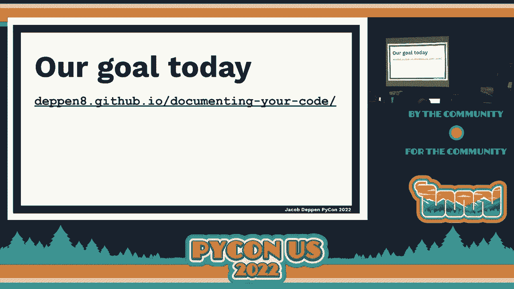
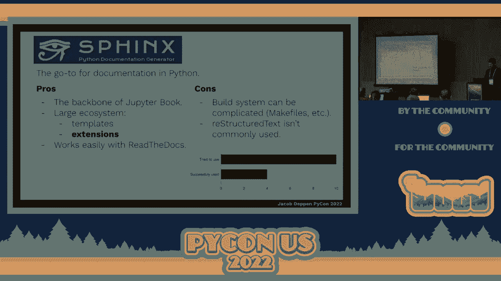
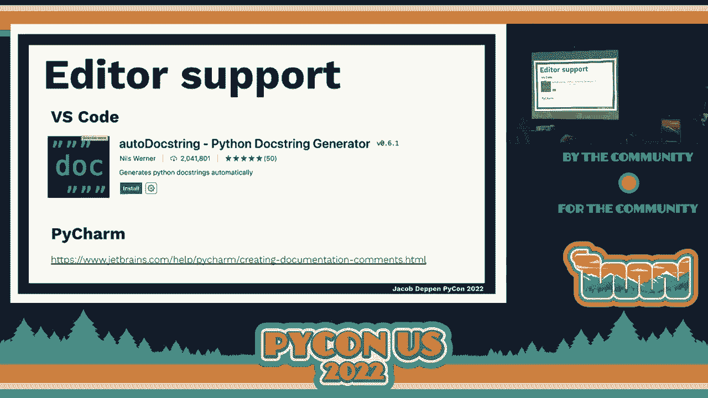
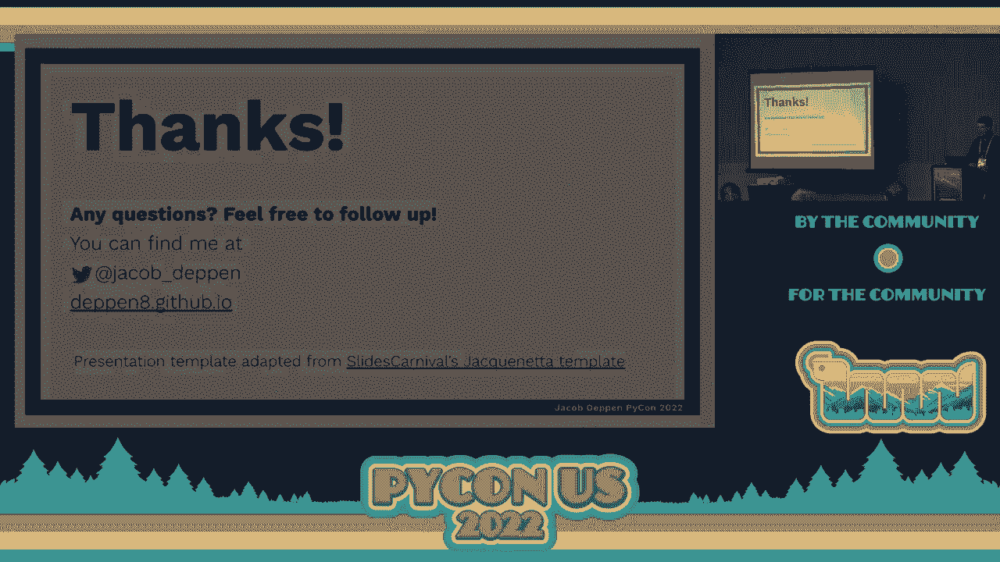
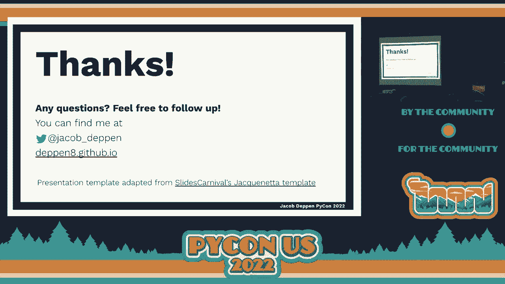

# P86：教程 - Jacob Deppen_ 从文档字符串到自动构建记录你的代码 - VikingDen7 - BV1f8411Y7cP

好的，时间到了？

时间到了。欢迎大家。感谢大家的到来。我们在这里参加从 Duckstrings 到自动构建的代码文档教程。这就像大学的第一天。每个人都在正确的房间里。无需走到走廊。好的，欢迎。如果你没有获取到链接，我们会再次提到它们。因此，如果你还没有链接，不用担心。我是 Jacob Deppin。

如果你愿意，可以在 Twitter 上找到我，看看我关于孩子和迪士尼等内容的推文，还有数据科学的内容。有时我们会谈论文档。感谢所有填写我发的调查的人。我们在这方面得到了很好的参与，这对我理解你们的背景非常有帮助。

在演讲中，我能够对某些内容进行一些重构。希望这能满足大家的需求。我们可以一起成功地进行这个会议。我希望这足够开放，以便你们可以在过程中提问。我很乐意被打断。如果我在流畅地讲述，我会告诉你们稍等一下。这完全没问题。

我现在要发一些便利贴。这是我喜欢做的事情。有人参加过 Carpentries 研讨会吗？软件木工，数据木工？

我们会用便利贴。每个人需要一张绿色和一张粉色的便利贴。你们可以把它们放在身边。这是你们告诉我你们是否跟得上，或者是否迷路，需要帮助的方式。绿色代表好的，红色代表我有问题。我还没完成。

在这样的大组中，我更容易看到便利贴，而不是四处走动查找。因此请各拿一张，从顶部拿一张，从底部拿一张。请在过程中将它们传到后面。我们暂时还不需要它们，但现在可以流通。那么，文档为什么重要？

我想我不需要花太多时间在这上面。如果你不认为文档很重要，或者不关心写文档、构建文档，你可能就不会在这里。因此，希望我们已经超越了这一点。但我希望我们能在同一基础上交流。

这就是我对文档价值的看法。首先，我们想要帮助自己。你是那个比任何人都更会阅读自己代码的人。因此，你希望通过文档来帮助自己回顾自己的代码。我当时在做什么？

我为什么做出这样的选择？接下来，你的团队或合作者希望使用你的代码。而你可能无法帮助他们使用你的代码。因此，文档需要帮助他们熟悉你的代码，阅读你的代码，也许还有其他方面。

出于代码审查的目的，你需要有文档。当他们知道你做出某些选择的原因时，代码审查会更加顺利。除此之外，我们希望帮助陌生人使用你的代码。这是最终目标。让你从未见过的人使用你的代码。

无论将来是你公司的人，还是你分发给全世界的开源项目，你都想建立其他人可以使用的文档。如果没有文档，你的代码就算不存在。这是你可能听说过的话。如果没有文档，它就不存在。

在某种程度上，这基本上是真的。最后，达到文档启蒙。我们的文档实际上会为我们进行一些教学。它们会教其他人，甚至陌生人，如何使用我们的代码，我们的代码做了什么，为什么这样做，以及如何以一些有趣的方式使用代码。

而且你永远不需要与那些人互动，对吧？

你想想所有那些开源项目，你从未与维护者互动过，但你却以某种方式学会了使用这些代码。也许从未上过正式的编程课，但你以某种方式学会了，对吧？因为文档在那里供你学习。这正是我们最终想要达到的目标。但我是谁呢？

我有很多事情在进行中，但我是一个数据科学家。我在 Corteva Agar Science 工作，这是一家大型农业科技公司。同时，我还在华盛顿大学完成我的考古学博士学位，在我的博士项目中做了很多数据科学方面的工作。

我维护几个开源库，其中一个叫做 PandasVet，是一个针对 Pandas 的 Linter 工具。另一个是 Prospect，这是一个为考古学家设计的模拟工具。但我喜欢在社区里做很多事情。普吉特海湾的 Python 社区对我影响深远。

我试图在这方面回馈一些。我提到的 Carpentries，这是一个伟大的组织，教一群人，主要是研究领域的人，如何开始编程，如何以各种方式使用数字工具来使他们的工作更好，更可重复。

并且某种程度上使他们成为更优秀的数据科学家或更优秀的使用数字工具的科学家。但我并不是那些真正深入思考文档的人，也不是那些把文档作为主要工作的人。我想把他们的名字列出来，因为我对文档的理解大多来自于他们。

基于他们的工作，有些我们今天要使用的工具是由他们构建的，他们是专家中的专家。链接页面上有每个人的 Twitter 资料链接等信息，你可以在那儿找到更多内容。但是，如果我不是专家，为什么我要领导文档的教程呢？

像我猜测的很多人一样，我喜欢好的文档，我重视好的文档，我也想完成事情。我不想为了写出好的文档、构建好的文档而变成你在上一张幻灯片中看到的那些人。我希望能找到一种让文档对我来说变得更简单的方法。

转向让文档更快的方式。有各种激励措施，你知道，我在行业工作。文档不是我评估的一部分。这不是我工作中的衡量标准。因此，对于我们很多人来说，这只是一个次要的想法，但我们仍希望它能做到好。所以，我们希望尽可能快速和简单地达到那个好的阶段或状态。

无论是什么，适合你的阶段。因此，我经历了这个过程一段时间。我思考了，什么对我有效。我尝试过很多不同的文档工作流程和工具。今天我将教给你们的，就是我认为对那些无法或不想成为文档专家的我们非常有效的工作流程。

深入文档世界，但我们仍希望有好的文档。我希望文档可以用我已经知道的工具来构建和编写。我做了很多 Markdown 相关的工作。很多人都在用 Markdown。现在 Markdown 几乎无处不在。所以，如果我能用 Markdown 写所有文档，那不是很好吗？

我还在 Jupyter Notebooks 中做了很多工作。如果我能在 Jupyter Notebooks 中写所有文档，那不是很好吗？

我为我的函数和类写文档字符串等。我希望我的文档能够使用这些。我只想按一个按钮，让它去找到所有这些，给我一些漂亮的文档。我不想过多地麻烦 CI/CD。如果你曾尝试设置任何东西，你总是要纠结 CI/CD。

在任何 CI/CD 系统上，总会有 12 次提交，你在纠结和尝试让它工作。我们很多人都经历过。但我认为，我们可以尽量减少这种麻烦，这也是一个目标。我希望它默认看起来不错。我们不想花很多时间自定义 CSS，这是我们希望。

我基本上对这个了解不多。我希望它开箱即用，看起来不错。我不想为了得到一些美观、可读性强、现代化的文档而请一个产品设计师。那么，Sphinx 怎么样呢？Sphinx。我知道根据调查，有些人尝试过 Sphinx 或者稍微用过一下 Sphinx。Sphinx 是。

我把它称为房间里的“人头线”，把它引入 Sphinx。它是一种存在了相当长时间的工具，是 Python 的事实标准。但如果您玩过它，您就会知道 Sphinx 是一种较老的工具，并不是最现代的工具。它功能强大，但这也导致了许多复杂性。

这种复杂性往往是我们在需要记录的项目中永远不会触及的。专业文档编写者使用 Sphinx，并以极大的效果做出真正令人惊叹的事情，构建出非常出色的文档。但对于大多数 Python 社区的项目而言。

我们不会有那种级别的文档。您可能想为公司团队中的某个小 Python 包进行文档编写，而这并不需要经过广泛受众的全面审核。它需要对您团队中的 10 到 12 个人易于理解。

所以这是我们在这里考虑的规模。我们并不考虑世界上最复杂的项目，这就是为什么我认为我们会尽量接触 Sphinx。Sphinx 将会是我们今天做的所有事情的基础。因此，我不想让它看起来像是我们在摆脱 Sphinx，因为 Sphinx 实际上。

Sphinx 在整个过程中始终存在。它是我们要做的所有事情的支柱。但由于其复杂性，我希望尽量少接触 Sphinx，我们希望尽可能减少这种复杂性。因此，Sphinx 有其优点。它是我们将使用的工具的基础，比如 Jupiter Book 和其他许多类型的工具。

与 Sphinx 交互的事物非常多。这是一个庞大的生态系统，而这也是复杂性的一部分。各种不同类型的模板，扩展是我们今天要使用的。如果您想在 Read the Docs 上托管文档，如果您在 Python 方面做过任何事情，您几乎无疑已经找到了在 Read the Docs 上托管的文档。它与 Sphinx 协作得非常好。

在这个方程的两侧，有许多非常自然的兼容性。但 Sphinx 很复杂。也许复杂性比困难更好。它依赖于某些东西，比如 make 文件和其他技术，而这些您可能没有太多经验，或者您可能不想在文档编写过程中学习。

你的 Python 包可能与您所使用的系统不兼容，您必须寻找解决方法。这种复杂性会逐渐累积，导致人们最终不再构建文档，不再编写文档，也不再维护文档，因为更新文档是一种痛苦，我们不想这样。

我们希望将文档保持尽可能轻便和灵活，直到你成为 NumPy，并且成为一个需要非常复杂文档和大量思考的大型开源项目。但我们大多数人并不是这样。而 Sphinx 在其原始形式中依赖于重新结构化文本。

我不知道是否有其他使用重新结构化文本的工具。我相信有一些。但它们在进行大量 Python 工作的人日常工作流中并不常见。像 Markdown、带有 Markdown 的 Jupyter Notebooks。这些是我们通常更熟悉的内容。文本是自己一个标记语言的世界。

如果你不想学习它，我们大多数情况下可以跳过它。稍后我们会做一点重新结构化文本。但只做足够的部分。我们会得到足够的内容来发挥作用。在我的前期调查中，我问了大家有多少人尝试使用 Sphinx 来构建文档。

有多少人成功。10 个人尝试过，4 个人成功了。我认为这是文档管道中的一个缺口。我认为很多人遇到的问题是，你试图做正确的事情。你试图为你的项目构建文档。但 Sphinx 比你想要的要复杂一些。

还有其他工作优先事项。所以它被推迟了又推迟。这是你稍后要做的事情，或者是根本没有发生过的事情，或者在你构建一次之后就从未更新过。因此，我认为这是一个常见的故事，你尝试使用 Sphinx。也许你能让某些东西正常工作。

也许你没有。那么，也许你的项目有文档，也许没有。因此，我们将从今天的一个激励案例开始。这是我希望我们在会议结束时能够达到的目标。

我们将把这一切组合在一起。

哎呀。我们将构建一个网页。它将实时在线，外观类似于这个。虽然这不是最华丽的设计。这里有添加图片的能力，但我还没有做。但它是实时的。让我们看看一些功能。首先，它内置了搜索功能。我们不需要做任何特殊的事情来获取搜索功能。我们可以在这里放置一个指南。

我们在右侧有一个不错的目录。我们获得了一些代码块。我们有自动复制的小工具。这变得越来越普遍。你开始在文档中看到这一点，它非常有用。这个小家伙可以复制框中的内容。将会有语法高亮和其他内容。

这是一个 Jupyter 笔记本，我添加了一些特殊的小框框来做笔记。你可以添加警告、提示或者其他类似的内容，像是一个提醒。我可以放入代码，也可以与 Markdown 混合使用。如果你经常使用 Jupyter 笔记本，这可能是你熟悉的。将这些混合在一起形成一个指南或更像散文风格的文档。

我们还得到了技术文档和参考文档，你可能对此比较熟悉。函数签名、参数、类型，所有这些都为我们格式化得很好。我们甚至可以点击源代码，查看其背后的原始代码。在这里，我们开始有一个相当不错的文档基础。

我们可以将一个 Markdown 文件放入其中，添加一个新指南，增加一个新模块，自动在参考文档中生成，并且有漂亮的语法高亮和所有这些功能。还有一些额外的功能我们会在过程中看到。这些功能大部分来自 Jupyter Book。这是我们今天要尝试的工具。

这就是我们的目标。我提到的便利贴。绿色表示一切良好。我已经完成了正在进行的工作，或者我准备继续了。粉色表示我有问题，坐在后面的你们，有些可能我仍然看不见。你的粉色便利贴。如果你有问题，请举手。

这真的很酷。但便利贴在每个人都在工作时很好，我可以四处看看或者帮助那些迷路的人。这也很不错。如果我们还没有获得代码，我们需要从 GitHub 分叉这个仓库，然后克隆到我们的本地机器。有谁还没有做到这一点吗？我留出了时间，我们可以等一下。

如果你完成了，就请举起一个绿色便利贴。是的，谢谢。你可以把它放在你的机器顶部。这可以帮助我知道我们目前的进展。如果你没有完成，就保持绿色便利贴不动，或者如果你对此有问题，可以举起粉色便利贴或叫我。（歌曲暂停），（安静），（安静）。

（安静），（安静），（安静），（安静），（安静），（安静），（安静）。 （安静），（安静），（安静），（安静），（安静），（安静），（安静）。 （安静），（安静），（安静），（安静），（安静），（安静），（安静）。 （安静），（安静），（安静），（安静），（安静），（安静），（安静）。

（安静），（安静），（安静），（安静），（安静），（安静），（安静）。 （安静），（安静），（安静），（安静），（安静），（安静），（安静）。 （安静），（安静），（安静），（安静），（安静），（安静），（安静）。 （安静），（安静），（安静），（安静），（安静），（安静），（安静）。

( 沉默 )， ( 沉默 )， ( 沉默 )， ( 沉默 )， ( 沉默 )， ( 沉默 )， ( 沉默 )。 ( 沉默 )， ( 沉默 )， ( 沉默 )， ( 沉默 )， ( 沉默 )， ( 沉默 )， ( 沉默 )。 ( 沉默 )， ( 沉默 )， ( 沉默 )， ( 沉默 )， ( 沉默 )， ( 沉默 )， ( 沉默 )。 ( 沉默 )， ( 沉默 )， ( 沉默 )， ( 沉默 )， ( 沉默 )， ( 沉默 )， ( 沉默 )。

( 沉默 )， ( 沉默 )， ( 沉默 )， ( 沉默 )， ( 沉默 )， ( 沉默 )， ( 沉默 )。 ( 沉默 )， ( 沉默 )， ( 沉默 )， ( 沉默 )， ( 沉默 )， ( 沉默 )， ( 沉默 )。 ( 沉默 )， ( 沉默 )， ( 沉默 )， ( 沉默 )， ( 沉默 )， ( 沉默 )， ( 沉默 )。 ( 沉默 )， ( 沉默 )， ( 沉默 )， ( 沉默 )， ( 沉默 )， ( 沉默 )， ( 沉默 )。

( 沉默 )， ( 沉默 )， ( 沉默 )， ( 沉默 )， ( 沉默 )， ( 沉默 )， ( 沉默 )。 ( 沉默 )， ( 沉默 )， ( 沉默 )， ( 沉默 )， ( 沉默 )， ( 沉默 )， ( 沉默 )。 ( 沉默 )， ( 沉默 )， ( 沉默 )， ( 沉默 )， ( 沉默 )， ( 沉默 )， ( 沉默 )。 ( 沉默 )， ( 沉默 )， ( 沉默 )， ( 沉默 )， ( 沉默 )， ( 沉默 )， ( 沉默 )。

( 沉默 )， ( 沉默 )， ( 沉默 )， ( 沉默 )， ( 沉默 )， ( 沉默 )， ( 沉默 )。 ( 沉默 )， ( 沉默 )， ( 沉默 )， ( 沉默 )， ( 沉默 )， ( 沉默 )， ( 沉默 )。 ( 沉默 )， ( 沉默 )， ( 沉默 )， ( 沉默 )， ( 沉默 )， ( 沉默 )， ( 沉默 )。 ( 沉默 )， ( 沉默 )， ( 沉默 )， ( 沉默 )， ( 沉默 )， ( 沉默 )， ( 沉默 )。

( 沉默 )， ( 沉默 )， ( 沉默 )， ( 沉默 )， ( 沉默 )， ( 沉默 )， ( 沉默 )。 ( 沉默 )， ( 沉默 )， ( 沉默 )， ( 沉默 )， ( 沉默 )， ( 沉默 )， ( 沉默 )。 ( 沉默 )， ( 沉默 )， ( 沉默 )， ( 沉默 )， ( 沉默 )， ( 沉默 )， ( 沉默 )。 ( 沉默 )， ( 沉默 )， ( 沉默 )， ( 沉默 )， ( 沉默 )， ( 沉默 )， ( 沉默 )。

( 沉默 )， ( 沉默 )， ( 沉默 )， ( 沉默 )， ( 沉默 )， ( 沉默 )， ( 沉默 )。 ( 沉默 )， ( 沉默 )， ( 沉默 )， ( 沉默 )， ( 沉默 )， ( 沉默 )， ( 沉默 )。 ( 沉默 )， ( 沉默 )， ( 沉默 )， ( 沉默 )， ( 沉默 )， ( 沉默 )， ( 沉默 )。 ( 沉默 )， ( 沉默 )， ( 沉默 )， ( 沉默 )， ( 沉默 )， ( 沉默 )， ( 沉默 )。

( 沉默 )， ( 沉默 )， ( 沉默 )， ( 沉默 )， ( 沉默 )， ( 沉默 )， ( 沉默 )。 ( 沉默 )， ( 沉默 )， ( 沉默 )， ( 沉默 )， ( 沉默 )， ( 沉默 )， ( 沉默 )。 ( 沉默 )， ( 沉默 )， ( 沉默 )， ( 沉默 )， ( 沉默 )， ( 沉默 )， ( 沉默 )。 ( 沉默 )， ( 沉默 )， ( 沉默 )， ( 沉默 )， ( 沉默 )， ( 沉默 )， ( 沉默 )。

( 沉默 )， ( 沉默 )， ( 沉默 )， ( 沉默 )， ( 沉默 )， ( 沉默 )， ( 沉默 )。 ( 沉默 )， ( 沉默 )， ( 沉默 )， ( 沉默 )， ( 沉默 )， ( 沉默 )， ( 沉默 )。 ( 沉默 )， ( 沉默 )， ( 沉默 )， ( 沉默 )， ( 沉默 )， ( 沉默 )， ( 沉默 )。 ( 沉默 )， ( 沉默 )， ( 沉默 )， ( 沉默 )， ( 沉默 )， ( 沉默 )， ( 沉默 )。

( 沉默 )， ( 沉默 )， ( 沉默 )， ( 沉默 )， ( 沉默 )， ( 沉默 )， ( 沉默 )。 ( 沉默 )， ( 沉默 )， ( 沉默 )， ( 沉默 )， ( 沉默 )， ( 沉默 )， ( 沉默 )。 ( 沉默 )， ( 沉默 )， ( 沉默 )， ( 沉默 )， ( 沉默 )， ( 沉默 )， ( 沉默 )。 ( 沉默 )， ( 沉默 )， ( 沉默 )， ( 沉默 )， ( 沉默 )， ( 沉默 )， ( 沉默 )。

( 沉默 )， ( 沉默 )， ( 沉默 )， ( 沉默 )， ( 沉默 )， ( 沉默 )， ( 沉默 )。 ( 沉默 )， ( 沉默 )， ( 沉默 )， ( 沉默 )， ( 沉默 )， ( 沉默 )， ( 沉默 )。 ( 沉默 )， ( 沉默 )， ( 沉默 )， ( 沉默 )， ( 沉默 )， ( 沉默 )， ( 沉默 )。 ( 沉默 )， ( 沉默 )， ( 沉默 )， ( 沉默 )， ( 沉默 )， ( 沉默 )， ( 沉默 )。

( 沉默 )， ( 沉默 )， ( 沉默 )， ( 沉默 )， ( 沉默 )， ( 沉默 )， ( 沉默 )。 ( 沉默 )， ( 沉默 )， ( 沉默 )， ( 沉默 )， ( 沉默 )， ( 沉默 )， ( 沉默 )。 ( 沉默 )， ( 沉默 )， ( 沉默 )， ( 沉默 )， ( 沉默 )， ( 沉默 )， ( 沉默 )。 ( 沉默 )， ( 沉默 )， ( 沉默 )， ( 沉默 )， ( 沉默 )， ( 沉默 )， ( 沉默 )。

( 沉默 )， ( 沉默 )， ( 沉默 )， ( 沉默 )， ( 沉默 )， ( 沉默 )， ( 沉默 )。 ( 沉默 )， ( 沉默 )， ( 沉默 )， ( 沉默 )， ( 沉默 )， ( 沉默 )， ( 沉默 )。 ( 沉默 )， ( 沉默 )， ( 沉默 )， ( 沉默 )， ( 沉默 )， ( 沉默 )， ( 沉默 )。 ( 沉默 )， ( 沉默 )， ( 沉默 )， ( 沉默 )， ( 沉默 )， ( 沉默 )， ( 沉默 )。

( 沉默 )， ( 沉默 )， ( 沉默 )， ( 沉默 )， ( 沉默 )， ( 沉默 )， ( 沉默 )。 ( 沉默 )， ( 沉默 )， ( 沉默 )， ( 沉默 )， ( 沉默 )， ( 沉默 )， ( 沉默 )。 ( 沉默 )， ( 沉默 )， ( 沉默 )， ( 沉默 )， ( 沉默 )， ( 沉默 )， ( 沉默 )。 ( 沉默 )， ( 沉默 )， ( 沉默 )， ( 沉默 )， ( 沉默 )， ( 沉默 )， ( 沉默 )。

( 沉默 )， ( 沉默 )， ( 沉默 )， ( 沉默 )， ( 沉默 )，我会把这个保留。我要打开我的目录，以便我们继续。此次我要添加一个新部分。我要称之为 API 参考。以及我的章节。这是一个非常棒的功能。我可以在这里使用 glob 来查找文件。所以我可以为 API star 使用 glob。

现在我们会抓取我们在那个 API 文件夹中的任何东西。所以我在添加新模块时无需更改我的目录。只需要将那个 RST 文件添加到 API 文件夹，Jupyter 书在构建时会自动抓取它。所以，如果你不熟悉，glob 是一种在 Linux 中搜索的方式。

你发现——我不知道怎么描述。寻找具有模式的文件。找到带有模式的东西。在这种情况下，我们使用的是通配符。但你可以使用各种复杂的 glob 语法。好吧，我们进展如何？每个人都完成了吗？如果你还在忙，就给我一个粉色的便签。好了，我们做到了。让我们再构建一次。如果你之前能够构建。

希望你能够再次构建它。确保一切都已保存。但我们构建了文档。我修复了我的错误，所以我现在没有任何错误了。我将突出显示那段代码。现在我们会看到几件事情发生。我们的目录正在自动生成。我们在首页添加了那个小东西，所以它正在更新。

在这里，我们的 API 参考有这一部分要点。我们从文档字符串生成了漂亮的文档。所以我们将有几种不同类型的内容。我们将有一点二级内容，所以欢迎继续推进。

不过，先休息一下。我们休息 10 分钟。如果我们能在 4 点 15 分回到这里。我们将稍微休息一下。现在我们进入三级。如果你想快进你的代码和一切。

你可以查看你的 -- 查看二级分支。关闭所有这些。我相信会有一些冲突之类的问题。我只是忽略它们。好了，现在我已经快进到了我的二级分支。我这里有不同模块的 API 文档。如果你愿意，你可以这样做。

无论如何，我们将与 GitHub Actions 和 GitHub 页面合作。这并不是托管你书籍的唯一方式。当你的书籍构建时，它会生成 HTML。因此，任何可以渲染和托管 HTML 的地方都是你可以放置书籍的地方。你可以配置一个 AWS S3 存储桶作为网站。

你可以将构建好的文档上传到 AWS S3。然后你会得到一个超级长且复杂的 URL。这很好，特别是对于内部项目。如果你想将某些内容放进去，你可以通过你的 AWS 相关设置管理安全性。至于私有项目和 GitHub 页面，我想大约在几年前，GitHub 允许私有仓库的页面可用。

也许只适用于企业版 GitHub。如果你在 GitHub 工作，这需要确认。但如果你在企业版 GitHub 上，你可以创建一个与其他 GitHub 页面一样工作的私有页面。因此，这个工作流程适用于这一点。我们今天要做的是让它对全世界公开。

但有方法可以让它变为私有。最终你可以将这些构建好的文档发送到你想要的任何地方。所以，GitHub Actions。GitHub Actions 是一种 CI/CD 工具，用于自动化操作。你可以用 GitHub Actions 做很多事情。我在预调查中看到有不少人曾在某种程度上使用过 GitHub Actions。你可以运行测试，可能会运行代码检查，进行构建和部署。

所有这些都是来自 GitHub Actions。如果你使用 GitLab，GitLab CI/CD，流程非常相似，Jenkins。我想，Travis。外面有很多类似的工具，可以做相似的事情。但 GitHub Actions 很好，因为如果你使用 GitHub，它已经为你准备好了。它就与代码一起存在，这点很重要。

所以我们将在 YAML 文件中指定内容，就像之前的配置一样。我们将编写 YAML 文件。如今，Actions 已经存在了，大约有四年？五年。你想做的事情可能之前就已经有人做过。你不是第一个尝试这样做的人。这真的很棒。

所以有很多预构建的 Actions，你可以直接使用，而无需自己编写详细信息。GitHub Actions 有一个完整的世界，我们不会深入研究。我们将做一个相对简单的流程来构建我们的文档并放到 GitHub Pages。你还可以做一些事情，比如在某些事情通过 GitHub Actions 之前保护你的分支。

我喜欢这样做：在文档构建之前，你无法合并你的分支。或者在合并你的分支后立即构建文档并部署它们。所以让我们添加一些 Actions。我们将只添加一个。这是右侧的长代码。但有一个模板可以使用。我们将首先创建这个目录结构。

这是 GitHub 将查找你的 Actions 的地方。所以我们将创建我们仓库的顶层。我们将创建一个 .github。你需要这个 .github。在下面，我将创建一个 workflows 文件夹。里面不需要有点。然后在 workflows 内，你将创建一个 .yaml 文件。

你可以随意命名。但我将称之为 deploy.yaml。书中有良好的文档，并且有一个可以用来部署书籍的模板。我将访问那个链接。它应该在链接列表中。然后复制模板并放在我的.yaml 文件中。

让我们看看它正在做的一些事情。我们给这个操作一个名称。然后我们有触发器。所以我们想在某些事情发生时触发它——在这种情况下是推送。当我们推送到主分支时，你可能会有一个主分支，而不是主分支。你可能想将其更改为主分支。在推送到主分支时。

这时这个操作将会运行。所以这就是触发器。对于其他与此文档无关的 GitHub Actions，你可能想在其他事件上触发它。但是推送到主分支是我们要工作的地方。让我们往下看。我们要做——这是一个非常通用的预构建操作，我们将加以利用。

让我们检查一下 Ubuntu 操作系统。我们将安装 Python 3.8。同样，这对我们来说是一个预先包装好的操作。我们不需要写出所有步骤来实现。我们只需说使用这个操作，然后给出一些配置。我们将安装我们的依赖项。然后我们将更改构建目录。

我们不会从顶层构建。我们将使用之前用过的命令，也就是`build docs`。这在第 35 行是重要的。改一下。接下来是将构建的文档放到 GitHub 页面上的真正魔法。这是已经有人构建并写好的这个操作。

我们所做的就是查找 GitHub 页面分支。它将获取构建的文档，并发送到 GitHub 页面分支。那是 GitHub 页面用来构建自己、构建网站的分支。在这里，我们需要在最后一行，即第 42 行再次指定 docs。

我们需要在这里为工作流程添加最后一步。我们需要安装`randomly`，以便能够在我们的 Jupyter Notebook 中运行，以便 Jupyter Notebook 能够正确构建。它需要知道`randomly`在哪里。在这个运行于 GitHub Actions 的 Ubuntu 环境中，它尚未安装。我们将在这里模拟安装依赖项的命令。我们将称之为安装`randomly`。

然后我们将运行冒号。竖线只是表示继续到下一行的一种方式。这是一种更好的格式。接着我要进行`pip install`。句号。所以在这个时刻，我们将从当前目录安装，即代码库的顶层。如果你想，可以使用`dash e`安装，但这并没有什么帮助，因为我们的模块不会改变。

工作流程中，编辑模式对我们没有帮助。如果你在这里，请给我绿色的棒棒糖。如果需要保存你的部署文件，请给我粉色的棒棒糖。如果你仍然需要一些帮助，任何其他的粉色棒棒糖？好吧。让我们看看我们能做什么。我们将提交并推送回 GitHub 代码库。

在你进行推送后，你应该去你的代码库。你的代码库应该看起来像这样。你应该在这里有你的 GitHub 工作流程。你的 yaml 文件。大家在吗？给我任何粉色的棒棒糖。好吧。现在我们需要启用 GitHub 页面。在这种情况下，你可以将其合并到 main 分支。这没问题。

你可能在自己的代码库上有一个更谨慎的工作流程，但在这种情况下，我们将直接合并到 main 分支。所以一旦你进入你的代码库，我们可以在右上角进入设置。在左侧选择页面。然后我们将告诉它从 GH 页面分支构建。你没有创建那个分支，但 GitHub Action 会为你创建它。

这是一件好事，因为你构建的文档版本，所有的 HTML 文件等不会最终出现在你的主代码分支中，避免了对该分支的污染，而是保留在它自己隔离的构建分支中。我们可以将该分支的根指定为 GitHub 页面。如果你再说一遍。

改为 docs。让我们看看其他人是如何做的。如果你保存，应该会发生一些变化。这个绿色框应该改变颜色，或者会显示你的网站已准备好发布之类的信息。感谢 Geex。谢谢。谢谢。谢谢。谢谢。我希望每个人都去操作选项卡，看看发生了什么，看看是否失败了。

如果你成功构建了，请举手。你应该在这里看到一个绿色的链接，链接周围有一个绿色框，并且你的链接应该打开你在网上构建的文档。非常不错。我们将看看我们能做些什么。谢谢。谢谢。谢谢。谢谢。谢谢。谢谢。谢谢。谢谢。谢谢。谢谢。谢谢。谢谢。谢谢。谢谢。

谢谢。谢谢。谢谢。谢谢。谢谢。谢谢。谢谢。谢谢。谢谢。谢谢。谢谢。谢谢。谢谢。下一张幻灯片。下一张幻灯片。下一张幻灯片。下一张幻灯片。下一张幻灯片。下一张幻灯片。下一张幻灯片。下一张幻灯片。下一张幻灯片。下一张幻灯片。下一张幻灯片。下一张幻灯片。下一张幻灯片。下一张幻灯片。下一张幻灯片。

下一张幻灯片。下一张幻灯片。下一张幻灯片。下一张幻灯片。下一张幻灯片。下一张幻灯片。下一张幻灯片。下一张幻灯片。下一张幻灯片。下一张幻灯片。下一张幻灯片。下一张幻灯片。下一张幻灯片。下一张幻灯片。下一张幻灯片。下一张幻灯片。下一张幻灯片。下一张幻灯片。下一张幻灯片。下一张幻灯片。下一张幻灯片。下一张幻灯片。

下一张幻灯片。下一张幻灯片。下一张幻灯片。下一张幻灯片。下一张幻灯片。下一张幻灯片。下一张幻灯片。下一张幻灯片。下一张幻灯片。下一张幻灯片。下一张幻灯片。下一张幻灯片。下一张幻灯片。下一张幻灯片。下一张幻灯片。下一张幻灯片。下一张幻灯片。下一张幻灯片。下一张幻灯片。下一张幻灯片。下一张幻灯片。下一张幻灯片。

下一张幻灯片。下一张幻灯片。下一张幻灯片。下一张幻灯片。下一张幻灯片。下一张幻灯片。下一张幻灯片。下一张幻灯片。下一张幻灯片。下一张幻灯片。下一张幻灯片。下一张幻灯片。下一张幻灯片。下一张幻灯片。下一张幻灯片。下一张幻灯片。下一张幻灯片。下一张幻灯片。下一张幻灯片。下一张幻灯片。下一张幻灯片。下一张幻灯片。

\>\> 完成后我们再回来讨论这个。这里有一个库——我将快速浏览这些工具。这些工具不是我常用的，但它们相当不错。如果你想提升你的文档设置和工作流程，尤其是与团队合作时。

有多少人使用过覆盖工具来测试他们的 Python 代码？

它的作用是检查你的代码和测试，看看好吧，这部分代码已经被一个测试触及，因此，你知道，最终。你会得到一份报告，关于你的代码有多少被测试覆盖。当然这是一个完美的度量，但这是一个不错的事情。这也为文档字符串做了同样的事情。

我们在这里看到的是我在随机模块或随机包上运行的报告，告诉我们覆盖率有多少。所以你会注意到我们在每一个模块中都遗漏了一些东西。这是因为根据 pep 257，你应该在模块顶部有一个描述模块的文档字符串。我们没有做到。这是——我不知道。

我不知道这是一种多么常见的做法。我倾向于不使用它，但现在我知道这是 pep 257 的要求，也许我会开始多用一点。但这就是我们在这里遗漏的原因。这个被称为 interrogate。下一个是 pi doc 风格，相似的。多少人使用 flake 8，这个 linter 来检查他们的代码？

这个工具会检查你的文档字符串，并检查一些最佳实践的内容。我们来看看它标记了什么。所以它标记了公共模块缺少文档字符串。这意味着我在顶部没有那一行。因此每次都会出现这个。你的文档字符串的第一行应该以句号结束。

这是 pep 257 的建议之一。我在这方面失败过几次。还有什么呢？

我在这里漏掉了一点。也许就是这个。哦，在你的文档字符串之后，你不应该有空行。我不知道这是一个正式的建议。我将开始执行这种良好的文档模式，添加像这样的工具来进行测试或代码中可能已经在做的 linting。

这些可以是 GitHub actions 的一部分。任何一个都可以被纳入其中。你可能会失败。如果你真的想的话，可以阻止合并 PR，直到所有这些都通过。严格程度由你决定。这至少给你一些洞察。特别是当你的项目成长时，你会开始获得来自多人的贡献。

这些工具可能会给你一些关于文档字符串不足的地方或文档字符串覆盖薄弱或需要改进的地方的洞察。我之前提到过 X-Doc test。还有一个较老的工具叫 DocTest。我觉得 X-Doc test 非常不错。它与 PyTest 集成。比如说，我们有一个斐波那契函数。

我们创建一个斐波那契序列，直到我们给定的任意数字。作为我们的文档字符串的一部分，我们可以添加一个示例。我们在任何文档字符串中都没有做到这一点。这就是你可以做到的方式。你可以添加一个示例。你有三个箭头在那里。三个尖头符号。然后你会有在 Python 中执行的内容。在这种情况下。

我们正在调用函数并给它一个参数。在下一行，我们有预期的输出。你可以把这看作软件测试。一个单元测试，我们说，给定这个，我期望这个。X-Doc 测试能做到的就是把它转化为可执行的 Python，而不仅仅是作为文档字符串的一部分的字符串。它将把它转化为可执行的 Python 并运行它。

如果它没有得到这个输出，它就会失败。这相当有趣。这相当酷。这是对你的文档进行一些回归测试的一种方式。如果你能保持示例的更新，这是一个有趣的特性。我们已经谈到了 VS Code、PyCharm 的编辑器支持，以及你如何使用这些工具。

以便为你生成文档，或者至少为你的文档生成一些框架。并确保在你尝试编写文档字符串时，事情尽可能简单顺利。

这样，我就完成了我准备的一切。我很乐意接受任何问题或想法。你想要对什么给予反馈吗？类似这样的事情？我在这里。谢谢。我还应该补充一下。如果你能出去构建一些文档，并给我发个消息，或者分享 GitHub 仓库给我，我会非常高兴。我很想看到它。

我想看看发生了什么，并看到你们可以构建的所有有趣的东西。谢谢。

[侧面对话]。
